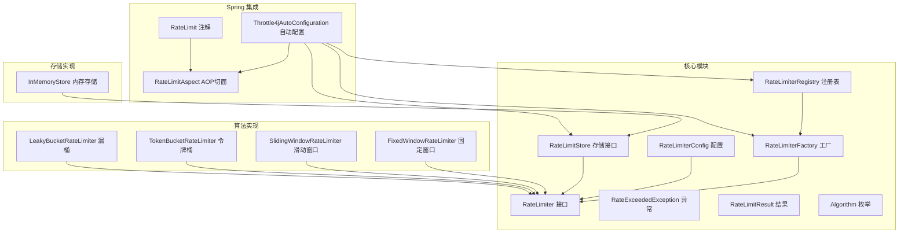
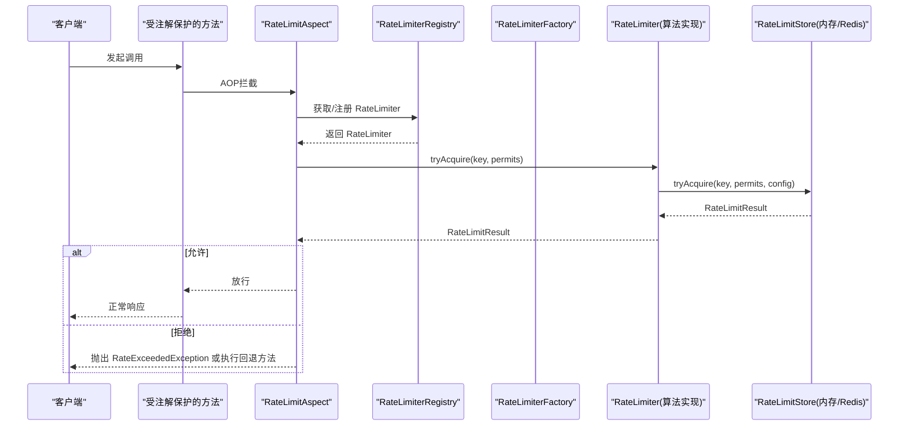
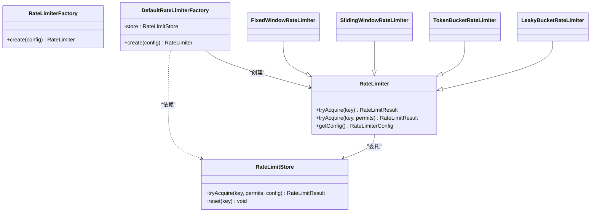
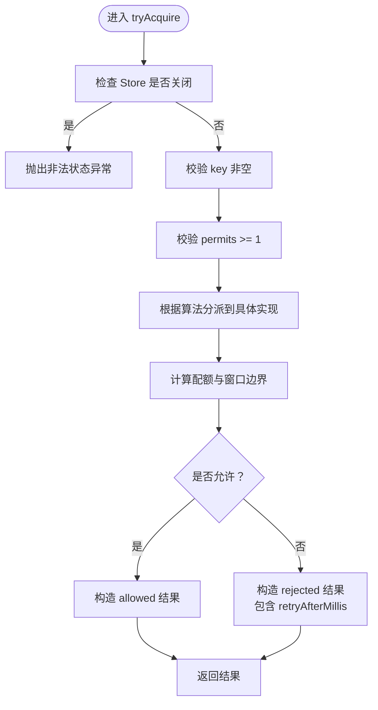
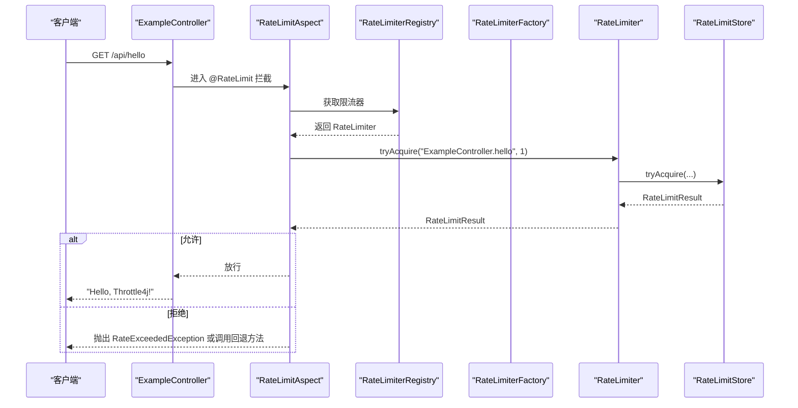
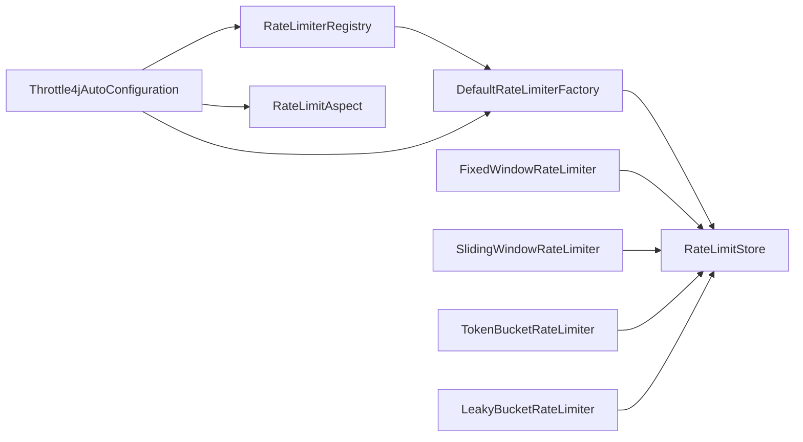

# API参考文档

<cite>
**本文档引用的文件**
- [RateLimiter.java](file://throttle4j-core/src/main/java/com/throttle4j/core/RateLimiter.java)
- [RateLimiterFactory.java](file://throttle4j-core/src/main/java/com/throttle4j/core/RateLimiterFactory.java)
- [RateLimiterRegistry.java](file://throttle4j-core/src/main/java/com/throttle4j/core/RateLimiterRegistry.java)
- [RateLimitResult.java](file://throttle4j-core/src/main/java/com/throttle4j/core/RateLimitResult.java)
- [RateExceededException.java](file://throttle4j-core/src/main/java/com/throttle4j/core/RateExceededException.java)
- [RateLimiterConfig.java](file://throttle4j-core/src/main/java/com/throttle4j/core/RateLimiterConfig.java)
- [Algorithm.java](file://throttle4j-core/src/main/java/com/throttle4j/core/Algorithm.java)
- [DefaultRateLimiterFactory.java](file://throttle4j-core/src/main/java/com/throttle4j/algorithm/DefaultRateLimiterFactory.java)
- [RateLimitStore.java](file://throttle4j-core/src/main/java/com/throttle4j/store/RateLimitStore.java)
- [InMemoryStore.java](file://throttle4j-core/src/main/java/com/throttle4j/store/InMemoryStore.java)
- [FixedWindowRateLimiter.java](file://throttle4j-core/src/main/java/com/throttle4j/algorithm/FixedWindowRateLimiter.java)
- [Throttle4jAutoConfiguration.java](file://throttle4j-spring-boot-starter/src/main/java/com/throttle4j/spring/autoconfigure/Throttle4jAutoConfiguration.java)
- [RateLimit.java](file://throttle4j-spring-boot-starter/src/main/java/com/throttle4j/spring/annotation/RateLimit.java)
- [BasicUsageExample.java](file://throttle4j-examples/src/main/java/com/throttle4j/example/BasicUsageExample.java)
- [ExampleController.java](file://throttle4j-examples/src/main/java/com/throttle4j/example/ExampleController.java)
- [RateLimiterConfigTest.java](file://throttle4j-core/src/test/java/com/throttle4j/core/RateLimiterConfigTest.java)
- [RateLimitResultTest.java](file://throttle4j-core/src/test/java/com/throttle4j/core/RateLimitResultTest.java)
</cite>

## 目录
1. [简介](#简介)
2. [项目结构](#项目结构)
3. [核心组件](#核心组件)
4. [架构总览](#架构总览)
5. [详细组件分析](#详细组件分析)
6. [依赖分析](#依赖分析)
7. [性能考虑](#性能考虑)
8. [故障排除指南](#故障排除指南)
9. [结论](#结论)
10. [附录](#附录)

## 简介
本文件为 throttle4j 的完整 API 参考文档，覆盖核心接口、工厂与注册表、结果数据模型、异常类型、存储抽象以及 Spring Boot 自动配置与注解用法。文档严格基于仓库源码，提供方法签名、参数说明、返回值语义、使用模式与最佳实践，并包含版本兼容性与迁移建议。

## 项目结构
throttle4j 采用模块化设计：
- throttle4j-core：核心 API（限流器接口、配置、结果、异常、工厂、注册表、存储接口与内存实现）
- throttle4j-algorithm：算法实现（固定窗口、滑动窗口、令牌桶、漏桶）
- throttle4j-store：存储抽象与内存实现
- throttle4j-redis：可选的 Redis 存储实现（运行时反射加载）
- throttle4j-spring-boot-starter：Spring Boot 自动配置、注解与 AOP 切面
- throttle4j-examples：示例程序（基础用法与 Spring 控制器）

图表来源
- [RateLimiter.java:1-32](file://throttle4j-core/src/main/java/com/throttle4j/core/RateLimiter.java#L1-L32)
- [RateLimiterFactory.java:1-16](file://throttle4j-core/src/main/java/com/throttle4j/core/RateLimiterFactory.java#L1-L16)
- [RateLimiterRegistry.java:1-61](file://throttle4j-core/src/main/java/com/throttle4j/core/RateLimiterRegistry.java#L1-L61)
- [RateLimitStore.java:1-35](file://throttle4j-core/src/main/java/com/throttle4j/store/RateLimitStore.java#L1-L35)
- [InMemoryStore.java:1-315](file://throttle4j-core/src/main/java/com/throttle4j/store/InMemoryStore.java#L1-L315)
- [DefaultRateLimiterFactory.java:1-39](file://throttle4j-core/src/main/java/com/throttle4j/algorithm/DefaultRateLimiterFactory.java#L1-L39)
- [FixedWindowRateLimiter.java:1-18](file://throttle4j-core/src/main/java/com/throttle4j/algorithm/FixedWindowRateLimiter.java#L1-L18)
- [Throttle4jAutoConfiguration.java:1-132](file://throttle4j-spring-boot-starter/src/main/java/com/throttle4j/spring/autoconfigure/Throttle4jAutoConfiguration.java#L1-L132)
- [RateLimit.java:1-75](file://throttle4j-spring-boot-starter/src/main/java/com/throttle4j/spring/annotation/RateLimit.java#L1-L75)

章节来源
- [RateLimiter.java:1-32](file://throttle4j-core/src/main/java/com/throttle4j/core/RateLimiter.java#L1-L32)
- [RateLimiterFactory.java:1-16](file://throttle4j-core/src/main/java/com/throttle4j/core/RateLimiterFactory.java#L1-L16)
- [RateLimiterRegistry.java:1-61](file://throttle4j-core/src/main/java/com/throttle4j/core/RateLimiterRegistry.java#L1-L61)
- [RateLimitStore.java:1-35](file://throttle4j-core/src/main/java/com/throttle4j/store/RateLimitStore.java#L1-L35)
- [InMemoryStore.java:1-315](file://throttle4j-core/src/main/java/com/throttle4j/store/InMemoryStore.java#L1-L315)
- [DefaultRateLimiterFactory.java:1-39](file://throttle4j-core/src/main/java/com/throttle4j/algorithm/DefaultRateLimiterFactory.java#L1-L39)
- [FixedWindowRateLimiter.java:1-18](file://throttle4j-core/src/main/java/com/throttle4j/algorithm/FixedWindowRateLimiter.java#L1-L18)
- [Throttle4jAutoConfiguration.java:1-132](file://throttle4j-spring-boot-starter/src/main/java/com/throttle4j/spring/autoconfigure/Throttle4jAutoConfiguration.java#L1-L132)
- [RateLimit.java:1-75](file://throttle4j-spring-boot-starter/src/main/java/com/throttle4j/spring/annotation/RateLimit.java#L1-L75)

## 核心组件
本节对核心 API 进行逐项说明，包括接口职责、方法签名、参数与返回值语义。

- RateLimiter 接口
  - 方法
    - tryAcquire(key): 获取单个配额，返回 RateLimitResult
    - tryAcquire(key, permits): 获取指定数量配额，返回 RateLimitResult
    - getConfig(): 返回不可变配置对象
  - 线程安全要求：实现必须线程安全
  - 关键点
    - key 通常表示资源标识（如用户 ID、API 路径）
    - permits 必须为正数（>=1）
    - 返回值由 RateLimitResult 描述允许状态、剩余配额、窗口重置时间、建议重试间隔

- RateLimiterFactory 接口
  - 方法
    - create(config): 基于配置创建 RateLimiter 实例
  - 用途：封装算法选择与 Store 组合

- RateLimiterRegistry 注册表
  - 方法
    - get(name): 获取已注册的限流器或 null
    - register(name, config): 注册并返回限流器；同名首次写入生效（并发安全）
    - remove(name): 移除注册
    - size(): 返回注册数量
  - 线程安全：内部使用并发映射，支持并发读写

- RateLimitResult 数据模型
  - 字段
    - allowed: 是否允许
    - remaining: 当前窗口剩余配额
    - resetAt: 窗口重置的时间戳（毫秒）
    - retryAfterMillis: 建议重试间隔（毫秒；允许时为 0）
  - 工厂方法
    - allowed(remaining, resetAt): 构造“允许”结果
    - rejected(remaining, resetAt, retryAfterMillis): 构造“拒绝”结果
  - 行为要点
    - 所有负值字段在构造时被钳制为 0
    - 允许时 retryAfterMillis 为 0

- RateExceededException 异常
  - 场景：当请求被限流器拒绝时抛出
  - 字段
    - key: 触发限流的键
    - result: 对应的 RateLimitResult
  - 处理建议
    - 在 Web 层捕获并转换为合适的 HTTP 响应（如 429 Too Many Requests）
    - 可结合 Retry-After 或 X-Retry-After 响应头

- RateLimiterConfig 配置
  - 字段
    - algorithm: 算法枚举（FIXED_WINDOW、SLIDING_WINDOW、TOKEN_BUCKET、LEAKY_BUCKET）
    - limit: 窗口内最大配额
    - windowMillis: 窗口时长（毫秒）
    - refillRate: 令牌桶充能速率（tokens/second）
  - 构建器规则
    - 必须设置 algorithm
    - limit 必须 > 0
    - TOKEN_BUCKET：refillRate 必须 > 0；windowMillis 若未显式设置则默认 1000ms
    - 非 TOKEN_BUCKET：windowMillis 必须 > 0
  - 工具方法
    - builder(): 获取构建器
    - windowSeconds(seconds): 将秒转换为毫秒设置到 windowMillis
    - windowMillis(millis): 设置窗口毫秒数
    - refillRate(tokensPerSecond): 设置充能速率

- Algorithm 算法枚举
  - FIXED_WINDOW：固定窗口计数
  - SLIDING_WINDOW：滑动窗口计数
  - TOKEN_BUCKET：令牌桶
  - LEAKY_BUCKET：漏桶

章节来源
- [RateLimiter.java:1-32](file://throttle4j-core/src/main/java/com/throttle4j/core/RateLimiter.java#L1-L32)
- [RateLimiterFactory.java:1-16](file://throttle4j-core/src/main/java/com/throttle4j/core/RateLimiterFactory.java#L1-L16)
- [RateLimiterRegistry.java:1-61](file://throttle4j-core/src/main/java/com/throttle4j/core/RateLimiterRegistry.java#L1-L61)
- [RateLimitResult.java:1-68](file://throttle4j-core/src/main/java/com/throttle4j/core/RateLimitResult.java#L1-L68)
- [RateExceededException.java:1-33](file://throttle4j-core/src/main/java/com/throttle4j/core/RateExceededException.java#L1-L33)
- [RateLimiterConfig.java:1-113](file://throttle4j-core/src/main/java/com/throttle4j/core/RateLimiterConfig.java#L1-L113)
- [Algorithm.java:1-16](file://throttle4j-core/src/main/java/com/throttle4j/core/Algorithm.java#L1-L16)

## 架构总览
throttle4j 的核心架构围绕“配置 + 工厂 + 注册表 + 存储 + 算法实现”的组合展开。默认工厂根据配置选择具体算法实现，算法实现委托共享的 RateLimitStore 执行状态计算与持久化（内存或 Redis）。Spring Boot Starter 提供自动装配与注解驱动的 AOP 切面。

图表来源
- [Throttle4jAutoConfiguration.java:1-132](file://throttle4j-spring-boot-starter/src/main/java/com/throttle4j/spring/autoconfigure/Throttle4jAutoConfiguration.java#L1-L132)
- [RateLimit.java:1-75](file://throttle4j-spring-boot-starter/src/main/java/com/throttle4j/spring/annotation/RateLimit.java#L1-L75)
- [RateLimiterRegistry.java:1-61](file://throttle4j-core/src/main/java/com/throttle4j/core/RateLimiterRegistry.java#L1-L61)
- [DefaultRateLimiterFactory.java:1-39](file://throttle4j-core/src/main/java/com/throttle4j/algorithm/DefaultRateLimiterFactory.java#L1-L39)
- [RateLimitStore.java:1-35](file://throttle4j-core/src/main/java/com/throttle4j/store/RateLimitStore.java#L1-L35)
- [InMemoryStore.java:1-315](file://throttle4j-core/src/main/java/com/throttle4j/store/InMemoryStore.java#L1-L315)

## 详细组件分析

### RateLimiter 接口
- 方法
  - tryAcquire(key): 单次配额申请
  - tryAcquire(key, permits): 指定配额申请
  - getConfig(): 获取配置快照
- 使用建议
  - key 应具备唯一性且粒度合理（如按用户、IP、API 路径）
  - permits 通常为 1，批量消费时需与业务语义一致

章节来源
- [RateLimiter.java:1-32](file://throttle4j-core/src/main/java/com/throttle4j/core/RateLimiter.java#L1-L32)

### RateLimiterFactory 与 DefaultRateLimiterFactory
- RateLimiterFactory
  - create(config): 创建限流器实例
- DefaultRateLimiterFactory
  - 根据配置算法选择具体实现：固定窗口、滑动窗口、令牌桶、漏桶
  - 依赖共享 RateLimitStore 执行状态计算
- 生命周期
  - 工厂由应用注入，随应用启动初始化
  - 通过注册表统一管理限流器实例

图表来源
- [RateLimiterFactory.java:1-16](file://throttle4j-core/src/main/java/com/throttle4j/core/RateLimiterFactory.java#L1-L16)
- [DefaultRateLimiterFactory.java:1-39](file://throttle4j-core/src/main/java/com/throttle4j/algorithm/DefaultRateLimiterFactory.java#L1-L39)
- [RateLimiter.java:1-32](file://throttle4j-core/src/main/java/com/throttle4j/core/RateLimiter.java#L1-L32)
- [FixedWindowRateLimiter.java:1-18](file://throttle4j-core/src/main/java/com/throttle4j/algorithm/FixedWindowRateLimiter.java#L1-L18)
- [RateLimitStore.java:1-35](file://throttle4j-core/src/main/java/com/throttle4j/store/RateLimitStore.java#L1-L35)

章节来源
- [RateLimiterFactory.java:1-16](file://throttle4j-core/src/main/java/com/throttle4j/core/RateLimiterFactory.java#L1-L16)
- [DefaultRateLimiterFactory.java:1-39](file://throttle4j-core/src/main/java/com/throttle4j/algorithm/DefaultRateLimiterFactory.java#L1-L39)

### RateLimiterRegistry 注册表
- 并发安全：基于 ConcurrentHashMap，computeIfAbsent 实现“先写优先”
- 生命周期
  - 注册：register(name, config) 首次写入后返回相同实例
  - 查询：get(name) 返回实例或 null
  - 清理：remove(name) 移除实例
  - 规模：size() 返回当前注册数量
- 使用建议
  - 以业务维度命名（如“user-login”、“api-search”）
  - 与工厂配合，避免重复创建实例

章节来源
- [RateLimiterRegistry.java:1-61](file://throttle4j-core/src/main/java/com/throttle4j/core/RateLimiterRegistry.java#L1-L61)

### RateLimitResult 数据模型
- 字段语义
  - allowed：是否允许本次请求
  - remaining：当前窗口剩余配额
  - resetAt：窗口重置时间戳（毫秒）
  - retryAfterMillis：建议重试间隔（毫秒；允许时为 0）
- 工厂方法
  - allowed(...)：构造允许结果
  - rejected(...)：构造拒绝结果
- 行为约束
  - 构造时对负值进行钳制，确保语义正确

图表来源
- [InMemoryStore.java:68-93](file://throttle4j-core/src/main/java/com/throttle4j/store/InMemoryStore.java#L68-L93)
- [RateLimitResult.java:1-68](file://throttle4j-core/src/main/java/com/throttle4j/core/RateLimitResult.java#L1-L68)

章节来源
- [RateLimitResult.java:1-68](file://throttle4j-core/src/main/java/com/throttle4j/core/RateLimitResult.java#L1-L68)
- [InMemoryStore.java:68-93](file://throttle4j-core/src/main/java/com/throttle4j/store/InMemoryStore.java#L68-L93)

### RateExceededException 异常
- 抛出时机：请求被拒绝时（Spring AOP 或直接调用）
- 字段
  - key：触发限流的键
  - result：对应的 RateLimitResult
- 错误处理建议
  - Web 层捕获并返回 429，携带 Retry-After 或 X-Retry-After
  - 记录审计日志，便于监控与告警

章节来源
- [RateExceededException.java:1-33](file://throttle4j-core/src/main/java/com/throttle4j/core/RateExceededException.java#L1-L33)

### RateLimiterConfig 配置
- 关键属性
  - algorithm：算法类型
  - limit：配额上限
  - windowMillis：窗口时长（毫秒）
  - refillRate：令牌桶充能速率（仅 TOKEN_BUCKET）
- 构建器规则
  - 必填：algorithm
  - TOKEN_BUCKET：refillRate > 0；windowMillis 可默认 1000ms
  - 其他算法：windowMillis > 0
- 测试验证
  - 单元测试覆盖了有效配置、缺失算法、非正 limit、非正 window、缺少 refillRate 等场景

章节来源
- [RateLimiterConfig.java:1-113](file://throttle4j-core/src/main/java/com/throttle4j/core/RateLimiterConfig.java#L1-L113)
- [RateLimiterConfigTest.java:1-63](file://throttle4j-core/src/test/java/com/throttle4j/core/RateLimiterConfigTest.java#L1-L63)

### RateLimitStore 与 InMemoryStore
- RateLimitStore
  - tryAcquire(key, permits, config): 执行配额尝试
  - reset(key): 重置指定键的状态
- InMemoryStore
  - 多算法状态分离存储（固定窗口、滑动窗口、令牌桶、漏桶）
  - 定时清理空闲键（默认 5 分钟空闲、60 秒清理周期）
  - 线程安全：每个算法状态使用同步块保护
  - 生命周期：实现 AutoCloseable，支持优雅关闭

章节来源
- [RateLimitStore.java:1-35](file://throttle4j-core/src/main/java/com/throttle4j/store/RateLimitStore.java#L1-L35)
- [InMemoryStore.java:1-315](file://throttle4j-core/src/main/java/com/throttle4j/store/InMemoryStore.java#L1-L315)

### Spring Boot Starter：注解与自动配置
- @RateLimit 注解
  - 支持 key（SpEL）、limit、window（支持 500ms/1s/30s/1m/1h 等简写）、algorithm、permits、fallbackMethod
  - 默认 key 为 “类名.方法名”
- 自动配置
  - 条件装配：当 throttle4j.enabled=true（默认）时启用
  - Store 选择：优先 Redis（运行时反射加载），若不可用回退到 InMemoryStore
  - Bean 注册：RateLimitStore、RateLimiterFactory、RateLimiterRegistry、RateLimitAspect
- 示例控制器
  - 展示注解在 REST 控制器中的使用方式

图表来源
- [Throttle4jAutoConfiguration.java:1-132](file://throttle4j-spring-boot-starter/src/main/java/com/throttle4j/spring/autoconfigure/Throttle4jAutoConfiguration.java#L1-L132)
- [RateLimit.java:1-75](file://throttle4j-spring-boot-starter/src/main/java/com/throttle4j/spring/annotation/RateLimit.java#L1-L75)
- [ExampleController.java:1-36](file://throttle4j-examples/src/main/java/com/throttle4j/example/ExampleController.java#L1-L36)

章节来源
- [RateLimit.java:1-75](file://throttle4j-spring-boot-starter/src/main/java/com/throttle4j/spring/annotation/RateLimit.java#L1-L75)
- [Throttle4jAutoConfiguration.java:1-132](file://throttle4j-spring-boot-starter/src/main/java/com/throttle4j/spring/autoconfigure/Throttle4jAutoConfiguration.java#L1-L132)
- [ExampleController.java:1-36](file://throttle4j-examples/src/main/java/com/throttle4j/example/ExampleController.java#L1-L36)

## 依赖分析
- 组件耦合
  - DefaultRateLimiterFactory 依赖 RateLimitStore
  - 各算法实现继承自抽象基类并委托 Store
  - RateLimiterRegistry 依赖 RateLimiterFactory
  - Spring 自动配置依赖工厂与注册表，注入 AOP 切面
- 外部依赖
  - Redis 存储为可选模块，通过反射加载，不存在时不破坏默认行为
- 循环依赖
  - 未发现循环依赖；各层职责清晰

图表来源
- [DefaultRateLimiterFactory.java:1-39](file://throttle4j-core/src/main/java/com/throttle4j/algorithm/DefaultRateLimiterFactory.java#L1-L39)
- [RateLimiterRegistry.java:1-61](file://throttle4j-core/src/main/java/com/throttle4j/core/RateLimiterRegistry.java#L1-L61)
- [Throttle4jAutoConfiguration.java:1-132](file://throttle4j-spring-boot-starter/src/main/java/com/throttle4j/spring/autoconfigure/Throttle4jAutoConfiguration.java#L1-L132)

章节来源
- [DefaultRateLimiterFactory.java:1-39](file://throttle4j-core/src/main/java/com/throttle4j/algorithm/DefaultRateLimiterFactory.java#L1-L39)
- [RateLimiterRegistry.java:1-61](file://throttle4j-core/src/main/java/com/throttle4j/core/RateLimiterRegistry.java#L1-L61)
- [Throttle4jAutoConfiguration.java:1-132](file://throttle4j-spring-boot-starter/src/main/java/com/throttle4j/spring/autoconfigure/Throttle4jAutoConfiguration.java#L1-L132)

## 性能考虑
- 线程安全
  - Store 与算法实现均保证线程安全，适合高并发场景
- 内存占用
  - InMemoryStore 会定期清理空闲键，默认 5 分钟空闲、60 秒清理周期
- Redis 选择
  - 在分布式场景下推荐使用 Redis 存储，自动配置会在类路径存在时优先加载
- 算法特性
  - 令牌桶适合突发流量平滑；滑动窗口更贴近真实速率控制；固定窗口简单但存在边界问题；漏桶适合恒定速率输出

## 故障排除指南
- 常见异常与处理
  - RateExceededException：在 Web 层捕获，返回 429 并设置 Retry-After
  - 非法状态异常（Store 关闭）：确保在正确生命周期内使用
- 参数校验失败
  - 配置校验：参考单元测试覆盖的场景，确保 limit > 0、windowMillis > 0、TOKEN_BUCKET 的 refillRate > 0
- 结果解读
  - 允许时 retryAfterMillis 为 0；拒绝时可据此计算重试等待

章节来源
- [RateExceededException.java:1-33](file://throttle4j-core/src/main/java/com/throttle4j/core/RateExceededException.java#L1-L33)
- [RateLimitResultTest.java:1-33](file://throttle4j-core/src/test/java/com/throttle4j/core/RateLimitResultTest.java#L1-L33)
- [RateLimiterConfigTest.java:1-63](file://throttle4j-core/src/test/java/com/throttle4j/core/RateLimiterConfigTest.java#L1-L63)

## 结论
throttle4j 提供了清晰的 API 设计与灵活的扩展点，支持多种限流算法与存储后端。通过工厂与注册表实现统一管理，结合 Spring Boot 自动配置与注解，开发者可以快速落地限流策略。建议在生产环境优先使用 Redis 存储，并结合监控与告警体系完善治理。

## 附录

### API 使用示例与模式
- 编程式使用（核心 API）
  - 参考示例：[BasicUsageExample.java:1-101](file://throttle4j-examples/src/main/java/com/throttle4j/example/BasicUsageExample.java#L1-L101)
  - 步骤
    - 创建 InMemoryStore 并实现 AutoCloseable 生命周期管理
    - 使用 DefaultRateLimiterFactory 创建限流器
    - 通过 tryAcquire(key) 获取 RateLimitResult 并据此放行或拒绝
- 注解式使用（Spring Boot）
  - 参考示例：[ExampleController.java:1-36](file://throttle4j-examples/src/main/java/com/throttle4j/example/ExampleController.java#L1-L36)
  - 步骤
    - 在控制器方法上添加 @RateLimit 注解
    - 自动配置启用后，AOP 切面自动拦截并执行限流逻辑

章节来源
- [BasicUsageExample.java:1-101](file://throttle4j-examples/src/main/java/com/throttle4j/example/BasicUsageExample.java#L1-L101)
- [ExampleController.java:1-36](file://throttle4j-examples/src/main/java/com/throttle4j/example/ExampleController.java#L1-L36)

### 版本兼容性与迁移指南
- 兼容性原则
  - 核心接口与数据模型保持稳定，新增功能以可选模块形式提供
- 迁移建议
  - 从内存迁移到 Redis：确保 Redis 模块在类路径中，自动配置将优先加载 Redis 存储
  - 注解迁移：从手动编程式限流迁移到 @RateLimit 注解，减少样板代码
  - 配置迁移：使用 windowSeconds 简化窗口配置，保持与现有配置的一致性