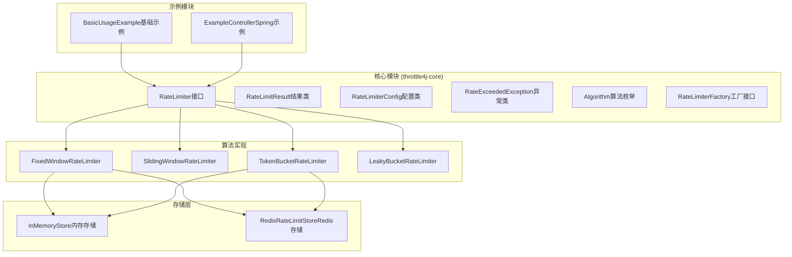
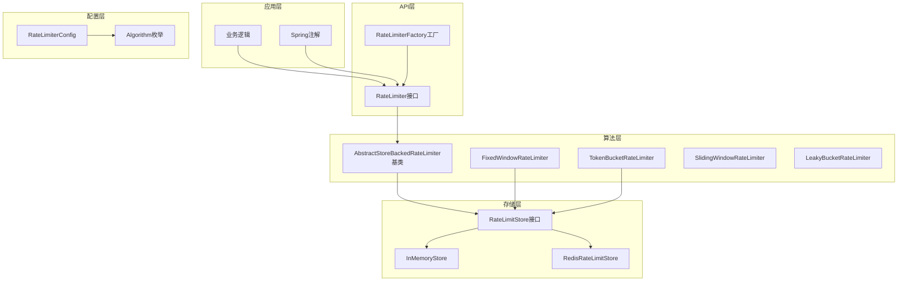
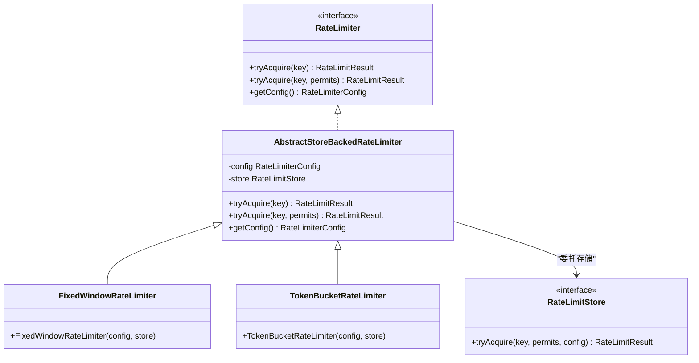
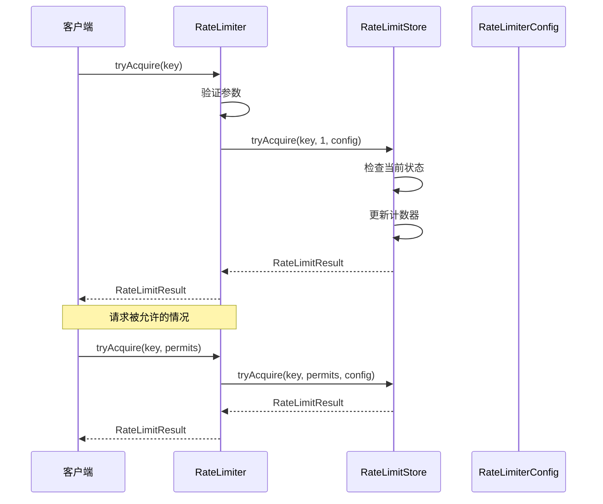
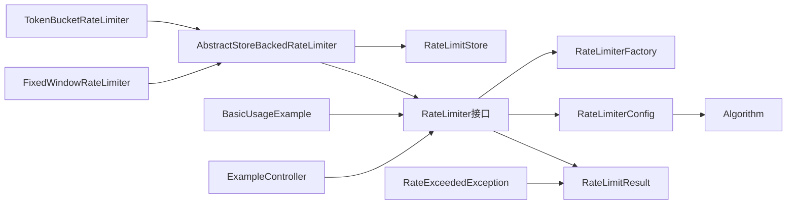
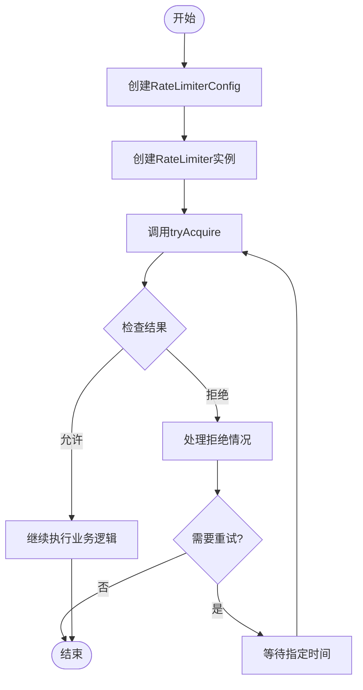
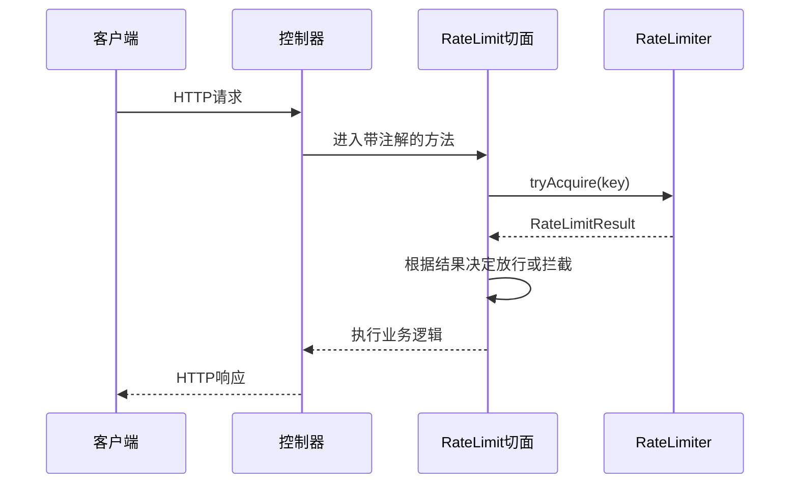

# RateLimiter接口

<cite>
**本文档引用的文件**
- [RateLimiter.java](file://throttle4j-core/src/main/java/com/throttle4j/core/RateLimiter.java)
- [RateLimitResult.java](file://throttle4j-core/src/main/java/com/throttle4j/core/RateLimitResult.java)
- [RateLimiterConfig.java](file://throttle4j-core/src/main/java/com/throttle4j/core/RateLimiterConfig.java)
- [RateExceededException.java](file://throttle4j-core/src/main/java/com/throttle4j/core/RateExceededException.java)
- [RateLimiterFactory.java](file://throttle4j-core/src/main/java/com/throttle4j/core/RateLimiterFactory.java)
- [AbstractStoreBackedRateLimiter.java](file://throttle4j-core/src/main/java/com/throttle4j/algorithm/AbstractStoreBackedRateLimiter.java)
- [Algorithm.java](file://throttle4j-core/src/main/java/com/throttle4j/core/Algorithm.java)
- [FixedWindowRateLimiter.java](file://throttle4j-core/src/main/java/com/throttle4j/algorithm/FixedWindowRateLimiter.java)
- [TokenBucketRateLimiter.java](file://throttle4j-core/src/main/java/com/throttle4j/algorithm/TokenBucketRateLimiter.java)
- [BasicUsageExample.java](file://throttle4j-examples/src/main/java/com/throttle4j/example/BasicUsageExample.java)
- [ExampleController.java](file://throttle4j-examples/src/main/java/com/throttle4j/example/ExampleController.java)
- [RateLimitResultTest.java](file://throttle4j-core/src/test/java/com/throttle4j/core/RateLimitResultTest.java)
- [RateExceededExceptionTest.java](file://throttle4j-core/src/test/java/com/throttle4j/core/RateExceededExceptionTest.java)
</cite>

## 目录
1. [简介](#简介)
2. [项目结构](#项目结构)
3. [核心组件](#核心组件)
4. [架构概览](#架构概览)
5. [详细组件分析](#详细组件分析)
6. [依赖分析](#依赖分析)
7. [性能考虑](#性能考虑)
8. [故障排除指南](#故障排除指南)
9. [结论](#结论)
10. [附录](#附录)

## 简介

RateLimiter接口是throttle4j框架的核心抽象，提供了统一的速率限制API。该接口定义了三个核心方法：`tryAcquire()`、`acquire()`和`getMetadata()`，用于控制资源访问频率。throttle4j支持多种算法实现，包括固定窗口、滑动窗口、令牌桶和漏桶算法，为不同的使用场景提供灵活的解决方案。

## 项目结构

throttle4j项目采用模块化设计，主要包含以下核心模块：

**图表来源**
- [RateLimiter.java:1-32](file://throttle4j-core/src/main/java/com/throttle4j/core/RateLimiter.java#L1-L32)
- [Algorithm.java:1-16](file://throttle4j-core/src/main/java/com/throttle4j/core/Algorithm.java#L1-L16)

**章节来源**
- [RateLimiter.java:1-32](file://throttle4j-core/src/main/java/com/throttle4j/core/RateLimiter.java#L1-L32)
- [Algorithm.java:1-16](file://throttle4j-core/src/main/java/com/throttle4j/core/Algorithm.java#L1-L16)

## 核心组件

### RateLimiter接口

RateLimiter接口定义了统一的速率限制API，要求所有实现必须保证线程安全。

**方法签名与说明**

1. **tryAcquire(String key)**
   - 方法签名：`RateLimitResult tryAcquire(String key)`
   - 参数说明：
     - `key`: 资源标识符（如用户ID、API路径）
   - 返回值：`RateLimitResult`对象，描述请求是否被允许
   - 异常处理：无显式抛出异常
   - 使用场景：非阻塞式的速率限制检查

2. **tryAcquire(String key, int permits)**
   - 方法签名：`RateLimitResult tryAcquire(String key, int permits)`
   - 参数说明：
     - `key`: 资源标识符
     - `permits`: 要获取的许可数量（必须>=1）
   - 返回值：`RateLimitResult`对象
   - 异常处理：当permits<1时抛出`IllegalArgumentException`
   - 使用场景：批量许可获取的非阻塞检查

3. **getConfig()**
   - 方法签名：`RateLimiterConfig getConfig()`
   - 参数说明：无
   - 返回值：不可变的`RateLimiterConfig`配置对象
   - 异常处理：无
   - 使用场景：获取当前限流器的配置信息

**章节来源**
- [RateLimiter.java:10-31](file://throttle4j-core/src/main/java/com/throttle4j/core/RateLimiter.java#L10-L31)

### RateLimitResult结果类

RateLimitResult类封装了速率限制操作的结果信息。

**字段说明**

1. **allowed** (`boolean`)
   - 描述：请求是否被允许
   - 特性：只读，通过`isAllowed()`方法访问

2. **remaining** (`long`)
   - 描述：当前窗口剩余配额
   - 特性：非负数，通过`getRemaining()`方法访问

3. **resetAt** (`long`)
   - 描述：窗口重置的时间戳（毫秒）
   - 特性：通过`getResetAt()`方法访问

4. **retryAfterMillis** (`long`)
   - 描述：建议的重试等待时间（毫秒）
   - 特性：当请求被拒绝时提供重试建议，通过`getRetryAfterMillis()`访问

**工厂方法**

1. **allowed(long remaining, long resetAt)**
   - 描述：创建允许的响应结果
   - 特性：retryAfterMillis自动设置为0

2. **rejected(long remaining, long resetAt, long retryAfterMillis)**
   - 描述：创建拒绝的响应结果
   - 特性：包含重试建议时间

**状态判断逻辑**

- 请求被允许：`result.isAllowed() == true`
- 请求被拒绝：`result.isAllowed() == false`
- 需要重试：`result.getRetryAfterMillis() > 0`

**章节来源**
- [RateLimitResult.java:6-68](file://throttle4j-core/src/main/java/com/throttle4j/core/RateLimitResult.java#L6-L68)

### RateLimiterConfig配置类

RateLimiterConfig类提供了不可变的配置对象，支持链式构建。

**配置参数**

1. **algorithm** (`Algorithm`)
   - 描述：使用的算法类型
   - 可选值：FIXED_WINDOW, SLIDING_WINDOW, TOKEN_BUCKET, LEAKY_BUCKET

2. **limit** (`long`)
   - 描述：每窗口的最大请求数
   - 必须>0

3. **windowMillis** (`long`)
   - 描述：窗口大小（毫秒）
   - 对于TOKEN_BUCKET算法可选，默认1000ms

4. **refillRate** (`long`)
   - 描述：令牌桶的补充速率（令牌/秒）
   - 仅对TOKEN_BUCKET算法必需

**Builder模式**

- 提供链式配置方法
- 在`build()`时进行参数验证
- 支持`windowSeconds()`和`windowMillis()`两种窗口配置方式

**章节来源**
- [RateLimiterConfig.java:8-113](file://throttle4j-core/src/main/java/com/throttle4j/core/RateLimiterConfig.java#L8-L113)

### RateExceededException异常类

当请求被速率限制器拒绝时抛出此异常。

**属性说明**

1. **key** (`String`)
   - 描述：触发限制的资源标识符
   - 通过`getKey()`访问

2. **result** (`RateLimitResult`)
   - 描述：拒绝时的详细结果信息
   - 通过`getResult()`访问

**章节来源**
- [RateExceededException.java:6-33](file://throttle4j-core/src/main/java/com/throttle4j/core/RateExceededException.java#L6-L33)

## 架构概览

throttle4j采用分层架构设计，实现了清晰的关注点分离：

**图表来源**
- [AbstractStoreBackedRateLimiter.java:14-42](file://throttle4j-core/src/main/java/com/throttle4j/algorithm/AbstractStoreBackedRateLimiter.java#L14-L42)
- [Algorithm.java:6-15](file://throttle4j-core/src/main/java/com/throttle4j/core/Algorithm.java#L6-L15)

## 详细组件分析

### AbstractStoreBackedRateLimiter基类

AbstractStoreBackedRateLimiter实现了RateLimiter接口的通用逻辑，将状态管理委托给存储层。

**图表来源**
- [AbstractStoreBackedRateLimiter.java:14-42](file://throttle4j-core/src/main/java/com/throttle4j/algorithm/AbstractStoreBackedRateLimiter.java#L14-L42)
- [FixedWindowRateLimiter.java:12-17](file://throttle4j-core/src/main/java/com/throttle4j/algorithm/FixedWindowRateLimiter.java#L12-L17)
- [TokenBucketRateLimiter.java:10-15](file://throttle4j-core/src/main/java/com/throttle4j/algorithm/TokenBucketRateLimiter.java#L10-L15)

**实现特点**

1. **委托模式**：将具体的速率限制逻辑委托给`RateLimitStore`
2. **参数验证**：在`tryAcquire`中验证许可数量的有效性
3. **默认实现**：提供单许可获取的便捷方法

**章节来源**
- [AbstractStoreBackedRateLimiter.java:14-42](file://throttle4j-core/src/main/java/com/throttle4j/algorithm/AbstractStoreBackedRateLimiter.java#L14-L42)

### 算法实现对比

| 算法 | 特点 | 适用场景 | 性能特征 |
|------|------|----------|----------|
| FixedWindow | 简单计数，窗口边界明显 | 基本限流需求 | 高性能，有突发问题 |
| SlidingWindow | 滑动计数，更平滑 | 需要平滑限流 | 中等性能，更复杂 |
| TokenBucket | 令牌补充机制 | 突发流量处理 | 高性能，支持突发 |
| LeakyBucket | 漏洞机制，恒定输出 | 流量整形 | 中等性能 |

**章节来源**
- [Algorithm.java:6-15](file://throttle4j-core/src/main/java/com/throttle4j/core/Algorithm.java#L6-L15)

### 使用流程序列图

**图表来源**
- [AbstractStoreBackedRateLimiter.java:24-35](file://throttle4j-core/src/main/java/com/throttle4j/algorithm/AbstractStoreBackedRateLimiter.java#L24-L35)

## 依赖分析

**图表来源**
- [RateLimiter.java:8-31](file://throttle4j-core/src/main/java/com/throttle4j/core/RateLimiter.java#L8-L31)
- [AbstractStoreBackedRateLimiter.java:14-22](file://throttle4j-core/src/main/java/com/throttle4j/algorithm/AbstractStoreBackedRateLimiter.java#L14-L22)

**依赖关系分析**

1. **高内聚低耦合**：接口与实现分离，算法与存储分离
2. **可扩展性**：通过工厂模式和存储接口支持新算法和存储后端
3. **线程安全**：接口文档明确要求实现必须线程安全

**章节来源**
- [RateLimiterFactory.java:6-15](file://throttle4j-core/src/main/java/com/throttle4j/core/RateLimiterFactory.java#L6-L15)

## 性能考虑

### 线程安全性保证

- 接口文档明确要求实现必须保证线程安全
- 存储层实现需要处理并发访问
- 配置对象为不可变对象，天然线程安全

### 性能特征对比

| 组件 | 时间复杂度 | 空间复杂度 | 并发特性 |
|------|------------|------------|----------|
| tryAcquire | O(1) | O(1) | 线程安全 |
| getConfig | O(1) | O(1) | 线程安全 |
| 存储操作 | 取决于存储实现 | 取决于存储实现 | 取决于存储实现 |

### 最佳实践

1. **批量获取**：使用`tryAcquire(key, permits)`减少调用次数
2. **缓存配置**：复用`RateLimiterConfig`实例
3. **合理窗口**：根据业务场景选择合适的算法和窗口大小
4. **异常处理**：正确处理`RateExceededException`

## 故障排除指南

### 常见问题与解决方案

1. **IllegalArgumentException: permits must be >= 1**
   - 原因：传递了无效的许可数量
   - 解决：确保permits参数>=1

2. **配置验证失败**
   - 原因：配置参数不符合算法要求
   - 解决：检查算法特定的参数约束

3. **线程安全问题**
   - 原因：多线程环境下共享状态不一致
   - 解决：使用框架提供的线程安全实现

**章节来源**
- [AbstractStoreBackedRateLimiter.java:31-33](file://throttle4j-core/src/main/java/com/throttle4j/algorithm/AbstractStoreBackedRateLimiter.java#L31-L33)
- [RateLimiterConfig.java:92-108](file://throttle4j-core/src/main/java/com/throttle4j/core/RateLimiterConfig.java#L92-L108)

## 结论

RateLimiter接口提供了简洁而强大的速率限制API，通过统一的接口抽象支持多种算法实现。其设计体现了良好的面向对象原则：接口与实现分离、关注点分离、可扩展性。配合丰富的算法实现和存储后端，throttle4j能够满足从简单到复杂的各种速率限制需求。

## 附录

### 完整使用示例

#### 基础使用模式

#### Spring集成使用模式

**图表来源**
- [ExampleController.java:16-28](file://throttle4j-examples/src/main/java/com/throttle4j/example/ExampleController.java#L16-L28)

### 最佳实践建议

1. **选择合适的算法**：根据业务需求选择最适合的算法
2. **合理配置参数**：平衡用户体验和系统保护
3. **监控和告警**：建立限流指标监控体系
4. **优雅降级**：在极端情况下提供合理的降级策略
5. **测试验证**：充分测试不同场景下的行为表现

**章节来源**
- [BasicUsageExample.java:46-100](file://throttle4j-examples/src/main/java/com/throttle4j/example/BasicUsageExample.java#L46-L100)