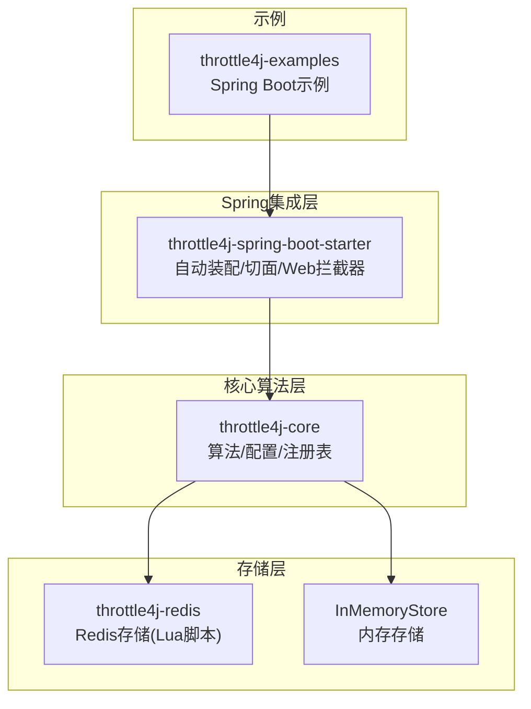
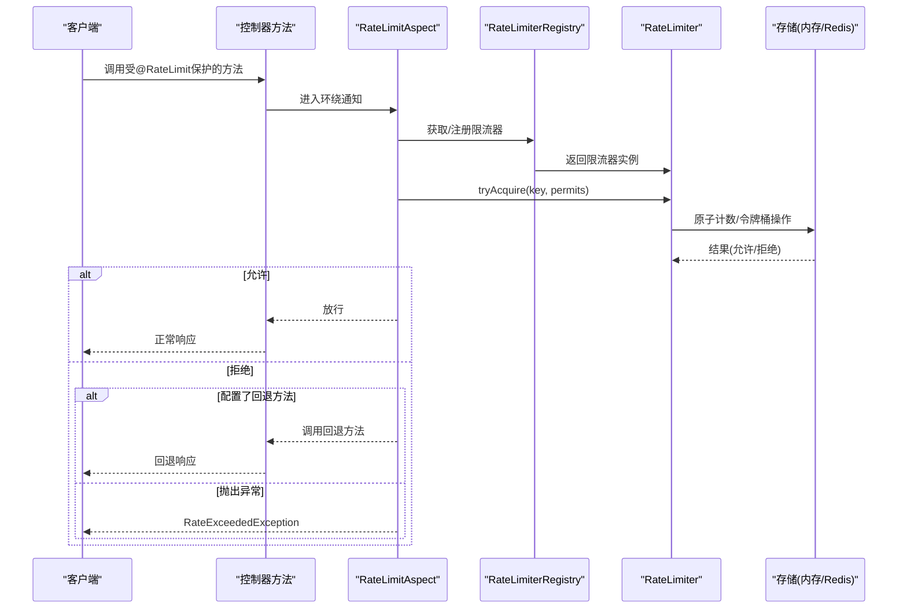
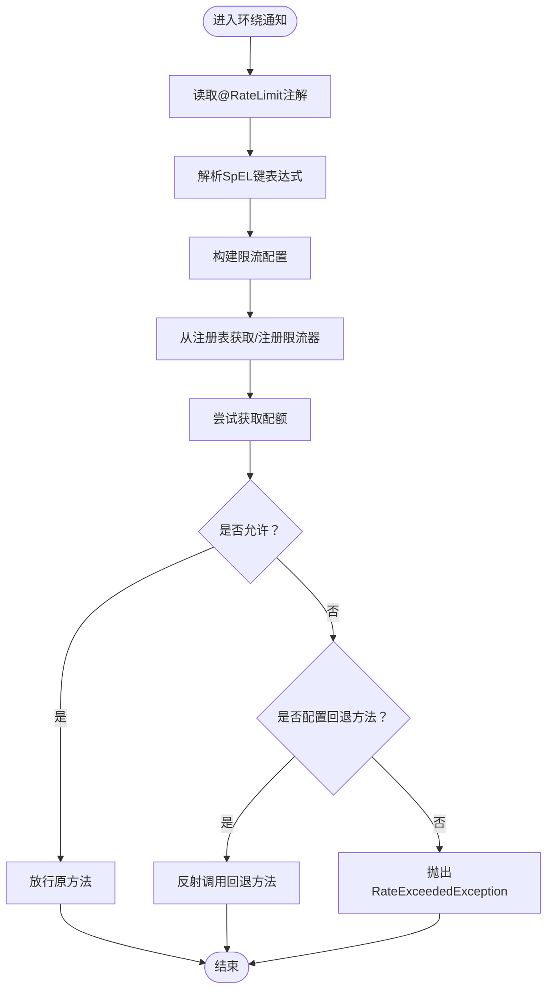
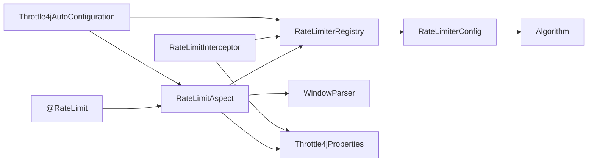

# Spring Boot注解API

<cite>
**本文引用的文件**
- [RateLimit.java](file://throttle4j-spring-boot-starter/src/main/java/com/throttle4j/spring/annotation/RateLimit.java)
- [RateLimitAspect.java](file://throttle4j-spring-boot-starter/src/main/java/com/throttle4j/spring/aop/RateLimitAspect.java)
- [Throttle4jAutoConfiguration.java](file://throttle4j-spring-boot-starter/src/main/java/com/throttle4j/spring/autoconfigure/Throttle4jAutoConfiguration.java)
- [Throttle4jProperties.java](file://throttle4j-spring-boot-starter/src/main/java/com/throttle4j/spring/autoconfigure/Throttle4jProperties.java)
- [WindowParser.java](file://throttle4j-spring-boot-starter/src/main/java/com/throttle4j/spring/util/WindowParser.java)
- [RateLimitInterceptor.java](file://throttle4j-spring-boot-starter/src/main/java/com/throttle4j/spring/web/RateLimitInterceptor.java)
- [Algorithm.java](file://throttle4j-core/src/main/java/com/throttle4j/core/Algorithm.java)
- [RateLimiterConfig.java](file://throttle4j-core/src/main/java/com/throttle4j/core/RateLimiterConfig.java)
- [ExampleController.java](file://throttle4j-examples/src/main/java/com/throttle4j/example/ExampleController.java)
- [application.yml](file://throttle4j-examples/src/main/resources/application.yml)
- [SpringBootExampleApplication.java](file://throttle4j-examples/src/main/java/com/throttle4j/example/SpringBootExampleApplication.java)
- [README.md](file://README.md)
</cite>

## 目录
1. [简介](#简介)
2. [项目结构](#项目结构)
3. [核心组件](#核心组件)
4. [架构总览](#架构总览)
5. [详细组件分析](#详细组件分析)
6. [依赖关系分析](#依赖关系分析)
7. [性能与特性](#性能与特性)
8. [故障排查指南](#故障排查指南)
9. [结论](#结论)
10. [附录：使用示例与配置模板](#附录使用示例与配置模板)

## 简介
本文件面向Spring Boot用户，系统化梳理throttle4j提供的@RateLimit注解API，覆盖注解属性、使用位置与作用范围、AOP切面工作原理与执行顺序、注解驱动的限流实现细节与性能特征，并提供可直接落地的使用示例与配置模板。同时说明注解与Spring AOP特性的兼容性与冲突处理策略，以及配置校验规则与错误提示。

## 项目结构
throttle4j采用模块化设计，核心能力由throttle4j-core提供算法与配置模型，throttle4j-spring-boot-starter提供Spring集成（自动装配、AOP切面、Web拦截器），throttle4j-redis提供分布式存储，examples提供可运行示例。

图表来源
- [Throttle4jAutoConfiguration.java:27-131](file://throttle4j-spring-boot-starter/src/main/java/com/throttle4j/spring/autoconfigure/Throttle4jAutoConfiguration.java#L27-L131)
- [RateLimitInterceptor.java:26-125](file://throttle4j-spring-boot-starter/src/main/java/com/throttle4j/spring/web/RateLimitInterceptor.java#L26-L125)
- [RateLimitAspect.java:40-185](file://throttle4j-spring-boot-starter/src/main/java/com/throttle4j/spring/aop/RateLimitAspect.java#L40-L185)

章节来源
- [README.md:76-101](file://README.md#L76-L101)

## 核心组件
- @RateLimit注解：声明式限流注解，支持方法级限流配置。
- RateLimitAspect：基于AOP的环绕通知，拦截带@RateLimit的方法调用，委托给共享的RateLimiterRegistry获取或注册限流器并执行限流判断。
- RateLimiterRegistry：全局限流器注册表，按key管理限流器实例。
- RateLimiterConfig：限流配置对象，定义算法、配额、窗口、令牌桶补给速率等。
- Throttle4jAutoConfiguration：自动装配，注册默认存储、工厂、注册表与AOP切面。
- Throttle4jProperties：配置属性，支持启用开关、默认算法、默认配额、默认窗口、存储类型、Redis连接参数等。
- WindowParser：时间窗口字符串解析器，支持毫秒(ms)、秒(s)、分(m)、时(h)、日(d)等后缀。
- RateLimitInterceptor：Web层拦截器，基于URL路径进行全局限流，返回标准响应头与429状态码。

章节来源
- [RateLimit.java:23-74](file://throttle4j-spring-boot-starter/src/main/java/com/throttle4j/spring/annotation/RateLimit.java#L23-L74)
- [RateLimitAspect.java:40-185](file://throttle4j-spring-boot-starter/src/main/java/com/throttle4j/spring/aop/RateLimitAspect.java#L40-L185)
- [Throttle4jAutoConfiguration.java:27-131](file://throttle4j-spring-boot-starter/src/main/java/com/throttle4j/spring/autoconfigure/Throttle4jAutoConfiguration.java#L27-L131)
- [Throttle4jProperties.java:9-201](file://throttle4j-spring-boot-starter/src/main/java/com/throttle4j/spring/autoconfigure/Throttle4jProperties.java#L9-L201)
- [WindowParser.java:20-75](file://throttle4j-spring-boot-starter/src/main/java/com/throttle4j/spring/util/WindowParser.java#L20-L75)
- [RateLimitInterceptor.java:26-125](file://throttle4j-spring-boot-starter/src/main/java/com/throttle4j/spring/web/RateLimitInterceptor.java#L26-L125)
- [Algorithm.java:6-15](file://throttle4j-core/src/main/java/com/throttle4j/core/Algorithm.java#L6-L15)
- [RateLimiterConfig.java:8-112](file://throttle4j-core/src/main/java/com/throttle4j/core/RateLimiterConfig.java#L8-L112)

## 架构总览
@RateLimit注解通过AOP切面在方法调用前进行限流判断；Web层可通过拦截器对请求路径进行全局限流。自动装配负责注册默认存储、工厂、注册表与切面，确保零配置即可使用。

图表来源
- [RateLimitAspect.java:68-91](file://throttle4j-spring-boot-starter/src/main/java/com/throttle4j/spring/aop/RateLimitAspect.java#L68-L91)
- [Throttle4jAutoConfiguration.java:115-130](file://throttle4j-spring-boot-starter/src/main/java/com/throttle4j/spring/autoconfigure/Throttle4jAutoConfiguration.java#L115-L130)

## 详细组件分析

### @RateLimit注解详解
- 使用位置与作用范围
  - 仅支持方法级别（METHOD），不支持类级别。若需类级别统一限流，可在每个方法上分别标注，或通过Web拦截器实现URL级全局限流。
- 属性参数
  - key：限流键表达式，支持SpEL，如“#userId”、“'user:' + #userId”。为空时默认为“类名.方法名”。
  - limit：窗口内最大请求数，默认100。
  - window：时间窗口字符串，支持“500ms”、“1s”、“30s”、“1m”、“1h”等，解析为毫秒。
  - algorithm：算法枚举，默认滑动窗口（SLIDING_WINDOW）。
  - permits：每次调用消耗的配额，默认1。
  - fallbackMethod：当被拒绝时调用的同Bean回退方法名（签名需一致），为空则抛出RateExceededException。
- 注解行为
  - 若限流通过，放行目标方法；否则优先尝试回退方法，若未配置则抛出RateExceededException。

章节来源
- [RateLimit.java:23-74](file://throttle4j-spring-boot-starter/src/main/java/com/throttle4j/spring/annotation/RateLimit.java#L23-L74)
- [Algorithm.java:6-15](file://throttle4j-core/src/main/java/com/throttle4j/core/Algorithm.java#L6-L15)

### AOP切面工作原理与执行顺序
- 切点匹配：@annotation(com.throttle4j.spring.annotation.RateLimit)
- 执行顺序
  1) 解析注解与SpEL键表达式，生成实际限流键。
  2) 从注册表获取或构建限流器配置并注册限流器。
  3) 尝试获取配额（permits），若允许则放行原方法；否则：
     - 若配置了fallbackMethod，则反射调用同Bean的回退方法；
     - 否则抛出RateExceededException。
- 关键实现要点
  - 使用ConcurrentHashMap缓存SpEL表达式以提升性能。
  - 对SpEL求值失败时降级为方法签名作为键。
  - 令牌桶算法在未显式设置refillRate时，按limit/window推导默认补给速率。

图表来源
- [RateLimitAspect.java:68-91](file://throttle4j-spring-boot-starter/src/main/java/com/throttle4j/spring/aop/RateLimitAspect.java#L68-L91)
- [RateLimitAspect.java:117-137](file://throttle4j-spring-boot-starter/src/main/java/com/throttle4j/spring/aop/RateLimitAspect.java#L117-L137)
- [RateLimitAspect.java:155-171](file://throttle4j-spring-boot-starter/src/main/java/com/throttle4j/spring/aop/RateLimitAspect.java#L155-L171)

章节来源
- [RateLimitAspect.java:40-185](file://throttle4j-spring-boot-starter/src/main/java/com/throttle4j/spring/aop/RateLimitAspect.java#L40-L185)

### 自动装配与配置
- Throttle4jAutoConfiguration
  - 条件化注册：默认启用，可通过属性关闭；当缺少对应Bean时才注册。
  - 存储选择：MEMORY或REDIS（不存在Redis模块时回退到内存存储）。
  - 工厂与注册表：默认工厂+注册表组合。
  - AOP切面：注册RateLimitAspect。
- Throttle4jProperties
  - enabled：主开关，默认true。
  - defaultAlgorithm/defaultLimit/defaultWindow/defaultRefillRate：全局默认限流参数。
  - storeType：MEMORY/REDIS。
  - redis：host/port/password/database/keyPrefix等。
  - web：includePatterns/excludePatterns等（用于Web拦截器）。

章节来源
- [Throttle4jAutoConfiguration.java:27-131](file://throttle4j-spring-boot-starter/src/main/java/com/throttle4j/spring/autoconfigure/Throttle4jAutoConfiguration.java#L27-L131)
- [Throttle4jProperties.java:9-201](file://throttle4j-spring-boot-starter/src/main/java/com/throttle4j/spring/autoconfigure/Throttle4jProperties.java#L9-L201)

### Web拦截器与全局限流
- RateLimitInterceptor
  - 基于请求方法+URI构造键，全局生效。
  - 设置标准响应头：X-RateLimit-Limit、X-RateLimit-Remaining、X-RateLimit-Reset、Retry-After。
  - 拒绝时返回429状态码。
  - 默认算法与窗口来自Throttle4jProperties，令牌桶补给速率可显式设置或推导。

章节来源
- [RateLimitInterceptor.java:26-125](file://throttle4j-spring-boot-starter/src/main/java/com/throttle4j/spring/web/RateLimitInterceptor.java#L26-L125)
- [Throttle4jProperties.java:113-147](file://throttle4j-spring-boot-starter/src/main/java/com/throttle4j/spring/autoconfigure/Throttle4jProperties.java#L113-L147)

### 时间窗口解析器
- WindowParser
  - 支持“数字+单位”的字符串，单位大小写不敏感。
  - 不带单位时按毫秒处理。
  - 校验输入合法性与正数约束，非法格式抛出异常。

章节来源
- [WindowParser.java:20-75](file://throttle4j-spring-boot-starter/src/main/java/com/throttle4j/spring/util/WindowParser.java#L20-L75)

### 算法与配置模型
- Algorithm：FIXED_WINDOW、SLIDING_WINDOW、TOKEN_BUCKET、LEAKY_BUCKET。
- RateLimiterConfig：不可变配置，Builder模式构建并校验：
  - 必须设置算法与limit>0。
  - TOKEN_BUCKET必须设置refillRate>0且windowMillis>0（若未设置则默认1s）。
  - 其他算法要求windowMillis>0。

章节来源
- [Algorithm.java:6-15](file://throttle4j-core/src/main/java/com/throttle4j/core/Algorithm.java#L6-L15)
- [RateLimiterConfig.java:8-112](file://throttle4j-core/src/main/java/com/throttle4j/core/RateLimiterConfig.java#L8-L112)

## 依赖关系分析
- 组件耦合
  - RateLimitAspect依赖RateLimiterRegistry、Throttle4jProperties、WindowParser、SpEL表达式解析。
  - Throttle4jAutoConfiguration依赖存储实现、工厂与注册表，条件化注入避免冲突。
  - RateLimitInterceptor依赖RateLimiterRegistry与Throttle4jProperties。
- 外部依赖
  - Spring AOP（AspectJ）、Spring Web MVC、Redis（可选）。
- 可能的循环依赖
  - 当前模块间无直接循环依赖，自动装配通过条件注解避免重复注册。

图表来源
- [RateLimitAspect.java:40-59](file://throttle4j-spring-boot-starter/src/main/java/com/throttle4j/spring/aop/RateLimitAspect.java#L40-L59)
- [Throttle4jAutoConfiguration.java:115-130](file://throttle4j-spring-boot-starter/src/main/java/com/throttle4j/spring/autoconfigure/Throttle4jAutoConfiguration.java#L115-L130)
- [RateLimitInterceptor.java:39-49](file://throttle4j-spring-boot-starter/src/main/java/com/throttle4j/spring/web/RateLimitInterceptor.java#L39-L49)

## 性能与特性
- 线程安全与无锁
  - 核心算法基于原子操作与Lua脚本保证并发正确性，适合高并发场景。
- 计算复杂度
  - 限流判断通常为O(1)，注册表按key查找为平均O(1)。
- 缓存优化
  - SpEL表达式解析结果缓存，降低重复解析开销。
- 分布式一致性
  - 内存存储适用于单节点；Redis存储提供跨进程/跨节点一致性，Lua脚本保障原子性。
- 响应头与可观测性
  - Web拦截器输出标准限流头，便于客户端重试策略与监控。

章节来源
- [README.md:16-22](file://README.md#L16-L22)
- [RateLimitInterceptor.java:120-124](file://throttle4j-spring-boot-starter/src/main/java/com/throttle4j/spring/web/RateLimitInterceptor.java#L120-L124)

## 故障排查指南
- 常见问题与定位
  - 注解无效：确认@EnableAspectJAutoProxy已启用，且目标Bean为Spring管理。
  - 键解析失败：SpEL表达式错误或参数缺失，会降级为方法签名作为键；检查表达式与参数名。
  - 回退方法未生效：同Bean中存在签名完全一致的回退方法，且可见性允许；否则抛出RateExceededException。
  - Redis不可用：自动回退至内存存储并告警；检查Redis连接参数与网络。
  - 配置校验失败：limit<=0、TOKEN_BUCKET缺少refillRate、windowMillis<=0等均会抛出异常。
- 排查步骤
  - 查看日志中的警告信息（如键解析失败、回退方法未找到、Redis不可用）。
  - 在测试环境中最小化复现，逐步调整@RateLimit参数与SpEL表达式。
  - 使用Web拦截器观察标准响应头，确认限流策略是否按预期生效。

章节来源
- [RateLimitAspect.java:132-136](file://throttle4j-spring-boot-starter/src/main/java/com/throttle4j/spring/aop/RateLimitAspect.java#L132-L136)
- [RateLimitAspect.java:160-164](file://throttle4j-spring-boot-starter/src/main/java/com/throttle4j/spring/aop/RateLimitAspect.java#L160-L164)
- [Throttle4jAutoConfiguration.java:53-56](file://throttle4j-spring-boot-starter/src/main/java/com/throttle4j/spring/autoconfigure/Throttle4jAutoConfiguration.java#L53-L56)
- [RateLimiterConfig.java:92-110](file://throttle4j-core/src/main/java/com/throttle4j/core/RateLimiterConfig.java#L92-L110)

## 结论
@RateLimit注解提供了声明式的、低侵入的限流能力，结合AOP切面与自动装配，能够在Spring应用中快速落地。配合Web拦截器与标准响应头，既满足方法级精细化控制，也支持URL级全局限流。通过合理的算法选择与配置校验，可兼顾公平性、吞吐量与资源占用。

## 附录：使用示例与配置模板

### 示例一：REST接口限流（方法级）
- 控制器示例：在方法上标注@RateLimit，指定limit、window、algorithm等参数。
- 示例入口：SpringBootExampleApplication启动示例服务。

章节来源
- [ExampleController.java:14-35](file://throttle4j-examples/src/main/java/com/throttle4j/example/ExampleController.java#L14-L35)
- [SpringBootExampleApplication.java:12-18](file://throttle4j-examples/src/main/java/com/throttle4j/example/SpringBootExampleApplication.java#L12-L18)

### 示例二：Web拦截器全局限流
- 启用web拦截器后，所有匹配路径的请求将按全局默认策略限流。
- 标准响应头：X-RateLimit-Limit、X-RateLimit-Remaining、X-RateLimit-Reset、Retry-After。

章节来源
- [Throttle4jProperties.java:113-147](file://throttle4j-spring-boot-starter/src/main/java/com/throttle4j/spring/autoconfigure/Throttle4jProperties.java#L113-L147)
- [RateLimitInterceptor.java:55-79](file://throttle4j-spring-boot-starter/src/main/java/com/throttle4j/spring/web/RateLimitInterceptor.java#L55-L79)

### 配置模板（application.yml）
- 基础配置：启用开关、默认算法、默认配额、默认窗口、存储类型。
- Redis配置：主机、端口、密码、数据库、键前缀（当storeType=REDIS时生效）。

章节来源
- [application.yml:4-9](file://throttle4j-examples/src/main/resources/application.yml#L4-L9)
- [Throttle4jProperties.java:153-200](file://throttle4j-spring-boot-starter/src/main/java/com/throttle4j/spring/autoconfigure/Throttle4jProperties.java#L153-L200)

### 注解参数速查
- key：SpEL表达式或字面量；为空时默认“类名.方法名”。
- limit：窗口内最大请求数；必须>0。
- window：时间窗口字符串；支持ms/s/m/h/d；必须>0。
- algorithm：算法枚举；默认SLIDING_WINDOW。
- permits：每次调用消耗配额；默认1。
- fallbackMethod：回退方法名；需同Bean且签名一致。

章节来源
- [RateLimit.java:26-74](file://throttle4j-spring-boot-starter/src/main/java/com/throttle4j/spring/annotation/RateLimit.java#L26-L74)
- [Algorithm.java:6-15](file://throttle4j-core/src/main/java/com/throttle4j/core/Algorithm.java#L6-L15)

### 与Spring AOP的兼容性与冲突处理
- 兼容性
  - 需要@EnableAspectJAutoProxy启用AOP代理；@RateLimit仅作用于Spring管理的Bean。
  - 与事务、异常处理等AOP特性可共存，但需注意执行顺序与异常传播。
- 冲突处理
  - 多个切面叠加时，建议明确优先级与切入点范围，避免重复限流。
  - 若同时使用Web拦截器与@RateLimit，注意键空间隔离与策略差异。

章节来源
- [RateLimitAspect.java:68-75](file://throttle4j-spring-boot-starter/src/main/java/com/throttle4j/spring/aop/RateLimitAspect.java#L68-L75)
- [Throttle4jAutoConfiguration.java:27-29](file://throttle4j-spring-boot-starter/src/main/java/com/throttle4j/spring/autoconfigure/Throttle4jAutoConfiguration.java#L27-L29)