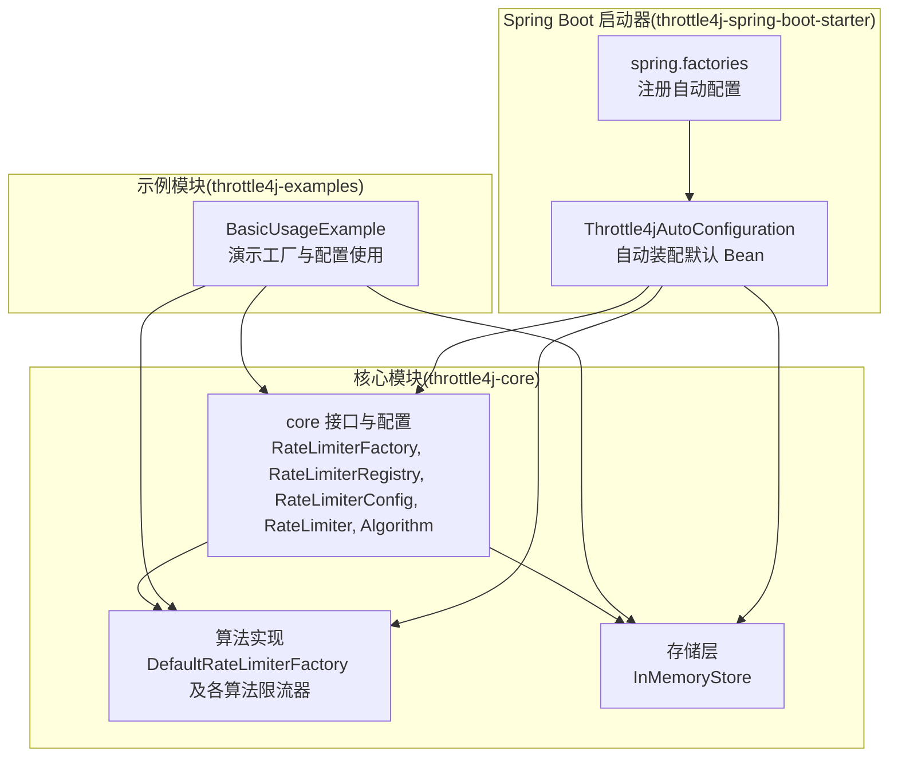
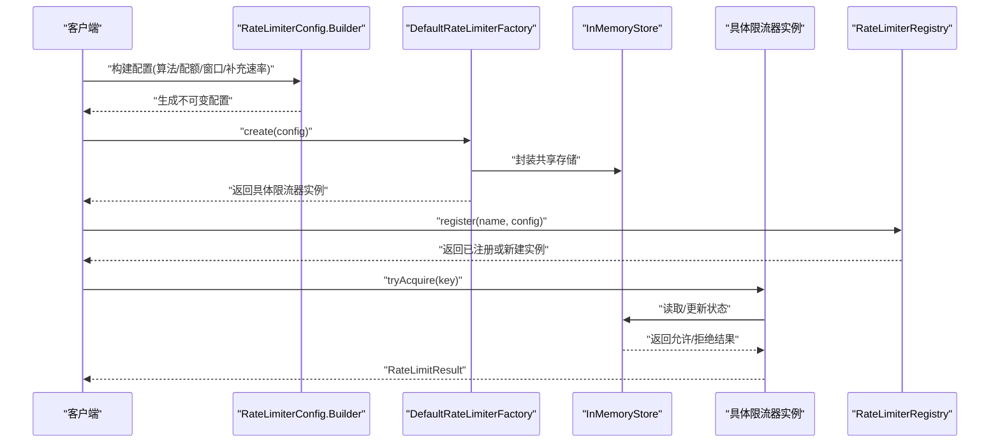
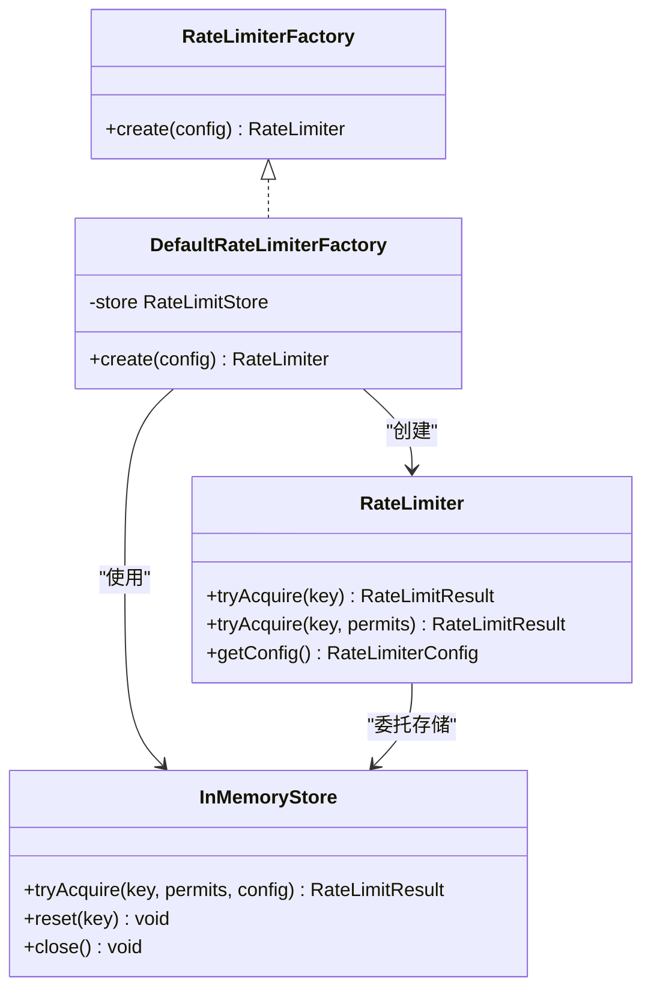
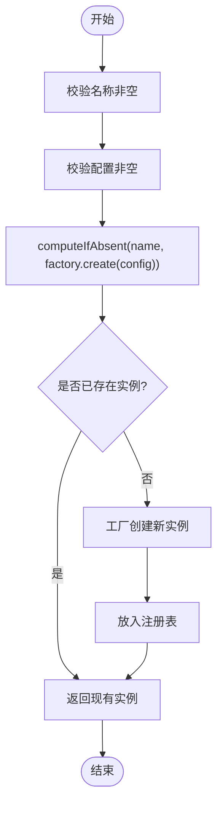
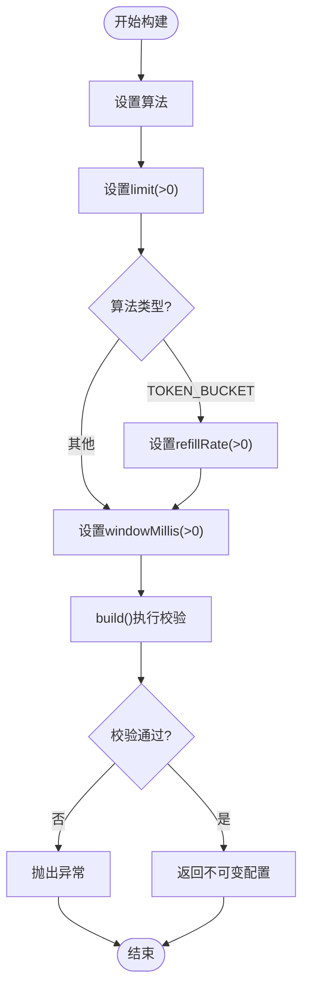
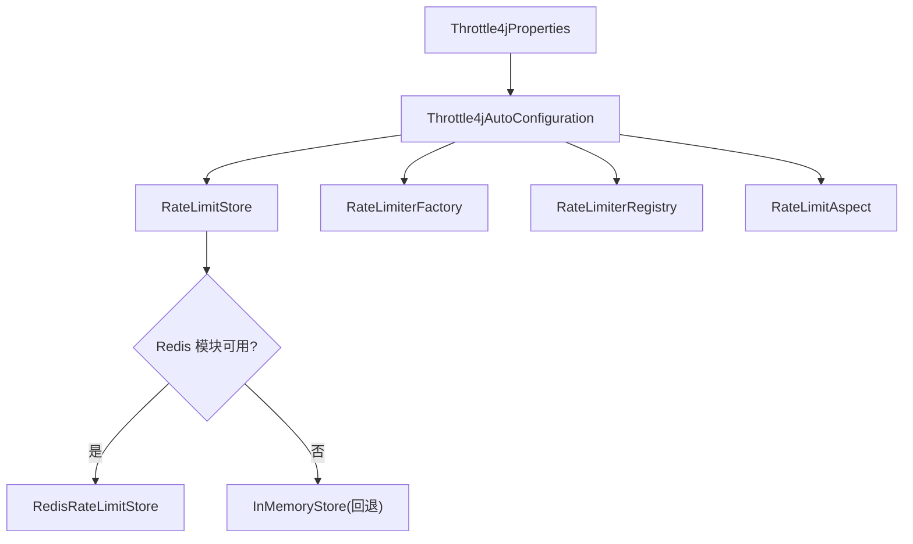
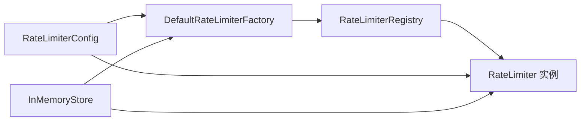

# 工厂与注册表API

<cite>
**本文档引用的文件**
- [RateLimiterFactory.java](file://throttle4j-core/src/main/java/com/throttle4j/core/RateLimiterFactory.java)
- [DefaultRateLimiterFactory.java](file://throttle4j-core/src/main/java/com/throttle4j/algorithm/DefaultRateLimiterFactory.java)
- [RateLimiterRegistry.java](file://throttle4j-core/src/main/java/com/throttle4j/core/RateLimiterRegistry.java)
- [RateLimiterConfig.java](file://throttle4j-core/src/main/java/com/throttle4j/core/RateLimiterConfig.java)
- [RateLimiter.java](file://throttle4j-core/src/main/java/com/throttle4j/core/RateLimiter.java)
- [Algorithm.java](file://throttle4j-core/src/main/java/com/throttle4j/core/Algorithm.java)
- [InMemoryStore.java](file://throttle4j-core/src/main/java/com/throttle4j/store/InMemoryStore.java)
- [BasicUsageExample.java](file://throttle4j-examples/src/main/java/com/throttle4j/example/BasicUsageExample.java)
- [Throttle4jAutoConfiguration.java](file://throttle4j-spring-boot-starter/src/main/java/com/throttle4j/spring/autoconfigure/Throttle4jAutoConfiguration.java)
- [spring.factories](file://throttle4j-spring-boot-starter/src/main/resources/META-INF/spring.factories)
- [RateLimiterRegistryTest.java](file://throttle4j-core/src/test/java/com/throttle4j/core/RateLimiterRegistryTest.java)
- [RateLimiterConfigTest.java](file://throttle4j-core/src/test/java/com/throttle4j/core/RateLimiterConfigTest.java)
</cite>

## 目录
1. [简介](#简介)
2. [项目结构](#项目结构)
3. [核心组件](#核心组件)
4. [架构总览](#架构总览)
5. [详细组件分析](#详细组件分析)
6. [依赖关系分析](#依赖关系分析)
7. [性能考量](#性能考量)
8. [故障排查指南](#故障排查指南)
9. [结论](#结论)
10. [附录](#附录)

## 简介
本文件系统性地梳理了 throttle4j 的工厂与注册表 API，重点覆盖以下主题：
- RateLimiterFactory 的 create()、builder() 等工厂方法的使用方式与配置选项
- RateLimiterRegistry 的注册、查找与生命周期管理
- RateLimiterConfig 的配置参数与构建模式
- 完整的配置示例与最佳实践
- 工厂模式的设计理念与使用场景
- 单例管理与资源清理注意事项
- 从配置到实例创建的完整流程说明

## 项目结构
throttle4j 采用模块化设计，核心能力集中在 throttle4j-core 模块，Spring Boot 自动装配位于 throttle4j-spring-boot-starter 模块，示例在 throttle4j-examples 中展示。

图表来源
- [RateLimiterFactory.java:1-16](file://throttle4j-core/src/main/java/com/throttle4j/core/RateLimiterFactory.java#L1-L16)
- [DefaultRateLimiterFactory.java:1-39](file://throttle4j-core/src/main/java/com/throttle4j/algorithm/DefaultRateLimiterFactory.java#L1-L39)
- [RateLimiterRegistry.java:1-61](file://throttle4j-core/src/main/java/com/throttle4j/core/RateLimiterRegistry.java#L1-L61)
- [RateLimiterConfig.java:1-113](file://throttle4j-core/src/main/java/com/throttle4j/core/RateLimiterConfig.java#L1-L113)
- [InMemoryStore.java:1-315](file://throttle4j-core/src/main/java/com/throttle4j/store/InMemoryStore.java#L1-L315)
- [BasicUsageExample.java:1-101](file://throttle4j-examples/src/main/java/com/throttle4j/example/BasicUsageExample.java#L1-L101)
- [Throttle4jAutoConfiguration.java:1-132](file://throttle4j-spring-boot-starter/src/main/java/com/throttle4j/spring/autoconfigure/Throttle4jAutoConfiguration.java#L1-L132)
- [spring.factories:1-4](file://throttle4j-spring-boot-starter/src/main/resources/META-INF/spring.factories#L1-L4)

章节来源
- [RateLimiterFactory.java:1-16](file://throttle4j-core/src/main/java/com/throttle4j/core/RateLimiterFactory.java#L1-L16)
- [RateLimiterRegistry.java:1-61](file://throttle4j-core/src/main/java/com/throttle4j/core/RateLimiterRegistry.java#L1-L61)
- [RateLimiterConfig.java:1-113](file://throttle4j-core/src/main/java/com/throttle4j/core/RateLimiterConfig.java#L1-L113)
- [DefaultRateLimiterFactory.java:1-39](file://throttle4j-core/src/main/java/com/throttle4j/algorithm/DefaultRateLimiterFactory.java#L1-L39)
- [InMemoryStore.java:1-315](file://throttle4j-core/src/main/java/com/throttle4j/store/InMemoryStore.java#L1-L315)
- [BasicUsageExample.java:1-101](file://throttle4j-examples/src/main/java/com/throttle4j/example/BasicUsageExample.java#L1-L101)
- [Throttle4jAutoConfiguration.java:1-132](file://throttle4j-spring-boot-starter/src/main/java/com/throttle4j/spring/autoconfigure/Throttle4jAutoConfiguration.java#L1-L132)
- [spring.factories:1-4](file://throttle4j-spring-boot-starter/src/main/resources/META-INF/spring.factories#L1-L4)

## 核心组件
本节概述三大核心 API：工厂接口、注册表与配置对象，以及它们之间的协作关系。

- RateLimiterFactory：定义创建限流器的抽象工厂接口，核心方法为 create(config)。
- DefaultRateLimiterFactory：默认工厂实现，基于 RateLimitStore 创建具体算法的限流器实例。
- RateLimiterRegistry：命名化的限流器注册中心，支持并发安全的注册、查找与移除。
- RateLimiterConfig：不可变配置对象，通过 Builder 模式构建，包含算法、配额、窗口、补充速率等关键参数。
- RateLimiter：限流器接口，提供 tryAcquire(key) 与 tryAcquire(key, permits) 等核心方法。
- Algorithm：枚举类型，定义支持的限流算法（固定窗口、滑动窗口、令牌桶、漏桶）。

章节来源
- [RateLimiterFactory.java:1-16](file://throttle4j-core/src/main/java/com/throttle4j/core/RateLimiterFactory.java#L1-L16)
- [DefaultRateLimiterFactory.java:1-39](file://throttle4j-core/src/main/java/com/throttle4j/algorithm/DefaultRateLimiterFactory.java#L1-L39)
- [RateLimiterRegistry.java:1-61](file://throttle4j-core/src/main/java/com/throttle4j/core/RateLimiterRegistry.java#L1-L61)
- [RateLimiterConfig.java:1-113](file://throttle4j-core/src/main/java/com/throttle4j/core/RateLimiterConfig.java#L1-L113)
- [RateLimiter.java:1-32](file://throttle4j-core/src/main/java/com/throttle4j/core/RateLimiter.java#L1-L32)
- [Algorithm.java:1-16](file://throttle4j-core/src/main/java/com/throttle4j/core/Algorithm.java#L1-L16)

## 架构总览
下图展示了从配置到实例创建的完整流程，以及 Spring Boot 自动装配如何提供默认 Bean。

图表来源
- [RateLimiterConfig.java:38-111](file://throttle4j-core/src/main/java/com/throttle4j/core/RateLimiterConfig.java#L38-L111)
- [DefaultRateLimiterFactory.java:22-37](file://throttle4j-core/src/main/java/com/throttle4j/algorithm/DefaultRateLimiterFactory.java#L22-L37)
- [InMemoryStore.java:68-93](file://throttle4j-core/src/main/java/com/throttle4j/store/InMemoryStore.java#L68-L93)
- [RateLimiterRegistry.java:39-43](file://throttle4j-core/src/main/java/com/throttle4j/core/RateLimiterRegistry.java#L39-L43)

## 详细组件分析

### 工厂模式：RateLimiterFactory 与 DefaultRateLimiterFactory
- 设计理念
  - 工厂接口隔离算法选择与实例创建逻辑，便于扩展新算法或替换存储后端。
  - 默认工厂通过统一入口根据配置算法分发到具体实现，保持调用方与算法实现解耦。
- 关键方法
  - create(config)：依据配置创建限流器实例。
  - builder()：由配置对象提供，用于构建不可变配置。
- 使用场景
  - 需要按需切换算法时，只需更换工厂或配置即可。
  - 多实例共享同一存储时，工厂负责包装共享存储，避免重复创建。

图表来源
- [RateLimiterFactory.java:6-14](file://throttle4j-core/src/main/java/com/throttle4j/core/RateLimiterFactory.java#L6-L14)
- [DefaultRateLimiterFactory.java:14-37](file://throttle4j-core/src/main/java/com/throttle4j/algorithm/DefaultRateLimiterFactory.java#L14-L37)
- [RateLimiter.java:8-31](file://throttle4j-core/src/main/java/com/throttle4j/core/RateLimiter.java#L8-L31)
- [InMemoryStore.java:24-93](file://throttle4j-core/src/main/java/com/throttle4j/store/InMemoryStore.java#L24-L93)

章节来源
- [RateLimiterFactory.java:1-16](file://throttle4j-core/src/main/java/com/throttle4j/core/RateLimiterFactory.java#L1-L16)
- [DefaultRateLimiterFactory.java:1-39](file://throttle4j-core/src/main/java/com/throttle4j/algorithm/DefaultRateLimiterFactory.java#L1-L39)

### 注册表：RateLimiterRegistry 的注册、查找与生命周期
- 并发安全
  - 基于 ConcurrentHashMap 实现，register(name, config) 在同名冲突时遵循“先写优先”策略。
- 生命周期管理
  - 提供 get(name) 查找、remove(name) 删除、size() 统计数量。
  - 与工厂配合，确保同一名称仅创建一次实例，后续请求复用。
- 测试验证
  - 单元测试覆盖并发注册返回相同实例、删除后查找为空、空参数校验等行为。

图表来源
- [RateLimiterRegistry.java:39-43](file://throttle4j-core/src/main/java/com/throttle4j/core/RateLimiterRegistry.java#L39-L43)

章节来源
- [RateLimiterRegistry.java:1-61](file://throttle4j-core/src/main/java/com/throttle4j/core/RateLimiterRegistry.java#L1-L61)
- [RateLimiterRegistryTest.java:42-94](file://throttle4j-core/src/test/java/com/throttle4j/core/RateLimiterRegistryTest.java#L42-L94)

### 配置：RateLimiterConfig 的参数与构建模式
- 关键参数
  - algorithm：算法类型（固定窗口、滑动窗口、令牌桶、漏桶）
  - limit：配额上限
  - windowMillis：时间窗口（毫秒），可使用 windowSeconds(seconds) 快捷设置
  - refillRate：令牌桶补充速率（tokens/second）
- 构建规则
  - 必须设置 algorithm；limit 必须大于 0；不同算法对 windowMillis 和 refillRate 的要求不同
  - 令牌桶：refillRate 必须大于 0；若未显式设置 windowMillis，默认填充为 1 秒
  - 其他算法：必须显式设置 windowMillis
- Builder 模式
  - 提供链式设置方法，最终 build() 执行参数校验并返回不可变配置对象

图表来源
- [RateLimiterConfig.java:91-110](file://throttle4j-core/src/main/java/com/throttle4j/core/RateLimiterConfig.java#L91-L110)

章节来源
- [RateLimiterConfig.java:1-113](file://throttle4j-core/src/main/java/com/throttle4j/core/RateLimiterConfig.java#L1-L113)
- [RateLimiterConfigTest.java:9-61](file://throttle4j-core/src/test/java/com/throttle4j/core/RateLimiterConfigTest.java#L9-L61)

### 存储层：InMemoryStore 的状态管理与资源清理
- 状态模型
  - 四种算法各自维护独立的状态映射：固定窗口、滑动窗口、令牌桶、漏桶
  - 每个状态包含最后访问时间，用于空闲清理
- 清理机制
  - 定时任务周期性清理超过 idleMillis 未访问的键
  - 支持立即触发 cleanup() 进行一次性清理
- 资源管理
  - 实现 AutoCloseable，在 close() 中优雅关闭清理线程池
  - 提供 reset(key) 清空指定键的状态

章节来源
- [InMemoryStore.java:1-315](file://throttle4j-core/src/main/java/com/throttle4j/store/InMemoryStore.java#L1-L315)

### Spring Boot 自动装配：默认 Bean 的提供与回退策略
- 自动装配入口
  - Throttle4jAutoConfiguration 条件化注册默认 Bean：RateLimitStore、RateLimiterFactory、RateLimiterRegistry、RateLimitAspect
- 存储选择策略
  - 若配置为 REDIS 且 Redis 模块可用，则反射构造 Redis 存储；否则回退到 InMemoryStore 并记录警告
- Spring 注册
  - spring.factories 将自动配置类注册到 EnableAutoConfiguration

图表来源
- [Throttle4jAutoConfiguration.java:45-99](file://throttle4j-spring-boot-starter/src/main/java/com/throttle4j/spring/autoconfigure/Throttle4jAutoConfiguration.java#L45-L99)
- [spring.factories:1-4](file://throttle4j-spring-boot-starter/src/main/resources/META-INF/spring.factories#L1-L4)

章节来源
- [Throttle4jAutoConfiguration.java:1-132](file://throttle4j-spring-boot-starter/src/main/java/com/throttle4j/spring/autoconfigure/Throttle4jAutoConfiguration.java#L1-L132)
- [spring.factories:1-4](file://throttle4j-spring-boot-starter/src/main/resources/META-INF/spring.factories#L1-L4)

### 示例：从配置到实例创建的完整流程
- 示例要点
  - 创建共享 InMemoryStore
  - 使用 DefaultRateLimiterFactory 包装存储
  - 通过 RateLimiterConfig.builder() 构建配置
  - 工厂 create() 返回具体限流器实例
  - 通过 Registry.register() 注册命名实例
  - 调用 tryAcquire(key) 获取限流结果

章节来源
- [BasicUsageExample.java:30-101](file://throttle4j-examples/src/main/java/com/throttle4j/example/BasicUsageExample.java#L30-L101)

## 依赖关系分析
- 组件耦合
  - DefaultRateLimiterFactory 依赖 RateLimitStore，实现算法与存储的解耦
  - RateLimiterRegistry 依赖 RateLimiterFactory，实现命名化实例管理
  - RateLimiterConfig 作为不可变输入，被工厂与存储共同消费
- 外部集成
  - Spring Boot 自动装配通过条件注解与反射机制，实现 Redis 存储的可选依赖

图表来源
- [DefaultRateLimiterFactory.java:14-37](file://throttle4j-core/src/main/java/com/throttle4j/algorithm/DefaultRateLimiterFactory.java#L14-L37)
- [RateLimiterRegistry.java:19-43](file://throttle4j-core/src/main/java/com/throttle4j/core/RateLimiterRegistry.java#L19-L43)
- [RateLimiterConfig.java:15-20](file://throttle4j-core/src/main/java/com/throttle4j/core/RateLimiterConfig.java#L15-L20)

章节来源
- [DefaultRateLimiterFactory.java:1-39](file://throttle4j-core/src/main/java/com/throttle4j/algorithm/DefaultRateLimiterFactory.java#L1-L39)
- [RateLimiterRegistry.java:1-61](file://throttle4j-core/src/main/java/com/throttle4j/core/RateLimiterRegistry.java#L1-L61)
- [RateLimiterConfig.java:1-113](file://throttle4j-core/src/main/java/com/throttle4j/core/RateLimiterConfig.java#L1-L113)

## 性能考量
- 并发与一致性
  - 注册表使用 ConcurrentHashMap，注册操作具备原子性与可见性
  - 存储层针对每种算法的状态使用同步块，保证状态更新的原子性
- 清理策略
  - InMemoryStore 的定时清理降低内存占用，但需权衡清理频率与 CPU 开销
- 窗口与补充速率
  - 令牌桶的 refillRate 与 windowMillis 影响吞吐与延迟，应结合业务峰值合理配置

## 故障排查指南
- 常见问题与处理
  - 参数校验失败：检查 limit、windowMillis、refillRate 是否满足算法要求
  - 注册表返回空：确认名称是否正确，或是否已注册
  - 存储关闭异常：确保在合适时机调用 close()，避免重复关闭
- 单元测试参考
  - 注册表测试覆盖并发注册、删除、空参数校验等边界情况
  - 配置测试覆盖有效配置与无效配置的校验逻辑

章节来源
- [RateLimiterRegistryTest.java:42-101](file://throttle4j-core/src/test/java/com/throttle4j/core/RateLimiterRegistryTest.java#L42-L101)
- [RateLimiterConfigTest.java:32-61](file://throttle4j-core/src/test/java/com/throttle4j/core/RateLimiterConfigTest.java#L32-L61)
- [InMemoryStore.java:142-146](file://throttle4j-core/src/main/java/com/throttle4j/store/InMemoryStore.java#L142-L146)

## 结论
throttle4j 的工厂与注册表 API 以清晰的职责分离实现了高内聚、低耦合的限流框架：
- 工厂负责算法与存储的组合，注册表负责实例的命名化管理
- 配置对象通过 Builder 模式提供强约束与易用性
- Spring Boot 自动装配提供了开箱即用的默认实现，并具备可选 Redis 存储的回退策略
- 在实际工程中，建议结合业务特征选择合适的算法与参数，同时关注资源清理与并发安全

## 附录

### 配置示例与最佳实践
- 令牌桶（容量 5，补充速率 5/s）
  - 设置 algorithm=TOKEN_BUCKET、limit=5、refillRate=5
  - windowMillis 可不显式设置（默认 1 秒），用于重试时间估算
- 固定窗口（每 1 秒最多 3 次）
  - 设置 algorithm=FIXED_WINDOW、limit=3、windowSeconds(1)
- 最佳实践
  - 优先使用注册表进行命名化管理，避免重复创建
  - 在多实例共享存储时，确保工厂注入同一存储实例
  - 合理设置清理间隔与空闲阈值，平衡内存与 CPU 开销
  - 在 Spring Boot 环境中，可通过属性控制存储类型与参数

章节来源
- [BasicUsageExample.java:46-99](file://throttle4j-examples/src/main/java/com/throttle4j/example/BasicUsageExample.java#L46-L99)
- [RateLimiterConfig.java:91-110](file://throttle4j-core/src/main/java/com/throttle4j/core/RateLimiterConfig.java#L91-L110)
- [Throttle4jAutoConfiguration.java:45-99](file://throttle4j-spring-boot-starter/src/main/java/com/throttle4j/spring/autoconfigure/Throttle4jAutoConfiguration.java#L45-L99)