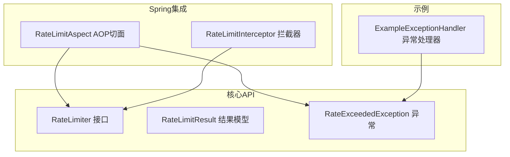
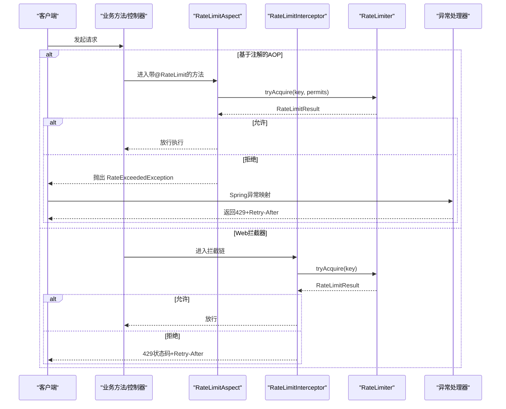
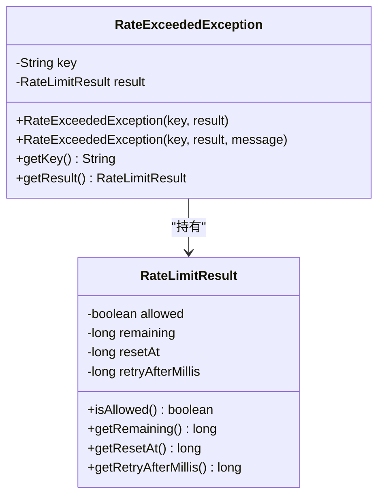
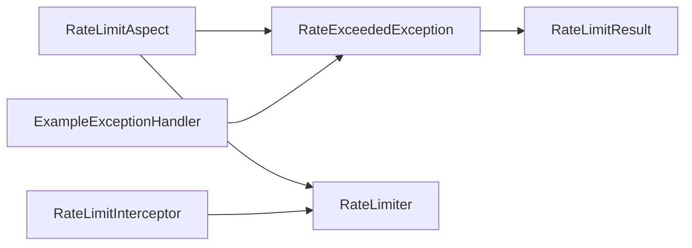

# 异常处理API

<cite>
**本文引用的文件**
- [RateExceededException.java](file://throttle4j-core/src/main/java/com/throttle4j/core/RateExceededException.java)
- [RateLimitResult.java](file://throttle4j-core/src/main/java/com/throttle4j/core/RateLimitResult.java)
- [RateLimiter.java](file://throttle4j-core/src/main/java/com/throttle4j/core/RateLimiter.java)
- [RateLimitInterceptor.java](file://throttle4j-spring-boot-starter/src/main/java/com/throttle4j/spring/web/RateLimitInterceptor.java)
- [RateLimitAspect.java](file://throttle4j-spring-boot-starter/src/main/java/com/throttle4j/spring/aop/RateLimitAspect.java)
- [ExampleExceptionHandler.java](file://throttle4j-examples/src/main/java/com/throttle4j/example/ExampleExceptionHandler.java)
- [RateExceededExceptionTest.java](file://throttle4j-core/src/test/java/com/throttle4j/core/RateExceededExceptionTest.java)
- [README.md](file://README.md)
</cite>

## 目录
1. [简介](#简介)
2. [项目结构](#项目结构)
3. [核心组件](#核心组件)
4. [架构总览](#架构总览)
5. [详细组件分析](#详细组件分析)
6. [依赖分析](#依赖分析)
7. [性能考虑](#性能考虑)
8. [故障排查指南](#故障排查指南)
9. [结论](#结论)
10. [附录](#附录)

## 简介
本文件聚焦于异常处理API，系统性记录 RateExceededException 的构造方法、属性字段与异常信息，阐明其触发条件与典型场景（如限流阈值超限、配置错误等），并提供捕获与处理的最佳实践、异常信息解读与故障排查指南。同时给出在不同使用场景（Spring AOP、拦截器、纯核心API）下优雅处理限流异常的方法、错误恢复策略以及异常分类与严重程度评估标准。

## 项目结构
围绕异常处理API的关键模块与文件如下：
- 核心异常与结果模型：RateExceededException、RateLimitResult
- 核心接口：RateLimiter
- Spring 集成：AOP 切面与 Web 拦截器
- 示例：异常处理器与基本用法示例

**图表来源**
- [RateLimiter.java:1-32](file://throttle4j-core/src/main/java/com/throttle4j/core/RateLimiter.java#L1-L32)
- [RateLimitResult.java:1-68](file://throttle4j-core/src/main/java/com/throttle4j/core/RateLimitResult.java#L1-L68)
- [RateExceededException.java:1-33](file://throttle4j-core/src/main/java/com/throttle4j/core/RateExceededException.java#L1-L33)
- [RateLimitAspect.java:1-186](file://throttle4j-spring-boot-starter/src/main/java/com/throttle4j/spring/aop/RateLimitAspect.java#L1-L186)
- [RateLimitInterceptor.java:1-126](file://throttle4j-spring-boot-starter/src/main/java/com/throttle4j/spring/web/RateLimitInterceptor.java#L1-L126)
- [ExampleExceptionHandler.java:1-26](file://throttle4j-examples/src/main/java/com/throttle4j/example/ExampleExceptionHandler.java#L1-L26)

**章节来源**
- [README.md:1-160](file://README.md#L1-L160)

## 核心组件
- RateExceededException：当请求被限流器拒绝时抛出的运行时异常，携带限流键与结果信息，便于上层进行响应与恢复。
- RateLimitResult：限流尝试的结果封装，包含是否允许、剩余配额、重置时间、建议重试间隔等关键指标。
- RateLimiter：核心限流接口，提供按键尝试获取配额的能力，并返回结果对象。

**章节来源**
- [RateExceededException.java:1-33](file://throttle4j-core/src/main/java/com/throttle4j/core/RateExceededException.java#L1-L33)
- [RateLimitResult.java:1-68](file://throttle4j-core/src/main/java/com/throttle4j/core/RateLimitResult.java#L1-L68)
- [RateLimiter.java:1-32](file://throttle4j-core/src/main/java/com/throttle4j/core/RateLimiter.java#L1-L32)

## 架构总览
下图展示从调用入口到异常抛出与处理的整体流程，涵盖程序化API、Spring AOP与Web拦截器三种路径。

**图表来源**
- [RateLimitAspect.java:68-91](file://throttle4j-spring-boot-starter/src/main/java/com/throttle4j/spring/aop/RateLimitAspect.java#L68-L91)
- [RateLimitInterceptor.java:55-79](file://throttle4j-spring-boot-starter/src/main/java/com/throttle4j/spring/web/RateLimitInterceptor.java#L55-L79)
- [RateLimiter.java:10-25](file://throttle4j-core/src/main/java/com/throttle4j/core/RateLimiter.java#L10-L25)
- [ExampleExceptionHandler.java:16-24](file://throttle4j-examples/src/main/java/com/throttle4j/example/ExampleExceptionHandler.java#L16-L24)

## 详细组件分析

### RateExceededException 异常模型
- 继承体系：继承自 RuntimeException，属于运行时异常，需在调用方显式处理或通过Spring异常映射转换为HTTP响应。
- 关键字段
  - key：触发限流的键（如用户ID、API路径等），用于定位与追踪。
  - result：限流结果对象，包含剩余配额、重置时间、建议重试间隔等。
- 构造方法
  - 基础构造：接收 key 与 result，生成默认消息“限流超出：key”。
  - 自定义消息构造：可传入自定义 message，覆盖默认提示。
- 访问器
  - getKey()：获取限流键。
  - getResult()：获取限流结果，便于读取重试间隔等元数据。

**图表来源**
- [RateExceededException.java:6-31](file://throttle4j-core/src/main/java/com/throttle4j/core/RateExceededException.java#L6-L31)
- [RateLimitResult.java:6-56](file://throttle4j-core/src/main/java/com/throttle4j/core/RateLimitResult.java#L6-L56)

**章节来源**
- [RateExceededException.java:1-33](file://throttle4j-core/src/main/java/com/throttle4j/core/RateExceededException.java#L1-L33)
- [RateLimitResult.java:1-68](file://throttle4j-core/src/main/java/com/throttle4j/core/RateLimitResult.java#L1-L68)
- [RateExceededExceptionTest.java:1-18](file://throttle4j-core/src/test/java/com/throttle4j/core/RateExceededExceptionTest.java#L1-L18)

### 触发条件与典型场景
- 限流阈值超限
  - 当前窗口内配额耗尽，tryAcquire 返回拒绝结果；在AOP或拦截器中会抛出 RateExceededException 或直接返回429。
- 配置错误
  - Spring AOP 中 fallbackMethod 名称不匹配或签名不一致，导致无法回退，最终抛出 RateExceededException。
  - 拦截器构建默认配置时，若默认算法非法，会回退到默认算法并记录告警日志。
- 存储或计算异常
  - 在拦截器中 tryAcquire 调用抛出运行时异常时，拦截器会记录警告并放行（降级行为），避免影响正常流量。

**章节来源**
- [RateLimitAspect.java:86-91](file://throttle4j-spring-boot-starter/src/main/java/com/throttle4j/spring/aop/RateLimitAspect.java#L86-L91)
- [RateLimitAspect.java:160-163](file://throttle4j-spring-boot-starter/src/main/java/com/throttle4j/spring/aop/RateLimitAspect.java#L160-L163)
- [RateLimitInterceptor.java:92-97](file://throttle4j-spring-boot-starter/src/main/java/com/throttle4j/spring/web/RateLimitInterceptor.java#L92-L97)
- [RateLimitInterceptor.java:63-68](file://throttle4j-spring-boot-starter/src/main/java/com/throttle4j/spring/web/RateLimitInterceptor.java#L63-L68)

### 异常捕获与处理最佳实践
- Spring Web 层
  - 使用 @ExceptionHandler 将 RateExceededException 映射为 HTTP 429，并设置 Retry-After 头，提升客户端重试体验。
  - 可结合 RateLimitResult.getRetryAfterMillis() 计算合理的重试秒数。
- AOP 层
  - 若配置了 fallbackMethod，优先走回退逻辑；否则抛出 RateExceededException，交由上层统一处理。
  - 对于不可回退的情况，确保上层能正确捕获并转换为合适的HTTP响应。
- 程序化API
  - 在 tryAcquire 后检查结果，若被拒绝则根据 result.getRetryAfterMillis() 实施指数退避或等待策略，避免雪崩。

**章节来源**
- [ExampleExceptionHandler.java:1-26](file://throttle4j-examples/src/main/java/com/throttle4j/example/ExampleExceptionHandler.java#L1-L26)
- [RateLimitAspect.java:86-91](file://throttle4j-spring-boot-starter/src/main/java/com/throttle4j/spring/aop/RateLimitAspect.java#L86-L91)
- [RateLimitInterceptor.java:72-77](file://throttle4j-spring-boot-starter/src/main/java/com/throttle4j/spring/web/RateLimitInterceptor.java#L72-L77)

### 异常信息解读与故障排查
- 异常消息
  - 默认消息包含触发限流的 key，便于快速定位问题来源。
- 关键字段解读
  - key：用于区分是哪个资源或用户的限流触发点。
  - result.retryAfterMillis：建议客户端等待的时间（毫秒），用于计算 Retry-After。
  - result.remaining/resetAt：当前窗口剩余配额与重置时间，辅助判断是否需要调整限流策略。
- 排查步骤
  - 检查 key 是否合理（如用户ID、API路径），确认限流维度是否正确。
  - 查看 result.retryAfterMillis 与业务重试策略是否匹配。
  - 若为Spring集成，确认 AOP/fallbackMethod 配置是否有效，拦截器是否正常注入。
  - 如拦截器内部发生异常，查看日志中关于降级放行的告警。

**章节来源**
- [RateExceededException.java:13-23](file://throttle4j-core/src/main/java/com/throttle4j/core/RateExceededException.java#L13-L23)
- [RateLimitResult.java:54-56](file://throttle4j-core/src/main/java/com/throttle4j/core/RateLimitResult.java#L54-L56)
- [RateLimitInterceptor.java:63-68](file://throttle4j-spring-boot-starter/src/main/java/com/throttle4j/spring/web/RateLimitInterceptor.java#L63-L68)

### 不同使用场景下的优雅处理
- Spring AOP 场景
  - 优先使用 fallbackMethod 提供降级响应，避免异常传播；若必须抛出异常，确保上层异常映射能正确返回429。
- Web 拦截器场景
  - 直接设置429状态码与 Retry-After 头，无需抛出异常，减少客户端解析负担。
- 程序化API场景
  - 在业务层自行判断 result.isAllowed() 并决定重试、降级或返回错误信息。

**章节来源**
- [RateLimitAspect.java:86-91](file://throttle4j-spring-boot-starter/src/main/java/com/throttle4j/spring/aop/RateLimitAspect.java#L86-L91)
- [RateLimitInterceptor.java:72-77](file://throttle4j-spring-boot-starter/src/main/java/com/throttle4j/spring/web/RateLimitInterceptor.java#L72-L77)

### 错误恢复策略
- 客户端侧
  - 读取 Retry-After 头或 result.retryAfterMillis，采用指数退避策略重试。
  - 对于幂等请求可自动重试，非幂等请求应谨慎重试或引导用户稍后重试。
- 服务端侧
  - 对于存储或计算异常，拦截器已具备降级放行能力；对于配置错误，应修正算法或窗口参数。
  - 在高并发场景下，适当提高限流阈值或扩大窗口，避免频繁触发限流。

**章节来源**
- [RateLimitInterceptor.java:63-68](file://throttle4j-spring-boot-starter/src/main/java/com/throttle4j/spring/web/RateLimitInterceptor.java#L63-L68)
- [RateLimitResult.java:54-56](file://throttle4j-core/src/main/java/com/throttle4j/core/RateLimitResult.java#L54-L56)

### 异常分类与严重程度评估
- 分类
  - 业务限流异常：因配额耗尽触发，属于预期可控事件。
  - 配置异常：因注解或拦截器配置不当导致，属于可修复的配置问题。
  - 运行时异常：因存储或计算失败触发，属于临时性故障。
- 严重程度
  - 低：业务限流异常，可通过客户端退避解决。
  - 中：配置异常，影响部分功能，需尽快修复。
  - 高：运行时异常，可能影响整体可用性，需立即排查。

**章节来源**
- [RateLimitAspect.java:160-163](file://throttle4j-spring-boot-starter/src/main/java/com/throttle4j/spring/aop/RateLimitAspect.java#L160-L163)
- [RateLimitInterceptor.java:92-97](file://throttle4j-spring-boot-starter/src/main/java/com/throttle4j/spring/web/RateLimitInterceptor.java#L92-L97)

## 依赖分析
- RateExceededException 依赖 RateLimitResult 提供上下文信息。
- RateLimitAspect 与 RateLimitInterceptor 通过 RateLimiter 接口发起限流判定，并在拒绝时抛出或返回异常/响应。
- Spring 异常处理器将异常映射为标准HTTP响应。

**图表来源**
- [RateExceededException.java:10-11](file://throttle4j-core/src/main/java/com/throttle4j/core/RateExceededException.java#L10-L11)
- [RateLimitAspect.java:80-90](file://throttle4j-spring-boot-starter/src/main/java/com/throttle4j/spring/aop/RateLimitAspect.java#L80-L90)
- [RateLimitInterceptor.java:62-77](file://throttle4j-spring-boot-starter/src/main/java/com/throttle4j/spring/web/RateLimitInterceptor.java#L62-L77)
- [ExampleExceptionHandler.java:16-24](file://throttle4j-examples/src/main/java/com/throttle4j/example/ExampleExceptionHandler.java#L16-L24)

**章节来源**
- [RateLimiter.java:1-32](file://throttle4j-core/src/main/java/com/throttle4j/core/RateLimiter.java#L1-L32)
- [RateLimitResult.java:1-68](file://throttle4j-core/src/main/java/com/throttle4j/core/RateLimitResult.java#L1-L68)

## 性能考虑
- 异常路径尽量短路：在拦截器中直接设置429与头信息，避免异常栈开销。
- 重试退避：客户端基于 Retry-After 实施退避，降低瞬时重试峰值。
- 配置合理性：算法选择与窗口/阈值设置直接影响命中率与延迟，需结合业务特征优化。

## 故障排查指南
- 现象：频繁出现429或RateExceededException
  - 排查：核对 key 维度是否过细或过粗；检查限流阈值与窗口是否合理；观察 result.retryAfterMillis 是否过短。
- 现象：偶发异常但业务未受影响
  - 排查：拦截器内部异常已被降级放行，查看相关告警日志；确认存储可用性。
- 现象：AOP 注解未生效
  - 排查：确认 fallbackMethod 名称与签名一致；检查Bean作用域与代理配置。

**章节来源**
- [RateLimitInterceptor.java:63-68](file://throttle4j-spring-boot-starter/src/main/java/com/throttle4j/spring/web/RateLimitInterceptor.java#L63-L68)
- [RateLimitAspect.java:160-163](file://throttle4j-spring-boot-starter/src/main/java/com/throttle4j/spring/aop/RateLimitAspect.java#L160-L163)

## 结论
RateExceededException 作为限流拒绝的统一异常载体，提供了关键的上下文信息（键与结果）。通过在不同场景下采用恰当的处理策略（AOP回退、Web拦截器直接响应、程序化API退避），可实现对限流异常的优雅处理。配合合理的配置与监控，可在保障系统稳定的同时提升用户体验。

## 附录
- 相关API参考
  - [RateLimiter.tryAcquire:10-25](file://throttle4j-core/src/main/java/com/throttle4j/core/RateLimiter.java#L10-L25)
  - [RateLimitResult 字段与工厂方法:21-40](file://throttle4j-core/src/main/java/com/throttle4j/core/RateLimitResult.java#L21-L40)
  - [RateLimitAspect 异常抛出逻辑:86-91](file://throttle4j-spring-boot-starter/src/main/java/com/throttle4j/spring/aop/RateLimitAspect.java#L86-L91)
  - [RateLimitInterceptor 拦截与响应:55-79](file://throttle4j-spring-boot-starter/src/main/java/com/throttle4j/spring/web/RateLimitInterceptor.java#L55-L79)
  - [ExampleExceptionHandler 映射示例:16-24](file://throttle4j-examples/src/main/java/com/throttle4j/example/ExampleExceptionHandler.java#L16-L24)