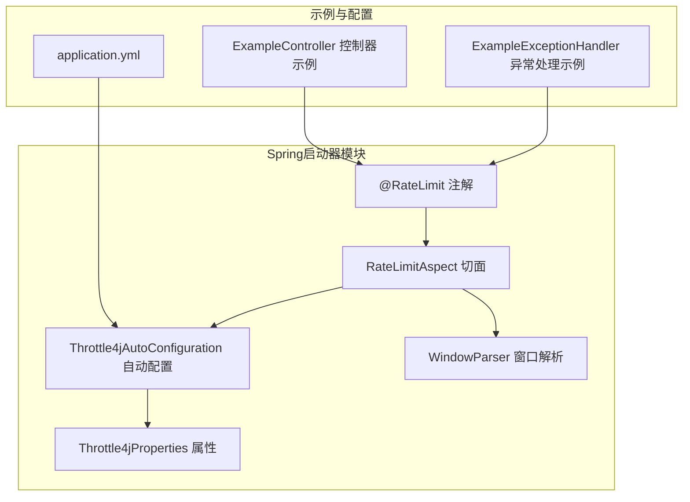
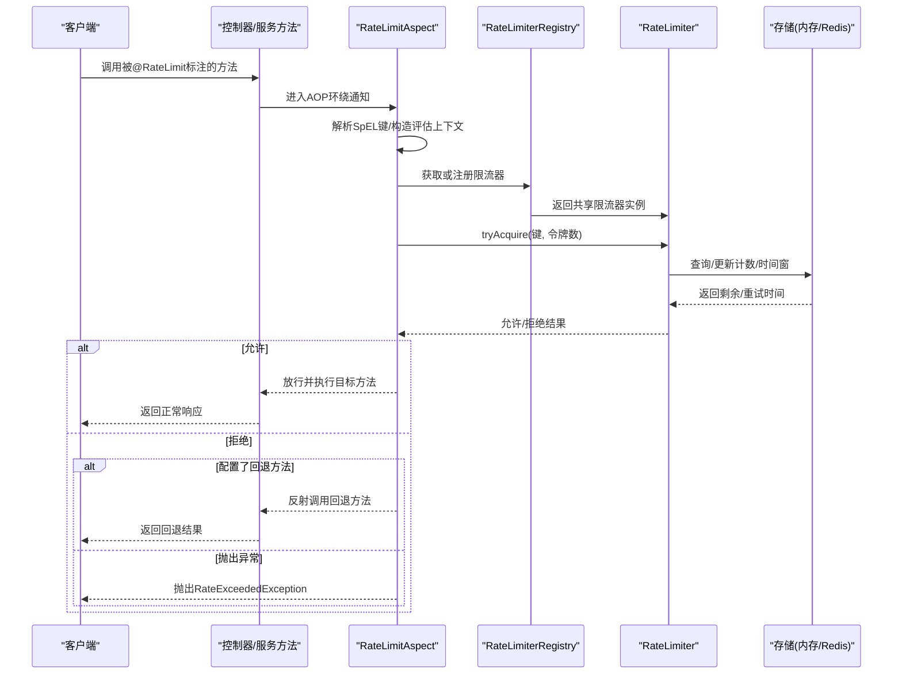
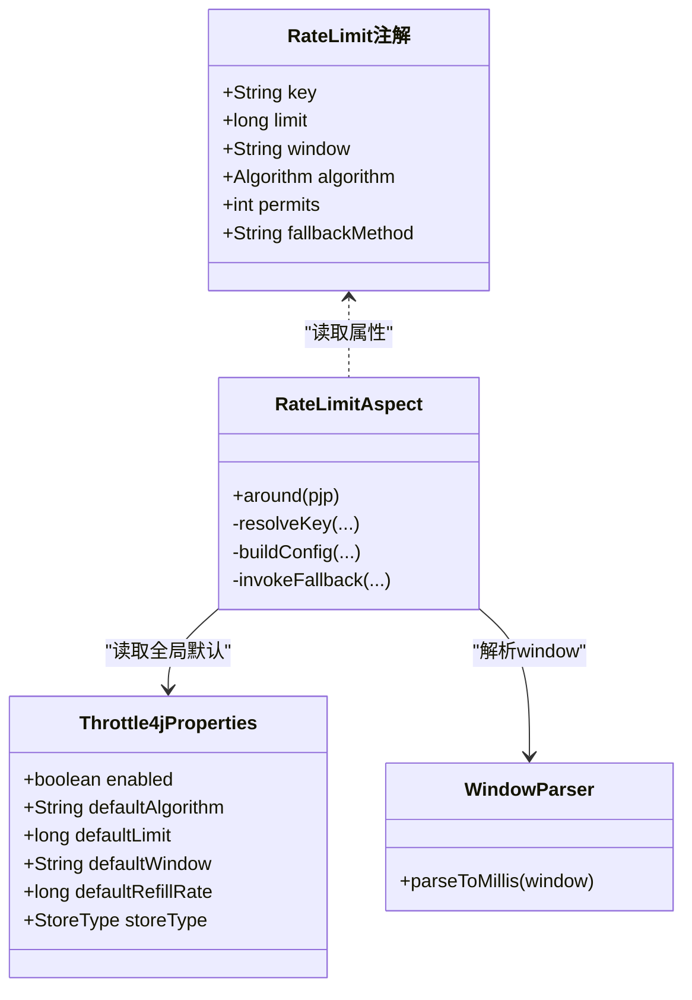
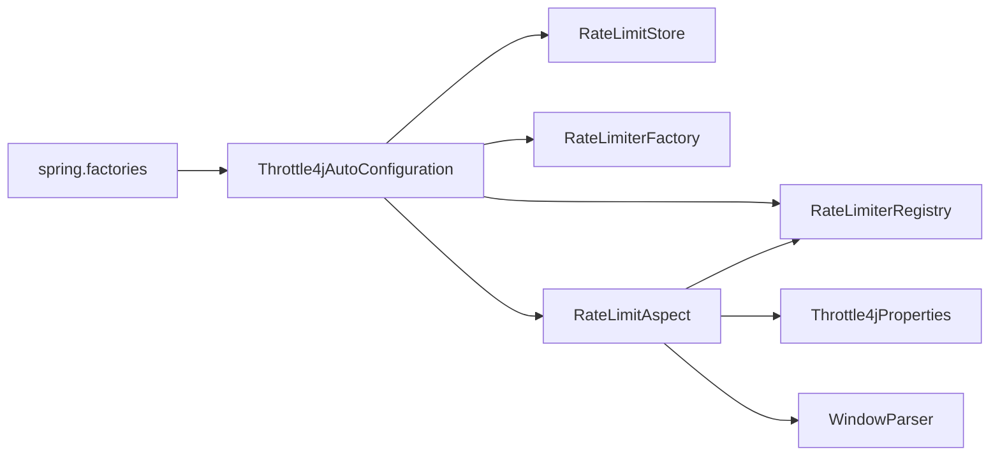

# @RateLimit注解使用

<cite>
**本文引用的文件**
- [RateLimit.java](file://throttle4j-spring-boot-starter/src/main/java/com/throttle4j/spring/annotation/RateLimit.java)
- [RateLimitAspect.java](file://throttle4j-spring-boot-starter/src/main/java/com/throttle4j/spring/aop/RateLimitAspect.java)
- [Throttle4jAutoConfiguration.java](file://throttle4j-spring-boot-starter/src/main/java/com/throttle4j/spring/autoconfigure/Throttle4jAutoConfiguration.java)
- [Throttle4jProperties.java](file://throttle4j-spring-boot-starter/src/main/java/com/throttle4j/spring/autoconfigure/Throttle4jProperties.java)
- [WindowParser.java](file://throttle4j-spring-boot-starter/src/main/java/com/throttle4j/spring/util/WindowParser.java)
- [spring.factories](file://throttle4j-spring-boot-starter/src/main/resources/META-INF/spring.factories)
- [application.yml](file://throttle4j-examples/src/main/resources/application.yml)
- [ExampleController.java](file://throttle4j-examples/src/main/java/com/throttle4j/example/ExampleController.java)
- [ExampleExceptionHandler.java](file://throttle4j-examples/src/main/java/com/throttle4j/example/ExampleExceptionHandler.java)
- [RateLimitAspectTest.java](file://throttle4j-spring-boot-starter/src/test/java/com/throttle4j/spring/aop/RateLimitAspectTest.java)
</cite>

## 目录
1. [简介](#简介)
2. [项目结构](#项目结构)
3. [核心组件](#核心组件)
4. [架构总览](#架构总览)
5. [详细组件分析](#详细组件分析)
6. [依赖关系分析](#依赖关系分析)
7. [性能考虑](#性能考虑)
8. [故障排查指南](#故障排查指南)
9. [结论](#结论)
10. [附录](#附录)

## 简介
本文件面向使用 @RateLimit 注解进行声明式限流的开发者，系统性讲解注解的属性参数、SpEL 表达式支持、在控制器与服务类中的使用方式、优先级与覆盖规则、与全局配置的关系、最佳实践与常见问题处理。文档基于仓库中实际实现与示例进行说明，并通过图示帮助理解。

## 项目结构
与 @RateLimit 注解直接相关的模块与文件如下：
- 注解定义：throttle4j-spring-boot-starter/src/main/java/com/throttle4j/spring/annotation/RateLimit.java
- AOP 切面：throttle4j-spring-boot-starter/src/main/java/com/throttle4j/spring/aop/RateLimitAspect.java
- 自动配置与属性：throttle4j-spring-boot-starter/src/main/java/com/throttle4j/spring/autoconfigure/Throttle4jAutoConfiguration.java、Throttle4jProperties.java
- 窗口解析工具：throttle4j-spring-boot-starter/src/main/java/com/throttle4j/spring/util/WindowParser.java
- 示例与配置：throttle4j-examples/src/main/resources/application.yml、ExampleController.java、ExampleExceptionHandler.java
- Spring工厂注册：throttle4j-spring-boot-starter/src/main/resources/META-INF/spring.factories

图表来源
- [RateLimit.java:26-74](file://throttle4j-spring-boot-starter/src/main/java/com/throttle4j/spring/annotation/RateLimit.java#L26-L74)
- [RateLimitAspect.java:40-91](file://throttle4j-spring-boot-starter/src/main/java/com/throttle4j/spring/aop/RateLimitAspect.java#L40-L91)
- [Throttle4jAutoConfiguration.java:27-131](file://throttle4j-spring-boot-starter/src/main/java/com/throttle4j/spring/autoconfigure/Throttle4jAutoConfiguration.java#L27-L131)
- [Throttle4jProperties.java:9-201](file://throttle4j-spring-boot-starter/src/main/java/com/throttle4j/spring/autoconfigure/Throttle4jProperties.java#L9-L201)
- [WindowParser.java:20-75](file://throttle4j-spring-boot-starter/src/main/java/com/throttle4j/spring/util/WindowParser.java#L20-L75)
- [application.yml:1-10](file://throttle4j-examples/src/main/resources/application.yml#L1-L10)
- [ExampleController.java:12-35](file://throttle4j-examples/src/main/java/com/throttle4j/example/ExampleController.java#L12-L35)
- [ExampleExceptionHandler.java:13-24](file://throttle4j-examples/src/main/java/com/throttle4j/example/ExampleExceptionHandler.java#L13-L24)

章节来源
- [spring.factories:1-4](file://throttle4j-spring-boot-starter/src/main/resources/META-INF/spring.factories#L1-L4)
- [application.yml:1-10](file://throttle4j-examples/src/main/resources/application.yml#L1-L10)

## 核心组件
- @RateLimit 注解：用于在 Spring Bean 的方法上声明式限流，支持 key、limit、window、algorithm、permits、fallbackMethod 等属性。
- RateLimitAspect：基于 AOP 拦截标注了 @RateLimit 的方法，计算限流键、构建或复用限流器、尝试获取配额、执行回退或抛出异常。
- Throttle4jAutoConfiguration 与 Throttle4jProperties：负责自动装配默认存储、工厂、注册表与切面，并提供全局默认算法、窗口、限额等配置。
- WindowParser：解析 window 字符串（如“1m”、“30s”）为毫秒数。
- 示例与异常处理：示例控制器演示注解用法；异常处理器将超限异常映射为 HTTP 429 并设置 Retry-After 头。

章节来源
- [RateLimit.java:26-74](file://throttle4j-spring-boot-starter/src/main/java/com/throttle4j/spring/annotation/RateLimit.java#L26-L74)
- [RateLimitAspect.java:40-185](file://throttle4j-spring-boot-starter/src/main/java/com/throttle4j/spring/aop/RateLimitAspect.java#L40-L185)
- [Throttle4jAutoConfiguration.java:27-131](file://throttle4j-spring-boot-starter/src/main/java/com/throttle4j/spring/autoconfigure/Throttle4jAutoConfiguration.java#L27-L131)
- [Throttle4jProperties.java:9-201](file://throttle4j-spring-boot-starter/src/main/java/com/throttle4j/spring/autoconfigure/Throttle4jProperties.java#L9-L201)
- [WindowParser.java:20-75](file://throttle4j-spring-boot-starter/src/main/java/com/throttle4j/spring/util/WindowParser.java#L20-L75)
- [ExampleController.java:12-35](file://throttle4j-examples/src/main/java/com/throttle4j/example/ExampleController.java#L12-L35)
- [ExampleExceptionHandler.java:13-24](file://throttle4j-examples/src/main/java/com/throttle4j/example/ExampleExceptionHandler.java#L13-L24)

## 架构总览
下图展示了从方法调用到限流决策与回退的整体流程：

图表来源
- [RateLimitAspect.java:68-91](file://throttle4j-spring-boot-starter/src/main/java/com/throttle4j/spring/aop/RateLimitAspect.java#L68-L91)
- [Throttle4jAutoConfiguration.java:126-130](file://throttle4j-spring-boot-starter/src/main/java/com/throttle4j/spring/autoconfigure/Throttle4jAutoConfiguration.java#L126-L130)

## 详细组件分析

### @RateLimit 注解详解
- 作用域：仅用于方法级别（METHOD）。
- 关键属性与行为：
  - key：限流键，支持 SpEL 表达式，空值时默认使用“类名.方法名”。见 [注解定义:28-36](file://throttle4j-spring-boot-starter/src/main/java/com/throttle4j/spring/annotation/RateLimit.java#L28-L36)。
  - limit：时间窗内允许的最大请求数。见 [注解定义:38-43](file://throttle4j-spring-boot-starter/src/main/java/com/throttle4j/spring/annotation/RateLimit.java#L38-L43)。
  - window：时间窗字符串，支持“ms/s/m/h/d”，例如“1m”“30s”。见 [注解定义:45-51](file://throttle4j-spring-boot-starter/src/main/java/com/throttle4j/spring/annotation/RateLimit.java#L45-L51)。
  - algorithm：算法类型，默认滑动窗口。见 [注解定义:53-58](file://throttle4j-spring-boot-starter/src/main/java/com/throttle4j/spring/annotation/RateLimit.java#L53-L58)。
  - permits：每次调用消耗的配额，默认1。见 [注解定义:60-65](file://throttle4j-spring-boot-starter/src/main/java/com/throttle4j/spring/annotation/RateLimit.java#L60-L65)。
  - fallbackMethod：当被拒绝时调用的同Bean回退方法名（需签名一致）。见 [注解定义:67-73](file://throttle4j-spring-boot-starter/src/main/java/com/throttle4j/spring/annotation/RateLimit.java#L67-L73)。

章节来源
- [RateLimit.java:26-74](file://throttle4j-spring-boot-starter/src/main/java/com/throttle4j/spring/annotation/RateLimit.java#L26-L74)

### SpEL 表达式支持与内置变量
- 支持在 key 中使用 SpEL 表达式，如“#userId”或字符串拼接。
- 内置变量：
  - 参数名变量：根据方法参数名注入（如 #id、#userId）。
  - 位置变量：p0/p1/... 与 a0/a1/...（二者指向同一参数值）。
- 当表达式无法解析或非 SpEL 字面量时，会回退到“类名.方法名”作为键。
- 表达式解析失败时记录警告并回退，避免影响业务。

参考实现位置
- [SpEL解析与回退逻辑:117-137](file://throttle4j-spring-boot-starter/src/main/java/com/throttle4j/spring/aop/RateLimitAspect.java#L117-L137)
- [参数名发现与上下文构建:139-153](file://throttle4j-spring-boot-starter/src/main/java/com/throttle4j/spring/aop/RateLimitAspect.java#L139-L153)

章节来源
- [RateLimitAspect.java:117-153](file://throttle4j-spring-boot-starter/src/main/java/com/throttle4j/spring/aop/RateLimitAspect.java#L117-L153)

### 在控制器与服务类中的使用
- 控制器示例：在@GetMapping方法上使用 @RateLimit，限制请求速率并选择算法与窗口。
- 未标注的方法不受限流控制。
- 示例参考：
  - [示例控制器:16-34](file://throttle4j-examples/src/main/java/com/throttle4j/example/ExampleController.java#L16-L34)

章节来源
- [ExampleController.java:12-35](file://throttle4j-examples/src/main/java/com/throttle4j/example/ExampleController.java#L12-L35)

### 回退策略与异常处理
- 若配置了 fallbackMethod，则在被拒绝时反射调用该方法并返回其结果。
- 若未配置回退方法，则抛出 RateExceededException。
- 示例异常处理器将该异常映射为 HTTP 429，并设置 Retry-After 响应头。
  - [异常处理器:16-24](file://throttle4j-examples/src/main/java/com/throttle4j/example/ExampleExceptionHandler.java#L16-L24)

章节来源
- [RateLimitAspect.java:87-90](file://throttle4j-spring-boot-starter/src/main/java/com/throttle4j/spring/aop/RateLimitAspect.java#L87-L90)
- [ExampleExceptionHandler.java:13-24](file://throttle4j-examples/src/main/java/com/throttle4j/example/ExampleExceptionHandler.java#L13-L24)

### 与全局配置的关系与优先级
- 注解优先于全局配置：注解中显式配置的 limit、window、algorithm、permits 会覆盖全局默认值。
- 全局默认值来源于 Throttle4jProperties：
  - defaultAlgorithm、defaultLimit、defaultWindow、defaultRefillRate、storeType 等。
- 自动配置会在缺少对应 Bean 时注册默认实现（存储、工厂、注册表、切面），并受 throttle4j.enabled 控制。
- 参考：
  - [全局属性定义:12-26](file://throttle4j-spring-boot-starter/src/main/java/com/throttle4j/spring/autoconfigure/Throttle4jProperties.java#L12-L26)
  - [自动配置注册:27-131](file://throttle4j-spring-boot-starter/src/main/java/com/throttle4j/spring/autoconfigure/Throttle4jAutoConfiguration.java#L27-L131)
  - [示例配置文件:4-9](file://throttle4j-examples/src/main/resources/application.yml#L4-L9)

章节来源
- [Throttle4jProperties.java:12-26](file://throttle4j-spring-boot-starter/src/main/java/com/throttle4j/spring/autoconfigure/Throttle4jProperties.java#L12-L26)
- [Throttle4jAutoConfiguration.java:27-131](file://throttle4j-spring-boot-starter/src/main/java/com/throttle4j/spring/autoconfigure/Throttle4jAutoConfiguration.java#L27-L131)
- [application.yml:4-9](file://throttle4j-examples/src/main/resources/application.yml#L4-L9)

### 窗口解析与单位转换
- 支持的单位：ms/s/m/h/d；不带单位时按毫秒处理。
- 非法输入将抛出非法参数异常。
- 参考：
  - [窗口解析实现:36-74](file://throttle4j-spring-boot-starter/src/main/java/com/throttle4j/spring/util/WindowParser.java#L36-L74)

章节来源
- [WindowParser.java:20-75](file://throttle4j-spring-boot-starter/src/main/java/com/throttle4j/spring/util/WindowParser.java#L20-L75)

### 类图：注解与切面关系

图表来源
- [RateLimit.java:26-74](file://throttle4j-spring-boot-starter/src/main/java/com/throttle4j/spring/annotation/RateLimit.java#L26-L74)
- [RateLimitAspect.java:40-185](file://throttle4j-spring-boot-starter/src/main/java/com/throttle4j/spring/aop/RateLimitAspect.java#L40-L185)
- [Throttle4jProperties.java:9-201](file://throttle4j-spring-boot-starter/src/main/java/com/throttle4j/spring/autoconfigure/Throttle4jProperties.java#L9-L201)
- [WindowParser.java:20-75](file://throttle4j-spring-boot-starter/src/main/java/com/throttle4j/spring/util/WindowParser.java#L20-L75)

## 依赖关系分析
- 组件耦合：
  - RateLimitAspect 依赖 RateLimiterRegistry、Throttle4jProperties、WindowParser。
  - 自动配置负责注册存储、工厂、注册表与切面，且对缺失 Bean 提供条件化默认。
- 外部集成点：
  - 存储可选内存或 Redis（通过属性与反射构造）。
  - Spring 工厂文件启用自动配置与 Web 自动配置。

图表来源
- [RateLimitAspect.java:44-59](file://throttle4j-spring-boot-starter/src/main/java/com/throttle4j/spring/aop/RateLimitAspect.java#L44-L59)
- [Throttle4jAutoConfiguration.java:45-130](file://throttle4j-spring-boot-starter/src/main/java/com/throttle4j/spring/autoconfigure/Throttle4jAutoConfiguration.java#L45-L130)
- [spring.factories:1-4](file://throttle4j-spring-boot-starter/src/main/resources/META-INF/spring.factories#L1-L4)

章节来源
- [Throttle4jAutoConfiguration.java:27-131](file://throttle4j-spring-boot-starter/src/main/java/com/throttle4j/spring/autoconfigure/Throttle4jAutoConfiguration.java#L27-L131)

## 性能考虑
- 表达式缓存：切面对已解析的 SpEL 表达式进行缓存，降低重复解析开销。
- 令牌桶推导：当算法为令牌桶且未显式设置 refillRate 时，基于 limit 与 window 推导每秒补充速率，避免频繁微调。
- 键解析优化：对纯字面量键不做 SpEL 解析，直接使用以减少上下文构建成本。
- 注册表复用：同一键复用已存在的限流器实例，避免重复创建。

章节来源
- [RateLimitAspect.java:46-48](file://throttle4j-spring-boot-starter/src/main/java/com/throttle4j/spring/aop/RateLimitAspect.java#L46-L48)
- [RateLimitAspect.java:109-114](file://throttle4j-spring-boot-starter/src/main/java/com/throttle4j/spring/aop/RateLimitAspect.java#L109-L114)
- [RateLimitAspect.java:122-126](file://throttle4j-spring-boot-starter/src/main/java/com/throttle4j/spring/aop/RateLimitAspect.java#L122-L126)

## 故障排查指南
- 限流异常映射：确认是否配置了异常处理器将 RateExceededException 映射为 429 并设置 Retry-After。
  - 参考：[异常处理器:16-24](file://throttle4j-examples/src/main/java/com/throttle4j/example/ExampleExceptionHandler.java#L16-L24)
- 回退方法未生效：检查 fallbackMethod 名称是否与目标 Bean 中方法名一致、参数列表完全匹配。
  - 参考：[回退调用实现:155-171](file://throttle4j-spring-boot-starter/src/main/java/com/throttle4j/spring/aop/RateLimitAspect.java#L155-L171)
- SpEL 键解析失败：查看日志警告，确认表达式是否正确；必要时改为字面量键或修正参数名。
  - 参考：[键解析与回退:117-137](file://throttle4j-spring-boot-starter/src/main/java/com/throttle4j/spring/aop/RateLimitAspect.java#L117-L137)
- 窗口字符串格式错误：确保使用合法单位与正数，否则会抛出非法参数异常。
  - 参考：[窗口解析:36-74](file://throttle4j-spring-boot-starter/src/main/java/com/throttle4j/spring/util/WindowParser.java#L36-L74)
- 单元测试参考：可对照测试用例验证不同键隔离、回退触发、超出限额拒绝等行为。
  - 参考：[测试用例:41-70](file://throttle4j-spring-boot-starter/src/test/java/com/throttle4j/spring/aop/RateLimitAspectTest.java#L41-L70)

章节来源
- [ExampleExceptionHandler.java:13-24](file://throttle4j-examples/src/main/java/com/throttle4j/example/ExampleExceptionHandler.java#L13-L24)
- [RateLimitAspect.java:155-171](file://throttle4j-spring-boot-starter/src/main/java/com/throttle4j/spring/aop/RateLimitAspect.java#L155-L171)
- [RateLimitAspect.java:117-137](file://throttle4j-spring-boot-starter/src/main/java/com/throttle4j/spring/aop/RateLimitAspect.java#L117-L137)
- [WindowParser.java:36-74](file://throttle4j-spring-boot-starter/src/main/java/com/throttle4j/spring/util/WindowParser.java#L36-L74)
- [RateLimitAspectTest.java:41-70](file://throttle4j-spring-boot-starter/src/test/java/com/throttle4j/spring/aop/RateLimitAspectTest.java#L41-L70)

## 结论
@RateLimit 注解提供了简洁而强大的声明式限流能力。通过合理的 key 设计、算法与窗口选择、配额消耗与回退策略，可在多种场景下实现灵活的流量治理。结合全局默认配置与自动装配机制，开发者可以快速落地并在生产环境中稳定运行。

## 附录

### 使用场景与最佳实践
- 动态限流键生成：
  - 使用 SpEL 从参数名或位置变量组合生成键，如“#userId”“#request.ip”“'resource:' + #resourceId”。
  - 对于多租户场景，建议将租户标识纳入键前缀，避免跨租户串扰。
- 批量权限控制：
  - 将 permits 设置为批量操作所需的配额，确保一次批量操作消耗相应令牌。
- 算法选择：
  - 滑动窗口：平滑的突发控制，适合大多数 API 场景。
  - 令牌桶：允许突发但有长期速率约束，适合长尾流量。
  - 固定窗口：简单明确，适合周期性任务。
- 全局与局部策略：
  - 对通用接口使用全局默认配置；对热点接口在注解中覆盖以精细化控制。

### 参数验证与错误处理清单
- key：为空时回退为“类名.方法名”；SpEL 解析失败时记录警告并回退。
- limit：必须为正整数；注解中未设置时使用全局默认。
- window：必须为正数且单位合法；非法输入抛出异常。
- algorithm：枚举值；未设置时使用全局默认。
- permits：取最大 1 的正值；用于控制单次调用消耗配额。
- fallbackMethod：不存在时记录警告并抛出异常。

章节来源
- [RateLimit.java:28-73](file://throttle4j-spring-boot-starter/src/main/java/com/throttle4j/spring/annotation/RateLimit.java#L28-L73)
- [RateLimitAspect.java:117-137](file://throttle4j-spring-boot-starter/src/main/java/com/throttle4j/spring/aop/RateLimitAspect.java#L117-L137)
- [WindowParser.java:36-74](file://throttle4j-spring-boot-starter/src/main/java/com/throttle4j/spring/util/WindowParser.java#L36-L74)
- [Throttle4jProperties.java:12-26](file://throttle4j-spring-boot-starter/src/main/java/com/throttle4j/spring/autoconfigure/Throttle4jProperties.java#L12-L26)