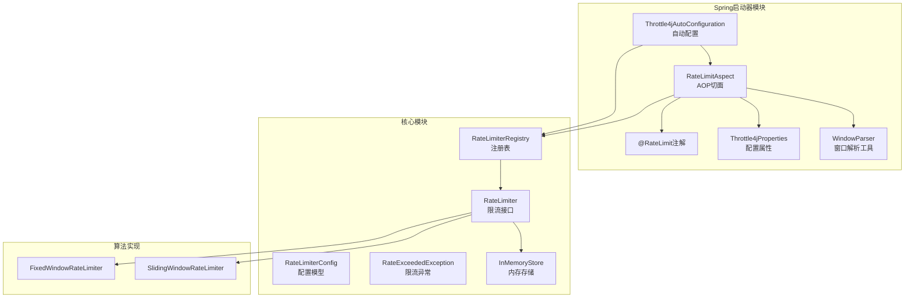
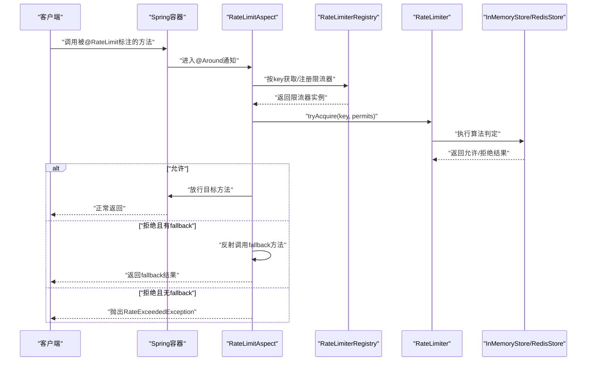
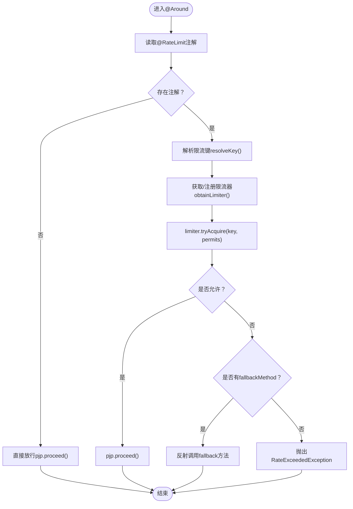
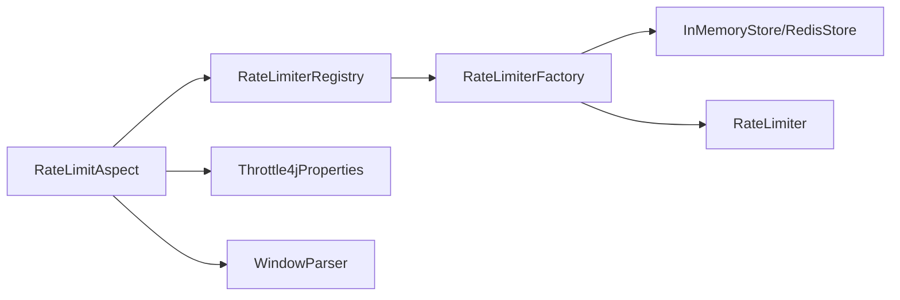

# AOP切面实现

<cite>
**本文引用的文件**
- [RateLimitAspect.java](file://throttle4j-spring-boot-starter/src/main/java/com/throttle4j/spring/aop/RateLimitAspect.java)
- [RateLimit.java](file://throttle4j-spring-boot-starter/src/main/java/com/throttle4j/spring/annotation/RateLimit.java)
- [Throttle4jAutoConfiguration.java](file://throttle4j-spring-boot-starter/src/main/java/com/throttle4j/spring/autoconfigure/Throttle4jAutoConfiguration.java)
- [Throttle4jProperties.java](file://throttle4j-spring-boot-starter/src/main/java/com/throttle4j/spring/autoconfigure/Throttle4jProperties.java)
- [WindowParser.java](file://throttle4j-spring-boot-starter/src/main/java/com/throttle4j/spring/util/WindowParser.java)
- [RateLimiter.java](file://throttle4j-core/src/main/java/com/throttle4j/core/RateLimiter.java)
- [RateLimiterConfig.java](file://throttle4j-core/src/main/java/com/throttle4j/core/RateLimiterConfig.java)
- [RateLimiterRegistry.java](file://throttle4j-core/src/main/java/com/throttle4j/core/RateLimiterRegistry.java)
- [RateExceededException.java](file://throttle4j-core/src/main/java/com/throttle4j/core/RateExceededException.java)
- [InMemoryStore.java](file://throttle4j-core/src/main/java/com/throttle4j/store/InMemoryStore.java)
- [FixedWindowRateLimiter.java](file://throttle4j-core/src/main/java/com/throttle4j/algorithm/FixedWindowRateLimiter.java)
- [SlidingWindowRateLimiter.java](file://throttle4j-core/src/main/java/com/throttle4j/algorithm/SlidingWindowRateLimiter.java)
- [RateLimitAspectTest.java](file://throttle4j-spring-boot-starter/src/test/java/com/throttle4j/spring/aop/RateLimitAspectTest.java)
- [ExampleController.java](file://throttle4j-examples/src/main/java/com/throttle4j/example/ExampleController.java)
- [SpringBootExampleApplication.java](file://throttle4j-examples/src/main/java/com/throttle4j/example/SpringBootExampleApplication.java)
- [spring.factories](file://throttle4j-spring-boot-starter/src/main/resources/META-INF/spring.factories)
</cite>

## 目录
1. [引言](#引言)
2. [项目结构](#项目结构)
3. [核心组件](#核心组件)
4. [架构总览](#架构总览)
5. [详细组件分析](#详细组件分析)
6. [依赖分析](#依赖分析)
7. [性能考虑](#性能考虑)
8. [故障排查指南](#故障排查指南)
9. [结论](#结论)
10. [附录](#附录)

## 引言
本文件围绕AOP切面实现进行深入技术解析，重点聚焦于RateLimitAspect的实现原理与运行机制。内容涵盖：
- 切入点Pointcut的定义规则与匹配机制
- 环绕通知Around Advice的执行流程（前置处理、目标方法调用、后置处理）
- 切面执行顺序与优先级控制，以及与Spring容器生命周期的关系
- 异常处理机制（限流异常的捕获与转换）
- 性能优化建议（缓存策略、避免过度拦截）
- 调试与监控实用技巧

## 项目结构
该项目采用多模块结构，AOP切面位于spring-boot-starter模块中，核心限流算法与存储位于core模块，Redis支持位于redis模块，示例位于examples模块。

**图表来源**
- [RateLimitAspect.java:1-186](file://throttle4j-spring-boot-starter/src/main/java/com/throttle4j/spring/aop/RateLimitAspect.java#L1-L186)
- [RateLimit.java:1-75](file://throttle4j-spring-boot-starter/src/main/java/com/throttle4j/spring/annotation/RateLimit.java#L1-L75)
- [Throttle4jAutoConfiguration.java:1-132](file://throttle4j-spring-boot-starter/src/main/java/com/throttle4j/spring/autoconfigure/Throttle4jAutoConfiguration.java#L1-L132)
- [Throttle4jProperties.java:1-202](file://throttle4j-spring-boot-starter/src/main/java/com/throttle4j/spring/autoconfigure/Throttle4jProperties.java#L1-L202)
- [WindowParser.java:1-76](file://throttle4j-spring-boot-starter/src/main/java/com/throttle4j/spring/util/WindowParser.java#L1-L76)
- [RateLimiter.java:1-32](file://throttle4j-core/src/main/java/com/throttle4j/core/RateLimiter.java#L1-L32)
- [RateLimiterConfig.java:1-113](file://throttle4j-core/src/main/java/com/throttle4j/core/RateLimiterConfig.java#L1-L113)
- [RateLimiterRegistry.java:1-61](file://throttle4j-core/src/main/java/com/throttle4j/core/RateLimiterRegistry.java#L1-L61)
- [RateExceededException.java:1-33](file://throttle4j-core/src/main/java/com/throttle4j/core/RateExceededException.java#L1-L33)
- [InMemoryStore.java:1-315](file://throttle4j-core/src/main/java/com/throttle4j/store/InMemoryStore.java#L1-L315)
- [FixedWindowRateLimiter.java:1-18](file://throttle4j-core/src/main/java/com/throttle4j/algorithm/FixedWindowRateLimiter.java#L1-L18)
- [SlidingWindowRateLimiter.java:1-16](file://throttle4j-core/src/main/java/com/throttle4j/algorithm/SlidingWindowRateLimiter.java#L1-L16)

**章节来源**
- [spring.factories:1-4](file://throttle4j-spring-boot-starter/src/main/resources/META-INF/spring.factories#L1-L4)
- [Throttle4jAutoConfiguration.java:27-131](file://throttle4j-spring-boot-starter/src/main/java/com/throttle4j/spring/autoconfigure/Throttle4jAutoConfiguration.java#L27-L131)

## 核心组件
- RateLimitAspect：基于@Around的环绕通知，拦截标注@RateLimit的方法，完成限流判断、降级回退或异常抛出。
- @RateLimit：声明式注解，用于在方法上配置限流参数（键、配额、窗口、算法、降级方法等）。
- Throttle4jAutoConfiguration：自动装配入口，注册默认存储、工厂、注册表与切面。
- Throttle4jProperties：外部化配置项，如启用开关、默认算法、窗口、存储类型等。
- RateLimiter/RateLimiterConfig/RateLimiterRegistry：核心限流抽象与注册表，负责按需创建与复用限流器实例。
- InMemoryStore：默认内存存储，提供固定窗口、滑动窗口、令牌桶、漏桶等算法的状态管理。
- WindowParser：将“1m”、“500ms”等字符串解析为毫秒数。

**章节来源**
- [RateLimitAspect.java:30-91](file://throttle4j-spring-boot-starter/src/main/java/com/throttle4j/spring/aop/RateLimitAspect.java#L30-L91)
- [RateLimit.java:11-74](file://throttle4j-spring-boot-starter/src/main/java/com/throttle4j/spring/annotation/RateLimit.java#L11-L74)
- [Throttle4jAutoConfiguration.java:27-131](file://throttle4j-spring-boot-starter/src/main/java/com/throttle4j/spring/autoconfigure/Throttle4jAutoConfiguration.java#L27-L131)
- [Throttle4jProperties.java:9-202](file://throttle4j-spring-boot-starter/src/main/java/com/throttle4j/spring/autoconfigure/Throttle4jProperties.java#L9-L202)
- [RateLimiter.java:8-31](file://throttle4j-core/src/main/java/com/throttle4j/core/RateLimiter.java#L8-L31)
- [RateLimiterConfig.java:8-113](file://throttle4j-core/src/main/java/com/throttle4j/core/RateLimiterConfig.java#L8-L113)
- [RateLimiterRegistry.java:14-61](file://throttle4j-core/src/main/java/com/throttle4j/core/RateLimiterRegistry.java#L14-L61)
- [InMemoryStore.java:24-315](file://throttle4j-core/src/main/java/com/throttle4j/store/InMemoryStore.java#L24-L315)
- [WindowParser.java:20-76](file://throttle4j-spring-boot-starter/src/main/java/com/throttle4j/spring/util/WindowParser.java#L20-L76)

## 架构总览
下图展示从方法调用到限流决策与回退的完整链路，以及与Spring容器的集成关系。

**图表来源**
- [RateLimitAspect.java:68-91](file://throttle4j-spring-boot-starter/src/main/java/com/throttle4j/spring/aop/RateLimitAspect.java#L68-L91)
- [RateLimiterRegistry.java:39-43](file://throttle4j-core/src/main/java/com/throttle4j/core/RateLimiterRegistry.java#L39-L43)
- [RateLimiter.java:16-25](file://throttle4j-core/src/main/java/com/throttle4j/core/RateLimiter.java#L16-L25)
- [InMemoryStore.java:69-93](file://throttle4j-core/src/main/java/com/throttle4j/store/InMemoryStore.java#L69-L93)
- [RateExceededException.java:6-33](file://throttle4j-core/src/main/java/com/throttle4j/core/RateExceededException.java#L6-L33)

## 详细组件分析

### 切入点与匹配机制
- 切入点表达式：@annotation(com.throttle4j.spring.annotation.RateLimit)
- 匹配规则：任何被@RateLimit标注的方法都会被该切点匹配；未标注的方法直接放行。
- 执行时机：方法调用时由AOP代理拦截，进入@Around通知逻辑。

**章节来源**
- [RateLimitAspect.java:68-75](file://throttle4j-spring-boot-starter/src/main/java/com/throttle4j/spring/aop/RateLimitAspect.java#L68-L75)

### 环绕通知执行流程
- 前置处理
  - 提取方法签名与@RateLimit注解
  - 解析限流键resolveKey（支持SpEL表达式，带缓存）
  - 构建/获取限流器obtainLimiter（基于注册表）
  - 计算permits（默认≥1）
- 目标方法调用
  - 通过limiter.tryAcquire(key, permits)进行判定
  - 若允许则pjp.proceed()放行
- 后置处理
  - 若拒绝且配置了fallbackMethod，则反射调用同类fallback方法
  - 若拒绝且无fallback，则抛出RateExceededException

**图表来源**
- [RateLimitAspect.java:68-91](file://throttle4j-spring-boot-starter/src/main/java/com/throttle4j/spring/aop/RateLimitAspect.java#L68-L91)
- [RateLimitAspect.java:117-137](file://throttle4j-spring-boot-starter/src/main/java/com/throttle4j/spring/aop/RateLimitAspect.java#L117-L137)
- [RateLimitAspect.java:155-171](file://throttle4j-spring-boot-starter/src/main/java/com/throttle4j/spring/aop/RateLimitAspect.java#L155-L171)
- [RateExceededException.java:6-33](file://throttle4j-core/src/main/java/com/throttle4j/core/RateExceededException.java#L6-L33)

**章节来源**
- [RateLimitAspect.java:68-186](file://throttle4j-spring-boot-starter/src/main/java/com/throttle4j/spring/aop/RateLimitAspect.java#L68-L186)

### 限流键解析与SPeL缓存
- 支持两种键形式
  - 空表达式：默认使用“类名.方法名”
  - 非纯字面量：使用SpEL解析，变量来自参数名与位置索引（p0/p1/…与a0/a1/…）
- 缓存策略：expressionCache缓存已解析的SpEL表达式，避免重复解析
- 容错回退：SpEL解析失败时记录告警并回退到默认键

**章节来源**
- [RateLimitAspect.java:117-153](file://throttle4j-spring-boot-starter/src/main/java/com/throttle4j/spring/aop/RateLimitAspect.java#L117-L153)
- [RateLimit.java:28-36](file://throttle4j-spring-boot-starter/src/main/java/com/throttle4j/spring/annotation/RateLimit.java#L28-L36)

### 限流器构建与注册
- 构建配置buildConfig：解析window为毫秒，选择算法，必要时推导refillRate
- 注册与复用：通过注册表按key获取/创建限流器，首次创建由工厂生成，后续复用

**章节来源**
- [RateLimitAspect.java:93-115](file://throttle4j-spring-boot-starter/src/main/java/com/throttle4j/spring/aop/RateLimitAspect.java#L93-L115)
- [RateLimiterConfig.java:55-111](file://throttle4j-core/src/main/java/com/throttle4j/core/RateLimiterConfig.java#L55-L111)
- [WindowParser.java:36-74](file://throttle4j-spring-boot-starter/src/main/java/com/throttle4j/spring/util/WindowParser.java#L36-L74)
- [RateLimiterRegistry.java:39-43](file://throttle4j-core/src/main/java/com/throttle4j/core/RateLimiterRegistry.java#L39-L43)

### 降级回退机制
- 反射查找：在目标类及其父类中按参数类型列表查找fallback方法
- 调用策略：设置可访问后以原参数调用；若被调方法抛出受检异常，外层抛出其真实目标异常
- 容错回退：找不到fallback时记录告警并抛出RateExceededException

**章节来源**
- [RateLimitAspect.java:155-184](file://throttle4j-spring-boot-starter/src/main/java/com/throttle4j/spring/aop/RateLimitAspect.java#L155-L184)
- [RateLimit.java:67-73](file://throttle4j-spring-boot-starter/src/main/java/com/throttle4j/spring/annotation/RateLimit.java#L67-L73)

### 异常处理与传播
- 拒绝即抛异常：当限流拒绝且无fallback时，抛出RateExceededException
- 结果信息：异常携带key与限流结果（剩余配额、重试时间等），便于上层处理
- 测试验证：单元测试覆盖了拒绝路径与fallback路径的行为

**章节来源**
- [RateLimitAspect.java:86-91](file://throttle4j-spring-boot-starter/src/main/java/com/throttle4j/spring/aop/RateLimitAspect.java#L86-L91)
- [RateExceededException.java:6-33](file://throttle4j-core/src/main/java/com/throttle4j/core/RateExceededException.java#L6-L33)
- [RateLimitAspectTest.java:48-54](file://throttle4j-spring-boot-starter/src/test/java/com/throttle4j/spring/aop/RateLimitAspectTest.java#L48-L54)

### Spring容器生命周期与自动装配
- 自动配置入口：spring.factories声明EnableAutoConfiguration，加载Throttle4jAutoConfiguration
- 条件化装配：@ConditionalOnMissingBean保证用户可覆盖默认组件
- 存储选择：根据Throttle4jProperties.storeType选择InMemoryStore或尝试Redis存储
- 切面注册：注册RateLimitAspect并注入共享的RateLimiterRegistry与Throttle4jProperties

**章节来源**
- [spring.factories:1-4](file://throttle4j-spring-boot-starter/src/main/resources/META-INF/spring.factories#L1-L4)
- [Throttle4jAutoConfiguration.java:27-131](file://throttle4j-spring-boot-starter/src/main/java/com/throttle4j/spring/autoconfigure/Throttle4jAutoConfiguration.java#L27-L131)
- [Throttle4jProperties.java:27-28](file://throttle4j-spring-boot-starter/src/main/java/com/throttle4j/spring/autoconfigure/Throttle4jProperties.java#L27-L28)

### 示例与使用
- 控制器示例：在REST控制器方法上使用@RateLimit，演示不同算法与键策略
- 启动类：SpringBootApplication入口，启动HTTP服务

**章节来源**
- [ExampleController.java:14-35](file://throttle4j-examples/src/main/java/com/throttle4j/example/ExampleController.java#L14-L35)
- [SpringBootExampleApplication.java:12-18](file://throttle4j-examples/src/main/java/com/throttle4j/example/SpringBootExampleApplication.java#L12-L18)

## 依赖分析
- 组件耦合
  - RateLimitAspect依赖RateLimiterRegistry、Throttle4jProperties、WindowParser、SpEL表达式解析器
  - RateLimiterRegistry依赖RateLimiterFactory，后者依赖具体存储实现（InMemoryStore/RedisStore）
- 外部依赖
  - Spring AOP（AspectJ）与Spring Boot自动装配
  - 可选Redis模块（通过反射尝试加载）

**图表来源**
- [RateLimitAspect.java:44-48](file://throttle4j-spring-boot-starter/src/main/java/com/throttle4j/spring/aop/RateLimitAspect.java#L44-L48)
- [Throttle4jAutoConfiguration.java:105-129](file://throttle4j-spring-boot-starter/src/main/java/com/throttle4j/spring/autoconfigure/Throttle4jAutoConfiguration.java#L105-L129)
- [InMemoryStore.java:24-315](file://throttle4j-core/src/main/java/com/throttle4j/store/InMemoryStore.java#L24-L315)

**章节来源**
- [Throttle4jAutoConfiguration.java:45-99](file://throttle4j-spring-boot-starter/src/main/java/com/throttle4j/spring/autoconfigure/Throttle4jAutoConfiguration.java#L45-L99)

## 性能考虑
- 表达式解析缓存
  - 使用ConcurrentHashMap缓存SpEL表达式，避免重复解析，降低CPU开销
  - 建议：仅在动态键表达式频繁出现时收益明显；静态键可直接使用字面量
- 注册表并发安全
  - computeIfAbsent确保并发注册幂等，避免重复创建限流器实例
- 存储清理与内存占用
  - InMemoryStore提供空闲键清理任务，默认周期与空闲阈值可调
  - 建议：在高并发、长生命周期应用中适当缩短清理间隔，防止内存膨胀
- 算法选择
  - 令牌桶适合突发平滑整形；滑动窗口更贴近精确速率；固定窗口简单但易边界问题
- 降级回退成本
  - 反射调用fallback有一定开销，建议仅在真正需要时启用，并保持fallback逻辑轻量

[本节为通用性能指导，不直接分析具体文件，故无章节来源]

## 故障排查指南
- 限流异常未触发
  - 检查方法是否被@RateLimit标注，确认AOP代理生效（proxyTargetClass等）
  - 核对限流键是否正确（SpEL解析失败会回退到默认键）
- 限流异常频繁
  - 检查limit与window配置是否过严；评估permits是否过大
  - 关注算法选择与窗口大小对边界行为的影响
- fallback未生效
  - 确认fallback方法签名与原方法一致（参数类型列表）
  - 查看日志告警：找不到fallback时会记录warn并抛出异常
- Redis存储不可用
  - 当storeType=REDIS但Redis模块缺失时，自动回退至InMemoryStore并输出警告
- 单元测试参考
  - 通过测试用例验证“允许、拒绝、fallback、不同键隔离”等场景

**章节来源**
- [RateLimitAspectTest.java:41-71](file://throttle4j-spring-boot-starter/src/test/java/com/throttle4j/spring/aop/RateLimitAspectTest.java#L41-L71)
- [Throttle4jAutoConfiguration.java:48-56](file://throttle4j-spring-boot-starter/src/main/java/com/throttle4j/spring/autoconfigure/Throttle4jAutoConfiguration.java#L48-L56)
- [RateLimitAspect.java:160-164](file://throttle4j-spring-boot-starter/src/main/java/com/throttle4j/spring/aop/RateLimitAspect.java#L160-L164)

## 结论
RateLimitAspect通过简洁而强大的AOP机制，将限流能力以声明式方式无缝集成到Spring应用中。其设计要点包括：
- 明确的切入点匹配与环绕通知执行流程
- 健壮的键解析与容错回退
- 基于注册表的限流器复用与并发安全
- 可插拔的存储与算法实现
- 清晰的异常传播与降级策略

在实际工程中，建议结合业务特征合理配置算法、窗口与配额，利用缓存与清理策略平衡性能与资源占用，并通过完善的监控与日志持续优化限流效果。

[本节为总结性内容，不直接分析具体文件，故无章节来源]

## 附录
- 使用示例
  - 在控制器方法上添加@RateLimit，即可对指定接口进行限流保护
- 配置建议
  - 默认算法与窗口可通过Throttle4jProperties统一配置
  - 生产环境建议开启Redis存储以实现跨实例一致性

**章节来源**
- [ExampleController.java:16-34](file://throttle4j-examples/src/main/java/com/throttle4j/example/ExampleController.java#L16-L34)
- [Throttle4jProperties.java:12-28](file://throttle4j-spring-boot-starter/src/main/java/com/throttle4j/spring/autoconfigure/Throttle4jProperties.java#L12-L28)