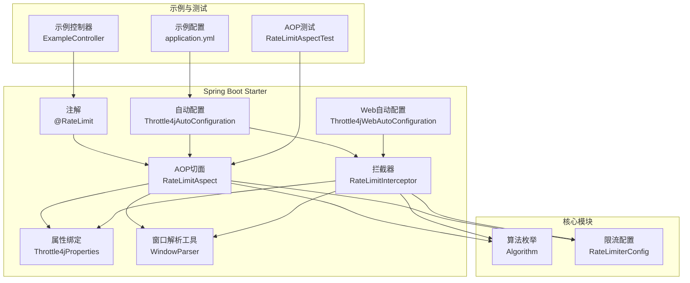
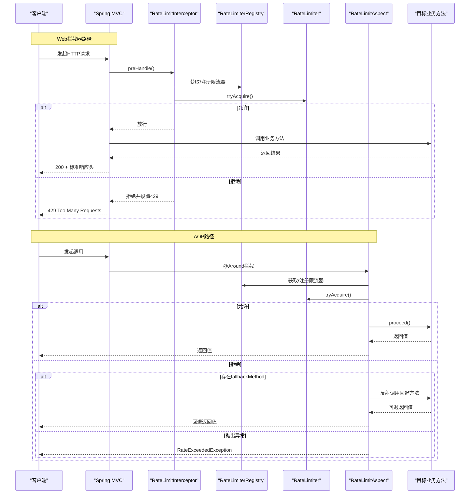
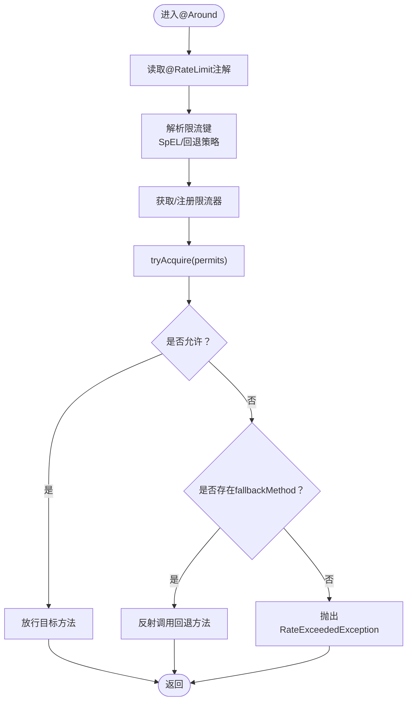
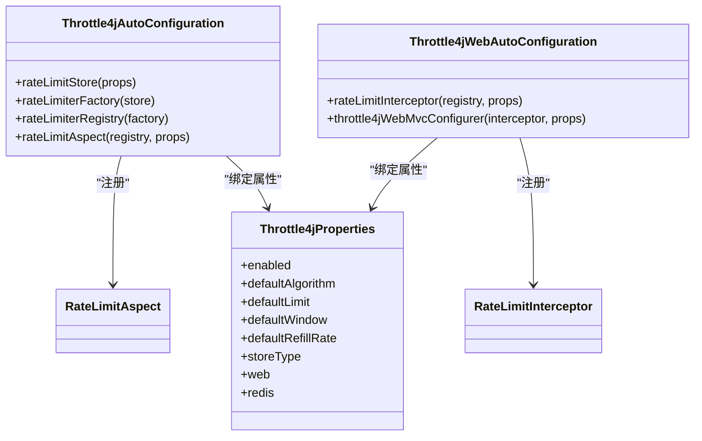
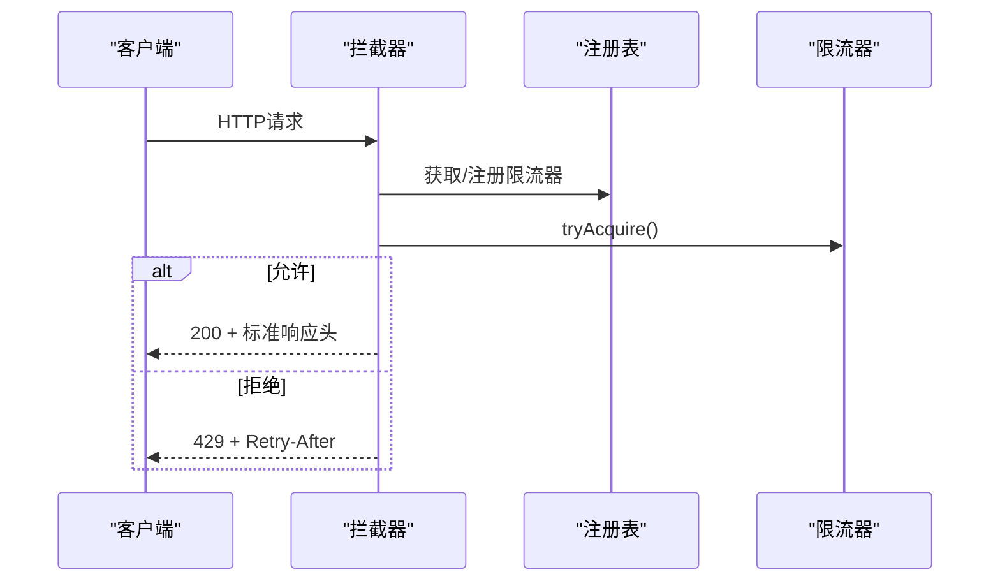
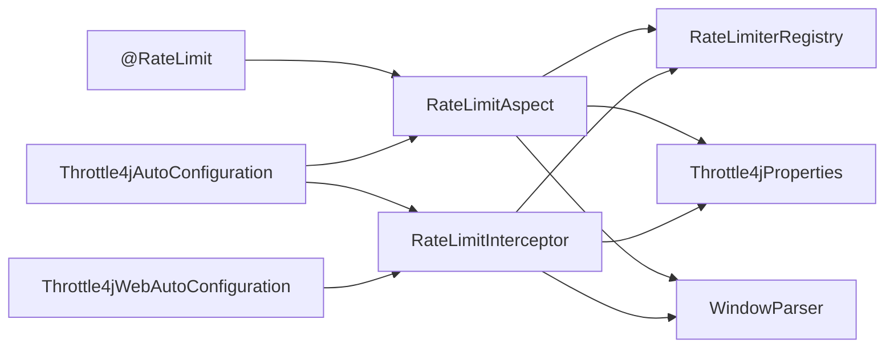

# Spring Boot集成

<cite>
**本文引用的文件**
- [RateLimit.java](file://throttle4j-spring-boot-starter/src/main/java/com/throttle4j/spring/annotation/RateLimit.java)
- [RateLimitAspect.java](file://throttle4j-spring-boot-starter/src/main/java/com/throttle4j/spring/aop/RateLimitAspect.java)
- [Throttle4jAutoConfiguration.java](file://throttle4j-spring-boot-starter/src/main/java/com/throttle4j/spring/autoconfigure/Throttle4jAutoConfiguration.java)
- [Throttle4jProperties.java](file://throttle4j-spring-boot-starter/src/main/java/com/throttle4j/spring/autoconfigure/Throttle4jProperties.java)
- [RateLimitInterceptor.java](file://throttle4j-spring-boot-starter/src/main/java/com/throttle4j/spring/web/RateLimitInterceptor.java)
- [Throttle4jWebAutoConfiguration.java](file://throttle4j-spring-boot-starter/src/main/java/com/throttle4j/spring/web/Throttle4jWebAutoConfiguration.java)
- [WindowParser.java](file://throttle4j-spring-boot-starter/src/main/java/com/throttle4j/spring/util/WindowParser.java)
- [spring.factories](file://throttle4j-spring-boot-starter/src/main/resources/META-INF/spring.factories)
- [ExampleController.java](file://throttle4j-examples/src/main/java/com/throttle4j/example/ExampleController.java)
- [application.yml](file://throttle4j-examples/src/main/resources/application.yml)
- [RateLimitAspectTest.java](file://throttle4j-spring-boot-starter/src/test/java/com/throttle4j/spring/aop/RateLimitAspectTest.java)
- [Algorithm.java](file://throttle4j-core/src/main/java/com/throttle4j/core/Algorithm.java)
- [RateLimiterConfig.java](file://throttle4j-core/src/main/java/com/throttle4j/core/RateLimiterConfig.java)
</cite>

## 目录
1. [简介](#简介)
2. [项目结构](#项目结构)
3. [核心组件](#核心组件)
4. [架构总览](#架构总览)
5. [组件详解](#组件详解)
6. [依赖关系分析](#依赖关系分析)
7. [性能考量](#性能考量)
8. [故障排除指南](#故障排除指南)
9. [结论](#结论)
10. [附录：配置与用法参考](#附录配置与用法参考)

## 简介
本文件面向希望在Spring Boot应用中集成throttle4j的开发者，系统性讲解以下内容：
- @RateLimit注解的使用方法、参数与SpEL表达式支持
- AOP切面的实现原理（切入点、通知类型、执行顺序）
- 自动配置的工作机制（条件注解、Bean定义、属性绑定）
- Web拦截器的实现（请求处理流程、响应头设置）
- 完整配置项（全局与方法级）
- 常见使用模式与最佳实践（异常处理、自定义响应格式）
- 故障排除与性能优化建议

## 项目结构
throttle4j采用多模块设计，其中与Spring Boot集成相关的核心位于throttle4j-spring-boot-starter模块，示例与测试位于throttle4j-examples与对应test包中。

图表来源
- [RateLimit.java:1-75](file://throttle4j-spring-boot-starter/src/main/java/com/throttle4j/spring/annotation/RateLimit.java#L1-L75)
- [RateLimitAspect.java:1-186](file://throttle4j-spring-boot-starter/src/main/java/com/throttle4j/spring/aop/RateLimitAspect.java#L1-L186)
- [Throttle4jAutoConfiguration.java:1-132](file://throttle4j-spring-boot-starter/src/main/java/com/throttle4j/spring/autoconfigure/Throttle4jAutoConfiguration.java#L1-L132)
- [Throttle4jWebAutoConfiguration.java:1-62](file://throttle4j-spring-boot-starter/src/main/java/com/throttle4j/spring/web/Throttle4jWebAutoConfiguration.java#L1-L62)
- [RateLimitInterceptor.java:1-126](file://throttle4j-spring-boot-starter/src/main/java/com/throttle4j/spring/web/RateLimitInterceptor.java#L1-L126)
- [Throttle4jProperties.java:1-202](file://throttle4j-spring-boot-starter/src/main/java/com/throttle4j/spring/autoconfigure/Throttle4jProperties.java#L1-L202)
- [WindowParser.java:1-76](file://throttle4j-spring-boot-starter/src/main/java/com/throttle4j/spring/util/WindowParser.java#L1-L76)
- [Algorithm.java:1-16](file://throttle4j-core/src/main/java/com/throttle4j/core/Algorithm.java#L1-L16)
- [RateLimiterConfig.java:1-113](file://throttle4j-core/src/main/java/com/throttle4j/core/RateLimiterConfig.java#L1-L113)
- [ExampleController.java:1-36](file://throttle4j-examples/src/main/java/com/throttle4j/example/ExampleController.java#L1-L36)
- [application.yml:1-10](file://throttle4j-examples/src/main/resources/application.yml#L1-L10)
- [RateLimitAspectTest.java:1-129](file://throttle4j-spring-boot-starter/src/test/java/com/throttle4j/spring/aop/RateLimitAspectTest.java#L1-L129)

章节来源
- [spring.factories:1-4](file://throttle4j-spring-boot-starter/src/main/resources/META-INF/spring.factories#L1-L4)

## 核心组件
- 注解层：@RateLimit用于声明式限流，支持SpEL键表达式、限流参数、算法选择与回退方法。
- 切面层：RateLimitAspect通过@Around拦截带@RateLimit的方法，按需构建或复用限流器，执行许可判定，触发回退或抛出异常。
- 自动配置层：Throttle4jAutoConfiguration与Throttle4jWebAutoConfiguration分别注册默认存储、工厂、注册表、AOP切面与Web拦截器。
- 属性层：Throttle4jProperties提供全局开关、默认算法/窗口/配额、默认令牌桶刷新率、存储类型、Web拦截器路径规则与Redis连接参数。
- 工具层：WindowParser负责将“1m”、“30s”等字符串解析为毫秒数。
- 拦截器层：RateLimitInterceptor基于HTTP方法+URI生成键，注入标准响应头并在拒绝时返回429。

章节来源
- [RateLimit.java:11-75](file://throttle4j-spring-boot-starter/src/main/java/com/throttle4j/spring/annotation/RateLimit.java#L11-L75)
- [RateLimitAspect.java:30-186](file://throttle4j-spring-boot-starter/src/main/java/com/throttle4j/spring/aop/RateLimitAspect.java#L30-L186)
- [Throttle4jAutoConfiguration.java:19-132](file://throttle4j-spring-boot-starter/src/main/java/com/throttle4j/spring/autoconfigure/Throttle4jAutoConfiguration.java#L19-L132)
- [Throttle4jWebAutoConfiguration.java:16-62](file://throttle4j-spring-boot-starter/src/main/java/com/throttle4j/spring/web/Throttle4jWebAutoConfiguration.java#L16-L62)
- [Throttle4jProperties.java:5-202](file://throttle4j-spring-boot-starter/src/main/java/com/throttle4j/spring/autoconfigure/Throttle4jProperties.java#L5-L202)
- [WindowParser.java:6-76](file://throttle4j-spring-boot-starter/src/main/java/com/throttle4j/spring/util/WindowParser.java#L6-L76)
- [RateLimitInterceptor.java:18-126](file://throttle4j-spring-boot-starter/src/main/java/com/throttle4j/spring/web/RateLimitInterceptor.java#L18-L126)

## 架构总览
下图展示从请求到响应的端到端流程，涵盖AOP与Web拦截器两条路径。

图表来源
- [RateLimitInterceptor.java:55-79](file://throttle4j-spring-boot-starter/src/main/java/com/throttle4j/spring/web/RateLimitInterceptor.java#L55-L79)
- [RateLimitAspect.java:68-91](file://throttle4j-spring-boot-starter/src/main/java/com/throttle4j/spring/aop/RateLimitAspect.java#L68-L91)
- [Throttle4jAutoConfiguration.java:126-130](file://throttle4j-spring-boot-starter/src/main/java/com/throttle4j/spring/autoconfigure/Throttle4jAutoConfiguration.java#L126-L130)
- [Throttle4jWebAutoConfiguration.java:36-60](file://throttle4j-spring-boot-starter/src/main/java/com/throttle4j/spring/web/Throttle4jWebAutoConfiguration.java#L36-L60)

## 组件详解

### @RateLimit注解
- 作用域：方法级别
- 主要属性
  - key：限流键，支持SpEL表达式；为空时默认使用“类名.方法名”
  - limit：窗口内最大允许请求数
  - window：时间窗口，支持“1m”、“30s”、“1h”等简写
  - algorithm：算法，默认滑动窗口
  - permits：每次调用消耗配额，默认1
  - fallbackMethod：被拒绝时的回退方法名称（同Bean内相同签名）
- 表达式支持：当key包含SpEL变量时，会基于方法参数名与位置变量进行求值；若表达式无效则回退到方法签名作为键

章节来源
- [RateLimit.java:11-75](file://throttle4j-spring-boot-starter/src/main/java/com/throttle4j/spring/annotation/RateLimit.java#L11-L75)

### AOP切面实现原理
- 切入点：匹配带有@RateLimit注解的方法
- 通知类型：@Around环绕通知
- 执行顺序：在目标方法前进行限流判定，根据结果决定放行、调用回退方法或抛出异常
- 关键逻辑
  - 解析限流键：优先使用SpEL表达式，否则回退到“类名.方法名”
  - 构建/获取限流器：基于注解参数与WindowParser解析的时间窗口构建配置
  - 许可判定：tryAcquire后若不允许，走回退或异常分支
  - 回退机制：反射查找同Bean内的fallbackMethod并调用，异常链透传
  - 性能优化：SpEL表达式求值上下文缓存于ConcurrentHashMap

图表来源
- [RateLimitAspect.java:68-186](file://throttle4j-spring-boot-starter/src/main/java/com/throttle4j/spring/aop/RateLimitAspect.java#L68-L186)

章节来源
- [RateLimitAspect.java:30-186](file://throttle4j-spring-boot-starter/src/main/java/com/throttle4j/spring/aop/RateLimitAspect.java#L30-L186)
- [WindowParser.java:20-76](file://throttle4j-spring-boot-starter/src/main/java/com/throttle4j/spring/util/WindowParser.java#L20-L76)

### 自动配置工作机制
- 条件注解
  - Throttle4jAutoConfiguration：当throttle4j.enabled=true时启用，且仅在未存在对应Bean时注册
  - Throttle4jWebAutoConfiguration：仅在Servlet Web应用且throttle4j.web.enabled=true时启用
- Bean定义
  - RateLimitStore：默认内存存储；当storeType=REDIS且throttle4j-redis可用时尝试反射构造Redis存储
  - RateLimiterFactory：基于所选存储创建工厂
  - RateLimiterRegistry：共享注册表
  - RateLimitAspect：连接注解与限流器
  - RateLimitInterceptor：Web拦截器（由Web自动配置注册）
- 属性绑定：Throttle4jProperties通过@ConfigurationProperties绑定throttle4j.*前缀配置

图表来源
- [Throttle4jAutoConfiguration.java:27-132](file://throttle4j-spring-boot-starter/src/main/java/com/throttle4j/spring/autoconfigure/Throttle4jAutoConfiguration.java#L27-L132)
- [Throttle4jWebAutoConfiguration.java:23-62](file://throttle4j-spring-boot-starter/src/main/java/com/throttle4j/spring/web/Throttle4jWebAutoConfiguration.java#L23-L62)
- [Throttle4jProperties.java:9-202](file://throttle4j-spring-boot-starter/src/main/java/com/throttle4j/spring/autoconfigure/Throttle4jProperties.java#L9-L202)

章节来源
- [Throttle4jAutoConfiguration.java:19-132](file://throttle4j-spring-boot-starter/src/main/java/com/throttle4j/spring/autoconfigure/Throttle4jAutoConfiguration.java#L19-L132)
- [Throttle4jWebAutoConfiguration.java:16-62](file://throttle4j-spring-boot-starter/src/main/java/com/throttle4j/spring/web/Throttle4jWebAutoConfiguration.java#L16-L62)
- [Throttle4jProperties.java:5-202](file://throttle4j-spring-boot-starter/src/main/java/com/throttle4j/spring/autoconfigure/Throttle4jProperties.java#L5-L202)

### Web拦截器实现
- 请求处理流程
  - 键生成：request.getMethod() + ":" + request.getRequestURI()
  - 限流判定：tryAcquire，设置标准响应头
  - 拒绝处理：设置Retry-After与429状态码
- 响应头
  - X-RateLimit-Limit：窗口限额
  - X-RateLimit-Remaining：剩余配额
  - X-RateLimit-Reset：重置时间戳
  - Retry-After：秒级重试等待时间
- 默认配置：来自Throttle4jProperties的defaultAlgorithm/defaultLimit/defaultWindow/defaultRefillRate

图表来源
- [RateLimitInterceptor.java:55-79](file://throttle4j-spring-boot-starter/src/main/java/com/throttle4j/spring/web/RateLimitInterceptor.java#L55-L79)

章节来源
- [RateLimitInterceptor.java:18-126](file://throttle4j-spring-boot-starter/src/main/java/com/throttle4j/spring/web/RateLimitInterceptor.java#L18-L126)

### 配置选项与使用示例
- 全局配置（application.yml示例）
  - throttle4j.enabled：总开关
  - throttle4j.default-algorithm：默认算法（如TOKEN_BUCKET）
  - throttle4j.default-limit：默认限额
  - throttle4j.default-window：默认窗口（如1m）
  - throttle4j.store-type：存储类型（memory/redis）
  - throttle4j.web.enabled：启用Web拦截器
  - throttle4j.web.include-patterns/exclude-patterns：拦截路径规则
  - throttle4j.redis.*：Redis连接参数（host/port/password/database/keyPrefix）
- 方法级配置（@RateLimit）
  - key、limit、window、algorithm、permits、fallbackMethod
- 示例控制器展示了不同算法与限流策略的使用

章节来源
- [application.yml:1-10](file://throttle4j-examples/src/main/resources/application.yml#L1-L10)
- [ExampleController.java:9-36](file://throttle4j-examples/src/main/java/com/throttle4j/example/ExampleController.java#L9-L36)
- [Throttle4jProperties.java:12-202](file://throttle4j-spring-boot-starter/src/main/java/com/throttle4j/spring/autoconfigure/Throttle4jProperties.java#L12-L202)
- [RateLimit.java:28-74](file://throttle4j-spring-boot-starter/src/main/java/com/throttle4j/spring/annotation/RateLimit.java#L28-L74)

## 依赖关系分析
- 组件耦合
  - RateLimitAspect与RateLimiterRegistry、Throttle4jProperties强耦合，负责注解解析与限流决策
  - RateLimitInterceptor与RateLimiterRegistry、Throttle4jProperties强耦合，负责Web层限流
  - Throttle4jAutoConfiguration与Throttle4jWebAutoConfiguration通过条件注解避免重复注册
- 外部依赖
  - Spring AOP（@Aspect、@Around）、Spring Web MVC（HandlerInterceptor、WebMvcConfigurer）
  - 可选Redis存储（运行时反射加载）

图表来源
- [RateLimitAspect.java:40-59](file://throttle4j-spring-boot-starter/src/main/java/com/throttle4j/spring/aop/RateLimitAspect.java#L40-L59)
- [RateLimitInterceptor.java:39-49](file://throttle4j-spring-boot-starter/src/main/java/com/throttle4j/spring/web/RateLimitInterceptor.java#L39-L49)
- [Throttle4jAutoConfiguration.java:126-130](file://throttle4j-spring-boot-starter/src/main/java/com/throttle4j/spring/autoconfigure/Throttle4jAutoConfiguration.java#L126-L130)
- [Throttle4jWebAutoConfiguration.java:36-60](file://throttle4j-spring-boot-starter/src/main/java/com/throttle4j/spring/web/Throttle4jWebAutoConfiguration.java#L36-L60)

章节来源
- [Throttle4jAutoConfiguration.java:19-132](file://throttle4j-spring-boot-starter/src/main/java/com/throttle4j/spring/autoconfigure/Throttle4jAutoConfiguration.java#L19-L132)
- [Throttle4jWebAutoConfiguration.java:16-62](file://throttle4j-spring-boot-starter/src/main/java/com/throttle4j/spring/web/Throttle4jWebAutoConfiguration.java#L16-L62)

## 性能考量
- 表达式求值缓存：对SpEL表达式进行缓存以降低重复解析开销
- 限流器复用：通过注册表按键复用已存在的限流器实例
- 窗口解析：WindowParser使用正则预编译，解析效率高
- 算法选择：令牌桶适合突发流量控制，滑动窗口更平滑；固定/漏斗窗口各有适用场景
- Redis存储：跨进程/跨节点共享状态，但引入网络延迟；内存存储本地低延迟但不跨实例共享

## 故障排除指南
- 问题：启用Web拦截器无效
  - 检查throttle4j.web.enabled=true且应用为Servlet Web
  - 确认include/exclude路径规则符合预期
- 问题：@RateLimit注解不生效
  - 确认Throttle4jAutoConfiguration已注册且未被用户覆盖
  - 检查@EnableAspectJAutoProxy是否启用（测试环境常见）
- 问题：SpEL键解析失败
  - 日志会记录警告并回退到方法签名作为键
  - 检查表达式语法与参数名是否正确
- 问题：Redis存储不可用
  - 当storeType=REDIS但throttle4j-redis不在classpath时，自动回退到内存存储并打印警告
- 问题：429频繁出现
  - 检查defaultLimit/defaultWindow与实际流量是否匹配
  - 对于令牌桶，确认defaultRefillRate足够支撑峰值

章节来源
- [Throttle4jWebAutoConfiguration.java:23-29](file://throttle4j-spring-boot-starter/src/main/java/com/throttle4j/spring/web/Throttle4jWebAutoConfiguration.java#L23-L29)
- [Throttle4jAutoConfiguration.java:45-57](file://throttle4j-spring-boot-starter/src/main/java/com/throttle4j/spring/autoconfigure/Throttle4jAutoConfiguration.java#L45-L57)
- [RateLimitAspect.java:127-137](file://throttle4j-spring-boot-starter/src/main/java/com/throttle4j/spring/aop/RateLimitAspect.java#L127-L137)

## 结论
throttle4j通过简洁的@RateLimit注解与完善的自动配置，为Spring Boot应用提供了声明式、可扩展的限流能力。AOP与Web拦截器双通道覆盖了方法级与URL级的限流需求，配合灵活的算法与存储选择，能够满足从单体应用到分布式场景的多种限制策略。

## 附录：配置与用法参考

### 配置项一览（throttle4j.*）
- enabled：布尔，总开关
- default-algorithm：字符串，全局默认算法（如TOKEN_BUCKET）
- default-limit：长整型，全局默认限额
- default-window：字符串，全局默认窗口（如1m）
- default-refill-rate：长整型，令牌桶默认刷新速率（每秒）
- store-type：枚举，MEMORY/REDIS
- web.enabled：布尔，启用全局Web拦截器
- web.include-patterns：数组，包含路径
- web.exclude-patterns：数组，排除路径
- redis.host/port/password/database/keyPrefix：Redis连接参数

章节来源
- [Throttle4jProperties.java:12-202](file://throttle4j-spring-boot-starter/src/main/java/com/throttle4j/spring/autoconfigure/Throttle4jProperties.java#L12-L202)

### 使用模式与最佳实践
- 全局异常处理
  - 在Web拦截器路径中，拒绝时返回429；可在全局异常处理器中统一包装响应格式
- 自定义响应格式
  - 在fallbackMethod中返回统一的错误对象或DTO，便于前端消费
- 最佳实践
  - 优先使用滑动窗口或令牌桶算法
  - 合理设置defaultLimit与defaultWindow，结合业务峰值与恢复时间
  - 对热点接口使用方法级@RateLimit覆盖全局策略
  - 在分布式部署中选择Redis存储并配置合适的keyPrefix

章节来源
- [RateLimitInterceptor.java:72-78](file://throttle4j-spring-boot-starter/src/main/java/com/throttle4j/spring/web/RateLimitInterceptor.java#L72-L78)
- [RateLimitAspectTest.java:56-62](file://throttle4j-spring-boot-starter/src/test/java/com/throttle4j/spring/aop/RateLimitAspectTest.java#L56-L62)