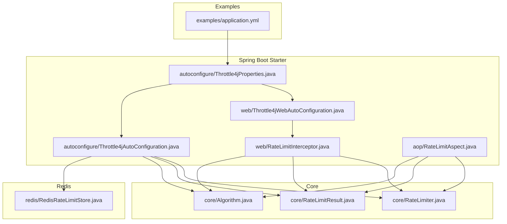
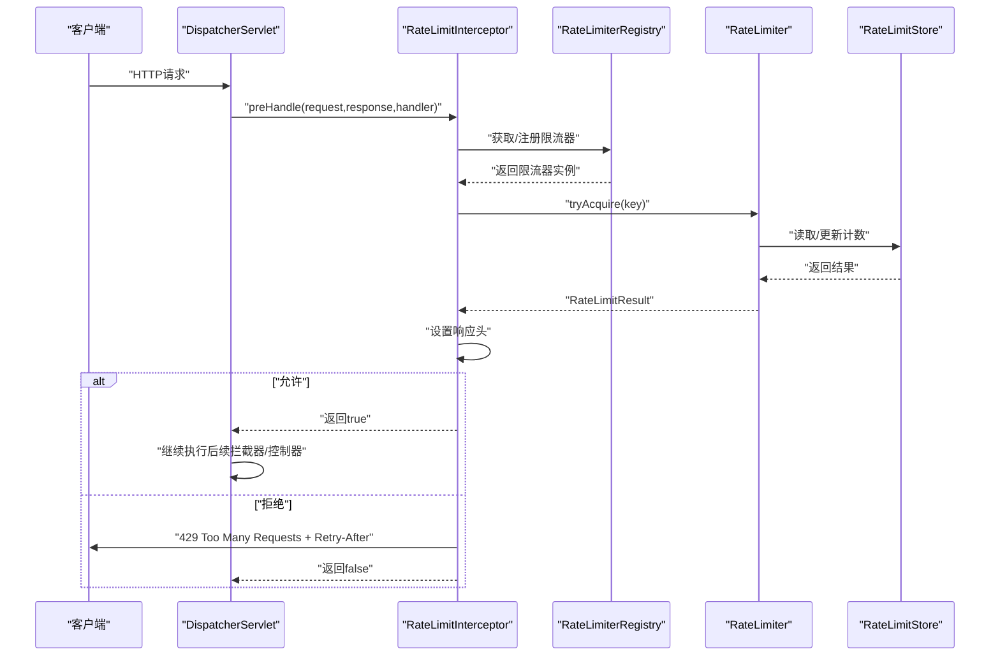
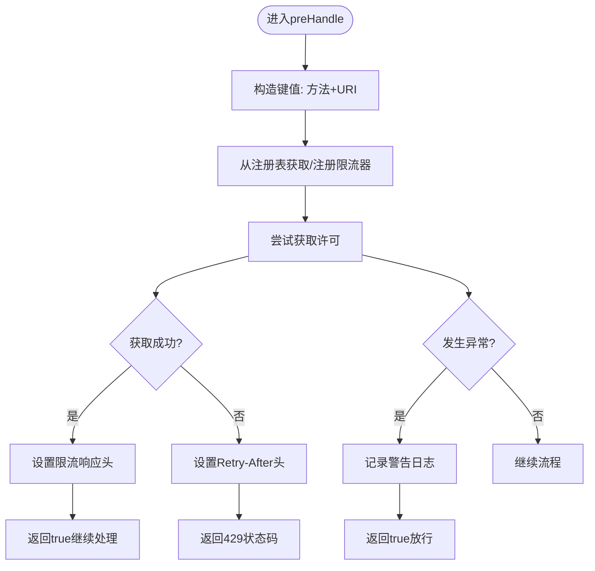
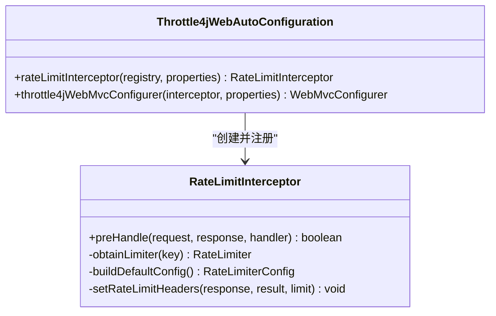
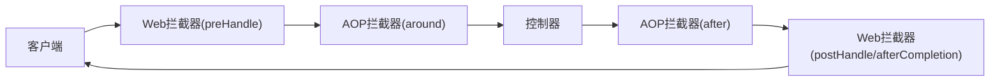
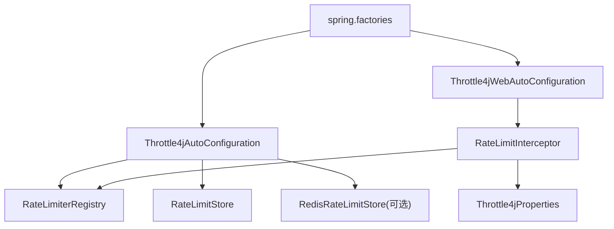

# Web拦截器

<cite>
**本文引用的文件**
- [RateLimitInterceptor.java](file://throttle4j-spring-boot-starter/src/main/java/com/throttle4j/spring/web/RateLimitInterceptor.java)
- [Throttle4jWebAutoConfiguration.java](file://throttle4j-spring-boot-starter/src/main/java/com/throttle4j/spring/web/Throttle4jWebAutoConfiguration.java)
- [Throttle4jAutoConfiguration.java](file://throttle4j-spring-boot-starter/src/main/java/com/throttle4j/spring/autoconfigure/Throttle4jAutoConfiguration.java)
- [Throttle4jProperties.java](file://throttle4j-spring-boot-starter/src/main/java/com/throttle4j/spring/autoconfigure/Throttle4jProperties.java)
- [RateLimitAspect.java](file://throttle4j-spring-boot-starter/src/main/java/com/throttle4j/spring/aop/RateLimitAspect.java)
- [RateLimiter.java](file://throttle4j-core/src/main/java/com/throttle4j/core/RateLimiter.java)
- [RateLimitResult.java](file://throttle4j-core/src/main/java/com/throttle4j/core/RateLimitResult.java)
- [Algorithm.java](file://throttle4j-core/src/main/java/com/throttle4j/core/Algorithm.java)
- [spring.factories](file://throttle4j-spring-boot-starter/src/main/resources/META-INF/spring.factories)
- [application.yml](file://throttle4j-examples/src/main/resources/application.yml)
</cite>

## 目录
1. [简介](#简介)
2. [项目结构](#项目结构)
3. [核心组件](#核心组件)
4. [架构总览](#架构总览)
5. [详细组件分析](#详细组件分析)
6. [依赖关系分析](#依赖关系分析)
7. [性能考量](#性能考量)
8. [故障排查指南](#故障排查指南)
9. [结论](#结论)
10. [附录](#附录)

## 简介
本文件聚焦于throttle4j在Spring Web层的全局URL路径级拦截器实现，系统性解析RateLimitInterceptor的工作原理与集成方式，涵盖：
- HandlerInterceptor接口实现与拦截时机
- 请求处理流程（预处理、后处理、异常处理）
- 拦截器注册与配置（WebMvcConfigurer、拦截路径）
- 响应头设置机制（限流相关信息传递）
- 拦截器链执行顺序与与其他拦截器的关系
- 性能优化与最佳实践（避免重复拦截、提升处理效率）

## 项目结构
throttle4j采用多模块设计，Web拦截器位于spring-boot-starter模块中，核心速率限制逻辑位于core模块，Redis支持位于redis模块，示例位于examples模块。

图表来源
- [RateLimitInterceptor.java:1-126](file://throttle4j-spring-boot-starter/src/main/java/com/throttle4j/spring/web/RateLimitInterceptor.java#L1-L126)
- [Throttle4jWebAutoConfiguration.java:1-62](file://throttle4j-spring-boot-starter/src/main/java/com/throttle4j/spring/web/Throttle4jWebAutoConfiguration.java#L1-L62)
- [Throttle4jAutoConfiguration.java:1-132](file://throttle4j-spring-boot-starter/src/main/java/com/throttle4j/spring/autoconfigure/Throttle4jAutoConfiguration.java#L1-L132)
- [Throttle4jProperties.java:1-202](file://throttle4j-spring-boot-starter/src/main/java/com/throttle4j/spring/autoconfigure/Throttle4jProperties.java#L1-L202)
- [RateLimitAspect.java:1-186](file://throttle4j-spring-boot-starter/src/main/java/com/throttle4j/spring/aop/RateLimitAspect.java#L1-L186)
- [RateLimiter.java:1-32](file://throttle4j-core/src/main/java/com/throttle4j/core/RateLimiter.java#L1-L32)
- [RateLimitResult.java:1-68](file://throttle4j-core/src/main/java/com/throttle4j/core/RateLimitResult.java#L1-L68)
- [Algorithm.java:1-16](file://throttle4j-core/src/main/java/com/throttle4j/core/Algorithm.java#L1-L16)

章节来源
- [spring.factories:1-4](file://throttle4j-spring-boot-starter/src/main/resources/META-INF/spring.factories#L1-L4)
- [application.yml:1-10](file://throttle4j-examples/src/main/resources/application.yml#L1-L10)

## 核心组件
- RateLimitInterceptor：基于URL路径的全局Web拦截器，实现HandlerInterceptor接口，在preHandle阶段进行限流判断与响应头设置。
- Throttle4jWebAutoConfiguration：条件化自动配置，注册拦截器并按配置的include/exclude模式添加到拦截器链。
- Throttle4jAutoConfiguration：核心自动配置，提供默认存储、工厂与注册表，并可选择Redis存储。
- Throttle4jProperties：配置属性，控制全局拦截器开关、默认算法、默认窗口、默认配额等。
- RateLimitAspect：基于注解的AOP拦截，适用于方法级限流，与Web拦截器互补。

章节来源
- [RateLimitInterceptor.java:26-126](file://throttle4j-spring-boot-starter/src/main/java/com/throttle4j/spring/web/RateLimitInterceptor.java#L26-L126)
- [Throttle4jWebAutoConfiguration.java:23-62](file://throttle4j-spring-boot-starter/src/main/java/com/throttle4j/spring/web/Throttle4jWebAutoConfiguration.java#L23-L62)
- [Throttle4jAutoConfiguration.java:27-132](file://throttle4j-spring-boot-starter/src/main/java/com/throttle4j/spring/autoconfigure/Throttle4jAutoConfiguration.java#L27-L132)
- [Throttle4jProperties.java:9-202](file://throttle4j-spring-boot-starter/src/main/java/com/throttle4j/spring/autoconfigure/Throttle4jProperties.java#L9-L202)
- [RateLimitAspect.java:39-186](file://throttle4j-spring-boot-starter/src/main/java/com/throttle4j/spring/aop/RateLimitAspect.java#L39-L186)

## 架构总览
Web拦截器通过自动配置在Servlet Web应用启动时被激活，使用共享的RateLimiterRegistry为每个请求生成或复用限流器实例，基于HTTP方法+URI构造键值，调用限流算法进行许可获取，并在响应头中返回限流状态信息。

图表来源
- [RateLimitInterceptor.java:55-79](file://throttle4j-spring-boot-starter/src/main/java/com/throttle4j/spring/web/RateLimitInterceptor.java#L55-L79)
- [RateLimiter.java:8-31](file://throttle4j-core/src/main/java/com/throttle4j/core/RateLimiter.java#L8-L31)
- [Throttle4jAutoConfiguration.java:115-119](file://throttle4j-spring-boot-starter/src/main/java/com/throttle4j/spring/autoconfigure/Throttle4jAutoConfiguration.java#L115-L119)

## 详细组件分析

### RateLimitInterceptor工作原理
- 接口实现与拦截时机
  - 实现HandlerInterceptor接口，仅在preHandle阶段进行限流判断，不参与postHandle与afterCompletion阶段的业务处理。
  - 键值构造：以“HTTP方法:请求URI”作为唯一标识，确保不同端点独立限流。
- 预处理阶段
  - 获取或注册限流器：若注册表中不存在对应键，则根据Throttle4jProperties构建默认配置并注册。
  - 尝试获取许可：调用限流器的tryAcquire(key)，捕获运行时异常并降级为放行。
  - 设置响应头：无论是否允许，均设置标准限流头（X-RateLimit-Limit、X-RateLimit-Remaining、X-RateLimit-Reset）。
  - 拒绝处理：当不允许时，设置Retry-After头（秒），返回429状态码，阻止后续处理。
- 后处理与异常处理
  - 该拦截器不修改模型或视图，也不进行异常处理；异常由Spring MVC统一处理。
- 响应头设置机制
  - X-RateLimit-Limit：当前窗口的配额上限
  - X-RateLimit-Remaining：当前窗口剩余配额
  - X-RateLimit-Reset：窗口重置时间（毫秒时间戳）
  - Retry-After：建议客户端重试等待秒数（当被拒绝时）

图表来源
- [RateLimitInterceptor.java:55-124](file://throttle4j-spring-boot-starter/src/main/java/com/throttle4j/spring/web/RateLimitInterceptor.java#L55-L124)

章节来源
- [RateLimitInterceptor.java:26-126](file://throttle4j-spring-boot-starter/src/main/java/com/throttle4j/spring/web/RateLimitInterceptor.java#L26-L126)

### 拦截器注册与配置
- 自动配置激活
  - 条件注解：仅在Servlet Web应用且throttle4j.web.enabled=true时生效。
  - 依赖前置：先加载核心自动配置，再加载Web自动配置。
- 注册流程
  - 定义拦截器Bean：注入共享的RateLimiterRegistry与Throttle4jProperties。
  - 通过WebMvcConfigurer.addInterceptors注册，支持includePatterns与excludePatterns。
  - 默认include为/**，可按需覆盖；exclude为空数组。
- 配置项
  - throttle4j.web.enabled：启用全局Web拦截器
  - throttle4j.web.include-patterns：包含路径模式数组
  - throttle4j.web.exclude-patterns：排除路径模式数组

图表来源
- [Throttle4jWebAutoConfiguration.java:36-60](file://throttle4j-spring-boot-starter/src/main/java/com/throttle4j/spring/web/Throttle4jWebAutoConfiguration.java#L36-L60)
- [RateLimitInterceptor.java:46-124](file://throttle4j-spring-boot-starter/src/main/java/com/throttle4j/spring/web/RateLimitInterceptor.java#L46-L124)

章节来源
- [Throttle4jWebAutoConfiguration.java:23-62](file://throttle4j-spring-boot-starter/src/main/java/com/throttle4j/spring/web/Throttle4jWebAutoConfiguration.java#L23-L62)
- [Throttle4jProperties.java:112-147](file://throttle4j-spring-boot-starter/src/main/java/com/throttle4j/spring/autoconfigure/Throttle4jProperties.java#L112-L147)

### 与AOP拦截器的关系
- 作用域互补
  - Web拦截器：URL路径级全局拦截，适合统一的API限流策略。
  - AOP拦截器：方法级注解拦截，适合细粒度、可配置的限流策略。
- 共享基础设施
  - 两者均依赖共享的RateLimiterRegistry与RateLimiterConfig，保证配置一致性。
- 执行顺序
  - Web拦截器在DispatcherServlet的拦截器链中按注册顺序执行；AOP拦截器在目标方法调用前后执行。两者可并存，但需注意重复限流与头信息叠加的影响。

图表来源
- [RateLimitInterceptor.java:55-79](file://throttle4j-spring-boot-starter/src/main/java/com/throttle4j/spring/web/RateLimitInterceptor.java#L55-L79)
- [RateLimitAspect.java:68-91](file://throttle4j-spring-boot-starter/src/main/java/com/throttle4j/spring/aop/RateLimitAspect.java#L68-L91)

章节来源
- [RateLimitAspect.java:39-186](file://throttle4j-spring-boot-starter/src/main/java/com/throttle4j/spring/aop/RateLimitAspect.java#L39-L186)

### 限流算法与配置
- 默认算法与窗口
  - 默认算法来自Throttle4jProperties.defaultAlgorithm，默认令牌桶（TOKEN_BUCKET）。
  - 窗口大小来自Throttle4jProperties.defaultWindow，解析为毫秒。
- 令牌桶补充速率
  - 若未显式配置defaultRefillRate，则按limit/windowMillis推导补充速率。
- 算法枚举
  - 支持FIXED_WINDOW、SLIDING_WINDOW、TOKEN_BUCKET、LEAKY_BUCKET四种算法。

章节来源
- [RateLimitInterceptor.java:89-111](file://throttle4j-spring-boot-starter/src/main/java/com/throttle4j/spring/web/RateLimitInterceptor.java#L89-L111)
- [Throttle4jProperties.java:15-26](file://throttle4j-spring-boot-starter/src/main/java/com/throttle4j/spring/autoconfigure/Throttle4jProperties.java#L15-L26)
- [Algorithm.java:6-15](file://throttle4j-core/src/main/java/com/throttle4j/core/Algorithm.java#L6-L15)

## 依赖关系分析
- Bean装配顺序
  - Throttle4jAutoConfiguration先于Throttle4jWebAutoConfiguration加载，确保共享的RateLimiterRegistry已就绪。
  - spring.factories声明了两个自动配置类，由Spring Boot自动发现。
- 外部依赖
  - Redis存储：当storeType=REDIS且类路径存在throttle4j-redis模块时，反射创建Redis存储；否则回退到内存存储。
- 组件耦合
  - RateLimitInterceptor依赖RateLimiterRegistry与Throttle4jProperties，低耦合高内聚。
  - Web自动配置通过WebMvcConfigurer注入拦截器，符合Spring约定优于配置原则。

图表来源
- [spring.factories:1-4](file://throttle4j-spring-boot-starter/src/main/resources/META-INF/spring.factories#L1-L4)
- [Throttle4jAutoConfiguration.java:45-99](file://throttle4j-spring-boot-starter/src/main/java/com/throttle4j/spring/autoconfigure/Throttle4jAutoConfiguration.java#L45-L99)
- [Throttle4jWebAutoConfiguration.java:36-60](file://throttle4j-spring-boot-starter/src/main/java/com/throttle4j/spring/web/Throttle4jWebAutoConfiguration.java#L36-L60)

章节来源
- [spring.factories:1-4](file://throttle4j-spring-boot-starter/src/main/resources/META-INF/spring.factories#L1-L4)
- [Throttle4jAutoConfiguration.java:27-132](file://throttle4j-spring-boot-starter/src/main/java/com/throttle4j/spring/autoconfigure/Throttle4jAutoConfiguration.java#L27-L132)

## 性能考量
- 避免重复拦截
  - Web拦截器仅在preHandle阶段执行，不会对同一请求重复限流；若同时使用AOP拦截器，需确保键值策略不冲突。
- 提升处理效率
  - 使用共享的RateLimiterRegistry缓存限流器实例，减少重复创建。
  - 令牌桶算法在高并发下表现稳定，配合合理的refillRate可平衡吞吐与突发。
  - Redis存储可跨节点共享状态，适合分布式部署场景。
- 日志与降级
  - 拦截器在限流器异常时记录警告并放行，避免影响正常业务流量。
- 响应头开销
  - 设置标准限流头为O(1)操作，对延迟影响极小；可通过配置关闭不必要的头信息以进一步降低开销。

## 故障排查指南
- 拦截器未生效
  - 检查throttle4j.web.enabled是否为true，且应用类型为Servlet Web。
  - 确认includePatterns与excludePatterns配置正确，避免误排除。
- 429频繁出现
  - 调整defaultLimit与defaultWindow，或针对特定端点使用更细粒度的@RateLimit注解。
  - 检查客户端是否正确处理Retry-After头。
- Redis存储问题
  - 当storeType=REDIS但类路径缺失throttle4j-redis模块时，会回退到内存存储并记录警告。
- 异常处理
  - 拦截器内部异常会被记录并放行，不影响其他拦截器链路；可在上层统一异常处理器中处理RateExceededException。

章节来源
- [Throttle4jWebAutoConfiguration.java:24-28](file://throttle4j-spring-boot-starter/src/main/java/com/throttle4j/spring/web/Throttle4jWebAutoConfiguration.java#L24-L28)
- [Throttle4jAutoConfiguration.java:45-99](file://throttle4j-spring-boot-starter/src/main/java/com/throttle4j/spring/autoconfigure/Throttle4jAutoConfiguration.java#L45-L99)
- [RateLimitInterceptor.java:65-68](file://throttle4j-spring-boot-starter/src/main/java/com/throttle4j/spring/web/RateLimitInterceptor.java#L65-L68)

## 结论
RateLimitInterceptor提供了简单高效的URL路径级全局限流能力，结合Throttle4j的多种限流算法与可插拔存储，能够满足从单机到分布式场景下的限流需求。通过合理的配置与与AOP拦截器的协同，可以在保证系统稳定性的同时，提供清晰的限流反馈与良好的可观测性。

## 附录
- 示例配置参考
  - 示例应用的application.yml展示了如何启用throttle4j并设置默认参数。
- 关键配置项速览
  - throttle4j.enabled：总开关
  - throttle4j.web.enabled：Web拦截器开关
  - throttle4j.web.include-patterns/exclude-patterns：拦截路径规则
  - throttle4j.default-algorithm/default-limit/default-window/default-refill-rate：默认限流策略

章节来源
- [application.yml:4-10](file://throttle4j-examples/src/main/resources/application.yml#L4-L10)