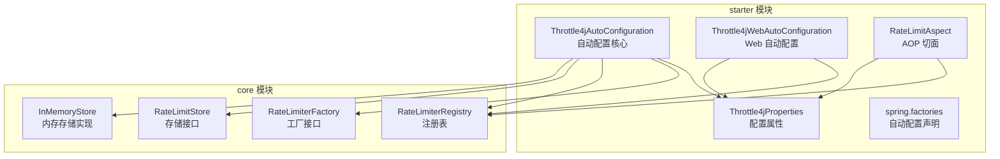
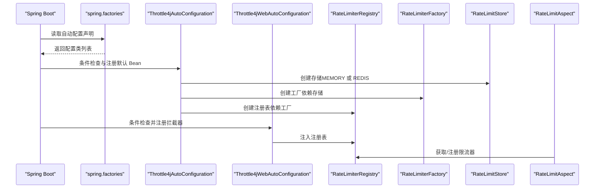
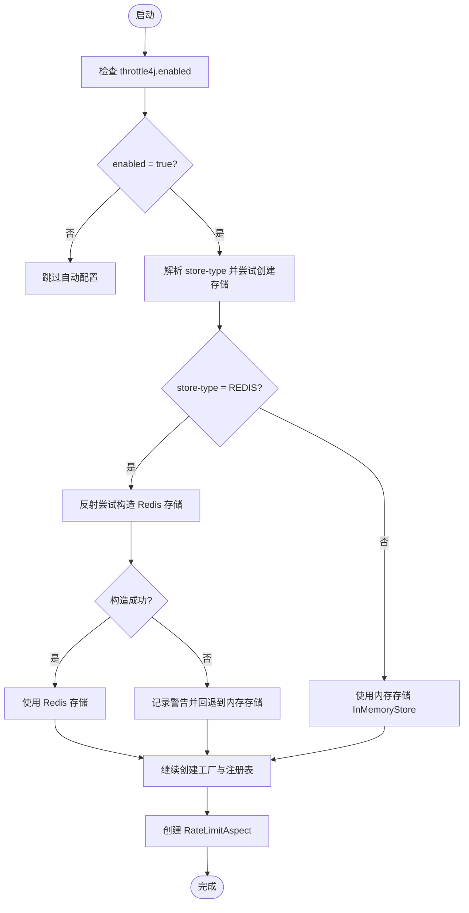
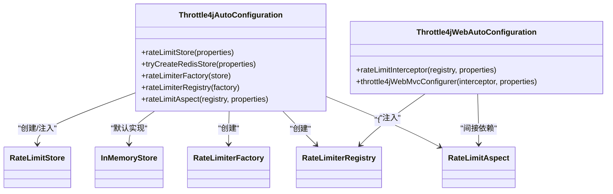
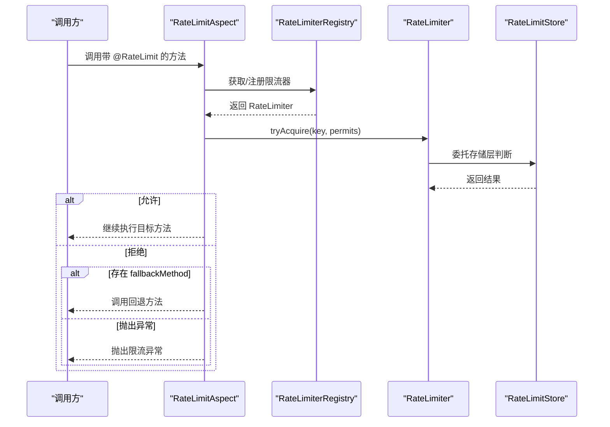
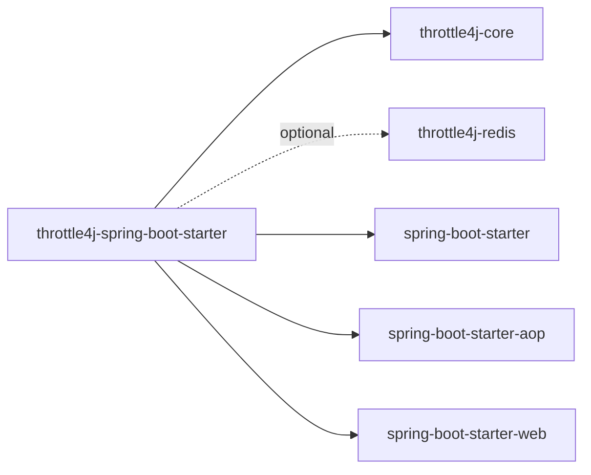

# 自动配置机制

<cite>
**本文引用的文件**
- [Throttle4jAutoConfiguration.java](file://throttle4j-spring-boot-starter/src/main/java/com/throttle4j/spring/autoconfigure/Throttle4jAutoConfiguration.java)
- [Throttle4jProperties.java](file://throttle4j-spring-boot-starter/src/main/java/com/throttle4j/spring/autoconfigure/Throttle4jProperties.java)
- [spring.factories](file://throttle4j-spring-boot-starter/src/main/resources/META-INF/spring.factories)
- [Throttle4jWebAutoConfiguration.java](file://throttle4j-spring-boot-starter/src/main/java/com/throttle4j/spring/web/Throttle4jWebAutoConfiguration.java)
- [RateLimitAspect.java](file://throttle4j-spring-boot-starter/src/main/java/com/throttle4j/spring/aop/RateLimitAspect.java)
- [RateLimiterFactory.java](file://throttle4j-core/src/main/java/com/throttle4j/core/RateLimiterFactory.java)
- [RateLimiterRegistry.java](file://throttle4j-core/src/main/java/com/throttle4j/core/RateLimiterRegistry.java)
- [RateLimitStore.java](file://throttle4j-core/src/main/java/com/throttle4j/store/RateLimitStore.java)
- [InMemoryStore.java](file://throttle4j-core/src/main/java/com/throttle4j/store/InMemoryStore.java)
- [pom.xml（starter）](file://throttle4j-spring-boot-starter/pom.xml)
- [application.yml（示例）](file://throttle4j-examples/src/main/resources/application.yml)
</cite>

## 目录
1. [简介](#简介)
2. [项目结构](#项目结构)
3. [核心组件](#核心组件)
4. [架构总览](#架构总览)
5. [详细组件分析](#详细组件分析)
6. [依赖分析](#依赖分析)
7. [性能考虑](#性能考虑)
8. [故障排查指南](#故障排查指南)
9. [结论](#结论)
10. [附录：配置项参考](#附录配置项参考)

## 简介
本文件系统性阐述 Throttle4j 的自动配置机制，重点覆盖以下方面：
- 条件注解与判断逻辑：如何通过 @ConditionalOnMissingBean、@ConditionalOnProperty 等控制 Bean 注册与覆盖。
- 配置属性绑定：Throttle4jProperties 的字段映射、默认值与命名规则。
- Spring Factories 机制：自动配置类的发现与加载流程。
- Bean 创建顺序与依赖关系：RateLimiter、RateLimitStore、RateLimiterRegistry、RateLimitAspect 等关键 Bean 的初始化链路。
- 配置项参考：所有可配置属性及默认值。
- 自定义与扩展：如何覆盖默认 Bean、选择存储后端、定制拦截器行为。

## 项目结构
Throttle4j 的自动配置位于 spring-boot-starter 模块中，核心文件如下：
- 自动配置类：Throttle4jAutoConfiguration、Throttle4jWebAutoConfiguration
- 配置属性类：Throttle4jProperties
- Spring Factories：META-INF/spring.factories
- AOP 切面：RateLimitAspect
- 核心接口与注册表：RateLimiterFactory、RateLimiterRegistry
- 存储抽象与内存实现：RateLimitStore、InMemoryStore

**图表来源**
- [Throttle4jAutoConfiguration.java:27-131](file://throttle4j-spring-boot-starter/src/main/java/com/throttle4j/spring/autoconfigure/Throttle4jAutoConfiguration.java#L27-L131)
- [Throttle4jWebAutoConfiguration.java:23-61](file://throttle4j-spring-boot-starter/src/main/java/com/throttle4j/spring/web/Throttle4jWebAutoConfiguration.java#L23-L61)
- [Throttle4jProperties.java:9-201](file://throttle4j-spring-boot-starter/src/main/java/com/throttle4j/spring/autoconfigure/Throttle4jProperties.java#L9-L201)
- [RateLimitAspect.java:39-186](file://throttle4j-spring-boot-starter/src/main/java/com/throttle4j/spring/aop/RateLimitAspect.java#L39-L186)
- [RateLimiterFactory.java:1-16](file://throttle4j-core/src/main/java/com/throttle4j/core/RateLimiterFactory.java#L1-L16)
- [RateLimiterRegistry.java:14-61](file://throttle4j-core/src/main/java/com/throttle4j/core/RateLimiterRegistry.java#L14-L61)
- [RateLimitStore.java:15-35](file://throttle4j-core/src/main/java/com/throttle4j/store/RateLimitStore.java#L15-L35)
- [InMemoryStore.java:24-315](file://throttle4j-core/src/main/java/com/throttle4j/store/InMemoryStore.java#L24-L315)

**章节来源**
- [Throttle4jAutoConfiguration.java:19-131](file://throttle4j-spring-boot-starter/src/main/java/com/throttle4j/spring/autoconfigure/Throttle4jAutoConfiguration.java#L19-L131)
- [spring.factories:1-4](file://throttle4j-spring-boot-starter/src/main/resources/META-INF/spring.factories#L1-L4)

## 核心组件
- Throttle4jAutoConfiguration：主自动配置类，负责在满足条件时注册默认的 RateLimitStore、RateLimiterFactory、RateLimiterRegistry、RateLimitAspect，并支持按需覆盖。
- Throttle4jProperties：绑定 throttle4j 前缀下的配置项，提供默认值与嵌套对象（Web、Redis）。
- Throttle4jWebAutoConfiguration：Web 层自动配置，在 Servlet Web 应用中注册全局拦截器。
- RateLimitAspect：基于 AOP 的方法级限流切面，读取 @RateLimit 注解并委托给注册表中的限流器。
- RateLimiterFactory/Registry/RateLimitStore：核心抽象与实现，支撑算法实例化、命名注册与状态持久化。

**章节来源**
- [Throttle4jAutoConfiguration.java:27-131](file://throttle4j-spring-boot-starter/src/main/java/com/throttle4j/spring/autoconfigure/Throttle4jAutoConfiguration.java#L27-L131)
- [Throttle4jProperties.java:9-201](file://throttle4j-spring-boot-starter/src/main/java/com/throttle4j/spring/autoconfigure/Throttle4jProperties.java#L9-L201)
- [Throttle4jWebAutoConfiguration.java:23-61](file://throttle4j-spring-boot-starter/src/main/java/com/throttle4j/spring/web/Throttle4jWebAutoConfiguration.java#L23-L61)
- [RateLimitAspect.java:39-186](file://throttle4j-spring-boot-starter/src/main/java/com/throttle4j/spring/aop/RateLimitAspect.java#L39-L186)
- [RateLimiterFactory.java:1-16](file://throttle4j-core/src/main/java/com/throttle4j/core/RateLimiterFactory.java#L1-L16)
- [RateLimiterRegistry.java:14-61](file://throttle4j-core/src/main/java/com/throttle4j/core/RateLimiterRegistry.java#L14-L61)
- [RateLimitStore.java:15-35](file://throttle4j-core/src/main/java/com/throttle4j/store/RateLimitStore.java#L15-L35)

## 架构总览
自动配置的整体流程如下：
- Spring Boot 启动时读取 spring.factories 中的自动配置声明，加载 Throttle4jAutoConfiguration 与 Throttle4jWebAutoConfiguration。
- Throttle4jAutoConfiguration 根据 throttle4j.enabled 与 throttle4j.store-type 决定是否注册默认 Bean；当 store-type=REDIS 且 Redis 模块可用时，尝试反射构造 Redis 存储。
- Throttle4jWebAutoConfiguration 在 Web 条件满足时注册全局拦截器，并根据 throttle4j.web.* 配置路径模式。
- RateLimitAspect 通过 @Around 拦截带 @RateLimit 的方法，从 RateLimiterRegistry 获取或注册限流器并执行 tryAcquire。

**图表来源**
- [spring.factories:1-4](file://throttle4j-spring-boot-starter/src/main/resources/META-INF/spring.factories#L1-L4)
- [Throttle4jAutoConfiguration.java:27-131](file://throttle4j-spring-boot-starter/src/main/java/com/throttle4j/spring/autoconfigure/Throttle4jAutoConfiguration.java#L27-L131)
- [Throttle4jWebAutoConfiguration.java:23-61](file://throttle4j-spring-boot-starter/src/main/java/com/throttle4j/spring/web/Throttle4jWebAutoConfiguration.java#L23-L61)
- [RateLimitAspect.java:39-186](file://throttle4j-spring-boot-starter/src/main/java/com/throttle4j/spring/aop/RateLimitAspect.java#L39-L186)

## 详细组件分析

### 条件注解与判断逻辑
- @ConditionalOnProperty(prefix = "throttle4j", name = "enabled", havingValue = "true", matchIfMissing = true)
  - 控制整个自动配置是否生效。默认启用，可通过 throttle4j.enabled=false 关闭。
- @ConditionalOnMissingBean
  - 用于每个 @Bean 方法，确保若用户已定义同类型 Bean，则优先使用用户的实现，避免重复注册。
- @AutoConfigureAfter(Throttle4jAutoConfiguration.class)
  - Web 自动配置在核心自动配置之后执行，保证依赖的 Bean 已存在。

**图表来源**
- [Throttle4jAutoConfiguration.java:27-99](file://throttle4j-spring-boot-starter/src/main/java/com/throttle4j/spring/autoconfigure/Throttle4jAutoConfiguration.java#L27-L99)

**章节来源**
- [Throttle4jAutoConfiguration.java:27-99](file://throttle4j-spring-boot-starter/src/main/java/com/throttle4j/spring/autoconfigure/Throttle4jAutoConfiguration.java#L27-L99)
- [Throttle4jWebAutoConfiguration.java:23-61](file://throttle4j-spring-boot-starter/src/main/java/com/throttle4j/spring/web/Throttle4jWebAutoConfiguration.java#L23-L61)

### 配置属性绑定与默认值
Throttle4jProperties 将 throttle4j 前缀下的键映射为字段，默认值如下：
- enabled: true
- defaultAlgorithm: "TOKEN_BUCKET"
- defaultLimit: 100
- defaultWindow: "1m"
- defaultRefillRate: 10
- storeType: MEMORY
- web.enabled: false
- web.includePatterns: ["/**"]
- web.excludePatterns: []
- redis.host: "localhost"
- redis.port: 6379
- redis.password: 空
- redis.database: 0
- redis.keyPrefix: "throttle4j:"

注意：
- throttle4j.web.enabled 默认 false，需要显式开启才会注册全局拦截器。
- throttle4j.defaultWindow 支持字符串格式（如 "1s"、"1m"），由工具类解析为毫秒。

**章节来源**
- [Throttle4jProperties.java:9-201](file://throttle4j-spring-boot-starter/src/main/java/com/throttle4j/spring/autoconfigure/Throttle4jProperties.java#L9-L201)

### Spring Factories 机制
- 文件位置：META-INF/spring.factories
- 内容：声明 EnableAutoConfiguration 的实现类，包括 Throttle4jAutoConfiguration 与 Throttle4jWebAutoConfiguration。
- 作用：Spring Boot 启动时自动发现并应用这些自动配置类。

**章节来源**
- [spring.factories:1-4](file://throttle4j-spring-boot-starter/src/main/resources/META-INF/spring.factories#L1-L4)

### Bean 创建顺序与依赖关系
- Throttle4jAutoConfiguration
  - rateLimitStore → tryCreateRedisStore（可选）→ InMemoryStore（默认）
  - rateLimiterFactory → DefaultRateLimiterFactory(store)
  - rateLimiterRegistry → RateLimiterRegistry(factory)
  - rateLimitAspect → RateLimitAspect(registry, properties)
- Throttle4jWebAutoConfiguration
  - rateLimitInterceptor → RateLimitInterceptor(registry, properties)
  - throttle4jWebMvcConfigurer → 注册拦截器并应用 include/exclude 路径模式

**图表来源**
- [Throttle4jAutoConfiguration.java:45-130](file://throttle4j-spring-boot-starter/src/main/java/com/throttle4j/spring/autoconfigure/Throttle4jAutoConfiguration.java#L45-L130)
- [Throttle4jWebAutoConfiguration.java:36-60](file://throttle4j-spring-boot-starter/src/main/java/com/throttle4j/spring/web/Throttle4jWebAutoConfiguration.java#L36-L60)
- [RateLimitAspect.java:56-59](file://throttle4j-spring-boot-starter/src/main/java/com/throttle4j/spring/aop/RateLimitAspect.java#L56-L59)

**章节来源**
- [Throttle4jAutoConfiguration.java:45-130](file://throttle4j-spring-boot-starter/src/main/java/com/throttle4j/spring/autoconfigure/Throttle4jAutoConfiguration.java#L45-L130)
- [Throttle4jWebAutoConfiguration.java:36-60](file://throttle4j-spring-boot-starter/src/main/java/com/throttle4j/spring/web/Throttle4jWebAutoConfiguration.java#L36-L60)

### AOP 切面工作流
- 切点：@Around(@annotation(RateLimit))
- 流程：
  - 解析注解参数（algorithm、limit、window、permits、key、fallbackMethod）
  - 从 RateLimiterRegistry 获取或注册对应限流器
  - 执行 tryAcquire，允许则放行，否则调用 fallbackMethod 或抛出异常

**图表来源**
- [RateLimitAspect.java:68-91](file://throttle4j-spring-boot-starter/src/main/java/com/throttle4j/spring/aop/RateLimitAspect.java#L68-L91)
- [RateLimiterRegistry.java:39-43](file://throttle4j-core/src/main/java/com/throttle4j/core/RateLimiterRegistry.java#L39-L43)
- [RateLimitStore.java:26-26](file://throttle4j-core/src/main/java/com/throttle4j/store/RateLimitStore.java#L26-L26)

**章节来源**
- [RateLimitAspect.java:68-186](file://throttle4j-spring-boot-starter/src/main/java/com/throttle4j/spring/aop/RateLimitAspect.java#L68-L186)
- [RateLimiterRegistry.java:14-61](file://throttle4j-core/src/main/java/com/throttle4j/core/RateLimiterRegistry.java#L14-L61)

### 存储后端选择与回退
- 当 throttle4j.store-type=REDIS 且类路径存在 Redis 实现时，尝试通过反射构造 Redis 存储；若构造失败或不可用，则记录警告并回退到 InMemoryStore。
- Redis 构造器优先级：(host,port,password,database,keyPrefix) → (host,port) → 无参 → 失败回退。

**章节来源**
- [Throttle4jAutoConfiguration.java:45-99](file://throttle4j-spring-boot-starter/src/main/java/com/throttle4j/spring/autoconfigure/Throttle4jAutoConfiguration.java#L45-L99)

## 依赖分析
- starter 模块对 core 与 redis 模块的依赖：
  - 编译期依赖：throttle4j-core
  - 可选依赖：throttle4j-redis（仅在需要 Redis 存储时使用）
  - 运行时依赖：spring-boot-starter、spring-boot-starter-aop、spring-boot-starter-web（可选）

**图表来源**
- [pom.xml（starter）:18-46](file://throttle4j-spring-boot-starter/pom.xml#L18-L46)

**章节来源**
- [pom.xml（starter）:18-46](file://throttle4j-spring-boot-starter/pom.xml#L18-L46)

## 性能考虑
- InMemoryStore 的清理策略：后台定时任务周期性清理长时间未访问的键，降低内存占用；可通过构造参数调整空闲阈值与清理间隔。
- TokenBucket 默认回填速率：当算法为 TOKEN_BUCKET 且未显式设置 refillRate 时，会基于 limit 与 window 推导一个合理值，避免过度稀疏或密集。
- 注册表并发模型：使用线程安全的并发映射，首次注册写入，后续读取直接命中，减少竞争开销。

**章节来源**
- [InMemoryStore.java:24-66](file://throttle4j-core/src/main/java/com/throttle4j/store/InMemoryStore.java#L24-L66)
- [InMemoryStore.java:109-146](file://throttle4j-core/src/main/java/com/throttle4j/store/InMemoryStore.java#L109-L146)
- [RateLimitAspect.java:109-114](file://throttle4j-spring-boot-starter/src/main/java/com/throttle4j/spring/aop/RateLimitAspect.java#L109-L114)
- [RateLimiterRegistry.java:16-43](file://throttle4j-core/src/main/java/com/throttle4j/core/RateLimiterRegistry.java#L16-L43)

## 故障排查指南
- 问题：未生效
  - 检查 throttle4j.enabled 是否为 true（默认启用）。
  - 确认 spring.factories 已正确打包并被扫描。
- 问题：Redis 存储未生效
  - 确认类路径包含 throttle4j-redis 模块。
  - 检查 Redis 连接参数（host/port/password/database/keyPrefix）是否正确。
  - 查看日志警告信息，确认是否回退到内存存储。
- 问题：Web 全局拦截器未生效
  - 确认 throttle4j.web.enabled=true。
  - 确认应用为 Servlet Web 应用。
  - 检查 include/exclude 路径模式是否覆盖目标请求。
- 问题：@RateLimit 注解无效
  - 确保方法被 AOP 代理，且注解位于可被拦截的方法上。
  - 检查 fallbackMethod 名称是否正确，参数类型是否匹配。

**章节来源**
- [Throttle4jAutoConfiguration.java:53-56](file://throttle4j-spring-boot-starter/src/main/java/com/throttle4j/spring/autoconfigure/Throttle4jAutoConfiguration.java#L53-L56)
- [Throttle4jWebAutoConfiguration.java:24-28](file://throttle4j-spring-boot-starter/src/main/java/com/throttle4j/spring/web/Throttle4jWebAutoConfiguration.java#L24-L28)
- [RateLimitAspect.java:155-171](file://throttle4j-spring-boot-starter/src/main/java/com/throttle4j/spring/aop/RateLimitAspect.java#L155-L171)

## 结论
Throttle4j 的自动配置以最小侵入的方式提供开箱即用的能力：通过条件注解与属性绑定实现灵活开关与默认值，通过 Spring Factories 机制实现自动发现，通过 @ConditionalOnMissingBean 保障可覆盖性。核心 Bean 的创建顺序清晰，AOP 切面与注册表协同工作，既支持本地内存存储，也支持 Redis 分布式场景。用户可在不修改业务代码的前提下，通过配置项与自定义 Bean 完成定制化需求。

## 附录：配置项参考
- throttle4j.enabled
  - 类型：boolean
  - 默认值：true
  - 说明：总开关，关闭后不注册任何 Bean
- throttle4j.default-algorithm
  - 类型：string
  - 默认值："TOKEN_BUCKET"
  - 说明：全局 Web 拦截器与 @RateLimit 回退使用的默认算法
- throttle4j.default-limit
  - 类型：long
  - 默认值：100
  - 说明：全局默认配额
- throttle4j.default-window
  - 类型：string
  - 默认值："1m"
  - 说明：全局默认时间窗口（支持 "1s"、"1m" 等）
- throttle4j.default-refill-rate
  - 类型：long
  - 默认值：10
  - 说明：令牌桶默认回填速率（每秒令牌数）
- throttle4j.store-type
  - 类型：enum
  - 默认值：MEMORY
  - 可选：MEMORY、REDIS
  - 说明：存储后端类型
- throttle4j.web.enabled
  - 类型：boolean
  - 默认值：false
  - 说明：是否启用全局 Web 拦截器
- throttle4j.web.include-patterns
  - 类型：string[]
  - 默认值：["/**"]
  - 说明：包含路径模式
- throttle4j.web.exclude-patterns
  - 类型：string[]
  - 默认值：[]
  - 说明：排除路径模式
- throttle4j.redis.host
  - 类型：string
  - 默认值："localhost"
- throttle4j.redis.port
  - 类型：int
  - 默认值：6379
- throttle4j.redis.password
  - 类型：string
  - 默认值：空
- throttle4j.redis.database
  - 类型：int
  - 默认值：0
- throttle4j.redis.key-prefix
  - 类型：string
  - 默认值："throttle4j:"

示例配置参考：
- 示例文件路径：throttle4j-examples/src/main/resources/application.yml

**章节来源**
- [Throttle4jProperties.java:12-201](file://throttle4j-spring-boot-starter/src/main/java/com/throttle4j/spring/autoconfigure/Throttle4jProperties.java#L12-L201)
- [application.yml（示例）:4-9](file://throttle4j-examples/src/main/resources/application.yml#L4-L9)