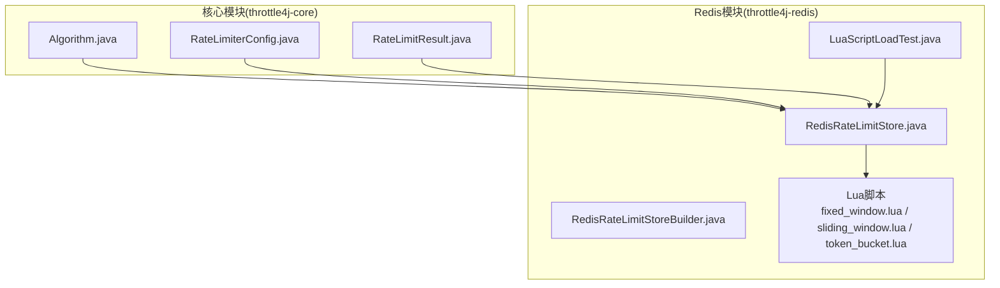
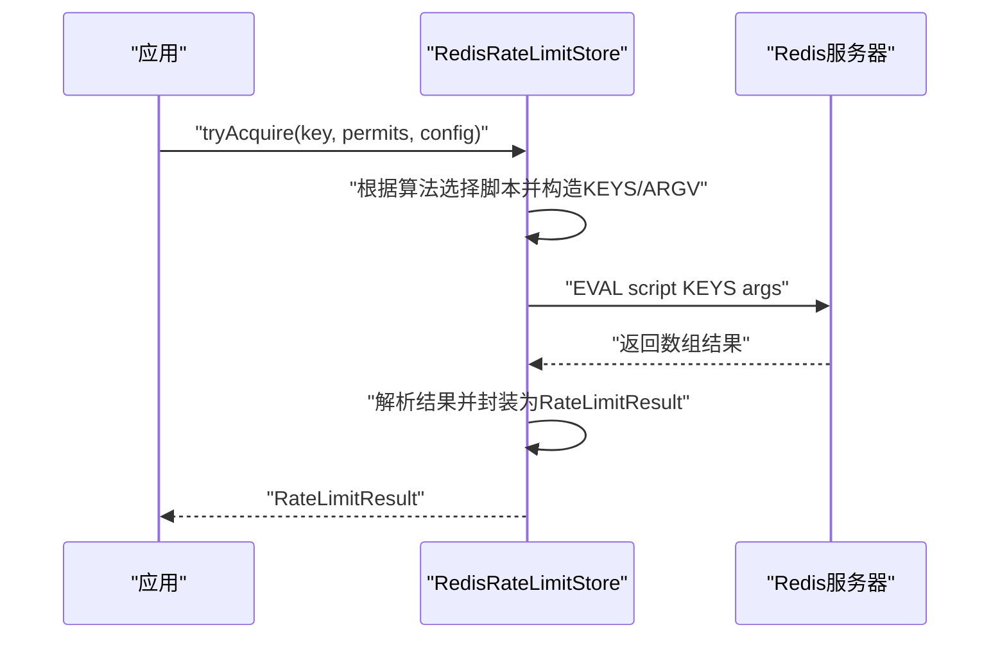
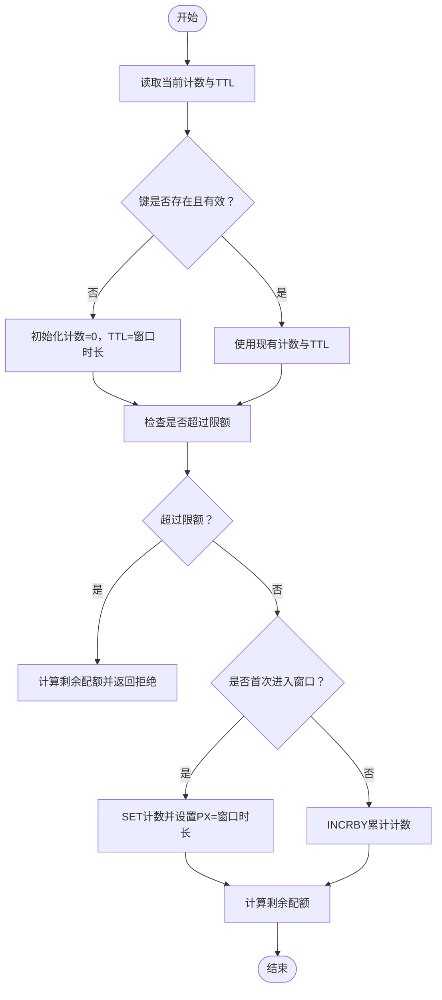
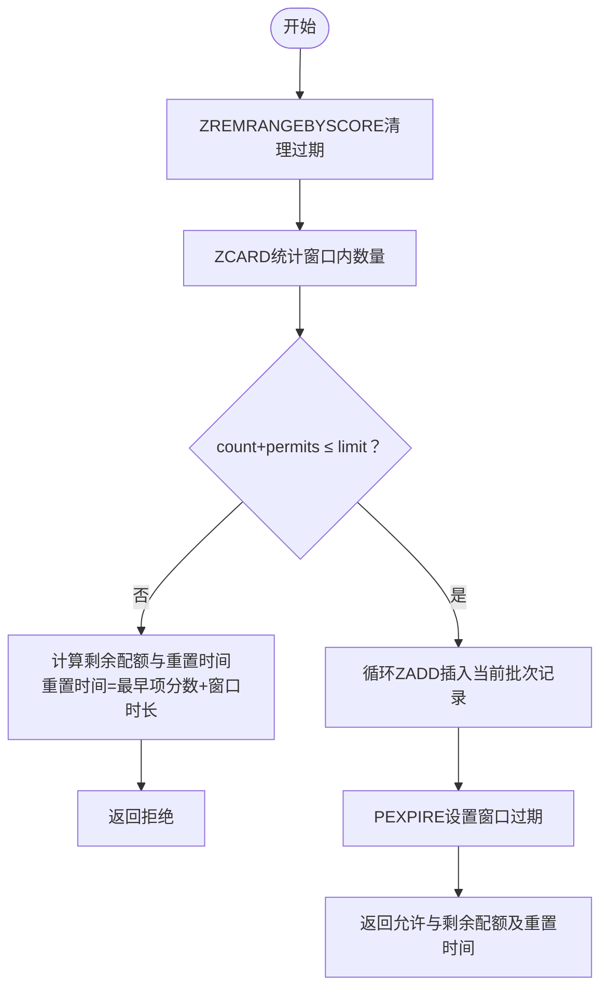
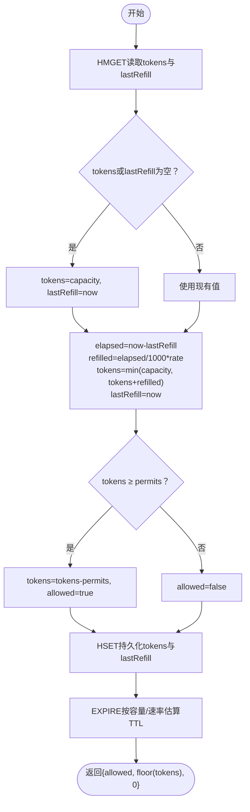
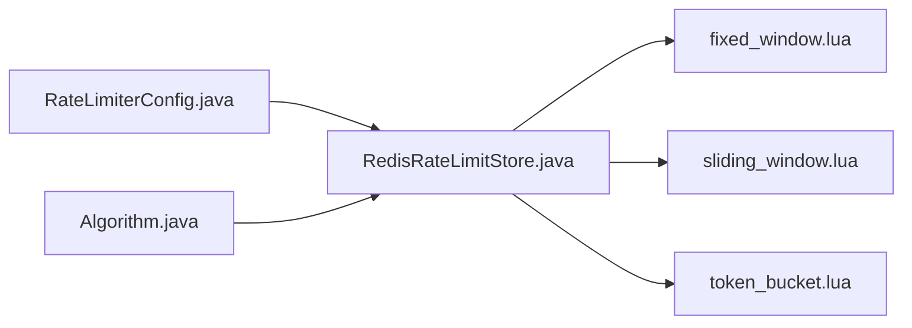

# Lua脚本实现

<cite>
**本文引用的文件**
- [fixed_window.lua](file://throttle4j-redis/src/main/resources/scripts/fixed_window.lua)
- [sliding_window.lua](file://throttle4j-redis/src/main/resources/scripts/sliding_window.lua)
- [token_bucket.lua](file://throttle4j-redis/src/main/resources/scripts/token_bucket.lua)
- [RedisRateLimitStore.java](file://throttle4j-redis/src/main/java/com/throttle4j/redis/RedisRateLimitStore.java)
- [RedisRateLimitStoreBuilder.java](file://throttle4j-redis/src/main/java/com/throttle4j/redis/RedisRateLimitStoreBuilder.java)
- [LuaScriptLoadTest.java](file://throttle4j-redis/src/test/java/com/throttle4j/redis/LuaScriptLoadTest.java)
- [RateLimiterConfig.java](file://throttle4j-core/src/main/java/com/throttle4j/core/RateLimiterConfig.java)
- [RateLimitResult.java](file://throttle4j-core/src/main/java/com/throttle4j/core/RateLimitResult.java)
- [Algorithm.java](file://throttle4j-core/src/main/java/com/throttle4j/core/Algorithm.java)
</cite>

## 目录
1. [简介](#简介)
2. [项目结构](#项目结构)
3. [核心组件](#核心组件)
4. [架构总览](#架构总览)
5. [详细组件分析](#详细组件分析)
6. [依赖关系分析](#依赖关系分析)
7. [性能考量](#性能考量)
8. [故障排查指南](#故障排查指南)
9. [结论](#结论)
10. [附录](#附录)

## 简介
本文件面向Redis分布式限流场景，系统化梳理throttle4j中基于Lua脚本的三种限流算法实现：固定窗口、滑动窗口与令牌桶（漏桶作为特例复用）。重点解释每种算法在Redis端的原子性操作逻辑、EVAL命令的使用方式与执行上下文、键值操作、时间戳处理与计数器更新机制；并给出性能优化建议、内存使用分析、调试方法、常见问题排查以及版本管理与兼容性注意事项。

## 项目结构
- 核心算法配置与结果模型位于throttle4j-core模块，定义了算法枚举、配置参数与返回结果。
- Redis存储实现位于throttle4j-redis模块，负责加载Lua脚本并通过Lettuce同步接口执行EVAL，将算法逻辑下沉到Redis端以保证原子性。
- Lua脚本位于throttle4j-redis资源目录下，分别对应三种算法。

**图表来源**
- [Algorithm.java:1-16](file://throttle4j-core/src/main/java/com/throttle4j/core/Algorithm.java#L1-L16)
- [RateLimiterConfig.java:1-113](file://throttle4j-core/src/main/java/com/throttle4j/core/RateLimiterConfig.java#L1-L113)
- [RateLimitResult.java:1-68](file://throttle4j-core/src/main/java/com/throttle4j/core/RateLimitResult.java#L1-L68)
- [RedisRateLimitStore.java:1-258](file://throttle4j-redis/src/main/java/com/throttle4j/redis/RedisRateLimitStore.java#L1-L258)
- [RedisRateLimitStoreBuilder.java:1-61](file://throttle4j-redis/src/main/java/com/throttle4j/redis/RedisRateLimitStoreBuilder.java#L1-L61)
- [LuaScriptLoadTest.java:1-79](file://throttle4j-redis/src/test/java/com/throttle4j/redis/LuaScriptLoadTest.java#L1-L79)

**章节来源**
- [RedisRateLimitStore.java:22-38](file://throttle4j-redis/src/main/java/com/throttle4j/redis/RedisRateLimitStore.java#L22-L38)
- [RedisRateLimitStore.java:47-49](file://throttle4j-redis/src/main/java/com/throttle4j/redis/RedisRateLimitStore.java#L47-L49)

## 核心组件
- 算法枚举与配置
  - Algorithm：定义支持的算法类型（固定窗口、滑动窗口、令牌桶、漏桶）。
  - RateLimiterConfig：封装limit、windowMillis、refillRate等参数，提供构建与校验。
- 结果模型
  - RateLimitResult：封装允许/拒绝状态、剩余配额、重置时间与建议重试时长。
- Redis存储实现
  - RedisRateLimitStore：负责加载Lua脚本、构造KEYS/ARGV、调用EVAL执行脚本、解析返回值并转换为RateLimitResult。
  - RedisRateLimitStoreBuilder：提供链式构建器，设置RedisCommands与keyPrefix。

关键要点
- EVAL执行上下文：KEYS数组用于脚本访问的键名，ARGV数组用于传参；脚本内通过redis.call调用Redis命令，保证事务性。
- 漏桶算法通过将“漏出速率”映射为令牌桶的“补充速率”来复用同一套脚本逻辑。
- 返回值约定：脚本统一返回数组，Java侧按索引解析，避免额外序列化开销。

**章节来源**
- [Algorithm.java:6-15](file://throttle4j-core/src/main/java/com/throttle4j/core/Algorithm.java#L6-L15)
- [RateLimiterConfig.java:10-36](file://throttle4j-core/src/main/java/com/throttle4j/core/RateLimiterConfig.java#L10-L36)
- [RateLimitResult.java:8-26](file://throttle4j-core/src/main/java/com/throttle4j/core/RateLimitResult.java#L8-L26)
- [RedisRateLimitStore.java:80-110](file://throttle4j-redis/src/main/java/com/throttle4j/redis/RedisRateLimitStore.java#L80-L110)
- [RedisRateLimitStore.java:195-217](file://throttle4j-redis/src/main/java/com/throttle4j/redis/RedisRateLimitStore.java#L195-L217)

## 架构总览
下图展示从应用到Redis的完整调用链路，以及各算法脚本的输入输出约定。

**图表来源**
- [RedisRateLimitStore.java:80-110](file://throttle4j-redis/src/main/java/com/throttle4j/redis/RedisRateLimitStore.java#L80-L110)
- [RedisRateLimitStore.java:195-217](file://throttle4j-redis/src/main/java/com/throttle4j/redis/RedisRateLimitStore.java#L195-L217)

## 详细组件分析

### 固定窗口算法（Fixed Window）
- 原子性逻辑
  - 初始化当前窗口累计值与窗口时长；若键不存在则初始化为0；读取键剩余生存时间，缺失或已过期时回填为窗口时长。
  - 若本次申请后超出限额，则计算剩余配额并返回拒绝；否则在首次进入窗口时SET带过期时间，后续使用INCRBY累加。
  - 最终返回允许标志、剩余配额与相对重置时间（TTL）。
- 键值操作与时间戳
  - GET/PTTL/SET(INCRBY)/INCRBY；时间戳来自客户端当前毫秒值，但仅用于计算与返回。
- 复杂度与一致性
  - 单键读写，O(1)时间复杂度；存在边界瞬时超限风险（窗口切换瞬间）。

**图表来源**
- [fixed_window.lua:16-45](file://throttle4j-redis/src/main/resources/scripts/fixed_window.lua#L16-L45)

**章节来源**
- [fixed_window.lua:1-46](file://throttle4j-redis/src/main/resources/scripts/fixed_window.lua#L1-L46)
- [RedisRateLimitStore.java:122-140](file://throttle4j-redis/src/main/java/com/throttle4j/redis/RedisRateLimitStore.java#L122-L140)

### 滑动窗口算法（Sliding Window，基于有序集合）
- 原子性逻辑
  - 使用ZREMRANGEBYSCORE清理过期条目，ZCARD统计窗口内请求数。
  - 若本次申请后总数超过限额，计算剩余配额与最早记录的绝对重置时间（oldest + window），返回拒绝；否则批量插入ZADD记录（含唯一ID后缀），设置PEXPIRE窗口过期。
- 键值操作与时间戳
  - ZREMRANGEBYSCORE/ZCARD/ZADD/PEXPIRE；唯一ID确保同一批次请求不互相覆盖。
- 复杂度与一致性
  - 清理与插入均为O(logN)，整体近似O(NlogN)取决于清理量；更平滑地抑制突发流量。

**图表来源**
- [sliding_window.lua:20-48](file://throttle4j-redis/src/main/resources/scripts/sliding_window.lua#L20-L48)

**章节来源**
- [sliding_window.lua:1-49](file://throttle4j-redis/src/main/resources/scripts/sliding_window.lua#L1-L49)
- [RedisRateLimitStore.java:142-163](file://throttle4j-redis/src/main/java/com/throttle4j/redis/RedisRateLimitStore.java#L142-L163)

### 令牌桶算法（Token Bucket，漏桶复用）
- 原子性逻辑
  - HMGET读取tokens与lastRefill；若为空则初始化为容量与当前时间。
  - 计算elapsed并按rate/sec补充令牌，上限不超过capacity，更新lastRefill。
  - 若令牌充足则扣除permits并允许，否则不允许。
  - HSET持久化tokens与lastRefill；根据容量与补充速率估算安全TTL并EXPIRE。
- 键值操作与时间戳
  - HMGET/HSET/EXPIRE；时间戳来自客户端当前毫秒值，用于计算补充量与TTL。
- 复杂度与一致性
  - 单键哈希读写，O(1)；可平滑突发但需合理设置容量与补充速率。

**图表来源**
- [token_bucket.lua:17-57](file://throttle4j-redis/src/main/resources/scripts/token_bucket.lua#L17-L57)

**章节来源**
- [token_bucket.lua:1-58](file://throttle4j-redis/src/main/resources/scripts/token_bucket.lua#L1-L58)
- [RedisRateLimitStore.java:165-191](file://throttle4j-redis/src/main/java/com/throttle4j/redis/RedisRateLimitStore.java#L165-L191)

### EVAL命令与脚本执行上下文
- 执行方式
  - Java侧通过Lettuce的eval(script, ScriptOutputType.MULTI, keys, args)执行Lua脚本，返回数组形式的结果。
  - RedisRateLimitStore在构造时一次性加载三段脚本内容，运行时直接传入KEYS与ARGV。
- 参数约定
  - 固定窗口：KEYS[1]、ARGV[1]=limit、ARGV[2]=windowMillis、ARGV[3]=permits。
  - 滑动窗口：KEYS[1]、ARGV[1]=limit、ARGV[2]=windowMillis、ARGV[3]=permits、ARGV[4]=currentTimeMillis、ARGV[5]=uniqueId。
  - 令牌桶：KEYS[1]、ARGV[1]=capacity、ARGV[2]=refillRate、ARGV[3]=permits、ARGV[4]=currentTimeMillis。
- 返回约定
  - 固定窗口：{allowed, remaining, ttlMillis}
  - 滑动窗口：{allowed, remaining, resetAtMillis}
  - 令牌桶：{allowed, remaining, 0}

**章节来源**
- [RedisRateLimitStore.java:195-217](file://throttle4j-redis/src/main/java/com/throttle4j/redis/RedisRateLimitStore.java#L195-L217)
- [RedisRateLimitStore.java:226-251](file://throttle4j-redis/src/main/java/com/throttle4j/redis/RedisRateLimitStore.java#L226-L251)
- [LuaScriptLoadTest.java:42-62](file://throttle4j-redis/src/test/java/com/throttle4j/redis/LuaScriptLoadTest.java#L42-L62)

## 依赖关系分析
- 组件耦合
  - RedisRateLimitStore对Algorithm、RateLimiterConfig强依赖，对Lua脚本弱依赖（仅在构造时加载一次）。
  - 算法实现完全由脚本承担，Java层仅负责参数拼装与结果解析。
- 外部依赖
  - Lettuce同步接口提供EVAL与Redis命令调用能力；脚本依赖Redis内置命令（GET/SET/INCRBY/PTTL/ZADD/ZREM/ZCARD/HMGET/HSET/EXPIRE等）。

**图表来源**
- [RedisRateLimitStore.java:80-110](file://throttle4j-redis/src/main/java/com/throttle4j/redis/RedisRateLimitStore.java#L80-L110)
- [Algorithm.java:6-15](file://throttle4j-core/src/main/java/com/throttle4j/core/Algorithm.java#L6-L15)
- [RateLimiterConfig.java:10-36](file://throttle4j-core/src/main/java/com/throttle4j/core/RateLimiterConfig.java#L10-L36)

**章节来源**
- [RedisRateLimitStore.java:47-49](file://throttle4j-redis/src/main/java/com/throttle4j/redis/RedisRateLimitStore.java#L47-L49)
- [RedisRateLimitStore.java:75-77](file://throttle4j-redis/src/main/java/com/throttle4j/redis/RedisRateLimitStore.java#L75-L77)

## 性能考量
- 原子性与网络往返
  - 将算法逻辑下沉至Redis，单EVAL调用完成读取、计算与写入，减少往返次数与竞态。
- 时间戳与过期策略
  - 固定窗口与滑动窗口均使用客户端时间，避免跨节点时钟漂移；令牌桶通过lastRefill与elapsed计算补充，EXPIRE按容量/速率保守估计，降低空key占用。
- 内存使用
  - 固定窗口：单键整型计数，极低内存。
  - 滑动窗口：有序集合成员数约等于窗口内请求数，内存与QPS线性相关，建议控制窗口大小与批大小。
  - 令牌桶：单键哈希，常数级内存。
- 并发与锁
  - 脚本内无显式锁，依靠Redis命令原子性；高并发下建议合理设置容量与速率，避免频繁EXPIRE与重建。
- 优化建议
  - 合理设置窗口与容量：固定窗口适合边界明确的周期限制；滑动窗口适合平滑限流；令牌桶适合突发与长期稳定结合的场景。
  - 控制批大小：滑动窗口的uniqueId后缀循环插入，批越大内存增长越快。
  - TTL策略：令牌桶按容量/速率估算TTL，避免过早过期导致频繁初始化。

[本节为通用性能指导，无需特定文件引用]

## 故障排查指南
- 脚本加载失败
  - 现象：构造RedisRateLimitStore时报错提示脚本缺失或为空。
  - 排查：确认resources/scripts目录下脚本存在且非空；测试用例验证类路径加载与内容完整性。
- EVAL返回值异常
  - 现象：解析结果抛出类型不匹配异常。
  - 排查：确认脚本返回数组格式一致；核对KEYS/ARGV顺序与数量。
- 滑动窗口重复计数
  - 现象：窗口内请求被重复计入。
  - 排查：确保uniqueId唯一且包含当前时间戳前缀；确认ZADD批量插入正确。
- 令牌桶未补充
  - 现象：tokens长时间不变。
  - 排查：确认refillRate>0；检查lastRefill与now差值是否足够；核对HMGET/HSET字段名一致。
- 漏桶不生效
  - 现象：漏桶等效速率与预期不符。
  - 排查：漏桶通过将“漏出速率”映射为令牌桶“补充速率”，需确保配置limit与windowMillis正确换算为refillRate。

**章节来源**
- [LuaScriptLoadTest.java:18-39](file://throttle4j-redis/src/test/java/com/throttle4j/redis/LuaScriptLoadTest.java#L18-L39)
- [LuaScriptLoadTest.java:42-62](file://throttle4j-redis/src/test/java/com/throttle4j/redis/LuaScriptLoadTest.java#L42-L62)
- [RedisRateLimitStore.java:195-217](file://throttle4j-redis/src/main/java/com/throttle4j/redis/RedisRateLimitStore.java#L195-L217)

## 结论
通过将限流算法下沉至Redis Lua脚本，throttle4j在保证强一致性的前提下实现了高性能的分布式限流。固定窗口简单高效、滑动窗口平滑抗突发、令牌桶兼顾突发与长期稳定。配合合理的参数配置与监控，可在不同业务场景下获得稳定的限流效果。

[本节为总结性内容，无需特定文件引用]

## 附录

### 版本管理与兼容性
- 脚本版本
  - 当前仓库包含三段独立脚本，版本管理建议以文件名与内容摘要为准；如需升级，应先在测试环境验证返回格式与行为一致性。
- 兼容性
  - 依赖Redis命令集：GET/SET/INCRBY/PTTL/ZADD/ZREM/ZCARD/HMGET/HSET/EXPIRE等；确保Redis版本满足脚本命令可用性。
- 配置兼容
  - RateLimiterConfig对TOKEN_BUCKET要求refillRate>0；LEAKY_BUCKET通过limit/windowMillis换算为refillRate，保持与令牌桶一致的脚本实现。

**章节来源**
- [RateLimiterConfig.java:96-108](file://throttle4j-core/src/main/java/com/throttle4j/core/RateLimiterConfig.java#L96-L108)
- [RedisRateLimitStore.java:100-106](file://throttle4j-redis/src/main/java/com/throttle4j/redis/RedisRateLimitStore.java#L100-L106)