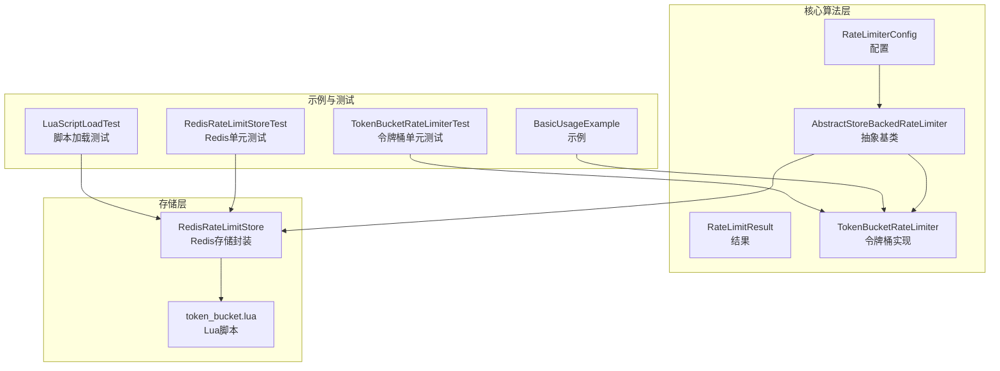
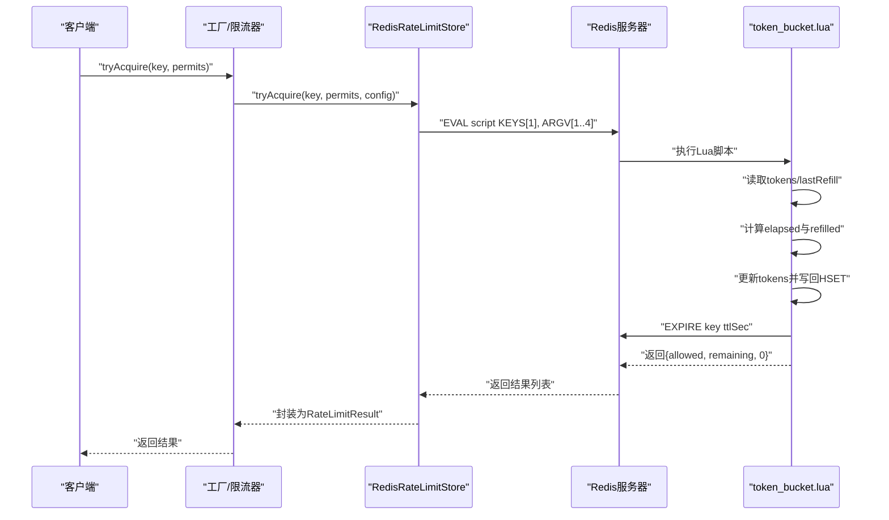
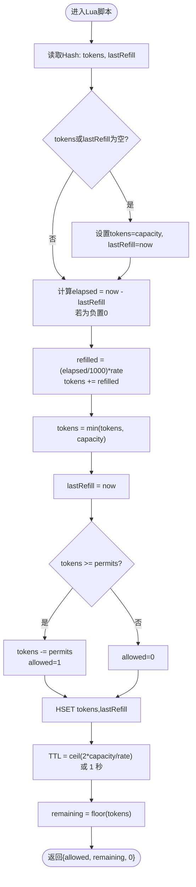
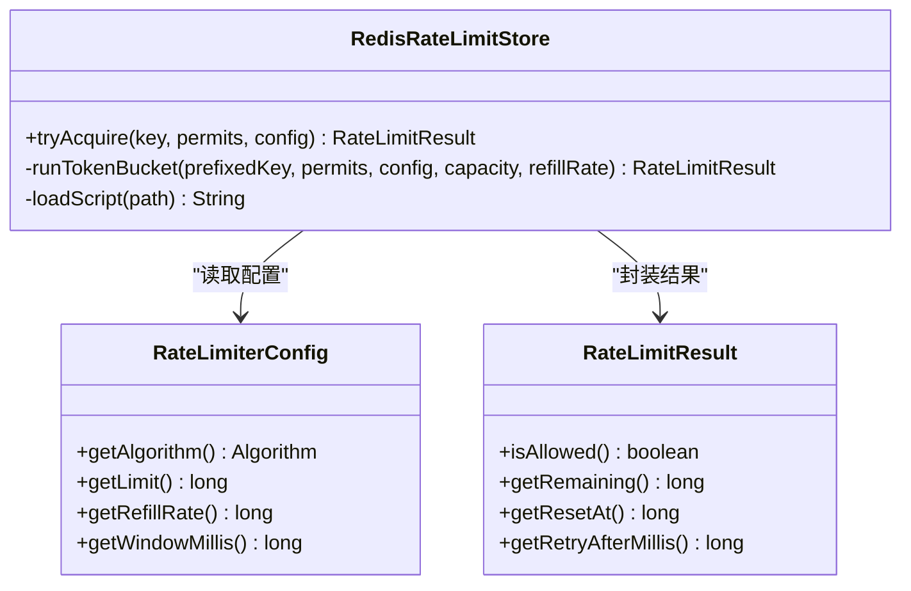
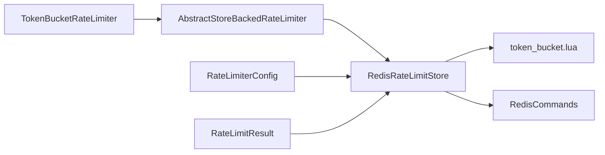

# 令牌桶算法Lua脚本

<cite>
**本文引用的文件**
- [token_bucket.lua](file://throttle4j-redis/src/main/resources/scripts/token_bucket.lua)
- [RedisRateLimitStore.java](file://throttle4j-redis/src/main/java/com/throttle4j/redis/RedisRateLimitStore.java)
- [TokenBucketRateLimiter.java](file://throttle4j-core/src/main/java/com/throttle4j/algorithm/TokenBucketRateLimiter.java)
- [AbstractStoreBackedRateLimiter.java](file://throttle4j-core/src/main/java/com/throttle4j/algorithm/AbstractStoreBackedRateLimiter.java)
- [RateLimiterConfig.java](file://throttle4j-core/src/main/java/com/throttle4j/core/RateLimiterConfig.java)
- [RateLimitResult.java](file://throttle4j-core/src/main/java/com/throttle4j/core/RateLimitResult.java)
- [Algorithm.java](file://throttle4j-core/src/main/java/com/throttle4j/core/Algorithm.java)
- [InMemoryStore.java](file://throttle4j-core/src/main/java/com/throttle4j/store/InMemoryStore.java)
- [RedisRateLimitStoreTest.java](file://throttle4j-redis/src/test/java/com/throttle4j/redis/RedisRateLimitStoreTest.java)
- [LuaScriptLoadTest.java](file://throttle4j-redis/src/test/java/com/throttle4j/redis/LuaScriptLoadTest.java)
- [TokenBucketRateLimiterTest.java](file://throttle4j-core/src/test/java/com/throttle4j/algorithm/TokenBucketRateLimiterTest.java)
- [BasicUsageExample.java](file://throttle4j-examples/src/main/java/com/throttle4j/example/BasicUsageExample.java)
</cite>

## 目录
1. [简介](#简介)
2. [项目结构](#项目结构)
3. [核心组件](#核心组件)
4. [架构总览](#架构总览)
5. [详细组件分析](#详细组件分析)
6. [依赖关系分析](#依赖关系分析)
7. [性能考虑](#性能考虑)
8. [故障排查指南](#故障排查指南)
9. [结论](#结论)
10. [附录](#附录)

## 简介
本文件聚焦于令牌桶（Token Bucket）限流算法在Redis中的Lua实现，系统性阐述以下主题：
- 令牌生成、消耗与桶容量管理的完整机制
- 时间计算逻辑：从上次令牌生成时间到当前时间的间隔处理
- 令牌补充算法与突发流量处理策略
- 令牌桶状态的持久化存储：剩余令牌数、最后填充时间、桶容量
- 脚本参数详解与性能优化技巧
- 不同流量模式下的行为特征与调优建议

该实现采用“Lua脚本原子执行 + Redis Hash 持久化”的设计，确保高并发场景下的一致性与低延迟。

## 项目结构
围绕令牌桶的实现，涉及三层：
- 核心算法层：定义配置、结果与抽象基类
- 存储层：Redis分布式存储与Lua脚本封装
- 示例与测试：演示使用与验证行为

图表来源
- [RedisRateLimitStore.java:40-110](file://throttle4j-redis/src/main/java/com/throttle4j/redis/RedisRateLimitStore.java#L40-L110)
- [token_bucket.lua:1-58](file://throttle4j-redis/src/main/resources/scripts/token_bucket.lua#L1-L58)
- [AbstractStoreBackedRateLimiter.java:14-42](file://throttle4j-core/src/main/java/com/throttle4j/algorithm/AbstractStoreBackedRateLimiter.java#L14-L42)
- [TokenBucketRateLimiter.java:10-16](file://throttle4j-core/src/main/java/com/throttle4j/algorithm/TokenBucketRateLimiter.java#L10-L16)

章节来源
- [RedisRateLimitStore.java:40-110](file://throttle4j-redis/src/main/java/com/throttle4j/redis/RedisRateLimitStore.java#L40-L110)
- [token_bucket.lua:1-58](file://throttle4j-redis/src/main/resources/scripts/token_bucket.lua#L1-L58)
- [AbstractStoreBackedRateLimiter.java:14-42](file://throttle4j-core/src/main/java/com/throttle4j/algorithm/AbstractStoreBackedRateLimiter.java#L14-L42)
- [TokenBucketRateLimiter.java:10-16](file://throttle4j-core/src/main/java/com/throttle4j/algorithm/TokenBucketRateLimiter.java#L10-L16)

## 核心组件
- 配置对象：包含算法类型、桶容量（limit）、补充速率（refillRate）、窗口时间（windowMillis）
- 结果对象：返回是否允许、剩余配额、重置时间、建议重试时间
- 抽象基类：统一tryAcquire入口，委托给存储层
- Redis存储：加载Lua脚本，按算法分发调用，封装Redis交互
- Lua脚本：原子执行令牌生成、消耗与过期策略

章节来源
- [RateLimiterConfig.java:8-113](file://throttle4j-core/src/main/java/com/throttle4j/core/RateLimiterConfig.java#L8-L113)
- [RateLimitResult.java:6-68](file://throttle4j-core/src/main/java/com/throttle4j/core/RateLimitResult.java#L6-L68)
- [AbstractStoreBackedRateLimiter.java:14-42](file://throttle4j-core/src/main/java/com/throttle4j/algorithm/AbstractStoreBackedRateLimiter.java#L14-L42)
- [RedisRateLimitStore.java:40-110](file://throttle4j-redis/src/main/java/com/throttle4j/redis/RedisRateLimitStore.java#L40-L110)
- [token_bucket.lua:1-58](file://throttle4j-redis/src/main/resources/scripts/token_bucket.lua#L1-L58)

## 架构总览
令牌桶在Redis中的工作流如下：
- 客户端通过工厂创建限流器
- 限流器将请求转发至Redis存储
- Redis存储根据算法选择Lua脚本并传入参数
- Lua脚本原子地读取桶状态、计算补充、尝试消费、写回状态并设置过期
- 返回结果供上层使用

图表来源
- [RedisRateLimitStore.java:165-191](file://throttle4j-redis/src/main/java/com/throttle4j/redis/RedisRateLimitStore.java#L165-L191)
- [token_bucket.lua:17-57](file://throttle4j-redis/src/main/resources/scripts/token_bucket.lua#L17-L57)

## 详细组件分析

### Lua脚本：令牌桶算法核心
- 输入参数
  - KEYS[1]：Redis键名（限流资源标识）
  - ARGV[1]：桶容量（最大令牌数）
  - ARGV[2]：补充速率（每秒令牌数，可为小数）
  - ARGV[3]：本次申请令牌数（permits）
  - ARGV[4]：客户端当前毫秒时间戳（用于保证时钟一致性）
- 状态存储
  - 使用Hash存储：tokens（剩余令牌数）、lastRefill（上次补充时间）
- 关键步骤
  - 初始化：若不存在状态则以满桶初始化，并记录当前时间为lastRefill
  - 时间间隔计算：now - lastRefill，若为负则视为0
  - 补充计算：elapsed / 1000.0 * rate，累加到tokens，不超过capacity
  - 消耗判断：若tokens ≥ permits，则扣减并标记允许
  - 写回：HSET写入新的tokens与lastRefill
  - 过期策略：EXPIRE设置TTL，避免无限增长；当rate>0时，TTL≈2×(capacity/rate)，否则至少1秒
  - 输出：返回{allowed, remaining, 0}

图表来源
- [token_bucket.lua:17-57](file://throttle4j-redis/src/main/resources/scripts/token_bucket.lua#L17-L57)

章节来源
- [token_bucket.lua:1-58](file://throttle4j-redis/src/main/resources/scripts/token_bucket.lua#L1-L58)

### Java侧：算法调度与结果封装
- 算法分发：RedisRateLimitStore根据配置算法选择对应脚本与参数
- 令牌桶调用：传入capacity与refillRate，构造参数数组
- 结果封装：根据脚本返回值构造RateLimitResult，其中：
  - allowed：脚本返回的0/1
  - remaining：脚本返回的剩余令牌数（向下取整）
  - resetAt：当前时间+窗口毫秒（用于报告下一次重置时间）
  - retryAfterMillis：当被拒绝时，基于剩余令牌与补充速率估算等待时间

图表来源
- [RedisRateLimitStore.java:90-191](file://throttle4j-redis/src/main/java/com/throttle4j/redis/RedisRateLimitStore.java#L90-L191)
- [RateLimiterConfig.java:8-113](file://throttle4j-core/src/main/java/com/throttle4j/core/RateLimiterConfig.java#L8-L113)
- [RateLimitResult.java:6-68](file://throttle4j-core/src/main/java/com/throttle4j/core/RateLimitResult.java#L6-L68)

章节来源
- [RedisRateLimitStore.java:90-191](file://throttle4j-redis/src/main/java/com/throttle4j/redis/RedisRateLimitStore.java#L90-L191)
- [RateLimiterConfig.java:8-113](file://throttle4j-core/src/main/java/com/throttle4j/core/RateLimiterConfig.java#L8-L113)
- [RateLimitResult.java:6-68](file://throttle4j-core/src/main/java/com/throttle4j/core/RateLimitResult.java#L6-L68)

### 时间计算与补充算法
- 时间间隔处理：脚本使用客户端提供的now，避免Redis与客户端时钟漂移；若lastRefill晚于now则视为0间隔
- 补充速率：每秒补充rate个令牌，按毫秒级线性补充，支持小数
- 上限控制：tokens不超过capacity，防止超额积累
- 原子性：整个过程在Lua中完成，避免竞态条件

章节来源
- [token_bucket.lua:26-36](file://throttle4j-redis/src/main/resources/scripts/token_bucket.lua#L26-L36)

### 突发流量与过期策略
- 突发能力：初始tokens=capacity，允许瞬时消耗至容量上限
- 过期策略：TTL≈2×(capacity/rate)，确保在无新请求时，桶在两次完整补充周期后自动清理，节省内存
- 低补充率保护：当rate≤0时，TTL最小为1秒，避免键过早过期

章节来源
- [token_bucket.lua:46-54](file://throttle4j-redis/src/main/resources/scripts/token_bucket.lua#L46-L54)

### 状态持久化与键管理
- 持久化字段：Hash中保存tokens与lastRefill
- 键前缀：Redis存储默认添加throttle4j:前缀，避免键冲突
- 键清理：reset(key)删除对应键；Lua脚本通过EXPIRE自动清理过期键

章节来源
- [token_bucket.lua:44](file://throttle4j-redis/src/main/resources/scripts/token_bucket.lua#L44)
- [RedisRateLimitStore.java:44-46](file://throttle4j-redis/src/main/java/com/throttle4j/redis/RedisRateLimitStore.java#L44-L46)
- [RedisRateLimitStore.java:112-118](file://throttle4j-redis/src/main/java/com/throttle4j/redis/RedisRateLimitStore.java#L112-L118)

### 参数详解与最佳实践
- capacity（桶容量）：决定瞬时突发能力
- refillRate（补充速率）：决定稳定流量承载能力；可为小数
- permits（申请令牌数）：单次请求消耗数量
- currentTimeMillis（客户端时间）：保证跨节点时钟一致性
- 建议
  - 将refillRate设置为峰值QPS的0.8~1倍，留出安全余量
  - 对于短时突发，适当提高capacity；对长时稳态，以refillRate为准
  - 合理设置TTL，避免频繁重建状态

章节来源
- [token_bucket.lua:3-9](file://throttle4j-redis/src/main/resources/scripts/token_bucket.lua#L3-L9)
- [RedisRateLimitStore.java:165-175](file://throttle4j-redis/src/main/java/com/throttle4j/redis/RedisRateLimitStore.java#L165-L175)

### 行为特征与调优建议
- 瞬时突发：capacity内瞬时放行
- 平滑整形：超过capacity后按refillRate线性补充
- 拒绝反馈：被拒时返回retryAfterMillis，便于客户端退避重试
- 并发安全：Lua原子执行，避免竞态
- 调优要点
  - 高峰期：增大capacity，提高refillRate
  - 低峰期：降低refillRate，减少CPU与网络开销
  - 服务端降载：临时降低refillRate，平滑突发

章节来源
- [RedisRateLimitStore.java:183-190](file://throttle4j-redis/src/main/java/com/throttle4j/redis/RedisRateLimitStore.java#L183-L190)
- [TokenBucketRateLimiterTest.java:43-81](file://throttle4j-core/src/test/java/com/throttle4j/algorithm/TokenBucketRateLimiterTest.java#L43-L81)

## 依赖关系分析
- 组件耦合
  - RedisRateLimitStore依赖Lua脚本与Redis命令接口
  - TokenBucketRateLimiter通过抽象基类委托给存储层
  - 配置与结果对象贯穿各层
- 外部依赖
  - Redis（Lua EVAL、HMGET/HSET、EXPIRE）
  - Lettuce（同步命令接口）

图表来源
- [AbstractStoreBackedRateLimiter.java:14-42](file://throttle4j-core/src/main/java/com/throttle4j/algorithm/AbstractStoreBackedRateLimiter.java#L14-L42)
- [RedisRateLimitStore.java:40-110](file://throttle4j-redis/src/main/java/com/throttle4j/redis/RedisRateLimitStore.java#L40-L110)
- [RateLimiterConfig.java:8-113](file://throttle4j-core/src/main/java/com/throttle4j/core/RateLimiterConfig.java#L8-L113)
- [RateLimitResult.java:6-68](file://throttle4j-core/src/main/java/com/throttle4j/core/RateLimitResult.java#L6-L68)

章节来源
- [AbstractStoreBackedRateLimiter.java:14-42](file://throttle4j-core/src/main/java/com/throttle4j/algorithm/AbstractStoreBackedRateLimiter.java#L14-L42)
- [RedisRateLimitStore.java:40-110](file://throttle4j-redis/src/main/java/com/throttle4j/redis/RedisRateLimitStore.java#L40-L110)
- [RateLimiterConfig.java:8-113](file://throttle4j-core/src/main/java/com/throttle4j/core/RateLimiterConfig.java#L8-L113)
- [RateLimitResult.java:6-68](file://throttle4j-core/src/main/java/com/throttle4j/core/RateLimitResult.java#L6-L68)

## 性能考虑
- 原子性与网络往返：Lua脚本单次EVAL，减少网络往返与锁竞争
- CPU占用：Lua中仅做数值运算，开销极低
- 内存占用：Hash仅存tokens与lastRefill；TTL避免长期驻留
- 缓存友好：热点键在Redis中常驻，适合高QPS场景
- 优化建议
  - 合理设置refillRate与capacity，避免过大TTL导致内存压力
  - 使用连接池与合适的超时配置
  - 在应用侧实现指数退避与重试策略，结合retryAfterMillis

## 故障排查指南
- 脚本加载失败
  - 现象：抛出脚本缺失或内容为空异常
  - 排查：确认脚本路径与打包正确
- 返回值异常
  - 现象：eval返回非列表
  - 排查：检查脚本输出格式与Redis版本兼容性
- 时钟不一致
  - 现象：补充异常或负间隔
  - 排查：确保传入的currentTimeMillis来自客户端本地时钟
- 拒绝后无重试
  - 现象：被拒但retryAfterMillis为0
  - 排查：确认refillRate>0且脚本正常返回；否则按窗口重置策略处理

章节来源
- [LuaScriptLoadTest.java:18-39](file://throttle4j-redis/src/test/java/com/throttle4j/redis/LuaScriptLoadTest.java#L18-L39)
- [RedisRateLimitStore.java:195-203](file://throttle4j-redis/src/main/java/com/throttle4j/redis/RedisRateLimitStore.java#L195-L203)
- [RedisRateLimitStoreTest.java:271-282](file://throttle4j-redis/src/test/java/com/throttle4j/redis/RedisRateLimitStoreTest.java#L271-L282)

## 结论
该令牌桶实现以Lua脚本为核心，结合Redis Hash状态与EXPIRE过期策略，在保证高并发一致性的同时实现了高效的突发与稳态整形能力。通过合理配置capacity与refillRate，并结合客户端退避策略，可在多种流量模式下获得稳定的限流效果。

## 附录

### 示例：基本使用流程
- 创建令牌桶配置（容量与补充速率）
- 通过工厂创建限流器
- 调用tryAcquire获取结果
- 根据remaining与retryAfterMillis进行业务处理

章节来源
- [BasicUsageExample.java:46-62](file://throttle4j-examples/src/main/java/com/throttle4j/example/BasicUsageExample.java#L46-L62)

### 单元测试要点
- 突发能力验证：capacity次请求应全部允许
- 补充验证：按refillRate补充后应允许后续请求
- 并发安全：多线程下不允许超出capacity
- 拒绝反馈：被拒时retryAfterMillis应大于0

章节来源
- [TokenBucketRateLimiterTest.java:43-113](file://throttle4j-core/src/test/java/com/throttle4j/algorithm/TokenBucketRateLimiterTest.java#L43-L113)
- [RedisRateLimitStoreTest.java:160-203](file://throttle4j-redis/src/test/java/com/throttle4j/redis/RedisRateLimitStoreTest.java#L160-L203)