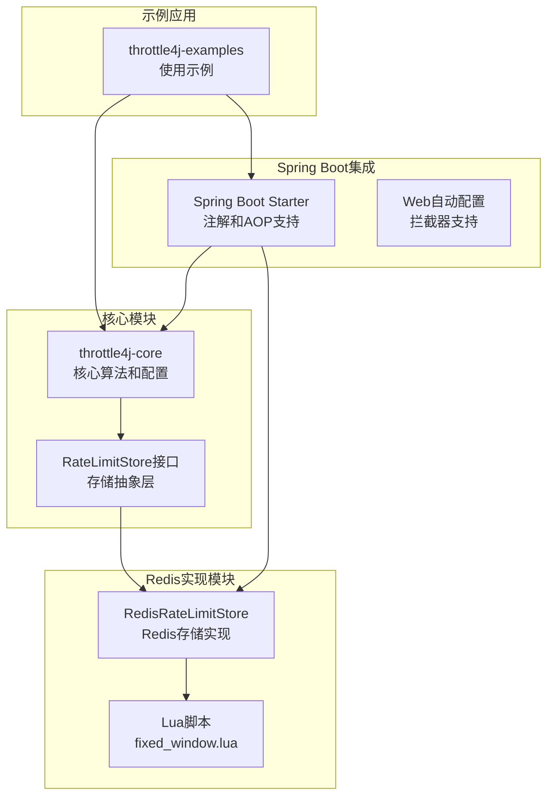
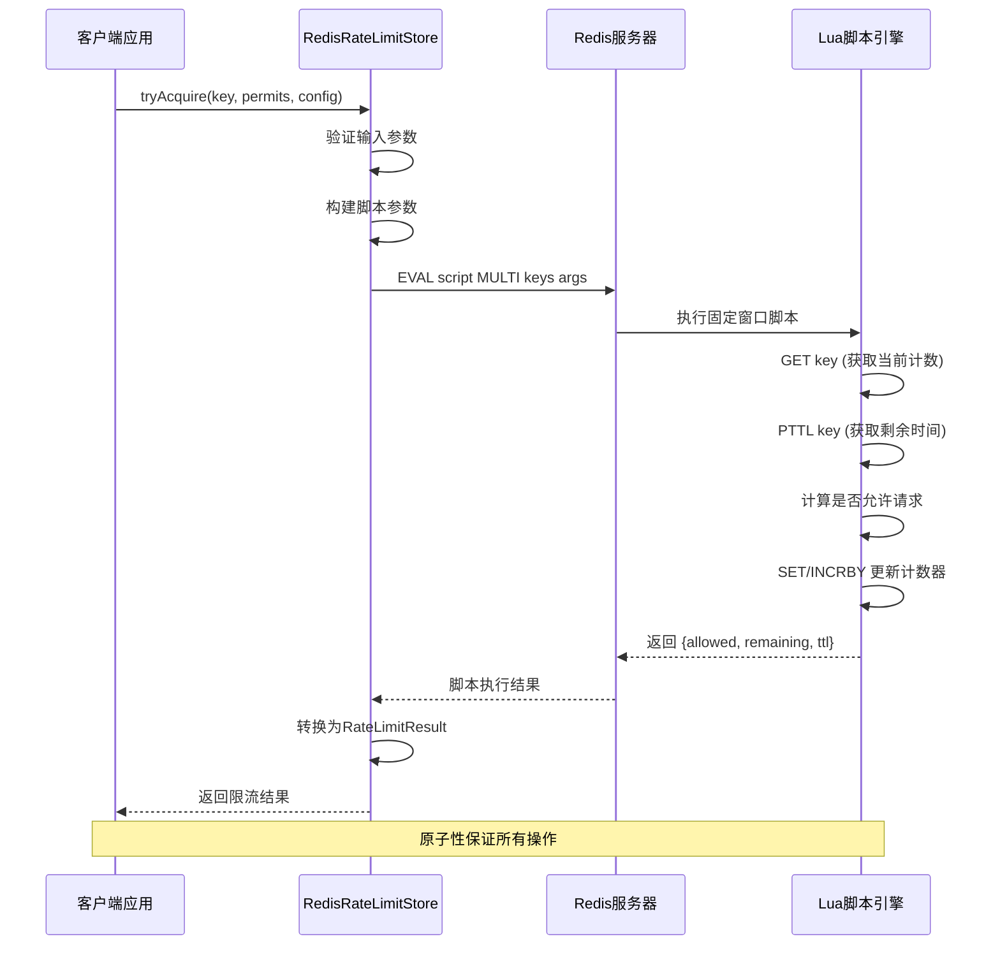
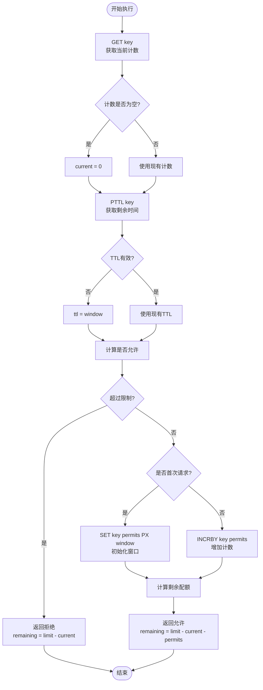
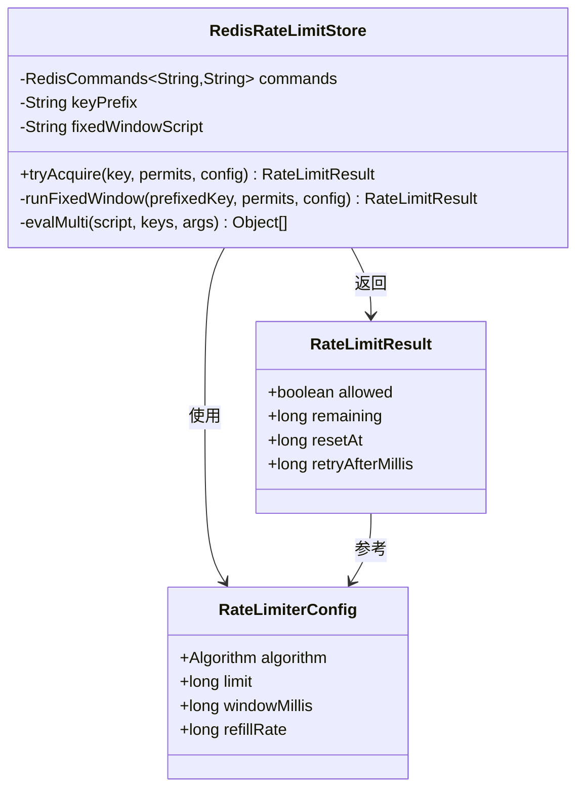
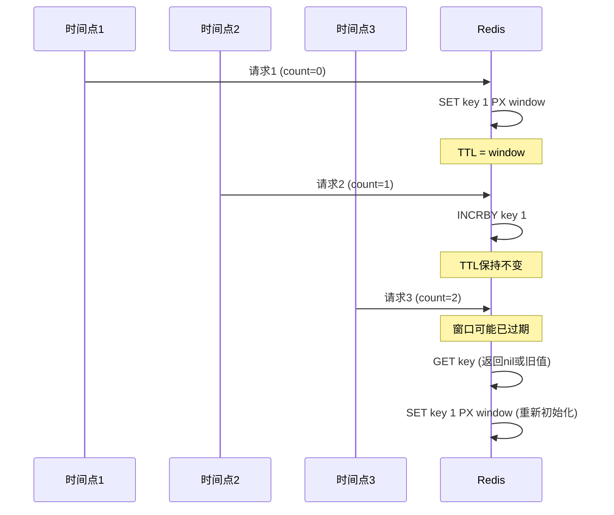
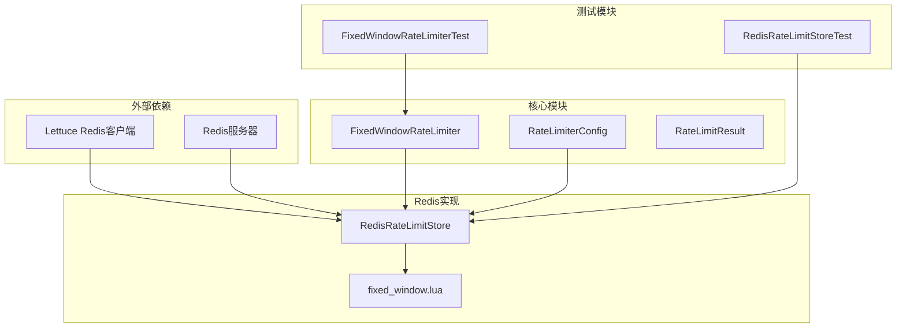

# 固定窗口算法Lua脚本

<cite>
**本文档引用的文件**
- [fixed_window.lua](file://throttle4j-redis/src/main/resources/scripts/fixed_window.lua)
- [RedisRateLimitStore.java](file://throttle4j-redis/src/main/java/com/throttle4j/redis/RedisRateLimitStore.java)
- [FixedWindowRateLimiter.java](file://throttle4j-core/src/main/java/com/throttle4j/algorithm/FixedWindowRateLimiter.java)
- [RateLimiterConfig.java](file://throttle4j-core/src/main/java/com/throttle4j/core/RateLimiterConfig.java)
- [RateLimitResult.java](file://throttle4j-core/src/main/java/com/throttle4j/core/RateLimitResult.java)
- [RedisRateLimitStoreTest.java](file://throttle4j-redis/src/test/java/com/throttle4j/redis/RedisRateLimitStoreTest.java)
- [FixedWindowRateLimiterTest.java](file://throttle4j-core/src/test/java/com/throttle4j/algorithm/FixedWindowRateLimiterTest.java)
- [Algorithm.java](file://throttle4j-core/src/main/java/com/throttle4j/core/Algorithm.java)
- [RedisRateLimitStoreBuilder.java](file://throttle4j-redis/src/main/java/com/throttle4j/redis/RedisRateLimitStoreBuilder.java)
</cite>

## 目录
1. [简介](#简介)
2. [项目结构](#项目结构)
3. [核心组件](#核心组件)
4. [架构概览](#架构概览)
5. [详细组件分析](#详细组件分析)
6. [依赖关系分析](#依赖关系分析)
7. [性能考虑](#性能考虑)
8. [故障排除指南](#故障排除指南)
9. [结论](#结论)

## 简介

固定窗口限流算法是分布式系统中常用的流量控制机制。该算法将时间划分为固定长度的窗口，在每个窗口内限制请求的数量。当窗口结束时，计数器自动重置为零。throttle4j项目通过Redis的Lua脚本实现了高效的固定窗口限流，确保了原子性操作和高并发场景下的正确性。

本文档深入分析了固定窗口算法的Redis实现原理，包括窗口初始化、计数器更新和到期时间计算的原子性操作，详细解释了脚本中的键值操作逻辑，并提供了完整的参数说明和返回值格式。

## 项目结构

throttle4j项目采用模块化设计，主要包含以下核心模块：

**图表来源**
- [RedisRateLimitStore.java:1-258](file://throttle4j-redis/src/main/java/com/throttle4j/redis/RedisRateLimitStore.java#L1-L258)
- [FixedWindowRateLimiter.java:1-18](file://throttle4j-core/src/main/java/com/throttle4j/algorithm/FixedWindowRateLimiter.java#L1-L18)

**章节来源**
- [RedisRateLimitStore.java:1-258](file://throttle4j-redis/src/main/java/com/throttle4j/redis/RedisRateLimitStore.java#L1-L258)
- [FixedWindowRateLimiter.java:1-18](file://throttle4j-core/src/main/java/com/throttle4j/algorithm/FixedWindowRateLimiter.java#L1-L18)

## 核心组件

### 固定窗口算法实现

固定窗口算法的核心思想是在指定的时间窗口内限制请求次数。算法的关键特性包括：

- **时间窗口划分**：将连续时间划分为固定长度的窗口
- **计数器管理**：在每个窗口内维护独立的请求计数
- **原子性操作**：通过Redis Lua脚本确保操作的原子性
- **自动重置**：窗口到期后自动重置计数器

### Redis存储实现

RedisRateLimitStore类负责：
- 加载和缓存Lua脚本
- 执行Redis命令并与Java代码交互
- 处理脚本执行结果并转换为Java对象
- 提供线程安全的访问接口

**章节来源**
- [FixedWindowRateLimiter.java:1-18](file://throttle4j-core/src/main/java/com/throttle4j/algorithm/FixedWindowRateLimiter.java#L1-L18)
- [RedisRateLimitStore.java:1-258](file://throttle4j-redis/src/main/java/com/throttle4j/redis/RedisRateLimitStore.java#L1-L258)

## 架构概览

固定窗口算法的完整架构由多个层次组成：

**图表来源**
- [RedisRateLimitStore.java:122-140](file://throttle4j-redis/src/main/java/com/throttle4j/redis/RedisRateLimitStore.java#L122-L140)
- [fixed_window.lua:1-46](file://throttle4j-redis/src/main/resources/scripts/fixed_window.lua#L1-L46)

### 数据流分析

固定窗口算法的数据流遵循严格的顺序：

1. **参数验证**：客户端传入的参数在Java层进行验证
2. **脚本加载**：Lua脚本在Redis中一次性加载并缓存
3. **原子执行**：整个限流逻辑在单个Lua脚本中执行
4. **状态更新**：根据执行结果更新Redis中的计数器和TTL
5. **结果返回**：将执行结果转换为Java对象返回给调用方

**章节来源**
- [RedisRateLimitStore.java:195-203](file://throttle4j-redis/src/main/java/com/throttle4j/redis/RedisRateLimitStore.java#L195-L203)
- [fixed_window.lua:16-45](file://throttle4j-redis/src/main/resources/scripts/fixed_window.lua#L16-L45)

## 详细组件分析

### Lua脚本实现详解

固定窗口算法的Lua脚本实现了完整的原子性操作：

#### 脚本参数定义

| 参数索引 | 参数名称 | 类型 | 描述 |
|---------|---------|------|------|
| 1 | KEYS[1] | 字符串 | Redis键名，用于存储限流状态 |
| 2 | ARGV[1] | 数字 | 限流限制值（limit） |
| 3 | ARGV[2] | 数字 | 窗口大小（毫秒） |
| 4 | ARGV[3] | 数字 | 请求数量（permits） |

#### 核心执行流程

**图表来源**
- [fixed_window.lua:16-45](file://throttle4j-redis/src/main/resources/scripts/fixed_window.lua#L16-L45)

#### 关键操作解析

1. **计数器初始化**：当计数为空时，使用`SET key permits PX window`原子性地设置初始值和过期时间
2. **计数器更新**：对于非首次请求，使用`INCRBY key permits`原子性增加计数
3. **TTL管理**：通过`PTTL`获取相对剩余时间，确保窗口重置的准确性
4. **边界处理**：对负数情况进行保护性处理，确保返回值的有效性

### Java层集成实现

RedisRateLimitStore类负责将Lua脚本与Java代码集成：

#### 参数传递机制

**图表来源**
- [RedisRateLimitStore.java:40-258](file://throttle4j-redis/src/main/java/com/throttle4j/redis/RedisRateLimitStore.java#L40-L258)
- [RateLimiterConfig.java:8-113](file://throttle4j-core/src/main/java/com/throttle4j/core/RateLimiterConfig.java#L8-L113)
- [RateLimitResult.java:6-68](file://throttle4j-core/src/main/java/com/throttle4j/core/RateLimitResult.java#L6-L68)

#### 结果处理逻辑

Java层将Lua脚本的执行结果转换为Java对象：

1. **允许请求**：返回`RateLimitResult.allowed(remaining, resetAt)`
2. **拒绝请求**：返回`RateLimitResult.rejected(remaining, resetAt, retryAfterMillis)`
3. **时间计算**：`resetAt = now + Math.max(0L, ttl)`

**章节来源**
- [RedisRateLimitStore.java:122-140](file://throttle4j-redis/src/main/java/com/throttle4j/redis/RedisRateLimitStore.java#L122-L140)
- [RateLimitResult.java:31-40](file://throttle4j-core/src/main/java/com/throttle4j/core/RateLimitResult.java#L31-L40)

### 窗口重置机制

固定窗口算法的窗口重置机制具有以下特点：

#### TTL管理策略

| 情况 | 操作 | 行为 |
|------|------|------|
| 新窗口开始 | `SET key permits PX window` | 设置新的过期时间 |
| 窗口继续 | `INCRBY key permits` | 增加计数但不改变TTL |
| TTL不存在 | `ttl = window` | 使用默认窗口时间 |

#### 时间同步机制

**图表来源**
- [fixed_window.lua:34-39](file://throttle4j-redis/src/main/resources/scripts/fixed_window.lua#L34-L39)
- [fixed_window.lua:21-24](file://throttle4j-redis/src/main/resources/scripts/fixed_window.lua#L21-L24)

**章节来源**
- [fixed_window.lua:21-24](file://throttle4j-redis/src/main/resources/scripts/fixed_window.lua#L21-L24)
- [fixed_window.lua:34-39](file://throttle4j-redis/src/main/resources/scripts/fixed_window.lua#L34-L39)

## 依赖关系分析

### 组件间依赖关系

**图表来源**
- [RedisRateLimitStore.java:1-258](file://throttle4j-redis/src/main/java/com/throttle4j/redis/RedisRateLimitStore.java#L1-L258)
- [FixedWindowRateLimiter.java:1-18](file://throttle4j-core/src/main/java/com/throttle4j/algorithm/FixedWindowRateLimiter.java#L1-L18)

### 关键依赖特性

1. **线程安全性**：Lettuce的同步连接默认是线程安全的
2. **脚本缓存**：Lua脚本在Redis中一次性加载并缓存
3. **类型安全**：严格的数据类型转换和验证
4. **异常处理**：完善的错误处理和边界条件检查

**章节来源**
- [RedisRateLimitStore.java:36-38](file://throttle4j-redis/src/main/java/com/throttle4j/redis/RedisRateLimitStore.java#L36-L38)
- [RedisRateLimitStore.java:226-251](file://throttle4j-redis/src/main/java/com/throttle4j/redis/RedisRateLimitStore.java#L226-L251)

## 性能考虑

### 内存使用分析

固定窗口算法具有以下内存特性：

#### 键空间使用
- **每个限流键**：存储一个字符串值（计数器）和TTL
- **内存开销**：每个键约占用几十字节
- **可扩展性**：内存使用与活跃用户数量成正比

#### CPU效率
- **单次操作**：Lua脚本执行时间通常小于1毫秒
- **网络往返**：每次限流只需要一次Redis通信
- **原子性**：避免了客户端层面的锁竞争

### 性能优化建议

#### Redis配置优化
1. **持久化策略**：使用RDB快照配合AOF日志
2. **内存淘汰**：配置合理的内存淘汰策略
3. **连接池**：合理配置Redis连接池大小

#### 应用层优化
1. **批量操作**：对于高并发场景，考虑批量限流
2. **本地缓存**：在应用层添加本地缓存减少Redis压力
3. **异步处理**：使用异步Redis客户端提高吞吐量

#### Lua脚本优化
1. **脚本复用**：确保脚本在Redis中被正确缓存
2. **参数最小化**：减少脚本参数数量
3. **错误处理**：优化错误处理逻辑减少分支

### 并发性能特征

固定窗口算法在高并发场景下表现出以下特征：

#### 竞态条件防护
- **原子性保证**：Lua脚本确保操作的原子性
- **无锁设计**：避免了客户端层面的锁竞争
- **一致性保证**：Redis的单线程模型保证数据一致性

#### 性能瓶颈识别
1. **Redis瓶颈**：网络延迟和Redis性能
2. **CPU瓶颈**：Lua脚本执行时间
3. **内存瓶颈**：键空间增长速度

**章节来源**
- [RedisRateLimitStoreTest.java:84-111](file://throttle4j-redis/src/test/java/com/throttle4j/redis/RedisRateLimitStoreTest.java#L84-L111)
- [FixedWindowRateLimiterTest.java:84-111](file://throttle4j-core/src/test/java/com/throttle4j/algorithm/FixedWindowRateLimiterTest.java#L84-L111)

## 故障排除指南

### 常见问题诊断

#### 脚本执行失败
**症状**：`IllegalStateException: Lua script returned unexpected value`
**原因**：Redis返回的结果不是预期的列表格式
**解决方案**：
1. 检查Lua脚本是否正确加载
2. 验证Redis连接状态
3. 确认脚本输出格式符合预期

#### 参数验证错误
**症状**：`IllegalArgumentException`异常
**原因**：传入的参数不符合要求
**解决方案**：
1. 验证limit必须大于0
2. 确保windowMillis大于0
3. 检查permits必须大于等于1

#### Redis连接问题
**症状**：Redis命令执行失败
**原因**：网络连接中断或Redis服务不可用
**解决方案**：
1. 检查Redis服务器状态
2. 验证网络连接
3. 实现适当的重试机制

### 调试技巧

#### 日志记录
- 启用DEBUG级别日志查看脚本加载详情
- 记录关键参数和执行结果
- 监控Redis性能指标

#### 性能监控
- 监控Redis命令响应时间
- 跟踪Lua脚本执行时间
- 分析内存使用情况

**章节来源**
- [RedisRateLimitStore.java:195-203](file://throttle4j-redis/src/main/java/com/throttle4j/redis/RedisRateLimitStore.java#L195-L203)
- [RedisRateLimitStoreTest.java:271-282](file://throttle4j-redis/src/test/java/com/throttle4j/redis/RedisRateLimitStoreTest.java#L271-L282)

## 结论

固定窗口算法的Redis实现通过Lua脚本确保了操作的原子性和高并发场景下的正确性。该实现具有以下优势：

1. **简单高效**：算法逻辑简洁，执行效率高
2. **原子性强**：通过Lua脚本保证操作的原子性
3. **易于部署**：仅需Redis即可运行，无需额外依赖
4. **可扩展性好**：支持水平扩展和集群部署

在实际应用中，需要根据具体的业务场景选择合适的窗口大小和限流阈值，并结合Redis的性能特点进行优化配置。对于超大规模的应用，可以考虑使用更复杂的滑动窗口算法或其他高级限流策略。

通过本文档提供的技术细节和最佳实践，开发者可以更好地理解和使用固定窗口算法的Redis实现，构建稳定可靠的流量控制系统。