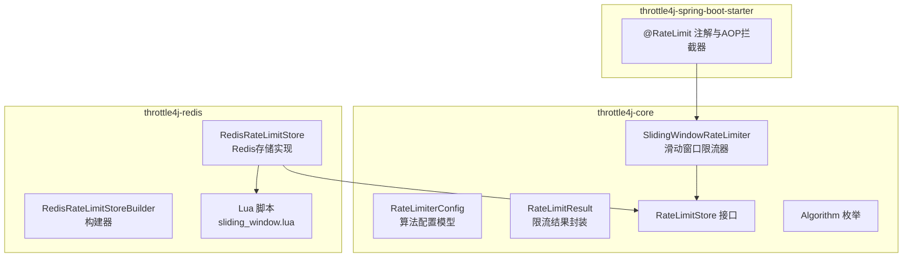
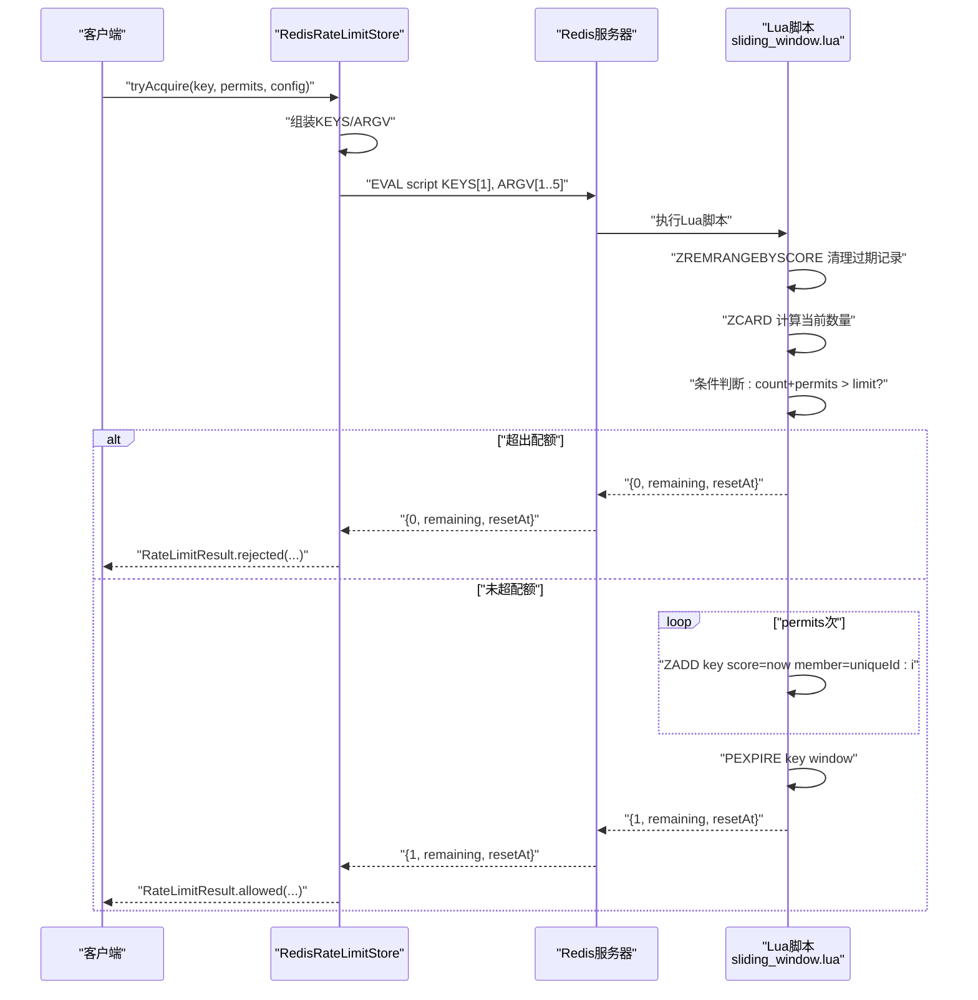
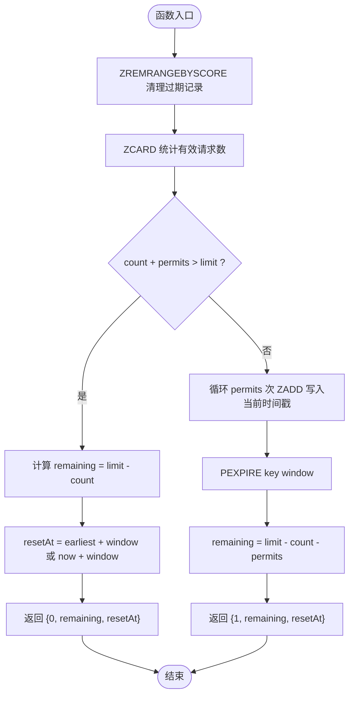
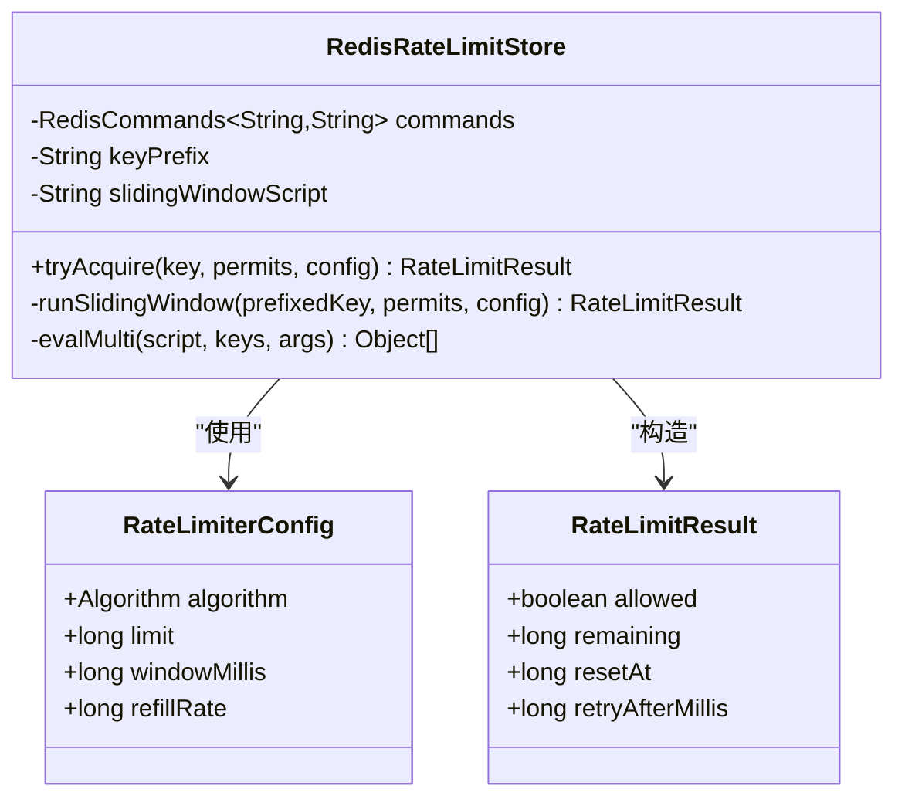
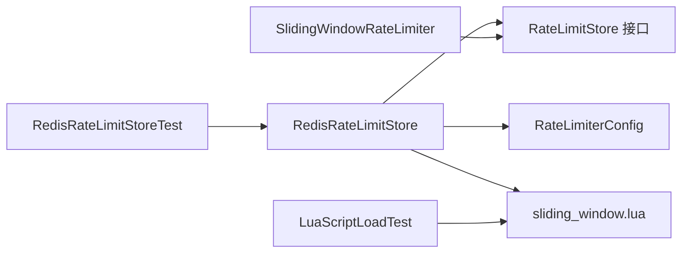

# 滑动窗口算法Lua脚本

<cite>
**本文引用的文件**
- [sliding_window.lua](file://throttle4j-redis/src/main/resources/scripts/sliding_window.lua)
- [RedisRateLimitStore.java](file://throttle4j-redis/src/main/java/com/throttle4j/redis/RedisRateLimitStore.java)
- [RedisRateLimitStoreBuilder.java](file://throttle4j-redis/src/main/java/com/throttle4j/redis/RedisRateLimitStoreBuilder.java)
- [RateLimiterConfig.java](file://throttle4j-core/src/main/java/com/throttle4j/core/RateLimiterConfig.java)
- [RateLimitResult.java](file://throttle4j-core/src/main/java/com/throttle4j/core/RateLimitResult.java)
- [RateLimitStore.java](file://throttle4j-core/src/main/java/com/throttle4j/store/RateLimitStore.java)
- [SlidingWindowRateLimiter.java](file://throttle4j-core/src/main/java/com/throttle4j/algorithm/SlidingWindowRateLimiter.java)
- [Algorithm.java](file://throttle4j-core/src/main/java/com/throttle4j/core/Algorithm.java)
- [RedisRateLimitStoreTest.java](file://throttle4j-redis/src/test/java/com/throttle4j/redis/RedisRateLimitStoreTest.java)
- [LuaScriptLoadTest.java](file://throttle4j-redis/src/test/java/com/throttle4j/redis/LuaScriptLoadTest.java)
- [README.md](file://README.md)
</cite>

## 目录
1. [简介](#简介)
2. [项目结构](#项目结构)
3. [核心组件](#核心组件)
4. [架构总览](#架构总览)
5. [详细组件分析](#详细组件分析)
6. [依赖分析](#依赖分析)
7. [性能考虑](#性能考虑)
8. [故障排查指南](#故障排查指南)
9. [结论](#结论)
10. [附录](#附录)

## 简介
本文件面向需要在分布式系统中实现“滑动窗口限流”的工程师与架构师，系统化阐述基于Redis的滑动窗口Lua脚本实现，重点解析以下方面：
- 基于时间戳的精确计数机制与ZSET（有序集合）的使用方式
- 时间序列数据结构的维护、过期清理策略与原子性保障
- 从检查历史记录到更新当前状态的完整原子流程
- 时间戳过滤算法与窗口边界处理机制
- 参数配置、性能调优建议以及高并发下的一致性与内存管理策略

## 项目结构
该项目采用多模块分层设计，滑动窗口的Redis实现位于throttle4j-redis模块，核心算法与配置位于throttle4j-core模块，Spring Boot集成位于throttle4j-spring-boot-starter模块。

图表来源
- [RedisRateLimitStore.java:1-258](file://throttle4j-redis/src/main/java/com/throttle4j/redis/RedisRateLimitStore.java#L1-L258)
- [sliding_window.lua:1-49](file://throttle4j-redis/src/main/resources/scripts/sliding_window.lua#L1-L49)
- [RateLimiterConfig.java:1-113](file://throttle4j-core/src/main/java/com/throttle4j/core/RateLimiterConfig.java#L1-L113)
- [RateLimitResult.java:1-68](file://throttle4j-core/src/main/java/com/throttle4j/core/RateLimitResult.java#L1-L68)
- [SlidingWindowRateLimiter.java:1-16](file://throttle4j-core/src/main/java/com/throttle4j/algorithm/SlidingWindowRateLimiter.java#L1-L16)
- [Algorithm.java:1-16](file://throttle4j-core/src/main/java/com/throttle4j/core/Algorithm.java#L1-L16)

章节来源
- [README.md:76-102](file://README.md#L76-L102)

## 核心组件
- RedisRateLimitStore：负责加载Lua脚本、分发算法调用、执行原子评估、解析返回值并构造RateLimitResult。
- sliding_window.lua：实现滑动窗口的核心逻辑，使用ZSET维护请求时间戳，通过原子命令完成清理、计数与写入。
- RateLimiterConfig：定义算法类型、配额上限、窗口时长等配置项。
- RateLimitResult：封装允许/拒绝、剩余配额、重试时间等信息。
- SlidingWindowRateLimiter：基于存储的滑动窗口限流器（近似实现，实际精确逻辑在Redis端以Lua脚本完成）。

章节来源
- [RedisRateLimitStore.java:40-191](file://throttle4j-redis/src/main/java/com/throttle4j/redis/RedisRateLimitStore.java#L40-L191)
- [sliding_window.lua:1-49](file://throttle4j-redis/src/main/resources/scripts/sliding_window.lua#L1-L49)
- [RateLimiterConfig.java:8-113](file://throttle4j-core/src/main/java/com/throttle4j/core/RateLimiterConfig.java#L8-L113)
- [RateLimitResult.java:6-68](file://throttle4j-core/src/main/java/com/throttle4j/core/RateLimitResult.java#L6-L68)
- [SlidingWindowRateLimiter.java:10-16](file://throttle4j-core/src/main/java/com/throttle4j/algorithm/SlidingWindowRateLimiter.java#L10-L16)

## 架构总览
滑动窗口在Redis中的工作流如下：
- 客户端调用RedisRateLimitStore的tryAcquire方法，传入资源键、配额数与配置。
- RedisRateLimitStore将请求转发给sliding_window.lua脚本，脚本在单个事务内完成清理、计数、写入与过期设置。
- 返回值被解析为RateLimitResult，供上层业务判断是否放行或提示重试。

图表来源
- [RedisRateLimitStore.java:142-163](file://throttle4j-redis/src/main/java/com/throttle4j/redis/RedisRateLimitStore.java#L142-L163)
- [sliding_window.lua:20-48](file://throttle4j-redis/src/main/resources/scripts/sliding_window.lua#L20-L48)

## 详细组件分析

### Lua脚本：sliding_window.lua
该脚本是滑动窗口算法的原子实现，核心要点：
- 输入参数
  - KEYS[1]：限流键
  - ARGV[1]：limit（窗口内最大请求数）
  - ARGV[2]：windowMillis（窗口时长，毫秒）
  - ARGV[3]：permits（本次申请配额数）
  - ARGV[4]：currentTimeMillis（调用方提供的当前时间，确保全局一致的时间源）
  - ARGV[5]：uniqueId（用于区分ZSET成员，避免score相同导致覆盖）
- 数据结构
  - 使用ZSET（有序集合）存储请求时间戳，score为时间戳，member为“uniqueId:i”。
- 原子流程
  1) ZREMRANGEBYSCORE(key, 0, now - window)：删除窗口外的历史记录，仅保留有效期内的请求。
  2) ZCARD(key)：统计当前有效请求数量。
  3) 判断 count + permits > limit：
     - 若超限：计算remaining与resetAt（resetAt优先取最早记录的到期时间，否则默认为now + window），返回{0, remaining, resetAt}。
     - 若未超限：循环permits次，ZADD(key, now, uniqueId:i)，设置PEXPIRE(key, window)。
  4) 计算remaining与resetAt，返回{1, remaining, resetAt}。

图表来源
- [sliding_window.lua:20-48](file://throttle4j-redis/src/main/resources/scripts/sliding_window.lua#L20-L48)

章节来源
- [sliding_window.lua:1-49](file://throttle4j-redis/src/main/resources/scripts/sliding_window.lua#L1-L49)

### Java侧：RedisRateLimitStore
- 负责加载Lua脚本（一次性加载，类路径下）。
- runSlidingWindow方法组装KEYS与ARGV，调用Lettuce的EVAL MULTI执行脚本。
- 解析脚本返回值，构造RateLimitResult；若允许则remaining与resetAt直接来自脚本，若拒绝则根据resetAt与当前时间计算retryAfter。

图表来源
- [RedisRateLimitStore.java:40-191](file://throttle4j-redis/src/main/java/com/throttle4j/redis/RedisRateLimitStore.java#L40-L191)
- [RateLimiterConfig.java:8-113](file://throttle4j-core/src/main/java/com/throttle4j/core/RateLimiterConfig.java#L8-L113)
- [RateLimitResult.java:6-68](file://throttle4j-core/src/main/java/com/throttle4j/core/RateLimitResult.java#L6-L68)

章节来源
- [RedisRateLimitStore.java:142-163](file://throttle4j-redis/src/main/java/com/throttle4j/redis/RedisRateLimitStore.java#L142-L163)
- [RedisRateLimitStore.java:195-203](file://throttle4j-redis/src/main/java/com/throttle4j/redis/RedisRateLimitStore.java#L195-L203)

### 配置与参数
- RateLimiterConfig提供algorithm、limit、windowMillis、refillRate等字段，其中滑动窗口要求limit与windowMillis均大于0。
- RedisRateLimitStore在运行时将limit、windowMillis、permits、currentTimeMillis、uniqueId作为ARGV传递给Lua脚本。

章节来源
- [RateLimiterConfig.java:22-36](file://throttle4j-core/src/main/java/com/throttle4j/core/RateLimiterConfig.java#L22-L36)
- [RedisRateLimitStore.java:142-163](file://throttle4j-redis/src/main/java/com/throttle4j/redis/RedisRateLimitStore.java#L142-L163)

### 结果封装与返回
- RateLimitResult封装allowed、remaining、resetAt、retryAfterMillis，便于上层快速决策。
- RedisRateLimitStore在拒绝时根据resetAt与当前时间计算retryAfterMillis，确保客户端能正确等待。

章节来源
- [RateLimitResult.java:21-40](file://throttle4j-core/src/main/java/com/throttle4j/core/RateLimitResult.java#L21-L40)
- [RedisRateLimitStore.java:157-162](file://throttle4j-redis/src/main/java/com/throttle4j/redis/RedisRateLimitStore.java#L157-L162)

## 依赖分析
- RedisRateLimitStore依赖RateLimitStore接口与RateLimiterConfig配置，同时持有Lua脚本内容。
- SlidingWindowRateLimiter继承自AbstractStoreBackedRateLimiter，委托RedisRateLimitStore执行具体逻辑。
- 测试验证了Lua脚本的命令使用（ZREMRANGEBYSCORE、ZADD、ZCARD）、参数传递顺序与返回值格式。

图表来源
- [RedisRateLimitStore.java:40-191](file://throttle4j-redis/src/main/java/com/throttle4j/redis/RedisRateLimitStore.java#L40-L191)
- [SlidingWindowRateLimiter.java:10-16](file://throttle4j-core/src/main/java/com/throttle4j/algorithm/SlidingWindowRateLimiter.java#L10-L16)
- [RedisRateLimitStoreTest.java:112-138](file://throttle4j-redis/src/test/java/com/throttle4j/redis/RedisRateLimitStoreTest.java#L112-L138)
- [LuaScriptLoadTest.java:50-55](file://throttle4j-redis/src/test/java/com/throttle4j/redis/LuaScriptLoadTest.java#L50-L55)

章节来源
- [RedisRateLimitStoreTest.java:112-138](file://throttle4j-redis/src/test/java/com/throttle4j/redis/RedisRateLimitStoreTest.java#L112-L138)
- [LuaScriptLoadTest.java:50-55](file://throttle4j-redis/src/test/java/com/throttle4j/redis/LuaScriptLoadTest.java#L50-L55)

## 性能考虑
- 原子性与锁-free
  - Lua脚本在Redis端原子执行，避免竞态与中间状态暴露，天然支持高并发。
- 时间复杂度
  - ZREMRANGEBYSCORE：O(log N + K)，N为ZSET大小，K为被删除元素数量。
  - ZCARD：O(1)。
  - ZADD：O(log N)。
  - PEXPIRE：O(1)。
- 内存管理
  - 使用PEXPIRE对键设置TTL，确保过期记录自动清理，避免无限增长。
  - uniqueId确保每个ZSET成员唯一，避免score相同时成员覆盖。
- 参数调优建议
  - limit与windowMillis：根据QPS与突发特性设定，limit越大、window越小，窗口越“尖锐”，越容易触发resetAt计算。
  - permits：批量申请可减少网络往返，但需与limit匹配，避免一次申请过多导致快速耗尽。
  - currentTimeMillis：由调用方提供，确保跨节点时间一致，避免因时钟漂移导致的误判。
- 并发一致性
  - 单条Lua脚本内的所有命令在一个事务中执行，不存在部分更新问题。
  - ZRANGE WITHSCORES用于精确计算最早记录的到期时间，提升resetAt的准确性。

章节来源
- [sliding_window.lua:20-48](file://throttle4j-redis/src/main/resources/scripts/sliding_window.lua#L20-L48)
- [RedisRateLimitStore.java:142-163](file://throttle4j-redis/src/main/java/com/throttle4j/redis/RedisRateLimitStore.java#L142-L163)

## 故障排查指南
- Lua脚本未找到或为空
  - 现象：初始化时报错，提示脚本缺失或为空。
  - 处理：确认resources/scripts目录下存在sliding_window.lua，且打包后可从类路径读取。
- EVAL返回值类型异常
  - 现象：抛出IllegalStateException，提示返回值非列表。
  - 处理：检查脚本返回值格式是否与预期一致（MULTI输出应为列表）。
- 拒绝时重试时间不正确
  - 现象：retryAfterMillis过大或过小。
  - 处理：确认currentTimeMillis传入正确，且脚本中的resetAt计算逻辑（最早记录到期时间）生效。
- 过期清理不生效
  - 现象：ZSET持续增长。
  - 处理：确认PEXPIRE已执行，且Redis的过期策略正常；检查windowMillis设置是否合理。

章节来源
- [LuaScriptLoadTest.java:18-39](file://throttle4j-redis/src/test/java/com/throttle4j/redis/LuaScriptLoadTest.java#L18-L39)
- [RedisRateLimitStoreTest.java:271-282](file://throttle4j-redis/src/test/java/com/throttle4j/redis/RedisRateLimitStoreTest.java#L271-L282)
- [RedisRateLimitStore.java:195-203](file://throttle4j-redis/src/main/java/com/throttle4j/redis/RedisRateLimitStore.java#L195-L203)

## 结论
该实现以Redis ZSET为核心，结合Lua脚本的原子性，提供了高精度、低开销的滑动窗口限流方案。其关键优势在于：
- 基于时间戳的精确计数，窗口边界处理准确；
- 原子操作保障高并发一致性；
- PEXPIRE自动清理过期记录，降低内存压力；
- 参数清晰、易于调优与扩展。

## 附录
- 关键实现路径
  - [sliding_window.lua:1-49](file://throttle4j-redis/src/main/resources/scripts/sliding_window.lua#L1-L49)
  - [RedisRateLimitStore.java:142-163](file://throttle4j-redis/src/main/java/com/throttle4j/redis/RedisRateLimitStore.java#L142-L163)
  - [RateLimiterConfig.java:22-36](file://throttle4j-core/src/main/java/com/throttle4j/core/RateLimiterConfig.java#L22-L36)
  - [RateLimitResult.java:21-40](file://throttle4j-core/src/main/java/com/throttle4j/core/RateLimitResult.java#L21-L40)
  - [SlidingWindowRateLimiter.java:10-16](file://throttle4j-core/src/main/java/com/throttle4j/algorithm/SlidingWindowRateLimiter.java#L10-L16)
  - [Algorithm.java:6-15](file://throttle4j-core/src/main/java/com/throttle4j/core/Algorithm.java#L6-L15)
  - [RedisRateLimitStoreTest.java:112-138](file://throttle4j-redis/src/test/java/com/throttle4j/redis/RedisRateLimitStoreTest.java#L112-L138)
  - [LuaScriptLoadTest.java:50-55](file://throttle4j-redis/src/test/java/com/throttle4j/redis/LuaScriptLoadTest.java#L50-L55)