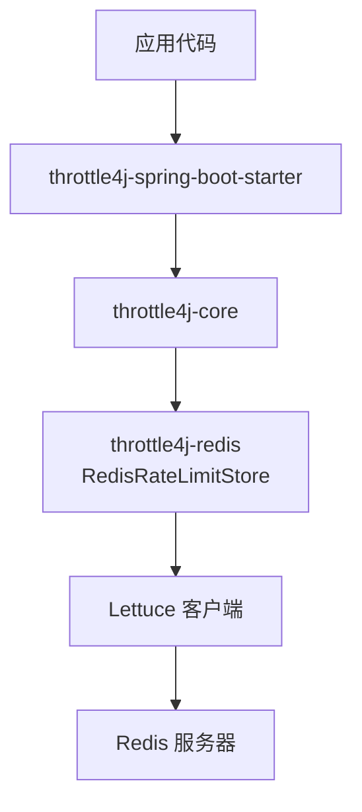
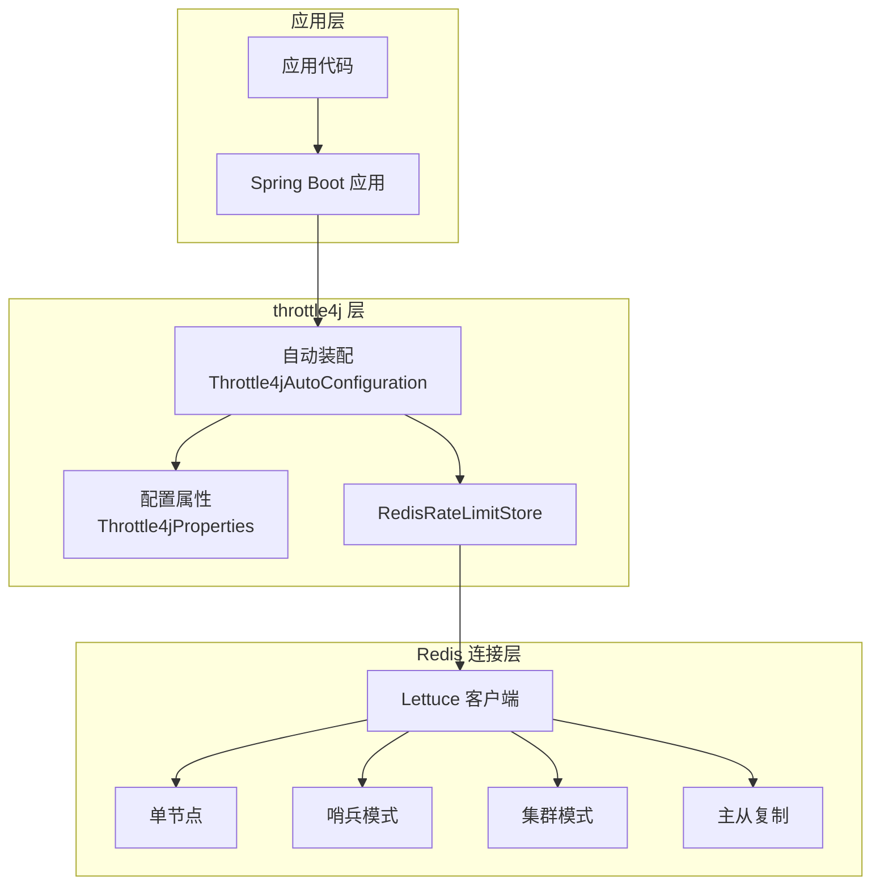
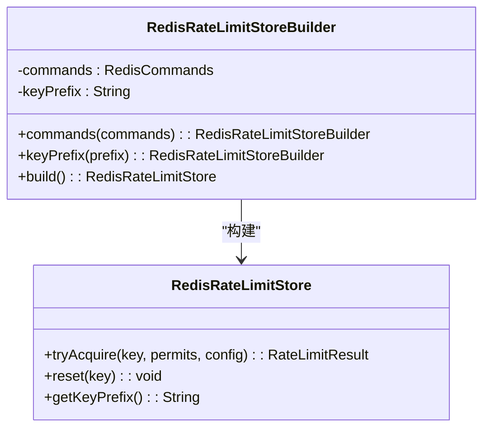
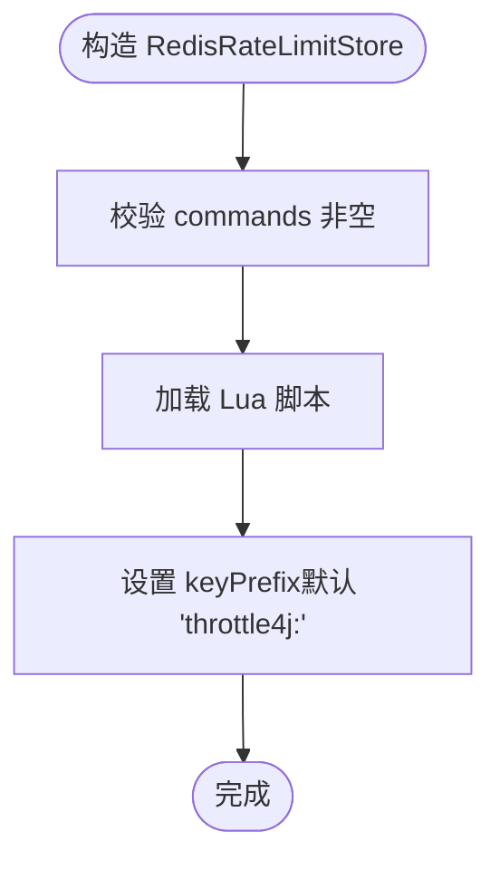
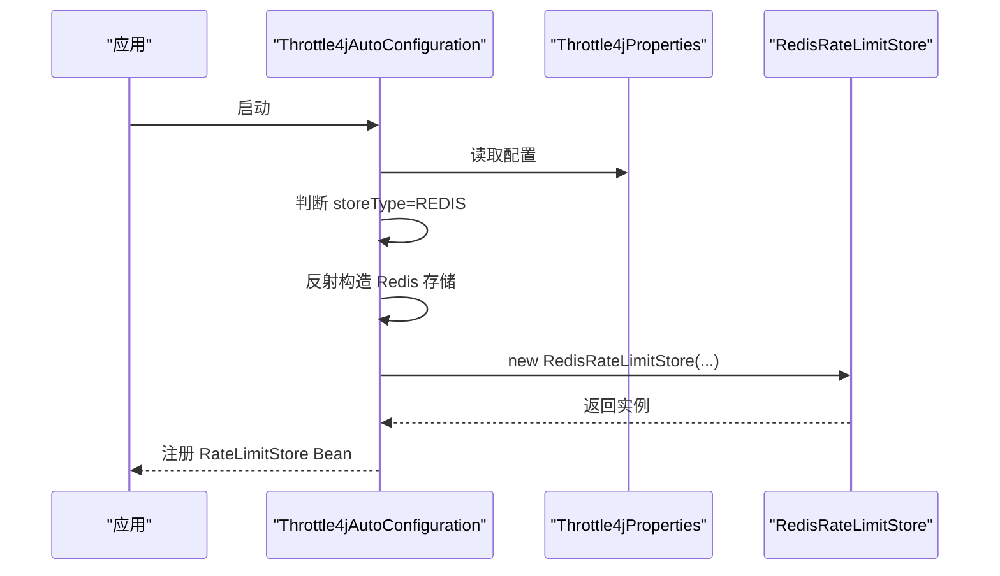
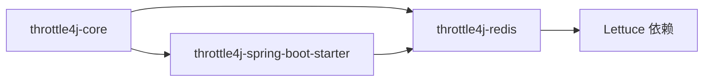
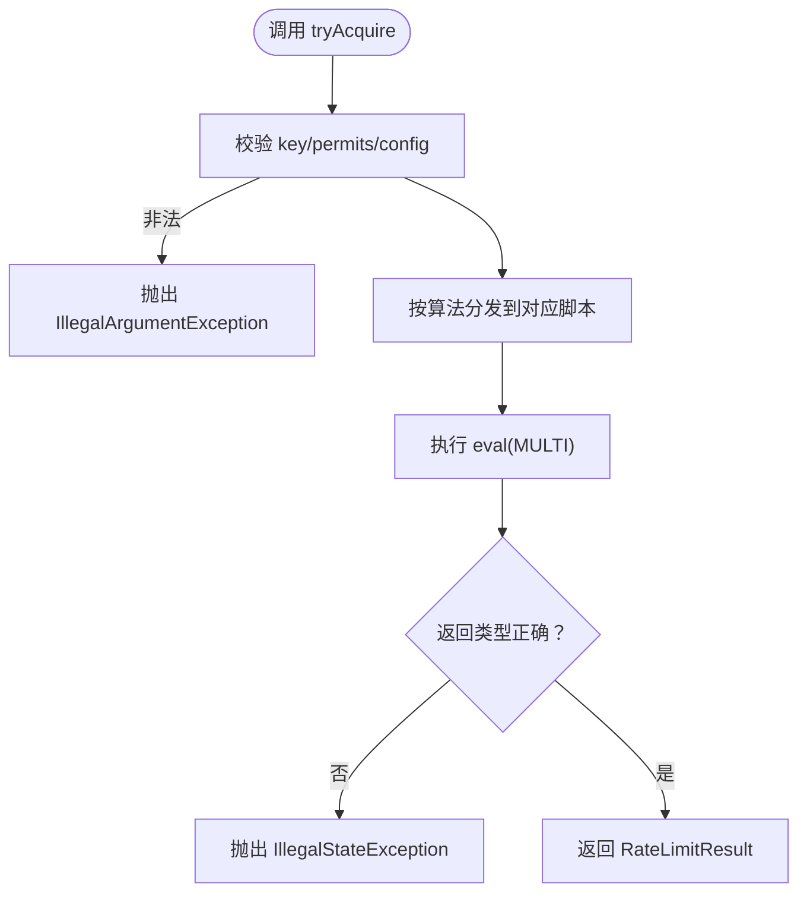

# Redis配置与连接

<cite>
**本文引用的文件**
- [RedisRateLimitStoreBuilder.java](file://throttle4j-redis/src/main/java/com/throttle4j/redis/RedisRateLimitStoreBuilder.java)
- [RedisRateLimitStore.java](file://throttle4j-redis/src/main/java/com/throttle4j/redis/RedisRateLimitStore.java)
- [Throttle4jAutoConfiguration.java](file://throttle4j-spring-boot-starter/src/main/java/com/throttle4j/spring/autoconfigure/Throttle4jAutoConfiguration.java)
- [Throttle4jProperties.java](file://throttle4j-spring-boot-starter/src/main/java/com/throttle4j/spring/autoconfigure/Throttle4jProperties.java)
- [application.yml](file://throttle4j-examples/src/main/resources/application.yml)
- [README.md](file://README.md)
- [README_CN.md](file://README_CN.md)
- [fixed_window.lua](file://throttle4j-redis/src/main/resources/scripts/fixed_window.lua)
- [sliding_window.lua](file://throttle4j-redis/src/main/resources/scripts/sliding_window.lua)
- [token_bucket.lua](file://throttle4j-redis/src/main/resources/scripts/token_bucket.lua)
- [RedisRateLimitStoreTest.java](file://throttle4j-redis/src/test/java/com/throttle4j/redis/RedisRateLimitStoreTest.java)
</cite>

## 目录
1. [简介](#简介)
2. [项目结构](#项目结构)
3. [核心组件](#核心组件)
4. [架构总览](#架构总览)
5. [详细组件分析](#详细组件分析)
6. [依赖关系分析](#依赖关系分析)
7. [性能考量](#性能考量)
8. [故障排查指南](#故障排查指南)
9. [结论](#结论)
10. [附录](#附录)

## 简介
本指南聚焦于在throttle4j中使用Redis进行分布式限流的配置与连接实践，重点覆盖以下方面：
- RedisRateLimitStoreBuilder的使用方法与配置选项：commands连接配置、keyPrefix前缀设置、连接池参数说明
- 不同Redis部署模式的配置差异：单节点、主从复制、哨兵模式、集群模式的连接要点
- 连接超时、重试策略与健康检查的配置思路
- Lettuce客户端的性能调优参数：连接池大小、命令超时时间、批量操作优化
- 连接故障转移与高可用配置建议

本指南以仓库中的实际实现为依据，避免臆测，确保读者能够准确落地配置。

## 项目结构
throttle4j采用模块化设计，Redis相关能力由throttle4j-redis模块提供，Spring Boot集成由throttle4j-spring-boot-starter模块提供。核心交互如下：
- 应用通过throttle4j-spring-boot-starter自动装配，按需选择内存或Redis存储
- 当选择Redis时，自动装配逻辑尝试反射构造RedisRateLimitStore，并支持多种构造签名
- Redis存储内部通过Lettuce同步命令接口执行Lua脚本，实现原子限流逻辑

**图表来源**
- [Throttle4jAutoConfiguration.java:34-99](file://throttle4j-spring-boot-starter/src/main/java/com/throttle4j/spring/autoconfigure/Throttle4jAutoConfiguration.java#L34-L99)
- [RedisRateLimitStore.java:40-78](file://throttle4j-redis/src/main/java/com/throttle4j/redis/RedisRateLimitStore.java#L40-L78)

**章节来源**
- [README.md:76-94](file://README.md#L76-L94)
- [README_CN.md:76-94](file://README_CN.md#L76-L94)

## 核心组件
- RedisRateLimitStoreBuilder：用于构建RedisRateLimitStore的流式构建器，必须提供Lettuce同步命令接口，并可自定义keyPrefix
- RedisRateLimitStore：分布式限流存储实现，封装三种算法对应的Lua脚本，统一通过commands.eval执行
- Throttle4jProperties：Spring Boot配置属性模型，包含Redis连接参数（host/port/password/database/keyPrefix）
- Throttle4jAutoConfiguration：自动装配逻辑，当storeType=REDIS时尝试反射构造Redis存储实例

关键点：
- RedisRateLimitStoreBuilder要求显式传入commands，否则在build时报错
- RedisRateLimitStore默认keyPrefix为“throttle4j:”，可通过Builder或构造函数覆盖
- 自动装配支持多种Redis构造签名，优先使用(host, port, password, database, keyPrefix)

**章节来源**
- [RedisRateLimitStoreBuilder.java:20-61](file://throttle4j-redis/src/main/java/com/throttle4j/redis/RedisRateLimitStoreBuilder.java#L20-L61)
- [RedisRateLimitStore.java:40-78](file://throttle4j-redis/src/main/java/com/throttle4j/redis/RedisRateLimitStore.java#L40-L78)
- [Throttle4jProperties.java:153-200](file://throttle4j-spring-boot-starter/src/main/java/com/throttle4j/spring/autoconfigure/Throttle4jProperties.java#L153-L200)
- [Throttle4jAutoConfiguration.java:47-99](file://throttle4j-spring-boot-starter/src/main/java/com/throttle4j/spring/autoconfigure/Throttle4jAutoConfiguration.java#L47-L99)

## 架构总览
下图展示从应用到Redis的完整调用链路，以及在不同部署模式下的连接差异：

**图表来源**
- [Throttle4jAutoConfiguration.java:34-99](file://throttle4j-spring-boot-starter/src/main/java/com/throttle4j/spring/autoconfigure/Throttle4jAutoConfiguration.java#L34-L99)
- [Throttle4jProperties.java:153-200](file://throttle4j-spring-boot-starter/src/main/java/com/throttle4j/spring/autoconfigure/Throttle4jProperties.java#L153-L200)
- [RedisRateLimitStore.java:40-78](file://throttle4j-redis/src/main/java/com/throttle4j/redis/RedisRateLimitStore.java#L40-L78)

## 详细组件分析

### RedisRateLimitStoreBuilder 使用指南
- 必填项：commands（Lettuce同步命令接口），必须非空
- 可选项：keyPrefix（默认“throttle4j:”），可为空字符串
- 构建后得到线程安全的RedisRateLimitStore实例

**图表来源**
- [RedisRateLimitStoreBuilder.java:20-61](file://throttle4j-redis/src/main/java/com/throttle4j/redis/RedisRateLimitStoreBuilder.java#L20-L61)
- [RedisRateLimitStore.java:40-78](file://throttle4j-redis/src/main/java/com/throttle4j/redis/RedisRateLimitStore.java#L40-L78)

**章节来源**
- [RedisRateLimitStoreBuilder.java:20-61](file://throttle4j-redis/src/main/java/com/throttle4j/redis/RedisRateLimitStoreBuilder.java#L20-L61)
- [RedisRateLimitStoreTest.java:238-246](file://throttle4j-redis/src/test/java/com/throttle4j/redis/RedisRateLimitStoreTest.java#L238-L246)

### RedisRateLimitStore 构造与键空间
- 默认keyPrefix为“throttle4j:”
- 支持自定义keyPrefix，所有限流键均带前缀
- 构造时加载三段Lua脚本：固定窗口、滑动窗口、令牌桶

**图表来源**
- [RedisRateLimitStore.java:62-78](file://throttle4j-redis/src/main/java/com/throttle4j/redis/RedisRateLimitStore.java#L62-L78)

**章节来源**
- [RedisRateLimitStore.java:44-78](file://throttle4j-redis/src/main/java/com/throttle4j/redis/RedisRateLimitStore.java#L44-L78)
- [RedisRateLimitStoreTest.java:238-246](file://throttle4j-redis/src/test/java/com/throttle4j/redis/RedisRateLimitStoreTest.java#L238-L246)

### Spring Boot 自动装配与Redis连接
- 当storeType=REDIS时，自动装配尝试反射构造Redis存储
- 支持多种构造签名，优先使用(host, port, password, database, keyPrefix)
- 配置属性包含host/port/password/database/keyPrefix等

**图表来源**
- [Throttle4jAutoConfiguration.java:47-99](file://throttle4j-spring-boot-starter/src/main/java/com/throttle4j/spring/autoconfigure/Throttle4jAutoConfiguration.java#L47-L99)
- [Throttle4jProperties.java:153-200](file://throttle4j-spring-boot-starter/src/main/java/com/throttle4j/spring/autoconfigure/Throttle4jProperties.java#L153-L200)

**章节来源**
- [Throttle4jAutoConfiguration.java:47-99](file://throttle4j-spring-boot-starter/src/main/java/com/throttle4j/spring/autoconfigure/Throttle4jAutoConfiguration.java#L47-L99)
- [Throttle4jProperties.java:153-200](file://throttle4j-spring-boot-starter/src/main/java/com/throttle4j/spring/autoconfigure/Throttle4jProperties.java#L153-L200)

### 不同Redis部署模式的配置差异
- 单节点：使用host/port/password/database/keyPrefix即可
- 主从复制：通常仍以单节点方式连接，但需确保读写分离策略与一致性需求匹配
- 哨兵模式：需要使用哨兵URL或配置哨兵节点列表，让客户端自动发现主从切换
- 集群模式：需要使用集群URL或配置多个节点，客户端负责分片路由与重定向

注意：本仓库未直接暴露Lettuce连接工厂或URL格式配置项，实际部署时应结合具体Lettuce版本与环境选择合适的连接方式。

**章节来源**
- [Throttle4jProperties.java:153-200](file://throttle4j-spring-boot-starter/src/main/java/com/throttle4j/spring/autoconfigure/Throttle4jProperties.java#L153-L200)
- [README.md:114-134](file://README.md#L114-L134)
- [README_CN.md:118-136](file://README_CN.md#L118-L136)

### 连接超时、重试策略与健康检查
- 连接超时：可在Lettuce层面配置连接与命令超时；本仓库未直接暴露timeout配置项
- 重试策略：可通过Lettuce的重试机制或应用侧补偿策略实现
- 健康检查：建议在应用层对Redis连接进行周期性探测，失败时触发降级或告警

提示：本节为通用实践建议，具体实现需结合所用Lettuce版本与部署环境。

### Lettuce客户端性能调优
- 连接池大小：根据QPS与并发请求量合理设置，避免过多连接导致Redis压力过大
- 命令超时时间：结合SLA设定，避免长尾阻塞
- 批量操作优化：合并多次小请求为一次Lua脚本执行，减少RTT与网络开销

说明：本仓库通过Lua脚本在服务端原子执行限流逻辑，天然具备批量优化效果。

**章节来源**
- [RedisRateLimitStore.java:196-203](file://throttle4j-redis/src/main/java/com/throttle4j/redis/RedisRateLimitStore.java#L196-L203)

### 连接故障转移与高可用
- 哨兵/集群：优先采用官方推荐的连接URL或配置清单
- 降级策略：当Redis不可用时，自动回退到本地内存存储（见README描述）
- 故障恢复：监控与自动切换，确保在主从切换期间维持限流一致性

**章节来源**
- [README.md:20-22](file://README.md#L20-L22)
- [README_CN.md:19-22](file://README_CN.md#L19-L22)

## 依赖关系分析
- throttle4j-redis依赖Lettuce同步命令接口执行Lua脚本
- throttle4j-spring-boot-starter通过条件化装配与反射机制按需启用Redis存储
- RedisRateLimitStoreTest验证了keyPrefix生效与脚本参数传递

**图表来源**
- [Throttle4jAutoConfiguration.java:34-99](file://throttle4j-spring-boot-starter/src/main/java/com/throttle4j/spring/autoconfigure/Throttle4jAutoConfiguration.java#L34-L99)
- [RedisRateLimitStore.java:3-10](file://throttle4j-redis/src/main/java/com/throttle4j/redis/RedisRateLimitStore.java#L3-L10)

**章节来源**
- [RedisRateLimitStoreTest.java:81-110](file://throttle4j-redis/src/test/java/com/throttle4j/redis/RedisRateLimitStoreTest.java#L81-L110)

## 性能考量
- Lua脚本原子性：固定窗口、滑动窗口、令牌桶均在Redis侧原子执行，降低竞争与往返延迟
- 键空间隔离：通过keyPrefix避免与其他业务冲突，便于运维与容量规划
- 脚本加载：构造时一次性加载脚本，后续复用，减少IO与解析开销

**章节来源**
- [RedisRateLimitStore.java:226-251](file://throttle4j-redis/src/main/java/com/throttle4j/redis/RedisRateLimitStore.java#L226-L251)

## 故障排查指南
- 构建期错误：未设置commands导致IllegalStateException
- 运行期异常：Lua脚本返回类型不符合预期抛出IllegalStateException
- 参数校验：key为null或permits小于1抛出IllegalArgumentException
- 降级行为：当storeType=REDIS但Redis模块不可用时，自动回退到InMemoryStore

**图表来源**
- [RedisRateLimitStore.java:80-110](file://throttle4j-redis/src/main/java/com/throttle4j/redis/RedisRateLimitStore.java#L80-L110)
- [RedisRateLimitStore.java:196-203](file://throttle4j-redis/src/main/java/com/throttle4j/redis/RedisRateLimitStore.java#L196-L203)

**章节来源**
- [RedisRateLimitStore.java:80-110](file://throttle4j-redis/src/main/java/com/throttle4j/redis/RedisRateLimitStore.java#L80-L110)
- [RedisRateLimitStore.java:196-203](file://throttle4j-redis/src/main/java/com/throttle4j/redis/RedisRateLimitStore.java#L196-L203)
- [RedisRateLimitStoreTest.java:248-282](file://throttle4j-redis/src/test/java/com/throttle4j/redis/RedisRateLimitStoreTest.java#L248-L282)

## 结论
- 使用RedisRateLimitStoreBuilder显式注入Lettuce同步命令接口，并按需设置keyPrefix
- 在Spring Boot中通过Throttle4jProperties配置Redis连接参数，自动装配将按需构造Redis存储
- 通过Lua脚本在服务端原子执行限流逻辑，天然具备批量优化与高吞吐特性
- 部署时结合Lettuce能力选择合适的连接模式（单节点/哨兵/集群），并配套超时、重试与健康检查策略
- 发生故障时利用自动降级机制保障系统稳定性

## 附录

### 配置项一览（Spring Boot）
- throttle4j.store-type：选择内存或Redis存储
- throttle4j.redis.host/port/password/database/keyPrefix：Redis连接参数
- throttle4j.redis.timeout：命令超时（如Lettuce支持）

**章节来源**
- [Throttle4jProperties.java:153-200](file://throttle4j-spring-boot-starter/src/main/java/com/throttle4j/spring/autoconfigure/Throttle4jProperties.java#L153-L200)
- [application.yml:4-9](file://throttle4j-examples/src/main/resources/application.yml#L4-L9)
- [README.md:114-134](file://README.md#L114-L134)
- [README_CN.md:118-136](file://README_CN.md#L118-L136)

### 算法与脚本要点
- 固定窗口：使用GET/INCRBY与PTTL实现窗口计数与过期控制
- 滑动窗口：使用ZSET维护有序集合，ZREMRANGEBYSCORE清理过期条目
- 令牌桶：使用HSET/HMGET维护tokens与lastRefill，计算补充并设置过期

**章节来源**
- [fixed_window.lua:1-46](file://throttle4j-redis/src/main/resources/scripts/fixed_window.lua#L1-L46)
- [sliding_window.lua:1-49](file://throttle4j-redis/src/main/resources/scripts/sliding_window.lua#L1-L49)
- [token_bucket.lua:1-58](file://throttle4j-redis/src/main/resources/scripts/token_bucket.lua#L1-L58)