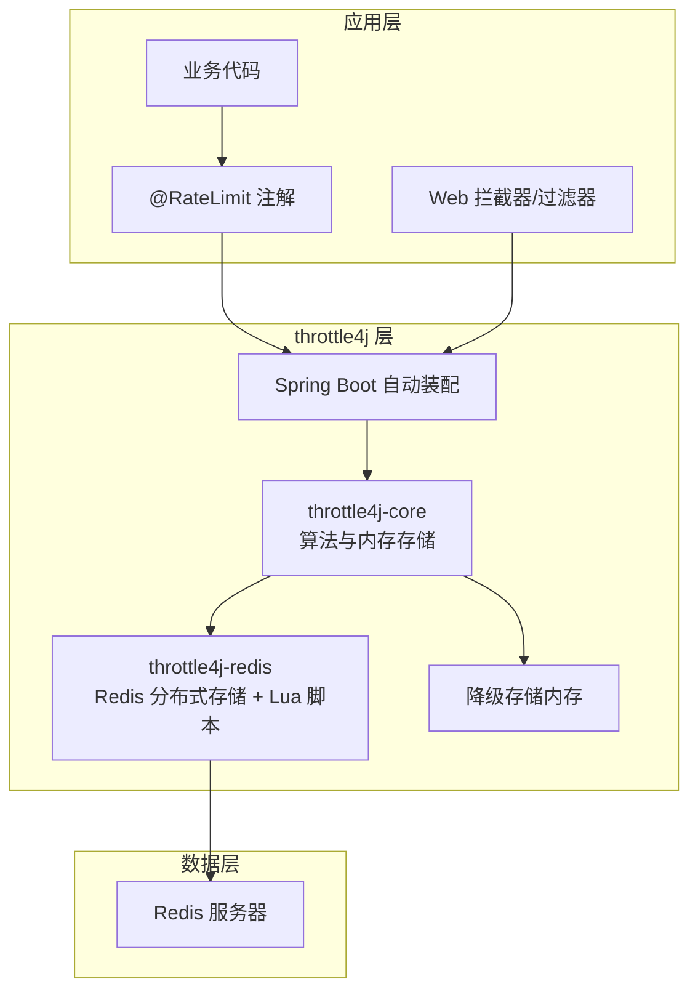
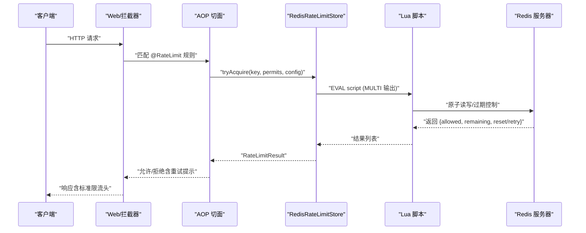
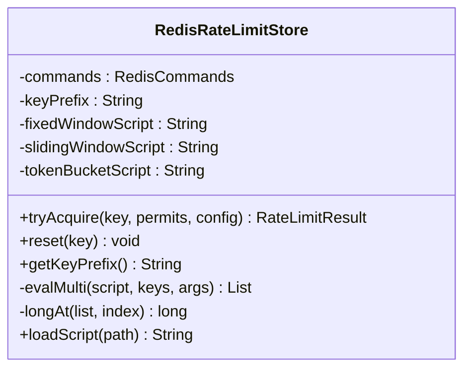
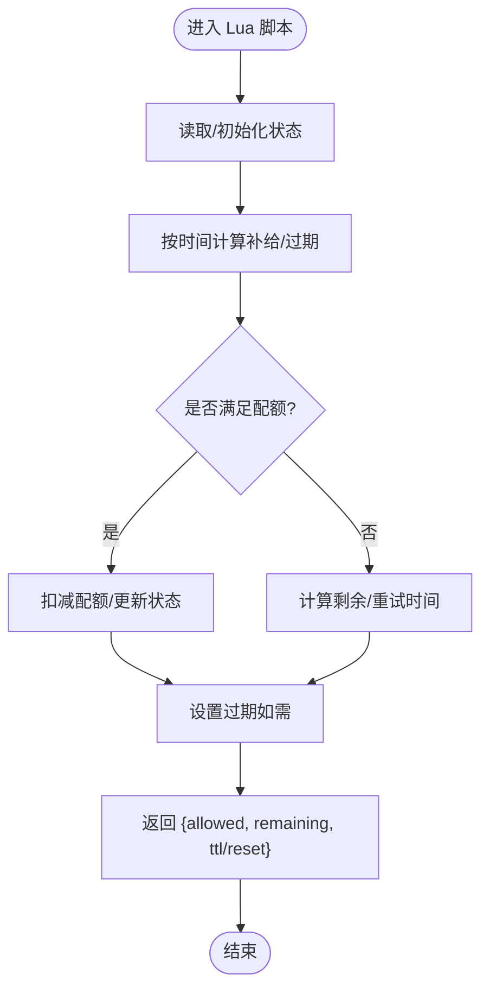
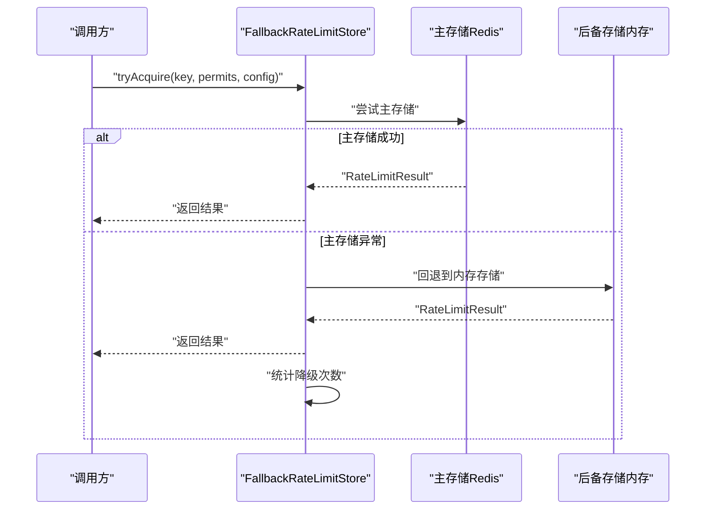
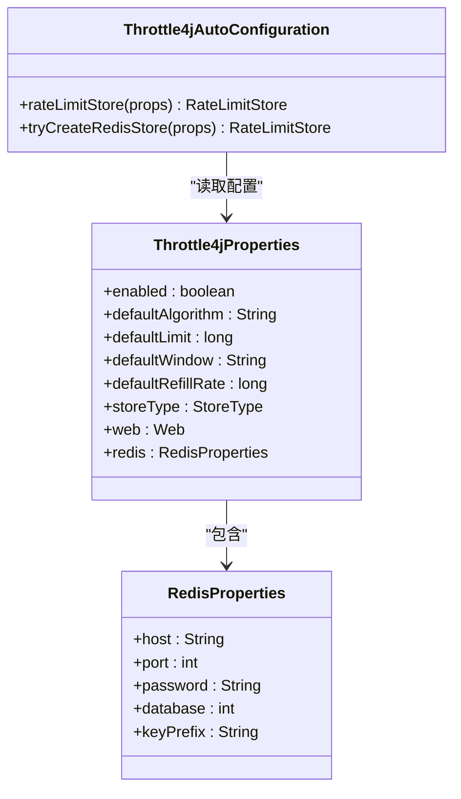
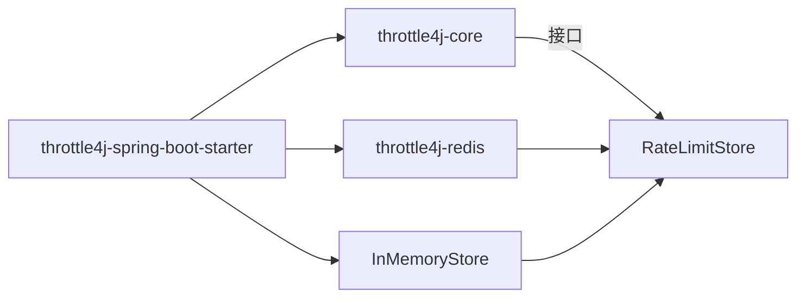

# 分布式部署

<cite>
**本文引用的文件**
- [RedisRateLimitStore.java](file://throttle4j-redis/src/main/java/com/throttle4j/redis/RedisRateLimitStore.java)
- [RedisRateLimitStoreBuilder.java](file://throttle4j-redis/src/main/java/com/throttle4j/redis/RedisRateLimitStoreBuilder.java)
- [FallbackRateLimitStore.java](file://throttle4j-redis/src/main/java/com/throttle4j/redis/FallbackRateLimitStore.java)
- [fixed_window.lua](file://throttle4j-redis/src/main/resources/scripts/fixed_window.lua)
- [sliding_window.lua](file://throttle4j-redis/src/main/resources/scripts/sliding_window.lua)
- [token_bucket.lua](file://throttle4j-redis/src/main/resources/scripts/token_bucket.lua)
- [Throttle4jAutoConfiguration.java](file://throttle4j-spring-boot-starter/src/main/java/com/throttle4j/spring/autoconfigure/Throttle4jAutoConfiguration.java)
- [Throttle4jProperties.java](file://throttle4j-spring-boot-starter/src/main/java/com/throttle4j/spring/autoconfigure/Throttle4jProperties.java)
- [application.yml](file://throttle4j-examples/src/main/resources/application.yml)
- [RedisRateLimitStoreTest.java](file://throttle4j-redis/src/test/java/com/throttle4j/redis/RedisRateLimitStoreTest.java)
- [LuaScriptLoadTest.java](file://throttle4j-redis/src/test/java/com/throttle4j/redis/LuaScriptLoadTest.java)
- [README.md](file://README.md)
- [README_CN.md](file://README_CN.md)
</cite>

## 目录
1. [简介](#简介)
2. [项目结构](#项目结构)
3. [核心组件](#核心组件)
4. [架构总览](#架构总览)
5. [详细组件分析](#详细组件分析)
6. [依赖关系分析](#依赖关系分析)
7. [性能考量](#性能考量)
8. [故障排查指南](#故障排查指南)
9. [结论](#结论)
10. [附录](#附录)

## 简介
本指南面向在分布式环境中部署 throttle4j 的工程团队，聚焦 Redis 集群的配置要点、连接池与性能调优、Lua 脚本的实现与原子性保障、不同 Redis 部署模式下的配置示例、降级机制与监控、网络分区与超时重试最佳实践，以及容量规划与性能基准建议。文档以仓库中实际代码为依据，辅以可视化图示帮助读者快速建立对系统行为的理解。

## 项目结构
throttle4j 采用多模块设计，核心能力由以下模块组成：
- throttle4j-core：算法、RateLimiter API、内存存储与配置模型
- throttle4j-redis：基于 Lettuce 的 Redis 分布式存储与 Lua 脚本
- throttle4j-spring-boot-starter：自动装配、@RateLimit AOP、Web 拦截器与响应头
- throttle4j-examples：Spring Boot 示例工程

图表来源
- [README.md:76-94](file://README.md#L76-L94)
- [README_CN.md:77-94](file://README_CN.md#L77-L94)

章节来源
- [README.md:76-102](file://README.md#L76-L102)
- [README_CN.md:77-102](file://README_CN.md#L77-L102)

## 核心组件
- RedisRateLimitStore：基于 Lettuce 的同步命令接口执行 Lua 脚本，实现固定窗口、滑动窗口、令牌桶/漏桶的原子化限流逻辑。
- RedisRateLimitStoreBuilder：用于构建 RedisRateLimitStore 的流式构造器，支持自定义 key 前缀。
- FallbackRateLimitStore：主存储失败时透明降级至内存存储，保障服务可用性。
- Lua 脚本：固定窗口、滑动窗口（有序集合）、令牌桶（哈希+过期）分别封装在独立脚本中，通过 EVAL 执行，保证原子性。
- Spring 自动装配：根据配置选择内存或 Redis 存储，并注册 AOP 与 Web 组件。

章节来源
- [RedisRateLimitStore.java:40-78](file://throttle4j-redis/src/main/java/com/throttle4j/redis/RedisRateLimitStore.java#L40-L78)
- [RedisRateLimitStoreBuilder.java:20-59](file://throttle4j-redis/src/main/java/com/throttle4j/redis/RedisRateLimitStoreBuilder.java#L20-L59)
- [FallbackRateLimitStore.java:27-77](file://throttle4j-redis/src/main/java/com/throttle4j/redis/FallbackRateLimitStore.java#L27-L77)
- [Throttle4jAutoConfiguration.java:34-99](file://throttle4j-spring-boot-starter/src/main/java/com/throttle4j/spring/autoconfigure/Throttle4jAutoConfiguration.java#L34-L99)
- [Throttle4jProperties.java:103-200](file://throttle4j-spring-boot-starter/src/main/java/com/throttle4j/spring/autoconfigure/Throttle4jProperties.java#L103-L200)

## 架构总览
throttle4j 在分布式场景下通过 Redis 实现全局一致的限流状态，Lua 脚本确保每条请求的检查与更新在服务端原子完成；当 Redis 不可用时，自动切换到本地内存存储，维持基本的限流能力。

图表来源
- [RedisRateLimitStore.java:80-191](file://throttle4j-redis/src/main/java/com/throttle4j/redis/RedisRateLimitStore.java#L80-L191)
- [fixed_window.lua:1-46](file://throttle4j-redis/src/main/resources/scripts/fixed_window.lua#L1-L46)
- [sliding_window.lua:1-49](file://throttle4j-redis/src/main/resources/scripts/sliding_window.lua#L1-L49)
- [token_bucket.lua:1-58](file://throttle4j-redis/src/main/resources/scripts/token_bucket.lua#L1-L58)

## 详细组件分析

### RedisRateLimitStore 组件
- 关键职责
  - 将算法分发到对应 Lua 脚本执行，返回统一的 RateLimitResult。
  - 支持固定窗口、滑动窗口、令牌桶、漏桶（映射为令牌桶）。
  - 提供 reset 清理键，支持自定义 key 前缀避免冲突。
- 原子性与一致性
  - 通过 Lettuce 的 EVAL 与 ScriptOutputType.MULTI 返回值，确保脚本内读改写为原子操作。
  - 滑动窗口使用有序集合清理过期记录并计数；令牌桶使用哈希保存 tokens 与上次补给时间，并设置过期。
- 错误处理
  - 对空参数进行校验；脚本加载失败抛出异常；结果解析兼容多种数值类型。

图表来源
- [RedisRateLimitStore.java:40-78](file://throttle4j-redis/src/main/java/com/throttle4j/redis/RedisRateLimitStore.java#L40-L78)
- [RedisRateLimitStore.java:195-251](file://throttle4j-redis/src/main/java/com/throttle4j/redis/RedisRateLimitStore.java#L195-L251)

章节来源
- [RedisRateLimitStore.java:80-191](file://throttle4j-redis/src/main/java/com/throttle4j/redis/RedisRateLimitStore.java#L80-L191)
- [RedisRateLimitStore.java:226-251](file://throttle4j-redis/src/main/java/com/throttle4j/redis/RedisRateLimitStore.java#L226-L251)

### Lua 脚本实现与原子性
- 固定窗口（fixed_window.lua）
  - 使用 GET/PTTL/INCRBY/SET(PX) 实现计数与窗口过期控制。
  - 返回 {allowed, remaining, ttlMillis}。
- 滑动窗口（sliding_window.lua）
  - 使用 ZREMRANGEBYSCORE 清理过期条目，ZADD 写入当前时间戳，ZCARD 计数，PEXPIRE 设置窗口过期。
  - 返回 {allowed, remaining, resetAtMillis}。
- 令牌桶（token_bucket.lua）
  - 使用 HMGET/HSET 维护 tokens 与 lastRefill，按时间计算补给，HEXISTS/EXPIRE 控制生命周期。
  - 返回 {allowed, remaining, 0}。

图表来源
- [fixed_window.lua:11-45](file://throttle4j-redis/src/main/resources/scripts/fixed_window.lua#L11-L45)
- [sliding_window.lua:13-48](file://throttle4j-redis/src/main/resources/scripts/sliding_window.lua#L13-L48)
- [token_bucket.lua:11-57](file://throttle4j-redis/src/main/resources/scripts/token_bucket.lua#L11-L57)

章节来源
- [fixed_window.lua:1-46](file://throttle4j-redis/src/main/resources/scripts/fixed_window.lua#L1-L46)
- [sliding_window.lua:1-49](file://throttle4j-redis/src/main/resources/scripts/sliding_window.lua#L1-L49)
- [token_bucket.lua:1-58](file://throttle4j-redis/src/main/resources/scripts/token_bucket.lua#L1-L58)

### 降级机制（FallbackRateLimitStore）
- 设计目标：在 Redis 主存储不可用时，透明切换到内存存储，避免服务完全中断。
- 行为特征：
  - tryAcquire：优先主存储，失败则记录并回退到内存存储。
  - reset：同时广播到主存储与内存存储，确保状态一致。
  - 统计：记录降级触发次数，便于监控与审计。

图表来源
- [FallbackRateLimitStore.java:44-71](file://throttle4j-redis/src/main/java/com/throttle4j/redis/FallbackRateLimitStore.java#L44-L71)

章节来源
- [FallbackRateLimitStore.java:27-77](file://throttle4j-redis/src/main/java/com/throttle4j/redis/FallbackRateLimitStore.java#L27-L77)

### Spring Boot 自动装配与配置
- 自动装配逻辑
  - 当 storeType=REDIS 且存在 Redis 模块时，反射构造 RedisRateLimitStore；否则回退到 InMemoryStore。
  - 注册 RateLimiterFactory、RateLimiterRegistry 与 RateLimitAspect。
- 配置属性
  - throttle4j.store-type：MEMORY 或 REDIS。
  - throttle4j.redis.*：host、port、password、database、keyPrefix。
  - 默认算法、默认限额、窗口等全局参数。

图表来源
- [Throttle4jAutoConfiguration.java:45-99](file://throttle4j-spring-boot-starter/src/main/java/com/throttle4j/spring/autoconfigure/Throttle4jAutoConfiguration.java#L45-L99)
- [Throttle4jProperties.java:103-200](file://throttle4j-spring-boot-starter/src/main/java/com/throttle4j/spring/autoconfigure/Throttle4jProperties.java#L103-L200)

章节来源
- [Throttle4jAutoConfiguration.java:34-131](file://throttle4j-spring-boot-starter/src/main/java/com/throttle4j/spring/autoconfigure/Throttle4jAutoConfiguration.java#L34-L131)
- [Throttle4jProperties.java:12-98](file://throttle4j-spring-boot-starter/src/main/java/com/throttle4j/spring/autoconfigure/Throttle4jProperties.java#L12-L98)

## 依赖关系分析
- 模块耦合
  - throttle4j-core 与 throttle4j-redis 解耦，通过 RateLimitStore 接口交互。
  - throttle4j-spring-boot-starter 条件装配，按配置选择存储实现。
- 外部依赖
  - Redis 客户端（Lettuce）与 Lua 脚本资源绑定。
  - Spring Boot 自动装配与 AOP。

图表来源
- [Throttle4jAutoConfiguration.java:45-99](file://throttle4j-spring-boot-starter/src/main/java/com/throttle4j/spring/autoconfigure/Throttle4jAutoConfiguration.java#L45-L99)
- [RedisRateLimitStore.java:40-78](file://throttle4j-redis/src/main/java/com/throttle4j/redis/RedisRateLimitStore.java#L40-L78)

章节来源
- [Throttle4jAutoConfiguration.java:34-131](file://throttle4j-spring-boot-starter/src/main/java/com/throttle4j/spring/autoconfigure/Throttle4jAutoConfiguration.java#L34-L131)
- [RedisRateLimitStore.java:40-78](file://throttle4j-redis/src/main/java/com/throttle4j/redis/RedisRateLimitStore.java#L40-L78)

## 性能考量
- 算法选择与吞吐
  - 令牌桶适合突发流量与平均速率控制；滑动窗口在窗口边界更平滑；漏桶用于稳定下游压力；固定窗口最简但边界有峰值风险。
- Lua 脚本复杂度
  - 固定窗口：O(1) 读写与过期控制。
  - 滑动窗口：O(k) 清理过期条目（k 为窗口内元素数量），通常较小。
  - 令牌桶：O(1) 补给与更新，配合过期减少冗余。
- 连接与脚本加载
  - RedisRateLimitStore 在构造时一次性加载三份脚本，后续复用字符串，降低 EVAL 开销。
- 测试验证
  - 单元测试覆盖脚本路径、参数传递与返回值解析，确保不同算法行为正确。

章节来源
- [RedisRateLimitStoreTest.java:44-200](file://throttle4j-redis/src/test/java/com/throttle4j/redis/RedisRateLimitStoreTest.java#L44-L200)
- [LuaScriptLoadTest.java:18-78](file://throttle4j-redis/src/test/java/com/throttle4j/redis/LuaScriptLoadTest.java#L18-L78)

## 故障排查指南
- Redis 不可用
  - 现象：主存储抛出异常，触发降级。
  - 处理：确认网络连通、认证信息与数据库索引；启用降级后观察 fallbackInvocations 指标。
- 脚本缺失或为空
  - 现象：构造函数抛出异常。
  - 处理：确保打包包含脚本资源；单元测试可验证脚本存在且非空。
- 参数非法
  - 现象：tryAcquire 抛出参数异常。
  - 处理：检查 key 非空、permits≥1、配置完整。
- 重试与等待
  - 现象：拒绝时返回 retryAfter 或 resetAt。
  - 处理：客户端遵循 Retry-After 或等待 resetAt 后再试。

章节来源
- [FallbackRateLimitStore.java:44-71](file://throttle4j-redis/src/main/java/com/throttle4j/redis/FallbackRateLimitStore.java#L44-L71)
- [LuaScriptLoadTest.java:65-68](file://throttle4j-redis/src/test/java/com/throttle4j/redis/LuaScriptLoadTest.java#L65-L68)
- [RedisRateLimitStore.java:80-110](file://throttle4j-redis/src/main/java/com/throttle4j/redis/RedisRateLimitStore.java#L80-L110)

## 结论
throttle4j 通过“算法 + Lua 脚本 + Redis 分布式存储”的组合，在保证原子性的同时提供了高吞吐与可扩展的限流能力。结合降级机制与 Spring Boot 自动装配，可在不同 Redis 部署形态下获得稳定的分布式限流体验。建议在生产环境关注脚本加载、连接池配置、监控与告警，并针对业务特性选择合适的算法与参数。

## 附录

### Redis 部署模式配置示例
- 单节点
  - 配置 throttle4j.redis.host/port/password/database/keyPrefix。
- 主从复制
  - 使用只读副本提升读吞吐；注意写操作仍需指向主节点。
- 哨兵模式
  - 通过哨兵地址接入，实现高可用与故障转移。
- 集群模式
  - 使用哈希槽路由；注意 key 前缀与命名空间隔离，避免跨槽键导致性能下降。

章节来源
- [Throttle4jProperties.java:153-200](file://throttle4j-spring-boot-starter/src/main/java/com/throttle4j/spring/autoconfigure/Throttle4jProperties.java#L153-L200)
- [application.yml:4-9](file://throttle4j-examples/src/main/resources/application.yml#L4-L9)

### 连接池与性能调优
- 连接池
  - 使用 Lettuce 的连接池配置（最大连接数、空闲连接、超时等），确保与 CPU 核数和 QPS 匹配。
- 脚本缓存
  - RedisRateLimitStore 已在构造时加载脚本，避免重复 EVAL。
- 命名空间
  - 使用自定义 keyPrefix 避免与其他应用冲突。
- 窗口与配额
  - 根据业务流量分布选择算法与窗口大小，令牌桶适合突发，滑动窗口更平滑。

章节来源
- [RedisRateLimitStoreBuilder.java:31-45](file://throttle4j-redis/src/main/java/com/throttle4j/redis/RedisRateLimitStoreBuilder.java#L31-L45)
- [RedisRateLimitStore.java:226-251](file://throttle4j-redis/src/main/java/com/throttle4j/redis/RedisRateLimitStore.java#L226-L251)

### 降级机制与监控
- 降级触发条件
  - 主存储抛出异常；回退到内存存储，记录降级次数。
- 监控指标建议
  - 降级触发次数（fallbackInvocations）、Redis 命中/未命中、脚本执行耗时、错误率。
- 告警配置
  - 当降级次数在短时间内激增、Redis 错误率超过阈值、脚本执行时间异常升高时触发告警。

章节来源
- [FallbackRateLimitStore.java:44-71](file://throttle4j-redis/src/main/java/com/throttle4j/redis/FallbackRateLimitStore.java#L44-L71)

### 网络分区、超时与重试
- 超时
  - 合理设置 Redis 客户端超时，避免阻塞请求线程。
- 重试
  - 对瞬时网络抖动采用指数退避重试；对明确的限流拒绝遵循 Retry-After。
- 重试策略
  - 仅对幂等请求重试；对非幂等请求谨慎重试，必要时引入去重机制。

### 容量规划与性能基准
- 容量规划
  - 评估峰值 QPS、算法复杂度、键数量与内存占用，预留 20%-50% 缓冲。
- 基准测试
  - 在不同 Redis 部署形态下进行压测，记录 p50/p95/p99 延迟、错误率与降级次数，作为容量与参数调优依据。