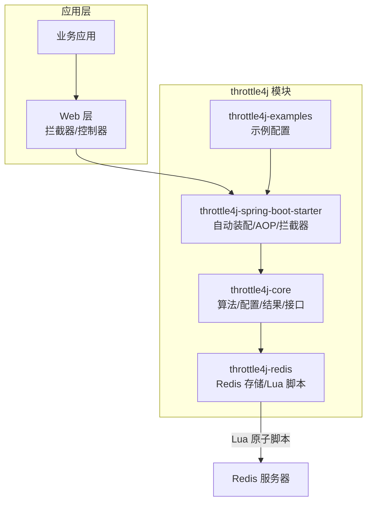
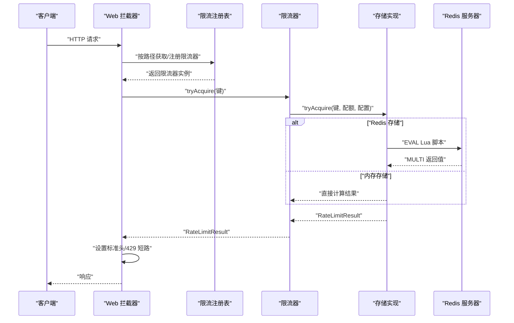
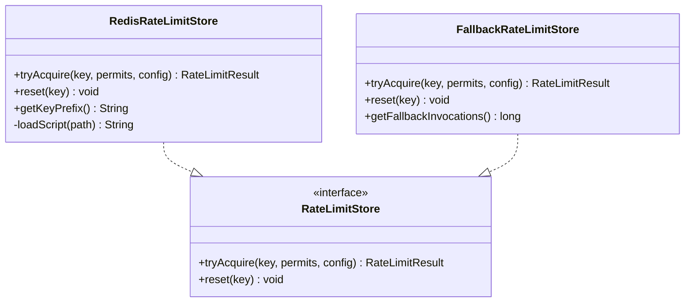
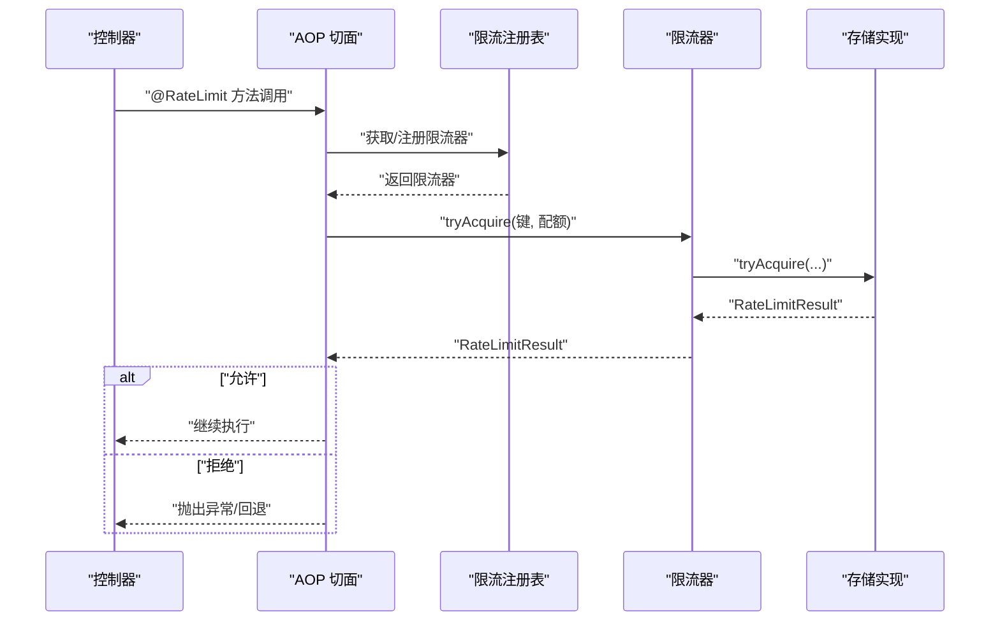
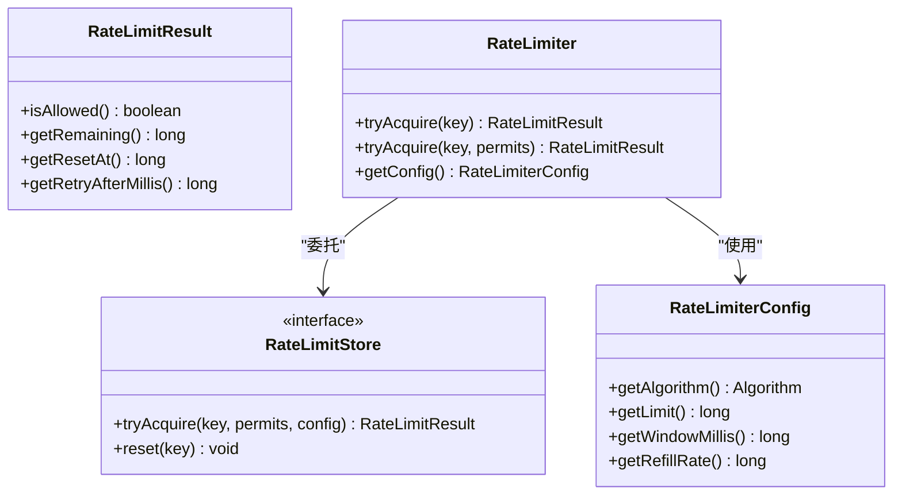
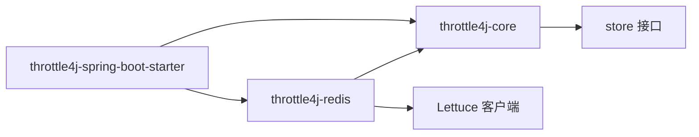
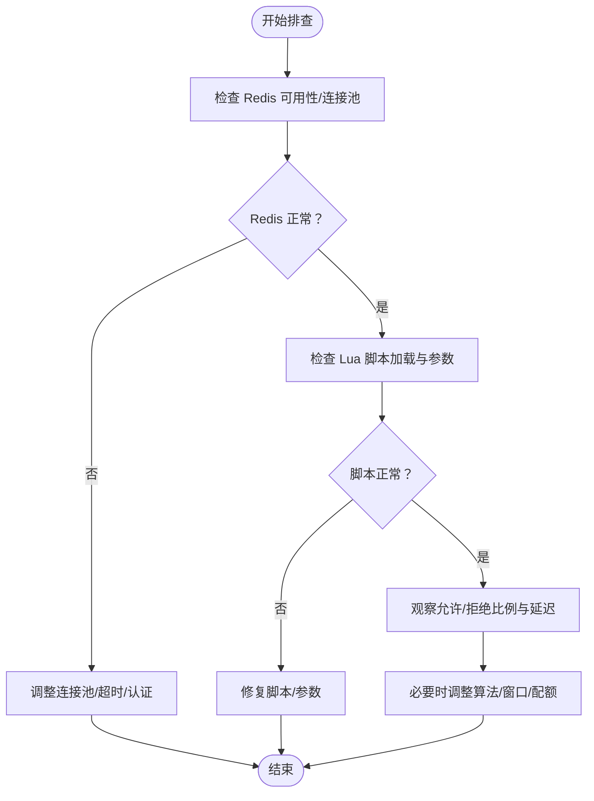

# 监控与告警

<cite>
**本文引用的文件**
- [README.md](file://README.md)
- [throttle4j-core/src/main/java/com/throttle4j/core/RateLimiter.java](file://throttle4j-core/src/main/java/com/throttle4j/core/RateLimiter.java)
- [throttle4j-core/src/main/java/com/throttle4j/core/RateLimiterConfig.java](file://throttle4j-core/src/main/java/com/throttle4j/core/RateLimiterConfig.java)
- [throttle4j-core/src/main/java/com/throttle4j/core/RateLimitResult.java](file://throttle4j-core/src/main/java/com/throttle4j/core/RateLimitResult.java)
- [throttle4j-core/src/main/java/com/throttle4j/store/RateLimitStore.java](file://throttle4j-core/src/main/java/com/throttle4j/store/RateLimitStore.java)
- [throttle4j-redis/src/main/java/com/throttle4j/redis/RedisRateLimitStore.java](file://throttle4j-redis/src/main/java/com/throttle4j/redis/RedisRateLimitStore.java)
- [throttle4j-redis/src/main/java/com/throttle4j/redis/FallbackRateLimitStore.java](file://throttle4j-redis/src/main/java/com/throttle4j/redis/FallbackRateLimitStore.java)
- [throttle4j-spring-boot-starter/src/main/java/com/throttle4j/spring/autoconfigure/Throttle4jAutoConfiguration.java](file://throttle4j-spring-boot-starter/src/main/java/com/throttle4j/spring/autoconfigure/Throttle4jAutoConfiguration.java)
- [throttle4j-spring-boot-starter/src/main/java/com/throttle4j/spring/aop/RateLimitAspect.java](file://throttle4j-spring-boot-starter/src/main/java/com/throttle4j/spring/aop/RateLimitAspect.java)
- [throttle4j-spring-boot-starter/src/main/java/com/throttle4j/spring/web/RateLimitInterceptor.java](file://throttle4j-spring-boot-starter/src/main/java/com/throttle4j/spring/web/RateLimitInterceptor.java)
- [throttle4j-examples/src/main/resources/application.yml](file://throttle4j-examples/src/main/resources/application.yml)
- [throttle4j-redis/src/test/java/com/throttle4j/redis/RedisRateLimitStoreTest.java](file://throttle4j-redis/src/test/java/com/throttle4j/redis/RedisRateLimitStoreTest.java)
</cite>

## 目录
1. 引言
2. 项目结构
3. 核心组件
4. 架构总览
5. 详细组件分析
6. 依赖关系分析
7. 性能考量
8. 故障排查指南
9. 结论
10. 附录

## 引言
本指南面向在分布式环境下部署 throttle4j 的工程团队，提供一套系统化的监控与告警实践，覆盖 Redis 连接状态、限流命中率与性能指标的观测与预警。文档同时给出关键指标定义与计算方式（如连接池使用率、命令执行延迟、错误率）、告警阈值与级别划分建议、日志与链路追踪配置思路、Prometheus 集成与 Grafana 仪表板参考、性能基准测试与容量规划方法，以及故障诊断与根因分析技巧。

## 项目结构
throttle4j 采用模块化设计：核心算法与存储抽象位于 core 模块；Redis 分布式存储与 Lua 脚本位于 redis 模块；Spring Boot 自动装配与注解拦截位于 spring-boot-starter 模块；examples 提供最小可运行示例。

图表来源
- [README.md:76-101](file://README.md#L76-L101)
- [throttle4j-spring-boot-starter/src/main/java/com/throttle4j/spring/autoconfigure/Throttle4jAutoConfiguration.java:27-131](file://throttle4j-spring-boot-starter/src/main/java/com/throttle4j/spring/autoconfigure/Throttle4jAutoConfiguration.java#L27-L131)
- [throttle4j-redis/src/main/java/com/throttle4j/redis/RedisRateLimitStore.java:40-78](file://throttle4j-redis/src/main/java/com/throttle4j/redis/RedisRateLimitStore.java#L40-L78)

章节来源
- [README.md:76-101](file://README.md#L76-L101)
- [throttle4j-examples/src/main/resources/application.yml:1-10](file://throttle4j-examples/src/main/resources/application.yml#L1-L10)

## 核心组件
- 核心接口与模型
  - RateLimiter：对外暴露 tryAcquire 接口，返回 RateLimitResult。
  - RateLimiterConfig：不可变配置，包含算法类型、配额、窗口、令牌桶补充速率等。
  - RateLimitResult：封装允许/拒绝、剩余配额、重置时间、建议重试间隔。
  - RateLimitStore：存储抽象，负责具体算法状态与原子操作。
- Redis 存储
  - RedisRateLimitStore：基于 Lettuce 同步命令接口，加载 Lua 脚本并在 Redis 上原子执行算法逻辑。
  - FallbackRateLimitStore：主存储失败时降级到本地存储，保障服务可用性。
- Spring 集成
  - Throttle4jAutoConfiguration：按属性选择存储实现（内存或 Redis），注册工厂与注册表、AOP 切面。
  - RateLimitAspect：拦截带 @RateLimit 注解的方法，执行限流判断与回退。
  - RateLimitInterceptor：全局 Web 拦截器，为路径生成键并注入标准头信息。

章节来源
- [throttle4j-core/src/main/java/com/throttle4j/core/RateLimiter.java:8-31](file://throttle4j-core/src/main/java/com/throttle4j/core/RateLimiter.java#L8-L31)
- [throttle4j-core/src/main/java/com/throttle4j/core/RateLimiterConfig.java:8-112](file://throttle4j-core/src/main/java/com/throttle4j/core/RateLimiterConfig.java#L8-L112)
- [throttle4j-core/src/main/java/com/throttle4j/core/RateLimitResult.java:6-67](file://throttle4j-core/src/main/java/com/throttle4j/core/RateLimitResult.java#L6-L67)
- [throttle4j-core/src/main/java/com/throttle4j/store/RateLimitStore.java:15-34](file://throttle4j-core/src/main/java/com/throttle4j/store/RateLimitStore.java#L15-L34)
- [throttle4j-redis/src/main/java/com/throttle4j/redis/RedisRateLimitStore.java:40-110](file://throttle4j-redis/src/main/java/com/throttle4j/redis/RedisRateLimitStore.java#L40-L110)
- [throttle4j-redis/src/main/java/com/throttle4j/redis/FallbackRateLimitStore.java:27-77](file://throttle4j-redis/src/main/java/com/throttle4j/redis/FallbackRateLimitStore.java#L27-L77)
- [throttle4j-spring-boot-starter/src/main/java/com/throttle4j/spring/autoconfigure/Throttle4jAutoConfiguration.java:45-130](file://throttle4j-spring-boot-starter/src/main/java/com/throttle4j/spring/autoconfigure/Throttle4jAutoConfiguration.java#L45-L130)
- [throttle4j-spring-boot-starter/src/main/java/com/throttle4j/spring/aop/RateLimitAspect.java:40-91](file://throttle4j-spring-boot-starter/src/main/java/com/throttle4j/spring/aop/RateLimitAspect.java#L40-L91)
- [throttle4j-spring-boot-starter/src/main/java/com/throttle4j/spring/web/RateLimitInterceptor.java:26-79](file://throttle4j-spring-boot-starter/src/main/java/com/throttle4j/spring/web/RateLimitInterceptor.java#L26-L79)

## 架构总览
下图展示从请求进入应用到限流决策、Redis 原子脚本执行与响应返回的关键交互。

图表来源
- [throttle4j-spring-boot-starter/src/main/java/com/throttle4j/spring/web/RateLimitInterceptor.java:55-79](file://throttle4j-spring-boot-starter/src/main/java/com/throttle4j/spring/web/RateLimitInterceptor.java#L55-L79)
- [throttle4j-core/src/main/java/com/throttle4j/core/RateLimiter.java:16-25](file://throttle4j-core/src/main/java/com/throttle4j/core/RateLimiter.java#L16-L25)
- [throttle4j-core/src/main/java/com/throttle4j/store/RateLimitStore.java:26-33](file://throttle4j-core/src/main/java/com/throttle4j/store/RateLimitStore.java#L26-L33)
- [throttle4j-redis/src/main/java/com/throttle4j/redis/RedisRateLimitStore.java:80-110](file://throttle4j-redis/src/main/java/com/throttle4j/redis/RedisRateLimitStore.java#L80-L110)

## 详细组件分析

### 组件一：Redis 存储与 Lua 原子脚本
- 设计要点
  - 使用 Lua 脚本在 Redis 侧原子执行算法逻辑，避免竞态与网络往返开销。
  - 支持固定窗口、滑动窗口（有序集合）与令牌桶（复用为漏桶）三种算法。
  - 关键字前缀统一，便于命名空间隔离与清理。
- 监控关注点
  - Lua 脚本加载与执行成功率。
  - Redis 命令耗时分布（P50/P95/P99）。
  - 连接池使用率与等待队列长度。
  - 主从复制延迟与只读副本命中情况。

图表来源
- [throttle4j-redis/src/main/java/com/throttle4j/redis/RedisRateLimitStore.java:40-110](file://throttle4j-redis/src/main/java/com/throttle4j/redis/RedisRateLimitStore.java#L40-L110)
- [throttle4j-redis/src/main/java/com/throttle4j/redis/FallbackRateLimitStore.java:27-77](file://throttle4j-redis/src/main/java/com/throttle4j/redis/FallbackRateLimitStore.java#L27-L77)
- [throttle4j-core/src/main/java/com/throttle4j/store/RateLimitStore.java:15-34](file://throttle4j-core/src/main/java/com/throttle4j/store/RateLimitStore.java#L15-L34)

章节来源
- [throttle4j-redis/src/main/java/com/throttle4j/redis/RedisRateLimitStore.java:40-110](file://throttle4j-redis/src/main/java/com/throttle4j/redis/RedisRateLimitStore.java#L40-L110)
- [throttle4j-redis/src/main/java/com/throttle4j/redis/RedisRateLimitStore.java:196-251](file://throttle4j-redis/src/main/java/com/throttle4j/redis/RedisRateLimitStore.java#L196-L251)
- [throttle4j-redis/src/main/java/com/throttle4j/redis/FallbackRateLimitStore.java:27-77](file://throttle4j-redis/src/main/java/com/throttle4j/redis/FallbackRateLimitStore.java#L27-L77)

### 组件二：Spring AOP 与 Web 拦截器
- 设计要点
  - AOP 切面拦截 @RateLimit 注解，动态构建配置并执行限流。
  - Web 拦截器按路径生成键，注入标准头并处理 429。
  - 自动装配根据配置选择存储实现（内存或 Redis），并支持降级。
- 监控关注点
  - 注解解析与表达式求值失败率。
  - 全局限流命中率与拒绝率。
  - 拦截器前置处理耗时与异常。

图表来源
- [throttle4j-spring-boot-starter/src/main/java/com/throttle4j/spring/aop/RateLimitAspect.java:68-91](file://throttle4j-spring-boot-starter/src/main/java/com/throttle4j/spring/aop/RateLimitAspect.java#L68-L91)
- [throttle4j-spring-boot-starter/src/main/java/com/throttle4j/spring/web/RateLimitInterceptor.java:55-79](file://throttle4j-spring-boot-starter/src/main/java/com/throttle4j/spring/web/RateLimitInterceptor.java#L55-L79)

章节来源
- [throttle4j-spring-boot-starter/src/main/java/com/throttle4j/spring/aop/RateLimitAspect.java:40-186](file://throttle4j-spring-boot-starter/src/main/java/com/throttle4j/spring/aop/RateLimitAspect.java#L40-L186)
- [throttle4j-spring-boot-starter/src/main/java/com/throttle4j/spring/web/RateLimitInterceptor.java:26-126](file://throttle4j-spring-boot-starter/src/main/java/com/throttle4j/spring/web/RateLimitInterceptor.java#L26-L126)
- [throttle4j-spring-boot-starter/src/main/java/com/throttle4j/spring/autoconfigure/Throttle4jAutoConfiguration.java:45-99](file://throttle4j-spring-boot-starter/src/main/java/com/throttle4j/spring/autoconfigure/Throttle4jAutoConfiguration.java#L45-L99)

### 组件三：核心数据模型与算法参数
- RateLimitResult：包含允许/拒绝、剩余配额、重置时间、重试间隔，用于下游控制与告警。
- RateLimiterConfig：包含算法、配额、窗口、补充速率等，决定限流策略与性能特征。
- 算法特性
  - 固定窗口：边界尖峰风险高，吞吐最高，内存占用最低。
  - 滑动窗口：平滑度高，吞吐高，内存中等。
  - 令牌桶：突发友好，吞吐高，内存低。
  - 漏桶：恒定出力，吞吐中等，内存低。

图表来源
- [throttle4j-core/src/main/java/com/throttle4j/core/RateLimitResult.java:6-67](file://throttle4j-core/src/main/java/com/throttle4j/core/RateLimitResult.java#L6-L67)
- [throttle4j-core/src/main/java/com/throttle4j/core/RateLimiterConfig.java:8-112](file://throttle4j-core/src/main/java/com/throttle4j/core/RateLimiterConfig.java#L8-L112)
- [throttle4j-core/src/main/java/com/throttle4j/core/RateLimiter.java:8-31](file://throttle4j-core/src/main/java/com/throttle4j/core/RateLimiter.java#L8-L31)
- [throttle4j-core/src/main/java/com/throttle4j/store/RateLimitStore.java:15-34](file://throttle4j-core/src/main/java/com/throttle4j/store/RateLimitStore.java#L15-L34)

章节来源
- [throttle4j-core/src/main/java/com/throttle4j/core/RateLimitResult.java:6-67](file://throttle4j-core/src/main/java/com/throttle4j/core/RateLimitResult.java#L6-L67)
- [throttle4j-core/src/main/java/com/throttle4j/core/RateLimiterConfig.java:8-112](file://throttle4j-core/src/main/java/com/throttle4j/core/RateLimiterConfig.java#L8-L112)
- [README.md:103-112](file://README.md#L103-L112)

## 依赖关系分析
- 模块耦合
  - core 无 Spring 依赖，仅依赖 store 接口，保持算法与存储解耦。
  - redis 模块通过反射尝试加载 Redis 实现，避免强依赖。
  - spring-boot-starter 通过条件化装配与属性驱动选择存储实现。
- 外部依赖
  - Lettuce 作为 Redis 客户端，负责同步命令与脚本执行。
  - SLF4J 日志门面，便于接入不同日志实现。

图表来源
- [throttle4j-spring-boot-starter/src/main/java/com/throttle4j/spring/autoconfigure/Throttle4jAutoConfiguration.java:45-99](file://throttle4j-spring-boot-starter/src/main/java/com/throttle4j/spring/autoconfigure/Throttle4jAutoConfiguration.java#L45-L99)
- [throttle4j-redis/src/main/java/com/throttle4j/redis/RedisRateLimitStore.java:51-78](file://throttle4j-redis/src/main/java/com/throttle4j/redis/RedisRateLimitStore.java#L51-L78)

章节来源
- [throttle4j-spring-boot-starter/src/main/java/com/throttle4j/spring/autoconfigure/Throttle4jAutoConfiguration.java:45-99](file://throttle4j-spring-boot-starter/src/main/java/com/throttle4j/spring/autoconfigure/Throttle4jAutoConfiguration.java#L45-L99)
- [throttle4j-redis/src/main/java/com/throttle4j/redis/RedisRateLimitStore.java:51-78](file://throttle4j-redis/src/main/java/com/throttle4j/redis/RedisRateLimitStore.java#L51-L78)

## 性能考量
- 算法选择
  - API 网关：优先令牌桶；滑动窗口强调公平性；漏桶强调恒定出力；固定窗口仅在简单场景使用。
- Redis 原子脚本
  - 单次 EVAL 命令完成状态更新与返回，减少 RTT 与竞态。
  - 建议开启 Lua 脚本缓存与连接池复用，降低 CPU 开销。
- 内存与序列化
  - 滑动窗口使用有序集合，注意键数量与过期策略。
  - 令牌桶使用哈希字段，注意字段数量与 TTL 管理。
- 连接池与超时
  - 合理设置连接池大小、空闲超时与命令超时，避免阻塞与堆积。
- 降级策略
  - 主存储失败时自动降级至本地存储，避免雪崩；需记录降级次数以便告警。

章节来源
- [README.md:103-112](file://README.md#L103-L112)
- [throttle4j-redis/src/main/java/com/throttle4j/redis/RedisRateLimitStore.java:196-251](file://throttle4j-redis/src/main/java/com/throttle4j/redis/RedisRateLimitStore.java#L196-L251)
- [throttle4j-redis/src/main/java/com/throttle4j/redis/FallbackRateLimitStore.java:27-77](file://throttle4j-redis/src/main/java/com/throttle4j/redis/FallbackRateLimitStore.java#L27-L77)

## 故障排查指南
- 常见问题定位
  - Redis 不可用：检查连接池、网络、认证与超时；观察降级次数与错误日志。
  - Lua 脚本异常：确认脚本加载成功且内容正确；核对参数个数与类型。
  - 键冲突或前缀不一致：核对 keyPrefix 与清理策略。
  - 拦截器异常：检查默认算法与窗口配置是否有效。
- 诊断步骤
  - 启用 DEBUG 日志，观察限流决策与重试间隔。
  - 对比允许/拒绝比例，识别异常波动。
  - 抓取 Redis 命令耗时分布，定位慢查询。
  - 核查 Spring Bean 生命周期与自动装配条件。

章节来源
- [throttle4j-redis/src/main/java/com/throttle4j/redis/RedisRateLimitStore.java:196-251](file://throttle4j-redis/src/main/java/com/throttle4j/redis/RedisRateLimitStore.java#L196-L251)
- [throttle4j-redis/src/test/java/com/throttle4j/redis/RedisRateLimitStoreTest.java:248-282](file://throttle4j-redis/src/test/java/com/throttle4j/redis/RedisRateLimitStoreTest.java#L248-L282)
- [throttle4j-spring-boot-starter/src/main/java/com/throttle4j/spring/web/RateLimitInterceptor.java:65-68](file://throttle4j-spring-boot-starter/src/main/java/com/throttle4j/spring/web/RateLimitInterceptor.java#L65-L68)

## 结论
通过将 Redis 原子脚本与 Spring 集成相结合，throttle4j 在分布式场景下提供了高性能、可观测的限流能力。结合本文提供的监控指标、告警阈值、日志与链路追踪配置、Prometheus/Grafana 集成思路、性能基准与容量规划方法，以及故障排查流程，可帮助团队建立稳定可靠的限流监控体系。

## 附录

### 关键监控指标与计算公式
- 连接池使用率
  - 计算：活跃连接数 / 最大连接数
  - 来源：Redis 客户端连接池指标（由底层客户端导出）
- 命令执行延迟
  - 计算：P50/P95/P99 延迟（毫秒）
  - 来源：Redis 客户端命令耗时直方图
- 错误率统计
  - 计算：限流相关异常/总请求数
  - 来源：应用日志与拦截器异常计数
- 限流命中率
  - 计算：被拒绝的请求数 / 总请求数
  - 来源：拦截器与切面的拒绝计数
- 降级触发次数
  - 计算：主存储异常导致的降级次数
  - 来源：降级存储的计数器

章节来源
- [throttle4j-redis/src/main/java/com/throttle4j/redis/FallbackRateLimitStore.java:74-76](file://throttle4j-redis/src/main/java/com/throttle4j/redis/FallbackRateLimitStore.java#L74-L76)
- [throttle4j-spring-boot-starter/src/main/java/com/throttle4j/spring/web/RateLimitInterceptor.java:65-68](file://throttle4j-spring-boot-starter/src/main/java/com/throttle4j/spring/web/RateLimitInterceptor.java#L65-L68)

### 告警阈值与级别划分
- 告警级别
  - 一级（严重）：Redis 连接池使用率 > 95%，命令 P99 延迟 > 阈值，错误率 > 阈值，降级次数显著上升
  - 二级（警告）：Redis 连接池使用率 > 85%，命令 P95 延迟 > 阈值，限流命中率 > 阈值
  - 三级（提醒）：命中率小幅上升、少量异常
- 阈值设定建议
  - 连接池使用率：85%/95%
  - 延迟：P95/P99 依据业务 SLA 设定
  - 错误率：单实例每分钟异常数阈值
  - 降级次数：连续 N 分钟内超过基准值

章节来源
- [throttle4j-redis/src/main/java/com/throttle4j/redis/FallbackRateLimitStore.java:48-56](file://throttle4j-redis/src/main/java/com/throttle4j/redis/FallbackRateLimitStore.java#L48-L56)

### 分布式日志与链路追踪
- 日志采集
  - 应用侧：输出限流键、结果、重试间隔与异常栈
  - Redis 侧：启用慢查询日志与命令统计
- 链路追踪
  - 在拦截器与切面埋点，记录限流决策耗时与键名
  - 将请求 ID 透传至下游服务，形成跨服务调用链

章节来源
- [throttle4j-spring-boot-starter/src/main/java/com/throttle4j/spring/aop/RateLimitAspect.java:86-90](file://throttle4j-spring-boot-starter/src/main/java/com/throttle4j/spring/aop/RateLimitAspect.java#L86-L90)
- [throttle4j-spring-boot-starter/src/main/java/com/throttle4j/spring/web/RateLimitInterceptor.java:70-76](file://throttle4j-spring-boot-starter/src/main/java/com/throttle4j/spring/web/RateLimitInterceptor.java#L70-L76)

### Prometheus 监控集成与 Grafana 仪表板
- 指标导出
  - Redis 客户端：连接池使用率、命令耗时直方图、错误计数
  - 应用：限流命中率、拒绝计数、降级次数、拦截器耗时
- 仪表板建议
  - 实时命中率曲线与阈值带
  - Redis 延迟分布与错误趋势
  - 降级次数与主存储可用性状态

章节来源
- [throttle4j-redis/src/main/java/com/throttle4j/redis/RedisRateLimitStore.java:196-251](file://throttle4j-redis/src/main/java/com/throttle4j/redis/RedisRateLimitStore.java#L196-L251)
- [throttle4j-redis/src/main/java/com/throttle4j/redis/FallbackRateLimitStore.java:74-76](file://throttle4j-redis/src/main/java/com/throttle4j/redis/FallbackRateLimitStore.java#L74-L76)

### 性能基准测试与容量规划
- 基准测试
  - 使用压测工具模拟不同算法与并发场景，测量延迟与吞吐
  - 对比内存与 Redis 存储在不同键空间下的表现
- 容量规划
  - 基于峰值 QPS 与窗口大小估算 Redis 内存占用
  - 评估连接池大小与超时参数，确保在峰值下仍有余量

章节来源
- [README.md:103-112](file://README.md#L103-L112)