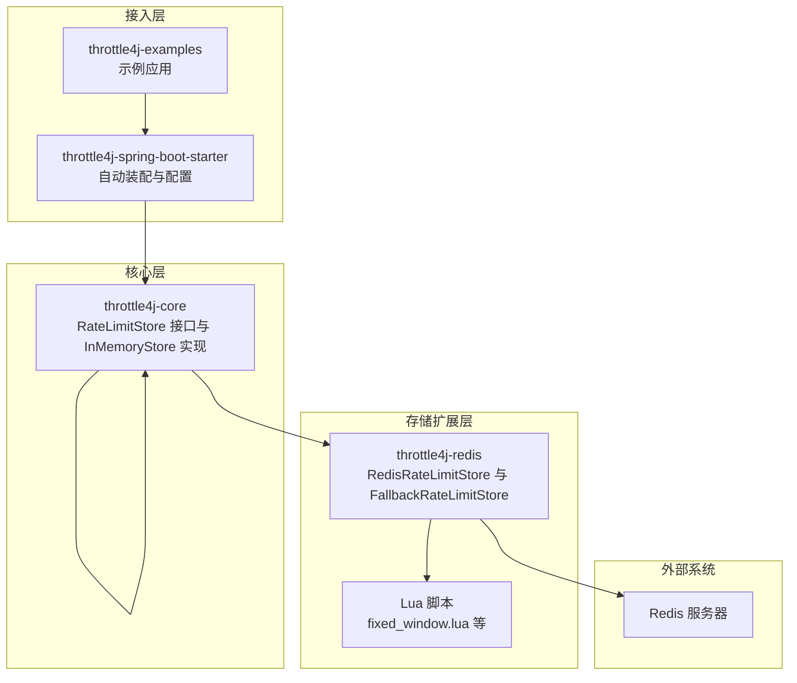
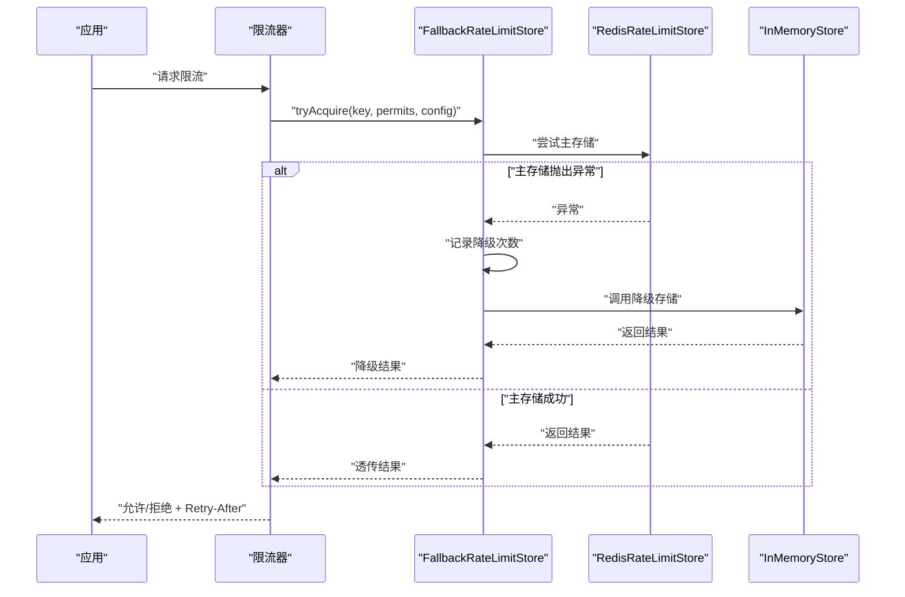
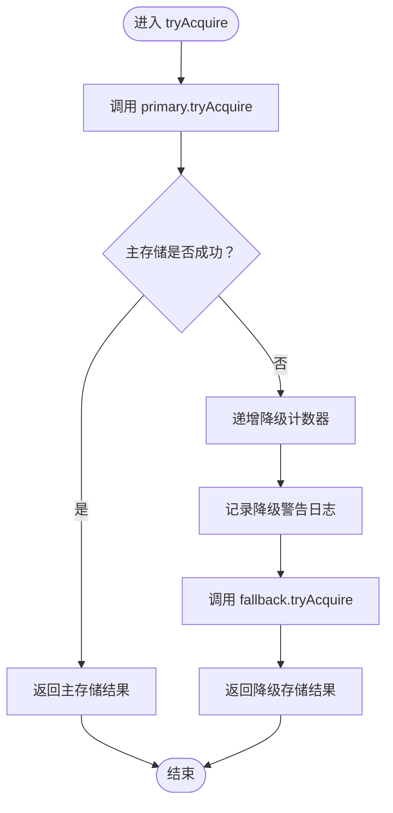
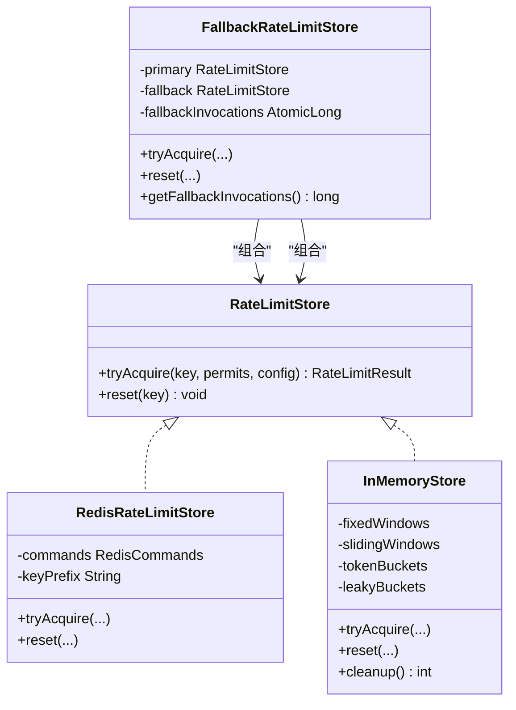

# 降级机制

<cite>
**本文引用的文件**
- [FallbackRateLimitStore.java](file://throttle4j-redis/src/main/java/com/throttle4j/redis/FallbackRateLimitStore.java)
- [RedisRateLimitStore.java](file://throttle4j-redis/src/main/java/com/throttle4j/redis/RedisRateLimitStore.java)
- [RedisRateLimitStoreBuilder.java](file://throttle4j-redis/src/main/java/com/throttle4j/redis/RedisRateLimitStoreBuilder.java)
- [InMemoryStore.java](file://throttle4j-core/src/main/java/com/throttle4j/store/InMemoryStore.java)
- [RateLimitStore.java](file://throttle4j-core/src/main/java/com/throttle4j/store/RateLimitStore.java)
- [Throttle4jAutoConfiguration.java](file://throttle4j-spring-boot-starter/src/main/java/com/throttle4j/spring/autoconfigure/Throttle4jAutoConfiguration.java)
- [Throttle4jProperties.java](file://throttle4j-spring-boot-starter/src/main/java/com/throttle4j/spring/autoconfigure/Throttle4jProperties.java)
- [application.yml](file://throttle4j-examples/src/main/resources/application.yml)
- [RateLimiterConfig.java](file://throttle4j-core/src/main/java/com/throttle4j/core/RateLimiterConfig.java)
- [RateLimitResult.java](file://throttle4j-core/src/main/java/com/throttle4j/core/RateLimitResult.java)
- [fixed_window.lua](file://throttle4j-redis/src/main/resources/scripts/fixed_window.lua)
- [README.md](file://README.md)
- [README_CN.md](file://README_CN.md)
- [FallbackRateLimitStoreTest.java](file://throttle4j-redis/src/test/java/com/throttle4j/redis/FallbackRateLimitStoreTest.java)
</cite>

## 目录
1. [引言](#引言)
2. [项目结构](#项目结构)
3. [核心组件](#核心组件)
4. [架构总览](#架构总览)
5. [组件详解](#组件详解)
6. [依赖关系分析](#依赖关系分析)
7. [性能考量](#性能考量)
8. [故障排查指南](#故障排查指南)
9. [结论](#结论)
10. [附录](#附录)

## 引言
本指南聚焦于降级机制的完整技术说明，围绕 FallbackRateLimitStore 的实现原理、触发条件、内存与 Redis 之间的切换逻辑、状态管理、配置参数、监控指标、降级期间的行为与一致性保障、性能影响以及应急预案与演练建议展开。目标是帮助读者在 Redis 不可用或异常时，仍能维持服务的稳定性与可预期的限流行为。

## 项目结构
该仓库采用多模块设计，降级能力主要由以下模块协作完成：
- throttle4j-core：定义限流核心接口与内存存储实现，提供统一的 RateLimitStore 抽象。
- throttle4j-redis：提供基于 Redis 的分布式存储实现，并封装降级代理。
- throttle4j-spring-boot-starter：提供自动装配与配置属性，支持按需启用 Redis 或内存存储。
- throttle4j-examples：示例应用，展示配置与使用方式。

图表来源
- [Throttle4jAutoConfiguration.java:34-57](file://throttle4j-spring-boot-starter/src/main/java/com/throttle4j/spring/autoconfigure/Throttle4jAutoConfiguration.java#L34-L57)
- [RedisRateLimitStore.java:40-78](file://throttle4j-redis/src/main/java/com/throttle4j/redis/RedisRateLimitStore.java#L40-L78)
- [InMemoryStore.java:24-66](file://throttle4j-core/src/main/java/com/throttle4j/store/InMemoryStore.java#L24-L66)
- [application.yml:4-9](file://throttle4j-examples/src/main/resources/application.yml#L4-L9)

章节来源
- [README.md:76-101](file://README.md#L76-L101)
- [README_CN.md:77-101](file://README_CN.md#L77-L101)

## 核心组件
- RateLimitStore 接口：定义 tryAcquire 与 reset 两个核心方法，作为所有存储实现的契约。
- RedisRateLimitStore：基于 Redis 与 Lua 脚本的分布式存储，负责原子化执行限流算法。
- InMemoryStore：单机内存存储，提供清理与过期淘汰能力，用于降级兜底。
- FallbackRateLimitStore：对 primary 与 fallback 两套存储进行透明代理，当 primary 抛出异常时自动切换至 fallback。
- 自动装配与配置：根据配置选择 storeType（MEMORY/REDIS），若 Redis 模块不可用则回退到 InMemoryStore。

章节来源
- [RateLimitStore.java:15-34](file://throttle4j-core/src/main/java/com/throttle4j/store/RateLimitStore.java#L15-L34)
- [RedisRateLimitStore.java:40-118](file://throttle4j-redis/src/main/java/com/throttle4j/redis/RedisRateLimitStore.java#L40-L118)
- [InMemoryStore.java:24-101](file://throttle4j-core/src/main/java/com/throttle4j/store/InMemoryStore.java#L24-L101)
- [FallbackRateLimitStore.java:27-76](file://throttle4j-redis/src/main/java/com/throttle4j/redis/FallbackRateLimitStore.java#L27-L76)
- [Throttle4jAutoConfiguration.java:45-57](file://throttle4j-spring-boot-starter/src/main/java/com/throttle4j/spring/autoconfigure/Throttle4jAutoConfiguration.java#L45-L57)

## 架构总览
降级机制的核心在于“主存储异常即刻切换到本地存储”，同时确保 reset 操作广播到两个存储，避免状态不一致。

图表来源
- [FallbackRateLimitStore.java:44-57](file://throttle4j-redis/src/main/java/com/throttle4j/redis/FallbackRateLimitStore.java#L44-L57)
- [RedisRateLimitStore.java:80-110](file://throttle4j-redis/src/main/java/com/throttle4j/redis/RedisRateLimitStore.java#L80-L110)
- [InMemoryStore.java:68-93](file://throttle4j-core/src/main/java/com/throttle4j/store/InMemoryStore.java#L68-L93)

## 组件详解

### FallbackRateLimitStore 实现原理与触发条件
- 触发条件：primary.tryAcquire 抛出任意异常即触发降级；日志记录异常信息与键名，便于定位。
- 切换逻辑：捕获异常后，递增降级计数器，并调用 fallback.tryAcquire 返回其结果。
- 状态管理：reset 操作分别对 primary 与 fallback 执行，任一失败均被吞掉并记录警告，确保两侧状态一致。
- 计数器：提供只读访问降级调用次数，用于监控与审计。

图表来源
- [FallbackRateLimitStore.java:44-71](file://throttle4j-redis/src/main/java/com/throttle4j/redis/FallbackRateLimitStore.java#L44-L71)

章节来源
- [FallbackRateLimitStore.java:27-76](file://throttle4j-redis/src/main/java/com/throttle4j/redis/FallbackRateLimitStore.java#L27-L76)
- [FallbackRateLimitStoreTest.java:53-92](file://throttle4j-redis/src/test/java/com/throttle4j/redis/FallbackRateLimitStoreTest.java#L53-L92)

### Redis 连接失败、超时与不可用的自动降级策略
- 连接失败/超时：RedisRateLimitStore 在执行 Lua 脚本时可能因网络或连接问题抛出异常，FallbackRateLimitStore 捕获后立即切换到 InMemoryStore。
- 不可用：Redis 服务端不可达或脚本加载失败等情形同样触发降级。
- 行为特征：降级期间为“节点级”限流，不同节点间不共享状态，但同一节点内的限流行为与主存储一致。

章节来源
- [RedisRateLimitStore.java:196-203](file://throttle4j-redis/src/main/java/com/throttle4j/redis/RedisRateLimitStore.java#L196-L203)
- [RedisRateLimitStore.java:226-251](file://throttle4j-redis/src/main/java/com/throttle4j/redis/RedisRateLimitStore.java#L226-L251)
- [FallbackRateLimitStore.java:44-57](file://throttle4j-redis/src/main/java/com/throttle4j/redis/FallbackRateLimitStore.java#L44-L57)

### 内存降级与 Redis 降级之间的切换逻辑与状态管理
- 切换方向：Redis → 内存（单向）；reset 广播到两侧，避免状态漂移。
- 状态一致性：reset 对两侧分别执行，任一侧异常被吞掉并记录，确保不会因某侧失败导致整体失败。
- 清理与过期：InMemoryStore 提供空闲键清理与周期性回收，避免长期驻留造成内存压力。

章节来源
- [FallbackRateLimitStore.java:59-71](file://throttle4j-redis/src/main/java/com/throttle4j/redis/FallbackRateLimitStore.java#L59-L71)
- [InMemoryStore.java:95-120](file://throttle4j-core/src/main/java/com/throttle4j/store/InMemoryStore.java#L95-L120)
- [InMemoryStore.java:109-120](file://throttle4j-core/src/main/java/com/throttle4j/store/InMemoryStore.java#L109-L120)

### 降级配置参数与自动装配
- storeType：MEMORY 或 REDIS。当 REDIS 且 Redis 模块不可用时，自动回退到 InMemoryStore。
- Redis 连接参数：host、port、password、database、keyPrefix。
- 默认算法、限流参数：defaultAlgorithm、defaultLimit、defaultWindow、defaultRefillRate。
- 示例配置：示例应用中以 memory 为例，生产环境可按需改为 redis 并补充连接信息。

章节来源
- [Throttle4jAutoConfiguration.java:45-57](file://throttle4j-spring-boot-starter/src/main/java/com/throttle4j/spring/autoconfigure/Throttle4jAutoConfiguration.java#L45-L57)
- [Throttle4jProperties.java:27-34](file://throttle4j-spring-boot-starter/src/main/java/com/throttle4j/spring/autoconfigure/Throttle4jProperties.java#L27-L34)
- [Throttle4jProperties.java:153-200](file://throttle4j-spring-boot-starter/src/main/java/com/throttle4j/spring/autoconfigure/Throttle4jProperties.java#L153-L200)
- [application.yml:4-9](file://throttle4j-examples/src/main/resources/application.yml#L4-L9)

### 降级期间的限流行为与数据一致性
- 限流行为：降级期间使用 InMemoryStore，行为与对应算法一致，但仅限当前节点有效。
- 数据一致性：reset 广播到两侧存储，两侧各自清理键空间，避免状态不一致。
- 结果语义：RateLimitResult 包含 allowed、remaining、resetAt、retryAfterMillis，降级后仍可提供重试建议。

章节来源
- [RateLimitResult.java:6-40](file://throttle4j-core/src/main/java/com/throttle4j/core/RateLimitResult.java#L6-L40)
- [FallbackRateLimitStore.java:59-71](file://throttle4j-redis/src/main/java/com/throttle4j/redis/FallbackRateLimitStore.java#L59-L71)
- [InMemoryStore.java:95-101](file://throttle4j-core/src/main/java/com/throttle4j/store/InMemoryStore.java#L95-L101)

### 降级阈值、恢复条件与监控指标
- 阈值：框架层面未提供显式的“降级阈值”配置项；降级由异常触发，属于“异常即降级”的策略。
- 恢复条件：当 Redis 主存储恢复正常后，后续请求将自动回到主存储；无显式“恢复阈值”或定时器，依赖主存储可用性。
- 监控指标：
  - 降级调用次数：通过 FallbackRateLimitStore.getFallbackInvocations 获取。
  - 主存储异常日志：记录异常类型与键名，便于告警与追踪。
  - InMemoryStore 清理统计：cleanup 返回移除数量，可用于观察闲置键规模。

章节来源
- [FallbackRateLimitStore.java:72-76](file://throttle4j-redis/src/main/java/com/throttle4j/redis/FallbackRateLimitStore.java#L72-L76)
- [InMemoryStore.java:109-120](file://throttle4j-core/src/main/java/com/throttle4j/store/InMemoryStore.java#L109-L120)
- [FallbackRateLimitStoreTest.java:78-92](file://throttle4j-redis/src/test/java/com/throttle4j/redis/FallbackRateLimitStoreTest.java#L78-L92)

### 性能影响分析
- 降级带来的影响：
  - 跨节点不共享状态：不同实例的限流窗口相互独立，可能出现跨节点的总量超出预期。
  - 内存占用：InMemoryStore 会随活跃键增长而占用堆内存，需结合清理策略与容量规划。
  - 算法精度：降级期间为单机近似，与分布式 Redis 精度存在差异。
- 性能优化建议：
  - 合理设置 InMemoryStore 的 idleMillis 与 cleanupInterval，避免过多闲置键。
  - 选择合适的算法与窗口参数，平衡精度与吞吐。
  - 在 Redis 正常时尽量使用分布式存储，以获得全局一致性。

章节来源
- [InMemoryStore.java:28-31](file://throttle4j-core/src/main/java/com/throttle4j/store/InMemoryStore.java#L28-L31)
- [InMemoryStore.java:42-66](file://throttle4j-core/src/main/java/com/throttle4j/store/InMemoryStore.java#L42-L66)

### 故障演练与应急预案
- 演练步骤：
  - 模拟 Redis 不可用：停掉 Redis 或断开网络，验证请求是否降级到 InMemoryStore。
  - 观察日志：确认降级警告日志出现，检查键名与异常类型。
  - 验证限流行为：在降级期间重复请求，确认 remaining、resetAt、retryAfterMillis 合理。
  - 验证 reset：调用 reset 后，两侧存储状态应一致。
- 应急预案：
  - 快速恢复：修复 Redis 连接后，自动恢复主存储；如需强制回切，重启应用或调整 storeType。
  - 容量与告警：为降级调用次数、Redis 异常日志建立告警；关注 InMemoryStore 的清理频率与键规模。

章节来源
- [FallbackRateLimitStoreTest.java:66-114](file://throttle4j-redis/src/test/java/com/throttle4j/redis/FallbackRateLimitStoreTest.java#L66-L114)
- [README.md:20-22](file://README.md#L20-L22)

## 依赖关系分析
- FallbackRateLimitStore 依赖 RateLimitStore 接口，组合 primary 与 fallback 两个具体实现。
- RedisRateLimitStore 依赖 Lettuce RedisCommands 与 Lua 脚本，负责原子化执行算法。
- InMemoryStore 为单机内存实现，提供清理与过期淘汰。
- 自动装配根据 storeType 选择存储实现，若 Redis 模块不可用则回退到 InMemoryStore。

图表来源
- [RateLimitStore.java:15-34](file://throttle4j-core/src/main/java/com/throttle4j/store/RateLimitStore.java#L15-L34)
- [RedisRateLimitStore.java:40-118](file://throttle4j-redis/src/main/java/com/throttle4j/redis/RedisRateLimitStore.java#L40-L118)
- [InMemoryStore.java:24-101](file://throttle4j-core/src/main/java/com/throttle4j/store/InMemoryStore.java#L24-L101)
- [FallbackRateLimitStore.java:27-76](file://throttle4j-redis/src/main/java/com/throttle4j/redis/FallbackRateLimitStore.java#L27-L76)

章节来源
- [Throttle4jAutoConfiguration.java:45-57](file://throttle4j-spring-boot-starter/src/main/java/com/throttle4j/spring/autoconfigure/Throttle4jAutoConfiguration.java#L45-L57)

## 性能考量
- 降级期间的吞吐与延迟：由于 InMemoryStore 为单机实现，跨节点不共享状态，可能在高并发下出现局部过载风险。
- 内存与 CPU：InMemoryStore 使用并发容器与同步块，算法实现为纯内存计算，CPU 开销较低，但需关注内存占用。
- Redis 正常时的优势：分布式一致性与跨节点共享状态，适合高并发与全局限流场景。

章节来源
- [InMemoryStore.java:148-263](file://throttle4j-core/src/main/java/com/throttle4j/store/InMemoryStore.java#L148-L263)
- [RedisRateLimitStore.java:120-191](file://throttle4j-redis/src/main/java/com/throttle4j/redis/RedisRateLimitStore.java#L120-L191)

## 故障排查指南
- 常见问题与定位：
  - Redis 连接异常：检查 host/port/password/database/keyPrefix 配置；确认网络连通性。
  - Lua 脚本加载失败：确认脚本资源存在且可读；查看加载日志。
  - 降级频繁：检查降级调用次数与异常日志；评估 Redis 性能与网络抖动。
- 关键日志与指标：
  - 降级警告日志：包含键名与异常描述。
  - 降级计数器：用于趋势分析与告警。
  - InMemoryStore 清理统计：观察闲置键规模变化。

章节来源
- [FallbackRateLimitStore.java:44-57](file://throttle4j-redis/src/main/java/com/throttle4j/redis/FallbackRateLimitStore.java#L44-L57)
- [RedisRateLimitStore.java:226-251](file://throttle4j-redis/src/main/java/com/throttle4j/redis/RedisRateLimitStore.java#L226-L251)
- [InMemoryStore.java:109-120](file://throttle4j-core/src/main/java/com/throttle4j/store/InMemoryStore.java#L109-L120)

## 结论
FallbackRateLimitStore 提供了“异常即降级”的稳健策略，在 Redis 不可用时自动切换到 InMemoryStore，确保服务持续可用。通过 reset 广播与计数器监控，系统在降级期间仍具备可观测性与一致性保障。生产部署中建议结合 Redis 性能与网络状况，合理配置算法与窗口参数，并建立完善的告警与演练机制。

## 附录

### 配置清单与含义
- throttle4j.store-type：选择存储类型（MEMORY/REDIS）
- throttle4j.redis.host/port/password/database/keyPrefix：Redis 连接与命名空间
- throttle4j.default-algorithm/default-limit/default-window/default-refill-rate：全局默认限流参数
- 示例：示例应用以 memory 为例，生产环境可切换为 redis 并补齐连接参数

章节来源
- [Throttle4jProperties.java:27-34](file://throttle4j-spring-boot-starter/src/main/java/com/throttle4j/spring/autoconfigure/Throttle4jProperties.java#L27-L34)
- [Throttle4jProperties.java:153-200](file://throttle4j-spring-boot-starter/src/main/java/com/throttle4j/spring/autoconfigure/Throttle4jProperties.java#L153-L200)
- [application.yml:4-9](file://throttle4j-examples/src/main/resources/application.yml#L4-L9)

### 算法与脚本要点
- RedisRateLimitStore 支持固定窗口、滑动窗口、令牌桶、漏桶；算法逻辑由 Lua 脚本原子执行。
- fixed_window.lua：演示了 GET/PTTL/SET/INCRBY 的原子化计数与 TTL 管理。

章节来源
- [RedisRateLimitStore.java:80-118](file://throttle4j-redis/src/main/java/com/throttle4j/redis/RedisRateLimitStore.java#L80-L118)
- [fixed_window.lua:1-46](file://throttle4j-redis/src/main/resources/scripts/fixed_window.lua#L1-L46)