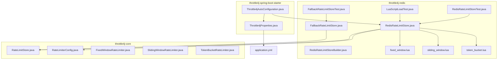
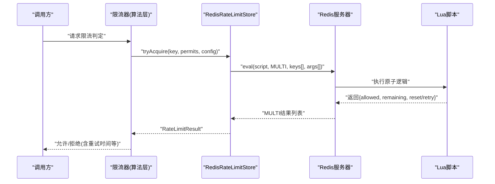
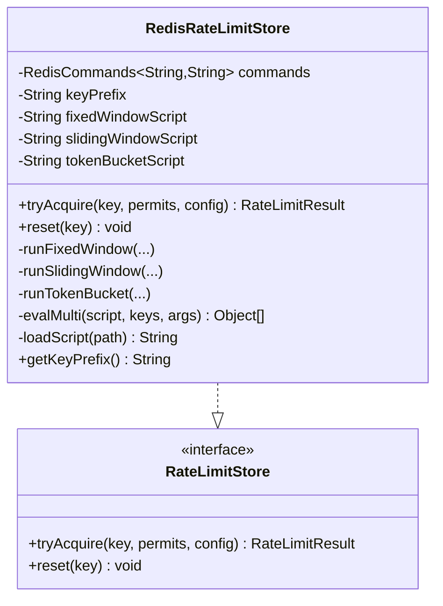
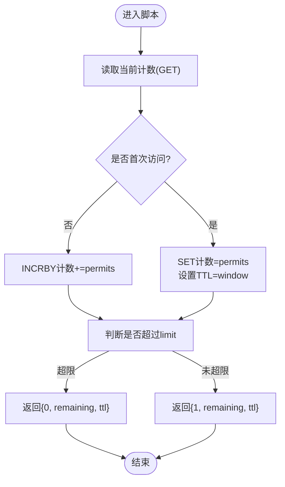
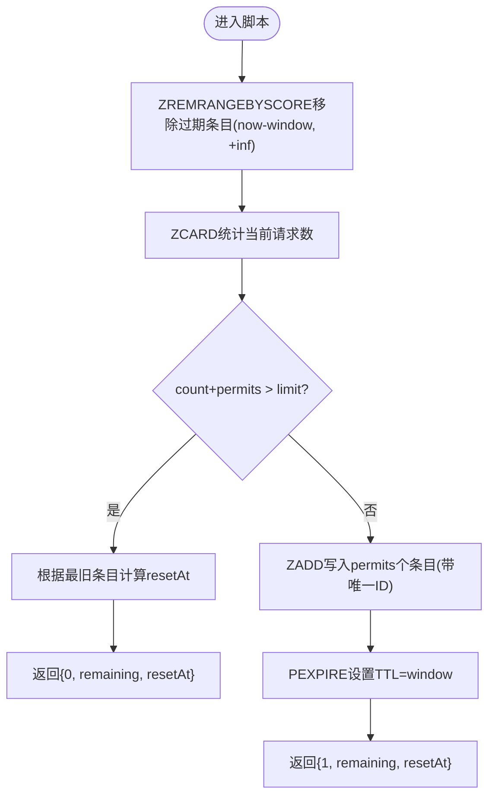
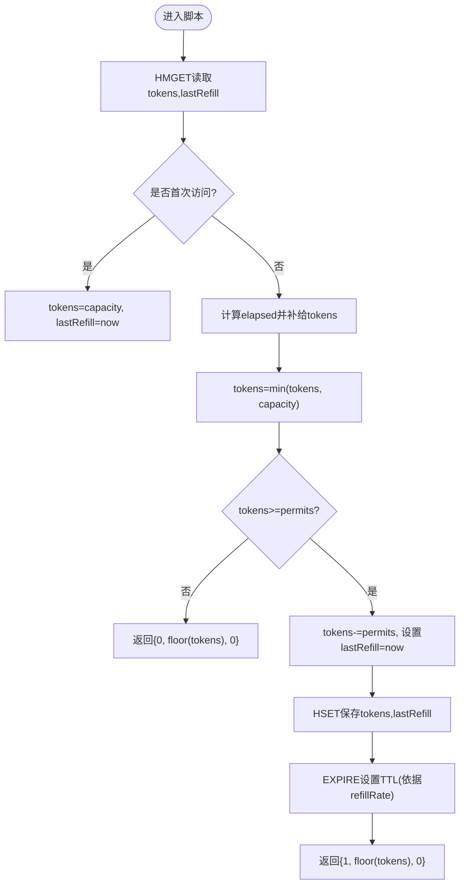
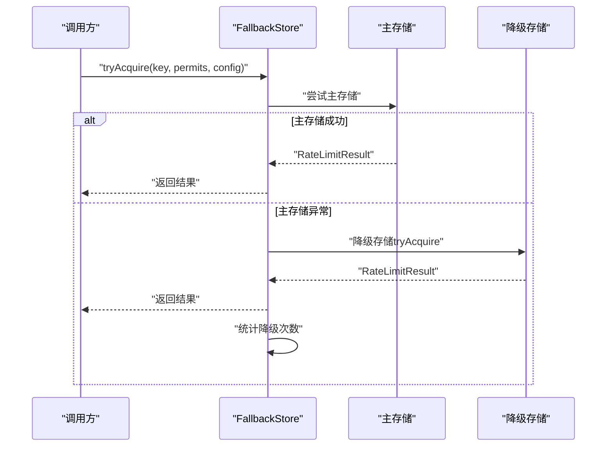
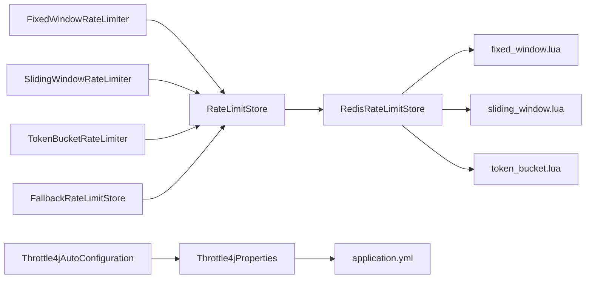

# Redis存储实现

<cite>
**本文引用的文件**
- [RedisRateLimitStore.java](file://throttle4j-redis/src/main/java/com/throttle4j/redis/RedisRateLimitStore.java)
- [RedisRateLimitStoreBuilder.java](file://throttle4j-redis/src/main/java/com/throttle4j/redis/RedisRateLimitStoreBuilder.java)
- [FallbackRateLimitStore.java](file://throttle4j-redis/src/main/java/com/throttle4j/redis/FallbackRateLimitStore.java)
- [fixed_window.lua](file://throttle4j-redis/src/main/resources/scripts/fixed_window.lua)
- [sliding_window.lua](file://throttle4j-redis/src/main/resources/scripts/sliding_window.lua)
- [token_bucket.lua](file://throttle4j-redis/src/main/resources/scripts/token_bucket.lua)
- [RedisRateLimitStoreTest.java](file://throttle4j-redis/src/test/java/com/throttle4j/redis/RedisRateLimitStoreTest.java)
- [LuaScriptLoadTest.java](file://throttle4j-redis/src/test/java/com/throttle4j/redis/LuaScriptLoadTest.java)
- [FallbackRateLimitStoreTest.java](file://throttle4j-redis/src/test/java/com/throttle4j/redis/FallbackRateLimitStoreTest.java)
- [RateLimitStore.java](file://throttle4j-core/src/main/java/com/throttle4j/store/RateLimitStore.java)
- [RateLimiterConfig.java](file://throttle4j-core/src/main/java/com/throttle4j/core/RateLimiterConfig.java)
- [Throttle4jAutoConfiguration.java](file://throttle4j-spring-boot-starter/src/main/java/com/throttle4j/spring/autoconfigure/Throttle4jAutoConfiguration.java)
- [Throttle4jProperties.java](file://throttle4j-spring-boot-starter/src/main/java/com/throttle4j/spring/autoconfigure/Throttle4jProperties.java)
- [application.yml](file://throttle4j-examples/src/main/resources/application.yml)
- [FixedWindowRateLimiter.java](file://throttle4j-core/src/main/java/com/throttle4j/algorithm/FixedWindowRateLimiter.java)
- [SlidingWindowRateLimiter.java](file://throttle4j-core/src/main/java/com/throttle4j/algorithm/SlidingWindowRateLimiter.java)
- [TokenBucketRateLimiter.java](file://throttle4j-core/src/main/java/com/throttle4j/algorithm/TokenBucketRateLimiter.java)
</cite>

## 目录
1. [简介](#简介)
2. [项目结构](#项目结构)
3. [核心组件](#核心组件)
4. [架构总览](#架构总览)
5. [详细组件分析](#详细组件分析)
6. [依赖关系分析](#依赖关系分析)
7. [性能与扩展性](#性能与扩展性)
8. [故障处理与恢复](#故障处理与恢复)
9. [Redis配置指南](#redis配置指南)
10. [最佳实践与优化建议](#最佳实践与优化建议)
11. [结论](#结论)

## 简介
本文件面向Redis存储实现，系统性阐述RedisRateLimitStore的架构设计与实现原理，覆盖以下主题：
- Redis连接管理、命令执行与结果处理
- Lua脚本在固定窗口、滑动窗口与令牌桶中的使用
- 原子性保证与分布式一致性策略
- Redis配置（连接参数、超时、集群）
- 性能特征、扩展性与监控指标
- 故障处理、网络异常恢复与数据持久化考量
- 最佳实践与性能优化建议

## 项目结构
throttle4j的Redis存储位于throttle4j-redis模块，核心类与资源如下：
- 存储实现：RedisRateLimitStore
- 构建器：RedisRateLimitStoreBuilder
- 降级存储：FallbackRateLimitStore
- Lua脚本：fixed_window.lua、sliding_window.lua、token_bucket.lua
- 单元测试：RedisRateLimitStoreTest、LuaScriptLoadTest、FallbackRateLimitStoreTest
- 核心接口与配置：RateLimitStore、RateLimiterConfig
- Spring Boot自动装配：Throttle4jAutoConfiguration、Throttle4jProperties
- 示例配置：application.yml

**图表来源**
- [RedisRateLimitStore.java:1-258](file://throttle4j-redis/src/main/java/com/throttle4j/redis/RedisRateLimitStore.java#L1-L258)
- [RedisRateLimitStoreBuilder.java:1-61](file://throttle4j-redis/src/main/java/com/throttle4j/redis/RedisRateLimitStoreBuilder.java#L1-L61)
- [FallbackRateLimitStore.java:1-78](file://throttle4j-redis/src/main/java/com/throttle4j/redis/FallbackRateLimitStore.java#L1-L78)
- [fixed_window.lua:1-46](file://throttle4j-redis/src/main/resources/scripts/fixed_window.lua#L1-L46)
- [sliding_window.lua:1-49](file://throttle4j-redis/src/main/resources/scripts/sliding_window.lua#L1-L49)
- [token_bucket.lua:1-58](file://throttle4j-redis/src/main/resources/scripts/token_bucket.lua#L1-L58)
- [RateLimitStore.java:1-35](file://throttle4j-core/src/main/java/com/throttle4j/store/RateLimitStore.java#L1-L35)
- [RateLimiterConfig.java:1-113](file://throttle4j-core/src/main/java/com/throttle4j/core/RateLimiterConfig.java#L1-L113)
- [Throttle4jAutoConfiguration.java:1-132](file://throttle4j-spring-boot-starter/src/main/java/com/throttle4j/spring/autoconfigure/Throttle4jAutoConfiguration.java#L1-L132)
- [Throttle4jProperties.java:1-202](file://throttle4j-spring-boot-starter/src/main/java/com/throttle4j/spring/autoconfigure/Throttle4jProperties.java#L1-L202)
- [application.yml:1-10](file://throttle4j-examples/src/main/resources/application.yml#L1-L10)

**章节来源**
- [RedisRateLimitStore.java:1-258](file://throttle4j-redis/src/main/java/com/throttle4j/redis/RedisRateLimitStore.java#L1-L258)
- [Throttle4jAutoConfiguration.java:1-132](file://throttle4j-spring-boot-starter/src/main/java/com/throttle4j/spring/autoconfigure/Throttle4jAutoConfiguration.java#L1-L132)
- [Throttle4jProperties.java:1-202](file://throttle4j-spring-boot-starter/src/main/java/com/throttle4j/spring/autoconfigure/Throttle4jProperties.java#L1-L202)
- [application.yml:1-10](file://throttle4j-examples/src/main/resources/application.yml#L1-L10)

## 核心组件
- RedisRateLimitStore：基于Redis的分布式限流存储，通过Lettuce同步命令接口执行Lua脚本，确保每种算法的原子性。
- RedisRateLimitStoreBuilder：构建器，支持自定义key前缀与命令接口。
- FallbackRateLimitStore：主存储失败时的降级存储（如内存），保障服务可用性。
- Lua脚本：三种算法的原子实现，分别对应固定窗口、滑动窗口与令牌桶。

关键职责与约束：
- 线程安全：基于线程安全的Lettuce连接，默认可共享实例。
- 原子性：所有算法逻辑在Redis侧以Lua脚本执行，避免竞态。
- 错误处理：对脚本返回类型进行校验，缺失脚本或空内容抛出明确异常。

**章节来源**
- [RedisRateLimitStore.java:22-39](file://throttle4j-redis/src/main/java/com/throttle4j/redis/RedisRateLimitStore.java#L22-L39)
- [RedisRateLimitStore.java:80-110](file://throttle4j-redis/src/main/java/com/throttle4j/redis/RedisRateLimitStore.java#L80-L110)
- [RedisRateLimitStore.java:195-203](file://throttle4j-redis/src/main/java/com/throttle4j/redis/RedisRateLimitStore.java#L195-L203)
- [RedisRateLimitStore.java:226-251](file://throttle4j-redis/src/main/java/com/throttle4j/redis/RedisRateLimitStore.java#L226-L251)
- [RateLimitStore.java:6-14](file://throttle4j-core/src/main/java/com/throttle4j/store/RateLimitStore.java#L6-L14)

## 架构总览
Redis存储的整体交互流程如下：

**图表来源**
- [RedisRateLimitStore.java:80-110](file://throttle4j-redis/src/main/java/com/throttle4j/redis/RedisRateLimitStore.java#L80-L110)
- [RedisRateLimitStore.java:195-203](file://throttle4j-redis/src/main/java/com/throttle4j/redis/RedisRateLimitStore.java#L195-L203)
- [fixed_window.lua:1-46](file://throttle4j-redis/src/main/resources/scripts/fixed_window.lua#L1-L46)
- [sliding_window.lua:1-49](file://throttle4j-redis/src/main/resources/scripts/sliding_window.lua#L1-L49)
- [token_bucket.lua:1-58](file://throttle4j-redis/src/main/resources/scripts/token_bucket.lua#L1-L58)

## 详细组件分析

### RedisRateLimitStore：连接、命令与结果处理
- 连接管理
  - 使用Lettuce的RedisCommands<String,String>作为同步命令接口，线程安全默认可用。
  - 构造时加载三份Lua脚本到内存，避免运行时IO开销。
- 命令执行
  - 通过commands.eval执行Lua脚本，返回类型为MULTI，内部统一解析为List<Object>。
  - 对返回值进行健壮性检查，非List即抛出异常，防止下游处理错误。
- 结果处理
  - 固定窗口：返回{allowed, remaining, ttl}；ttl用于计算resetAt。
  - 滑动窗口：返回{allowed, remaining, resetAt}；根据最旧条目计算resetAt。
  - 令牌桶：返回{allowed, remaining, 0}；remaining向下取整。
- 键空间与前缀
  - 所有键均带前缀，默认“throttle4j:”，可通过构造函数或构建器自定义。

**图表来源**
- [RedisRateLimitStore.java:40-258](file://throttle4j-redis/src/main/java/com/throttle4j/redis/RedisRateLimitStore.java#L40-L258)
- [RateLimitStore.java:15-35](file://throttle4j-core/src/main/java/com/throttle4j/store/RateLimitStore.java#L15-L35)

**章节来源**
- [RedisRateLimitStore.java:51-78](file://throttle4j-redis/src/main/java/com/throttle4j/redis/RedisRateLimitStore.java#L51-L78)
- [RedisRateLimitStore.java:195-203](file://throttle4j-redis/src/main/java/com/throttle4j/redis/RedisRateLimitStore.java#L195-L203)
- [RedisRateLimitStore.java:226-251](file://throttle4j-redis/src/main/java/com/throttle4j/redis/RedisRateLimitStore.java#L226-L251)

### Lua脚本实现要点

#### 固定窗口（fixed_window.lua）
- 数据结构：字符串计数+过期时间
- 关键操作：GET/PTTL/SET(INIT)+INCRBY/EXPIRE
- 原子性：单KEY下INCRBY与TTL读取在同一事务内完成
- 返回：{allowed, remaining, ttl}

**图表来源**
- [fixed_window.lua:11-46](file://throttle4j-redis/src/main/resources/scripts/fixed_window.lua#L11-L46)

**章节来源**
- [fixed_window.lua:1-46](file://throttle4j-redis/src/main/resources/scripts/fixed_window.lua#L1-L46)

#### 滑动窗口（sliding_window.lua）
- 数据结构：有序集合（zset），score为时间戳，member为“唯一ID:序号”
- 关键操作：ZREMRANGEBYSCORE清理过期条目、ZADD写入新条目、PEXPIRE设置窗口过期
- 原子性：同一事务内清理+计数+写入
- 返回：{allowed, remaining, resetAt}

**图表来源**
- [sliding_window.lua:13-49](file://throttle4j-redis/src/main/resources/scripts/sliding_window.lua#L13-L49)

**章节来源**
- [sliding_window.lua:1-49](file://throttle4j-redis/src/main/resources/scripts/sliding_window.lua#L1-L49)

#### 令牌桶（token_bucket.lua）
- 数据结构：哈希表（HSET/HMGET）保存tokens与lastRefill
- 关键操作：按时间线性补给tokens，消费后更新状态与TTL
- TTL策略：当refillRate>0时，TTL约为两倍容量/速率，确保完整补给周期
- 返回：{allowed, floor(tokens), 0}

**图表来源**
- [token_bucket.lua:11-58](file://throttle4j-redis/src/main/resources/scripts/token_bucket.lua#L11-L58)

**章节来源**
- [token_bucket.lua:1-58](file://throttle4j-redis/src/main/resources/scripts/token_bucket.lua#L1-L58)

### FallbackRateLimitStore：降级与广播重置
- 行为：主存储异常时切换到降级存储（如内存），记录降级次数。
- 广播重置：对主/备存储分别尝试reset，吞掉各自异常，确保状态一致。
- 线程安全：遵循底层store的线程安全约定。

**图表来源**
- [FallbackRateLimitStore.java:27-78](file://throttle4j-redis/src/main/java/com/throttle4j/redis/FallbackRateLimitStore.java#L27-L78)

**章节来源**
- [FallbackRateLimitStore.java:27-78](file://throttle4j-redis/src/main/java/com/throttle4j/redis/FallbackRateLimitStore.java#L27-L78)
- [FallbackRateLimitStoreTest.java:66-92](file://throttle4j-redis/src/test/java/com/throttle4j/redis/FallbackRateLimitStoreTest.java#L66-L92)

### 算法层与配置
- RateLimiterConfig：封装算法、limit、windowMillis、refillRate等配置项。
- 算法类：FixedWindowRateLimiter、SlidingWindowRateLimiter、TokenBucketRateLimiter均委托到存储层。
- 配置校验：对TOKEN_BUCKET要求refillRate>0，否则抛出异常。

**章节来源**
- [RateLimiterConfig.java:55-111](file://throttle4j-core/src/main/java/com/throttle4j/core/RateLimiterConfig.java#L55-L111)
- [FixedWindowRateLimiter.java:1-18](file://throttle4j-core/src/main/java/com/throttle4j/algorithm/FixedWindowRateLimiter.java#L1-L18)
- [SlidingWindowRateLimiter.java:1-16](file://throttle4j-core/src/main/java/com/throttle4j/algorithm/SlidingWindowRateLimiter.java#L1-L16)
- [TokenBucketRateLimiter.java:1-16](file://throttle4j-core/src/main/java/com/throttle4j/algorithm/TokenBucketRateLimiter.java#L1-L16)

## 依赖关系分析
- 组件耦合
  - RedisRateLimitStore依赖Lettuce RedisCommands与Lua脚本资源。
  - FallbackRateLimitStore依赖两个RateLimitStore实例。
  - 算法层仅依赖RateLimitStore接口，解耦具体实现。
- 外部依赖
  - Lettuce（Redis客户端）
  - Spring Boot自动装配（可选）

**图表来源**
- [FixedWindowRateLimiter.java:1-18](file://throttle4j-core/src/main/java/com/throttle4j/algorithm/FixedWindowRateLimiter.java#L1-L18)
- [SlidingWindowRateLimiter.java:1-16](file://throttle4j-core/src/main/java/com/throttle4j/algorithm/SlidingWindowRateLimiter.java#L1-L16)
- [TokenBucketRateLimiter.java:1-16](file://throttle4j-core/src/main/java/com/throttle4j/algorithm/TokenBucketRateLimiter.java#L1-L16)
- [RateLimitStore.java:15-35](file://throttle4j-core/src/main/java/com/throttle4j/store/RateLimitStore.java#L15-L35)
- [RedisRateLimitStore.java:40-258](file://throttle4j-redis/src/main/java/com/throttle4j/redis/RedisRateLimitStore.java#L40-L258)
- [Throttle4jAutoConfiguration.java:34-99](file://throttle4j-spring-boot-starter/src/main/java/com/throttle4j/spring/autoconfigure/Throttle4jAutoConfiguration.java#L34-L99)
- [Throttle4jProperties.java:153-200](file://throttle4j-spring-boot-starter/src/main/java/com/throttle4j/spring/autoconfigure/Throttle4jProperties.java#L153-L200)
- [application.yml:4-9](file://throttle4j-examples/src/main/resources/application.yml#L4-L9)

**章节来源**
- [Throttle4jAutoConfiguration.java:34-99](file://throttle4j-spring-boot-starter/src/main/java/com/throttle4j/spring/autoconfigure/Throttle4jAutoConfiguration.java#L34-L99)
- [Throttle4jProperties.java:153-200](file://throttle4j-spring-boot-starter/src/main/java/com/throttle4j/spring/autoconfigure/Throttle4jProperties.java#L153-L200)

## 性能与扩展性
- 原子性与低延迟
  - Lua脚本在Redis侧执行，避免往返RTT与竞态，单次请求O(1)复杂度。
  - 固定窗口与令牌桶脚本最小化命令数量，滑动窗口使用有序集合批量清理。
- 内存占用
  - 固定窗口：每个key一个字符串+TTL。
  - 滑动窗口：每个key一个zset，成员数≈permits+窗口内请求数。
  - 令牌桶：每个key一个哈希+TTL，容量与速率决定峰值内存。
- 扩展性
  - 支持多节点共享同一Redis实例，天然水平扩展。
  - 可结合Redis集群/哨兵/集群模式提升可用性与吞吐。
- 监控指标建议
  - 请求数、通过数、拒绝数、平均响应时间、Redis命中率、Lua脚本执行耗时。
  - 滑动窗口中zset大小、令牌桶剩余tokens分布。

[本节为通用性能讨论，不直接分析具体文件]

## 故障处理与恢复
- 主存储异常
  - 使用FallbackRateLimitStore切换到降级存储，应用继续限流但可能仅本机生效。
  - 统计降级次数，便于告警与运维观察。
- 网络异常
  - Lettuce连接池与超时配置需合理设置；发生异常时应快速失败并触发降级。
- 数据持久化
  - Redis持久化策略（RDB/AOF）影响重启后的状态恢复；令牌桶的lastRefill与tokens需要在持久化后仍保持一致性。
- 重试策略
  - 滑动窗口与令牌桶在拒绝时提供retryAfter/resetAt，客户端可据此退避重试。

**章节来源**
- [FallbackRateLimitStore.java:44-71](file://throttle4j-redis/src/main/java/com/throttle4j/redis/FallbackRateLimitStore.java#L44-L71)
- [FallbackRateLimitStoreTest.java:66-114](file://throttle4j-redis/src/test/java/com/throttle4j/redis/FallbackRateLimitStoreTest.java#L66-L114)

## Redis配置指南
- 连接参数
  - 主机与端口：默认localhost:6379，可通过Throttle4jProperties配置。
  - 密码与数据库：支持认证与选择库。
  - key前缀：默认“throttle4j:”，可自定义避免冲突。
- 超时设置
  - Lettuce连接超时、命令超时、读写超时需结合业务QPS与RTT调优。
- 集群配置
  - 支持Redis集群/哨兵部署，注意脚本键空间与分区策略。
- Spring Boot集成
  - 通过throttle4j.store-type=REDIS启用Redis存储，自动装配会尝试反射创建RedisRateLimitStore。

**章节来源**
- [Throttle4jProperties.java:153-200](file://throttle4j-spring-boot-starter/src/main/java/com/throttle4j/spring/autoconfigure/Throttle4jProperties.java#L153-L200)
- [Throttle4jAutoConfiguration.java:45-99](file://throttle4j-spring-boot-starter/src/main/java/com/throttle4j/spring/autoconfigure/Throttle4jAutoConfiguration.java#L45-L99)
- [application.yml:4-9](file://throttle4j-examples/src/main/resources/application.yml#L4-L9)

## 最佳实践与优化建议
- 选择合适算法
  - 固定窗口：简单高效，边界突变明显。
  - 滑动窗口：更平滑，适合突发流量控制。
  - 令牌桶：适合稳定速率场景，Leaky Bucket可复用为恒定漏出速率。
- 键设计
  - 使用keyPrefix隔离不同应用/环境；为不同限流维度组合key，避免碰撞。
- 脚本与TTL
  - 确保脚本正确加载且非空；令牌桶TTL应覆盖完整补给周期。
- 容错与降级
  - 生产环境务必启用FallbackRateLimitStore，降低Redis故障影响面。
- 监控与告警
  - 关注拒绝率、retryAfter分布、zset大小、tokens剩余等指标。
- 性能优化
  - 合理设置窗口与容量，避免zset过大；对高并发场景可考虑分片key。
  - 使用连接池与合适的超时参数，减少阻塞与抖动。

[本节为通用指导，不直接分析具体文件]

## 结论
RedisRateLimitStore通过Lettuce与Lua脚本实现了三种主流限流算法的原子化落地，具备良好的线程安全、可扩展性与可观测性。配合FallbackRateLimitStore与Spring Boot自动装配，可在生产环境中实现高可用与易用性的平衡。建议在实际部署中结合业务特性选择算法、优化键设计与监控体系，并通过合理的Redis配置与容灾策略保障稳定性。