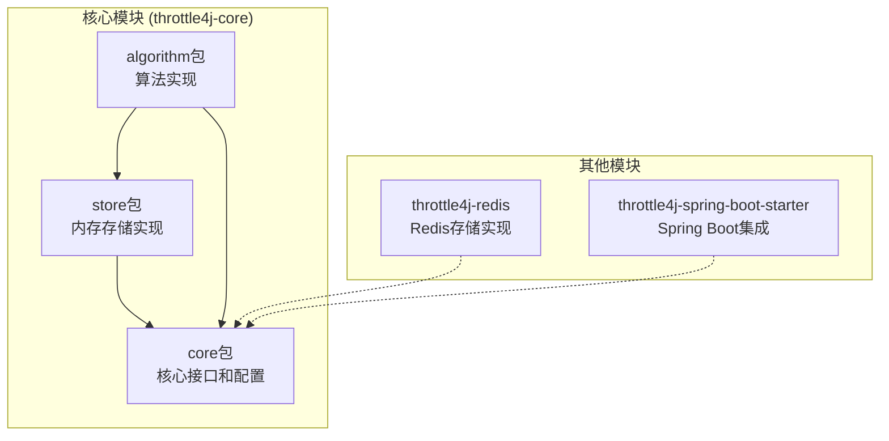
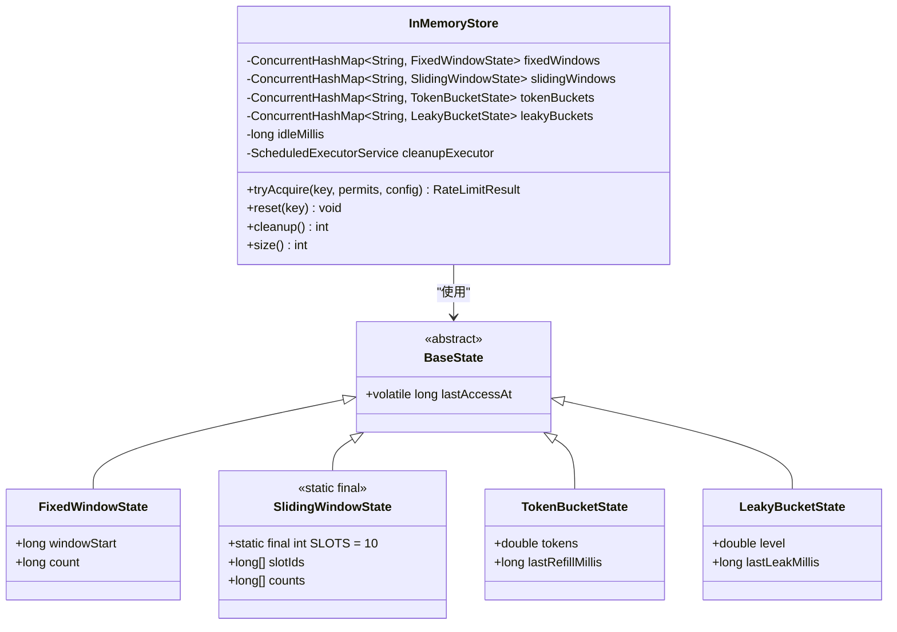
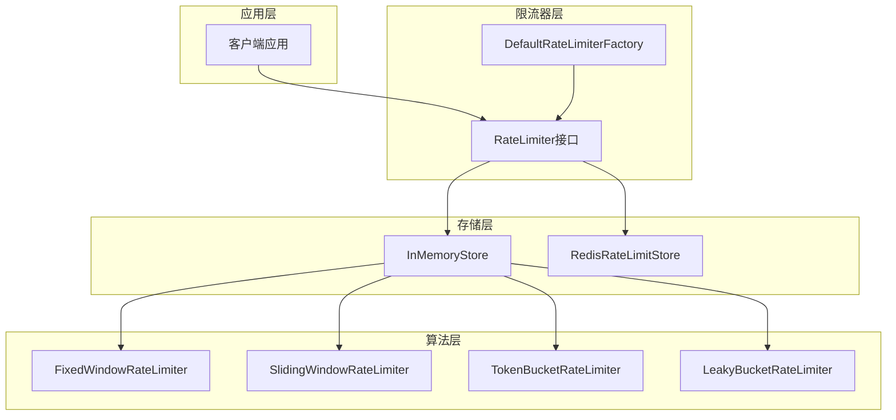
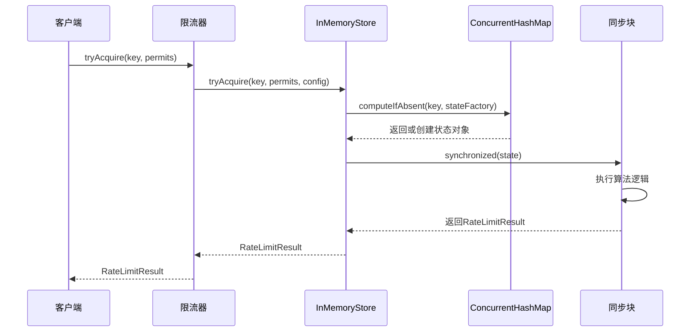
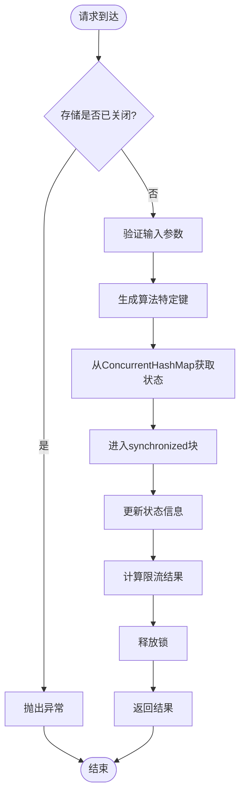
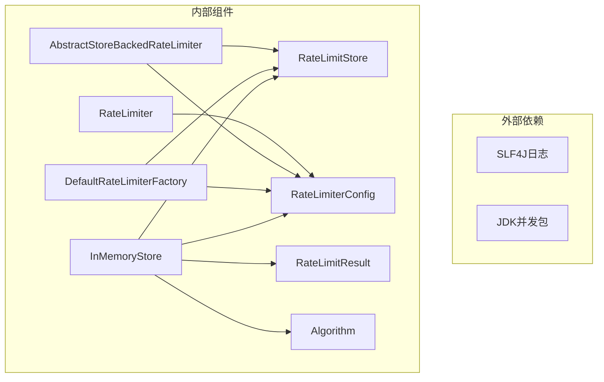

# 内存存储实现

<cite>
**本文档引用的文件**
- [InMemoryStore.java](file://throttle4j-core/src/main/java/com/throttle4j/store/InMemoryStore.java)
- [RateLimitStore.java](file://throttle4j-core/src/main/java/com/throttle4j/store/RateLimitStore.java)
- [Algorithm.java](file://throttle4j-core/src/main/java/com/throttle4j/core/Algorithm.java)
- [RateLimiterConfig.java](file://throttle4j-core/src/main/java/com/throttle4j/core/RateLimiterConfig.java)
- [RateLimitResult.java](file://throttle4j-core/src/main/java/com/throttle4j/core/RateLimitResult.java)
- [RateLimiter.java](file://throttle4j-core/src/main/java/com/throttle4j/core/RateLimiter.java)
- [AbstractStoreBackedRateLimiter.java](file://throttle4j-core/src/main/java/com/throttle4j/algorithm/AbstractStoreBackedRateLimiter.java)
- [DefaultRateLimiterFactory.java](file://throttle4j-core/src/main/java/com/throttle4j/algorithm/DefaultRateLimiterFactory.java)
- [InMemoryStoreTest.java](file://throttle4j-core/src/test/java/com/throttle4j/store/InMemoryStoreTest.java)
</cite>

## 目录
1. [简介](#简介)
2. [项目结构](#项目结构)
3. [核心组件](#核心组件)
4. [架构概览](#架构概览)
5. [详细组件分析](#详细组件分析)
6. [依赖关系分析](#依赖关系分析)
7. [性能考虑](#性能考虑)
8. [故障排除指南](#故障排除指南)
9. [结论](#结论)
10. [附录](#附录)

## 简介

本文档深入分析了Throttle4j框架中的内存存储实现，重点介绍了InMemoryStore的设计原理、线程安全机制、并发控制策略以及性能特征。InMemoryStore是一个基于ConcurrentHashMap的内存存储解决方案，为多种限流算法提供状态管理功能，包括固定窗口、滑动窗口、令牌桶和漏桶算法。

该实现采用分层架构设计，通过接口抽象和工厂模式实现了算法与存储的解耦，支持高并发场景下的高效限流操作。同时，它提供了自动清理机制来防止内存泄漏，并通过原子操作确保线程安全性。

## 项目结构

Throttle4j项目采用模块化设计，内存存储实现位于throttle4j-core模块中，遵循清晰的包结构组织：

**图表来源**
- [InMemoryStore.java:1-315](file://throttle4j-core/src/main/java/com/throttle4j/store/InMemoryStore.java#L1-L315)
- [RateLimitStore.java:1-35](file://throttle4j-core/src/main/java/com/throttle4j/store/RateLimitStore.java#L1-L35)

**章节来源**
- [InMemoryStore.java:1-315](file://throttle4j-core/src/main/java/com/throttle4j/store/InMemoryStore.java#L1-L315)
- [RateLimitStore.java:1-35](file://throttle4j-core/src/main/java/com/throttle4j/store/RateLimitStore.java#L1-L35)

## 核心组件

### InMemoryStore 主要特性

InMemoryStore是内存存储的核心实现，具有以下关键特性：

- **多算法支持**: 同时支持四种不同的限流算法
- **线程安全**: 使用ConcurrentHashMap和synchronized块确保并发安全
- **自动清理**: 定期清理闲置键值对，防止内存泄漏
- **高性能**: 基于内存的数据结构，访问速度快

### 数据结构设计

内存存储采用按算法分类的ConcurrentHashMap设计：

**图表来源**
- [InMemoryStore.java:267-313](file://throttle4j-core/src/main/java/com/throttle4j/store/InMemoryStore.java#L267-L313)

**章节来源**
- [InMemoryStore.java:33-36](file://throttle4j-core/src/main/java/com/throttle4j/store/InMemoryStore.java#L33-L36)
- [InMemoryStore.java:267-313](file://throttle4j-core/src/main/java/com/throttle4j/store/InMemoryStore.java#L267-L313)

## 架构概览

### 整体架构设计

Throttle4j采用了清晰的分层架构，实现了算法与存储的完全解耦：

**图表来源**
- [DefaultRateLimiterFactory.java:14-38](file://throttle4j-core/src/main/java/com/throttle4j/algorithm/DefaultRateLimiterFactory.java#L14-L38)
- [AbstractStoreBackedRateLimiter.java:14-41](file://throttle4j-core/src/main/java/com/throttle4j/algorithm/AbstractStoreBackedRateLimiter.java#L14-L41)

### 算法与存储交互流程

**图表来源**
- [AbstractStoreBackedRateLimiter.java:24-35](file://throttle4j-core/src/main/java/com/throttle4j/algorithm/AbstractStoreBackedRateLimiter.java#L24-L35)
- [InMemoryStore.java:68-93](file://throttle4j-core/src/main/java/com/throttle4j/store/InMemoryStore.java#L68-L93)

**章节来源**
- [DefaultRateLimiterFactory.java:14-38](file://throttle4j-core/src/main/java/com/throttle4j/algorithm/DefaultRateLimiterFactory.java#L14-L38)
- [AbstractStoreBackedRateLimiter.java:14-41](file://throttle4j-core/src/main/java/com/throttle4j/algorithm/AbstractStoreBackedRateLimiter.java#L14-L41)

## 详细组件分析

### 线程安全机制

InMemoryStore采用了多层次的线程安全保障机制：

#### 1. 并发容器保证
- 使用ConcurrentHashMap作为基础存储结构
- 每个算法类型独立维护一个ConcurrentHashMap
- 支持高并发读取操作

#### 2. 同步块保护
- 对每个具体的算法状态使用synchronized块
- 确保状态更新的原子性
- 防止竞态条件发生

#### 3. 原子状态管理
- 使用AtomicBoolean标记存储关闭状态
- volatile字段确保状态可见性
- 原子操作避免竞态条件

### 并发控制策略

**图表来源**
- [InMemoryStore.java:68-93](file://throttle4j-core/src/main/java/com/throttle4j/store/InMemoryStore.java#L68-L93)
- [InMemoryStore.java:150-170](file://throttle4j-core/src/main/java/com/throttle4j/store/InMemoryStore.java#L150-L170)

### 内存管理策略

#### 自动清理机制
- 定时任务定期清理闲置键
- 基于lastAccessAt时间戳判断
- 支持可配置的清理间隔和空闲超时

#### 内存泄漏防护
- 关闭时立即停止清理任务
- 清理任务使用守护线程
- 及时移除过期状态对象

**章节来源**
- [InMemoryStore.java:47-66](file://throttle4j-core/src/main/java/com/throttle4j/store/InMemoryStore.java#L47-L66)
- [InMemoryStore.java:109-133](file://throttle4j-core/src/main/java/com/throttle4j/store/InMemoryStore.java#L109-L133)

### 算法实现细节

#### 固定窗口算法
- 简单的时间窗口计数器
- 窗口边界重置计数器
- 最大延迟为整个窗口周期

#### 滑动窗口算法
- 使用10个子槽近似精确滑动窗口
- 动态清理过期槽位
- 更平滑的流量控制

#### 令牌桶算法
- 懒加载令牌补充机制
- 基于时间的动态令牌生成
- 支持突发流量处理

#### 漏桶算法
- 恒定速率输出控制
- 流量整形和平滑处理
- 最佳的流量均匀性

**章节来源**
- [InMemoryStore.java:150-263](file://throttle4j-core/src/main/java/com/throttle4j/store/InMemoryStore.java#L150-L263)

## 依赖关系分析

### 组件依赖图

**图表来源**
- [InMemoryStore.java:3-7](file://throttle4j-core/src/main/java/com/throttle4j/store/InMemoryStore.java#L3-L7)
- [DefaultRateLimiterFactory.java:3-6](file://throttle4j-core/src/main/java/com/throttle4j/algorithm/DefaultRateLimiterFactory.java#L3-L6)

### 耦合度分析

- **低耦合设计**: 算法与存储完全分离
- **接口导向**: 通过RateLimitStore接口实现解耦
- **可扩展性**: 易于添加新的存储实现
- **可测试性**: 支持单元测试和集成测试

**章节来源**
- [RateLimitStore.java:6-14](file://throttle4j-core/src/main/java/com/throttle4j/store/RateLimitStore.java#L6-L14)
- [DefaultRateLimiterFactory.java:14-38](file://throttle4j-core/src/main/java/com/throttle4j/algorithm/DefaultRateLimiterFactory.java#L14-L38)

## 性能考虑

### 内存占用特性

#### 数据结构复杂度
- **ConcurrentHashMap**: 平均O(1)查找和插入
- **状态对象**: 每个键约占用16-24字节（取决于算法）
- **内存增长**: 与活跃键数量成正比

#### 内存使用优化
- 按算法类型分离存储，减少内存碎片
- 及时清理闲置状态，控制内存峰值
- 滑动窗口使用固定大小数组，避免动态扩容

### 访问速度特征

#### 时间复杂度
- **查询操作**: O(1)平均时间复杂度
- **更新操作**: O(1)平均时间复杂度
- **清理操作**: O(n)线性时间复杂度

#### 并发性能
- **读操作**: 高并发读取，无锁设计
- **写操作**: 局部锁定，最小化锁竞争
- **清理开销**: 异步执行，不影响主业务流程

### 容量限制分析

#### 理论上限
- **内存限制**: 受可用内存约束
- **CPU限制**: 受GC停顿影响
- **网络限制**: 受系统文件描述符限制

#### 实际建议
- **单机部署**: 建议不超过100万活跃键
- **内存配置**: 每1000个键需要额外2MB内存
- **清理策略**: 根据业务需求调整清理频率

**章节来源**
- [InMemoryStore.java:135-139](file://throttle4j-core/src/main/java/com/throttle4j/store/InMemoryStore.java#L135-L139)
- [InMemoryStoreTest.java:70-91](file://throttle4j-core/src/test/java/com/throttle4j/store/InMemoryStoreTest.java#L70-L91)

## 故障排除指南

### 常见问题诊断

#### 内存泄漏问题
**症状**: 内存持续增长，系统出现Full GC
**原因**: 键未及时清理或清理间隔设置不当
**解决方案**: 
- 调整idleMillis参数（默认5分钟）
- 减少cleanupIntervalMillis（默认60秒）
- 确保正确关闭存储实例

#### 并发冲突问题
**症状**: 限流结果不准确，出现负数剩余配额
**原因**: 多线程竞争导致的状态不一致
**解决方案**:
- 检查synchronized块的正确使用
- 验证状态对象的不可变性
- 确认原子操作的正确性

#### 性能瓶颈问题
**症状**: 请求延迟增加，吞吐量下降
**原因**: 锁竞争过度，清理任务过于频繁
**解决方案**:
- 优化清理频率
- 减少不必要的状态创建
- 调整滑动窗口槽位数量

### 监控指标

#### 关键指标
- **活跃键数量**: 监控当前存储的键数量
- **清理效率**: 监控清理任务的移除数量
- **内存使用率**: 监控内存占用情况
- **GC频率**: 监控垃圾回收活动

#### 调试工具
- 使用JVM监控工具分析内存使用
- 启用DEBUG日志级别查看清理详情
- 使用性能分析工具检测热点方法

**章节来源**
- [InMemoryStore.java:109-133](file://throttle4j-core/src/main/java/com/throttle4j/store/InMemoryStore.java#L109-L133)
- [InMemoryStoreTest.java:14-25](file://throttle4j-core/src/test/java/com/throttle4j/store/InMemoryStoreTest.java#L14-L25)

## 结论

InMemoryStore作为Throttle4j框架的核心组件，展现了优秀的工程实践：

### 设计优势
- **架构清晰**: 分层设计实现了良好的关注点分离
- **性能优异**: 基于内存的快速访问和高效的并发控制
- **扩展性强**: 易于添加新算法和存储实现
- **可靠性高**: 完善的错误处理和资源管理机制

### 技术特色
- **线程安全**: 多层次的安全保障机制
- **内存友好**: 智能清理和资源管理
- **配置灵活**: 支持多种算法和参数配置
- **易于使用**: 简洁的API设计和丰富的测试覆盖

### 应用建议
InMemoryStore最适合用于单机应用、测试环境和对延迟敏感的场景。对于分布式系统，建议结合Redis等持久化存储方案使用。

## 附录

### 配置选项详解

| 参数名称 | 默认值 | 单位 | 描述 |
|---------|--------|------|------|
| idleMillis | 300000 | 毫秒 | 键的空闲超时时间（5分钟） |
| cleanupIntervalMillis | 60000 | 毫秒 | 清理任务执行间隔（1分钟） |

### 调优建议

#### 内存优化
- 根据预期活跃键数量调整idleMillis
- 在高并发场景下适当增加清理频率
- 监控内存使用趋势，及时调整参数

#### 性能优化
- 减少不必要的状态创建，复用现有状态
- 在批量操作中考虑合并请求
- 使用合适的算法类型匹配业务需求

#### 运维建议
- 定期监控清理效果和内存使用情况
- 设置适当的告警阈值
- 制定应急预案和回退策略

**章节来源**
- [InMemoryStore.java:28-31](file://throttle4j-core/src/main/java/com/throttle4j/store/InMemoryStore.java#L28-L31)
- [InMemoryStore.java:47-66](file://throttle4j-core/src/main/java/com/throttle4j/store/InMemoryStore.java#L47-L66)