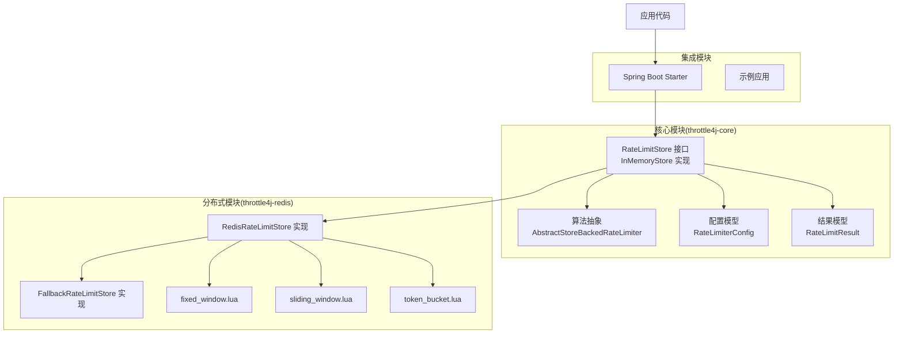
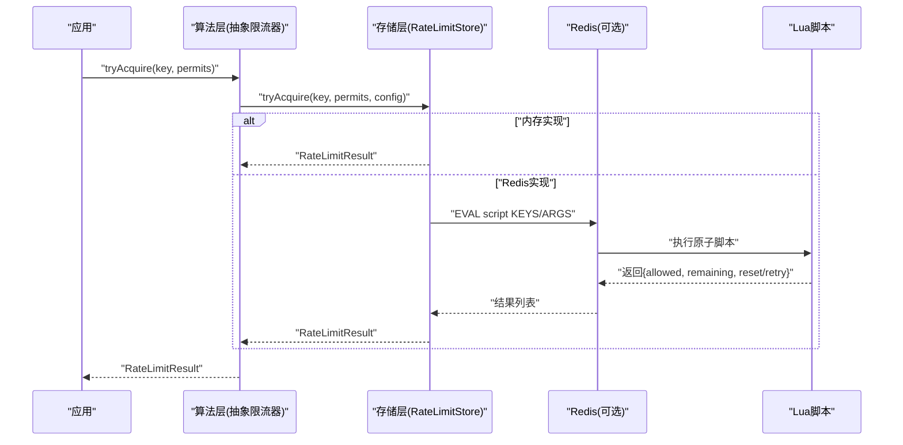
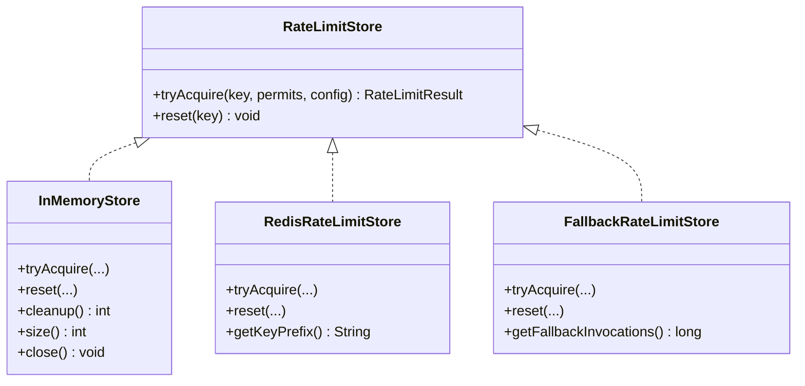
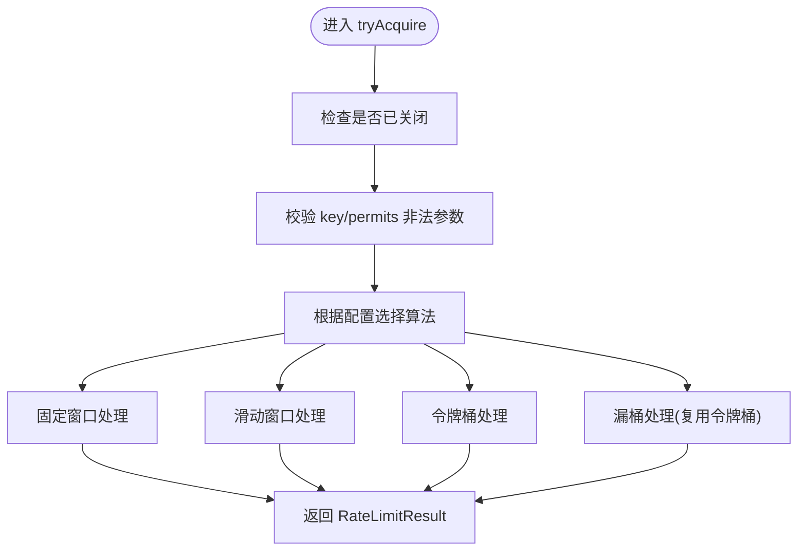
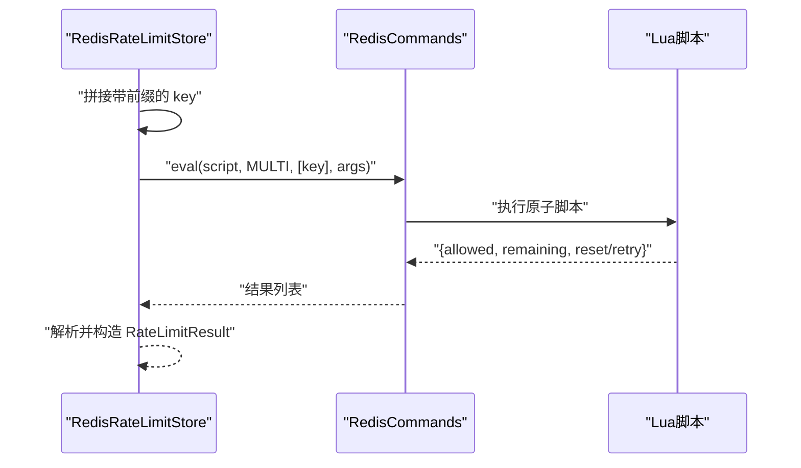
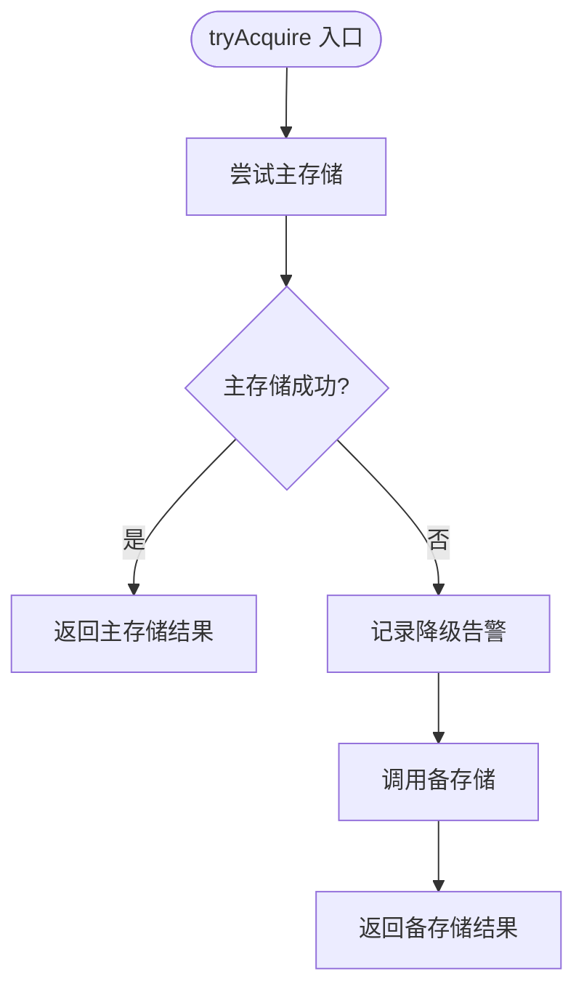
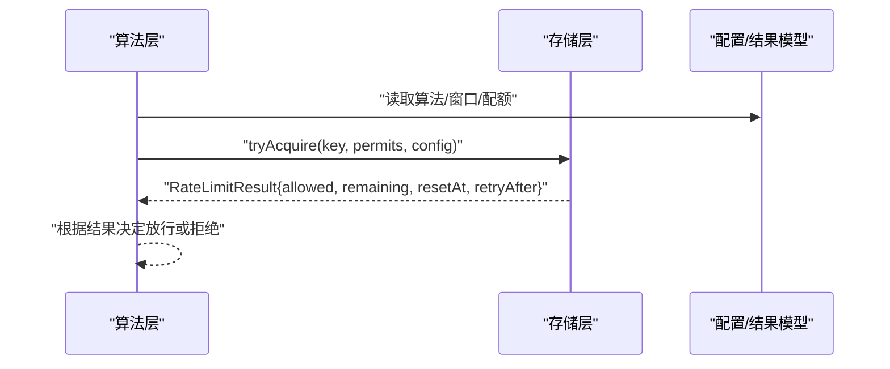
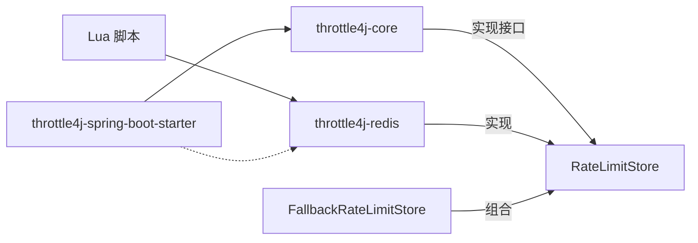

# 存储层扩展指南

<cite>
**本文引用的文件**
- [RateLimitStore.java](file://throttle4j-core/src/main/java/com/throttle4j/store/RateLimitStore.java)
- [InMemoryStore.java](file://throttle4j-core/src/main/java/com/throttle4j/store/InMemoryStore.java)
- [RedisRateLimitStore.java](file://throttle4j-redis/src/main/java/com/throttle4j/redis/RedisRateLimitStore.java)
- [FallbackRateLimitStore.java](file://throttle4j-redis/src/main/java/com/throttle4j/redis/FallbackRateLimitStore.java)
- [AbstractStoreBackedRateLimiter.java](file://throttle4j-core/src/main/java/com/throttle4j/algorithm/AbstractStoreBackedRateLimiter.java)
- [RateLimiterConfig.java](file://throttle4j-core/src/main/java/com/throttle4j/core/RateLimiterConfig.java)
- [RateLimitResult.java](file://throttle4j-core/src/main/java/com/throttle4j/core/RateLimitResult.java)
- [fixed_window.lua](file://throttle4j-redis/src/main/resources/scripts/fixed_window.lua)
- [sliding_window.lua](file://throttle4j-redis/src/main/resources/scripts/sliding_window.lua)
- [token_bucket.lua](file://throttle4j-redis/src/main/resources/scripts/token_bucket.lua)
- [InMemoryStoreTest.java](file://throttle4j-core/src/test/java/com/throttle4j/store/InMemoryStoreTest.java)
- [RedisRateLimitStoreTest.java](file://throttle4j-redis/src/test/java/com/throttle4j/redis/RedisRateLimitStoreTest.java)
- [FallbackRateLimitStoreTest.java](file://throttle4j-redis/src/test/java/com/throttle4j/redis/FallbackRateLimitStoreTest.java)
- [README.md](file://README.md)
- [CONTRIBUTING.md](file://CONTRIBUTING.md)
</cite>

## 目录
1. [简介](#简介)
2. [项目结构](#项目结构)
3. [核心组件](#核心组件)
4. [架构总览](#架构总览)
5. [详细组件分析](#详细组件分析)
6. [依赖分析](#依赖分析)
7. [性能考虑](#性能考虑)
8. [故障排查指南](#故障排查指南)
9. [结论](#结论)
10. [附录](#附录)

## 简介
本指南面向需要为 throttle4j 扩展自定义存储后端的开发者，系统讲解如何实现符合规范的 RateLimitStore 接口，涵盖设计原则（线程安全、性能优化、错误处理）、与算法层的交互协议、数据流转机制、测试策略、性能基准与优化建议、部署与运维要点，以及版本兼容与升级策略。文档以仓库现有实现为依据，结合接口契约与测试用例，帮助你快速构建稳定可靠的分布式限流存储。

## 项目结构
throttle4j 采用多模块结构，核心能力集中在 core 模块，Redis 分布式存储在 redis 模块，Spring Boot 自动配置在 spring-boot-starter 模块，examples 提供使用示例。存储层扩展主要围绕 core 模块中的 RateLimitStore 接口与其实现展开。

图表来源
- [README.md:76-101](file://README.md#L76-L101)
- [RateLimitStore.java:15-34](file://throttle4j-core/src/main/java/com/throttle4j/store/RateLimitStore.java#L15-L34)
- [InMemoryStore.java:24-314](file://throttle4j-core/src/main/java/com/throttle4j/store/InMemoryStore.java#L24-L314)
- [RedisRateLimitStore.java:40-257](file://throttle4j-redis/src/main/java/com/throttle4j/redis/RedisRateLimitStore.java#L40-L257)
- [FallbackRateLimitStore.java:27-77](file://throttle4j-redis/src/main/java/com/throttle4j/redis/FallbackRateLimitStore.java#L27-L77)

章节来源
- [README.md:14-160](file://README.md#L14-L160)

## 核心组件
- RateLimitStore 接口：定义存储层的最小契约，包含 tryAcquire 与 reset 两个方法，所有实现必须保证线程安全。
- InMemoryStore：单机内存实现，按算法类型维护独立的并发映射表，并提供定时清理空闲键的能力。
- RedisRateLimitStore：基于 Redis 的分布式实现，通过 Lua 脚本原子执行算法逻辑，支持固定窗口、滑动窗口与令牌桶（漏桶复用令牌桶脚本）。
- FallbackRateLimitStore：主存储失败时的降级回退代理，确保服务在 Redis 故障时仍能进行本地限流。
- AbstractStoreBackedRateLimiter：算法层委托存储层的抽象基类，封装参数校验与调用转发。
- RateLimiterConfig：不可变配置对象，封装算法、配额、时间窗、填充速率等。
- RateLimitResult：限流结果模型，包含允许/拒绝状态、剩余配额、重置时间与建议重试间隔。

章节来源
- [RateLimitStore.java:15-34](file://throttle4j-core/src/main/java/com/throttle4j/store/RateLimitStore.java#L15-L34)
- [InMemoryStore.java:24-314](file://throttle4j-core/src/main/java/com/throttle4j/store/InMemoryStore.java#L24-L314)
- [RedisRateLimitStore.java:40-257](file://throttle4j-redis/src/main/java/com/throttle4j/redis/RedisRateLimitStore.java#L40-L257)
- [FallbackRateLimitStore.java:27-77](file://throttle4j-redis/src/main/java/com/throttle4j/redis/FallbackRateLimitStore.java#L27-L77)
- [AbstractStoreBackedRateLimiter.java:14-41](file://throttle4j-core/src/main/java/com/throttle4j/algorithm/AbstractStoreBackedRateLimiter.java#L14-L41)
- [RateLimiterConfig.java:8-112](file://throttle4j-core/src/main/java/com/throttle4j/core/RateLimiterConfig.java#L8-L112)
- [RateLimitResult.java:6-67](file://throttle4j-core/src/main/java/com/throttle4j/core/RateLimitResult.java#L6-L67)

## 架构总览
存储层与算法层通过接口解耦，算法层不关心状态持久化细节，仅通过 RateLimitStore 进行原子性状态更新与查询。Redis 实现将算法逻辑下沉到 Lua 脚本，确保跨操作的原子性；内存实现则通过并发容器与同步块保障一致性。

图表来源
- [AbstractStoreBackedRateLimiter.java:24-40](file://throttle4j-core/src/main/java/com/throttle4j/algorithm/AbstractStoreBackedRateLimiter.java#L24-L40)
- [RedisRateLimitStore.java:80-110](file://throttle4j-redis/src/main/java/com/throttle4j/redis/RedisRateLimitStore.java#L80-L110)
- [fixed_window.lua:11-45](file://throttle4j-redis/src/main/resources/scripts/fixed_window.lua#L11-L45)
- [sliding_window.lua:13-48](file://throttle4j-redis/src/main/resources/scripts/sliding_window.lua#L13-L48)
- [token_bucket.lua:11-57](file://throttle4j-redis/src/main/resources/scripts/token_bucket.lua#L11-L57)

## 详细组件分析

### RateLimitStore 接口与实现要求
- 必须线程安全：接口注释明确要求实现必须线程安全，避免并发读写导致的状态不一致。
- tryAcquire(key, permits, config)：根据配置选择算法并执行原子性状态更新，返回 RateLimitResult。
- reset(key)：重置指定键的状态，用于运维或测试场景。

图表来源
- [RateLimitStore.java:15-34](file://throttle4j-core/src/main/java/com/throttle4j/store/RateLimitStore.java#L15-L34)
- [InMemoryStore.java:24-314](file://throttle4j-core/src/main/java/com/throttle4j/store/InMemoryStore.java#L24-L314)
- [RedisRateLimitStore.java:40-257](file://throttle4j-redis/src/main/java/com/throttle4j/redis/RedisRateLimitStore.java#L40-L257)
- [FallbackRateLimitStore.java:27-77](file://throttle4j-redis/src/main/java/com/throttle4j/redis/FallbackRateLimitStore.java#L27-L77)

章节来源
- [RateLimitStore.java:15-34](file://throttle4j-core/src/main/java/com/throttle4j/store/RateLimitStore.java#L15-L34)

### InMemoryStore 设计与实现要点
- 并发模型：每种算法维护独立的并发映射表，减少锁粒度；每个键对应的状态对象使用 synchronized 保护关键路径。
- 清理策略：单线程调度器周期性扫描并移除超过空闲阈值未访问的键，降低内存占用。
- 状态模型：针对不同算法定义专用状态类，统一记录最后访问时间以便清理。

图表来源
- [InMemoryStore.java:68-93](file://throttle4j-core/src/main/java/com/throttle4j/store/InMemoryStore.java#L68-L93)
- [InMemoryStore.java:150-263](file://throttle4j-core/src/main/java/com/throttle4j/store/InMemoryStore.java#L150-L263)

章节来源
- [InMemoryStore.java:24-314](file://throttle4j-core/src/main/java/com/throttle4j/store/InMemoryStore.java#L24-L314)

### RedisRateLimitStore 原子性与脚本分发
- 键前缀：默认带前缀避免键冲突，支持自定义前缀。
- 脚本加载：构造时从类路径加载 Lua 脚本，保证脚本可用性。
- 算法分发：根据配置将请求路由至对应脚本，传入参数包括容量/速率/时间窗/当前时间戳等。
- 结果解析：统一解析脚本返回的多值结果，组装 RateLimitResult。

图表来源
- [RedisRateLimitStore.java:80-110](file://throttle4j-redis/src/main/java/com/throttle4j/redis/RedisRateLimitStore.java#L80-L110)
- [RedisRateLimitStore.java:195-203](file://throttle4j-redis/src/main/java/com/throttle4j/redis/RedisRateLimitStore.java#L195-L203)
- [fixed_window.lua:11-45](file://throttle4j-redis/src/main/resources/scripts/fixed_window.lua#L11-L45)
- [sliding_window.lua:13-48](file://throttle4j-redis/src/main/resources/scripts/sliding_window.lua#L13-L48)
- [token_bucket.lua:11-57](file://throttle4j-redis/src/main/resources/scripts/token_bucket.lua#L11-L57)

章节来源
- [RedisRateLimitStore.java:40-257](file://throttle4j-redis/src/main/java/com/throttle4j/redis/RedisRateLimitStore.java#L40-L257)

### FallbackRateLimitStore 降级策略
- 主备切换：主存储异常时透明切换到备存储，避免限流失效。
- 统计与日志：统计降级触发次数，记录警告日志便于观测。
- 双向 reset：广播 reset 到主备存储，保持本地状态一致。

图表来源
- [FallbackRateLimitStore.java:44-71](file://throttle4j-redis/src/main/java/com/throttle4j/redis/FallbackRateLimitStore.java#L44-L71)

章节来源
- [FallbackRateLimitStore.java:27-77](file://throttle4j-redis/src/main/java/com/throttle4j/redis/FallbackRateLimitStore.java#L27-L77)

### 算法层交互协议与数据流转
- 参数传递：算法层将 key、permits、config 透传给存储层，存储层据此计算并返回结果。
- 结果约定：存储层返回 RateLimitResult，其中包含是否允许、剩余配额、重置时间与重试间隔，供上层使用。

图表来源
- [AbstractStoreBackedRateLimiter.java:24-40](file://throttle4j-core/src/main/java/com/throttle4j/algorithm/AbstractStoreBackedRateLimiter.java#L24-L40)
- [RateLimitResult.java:31-40](file://throttle4j-core/src/main/java/com/throttle4j/core/RateLimitResult.java#L31-L40)
- [RateLimiterConfig.java:22-36](file://throttle4j-core/src/main/java/com/throttle4j/core/RateLimiterConfig.java#L22-L36)

章节来源
- [AbstractStoreBackedRateLimiter.java:14-41](file://throttle4j-core/src/main/java/com/throttle4j/algorithm/AbstractStoreBackedRateLimiter.java#L14-L41)
- [RateLimitResult.java:6-67](file://throttle4j-core/src/main/java/com/throttle4j/core/RateLimitResult.java#L6-L67)
- [RateLimiterConfig.java:8-112](file://throttle4j-core/src/main/java/com/throttle4j/core/RateLimiterConfig.java#L8-L112)

## 依赖分析
- 模块间耦合：core 模块提供公共接口与模型，redis 模块实现分布式存储并与 Lua 脚本耦合；spring-boot-starter 依赖 core 并可选引入 redis。
- 外部依赖：redis 模块依赖 Lettuce 客户端与 Lua 脚本资源；fallback 模块依赖两个 RateLimitStore 实例。

图表来源
- [README.md:134-141](file://README.md#L134-L141)
- [RedisRateLimitStore.java:40-78](file://throttle4j-redis/src/main/java/com/throttle4j/redis/RedisRateLimitStore.java#L40-L78)
- [FallbackRateLimitStore.java:31-42](file://throttle4j-redis/src/main/java/com/throttle4j/redis/FallbackRateLimitStore.java#L31-L42)

章节来源
- [README.md:134-141](file://README.md#L134-L141)

## 性能考虑
- 线程安全与锁竞争
  - 内存实现：通过算法维度的并发映射与细粒度 synchronized 保护关键状态，降低锁竞争。
  - Redis 实现：Lua 脚本原子执行，避免网络往返与客户端层面的竞态。
- 内存与序列化
  - 尽量使用简单键名与紧凑的脚本参数，减少序列化开销。
- 命令与脚本复杂度
  - 固定窗口与令牌桶脚本相对简单，滑动窗口使用有序集合，注意键数量增长带来的成本。
- 清理与生命周期
  - 合理设置空闲 TTL 与清理间隔，避免内存泄漏；清理频率过高会增加 CPU 开销。

章节来源
- [InMemoryStore.java:38-66](file://throttle4j-core/src/main/java/com/throttle4j/store/InMemoryStore.java#L38-L66)
- [RedisRateLimitStore.java:195-203](file://throttle4j-redis/src/main/java/com/throttle4j/redis/RedisRateLimitStore.java#L195-L203)

## 故障排查指南
- 常见问题定位
  - Redis 连接失败：确认连接参数、网络连通性与超时设置；启用降级存储以保障服务可用。
  - 脚本加载失败：检查脚本资源是否存在且非空；关注初始化阶段的日志。
  - 配置非法：limit/windowMillis/refillRate 缺失或小于等于 0 会导致构建失败。
- 观测与指标
  - 使用降级存储的计数器统计降级触发次数，辅助评估 Redis 可靠性。
  - 记录 RateLimitResult 中的 retryAfter 与 resetAt，便于前端重试策略与用户提示。
- 单元测试参考
  - 内存存储：覆盖基本获取、重置隔离、清理行为与关闭保护。
  - Redis 存储：覆盖脚本分发、参数传递、返回值解析与异常场景。
  - 降级存储：覆盖主存储失败回退、双向 reset、异常吞吐。

章节来源
- [RedisRateLimitStoreTest.java:44-282](file://throttle4j-redis/src/test/java/com/throttle4j/redis/RedisRateLimitStoreTest.java#L44-L282)
- [InMemoryStoreTest.java:35-100](file://throttle4j-core/src/test/java/com/throttle4j/store/InMemoryStoreTest.java#L35-L100)
- [FallbackRateLimitStoreTest.java:53-127](file://throttle4j-redis/src/test/java/com/throttle4j/redis/FallbackRateLimitStoreTest.java#L53-L127)

## 结论
通过遵循 RateLimitStore 接口契约与现有实现的设计模式，你可以快速构建稳定、高性能的自定义存储后端。优先采用原子性方案（如 Lua 脚本）保证正确性，结合合理的清理与降级策略提升可用性，并通过完善的测试与可观测性保障线上质量。

## 附录

### 设计原则与最佳实践
- 线程安全：所有实现必须保证多线程并发下的正确性，推荐使用原子操作或脚本原子性。
- 性能优化：减少锁范围与粒度，利用脚本原子性，控制键空间规模。
- 错误处理：区分瞬时故障与永久错误，必要时提供降级存储；对异常进行分类与日志记录。
- 可观测性：暴露必要的运行指标（如降级次数、清理数量），输出标准限流头信息。

章节来源
- [RateLimitStore.java:13-13](file://throttle4j-core/src/main/java/com/throttle4j/store/RateLimitStore.java#L13-L13)
- [CONTRIBUTING.md:31-41](file://CONTRIBUTING.md#L31-L41)

### 与算法层的交互协议
- 输入：key、permits、config（算法、配额、时间窗、速率）。
- 输出：RateLimitResult（允许/拒绝、剩余配额、重置时间、重试间隔）。
- 约束：key 非空，permits ≥ 1，config 合法。

章节来源
- [AbstractStoreBackedRateLimiter.java:24-40](file://throttle4j-core/src/main/java/com/throttle4j/algorithm/AbstractStoreBackedRateLimiter.java#L24-L40)
- [RateLimitResult.java:31-40](file://throttle4j-core/src/main/java/com/throttle4j/core/RateLimitResult.java#L31-L40)
- [RateLimiterConfig.java:91-110](file://throttle4j-core/src/main/java/com/throttle4j/core/RateLimiterConfig.java#L91-L110)

### 自定义存储实现思路
- 缓存存储（内存/本地缓存）
  - 适用：单节点、低延迟、高吞吐场景。
  - 关键点：并发容器、定期清理、关闭保护、细粒度锁。
  - 参考实现：InMemoryStore 的并发映射与清理策略。
- 数据库存储
  - 适用：需要持久化、审计与跨实例共享状态。
  - 关键点：原子更新（如使用条件更新或事务）、索引优化、幂等性、失败回退。
  - 注意：避免热点键争用，必要时拆分键空间或引入分区。
- 云存储（对象存储/KV）
  - 适用：弹性扩展、低成本、多区域部署。
  - 关键点：网络抖动处理、重试与指数退避、一致性模型权衡、降级策略。
  - 参考：Redis 实现的脚本原子性与键前缀策略。

章节来源
- [InMemoryStore.java:24-314](file://throttle4j-core/src/main/java/com/throttle4j/store/InMemoryStore.java#L24-L314)
- [RedisRateLimitStore.java:40-78](file://throttle4j-redis/src/main/java/com/throttle4j/redis/RedisRateLimitStore.java#L40-L78)

### 测试策略与验证方法
- 单元测试
  - 行为验证：覆盖允许/拒绝、剩余配额、重置时间与重试间隔。
  - 边界条件：空闲清理、关闭后的异常、非法参数。
  - 回退验证：主存储失败时的降级行为与计数。
- 集成测试
  - Redis 场景：模拟真实网络与脚本执行，验证参数传递与返回值解析。
- 负载测试
  - 并发压力：评估锁竞争与清理开销。
  - 故障注入：模拟网络抖动与脚本异常，验证降级与恢复。

章节来源
- [InMemoryStoreTest.java:35-100](file://throttle4j-core/src/test/java/com/throttle4j/store/InMemoryStoreTest.java#L35-L100)
- [RedisRateLimitStoreTest.java:44-282](file://throttle4j-redis/src/test/java/com/throttle4j/redis/RedisRateLimitStoreTest.java#L44-L282)
- [FallbackRateLimitStoreTest.java:53-127](file://throttle4j-redis/src/test/java/com/throttle4j/redis/FallbackRateLimitStoreTest.java#L53-L127)

### 性能基准与优化建议
- 基准指标
  - QPS、P99 延迟、CPU/内存占用、GC 次数与停顿。
  - 降级触发率、清理命中率。
- 优化方向
  - 减少锁范围与竞争；使用原子脚本；合理设置清理策略；缓存热点键；限制键空间规模。
- 基于实现的优化点
  - 内存实现：调整空闲 TTL 与清理间隔；避免过度清理。
  - Redis 实现：复用连接与脚本；控制参数长度；避免过大的有序集合。

章节来源
- [InMemoryStore.java:38-66](file://throttle4j-core/src/main/java/com/throttle4j/store/InMemoryStore.java#L38-L66)
- [RedisRateLimitStore.java:195-203](file://throttle4j-redis/src/main/java/com/throttle4j/redis/RedisRateLimitStore.java#L195-L203)

### 部署与运维指南
- 连接与配置
  - Redis：设置合适的超时、重试与连接池大小；启用键前缀避免冲突。
  - 降级：开启降级开关，确保在主存储不可用时自动回退。
- 监控与告警
  - 降级次数、清理数量、Redis 延迟与错误率。
  - 限流命中率与拒绝率，辅助容量规划。
- 版本与升级
  - 保持接口兼容，新增算法或脚本需向后兼容；发布前充分测试。

章节来源
- [README.md:114-132](file://README.md#L114-L132)
- [CONTRIBUTING.md:42-79](file://CONTRIBUTING.md#L42-L79)

### 版本兼容性与升级策略
- 接口稳定性：RateLimitStore 与核心模型保持稳定，扩展实现应遵循契约。
- 脚本演进：Lua 脚本变更需向后兼容，避免破坏现有键格式；提供迁移策略。
- 发布流程：遵循贡献指南的提交与测试规范，确保覆盖率与质量门禁。

章节来源
- [CONTRIBUTING.md:18-29](file://CONTRIBUTING.md#L18-L29)
- [CONTRIBUTING.md:94-101](file://CONTRIBUTING.md#L94-L101)