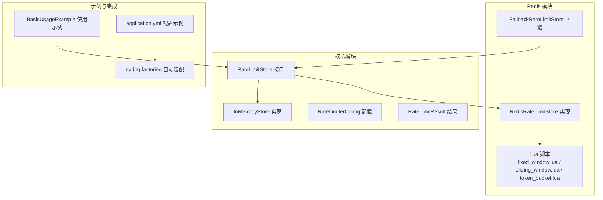
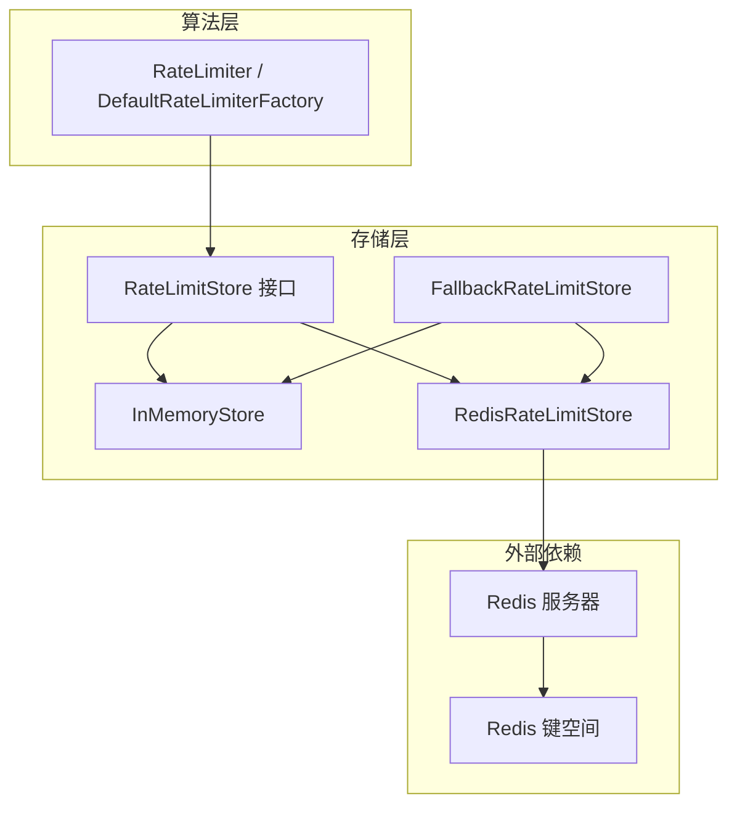
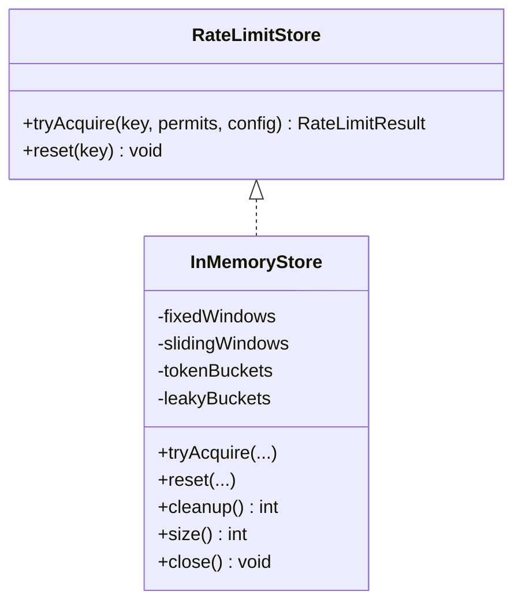
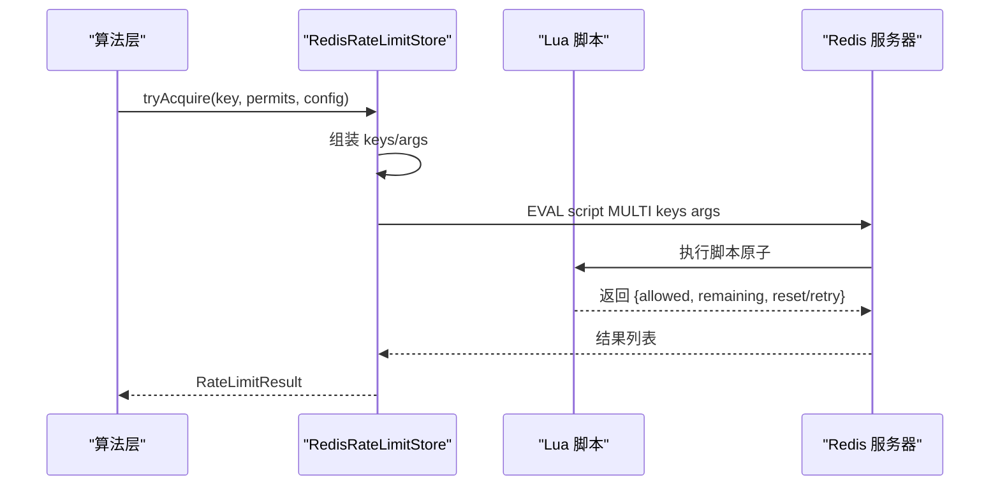
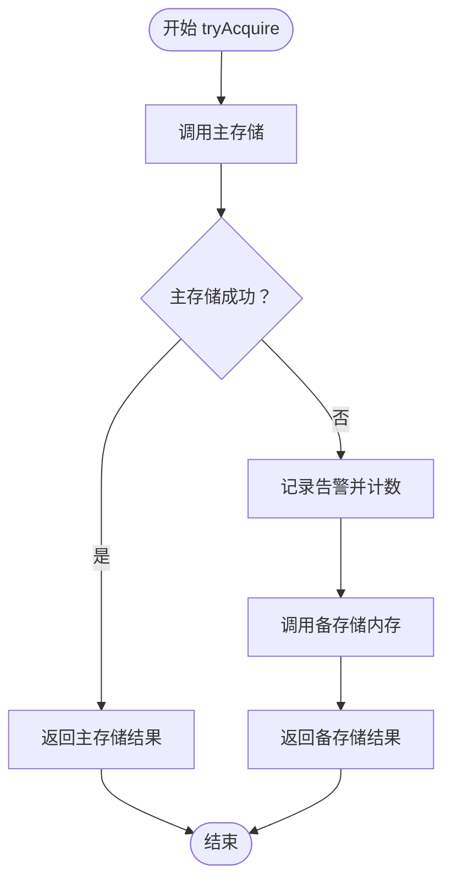
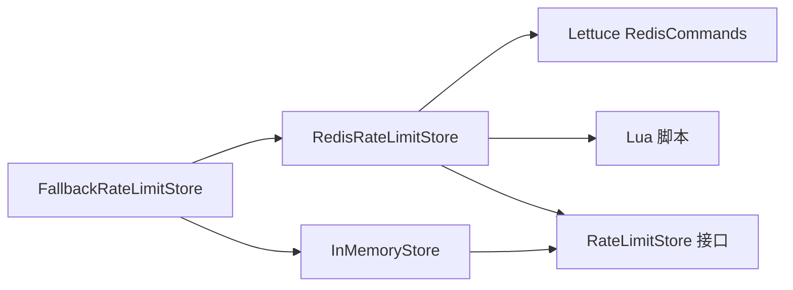

# 存储层设计

<cite>
**本文引用的文件**
- [throttle4j-core/src/main/java/com/throttle4j/store/RateLimitStore.java](file://throttle4j-core/src/main/java/com/throttle4j/store/RateLimitStore.java)
- [throttle4j-core/src/main/java/com/throttle4j/store/InMemoryStore.java](file://throttle4j-core/src/main/java/com/throttle4j/store/InMemoryStore.java)
- [throttle4j-core/src/main/java/com/throttle4j/core/RateLimiterConfig.java](file://throttle4j-core/src/main/java/com/throttle4j/core/RateLimiterConfig.java)
- [throttle4j-core/src/main/java/com/throttle4j/core/RateLimitResult.java](file://throttle4j-core/src/main/java/com/throttle4j/core/RateLimitResult.java)
- [throttle4j-redis/src/main/java/com/throttle4j/redis/RedisRateLimitStore.java](file://throttle4j-redis/src/main/java/com/throttle4j/redis/RedisRateLimitStore.java)
- [throttle4j-redis/src/main/java/com/throttle4j/redis/RedisRateLimitStoreBuilder.java](file://throttle4j-redis/src/main/java/com/throttle4j/redis/RedisRateLimitStoreBuilder.java)
- [throttle4j-redis/src/main/java/com/throttle4j/redis/FallbackRateLimitStore.java](file://throttle4j-redis/src/main/java/com/throttle4j/redis/FallbackRateLimitStore.java)
- [throttle4j-redis/src/main/resources/scripts/fixed_window.lua](file://throttle4j-redis/src/main/resources/scripts/fixed_window.lua)
- [throttle4j-redis/src/main/resources/scripts/sliding_window.lua](file://throttle4j-redis/src/main/resources/scripts/sliding_window.lua)
- [throttle4j-redis/src/main/resources/scripts/token_bucket.lua](file://throttle4j-redis/src/main/resources/scripts/token_bucket.lua)
- [throttle4j-redis/src/test/java/com/throttle4j/redis/RedisRateLimitStoreTest.java](file://throttle4j-redis/src/test/java/com/throttle4j/redis/RedisRateLimitStoreTest.java)
- [throttle4j-redis/src/test/java/com/throttle4j/redis/FallbackRateLimitStoreTest.java](file://throttle4j-redis/src/test/java/com/throttle4j/redis/FallbackRateLimitStoreTest.java)
- [throttle4j-core/src/test/java/com/throttle4j/store/InMemoryStoreTest.java](file://throttle4j-core/src/test/java/com/throttle4j/store/InMemoryStoreTest.java)
- [throttle4j-examples/src/main/java/com/throttle4j/example/BasicUsageExample.java](file://throttle4j-examples/src/main/java/com/throttle4j/example/BasicUsageExample.java)
- [throttle4j-examples/src/main/resources/application.yml](file://throttle4j-examples/src/main/resources/application.yml)
- [throttle4j-spring-boot-starter/src/main/resources/META-INF/spring.factories](file://throttle4j-spring-boot-starter/src/main/resources/META-INF/spring.factories)
</cite>

## 目录
1. [简介](#简介)
2. [项目结构](#项目结构)
3. [核心组件](#核心组件)
4. [架构总览](#架构总览)
5. [详细组件分析](#详细组件分析)
6. [依赖分析](#依赖分析)
7. [性能考虑](#性能考虑)
8. [故障排除指南](#故障排除指南)
9. [结论](#结论)
10. [附录：扩展指南与最佳实践](#附录扩展指南与最佳实践)

## 简介
本文件系统化梳理 throttle4j 的存储层架构，重点围绕“存储层抽象”“内存存储实现”“Redis 分布式存储与 Lua 原子脚本”“降级机制（主 Redis 不可用时回退到本地内存）”展开，并给出扩展新存储后端的步骤、性能对比建议、配置要点与排障清单。同时阐明存储层与算法层之间的交互关系与数据流。

## 项目结构
- 核心模块（throttle4j-core）：定义存储层接口、内存实现、通用配置与结果模型。
- Redis 模块（throttle4j-redis）：提供基于 Redis 的分布式存储实现，内置 Lua 脚本与回退策略。
- 示例模块（throttle4j-examples）：演示程序化使用与 Spring Boot 默认配置。
- Spring Boot Starter（throttle4j-spring-boot-starter）：自动装配入口。

图表来源
- [throttle4j-core/src/main/java/com/throttle4j/store/RateLimitStore.java:15-34](file://throttle4j-core/src/main/java/com/throttle4j/store/RateLimitStore.java#L15-L34)
- [throttle4j-core/src/main/java/com/throttle4j/store/InMemoryStore.java:24-315](file://throttle4j-core/src/main/java/com/throttle4j/store/InMemoryStore.java#L24-L315)
- [throttle4j-redis/src/main/java/com/throttle4j/redis/RedisRateLimitStore.java:40-258](file://throttle4j-redis/src/main/java/com/throttle4j/redis/RedisRateLimitStore.java#L40-L258)
- [throttle4j-redis/src/main/java/com/throttle4j/redis/FallbackRateLimitStore.java:27-78](file://throttle4j-redis/src/main/java/com/throttle4j/redis/FallbackRateLimitStore.java#L27-L78)
- [throttle4j-redis/src/main/resources/scripts/fixed_window.lua:1-46](file://throttle4j-redis/src/main/resources/scripts/fixed_window.lua#L1-L46)
- [throttle4j-redis/src/main/resources/scripts/sliding_window.lua:1-49](file://throttle4j-redis/src/main/resources/scripts/sliding_window.lua#L1-L49)
- [throttle4j-redis/src/main/resources/scripts/token_bucket.lua:1-58](file://throttle4j-redis/src/main/resources/scripts/token_bucket.lua#L1-L58)
- [throttle4j-examples/src/main/java/com/throttle4j/example/BasicUsageExample.java:30-101](file://throttle4j-examples/src/main/java/com/throttle4j/example/BasicUsageExample.java#L30-L101)
- [throttle4j-examples/src/main/resources/application.yml:1-10](file://throttle4j-examples/src/main/resources/application.yml#L1-L10)
- [throttle4j-spring-boot-starter/src/main/resources/META-INF/spring.factories:1-4](file://throttle4j-spring-boot-starter/src/main/resources/META-INF/spring.factories#L1-L4)

章节来源
- [throttle4j-core/src/main/java/com/throttle4j/store/RateLimitStore.java:15-34](file://throttle4j-core/src/main/java/com/throttle4j/store/RateLimitStore.java#L15-L34)
- [throttle4j-core/src/main/java/com/throttle4j/store/InMemoryStore.java:24-315](file://throttle4j-core/src/main/java/com/throttle4j/store/InMemoryStore.java#L24-L315)
- [throttle4j-redis/src/main/java/com/throttle4j/redis/RedisRateLimitStore.java:40-258](file://throttle4j-redis/src/main/java/com/throttle4j/redis/RedisRateLimitStore.java#L40-L258)
- [throttle4j-redis/src/main/java/com/throttle4j/redis/FallbackRateLimitStore.java:27-78](file://throttle4j-redis/src/main/java/com/throttle4j/redis/FallbackRateLimitStore.java#L27-L78)
- [throttle4j-examples/src/main/java/com/throttle4j/example/BasicUsageExample.java:30-101](file://throttle4j-examples/src/main/java/com/throttle4j/example/BasicUsageExample.java#L30-L101)
- [throttle4j-examples/src/main/resources/application.yml:1-10](file://throttle4j-examples/src/main/resources/application.yml#L1-L10)
- [throttle4j-spring-boot-starter/src/main/resources/META-INF/spring.factories:1-4](file://throttle4j-spring-boot-starter/src/main/resources/META-INF/spring.factories#L1-L4)

## 核心组件
- 存储层抽象接口：定义统一的 tryAcquire 与 reset 方法，屏蔽算法细节，确保线程安全。
- 内存存储实现：基于并发容器与定时清理，支持固定窗口、滑动窗口、令牌桶、漏桶四种算法。
- Redis 存储实现：通过 Lua 脚本在服务端原子执行限流逻辑，提供键前缀与 TTL 策略。
- 回退存储实现：主存储异常时透明回退到内存存储，保障系统在 Redis 短暂不可用时仍可限流。
- 配置与结果模型：统一的配置对象与返回结果封装，便于上层算法与存储层协作。

章节来源
- [throttle4j-core/src/main/java/com/throttle4j/store/RateLimitStore.java:15-34](file://throttle4j-core/src/main/java/com/throttle4j/store/RateLimitStore.java#L15-L34)
- [throttle4j-core/src/main/java/com/throttle4j/store/InMemoryStore.java:24-315](file://throttle4j-core/src/main/java/com/throttle4j/store/InMemoryStore.java#L24-L315)
- [throttle4j-redis/src/main/java/com/throttle4j/redis/RedisRateLimitStore.java:40-258](file://throttle4j-redis/src/main/java/com/throttle4j/redis/RedisRateLimitStore.java#L40-L258)
- [throttle4j-redis/src/main/java/com/throttle4j/redis/FallbackRateLimitStore.java:27-78](file://throttle4j-redis/src/main/java/com/throttle4j/redis/FallbackRateLimitStore.java#L27-L78)
- [throttle4j-core/src/main/java/com/throttle4j/core/RateLimiterConfig.java:8-113](file://throttle4j-core/src/main/java/com/throttle4j/core/RateLimiterConfig.java#L8-L113)
- [throttle4j-core/src/main/java/com/throttle4j/core/RateLimitResult.java:6-68](file://throttle4j-core/src/main/java/com/throttle4j/core/RateLimitResult.java#L6-L68)

## 架构总览
存储层位于算法层之下，向上提供统一的速率控制能力；Redis 实现将状态与判断迁移至服务端，借助 Lua 原子脚本保证一致性；内存实现用于单机或测试场景；回退实现提供高可用保障。

图表来源
- [throttle4j-core/src/main/java/com/throttle4j/store/RateLimitStore.java:15-34](file://throttle4j-core/src/main/java/com/throttle4j/store/RateLimitStore.java#L15-L34)
- [throttle4j-core/src/main/java/com/throttle4j/store/InMemoryStore.java:24-315](file://throttle4j-core/src/main/java/com/throttle4j/store/InMemoryStore.java#L24-L315)
- [throttle4j-redis/src/main/java/com/throttle4j/redis/RedisRateLimitStore.java:40-258](file://throttle4j-redis/src/main/java/com/throttle4j/redis/RedisRateLimitStore.java#L40-L258)
- [throttle4j-redis/src/main/java/com/throttle4j/redis/FallbackRateLimitStore.java:27-78](file://throttle4j-redis/src/main/java/com/throttle4j/redis/FallbackRateLimitStore.java#L27-L78)

## 详细组件分析

### 存储层抽象：RateLimitStore
- 设计理念：将“算法逻辑”与“状态存储”解耦，算法层仅依赖接口，存储层负责幂等、原子的状态更新与查询。
- 关键方法：
  - tryAcquire(key, permits, config)：尝试获取配额，返回允许/拒绝及重试时间等信息。
  - reset(key)：清空指定键的状态。
- 线程安全要求：实现必须线程安全，以适配多线程与多节点部署。

章节来源
- [throttle4j-core/src/main/java/com/throttle4j/store/RateLimitStore.java:15-34](file://throttle4j-core/src/main/java/com/throttle4j/store/RateLimitStore.java#L15-L34)

### 内存存储：InMemoryStore
- 实现机制
  - 每种算法维护独立的并发映射表，键为资源标识，值为对应状态对象。
  - 定时清理器按 idleMillis 清理长时间未访问的键，降低内存占用。
  - 同步块内对状态进行读取、更新与重置时间计算，保证单键内的原子性。
- 支持算法
  - 固定窗口：记录窗口起始与累计计数，跨窗重置。
  - 滑动窗口：固定槽位数组，按时间片滚动清理过期槽位。
  - 令牌桶：按时间增量补充令牌，消费不足则计算重试时间。
  - 漏桶：按泄漏速率衰减当前水位，超过容量则拒绝。
- 性能特点
  - 低延迟、高吞吐，适合单机或小规模集群。
  - 无网络开销，但不跨进程共享状态，不适合分布式场景。
- 适用场景
  - 单体应用、本地开发与测试、低延迟要求的内部服务。

图表来源
- [throttle4j-core/src/main/java/com/throttle4j/store/RateLimitStore.java:15-34](file://throttle4j-core/src/main/java/com/throttle4j/store/RateLimitStore.java#L15-L34)
- [throttle4j-core/src/main/java/com/throttle4j/store/InMemoryStore.java:24-315](file://throttle4j-core/src/main/java/com/throttle4j/store/InMemoryStore.java#L24-L315)

章节来源
- [throttle4j-core/src/main/java/com/throttle4j/store/InMemoryStore.java:24-315](file://throttle4j-core/src/main/java/com/throttle4j/store/InMemoryStore.java#L24-L315)
- [throttle4j-core/src/test/java/com/throttle4j/store/InMemoryStoreTest.java:12-101](file://throttle4j-core/src/test/java/com/throttle4j/store/InMemoryStoreTest.java#L12-L101)

### Redis 存储：RedisRateLimitStore 与 Lua 脚本
- 实现原理
  - 在构造时加载三份 Lua 脚本（固定窗口、滑动窗口、令牌桶），作为原子操作单元。
  - 通过 Lettuce 的 RedisCommands 执行 EVAL，传入键与参数，返回统一格式的结果。
  - 对每条限流键增加可配置前缀，避免命名冲突。
- 算法与脚本映射
  - 固定窗口：使用固定窗口脚本，原子地检查计数与 TTL，必要时设置窗口与初始计数。
  - 滑动窗口：使用有序集合维护时间戳，原子清理过期项并插入当前请求，计算剩余与重置时间。
  - 令牌桶：使用哈希存储令牌与上次补给时间，原子地计算补充、消费与过期时间。
  - 漏桶：复用令牌桶脚本，将泄漏速率转换为等效的补给速率。
- 原子性与一致性
  - 所有状态更新与判定均在 Redis 服务端原子执行，避免竞态条件。
  - TTL 策略确保键不会无限增长，提升回收效率。
- 性能特点
  - 单请求一次 EVAL，网络往返一次；适合高并发分布式场景。
  - 受 Redis 性能与网络延迟影响，需合理选择键前缀与脚本参数。

图表来源
- [throttle4j-redis/src/main/java/com/throttle4j/redis/RedisRateLimitStore.java:80-203](file://throttle4j-redis/src/main/java/com/throttle4j/redis/RedisRateLimitStore.java#L80-L203)
- [throttle4j-redis/src/main/resources/scripts/fixed_window.lua:1-46](file://throttle4j-redis/src/main/resources/scripts/fixed_window.lua#L1-L46)
- [throttle4j-redis/src/main/resources/scripts/sliding_window.lua:1-49](file://throttle4j-redis/src/main/resources/scripts/sliding_window.lua#L1-L49)
- [throttle4j-redis/src/main/resources/scripts/token_bucket.lua:1-58](file://throttle4j-redis/src/main/resources/scripts/token_bucket.lua#L1-L58)

章节来源
- [throttle4j-redis/src/main/java/com/throttle4j/redis/RedisRateLimitStore.java:40-258](file://throttle4j-redis/src/main/java/com/throttle4j/redis/RedisRateLimitStore.java#L40-L258)
- [throttle4j-redis/src/main/resources/scripts/fixed_window.lua:1-46](file://throttle4j-redis/src/main/resources/scripts/fixed_window.lua#L1-L46)
- [throttle4j-redis/src/main/resources/scripts/sliding_window.lua:1-49](file://throttle4j-redis/src/main/resources/scripts/sliding_window.lua#L1-L49)
- [throttle4j-redis/src/main/resources/scripts/token_bucket.lua:1-58](file://throttle4j-redis/src/main/resources/scripts/token_bucket.lua#L1-L58)
- [throttle4j-redis/src/test/java/com/throttle4j/redis/RedisRateLimitStoreTest.java:32-284](file://throttle4j-redis/src/test/java/com/throttle4j/redis/RedisRateLimitStoreTest.java#L32-L284)

### 降级机制：FallbackRateLimitStore
- 工作原理
  - 包装一个主存储（通常为 Redis 实现）与一个备存储（通常为内存实现）。
  - 主存储调用成功则直接返回；主存储抛出异常时，记录回退次数并透明切换到备存储。
  - reset 操作会广播到两个存储，确保状态一致。
- 适用场景
  - Redis 短时抖动或瞬断，避免业务完全不可用。
  - 作为生产环境的“兜底”策略，平衡一致性与可用性。

图表来源
- [throttle4j-redis/src/main/java/com/throttle4j/redis/FallbackRateLimitStore.java:44-71](file://throttle4j-redis/src/main/java/com/throttle4j/redis/FallbackRateLimitStore.java#L44-L71)

章节来源
- [throttle4j-redis/src/main/java/com/throttle4j/redis/FallbackRateLimitStore.java:27-78](file://throttle4j-redis/src/main/java/com/throttle4j/redis/FallbackRateLimitStore.java#L27-L78)
- [throttle4j-redis/src/test/java/com/throttle4j/redis/FallbackRateLimitStoreTest.java:31-128](file://throttle4j-redis/src/test/java/com/throttle4j/redis/FallbackRateLimitStoreTest.java#L31-L128)

### 配置与结果模型
- 配置对象（RateLimiterConfig）
  - 字段：算法类型、限额、窗口时长、补充速率。
  - 校验：令牌桶必须提供正的补充速率与非负窗口；其他算法必须提供正的窗口。
- 结果模型（RateLimitResult）
  - 字段：是否允许、剩余配额、重置时间、建议重试时长。
  - 工厂方法：allowed/rejected 快速构建。

章节来源
- [throttle4j-core/src/main/java/com/throttle4j/core/RateLimiterConfig.java:8-113](file://throttle4j-core/src/main/java/com/throttle4j/core/RateLimiterConfig.java#L8-L113)
- [throttle4j-core/src/main/java/com/throttle4j/core/RateLimitResult.java:6-68](file://throttle4j-core/src/main/java/com/throttle4j/core/RateLimitResult.java#L6-L68)

## 依赖分析
- 存储层接口与实现
  - InMemoryStore 与 RedisRateLimitStore 均实现 RateLimitStore。
  - FallbackRateLimitStore 组合两个具体实现，形成“主+备”的组合模式。
- 外部依赖
  - RedisRateLimitStore 依赖 Lettuce 的 RedisCommands 与 Lua 脚本资源。
  - RedisRateLimitStoreBuilder 提供可选的键前缀配置。
- 测试验证
  - Redis 实现通过 Mockito 验证脚本调用、参数传递与返回格式。
  - 回退实现验证主失败时的切换与计数统计。
  - 内存实现验证清理、隔离与关闭行为。

图表来源
- [throttle4j-redis/src/main/java/com/throttle4j/redis/RedisRateLimitStore.java:51-78](file://throttle4j-redis/src/main/java/com/throttle4j/redis/RedisRateLimitStore.java#L51-L78)
- [throttle4j-redis/src/main/java/com/throttle4j/redis/RedisRateLimitStoreBuilder.java:20-61](file://throttle4j-redis/src/main/java/com/throttle4j/redis/RedisRateLimitStoreBuilder.java#L20-L61)
- [throttle4j-redis/src/main/java/com/throttle4j/redis/FallbackRateLimitStore.java:31-42](file://throttle4j-redis/src/main/java/com/throttle4j/redis/FallbackRateLimitStore.java#L31-L42)
- [throttle4j-core/src/main/java/com/throttle4j/store/RateLimitStore.java:15-34](file://throttle4j-core/src/main/java/com/throttle4j/store/RateLimitStore.java#L15-L34)

章节来源
- [throttle4j-redis/src/test/java/com/throttle4j/redis/RedisRateLimitStoreTest.java:32-284](file://throttle4j-redis/src/test/java/com/throttle4j/redis/RedisRateLimitStoreTest.java#L32-L284)
- [throttle4j-redis/src/test/java/com/throttle4j/redis/FallbackRateLimitStoreTest.java:31-128](file://throttle4j-redis/src/test/java/com/throttle4j/redis/FallbackRateLimitStoreTest.java#L31-L128)
- [throttle4j-core/src/test/java/com/throttle4j/store/InMemoryStoreTest.java:12-101](file://throttle4j-core/src/test/java/com/throttle4j/store/InMemoryStoreTest.java#L12-L101)

## 性能考虑
- 内存存储
  - 优点：极低延迟、高吞吐、无网络开销。
  - 限制：不跨进程共享状态，不适合分布式限流。
  - 场景：单机服务、本地开发、内部微服务。
- Redis 存储
  - 优点：分布式共享状态、原子 Lua 脚本、TTL 自动回收。
  - 成本：网络 RTT、Redis 资源消耗、脚本加载与校验。
  - 场景：多实例/多进程、需要全局一致性的限流。
- 回退策略
  - 在 Redis 不可用时，回退到内存存储可维持基本限流能力，但仅限本节点生效。
  - 建议：结合监控与告警，及时发现并修复 Redis 异常。

[本节为通用性能讨论，无需列出具体文件来源]

## 故障排除指南
- Redis 调用异常
  - 现象：主存储抛出异常，触发回退。
  - 排查：确认 Redis 连接、网络、权限与脚本加载是否正常。
  - 参考测试：验证脚本返回类型与参数传递。
- 键前缀冲突
  - 现象：多个应用共享同一 Redis 实例时出现误判。
  - 解决：使用 RedisRateLimitStoreBuilder 设置唯一前缀。
- TTL 与清理
  - 现象：Redis 中键过多导致内存压力。
  - 解决：确认脚本中的 TTL 计算与 EXPIRE 行为；必要时调整窗口与容量。
- 回退次数统计
  - 现象：业务流量异常波动。
  - 解决：通过回退计数器定位 Redis 不稳定时段，优化连接池与重试策略。

章节来源
- [throttle4j-redis/src/test/java/com/throttle4j/redis/RedisRateLimitStoreTest.java:271-282](file://throttle4j-redis/src/test/java/com/throttle4j/redis/RedisRateLimitStoreTest.java#L271-L282)
- [throttle4j-redis/src/test/java/com/throttle4j/redis/FallbackRateLimitStoreTest.java:101-114](file://throttle4j-redis/src/test/java/com/throttle4j/redis/FallbackRateLimitStoreTest.java#L101-L114)

## 结论
throttle4j 的存储层通过清晰的抽象与多种实现，实现了从单机到分布式、从强一致到最终一致的灵活选择。内存实现提供极致性能与简单性，Redis 实现提供分布式一致性与原子性，回退机制在不可用时保障系统可用。配合统一的配置与结果模型，存储层与算法层协同良好，易于扩展与运维。

[本节为总结性内容，无需列出具体文件来源]

## 附录：扩展指南与最佳实践

### 如何实现自定义存储后端
- 步骤
  - 实现 RateLimitStore 接口，提供 tryAcquire 与 reset。
  - 在算法层中注入你的存储实现，或通过工厂/注册表替换默认实现。
  - 若涉及外部系统，确保线程安全与错误处理。
- 最佳实践
  - 明确幂等性与原子性边界，避免重复消费配额。
  - 提供合理的 TTL 与清理策略，防止状态无限增长。
  - 记录关键指标（如回退次数、失败率）以便监控与告警。

章节来源
- [throttle4j-core/src/main/java/com/throttle4j/store/RateLimitStore.java:15-34](file://throttle4j-core/src/main/java/com/throttle4j/store/RateLimitStore.java#L15-L34)

### 配置建议
- 默认配置示例（Spring Boot）
  - 开启开关、默认算法、默认限额与窗口、存储类型（memory/redis）。
- Redis 建议
  - 使用稳定的连接池与超时配置。
  - 为不同业务设置独立键前缀，避免冲突。
  - 监控脚本执行耗时与 Redis 命中率。

章节来源
- [throttle4j-examples/src/main/resources/application.yml:4-9](file://throttle4j-examples/src/main/resources/application.yml#L4-L9)
- [throttle4j-spring-boot-starter/src/main/resources/META-INF/spring.factories:1-4](file://throttle4j-spring-boot-starter/src/main/resources/META-INF/spring.factories#L1-L4)

### 使用示例参考
- 程序化示例：展示如何创建内存存储与工厂，运行令牌桶与固定窗口示例。
- Spring Boot 示例：通过配置文件启用默认限流策略与存储类型。

章节来源
- [throttle4j-examples/src/main/java/com/throttle4j/example/BasicUsageExample.java:30-101](file://throttle4j-examples/src/main/java/com/throttle4j/example/BasicUsageExample.java#L30-L101)