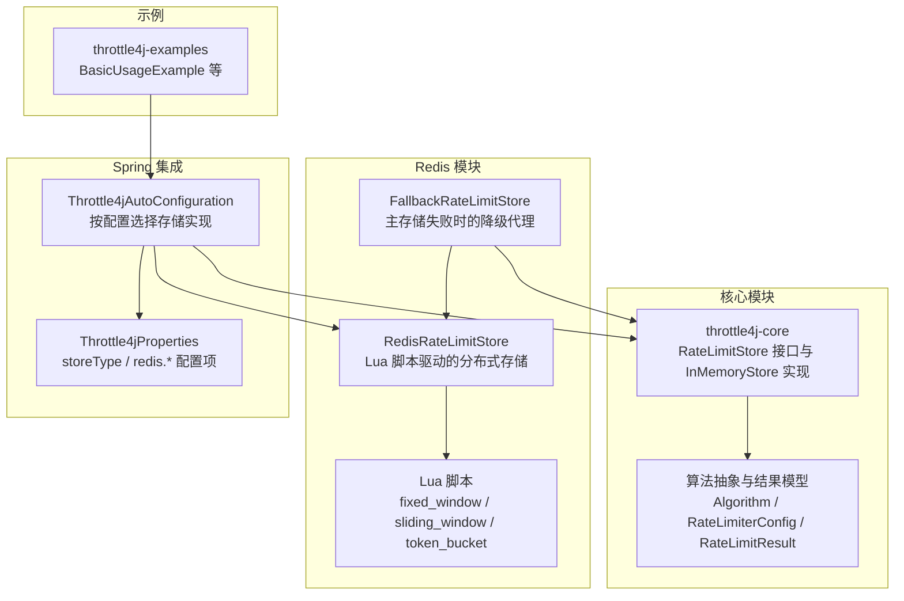
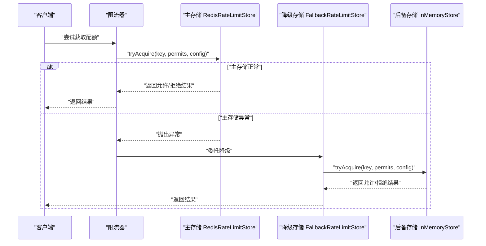
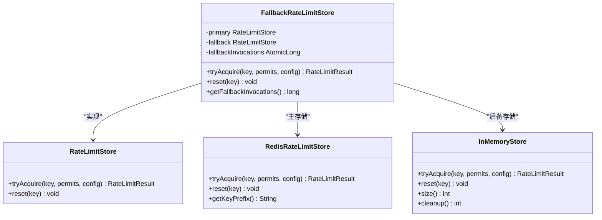
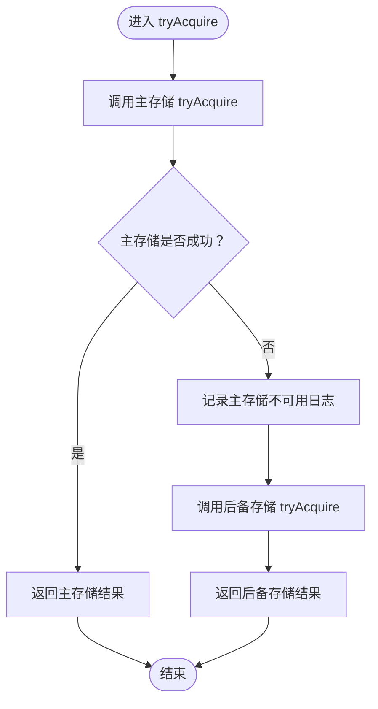
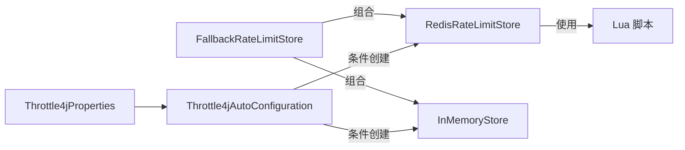

# 降级机制设计

<cite>
**本文引用的文件**
- [FallbackRateLimitStore.java](file://throttle4j-redis/src/main/java/com/throttle4j/redis/FallbackRateLimitStore.java)
- [RedisRateLimitStore.java](file://throttle4j-redis/src/main/java/com/throttle4j/redis/RedisRateLimitStore.java)
- [RedisRateLimitStoreBuilder.java](file://throttle4j-redis/src/main/java/com/throttle4j/redis/RedisRateLimitStoreBuilder.java)
- [RateLimitStore.java](file://throttle4j-core/src/main/java/com/throttle4j/store/RateLimitStore.java)
- [InMemoryStore.java](file://throttle4j-core/src/main/java/com/throttle4j/store/InMemoryStore.java)
- [Throttle4jAutoConfiguration.java](file://throttle4j-spring-boot-starter/src/main/java/com/throttle4j/spring/autoconfigure/Throttle4jAutoConfiguration.java)
- [Throttle4jProperties.java](file://throttle4j-spring-boot-starter/src/main/java/com/throttle4j/spring/autoconfigure/Throttle4jProperties.java)
- [fixed_window.lua](file://throttle4j-redis/src/main/resources/scripts/fixed_window.lua)
- [sliding_window.lua](file://throttle4j-redis/src/main/resources/scripts/sliding_window.lua)
- [token_bucket.lua](file://throttle4j-redis/src/main/resources/scripts/token_bucket.lua)
- [FallbackRateLimitStoreTest.java](file://throttle4j-redis/src/test/java/com/throttle4j/redis/FallbackRateLimitStoreTest.java)
- [RateLimiterConfig.java](file://throttle4j-core/src/main/java/com/throttle4j/core/RateLimiterConfig.java)
- [Algorithm.java](file://throttle4j-core/src/main/java/com/throttle4j/core/Algorithm.java)
- [RateLimitResult.java](file://throttle4j-core/src/main/java/com/throttle4j/core/RateLimitResult.java)
</cite>

## 目录
1. [引言](#引言)
2. [项目结构](#项目结构)
3. [核心组件](#核心组件)
4. [架构总览](#架构总览)
5. [详细组件分析](#详细组件分析)
6. [依赖关系分析](#依赖关系分析)
7. [性能考量](#性能考量)
8. [故障排查指南](#故障排查指南)
9. [结论](#结论)
10. [附录](#附录)

## 引言
本文件围绕降级机制设计展开，重点解释降级存储（FallbackRateLimitStore）的工作原理与实现策略，剖析Redis不可用时的自动切换机制（检测逻辑、切换条件与回退策略），阐述降级状态的管理（触发条件、持续时间与恢复机制），给出配置选项与行为控制说明，并讨论降级期间的限流行为与数据一致性考虑。同时提供监控指标、告警策略与运维建议，测试方法与验证策略，以及降级对系统整体可用性与性能的影响评估。

## 项目结构
本项目采用多模块组织，核心能力由以下模块组成：
- throttle4j-core：定义限流核心接口与通用实现（如内存存储、算法与结果模型）
- throttle4j-redis：基于Redis的分布式存储实现，包含Lua脚本与降级包装器
- throttle4j-spring-boot-starter：Spring Boot自动装配，负责根据配置选择存储实现
- throttle4j-examples：示例工程，演示基本使用方式

图表来源
- [RateLimitStore.java](file://throttle4j-core/src/main/java/com/throttle4j/store/RateLimitStore.java)
- [InMemoryStore.java](file://throttle4j-core/src/main/java/com/throttle4j/store/InMemoryStore.java)
- [RedisRateLimitStore.java](file://throttle4j-redis/src/main/java/com/throttle4j/redis/RedisRateLimitStore.java)
- [FallbackRateLimitStore.java](file://throttle4j-redis/src/main/java/com/throttle4j/redis/FallbackRateLimitStore.java)
- [Throttle4jAutoConfiguration.java](file://throttle4j-spring-boot-starter/src/main/java/com/throttle4j/spring/autoconfigure/Throttle4jAutoConfiguration.java)
- [Throttle4jProperties.java](file://throttle4j-spring-boot-starter/src/main/java/com/throttle4j/spring/autoconfigure/Throttle4jProperties.java)

章节来源
- [Throttle4jAutoConfiguration.java:1-132](file://throttle4j-spring-boot-starter/src/main/java/com/throttle4j/spring/autoconfigure/Throttle4jAutoConfiguration.java#L1-L132)
- [Throttle4jProperties.java:1-202](file://throttle4j-spring-boot-starter/src/main/java/com/throttle4j/spring/autoconfigure/Throttle4jProperties.java#L1-L202)

## 核心组件
- RateLimitStore 接口：定义限流状态存储的统一抽象，提供 tryAcquire 与 reset 两个关键方法
- InMemoryStore：基于内存的本地存储，支持固定窗口、滑动窗口、令牌桶与漏桶算法，具备定时清理空闲键的能力
- RedisRateLimitStore：基于Redis的分布式存储，通过Lua脚本原子执行算法逻辑，支持三种算法
- FallbackRateLimitStore：主存储失败时的降级代理，透明地将请求转发到后备存储，并统计降级调用次数
- Spring 自动装配：根据配置选择存储实现，当 storeType=REDIS 且Redis模块不可用时回退到 InMemoryStore

章节来源
- [RateLimitStore.java:1-35](file://throttle4j-core/src/main/java/com/throttle4j/store/RateLimitStore.java#L1-L35)
- [InMemoryStore.java:1-315](file://throttle4j-core/src/main/java/com/throttle4j/store/InMemoryStore.java#L1-L315)
- [RedisRateLimitStore.java:1-258](file://throttle4j-redis/src/main/java/com/throttle4j/redis/RedisRateLimitStore.java#L1-L258)
- [FallbackRateLimitStore.java:1-78](file://throttle4j-redis/src/main/java/com/throttle4j/redis/FallbackRateLimitStore.java#L1-L78)
- [Throttle4jAutoConfiguration.java:1-132](file://throttle4j-spring-boot-starter/src/main/java/com/throttle4j/spring/autoconfigure/Throttle4jAutoConfiguration.java#L1-L132)

## 架构总览
降级机制在“主存储（Redis）+ 备用存储（内存）”的双存储架构上运行。当主存储抛出异常时，降级代理会记录一次降级调用并转而使用备用存储继续提供限流服务。重置操作会广播到两个存储，确保状态一致。

图表来源
- [FallbackRateLimitStore.java:44-76](file://throttle4j-redis/src/main/java/com/throttle4j/redis/FallbackRateLimitStore.java#L44-L76)
- [RedisRateLimitStore.java:80-118](file://throttle4j-redis/src/main/java/com/throttle4j/redis/RedisRateLimitStore.java#L80-L118)
- [InMemoryStore.java:68-101](file://throttle4j-core/src/main/java/com/throttle4j/store/InMemoryStore.java#L68-L101)

## 详细组件分析

### 降级存储（FallbackRateLimitStore）工作原理
- 角色定位：作为主存储的透明代理，在主存储发生异常时自动切换至后备存储
- 切换条件：捕获主存储的任意异常即触发降级；成功路径不调用后备存储
- 回退策略：在日志中记录主存储不可用并降级原因，随后调用后备存储的 tryAcquire 与 reset
- 统计指标：维护降级调用计数器，便于监控与告警
- 线程安全：遵循底层存储的线程安全约定

图表来源
- [FallbackRateLimitStore.java:27-76](file://throttle4j-redis/src/main/java/com/throttle4j/redis/FallbackRateLimitStore.java#L27-L76)
- [RedisRateLimitStore.java:40-118](file://throttle4j-redis/src/main/java/com/throttle4j/redis/RedisRateLimitStore.java#L40-L118)
- [InMemoryStore.java:24-101](file://throttle4j-core/src/main/java/com/throttle4j/store/InMemoryStore.java#L24-L101)
- [RateLimitStore.java:15-34](file://throttle4j-core/src/main/java/com/throttle4j/store/RateLimitStore.java#L15-L34)

章节来源
- [FallbackRateLimitStore.java:12-76](file://throttle4j-redis/src/main/java/com/throttle4j/redis/FallbackRateLimitStore.java#L12-L76)

### Redis 不可用时的自动切换机制
- 检测逻辑：在 tryAcquire 中捕获主存储抛出的异常，立即降级
- 切换条件：任何异常均触发降级；重置操作分别对主存储与后备存储进行调用，异常被吞掉以保证幂等性
- 回退策略：后备存储为 InMemoryStore，提供节点内限流能力，避免系统完全失效
- 关键点：reset 广播到两个存储，确保降级期间的状态一致性

图表来源
- [FallbackRateLimitStore.java:44-76](file://throttle4j-redis/src/main/java/com/throttle4j/redis/FallbackRateLimitStore.java#L44-L76)

章节来源
- [FallbackRateLimitStore.java:44-76](file://throttle4j-redis/src/main/java/com/throttle4j/redis/FallbackRateLimitStore.java#L44-L76)

### 降级状态管理
- 触发条件：主存储在 tryAcquire 或 reset 任一阶段抛出异常
- 持续时间：无显式“降期”概念，降级状态随异常出现而存在，恢复正常后自动退出
- 恢复机制：当主存储恢复后，后续请求将直接走主存储；后备存储仅在异常路径被调用
- 状态一致性：reset 广播到两个存储，确保降级期间本地状态也被清除

章节来源
- [FallbackRateLimitStore.java:59-71](file://throttle4j-redis/src/main/java/com/throttle4j/redis/FallbackRateLimitStore.java#L59-L71)

### 降级期间的限流行为与数据一致性
- 限流行为：后备存储为 InMemoryStore，提供节点内的限流能力，不同节点间不共享状态
- 数据一致性：Redis 存储与内存存储各自独立，降级期间不会跨节点同步；reset 广播确保同一实例内状态一致
- 结果模型：返回值包含 allowed、remaining、resetAt、retryAfterMillis，供上层处理

章节来源
- [InMemoryStore.java:68-263](file://throttle4j-core/src/main/java/com/throttle4j/store/InMemoryStore.java#L68-L263)
- [RateLimitResult.java:1-68](file://throttle4j-core/src/main/java/com/throttle4j/core/RateLimitResult.java#L1-L68)

### 配置选项与行为控制
- Spring 属性
  - throttle4j.enabled：全局开关，默认启用
  - throttle4j.storeType：存储类型，MEMORY 或 REDIS
  - throttle4j.redis.host/port/password/database/keyPrefix：Redis 连接参数
- 自动装配逻辑
  - 当 storeType=REDIS 且 Redis 模块在类路径上时，优先创建 Redis 存储
  - 若 Redis 模块不在类路径上，则回退到 InMemoryStore 并输出警告
- 构建器
  - RedisRateLimitStoreBuilder 支持设置 RedisCommands 与 keyPrefix

章节来源
- [Throttle4jProperties.java:1-202](file://throttle4j-spring-boot-starter/src/main/java/com/throttle4j/spring/autoconfigure/Throttle4jProperties.java#L1-L202)
- [Throttle4jAutoConfiguration.java:34-99](file://throttle4j-spring-boot-starter/src/main/java/com/throttle4j/spring/autoconfigure/Throttle4jAutoConfiguration.java#L34-L99)
- [RedisRateLimitStoreBuilder.java:1-61](file://throttle4j-redis/src/main/java/com/throttle4j/redis/RedisRateLimitStoreBuilder.java#L1-L61)

### 降级机制的算法与脚本支撑
- Redis 分布式算法：固定窗口、滑动窗口、令牌桶（漏桶复用令牌桶逻辑）
- Lua 脚本：在 Redis 侧原子化执行算法，减少往返与竞态
- 算法选择：由 RateLimiterConfig 决定，支持 FIXED_WINDOW、SLIDING_WINDOW、TOKEN_BUCKET、LEAKY_BUCKET

章节来源
- [RedisRateLimitStore.java:22-118](file://throttle4j-redis/src/main/java/com/throttle4j/redis/RedisRateLimitStore.java#L22-L118)
- [fixed_window.lua:1-46](file://throttle4j-redis/src/main/resources/scripts/fixed_window.lua#L1-L46)
- [sliding_window.lua:1-49](file://throttle4j-redis/src/main/resources/scripts/sliding_window.lua#L1-L49)
- [token_bucket.lua:1-58](file://throttle4j-redis/src/main/resources/scripts/token_bucket.lua#L1-L58)
- [Algorithm.java:1-16](file://throttle4j-core/src/main/java/com/throttle4j/core/Algorithm.java#L1-L16)
- [RateLimiterConfig.java:1-113](file://throttle4j-core/src/main/java/com/throttle4j/core/RateLimiterConfig.java#L1-L113)

## 依赖关系分析
- FallbackRateLimitStore 依赖 RateLimitStore 接口，组合 RedisRateLimitStore 与 InMemoryStore
- RedisRateLimitStore 依赖 Lettuce 的 RedisCommands 与 Lua 脚本资源
- Spring 自动装配在运行时根据配置动态选择存储实现，避免硬耦合

图表来源
- [FallbackRateLimitStore.java:31-42](file://throttle4j-redis/src/main/java/com/throttle4j/redis/FallbackRateLimitStore.java#L31-L42)
- [RedisRateLimitStore.java:51-78](file://throttle4j-redis/src/main/java/com/throttle4j/redis/RedisRateLimitStore.java#L51-L78)
- [Throttle4jAutoConfiguration.java:45-57](file://throttle4j-spring-boot-starter/src/main/java/com/throttle4j/spring/autoconfigure/Throttle4jAutoConfiguration.java#L45-L57)
- [Throttle4jProperties.java:76-98](file://throttle4j-spring-boot-starter/src/main/java/com/throttle4j/spring/autoconfigure/Throttle4jProperties.java#L76-L98)

章节来源
- [FallbackRateLimitStore.java:27-42](file://throttle4j-redis/src/main/java/com/throttle4j/redis/FallbackRateLimitStore.java#L27-L42)
- [RedisRateLimitStore.java:40-78](file://throttle4j-redis/src/main/java/com/throttle4j/redis/RedisRateLimitStore.java#L40-L78)
- [Throttle4jAutoConfiguration.java:45-57](file://throttle4j-spring-boot-starter/src/main/java/com/throttle4j/spring/autoconfigure/Throttle4jAutoConfiguration.java#L45-L57)

## 性能考量
- 降级期间的性能特征
  - 主存储异常时，降级到 InMemoryStore，避免网络抖动与外部依赖，但限流范围仅限单节点
  - 令牌桶/漏桶算法在 Redis 上通过 Lua 原子执行，延迟低；内存实现同样为原子化逻辑
- 可扩展性
  - 多节点部署下，降级不会跨节点同步，需结合业务容忍度评估
  - 可通过增加节点数量提升整体容量，但需注意不同节点的限流边界
- 资源占用
  - InMemoryStore 提供定时清理空闲键，降低内存占用；可通过构造参数调整清理周期与空闲阈值

章节来源
- [InMemoryStore.java:24-66](file://throttle4j-core/src/main/java/com/throttle4j/store/InMemoryStore.java#L24-L66)

## 故障排查指南
- 常见问题
  - Redis 不可用导致频繁降级：检查网络连通性、认证信息与数据库索引
  - 降级调用计数持续增长：确认主存储异常是否可恢复，或是否需要扩大节点规模
  - 限流阈值与窗口配置不当：核对 RateLimiterConfig 的 limit、windowMillis、refillRate
- 日志与监控
  - 降级触发时会记录主存储不可用的日志，便于定位异常
  - 使用 getFallbackInvocations 获取降级调用次数，作为告警依据
- 验证策略
  - 单元测试覆盖主存储成功短路、主存储失败回退、多次失败计数、reset 广播与异常吞没等场景

章节来源
- [FallbackRateLimitStoreTest.java:1-128](file://throttle4j-redis/src/test/java/com/throttle4j/redis/FallbackRateLimitStoreTest.java#L1-L128)
- [FallbackRateLimitStore.java:44-76](file://throttle4j-redis/src/main/java/com/throttle4j/redis/FallbackRateLimitStore.java#L44-L76)

## 结论
降级机制通过“主存储异常即刻回退”的策略，确保在 Redis 不可用时仍能提供节点内限流能力，维持系统基本可用。其核心在于 FallbackRateLimitStore 对异常的透明捕获与后备存储的即时接管，配合 reset 广播保证状态一致性。Spring 自动装配使配置灵活可控，既可启用 Redis 分布式限流，也可在缺失依赖时平滑回退到内存实现。实际部署中应结合业务对跨节点一致性与容量的需求，合理配置算法与参数，并建立完善的监控与告警体系。

## 附录

### 监控指标与告警策略
- 指标
  - 降级调用次数：getFallbackInvocations，用于衡量降级频率
  - 主存储异常日志：用于定位故障根因
  - Redis 连接与命令耗时：辅助判断主存储可用性
- 告警
  - 降级调用次数在短时间内显著上升
  - Redis 连接失败或命令超时持续出现
  - reset 广播失败（若需强一致，可基于日志与指标综合判断）

章节来源
- [FallbackRateLimitStore.java:73-76](file://throttle4j-redis/src/main/java/com/throttle4j/redis/FallbackRateLimitStore.java#L73-L76)

### 运维建议
- 在生产环境优先启用 Redis 分布式存储，确保跨节点一致性
- 为 InMemoryStore 设置合理的空闲清理阈值与清理周期，避免内存泄漏
- 将 Redis 连接参数（host/port/password/database/keyPrefix）纳入配置中心管理
- 对降级事件建立值班与应急预案，快速定位并修复主存储问题

章节来源
- [Throttle4jProperties.java:153-200](file://throttle4j-spring-boot-starter/src/main/java/com/throttle4j/spring/autoconfigure/Throttle4jProperties.java#L153-L200)
- [InMemoryStore.java:42-66](file://throttle4j-core/src/main/java/com/throttle4j/store/InMemoryStore.java#L42-L66)

### 测试方法与验证策略
- 行为验证
  - 主存储成功时不应触发后备存储
  - 主存储异常时应正确回退并计数
  - reset 应广播到两个存储，异常被吞掉
- 方法参考
  - 使用 Mockito 模拟主存储异常与后备存储响应
  - 断言 getFallbackInvocations 计数与 reset 调用次数

章节来源
- [FallbackRateLimitStoreTest.java:53-114](file://throttle4j-redis/src/test/java/com/throttle4j/redis/FallbackRateLimitStoreTest.java#L53-L114)

### 降级对系统可用性与性能的影响评估
- 可用性
  - 降级确保在 Redis 不可用时系统仍可限流，避免完全失效
  - 多节点部署下，降级不跨节点同步，需结合业务容忍度评估
- 性能
  - 降级期间为本地限流，避免网络开销，但无法共享配额
  - 算法在 Redis 侧原子执行，延迟较低；内存实现同样高效

章节来源
- [RedisRateLimitStore.java:22-38](file://throttle4j-redis/src/main/java/com/throttle4j/redis/RedisRateLimitStore.java#L22-L38)
- [InMemoryStore.java:17-22](file://throttle4j-core/src/main/java/com/throttle4j/store/InMemoryStore.java#L17-L22)