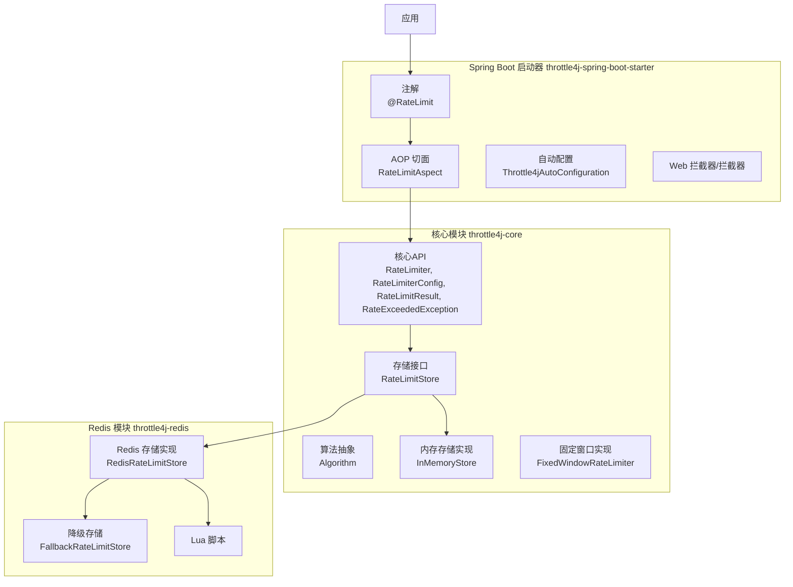
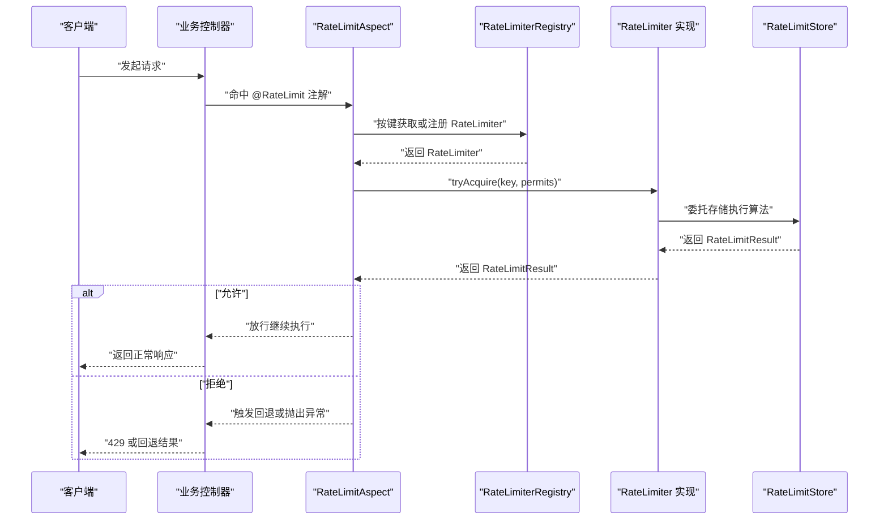
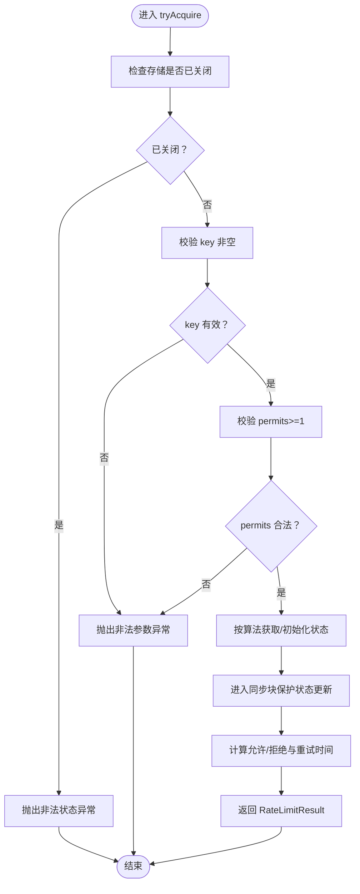
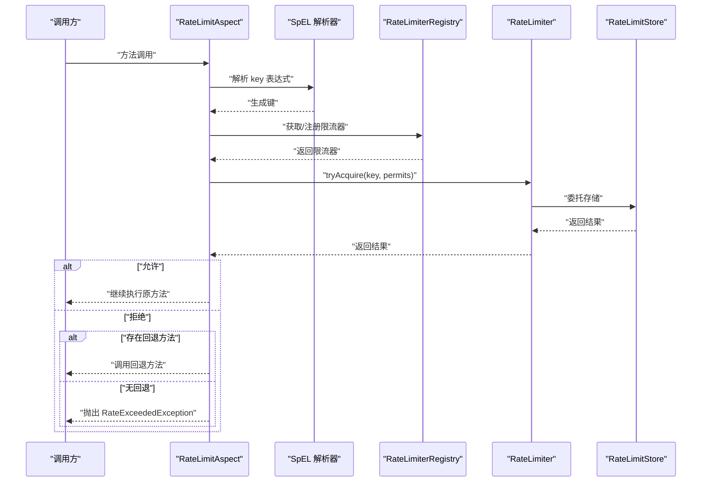
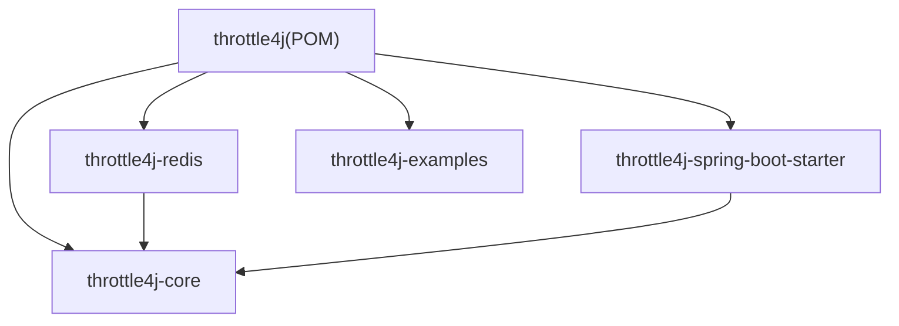

# 代码规范

<cite>
**本文引用的文件**
- [README.md](file://README.md)
- [CONTRIBUTING.md](file://CONTRIBUTING.md)
- [ROADMAP.md](file://ROADMAP.md)
- [pom.xml](file://pom.xml)
- [throttle4j-core/pom.xml](file://throttle4j-core/pom.xml)
- [RateLimiter.java](file://throttle4j-core/src/main/java/com/throttle4j/core/RateLimiter.java)
- [RateLimiterConfig.java](file://throttle4j-core/src/main/java/com/throttle4j/core/RateLimiterConfig.java)
- [Algorithm.java](file://throttle4j-core/src/main/java/com/throttle4j/core/Algorithm.java)
- [RateLimitResult.java](file://throttle4j-core/src/main/java/com/throttle4j/core/RateLimitResult.java)
- [RateExceededException.java](file://throttle4j-core/src/main/java/com/throttle4j/core/RateExceededException.java)
- [RateLimitStore.java](file://throttle4j-core/src/main/java/com/throttle4j/store/RateLimitStore.java)
- [InMemoryStore.java](file://throttle4j-core/src/main/java/com/throttle4j/store/InMemoryStore.java)
- [FixedWindowRateLimiter.java](file://throttle4j-core/src/main/java/com/throttle4j/algorithm/FixedWindowRateLimiter.java)
- [RateLimit.java](file://throttle4j-spring-boot-starter/src/main/java/com/throttle4j/spring/annotation/RateLimit.java)
- [RateLimitAspect.java](file://throttle4j-spring-boot-starter/src/main/java/com/throttle4j/spring/aop/RateLimitAspect.java)
</cite>

## 目录
1. [引言](#引言)
2. [项目结构](#项目结构)
3. [核心组件](#核心组件)
4. [架构总览](#架构总览)
5. [详细组件分析](#详细组件分析)
6. [依赖分析](#依赖分析)
7. [性能考虑](#性能考虑)
8. [故障排查指南](#故障排查指南)
9. [结论](#结论)
10. [附录](#附录)

## 引言
本指南面向 throttle4j 项目的贡献者与使用者，系统化阐述代码规范与最佳实践，涵盖以下方面：
- Google Java Style Guide 的具体落地要求（缩进、行宽、命名约定等）
- 公共 API 的 Javadoc 规范（含 @param、@return、@throws）
- 空安全编程实践（推荐使用 Optional 与非空校验）
- 并发编程规范（线程安全声明与实现要点）
- 导入管理与无用代码清理要求
- 结合项目现有实现的示例与建议

上述规范与示例均基于仓库中现有源码与文档进行提炼，确保可执行与一致性。

## 项目结构
throttle4j 采用多模块结构，核心能力集中在核心模块，扩展能力分布在 Redis 分布式存储与 Spring Boot 自动装配模块中。下图展示模块间关系与职责：

图表来源
- [README.md](file://README.md)
- [RateLimiter.java](file://throttle4j-core/src/main/java/com/throttle4j/core/RateLimiter.java)
- [RateLimitStore.java](file://throttle4j-core/src/main/java/com/throttle4j/store/RateLimitStore.java)
- [InMemoryStore.java](file://throttle4j-core/src/main/java/com/throttle4j/store/InMemoryStore.java)
- [FixedWindowRateLimiter.java](file://throttle4j-core/src/main/java/com/throttle4j/algorithm/FixedWindowRateLimiter.java)
- [RateLimit.java](file://throttle4j-spring-boot-starter/src/main/java/com/throttle4j/spring/annotation/RateLimit.java)
- [RateLimitAspect.java](file://throttle4j-spring-boot-starter/src/main/java/com/throttle4j/spring/aop/RateLimitAspect.java)

章节来源
- [README.md](file://README.md)
- [pom.xml](file://pom.xml)
- [throttle4j-core/pom.xml](file://throttle4j-core/pom.xml)

## 核心组件
本节聚焦于核心 API 与关键实现，梳理其设计原则、线程安全承诺与并发实现方式，并给出规范化的 Javadoc 示例路径。

- 核心接口与模型
  - RateLimiter：定义尝试获取配额的公共 API，要求实现线程安全。
  - RateLimiterConfig：不可变配置，通过 Builder 构建并进行参数校验。
  - RateLimitResult：封装允许/拒绝结果与重试建议。
  - RateExceededException：当请求被拒绝时抛出的异常，携带键与结果信息。
  - Algorithm：枚举支持的限流算法。
  - RateLimitStore：存储抽象，要求实现线程安全。
  - InMemoryStore：基于并发容器的内存存储实现，包含定时清理与关闭逻辑。
  - FixedWindowRateLimiter：基于存储的固定窗口实现。

- 并发与线程安全
  - 核心接口与存储契约明确要求线程安全。
  - InMemoryStore 使用并发映射与同步块保护状态更新，定时清理任务为守护线程。
  - RateLimiterConfig 的构建过程包含严格的参数校验，避免无效配置进入运行期。

- 空安全与返回值
  - 建议对可能为空的返回值使用 Optional；对于构造函数与公共 API 的参数，使用非空校验（如 Objects.requireNonNull）。
  - 现有实现中对关键输入（如 key、permits、config）进行了显式的非空与范围检查。

- Javadoc 规范
  - 所有公共类与方法必须包含 Javadoc，且至少包含 @param、@return、@throws（适用时）。
  - 示例参考路径：
    - [RateLimiter.java](file://throttle4j-core/src/main/java/com/throttle4j/core/RateLimiter.java)
    - [RateLimiterConfig.java](file://throttle4j-core/src/main/java/com/throttle4j/core/RateLimiterConfig.java)
    - [RateLimitResult.java](file://throttle4j-core/src/main/java/com/throttle4j/core/RateLimitResult.java)
    - [RateExceededException.java](file://throttle4j-core/src/main/java/com/throttle4j/core/RateExceededException.java)
    - [RateLimitStore.java](file://throttle4j-core/src/main/java/com/throttle4j/store/RateLimitStore.java)
    - [InMemoryStore.java](file://throttle4j-core/src/main/java/com/throttle4j/store/InMemoryStore.java)

章节来源
- [RateLimiter.java](file://throttle4j-core/src/main/java/com/throttle4j/core/RateLimiter.java)
- [RateLimiterConfig.java](file://throttle4j-core/src/main/java/com/throttle4j/core/RateLimiterConfig.java)
- [Algorithm.java](file://throttle4j-core/src/main/java/com/throttle4j/core/Algorithm.java)
- [RateLimitResult.java](file://throttle4j-core/src/main/java/com/throttle4j/core/RateLimitResult.java)
- [RateExceededException.java](file://throttle4j-core/src/main/java/com/throttle4j/core/RateExceededException.java)
- [RateLimitStore.java](file://throttle4j-core/src/main/java/com/throttle4j/store/RateLimitStore.java)
- [InMemoryStore.java](file://throttle4j-core/src/main/java/com/throttle4j/store/InMemoryStore.java)
- [FixedWindowRateLimiter.java](file://throttle4j-core/src/main/java/com/throttle4j/algorithm/FixedWindowRateLimiter.java)

## 架构总览
下图展示从应用到核心算法与存储的调用链路，以及 Spring Boot 注解驱动的 AOP 流程：

图表来源
- [RateLimit.java](file://throttle4j-spring-boot-starter/src/main/java/com/throttle4j/spring/annotation/RateLimit.java)
- [RateLimitAspect.java](file://throttle4j-spring-boot-starter/src/main/java/com/throttle4j/spring/aop/RateLimitAspect.java)
- [RateLimiter.java](file://throttle4j-core/src/main/java/com/throttle4j/core/RateLimiter.java)
- [RateLimitStore.java](file://throttle4j-core/src/main/java/com/throttle4j/store/RateLimitStore.java)

## 详细组件分析

### 组件一：核心 API 设计与 Javadoc 规范
- 设计要点
  - 接口最小化：仅暴露必要的 tryAcquire 与配置查询方法，便于扩展不同算法与存储。
  - 不可变配置：通过 Builder 构建并校验参数，避免运行期错误。
  - 结果模型清晰：统一返回 RateLimitResult，便于上层处理允许/拒绝与重试建议。
  - 异常模型明确：RateExceededException 携带键与结果，便于日志与监控。

- Javadoc 规范示例路径
  - [RateLimiter.tryAcquire(String)](file://throttle4j-core/src/main/java/com/throttle4j/core/RateLimiter.java)
  - [RateLimiterConfig.Builder.build()](file://throttle4j-core/src/main/java/com/throttle4j/core/RateLimiterConfig.java)
  - [RateLimitResult.allowed(...) / rejected(...)](file://throttle4j-core/src/main/java/com/throttle4j/core/RateLimitResult.java)
  - [RateExceededException 构造与字段访问](file://throttle4j-core/src/main/java/com/throttle4j/core/RateExceededException.java)

- 并发与线程安全
  - 接口与存储契约明确要求线程安全，InMemoryStore 在关键路径使用同步块与并发容器，确保多线程下的正确性。

- 空安全与返回值
  - 建议对可能为空的返回值使用 Optional；对构造函数与公共 API 参数进行非空校验。

章节来源
- [RateLimiter.java](file://throttle4j-core/src/main/java/com/throttle4j/core/RateLimiter.java)
- [RateLimiterConfig.java](file://throttle4j-core/src/main/java/com/throttle4j/core/RateLimiterConfig.java)
- [RateLimitResult.java](file://throttle4j-core/src/main/java/com/throttle4j/core/RateLimitResult.java)
- [RateExceededException.java](file://throttle4j-core/src/main/java/com/throttle4j/core/RateExceededException.java)
- [RateLimitStore.java](file://throttle4j-core/src/main/java/com/throttle4j/store/RateLimitStore.java)
- [InMemoryStore.java](file://throttle4j-core/src/main/java/com/throttle4j/store/InMemoryStore.java)

### 组件二：内存存储实现与并发控制
- 数据结构与复杂度
  - 使用并发映射保存各算法的状态，查找与插入平均 O(1)，删除受清理策略影响。
  - 定时清理任务按固定间隔扫描并移除长时间未访问的键，降低内存占用。

- 处理流程与边界
  - tryAcquire 对输入进行严格校验，拒绝空键、非法 permits 数与已关闭状态。
  - 同步块保护每个键的状态更新，避免并发竞争导致的计数错误。

- 清理与资源管理
  - 提供手动清理与关闭方法；关闭时中断清理线程，防止资源泄漏。

图表来源
- [InMemoryStore.java](file://throttle4j-core/src/main/java/com/throttle4j/store/InMemoryStore.java)

章节来源
- [InMemoryStore.java](file://throttle4j-core/src/main/java/com/throttle4j/store/InMemoryStore.java)

### 组件三：Spring Boot 注解与 AOP 切面
- 注解设计
  - @RateLimit 支持 SpEL 表达式解析键、窗口、算法与配额，提供回退方法与默认键生成策略。
  - 关键属性包含 @param、@return 与行为说明，符合 Javadoc 规范。

- AOP 切面流程
  - 解析注解与 SpEL 表达式生成键；从注册表获取或创建限流器；根据结果选择放行、回退或抛出异常。
  - 使用表达式缓存与参数名发现提升性能与可用性。

图表来源
- [RateLimit.java](file://throttle4j-spring-boot-starter/src/main/java/com/throttle4j/spring/annotation/RateLimit.java)
- [RateLimitAspect.java](file://throttle4j-spring-boot-starter/src/main/java/com/throttle4j/spring/aop/RateLimitAspect.java)

章节来源
- [RateLimit.java](file://throttle4j-spring-boot-starter/src/main/java/com/throttle4j/spring/annotation/RateLimit.java)
- [RateLimitAspect.java](file://throttle4j-spring-boot-starter/src/main/java/com/throttle4j/spring/aop/RateLimitAspect.java)

## 依赖分析
- 模块依赖
  - throttle4j-core：无 Spring 依赖，提供算法、配置、内存存储与核心 API。
  - throttle4j-redis：基于 Lettuce 与 Lua 脚本实现分布式存储，具备优雅降级能力。
  - throttle4j-spring-boot-starter：提供自动配置、AOP 切面与 Web 拦截器，零配置集成。
  - throttle4j-examples：示例模块，演示各算法与集成方式。

- 外部依赖与版本管理
  - 顶层 POM 统一管理 Java 版本、插件版本与依赖 BOM。
  - 核心模块引入 slf4j-api，测试模块引入 JUnit 与 Mockito。

图表来源
- [pom.xml](file://pom.xml)
- [throttle4j-core/pom.xml](file://throttle4j-core/pom.xml)

章节来源
- [pom.xml](file://pom.xml)
- [throttle4j-core/pom.xml](file://throttle4j-core/pom.xml)

## 性能考虑
- 算法选择
  - Token Bucket 适合突发流量与平均速率控制；Sliding Window 更公平地分配配额；Leaky Bucket 适合稳定输出压力；Fixed Window 简单但边界抖动较大。
- 存储与并发
  - 内存存储使用并发容器与同步块，适合单机高并发场景；Redis 存储通过原子 Lua 脚本保障一致性。
- 清理策略
  - InMemoryStore 提供空闲键清理与关闭钩子，避免长期运行导致的内存膨胀。
- AOP 与表达式
  - RateLimitAspect 缓存 SpEL 表达式与参数名，减少重复解析开销。

## 故障排查指南
- 常见问题定位
  - 请求被拒绝：检查 RateLimitResult 中的 remaining、resetAt 与 retryAfterMillis 字段，结合日志与监控定位瓶颈。
  - 注解未生效：确认方法可见性、所在 Bean 是否为 Spring 管理，以及 AOP 是否启用。
  - 回退方法未调用：检查注解中 fallbackMethod 名称与签名是否匹配目标 Bean 方法。
  - Redis 可用性：关注降级开关与异常日志，必要时切换至本地存储验证问题来源。

- 相关实现参考
  - [RateLimitAspect around 流程与异常分支](file://throttle4j-spring-boot-starter/src/main/java/com/throttle4j/spring/aop/RateLimitAspect.java)
  - [RateExceededException 异常模型](file://throttle4j-core/src/main/java/com/throttle4j/core/RateExceededException.java)
  - [InMemoryStore 关闭与清理](file://throttle4j-core/src/main/java/com/throttle4j/store/InMemoryStore.java)

章节来源
- [RateLimitAspect.java](file://throttle4j-spring-boot-starter/src/main/java/com/throttle4j/spring/aop/RateLimitAspect.java)
- [RateExceededException.java](file://throttle4j-core/src/main/java/com/throttle4j/core/RateExceededException.java)
- [InMemoryStore.java](file://throttle4j-core/src/main/java/com/throttle4j/store/InMemoryStore.java)

## 结论
本指南基于 throttle4j 的现有实现，总结了代码风格、Javadoc、空安全、并发与导入管理等方面的规范与最佳实践。建议在后续开发中：
- 严格遵循 Google Java Style Guide 的缩进、行宽与命名约定
- 为所有公共 API 提供完整的 Javadoc（@param/@return/@throws）
- 优先使用 Optional 与非空校验，提升空安全
- 明确标注线程安全保证，确保并发正确性
- 清理无用导入，保持代码整洁

## 附录

### Google Java Style Guide 落地清单
- 缩进：4 个空格，禁止使用制表符
- 行宽：优先不超过 120 列
- 命名约定：
  - 类：PascalCase
  - 方法/字段：camelCase
  - 常量：UPPER_SNAKE_CASE
- 导入管理：禁用通配符导入，提交前清理未使用导入
- 空安全：优先使用 Optional；对构造函数与公共 API 参数进行非空校验
- 并发：在公共类型上明确线程安全保证

章节来源
- [CONTRIBUTING.md](file://CONTRIBUTING.md)

### 公共 API Javadoc 规范示例路径
- [RateLimiter.tryAcquire(String)](file://throttle4j-core/src/main/java/com/throttle4j/core/RateLimiter.java)
- [RateLimiterConfig.Builder.build()](file://throttle4j-core/src/main/java/com/throttle4j/core/RateLimiterConfig.java)
- [RateLimitResult.allowed(...) / rejected(...)](file://throttle4j-core/src/main/java/com/throttle4j/core/RateLimitResult.java)
- [RateExceededException 构造与字段访问](file://throttle4j-core/src/main/java/com/throttle4j/core/RateExceededException.java)
- [RateLimitStore.tryAcquire(...) / reset(...)](file://throttle4j-core/src/main/java/com/throttle4j/store/RateLimitStore.java)
- [@RateLimit 注解属性与行为](file://throttle4j-spring-boot-starter/src/main/java/com/throttle4j/spring/annotation/RateLimit.java)

### 并发编程规范要点
- 公共类型与接口需在 Javadoc 中声明线程安全级别（例如“线程安全”、“仅在外部同步下线程安全”等）
- InMemoryStore 已通过并发容器与同步块实现线程安全，相关实现参考：
  - [InMemoryStore.tryAcquire](file://throttle4j-core/src/main/java/com/throttle4j/store/InMemoryStore.java)
  - [InMemoryStore.cleanup/close](file://throttle4j-core/src/main/java/com/throttle4j/store/InMemoryStore.java)

### 导入管理与无用代码清理
- 禁止使用通配符导入
- 提交前清理未使用的导入
- 保持包导入顺序一致，避免混杂

章节来源
- [CONTRIBUTING.md](file://CONTRIBUTING.md)