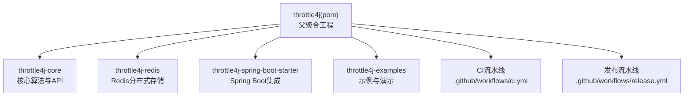
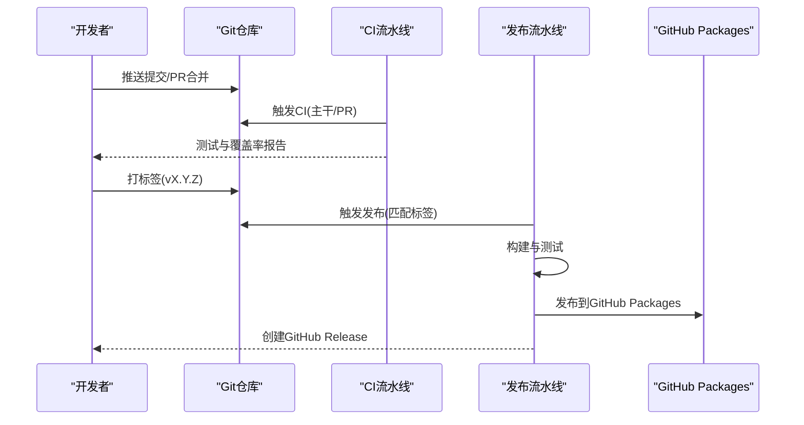
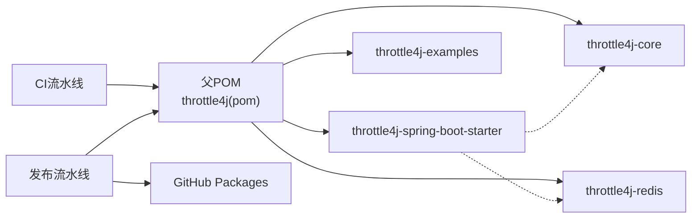

# 发布管理

<cite>
**本文引用的文件**
- [README.md](file://README.md)
- [ROADMAP.md](file://ROADMAP.md)
- [CONTRIBUTING.md](file://CONTRIBUTING.md)
- [CHANGELOG.md](file://CHANGELOG.md)
- [pom.xml](file://pom.xml)
- [.github/workflows/ci.yml](file://.github/workflows/ci.yml)
- [.github/workflows/release.yml](file://.github/workflows/release.yml)
- [throttle4j-core/pom.xml](file://throttle4j-core/pom.xml)
- [throttle4j-spring-boot-starter/pom.xml](file://throttle4j-spring-boot-starter/pom.xml)
</cite>

## 目录
1. [简介](#简介)
2. [项目结构](#项目结构)
3. [核心组件](#核心组件)
4. [架构总览](#架构总览)
5. [详细组件分析](#详细组件分析)
6. [依赖关系分析](#依赖关系分析)
7. [性能考量](#性能考量)
8. [故障排查指南](#故障排查指南)
9. [结论](#结论)
10. [附录](#附录)

## 简介
本指南面向throttle4j项目的发布与版本管理工作，涵盖版本号规则、发布周期、变更日志维护规范、Maven发布流程与GPG签名配置、里程碑与路线图管理、发布前质量检查清单与回归测试要求、以及向后兼容性与废弃策略。内容基于仓库现有配置与文档进行系统化整理，确保发布流程可追溯、可重复、可审计。

## 项目结构
throttle4j采用多模块Maven聚合工程组织，包含核心算法与API、Redis分布式存储、Spring Boot自动装配与示例模块，并通过GitHub Actions实现CI/CD流水线。

图表来源
- [pom.xml:15-20](file://pom.xml#L15-L20)
- [.github/workflows/ci.yml:1-35](file://.github/workflows/ci.yml#L1-L35)
- [.github/workflows/release.yml:1-59](file://.github/workflows/release.yml#L1-L59)

章节来源
- [pom.xml:1-193](file://pom.xml#L1-L193)
- [.github/workflows/ci.yml:1-35](file://.github/workflows/ci.yml#L1-L35)
- [.github/workflows/release.yml:1-59](file://.github/workflows/release.yml#L1-L59)

## 核心组件
- 版本号与发布标签：当前父工程使用快照版本，发布通过Git标签触发（如 v0.1.0）。
- 变更日志：遵循“保持变更日志”与语义化版本规范，使用“未发布”段落记录待发布变更。
- CI/CD：CI在主干分支与PR上运行，矩阵构建支持JDK 11与17；发布流水线在打标签时触发，执行构建、测试、打包与发布。
- 模块化：核心模块无Spring依赖，Spring Boot Starter依赖核心与可选Redis模块，便于按需引入。

章节来源
- [pom.xml:7-10](file://pom.xml#L7-L10)
- [CHANGELOG.md:1-26](file://CHANGELOG.md#L1-L26)
- [.github/workflows/ci.yml:1-35](file://.github/workflows/ci.yml#L1-L35)
- [.github/workflows/release.yml:1-59](file://.github/workflows/release.yml#L1-L59)
- [throttle4j-core/pom.xml:1-46](file://throttle4j-core/pom.xml#L1-L46)
- [throttle4j-spring-boot-starter/pom.xml:1-55](file://throttle4j-spring-boot-starter/pom.xml#L1-L55)

## 架构总览
发布与版本控制相关的关键流程如下：
- 版本号规则：语义化版本，遵循语义化版本规范。
- 发布周期：以Git标签为触发点，CI验证通过后自动发布到GitHub Packages。
- 变更日志：每次功能或修复完成后更新“未发布”段落，发布时将其合并至对应版本条目。
- 质量门禁：CI矩阵构建、覆盖率报告、单元测试与集成测试。

图表来源
- [.github/workflows/ci.yml:1-35](file://.github/workflows/ci.yml#L1-L35)
- [.github/workflows/release.yml:1-59](file://.github/workflows/release.yml#L1-L59)

## 详细组件分析

### 版本号规则与发布周期
- 版本号规则：遵循语义化版本（SemVer），变更日志明确标注遵循该规范。
- 当前版本：父工程使用快照版本（SNAPSHOT），用于开发中的迭代。
- 发布触发：通过推送Git标签（如 v0.1.0）触发发布流水线。
- 发布产物：构建并通过Maven部署到GitHub Packages（当前配置），后续可扩展至Maven Central。

章节来源
- [CHANGELOG.md:5-6](file://CHANGELOG.md#L5-L6)
- [pom.xml:7-10](file://pom.xml#L7-L10)
- [.github/workflows/release.yml:3-6](file://.github/workflows/release.yml#L3-L6)

### 变更日志维护规范与更新要求
- 维护规范：遵循“保持变更日志”格式，使用“未发布”段落记录即将发布的变更。
- 更新要求：
  - 新增功能：记录在“新增”部分。
  - 修复缺陷：记录在“修复”部分。
  - 兼容性变更：记录在“破坏性变更”部分。
  - 文档与工具链：记录在“文档”“构建”等分类下。
- 发布流程：发布前将“未发布”段落移动到对应版本号条目下，并补充日期与摘要。

章节来源
- [CHANGELOG.md:1-26](file://CHANGELOG.md#L1-L26)
- [CONTRIBUTING.md:99-100](file://CONTRIBUTING.md#L99-L100)

### Maven发布流程与GPG签名配置
- 当前发布目标：GitHub Packages（distributionManagement中配置）。
- 发布步骤（当前）：
  - 在打标签后触发发布流水线。
  - 使用Maven构建与测试（跳过测试以加速发布）。
  - 将构件发布到GitHub Packages。
  - 自动创建GitHub Release并生成发布说明。
- GPG签名：当前仓库未配置GPG签名参数；若需发布到Maven Central，应在settings.xml中配置gpg.executable与密钥信息，并在父POM中启用maven-gpg-plugin。

章节来源
- [pom.xml:184-190](file://pom.xml#L184-L190)
- [.github/workflows/release.yml:25-31](file://.github/workflows/release.yml#L25-L31)
- [.github/workflows/release.yml:28-31](file://.github/workflows/release.yml#L28-L31)

### 里程碑管理与功能路线图
- 里程碑：建议以版本号作为里程碑名称（如 v0.2.0、v0.3.0）。
- 路线图来源：ROADMAP.md中列出的功能方向与任务分解，可用于规划里程碑与迭代计划。
- 建议实践：
  - 将ROADMAP中的任务拆分为Issue并分配到对应里程碑。
  - 使用标签区分类型（enhancement、bug、documentation、release等）。
  - 在发布前关闭里程碑内所有相关Issue并更新变更日志。

章节来源
- [ROADMAP.md:1-86](file://ROADMAP.md#L1-L86)
- [CONTRIBUTING.md:83-91](file://CONTRIBUTING.md#L83-L91)

### 发布前质量检查清单与回归测试要求
- 质量检查清单（发布前必做）：
  - 所有模块通过构建与测试（mvn clean verify）。
  - 覆盖率不低于60%（整体覆盖率要求）。
  - 变更日志已更新至最新版本条目。
  - 提交信息符合约定式提交规范。
  - 代码风格与公共API注释符合贡献指南要求。
- 回归测试要求：
  - 核心算法模块（Fixed Window、Sliding Window、Token Bucket、Leaky Bucket）全部通过单元测试。
  - Spring Boot Starter与Redis模块在本地或CI中验证基本用例。
  - 示例模块可正常启动并展示各算法效果。

章节来源
- [CONTRIBUTING.md:61-81](file://CONTRIBUTING.md#L61-L81)
- [CONTRIBUTING.md:94-100](file://CONTRIBUTING.md#L94-L100)
- [README.md:143-151](file://README.md#L143-L151)

### 向后兼容性保证与废弃策略
- 向后兼容性：
  - 遵循语义化版本，破坏性变更应提升主版本号。
  - 对外公共API（如RateLimiter、RateLimiterConfig等）变更需谨慎评估影响。
- 废弃策略：
  - 对于不再推荐使用的API或配置项，应在变更日志中明确标注，并在下一个主要版本中移除。
  - 提供迁移指南与替代方案，确保用户平滑升级。

章节来源
- [CHANGELOG.md:5-6](file://CHANGELOG.md#L5-L6)
- [README.md:134-141](file://README.md#L134-L141)

## 依赖关系分析
发布相关的依赖与耦合关系如下：
- 父POM负责统一版本与插件管理，子模块继承父POM。
- 发布流水线依赖Git标签触发，CI矩阵构建确保多JDK兼容性。
- Starter模块对核心与Redis模块存在可选依赖，影响发布范围与测试覆盖。

图表来源
- [pom.xml:15-20](file://pom.xml#L15-L20)
- [.github/workflows/ci.yml:1-35](file://.github/workflows/ci.yml#L1-L35)
- [.github/workflows/release.yml:1-59](file://.github/workflows/release.yml#L1-L59)
- [throttle4j-spring-boot-starter/pom.xml:18-53](file://throttle4j-spring-boot-starter/pom.xml#L18-L53)

章节来源
- [pom.xml:1-193](file://pom.xml#L1-L193)
- [throttle4j-spring-boot-starter/pom.xml:1-55](file://throttle4j-spring-boot-starter/pom.xml#L1-L55)

## 性能考量
- 发布性能优化建议：
  - 在发布流水线中复用缓存（Java与Maven缓存）。
  - 控制并发度，避免同时构建多个模块导致资源争用。
  - 使用增量构建与测试选择性执行（仅针对变更模块）。
- 质量与速度平衡：
  - CI矩阵构建JDK 11与17，确保兼容性的同时避免过度并行。
  - 发布阶段跳过测试以加速，但需确保CI阶段已充分验证。

[本节为通用指导，不直接分析具体文件]

## 故障排查指南
- 发布失败（Maven部署）：
  - 检查distributionManagement配置与GITHUB_TOKEN权限。
  - 确认标签命名规范（vX.Y.Z）与触发条件一致。
- CI失败（测试或覆盖率）：
  - 查看CI日志定位失败用例与覆盖率不足模块。
  - 确保本地环境与CI一致（JDK版本、Maven版本）。
- 变更日志缺失：
  - 确认PR中已更新“未发布”段落并在发布前移动到对应版本条目。

章节来源
- [.github/workflows/release.yml:25-31](file://.github/workflows/release.yml#L25-L31)
- [.github/workflows/ci.yml:26-34](file://.github/workflows/ci.yml#L26-L34)
- [CONTRIBUTING.md:99-100](file://CONTRIBUTING.md#L99-L100)

## 结论
本指南总结了throttle4j的发布与版本管理实践：以语义化版本为核心，结合Git标签驱动的自动化发布、严格的CI质量门禁与完善的变更日志维护机制。建议在现有基础上完善GPG签名配置与Maven Central发布能力，并持续优化里程碑与路线图管理，以提升发布效率与用户体验。

[本节为总结性内容，不直接分析具体文件]

## 附录

### 发布流程最佳实践（建议）
- 在develop分支完成功能开发与测试，合并到main前确保CI通过。
- 打标签前更新变更日志，补充版本日期与摘要。
- 使用GPG签名发布（如发布到Maven Central），在settings.xml中配置密钥与插件。
- 发布后同步更新README与示例，确保用户文档与版本一致。

[本节为通用建议，不直接分析具体文件]