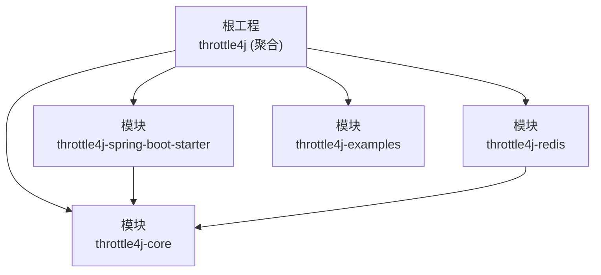
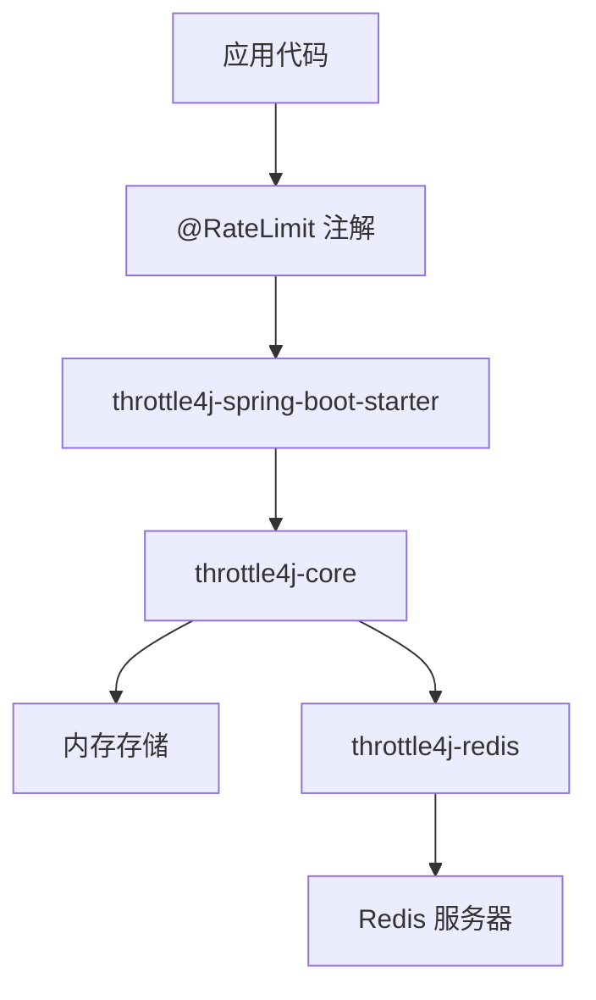
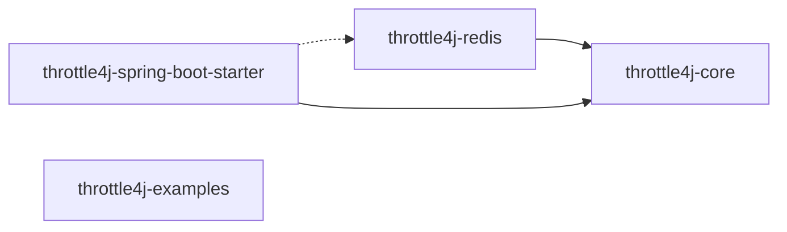

# 开发环境搭建

<cite>
**本文引用的文件**
- [根 POM 文件](file://pom.xml)
- [核心模块 POM](file://throttle4j-core/pom.xml)
- [Redis 模块 POM](file://throttle4j-redis/pom.xml)
- [Spring Boot Starter 模块 POM](file://throttle4j-spring-boot-starter/pom.xml)
- [示例应用配置](file://throttle4j-examples/src/main/resources/application.yml)
- [示例应用入口类](file://throttle4j-examples/src/main/java/com/throttle4j/example/SpringBootExampleApplication.java)
- [核心接口：RateLimiter](file://throttle4j-core/src/main/java/com/throttle4j/core/RateLimiter.java)
- [存储接口：RateLimitStore](file://throttle4j-core/src/main/java/com/throttle4j/store/RateLimitStore.java)
- [注解：RateLimit](file://throttle4j-spring-boot-starter/src/main/java/com/throttle4j/spring/annotation/RateLimit.java)
- [贡献指南](file://CONTRIBUTING.md)
- [项目自述文件](file://README.md)
</cite>

## 目录
1. [简介](#简介)
2. [项目结构](#项目结构)
3. [核心组件](#核心组件)
4. [架构总览](#架构总览)
5. [详细组件分析](#详细组件分析)
6. [依赖分析](#依赖分析)
7. [性能考虑](#性能考虑)
8. [故障排查指南](#故障排查指南)
9. [结论](#结论)
10. [附录](#附录)

## 简介
本指南面向首次参与 throttle4j 项目的开发者，目标是帮助你在本地快速完成开发环境搭建与验证，涵盖以下内容：
- JDK 11+ 与 Maven 3.6+ 的安装与校验
- 多模块项目的整体结构与依赖关系
- 从代码克隆到编译、打包、测试的完整流程
- 可选的 Docker 环境配置（用于 Redis 集成测试）
- IDE 配置建议与常用开发工具推荐
- 常见环境问题的排查与解决思路

## 项目结构
throttle4j 是一个多模块 Maven 工程，采用分层模块化设计：
- throttle4j-core：核心算法与公共 API、内存存储、无 Spring 依赖
- throttle4j-redis：基于 Lettuce 的 Redis 分布式存储与原子 Lua 脚本
- throttle4j-spring-boot-starter：自动装配、AOP 拦截器、Web 拦截器与响应头
- throttle4j-examples：可运行的 Spring Boot 示例，覆盖各算法与集成模式

图表来源
- [根 POM 文件:15-20](file://pom.xml#L15-L20)
- [核心模块 POM:7-11](file://throttle4j-core/pom.xml#L7-L11)
- [Redis 模块 POM:7-11](file://throttle4j-redis/pom.xml#L7-L11)
- [Spring Boot Starter 模块 POM:7-11](file://throttle4j-spring-boot-starter/pom.xml#L7-L11)

章节来源
- [根 POM 文件:15-20](file://pom.xml#L15-L20)
- [项目自述文件:134-142](file://README.md#L134-L142)

## 核心组件
- 核心接口：RateLimiter 提供统一的限流能力抽象，支持按 key 申请单个或多个配额，并返回标准化的结果对象
- 存储接口：RateLimitStore 抽象存储层，负责算法状态的持久化与并发安全
- 注解：@RateLimit 为 Spring 方法级声明式限流提供零配置接入点

章节来源
- [核心接口：RateLimiter:8-31](file://throttle4j-core/src/main/java/com/throttle4j/core/RateLimiter.java#L8-L31)
- [存储接口：RateLimitStore:15-34](file://throttle4j-core/src/main/java/com/throttle4j/store/RateLimitStore.java#L15-L34)
- [注解：RateLimit:26-74](file://throttle4j-spring-boot-starter/src/main/java/com/throttle4j/spring/annotation/RateLimit.java#L26-L74)

## 架构总览
throttle4j 的典型使用路径如下：
- 应用代码通过注解或编程方式调用 RateLimiter
- Spring Boot Starter 将注解转换为 AOP 拦截，委托给核心限流器
- 核心限流器根据配置选择算法与存储（内存或 Redis）
- Redis 模块通过 Lettuce 客户端与 Lua 脚本实现原子计数

图表来源
- [项目自述文件:76-94](file://README.md#L76-L94)
- [注解：RateLimit:14-17](file://throttle4j-spring-boot-starter/src/main/java/com/throttle4j/spring/annotation/RateLimit.java#L14-L17)
- [Redis 模块 POM:19-26](file://throttle4j-redis/pom.xml#L19-L26)

## 详细组件分析

### 组件一：核心模块 throttle4j-core
职责
- 提供算法抽象与实现（固定窗口、滑动窗口、令牌桶、漏桶）
- 提供 RateLimiter API、配置模型、注册表与内存存储
- 无 Spring 依赖，便于在任意 Java 环境使用

关键点
- 依赖管理由根 POM 统一控制，核心模块仅声明必要依赖
- 测试框架与日志实现采用 JUnit 5 与 Logback（测试范围）

章节来源
- [核心模块 POM:18-44](file://throttle4j-core/pom.xml#L18-L44)

### 组件二：Redis 模块 throttle4j-redis
职责
- 基于 Lettuce 的 Redis 分布式存储
- 使用 Lua 脚本保证原子性与一致性
- 与核心模块解耦，通过依赖注入协作

关键点
- 显式依赖核心模块与 Lettuce
- 测试覆盖存储读写与脚本加载

章节来源
- [Redis 模块 POM:18-47](file://throttle4j-redis/pom.xml#L18-L47)

### 组件三：Spring Boot Starter 模块 throttle4j-spring-boot-starter
职责
- 自动装配与属性绑定
- AOP 切面拦截方法级注解
- Web 层拦截器与标准响应头输出
- 可选依赖 Redis 模块

关键点
- 依赖核心模块与可选 Redis 模块
- 依赖 Spring Boot 启动器、AOP 与 Web（可选）

章节来源
- [Spring Boot Starter 模块 POM:18-53](file://throttle4j-spring-boot-starter/pom.xml#L18-L53)

### 组件四：示例模块 throttle4j-examples
职责
- 提供可运行的 Spring Boot 示例
- 展示各算法与集成模式的使用方式
- 默认使用内存存储进行演示

关键点
- 示例入口类启动 Spring Boot 应用
- 示例配置文件定义默认限流策略与存储类型

章节来源
- [示例应用入口类:12-18](file://throttle4j-examples/src/main/java/com/throttle4j/example/SpringBootExampleApplication.java#L12-L18)
- [示例应用配置:1-10](file://throttle4j-examples/src/main/resources/application.yml#L1-L10)

## 依赖分析
- 版本与工具链
  - Java 版本：11（源码与目标版本一致）
  - Maven 插件：编译、测试、源码与文档、覆盖率等插件版本在根 POM 中集中管理
- 模块间依赖
  - throttle4j-redis → throttle4j-core
  - throttle4j-spring-boot-starter → throttle4j-core（必选），throttle4j-redis（可选）
  - throttle4j-examples 不直接依赖其他模块，但可通过 Starter 运行示例

图表来源
- [根 POM 文件:96-109](file://pom.xml#L96-L109)
- [Redis 模块 POM:20-22](file://throttle4j-redis/pom.xml#L20-L22)
- [Spring Boot Starter 模块 POM:19-27](file://throttle4j-spring-boot-starter/pom.xml#L19-L27)

章节来源
- [根 POM 文件:22-42](file://pom.xml#L22-L42)
- [根 POM 文件:44-111](file://pom.xml#L44-L111)

## 性能考虑
- 算法选择
  - 令牌桶适合大多数 API 网关场景；滑动窗口在窗口内公平性更重要；漏桶用于严格出站速率；固定窗口简单但边界抖动较大
- 存储选择
  - 单机场景优先内存存储；分布式场景使用 Redis 并启用 Lua 原子脚本以降低网络往返与竞态风险
- 并发与线程安全
  - 核心与存储接口均要求线程安全，避免共享可变状态导致的竞态条件

## 故障排查指南
- 构建失败（JDK 版本不匹配）
  - 现象：编译阶段报错或插件不兼容
  - 排查：确认当前 JDK 版本满足“JDK 11+”要求；确保 Maven 使用的 JAVA_HOME 指向正确版本
  - 参考
    - [根 POM 文件:22-26](file://pom.xml#L22-L26)
    - [贡献指南:44-47](file://CONTRIBUTING.md#L44-L47)
- 构建失败（Maven 版本过低）
  - 现象：无法解析新语法或插件版本
  - 排查：升级到 Maven 3.6+；清理本地仓库缓存后重试
  - 参考
    - [贡献指南:44-47](file://CONTRIBUTING.md#L44-L47)
- 测试失败（缺少 Redis）
  - 现象：Redis 相关测试超时或连接异常
  - 解决：使用 Docker 启动 Redis 集成测试；或跳过相关测试
  - 参考
    - [贡献指南](file://CONTRIBUTING.md#L47)
    - [Redis 模块 POM:19-26](file://throttle4j-redis/pom.xml#L19-L26)
- 示例应用无法启动
  - 现象：端口占用、配置错误或依赖缺失
  - 排查：检查示例配置中的端口与存储类型；确保已执行完整构建；确认 Starter 依赖已安装
  - 参考
    - [示例应用配置:1-10](file://throttle4j-examples/src/main/resources/application.yml#L1-L10)
    - [示例应用入口类:12-18](file://throttle4j-examples/src/main/java/com/throttle4j/example/SpringBootExampleApplication.java#L12-L18)
- 覆盖率报告生成失败
  - 现象：JaCoCo 报告未生成或失败
  - 排查：确保执行了 verify 阶段；检查插件版本与配置
  - 参考
    - [根 POM 文件:161-181](file://pom.xml#L161-L181)

## 结论
通过本指南，你可以完成 throttle4j 的本地开发环境搭建与验证。建议在具备 JDK 11+ 与 Maven 3.6+ 的前提下，先完成全量构建与测试，再根据需要引入 Redis 与 Spring Boot 示例进行功能验证。

## 附录

### A. JDK 与 Maven 安装与校验
- JDK 11+
  - 下载与安装：访问官方 JDK 发布页面，选择对应平台的 JDK 11+ 版本
  - 校验：命令行执行 java -version 与 javac -version
- Maven 3.6+
  - 下载与安装：访问 Maven 官方下载页，解压并配置 PATH
  - 校验：命令行执行 mvn -version

章节来源
- [根 POM 文件:22-26](file://pom.xml#L22-L26)
- [贡献指南:44-47](file://CONTRIBUTING.md#L44-L47)

### B. 代码克隆与本地构建
- 克隆仓库
  - 使用 Git 克隆项目至本地
- 本地构建
  - 在根目录执行 mvn clean install 完整构建（包含测试与覆盖率）
  - 快速构建（跳过测试）：mvn clean install -DskipTests
- 运行示例
  - 进入 throttle4j-examples 模块，启动示例入口类
  - 访问示例提供的端点进行验证

章节来源
- [项目自述文件:143-149](file://README.md#L143-L149)
- [贡献指南:49-59](file://CONTRIBUTING.md#L49-L59)
- [示例应用入口类:12-18](file://throttle4j-examples/src/main/java/com/throttle4j/example/SpringBootExampleApplication.java#L12-L18)

### C. Docker 环境（可选，用于 Redis 集成测试）
- 启动 Redis
  - 使用 docker run 启动 Redis 实例，映射端口 6379
- 配置 Redis
  - 在示例配置中设置 Redis 地址与端口；或在测试环境中通过系统属性/环境变量覆盖
- 停止与清理
  - 测试完成后停止容器并清理镜像（如需）

章节来源
- [贡献指南](file://CONTRIBUTING.md#L47)
- [示例应用配置:1-10](file://throttle4j-examples/src/main/resources/application.yml#L1-L10)

### D. IDE 配置建议与开发工具推荐
- IDE
  - IntelliJ IDEA 或 Eclipse（建议使用最新稳定版）
- 插件
  - Lombok（如使用）、SonarLint（静态质量检查）、Maven Helper（依赖可视化）
- 编译与测试
  - 使用 Maven 生命周期命令进行编译、测试与覆盖率生成
- 代码风格
  - 遵循 Google Java Style Guide；保持 Javadoc 规范与命名约定

章节来源
- [贡献指南:31-41](file://CONTRIBUTING.md#L31-L41)
- [根 POM 文件:113-182](file://pom.xml#L113-L182)