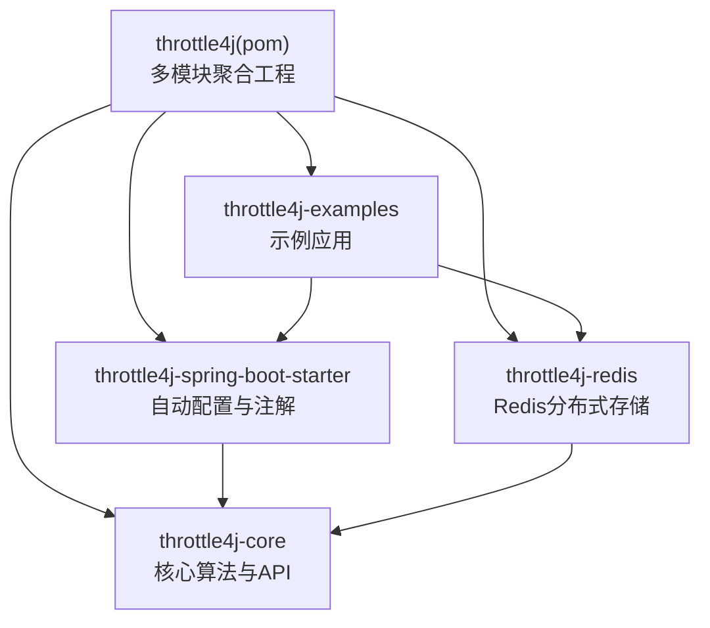
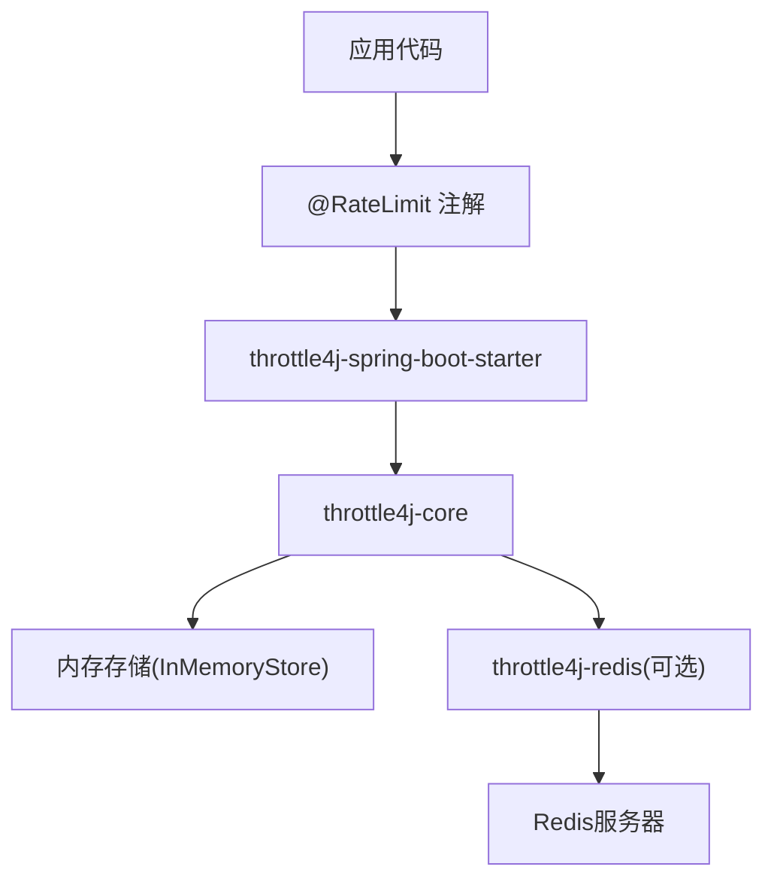
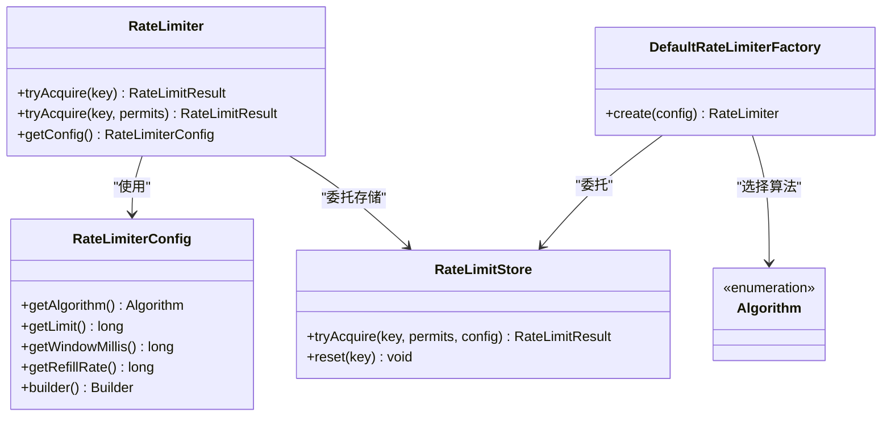
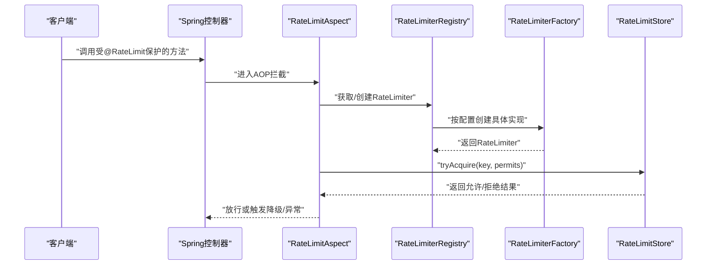
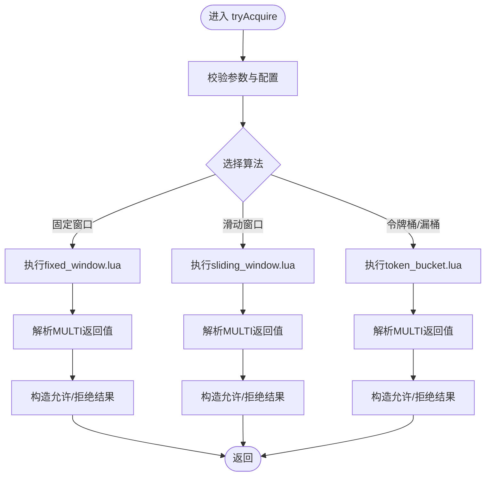
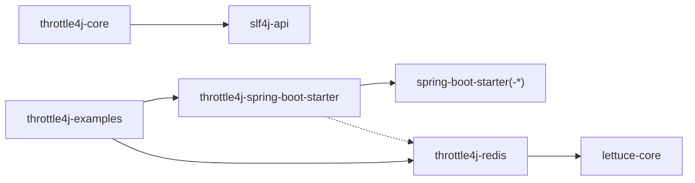

# 开发者指南

<cite>
**本文引用的文件**
- [CONTRIBUTING.md](file://CONTRIBUTING.md)
- [README.md](file://README.md)
- [ROADMAP.md](file://ROADMAP.md)
- [pom.xml](file://pom.xml)
- [throttle4j-core/pom.xml](file://throttle4j-core/pom.xml)
- [throttle4j-redis/pom.xml](file://throttle4j-redis/pom.xml)
- [throttle4j-spring-boot-starter/pom.xml](file://throttle4j-spring-boot-starter/pom.xml)
- [throttle4j-examples/pom.xml](file://throttle4j-examples/pom.xml)
- [throttle4j-core/src/main/java/com/throttle4j/core/RateLimiter.java](file://throttle4j-core/src/main/java/com/throttle4j/core/RateLimiter.java)
- [throttle4j-core/src/main/java/com/throttle4j/core/RateLimiterConfig.java](file://throttle4j-core/src/main/java/com/throttle4j/core/RateLimiterConfig.java)
- [throttle4j-core/src/main/java/com/throttle4j/store/RateLimitStore.java](file://throttle4j-core/src/main/java/com/throttle4j/store/RateLimitStore.java)
- [throttle4j-core/src/main/java/com/throttle4j/algorithm/DefaultRateLimiterFactory.java](file://throttle4j-core/src/main/java/com/throttle4j/algorithm/DefaultRateLimiterFactory.java)
- [throttle4j-core/src/main/java/com/throttle4j/core/Algorithm.java](file://throttle4j-core/src/main/java/com/throttle4j/core/Algorithm.java)
- [throttle4j-spring-boot-starter/src/main/java/com/throttle4j/spring/annotation/RateLimit.java](file://throttle4j-spring-boot-starter/src/main/java/com/throttle4j/spring/annotation/RateLimit.java)
- [throttle4j-spring-boot-starter/src/main/java/com/throttle4j/spring/autoconfigure/Throttle4jAutoConfiguration.java](file://throttle4j-spring-boot-starter/src/main/java/com/throttle4j/spring/autoconfigure/Throttle4jAutoConfiguration.java)
- [throttle4j-redis/src/main/java/com/throttle4j/redis/RedisRateLimitStore.java](file://throttle4j-redis/src/main/java/com/throttle4j/redis/RedisRateLimitStore.java)
</cite>

## 目录
1. 引言
2. 项目结构
3. 核心组件
4. 架构总览
5. 详细组件分析
6. 依赖关系分析
7. 性能考量
8. 故障排除指南
9. 结论
10. 附录

## 引言
本指南面向希望为 throttle4j 贡献代码与功能的开发者，涵盖开发环境搭建、代码规范、提交流程、架构设计原则与扩展点、模块开发指南（新增算法/存储后端/Spring Boot 集成）、测试策略与质量保障、发布与版本管理、社区参与与沟通渠道、路线图与发展方向，以及常见问题排查与调试建议。

## 项目结构
throttle4j 是一个多模块 Maven 工程，采用按职责分层的模块化组织：
- throttle4j-core：核心算法与 API、内存存储、配置模型，无 Spring 依赖
- throttle4j-redis：基于 Lettuce 的分布式存储与原子 Lua 脚本
- throttle4j-spring-boot-starter：自动配置、AOP 拦截器、Web 拦截器、响应头
- throttle4j-examples：示例应用，演示各算法与集成方式

图表来源
- [pom.xml:15-20](file://pom.xml#L15-L20)
- [throttle4j-core/pom.xml:13-16](file://throttle4j-core/pom.xml#L13-L16)
- [throttle4j-redis/pom.xml:13-16](file://throttle4j-redis/pom.xml#L13-L16)
- [throttle4j-spring-boot-starter/pom.xml:13-16](file://throttle4j-spring-boot-starter/pom.xml#L13-L16)
- [throttle4j-examples/pom.xml:13-16](file://throttle4j-examples/pom.xml#L13-L16)

章节来源
- [pom.xml:15-20](file://pom.xml#L15-L20)
- [README.md:134-142](file://README.md#L134-L142)

## 核心组件
- RateLimiter 接口：定义统一的限流调用入口，支持单次与批量许可获取，并返回标准化结果
- RateLimiterConfig：不可变配置对象，通过 Builder 构建并进行参数校验
- RateLimitStore 接口：存储抽象，负责具体算法的状态维护与原子操作
- DefaultRateLimiterFactory：根据配置选择具体算法实现
- Algorithm 枚举：支持固定窗口、滑动窗口、令牌桶、漏桶四种算法

章节来源
- [throttle4j-core/src/main/java/com/throttle4j/core/RateLimiter.java:8-31](file://throttle4j-core/src/main/java/com/throttle4j/core/RateLimiter.java#L8-L31)
- [throttle4j-core/src/main/java/com/throttle4j/core/RateLimiterConfig.java:8-112](file://throttle4j-core/src/main/java/com/throttle4j/core/RateLimiterConfig.java#L8-L112)
- [throttle4j-core/src/main/java/com/throttle4j/store/RateLimitStore.java:15-34](file://throttle4j-core/src/main/java/com/throttle4j/store/RateLimitStore.java#L15-L34)
- [throttle4j-core/src/main/java/com/throttle4j/algorithm/DefaultRateLimiterFactory.java:14-38](file://throttle4j-core/src/main/java/com/throttle4j/algorithm/DefaultRateLimiterFactory.java#L14-L38)
- [throttle4j-core/src/main/java/com/throttle4j/core/Algorithm.java:6-15](file://throttle4j-core/src/main/java/com/throttle4j/core/Algorithm.java#L6-L15)

## 架构总览
throttle4j 采用“核心算法 + 可插拔存储 + Spring 集成”的分层架构。核心模块提供算法与 API；存储模块负责状态持久化与原子性；Spring 模块提供零配置自动装配与声明式注解。

图表来源
- [README.md:76-94](file://README.md#L76-L94)
- [throttle4j-spring-boot-starter/src/main/java/com/throttle4j/spring/autoconfigure/Throttle4jAutoConfiguration.java:27-57](file://throttle4j-spring-boot-starter/src/main/java/com/throttle4j/spring/autoconfigure/Throttle4jAutoConfiguration.java#L27-L57)
- [throttle4j-redis/src/main/java/com/throttle4j/redis/RedisRateLimitStore.java:40-78](file://throttle4j-redis/src/main/java/com/throttle4j/redis/RedisRateLimitStore.java#L40-L78)

## 详细组件分析

### 组件一：核心 API 与工厂
- RateLimiter：统一的限流接口，要求线程安全
- RateLimiterConfig：构建与校验配置，确保算法参数有效
- DefaultRateLimiterFactory：依据算法枚举创建对应实现
- RateLimitStore：存储抽象，屏蔽算法细节

图表来源
- [throttle4j-core/src/main/java/com/throttle4j/core/RateLimiter.java:8-31](file://throttle4j-core/src/main/java/com/throttle4j/core/RateLimiter.java#L8-L31)
- [throttle4j-core/src/main/java/com/throttle4j/core/RateLimiterConfig.java:8-112](file://throttle4j-core/src/main/java/com/throttle4j/core/RateLimiterConfig.java#L8-L112)
- [throttle4j-core/src/main/java/com/throttle4j/store/RateLimitStore.java:15-34](file://throttle4j-core/src/main/java/com/throttle4j/store/RateLimitStore.java#L15-L34)
- [throttle4j-core/src/main/java/com/throttle4j/algorithm/DefaultRateLimiterFactory.java:14-38](file://throttle4j-core/src/main/java/com/throttle4j/algorithm/DefaultRateLimiterFactory.java#L14-L38)
- [throttle4j-core/src/main/java/com/throttle4j/core/Algorithm.java:6-15](file://throttle4j-core/src/main/java/com/throttle4j/core/Algorithm.java#L6-L15)

章节来源
- [throttle4j-core/src/main/java/com/throttle4j/core/RateLimiter.java:8-31](file://throttle4j-core/src/main/java/com/throttle4j/core/RateLimiter.java#L8-L31)
- [throttle4j-core/src/main/java/com/throttle4j/core/RateLimiterConfig.java:55-111](file://throttle4j-core/src/main/java/com/throttle4j/core/RateLimiterConfig.java#L55-L111)
- [throttle4j-core/src/main/java/com/throttle4j/algorithm/DefaultRateLimiterFactory.java:22-37](file://throttle4j-core/src/main/java/com/throttle4j/algorithm/DefaultRateLimiterFactory.java#L22-L37)

### 组件二：Spring Boot 自动装配与注解
- @RateLimit：方法级声明式限流注解，支持 SpEL 键表达式、降级方法
- Throttle4jAutoConfiguration：条件化注册默认存储、工厂、注册表与 AOP 切面；当配置为 Redis 且类路径存在时反射加载 Redis 存储

图表来源
- [throttle4j-spring-boot-starter/src/main/java/com/throttle4j/spring/annotation/RateLimit.java:26-74](file://throttle4j-spring-boot-starter/src/main/java/com/throttle4j/spring/annotation/RateLimit.java#L26-L74)
- [throttle4j-spring-boot-starter/src/main/java/com/throttle4j/spring/autoconfigure/Throttle4jAutoConfiguration.java:126-130](file://throttle4j-spring-boot-starter/src/main/java/com/throttle4j/spring/autoconfigure/Throttle4jAutoConfiguration.java#L126-L130)

章节来源
- [throttle4j-spring-boot-starter/src/main/java/com/throttle4j/spring/annotation/RateLimit.java:26-74](file://throttle4j-spring-boot-starter/src/main/java/com/throttle4j/spring/annotation/RateLimit.java#L26-L74)
- [throttle4j-spring-boot-starter/src/main/java/com/throttle4j/spring/autoconfigure/Throttle4jAutoConfiguration.java:45-99](file://throttle4j-spring-boot-starter/src/main/java/com/throttle4j/spring/autoconfigure/Throttle4jAutoConfiguration.java#L45-L99)

### 组件三：Redis 分布式存储与 Lua 原子脚本
- RedisRateLimitStore：封装三种算法的 Lua 脚本，通过同步命令接口执行 MULTI 输出，返回标准化结果
- 支持固定窗口、滑动窗口、令牌桶（漏桶复用令牌桶逻辑）三种算法
- 提供键前缀隔离与重置能力

图表来源
- [throttle4j-redis/src/main/java/com/throttle4j/redis/RedisRateLimitStore.java:80-110](file://throttle4j-redis/src/main/java/com/throttle4j/redis/RedisRateLimitStore.java#L80-L110)
- [throttle4j-redis/src/main/java/com/throttle4j/redis/RedisRateLimitStore.java:122-191](file://throttle4j-redis/src/main/java/com/throttle4j/redis/RedisRateLimitStore.java#L122-L191)

章节来源
- [throttle4j-redis/src/main/java/com/throttle4j/redis/RedisRateLimitStore.java:40-78](file://throttle4j-redis/src/main/java/com/throttle4j/redis/RedisRateLimitStore.java#L40-L78)
- [throttle4j-redis/src/main/java/com/throttle4j/redis/RedisRateLimitStore.java:80-110](file://throttle4j-redis/src/main/java/com/throttle4j/redis/RedisRateLimitStore.java#L80-L110)

## 依赖关系分析
- throttle4j-core：仅依赖 slf4j-api，保持轻量
- throttle4j-redis：依赖 lettuce-core，提供 Redis 同步命令接口
- throttle4j-spring-boot-starter：依赖 spring-boot-starter、spring-boot-starter-aop、spring-boot-starter-web（可选），并可选依赖 redis 模块
- throttle4j-examples：依赖 starter 与 redis 模块及 spring-web

图表来源
- [throttle4j-core/pom.xml:18-44](file://throttle4j-core/pom.xml#L18-L44)
- [throttle4j-redis/pom.xml:18-47](file://throttle4j-redis/pom.xml#L18-L47)
- [throttle4j-spring-boot-starter/pom.xml:18-53](file://throttle4j-spring-boot-starter/pom.xml#L18-L53)
- [throttle4j-examples/pom.xml:18-31](file://throttle4j-examples/pom.xml#L18-L31)

章节来源
- [pom.xml:44-111](file://pom.xml#L44-L111)

## 性能考量
- 线程安全与无锁：核心接口与存储均要求线程安全；Redis 实现通过 Lua 原子脚本与同步命令保证一致性
- 原子性：Redis 执行 MULTI 返回值，避免竞态条件
- 降级策略：当 Redis 不可用时自动回退到内存存储，保证服务可用性
- 算法权衡：不同算法在边界尖峰、公平性、突发与平均速率之间权衡，推荐场景见 README

章节来源
- [README.md:103-112](file://README.md#L103-L112)
- [throttle4j-redis/src/main/java/com/throttle4j/redis/RedisRateLimitStore.java:36-38](file://throttle4j-redis/src/main/java/com/throttle4j/redis/RedisRateLimitStore.java#L36-L38)
- [throttle4j-spring-boot-starter/src/main/java/com/throttle4j/spring/autoconfigure/Throttle4jAutoConfiguration.java:53-56](file://throttle4j-spring-boot-starter/src/main/java/com/throttle4j/spring/autoconfigure/Throttle4jAutoConfiguration.java#L53-L56)

## 故障排除指南
- 构建失败
  - 确认 JDK 版本与 Maven 版本满足要求
  - 使用完整验证命令以同时运行测试与覆盖率报告
- 测试失败
  - 单模块测试：在对应模块目录下执行测试
  - 覆盖率：使用 verify 生成 JaCoCo 报告
- Redis 相关
  - Lua 脚本加载失败：检查资源路径与打包是否包含脚本
  - 连接异常：确认连接参数与网络连通性
- Spring 集成
  - 自动装配未生效：检查属性开关与类路径依赖
  - 注解不生效：确认方法可见性与所在 Spring Bean 上下文

章节来源
- [CONTRIBUTING.md:42-81](file://CONTRIBUTING.md#L42-L81)
- [throttle4j-redis/src/main/java/com/throttle4j/redis/RedisRateLimitStore.java:226-251](file://throttle4j-redis/src/main/java/com/throttle4j/redis/RedisRateLimitStore.java#L226-L251)
- [throttle4j-spring-boot-starter/src/main/java/com/throttle4j/spring/autoconfigure/Throttle4jAutoConfiguration.java:66-99](file://throttle4j-spring-boot-starter/src/main/java/com/throttle4j/spring/autoconfigure/Throttle4jAutoConfiguration.java#L66-L99)

## 结论
throttle4j 通过清晰的分层与可插拔设计，提供了高性能、可扩展的限流能力。开发者可围绕核心 API 扩展算法与存储后端，或在 Spring 生态中以零配置方式快速集成。遵循本文档的开发与提交规范，有助于提升代码质量与协作效率。

## 附录

### 开发环境搭建与构建
- 要求：JDK 11+、Maven 3.6+、可选 Docker（用于集成 Redis）
- 全量构建：执行安装命令以编译、测试、生成覆盖率报告
- 快速构建：跳过测试

章节来源
- [CONTRIBUTING.md:42-59](file://CONTRIBUTING.md#L42-L59)
- [README.md:143-151](file://README.md#L143-L151)

### 代码规范与提交流程
- 提交消息：遵循 Conventional Commits 规范
- 代码风格：Google Java Style，Javadoc 要求覆盖公共 API
- 并发与空值：优先使用 Optional，明确线程安全承诺
- 质量门槛：新代码需维持整体覆盖率不低于 60%

章节来源
- [CONTRIBUTING.md:18-41](file://CONTRIBUTING.md#L18-L41)
- [CONTRIBUTING.md:83-101](file://CONTRIBUTING.md#L83-L101)

### 模块开发指南

#### 新增限流算法
- 在 core 模块新增算法实现，实现 RateLimiter 接口
- 在 Algorithm 中添加枚举项
- 在 DefaultRateLimiterFactory 中增加分支映射
- 在 Redis 模块中为该算法编写等价的 Lua 脚本并更新 RedisRateLimitStore 的调度逻辑
- 补充单元测试与集成测试

章节来源
- [throttle4j-core/src/main/java/com/throttle4j/algorithm/DefaultRateLimiterFactory.java:25-36](file://throttle4j-core/src/main/java/com/throttle4j/algorithm/DefaultRateLimiterFactory.java#L25-L36)
- [throttle4j-core/src/main/java/com/throttle4j/core/Algorithm.java:6-15](file://throttle4j-core/src/main/java/com/throttle4j/core/Algorithm.java#L6-L15)
- [throttle4j-redis/src/main/java/com/throttle4j/redis/RedisRateLimitStore.java:92-109](file://throttle4j-redis/src/main/java/com/throttle4j/redis/RedisRateLimitStore.java#L92-L109)

#### 新增存储后端
- 实现 RateLimitStore 接口，提供 tryAcquire 与 reset
- 若为分布式存储，确保原子性与幂等性
- 在 Spring 自动装配中提供条件化注册与回退逻辑
- 编写单元测试与集成测试

章节来源
- [throttle4j-core/src/main/java/com/throttle4j/store/RateLimitStore.java:15-34](file://throttle4j-core/src/main/java/com/throttle4j/store/RateLimitStore.java#L15-L34)
- [throttle4j-spring-boot-starter/src/main/java/com/throttle4j/spring/autoconfigure/Throttle4jAutoConfiguration.java:45-99](file://throttle4j-spring-boot-starter/src/main/java/com/throttle4j/spring/autoconfigure/Throttle4jAutoConfiguration.java#L45-L99)

#### Spring Boot 集成扩展
- 注解：在现有注解基础上扩展属性或行为
- AOP：保持切面与注册表的兼容性
- 自动装配：提供条件化 Bean 定义，避免与用户自定义冲突
- 文档与示例：补充使用示例与配置说明

章节来源
- [throttle4j-spring-boot-starter/src/main/java/com/throttle4j/spring/annotation/RateLimit.java:26-74](file://throttle4j-spring-boot-starter/src/main/java/com/throttle4j/spring/annotation/RateLimit.java#L26-L74)
- [throttle4j-spring-boot-starter/src/main/java/com/throttle4j/spring/autoconfigure/Throttle4jAutoConfiguration.java:126-130](file://throttle4j-spring-boot-starter/src/main/java/com/throttle4j/spring/autoconfigure/Throttle4jAutoConfiguration.java#L126-L130)

### 测试策略与质量保证
- 单元测试：针对核心算法与存储实现
- 集成测试：覆盖 Spring 注解与 Redis 场景
- 覆盖率：使用 JaCoCo 生成报告，维持整体覆盖率不低于 60%
- 多 JDK 测试：CI 在 JDK 11 与 17 上运行测试

章节来源
- [CONTRIBUTING.md:61-81](file://CONTRIBUTING.md#L61-L81)
- [README.md:151-151](file://README.md#L151-L151)

### 发布流程与版本管理
- 版本：当前快照版本为 0.2.0-SNAPSHOT
- 发布：计划通过 GitHub Actions 发布至 Maven Central（详见路线图任务）
- 分发：当前使用 GitHub Packages 作为分发仓库

章节来源
- [pom.xml:9-9](file://pom.xml#L9-L9)
- [ROADMAP.md:80-85](file://ROADMAP.md#L80-L85)
- [pom.xml:184-190](file://pom.xml#L184-L190)

### 社区参与与沟通
- 问题与讨论：使用 GitHub Issues 模板
- 行为准则：遵循 Contributor Covenant
- 许可证：贡献在 Apache License 2.0 下

章节来源
- [CONTRIBUTING.md:83-109](file://CONTRIBUTING.md#L83-L109)

### 路线图与发展方向
- Redis 集群支持：适配集群模式与哈希标签
- 监控与指标：Micrometer、Actuator、Grafana 集成
- Spring Boot 3.x 支持：Jakarta EE 迁移与自动配置更新
- 动态配置：从配置中心动态拉取与热更新
- 发布：配置 Maven Central 发布流水线并发布首个稳定版本

章节来源
- [ROADMAP.md:7-20](file://ROADMAP.md#L7-L20)
- [ROADMAP.md:23-36](file://ROADMAP.md#L23-L36)
- [ROADMAP.md:39-53](file://ROADMAP.md#L39-L53)
- [ROADMAP.md:56-69](file://ROADMAP.md#L56-L69)
- [ROADMAP.md:72-85](file://ROADMAP.md#L72-L85)