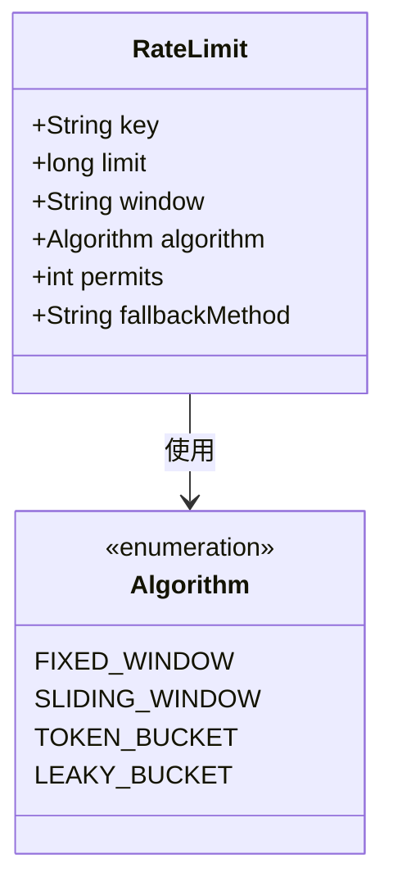
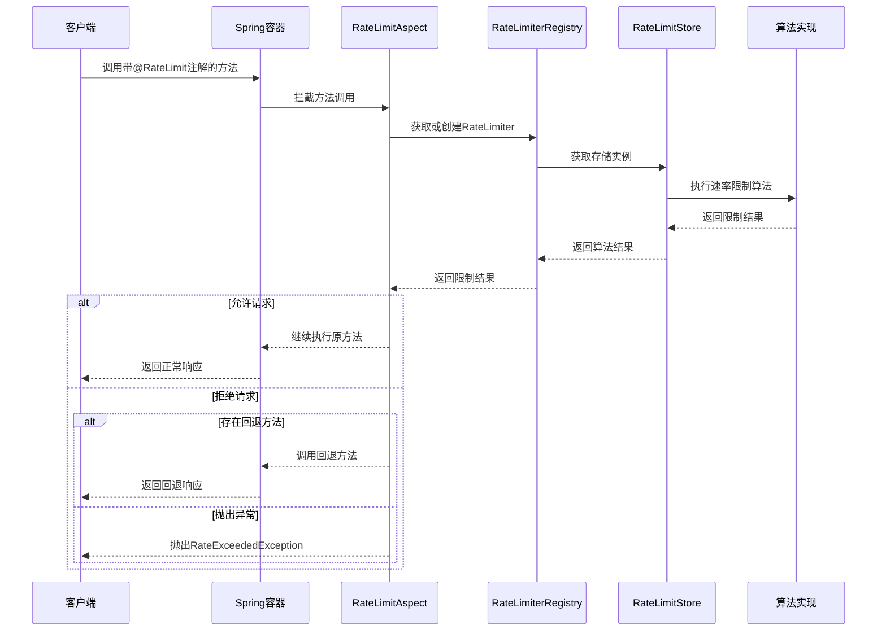
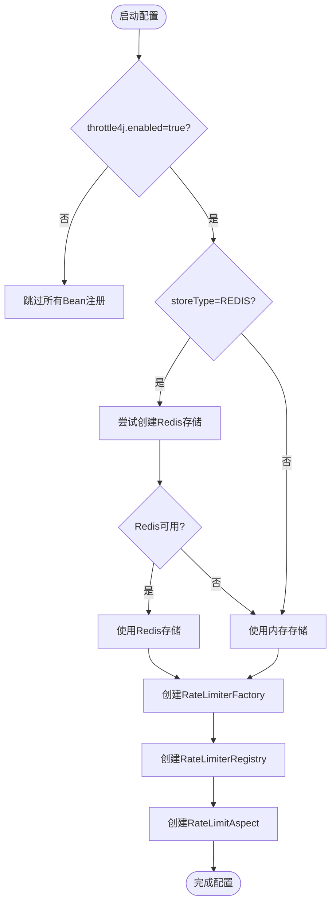
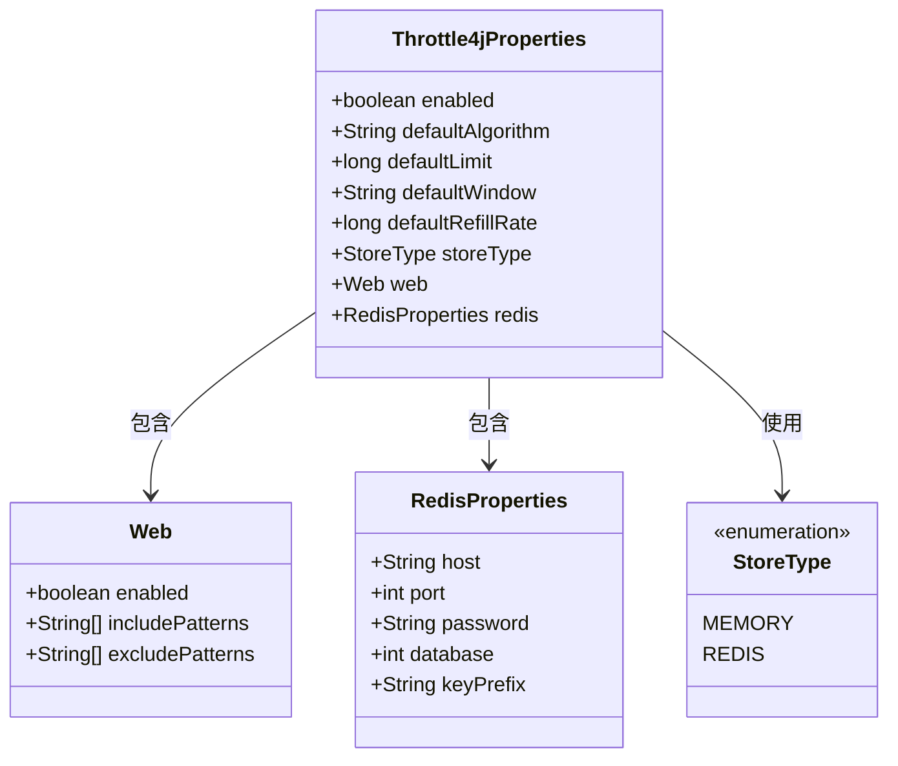
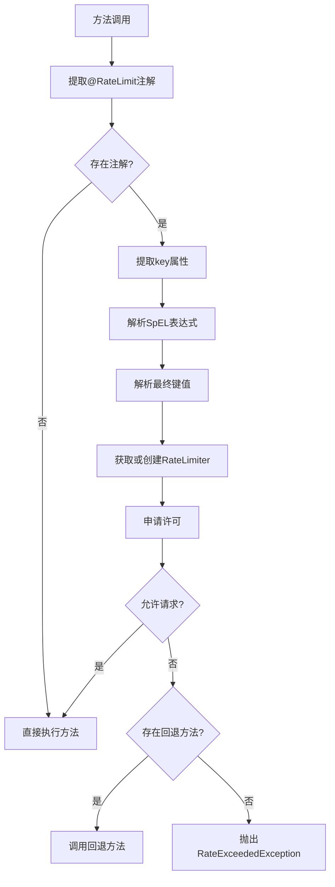
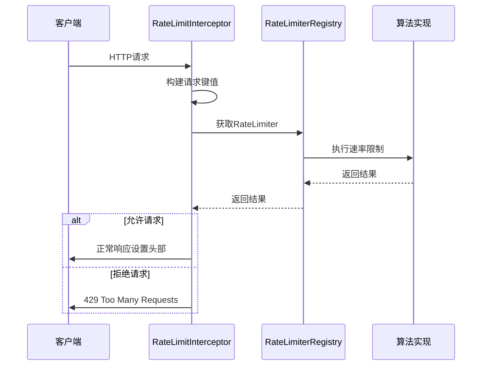
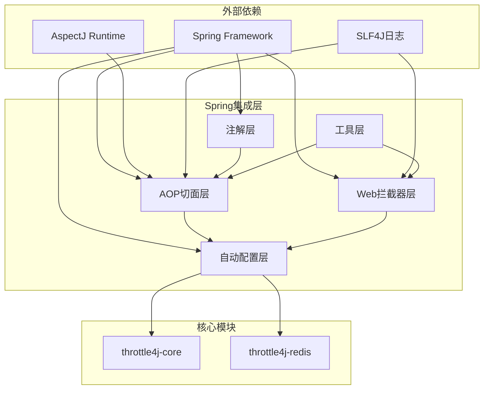
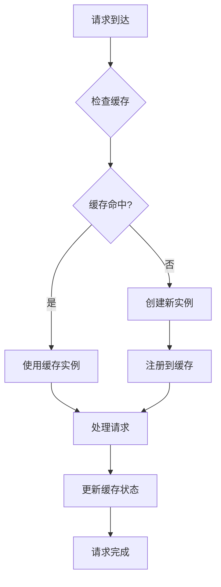

# Spring集成扩展

<cite>
**本文档引用的文件**
- [RateLimit.java](file://throttle4j-spring-boot-starter/src/main/java/com/throttle4j/spring/annotation/RateLimit.java)
- [RateLimitAspect.java](file://throttle4j-spring-boot-starter/src/main/java/com/throttle4j/spring/aop/RateLimitAspect.java)
- [Throttle4jAutoConfiguration.java](file://throttle4j-spring-boot-starter/src/main/java/com/throttle4j/spring/autoconfigure/Throttle4jAutoConfiguration.java)
- [Throttle4jProperties.java](file://throttle4j-spring-boot-starter/src/main/java/com/throttle4j/spring/autoconfigure/Throttle4jProperties.java)
- [WindowParser.java](file://throttle4j-spring-boot-starter/src/main/java/com/throttle4j/spring/util/WindowParser.java)
- [RateLimitInterceptor.java](file://throttle4j-spring-boot-starter/src/main/java/com/throttle4j/spring/web/RateLimitInterceptor.java)
- [Throttle4jWebAutoConfiguration.java](file://throttle4j-spring-boot-starter/src/main/java/com/throttle4j/spring/web/Throttle4jWebAutoConfiguration.java)
- [spring.factories](file://throttle4j-spring-boot-starter/src/main/resources/META-INF/spring.factories)
- [RateLimitAspectTest.java](file://throttle4j-spring-boot-starter/src/test/java/com/throttle4j/spring/aop/RateLimitAspectTest.java)
- [Throttle4jAutoConfigurationTest.java](file://throttle4j-spring-boot-starter/src/test/java/com/throttle4j/spring/autoconfigure/Throttle4jAutoConfigurationTest.java)
- [SpringBootExampleApplication.java](file://throttle4j-examples/src/main/java/com/throttle4j/example/SpringBootExampleApplication.java)
- [application.yml](file://throttle4j-examples/src/main/resources/application.yml)
- [README.md](file://README.md)
</cite>

## 目录
1. [简介](#简介)
2. [项目结构](#项目结构)
3. [核心组件](#核心组件)
4. [架构概览](#架构概览)
5. [详细组件分析](#详细组件分析)
6. [依赖关系分析](#依赖关系分析)
7. [性能考虑](#性能考虑)
8. [故障排除指南](#故障排除指南)
9. [结论](#结论)
10. [附录](#附录)

## 简介

throttle4j是一个轻量级、高性能的分布式Java速率限制库，提供了Spring Boot集成扩展能力。该库支持四种算法（固定窗口、滑动窗口、令牌桶、漏桶），具有可插拔存储后端（内存存储和Redis存储），并提供零配置的自动配置功能。

本指南将详细介绍如何开发自定义注解和AOP切面来实现新的Spring集成方式，解释自动配置类的开发规范，以及扩展点的设计原则和最佳实践。

## 项目结构

throttle4j项目采用模块化设计，主要包含以下核心模块：

```mermaid
graph TB
subgraph "核心模块"
Core[throttle4j-core<br/>核心算法和API]
Redis[throttle4j-redis<br/>Redis分布式存储]
end
subgraph "Spring集成模块"
Starter[throttle4j-spring-boot-starter<br/>Spring Boot集成]
Examples[throttle4j-examples<br/>示例应用]
end
subgraph "Spring集成模块内部结构"
Annotation[注解层<br/>@RateLimit]
AOP[AOP切面层<br/>RateLimitAspect]
AutoConfig[自动配置层<br/>Throttle4jAutoConfiguration]
Web[Web拦截器层<br/>RateLimitInterceptor]
Util[工具层<br/>WindowParser]
end
Starter --> Annotation
Starter --> AOP
Starter --> AutoConfig
Starter --> Web
Starter --> Util
Starter --> Core
Redis --> Core
Examples --> Starter
```

**图表来源**
- [Throttle4jAutoConfiguration.java:1-132](file://throttle4j-spring-boot-starter/src/main/java/com/throttle4j/spring/autoconfigure/Throttle4jAutoConfiguration.java#L1-L132)
- [RateLimitAspect.java:1-186](file://throttle4j-spring-boot-starter/src/main/java/com/throttle4j/spring/aop/RateLimitAspect.java#L1-L186)

**章节来源**
- [README.md:134-142](file://README.md#L134-L142)

## 核心组件

### 自定义注解系统

throttle4j提供了声明式的速率限制注解系统，允许开发者通过简单的注解来实现速率限制功能。

#### RateLimit注解设计

RateLimit注解是整个Spring集成的核心，它提供了灵活的配置选项：



**图表来源**
- [RateLimit.java:26-75](file://throttle4j-spring-boot-starter/src/main/java/com/throttle4j/spring/annotation/RateLimit.java#L26-L75)

#### AOP切面实现

RateLimitAspect作为核心的AOP切面，负责拦截带有@RateLimit注解的方法调用：

**章节来源**
- [RateLimit.java:11-75](file://throttle4j-spring-boot-starter/src/main/java/com/throttle4j/spring/annotation/RateLimit.java#L11-L75)
- [RateLimitAspect.java:30-186](file://throttle4j-spring-boot-starter/src/main/java/com/throttle4j/spring/aop/RateLimitAspect.java#L30-L186)

## 架构概览

throttle4j的Spring集成架构采用了分层设计，确保了良好的可扩展性和可维护性：



**图表来源**
- [RateLimitAspect.java:68-91](file://throttle4j-spring-boot-starter/src/main/java/com/throttle4j/spring/aop/RateLimitAspect.java#L68-L91)
- [Throttle4jAutoConfiguration.java:105-130](file://throttle4j-spring-boot-starter/src/main/java/com/throttle4j/spring/autoconfigure/Throttle4jAutoConfiguration.java#L105-L130)

## 详细组件分析

### 自动配置类开发规范

Throttle4jAutoConfiguration展示了Spring Boot自动配置的最佳实践：

#### 条件注解使用



**图表来源**
- [Throttle4jAutoConfiguration.java:27-57](file://throttle4j-spring-boot-starter/src/main/java/com/throttle4j/spring/autoconfigure/Throttle4jAutoConfiguration.java#L27-L57)

#### Bean定义策略

自动配置类遵循以下Bean定义策略：

1. **默认Bean注册**：为每个核心组件提供默认实现
2. **用户覆盖优先**：使用`@ConditionalOnMissingBean`确保用户自定义Bean优先
3. **延迟初始化**：仅在需要时创建Bean实例
4. **反射机制**：动态检测和创建Redis存储实例

**章节来源**
- [Throttle4jAutoConfiguration.java:45-130](file://throttle4j-spring-boot-starter/src/main/java/com/throttle4j/spring/autoconfigure/Throttle4jAutoConfiguration.java#L45-L130)

### 配置属性绑定

Throttle4jProperties展示了配置属性绑定的完整实现：

#### 属性层次结构



**图表来源**
- [Throttle4jProperties.java:10-202](file://throttle4j-spring-boot-starter/src/main/java/com/throttle4j/spring/autoconfigure/Throttle4jProperties.java#L10-L202)

#### 配置属性验证

配置属性绑定包含了完整的验证逻辑：

1. **类型安全**：使用`@ConfigurationProperties`确保类型安全
2. **默认值设置**：为所有属性提供合理的默认值
3. **枚举验证**：对枚举类型的属性进行验证
4. **范围检查**：对数值型属性进行范围验证

**章节来源**
- [Throttle4jProperties.java:12-98](file://throttle4j-spring-boot-starter/src/main/java/com/throttle4j/spring/autoconfigure/Throttle4jProperties.java#L12-L98)

### 自定义注解处理器实现

#### 注解元数据提取

RateLimitAspect实现了完整的注解元数据提取功能：



**图表来源**
- [RateLimitAspect.java:68-91](file://throttle4j-spring-boot-starter/src/main/java/com/throttle4j/spring/aop/RateLimitAspect.java#L68-L91)

#### 参数解析机制

注解处理器支持复杂的参数解析：

1. **SpEL表达式支持**：支持Spring Expression Language表达式
2. **参数名发现**：使用`DefaultParameterNameDiscoverer`自动发现参数名
3. **位置变量**：提供`p0`、`p1`等位置变量访问
4. **命名变量**：提供参数名对应的变量访问
5. **表达式缓存**：使用`ConcurrentHashMap`缓存解析后的表达式

**章节来源**
- [RateLimitAspect.java:117-153](file://throttle4j-spring-boot-starter/src/main/java/com/throttle4j/spring/aop/RateLimitAspect.java#L117-L153)

#### 执行时机控制

执行时机控制确保了注解处理器的正确行为：

1. **环绕通知**：使用`@Around`注解确保在方法执行前后都有控制点
2. **异常处理**：捕获并处理所有可能的异常情况
3. **回退机制**：当请求被拒绝时提供回退方法调用
4. **性能优化**：避免不必要的对象创建和计算

**章节来源**
- [RateLimitAspect.java:68-91](file://throttle4j-spring-boot-starter/src/main/java/com/throttle4j/spring/aop/RateLimitAspect.java#L68-L91)

### Web拦截器扩展

#### 全局速率限制

Throttle4jWebAutoConfiguration提供了全局的Web层速率限制：



**图表来源**
- [RateLimitInterceptor.java:55-79](file://throttle4j-spring-boot-starter/src/main/java/com/throttle4j/spring/web/RateLimitInterceptor.java#L55-L79)

#### 标准响应头

拦截器提供了标准的速率限制响应头：

| 头部名称 | 描述 | 示例值 |
|---------|------|--------|
| `X-RateLimit-Limit` | 窗口限制数 | `100` |
| `X-RateLimit-Remaining` | 窗口剩余请求数 | `95` |
| `X-RateLimit-Reset` | 窗口重置时间戳 | `1640995200` |
| `Retry-After` | 重试等待秒数 | `60` |

**章节来源**
- [RateLimitInterceptor.java:30-38](file://throttle4j-spring-boot-starter/src/main/java/com/throttle4j/spring/web/RateLimitInterceptor.java#L30-L38)

## 依赖关系分析

### 组件耦合度分析



**图表来源**
- [Throttle4jAutoConfiguration.java:1-132](file://throttle4j-spring-boot-starter/src/main/java/com/throttle4j/spring/autoconfigure/Throttle4jAutoConfiguration.java#L1-L132)

### 循环依赖检测

通过分析依赖关系图，可以确认项目中不存在循环依赖：

1. **Spring集成层**不依赖于核心模块
2. **核心模块**不依赖于Spring框架
3. **Redis模块**只在运行时动态加载
4. **自动配置层**是唯一依赖Spring框架的层

**章节来源**
- [spring.factories:1-4](file://throttle4j-spring-boot-starter/src/main/resources/META-INF/spring.factories#L1-L4)

## 性能考虑

### 缓存策略

throttle4j实现了多层缓存策略以优化性能：

1. **表达式缓存**：使用`ConcurrentHashMap`缓存解析后的SpEL表达式
2. **限流器缓存**：使用`RateLimiterRegistry`缓存已创建的限流器实例
3. **反射缓存**：避免重复的反射操作

### 内存管理



### 并发安全性

1. **线程安全**：所有共享状态都使用线程安全的数据结构
2. **原子操作**：使用原子操作确保并发安全性
3. **无锁设计**：尽量避免使用锁机制以提高性能

## 故障排除指南

### 常见问题诊断

#### 自动配置未生效

**症状**：应用程序启动但没有启用速率限制功能

**排查步骤**：
1. 检查`throttle4j.enabled`属性是否设置为`true`
2. 确认`throttle4j-spring-boot-starter`依赖已正确添加
3. 验证`META-INF/spring.factories`文件是否存在

**章节来源**
- [Throttle4jAutoConfigurationTest.java:36-42](file://throttle4j-spring-boot-starter/src/test/java/com/throttle4j/spring/autoconfigure/Throttle4jAutoConfigurationTest.java#L36-L42)

#### 注解不生效

**症状**：带有`@RateLimit`注解的方法没有被拦截

**排查步骤**：
1. 确认方法不是`private`修饰符
2. 检查是否启用了AOP代理
3. 验证注解是否正确应用到目标方法

**章节来源**
- [RateLimitAspectTest.java:41-54](file://throttle4j-spring-boot-starter/src/test/java/com/throttle4j/spring/aop/RateLimitAspectTest.java#L41-L54)

#### Redis连接失败

**症状**：选择Redis存储但连接失败

**解决方案**：
1. 确认Redis服务器正在运行
2. 检查连接参数配置
3. 验证网络连通性

**章节来源**
- [Throttle4jAutoConfiguration.java:66-99](file://throttle4j-spring-boot-starter/src/main/java/com/throttle4j/spring/autoconfigure/Throttle4jAutoConfiguration.java#L66-L99)

## 结论

throttle4j的Spring集成扩展展现了现代Spring Boot库开发的最佳实践。通过精心设计的注解系统、AOP切面、自动配置和Web拦截器，该库提供了灵活且高性能的速率限制解决方案。

### 关键优势

1. **零配置体验**：提供合理的默认配置，开箱即用
2. **高度可定制**：支持用户自定义Bean覆盖
3. **多算法支持**：提供四种不同的速率限制算法
4. **分布式能力**：支持Redis存储实现分布式限流
5. **标准兼容**：提供标准的HTTP响应头和错误码

### 最佳实践建议

1. **合理选择算法**：根据业务场景选择合适的算法
2. **适当的键设计**：设计有意义的限流键值
3. **监控和告警**：建立完善的监控体系
4. **性能测试**：在生产环境前进行充分的性能测试
5. **渐进式部署**：采用渐进式部署策略降低风险

## 附录

### 开发规范清单

#### 自定义注解开发规范

1. **注解设计原则**：
   - 提供清晰的语义和用途说明
   - 支持SpEL表达式以便灵活配置
   - 提供合理的默认值

2. **元数据提取**：
   - 实现完整的注解元数据提取逻辑
   - 支持复杂的数据类型和表达式
   - 提供优雅的错误处理机制

#### AOP切面开发规范

1. **切面设计原则**：
   - 使用环绕通知确保完整的控制点
   - 实现最小化的性能影响
   - 提供清晰的错误处理和回退机制

2. **执行时机控制**：
   - 精确控制方法执行前后的时机
   - 支持异步执行场景
   - 提供超时和取消机制

#### 自动配置开发规范

1. **条件注解使用**：
   - 合理使用`@ConditionalOnProperty`和`@ConditionalOnMissingBean`
   - 提供明确的启用/禁用逻辑
   - 支持多种配置场景

2. **Bean定义策略**：
   - 提供默认实现但允许用户覆盖
   - 实现延迟初始化以优化启动时间
   - 使用适当的生命周期管理

#### 扩展点设计原则

1. **向后兼容性**：
   - 保持API的向后兼容性
   - 提供迁移路径和弃用警告
   - 避免破坏性的变更

2. **性能影响评估**：
   - 进行充分的性能基准测试
   - 提供性能监控和指标
   - 优化热点代码路径

3. **最佳实践建议**：
   - 提供详细的配置示例和文档
   - 建立完善的测试覆盖
   - 提供故障排除指南