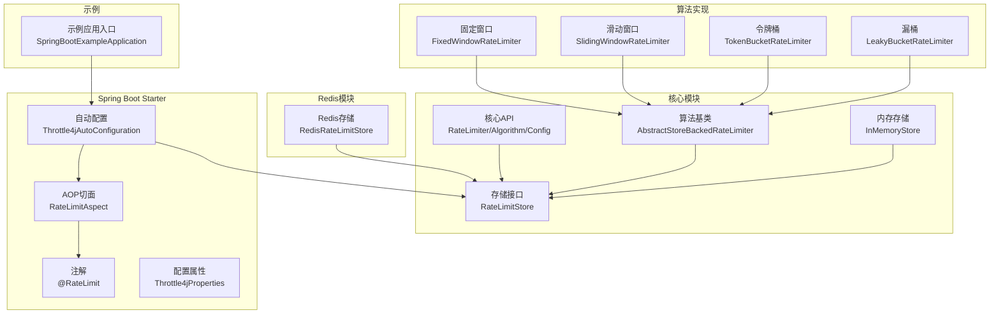
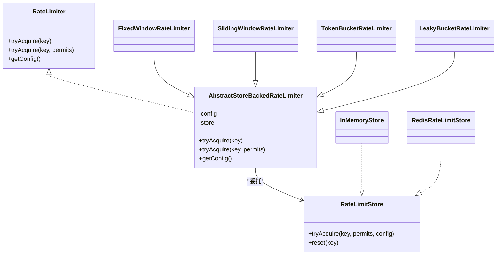
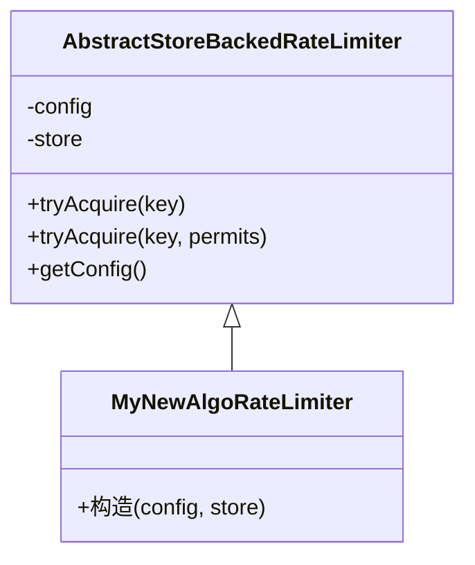
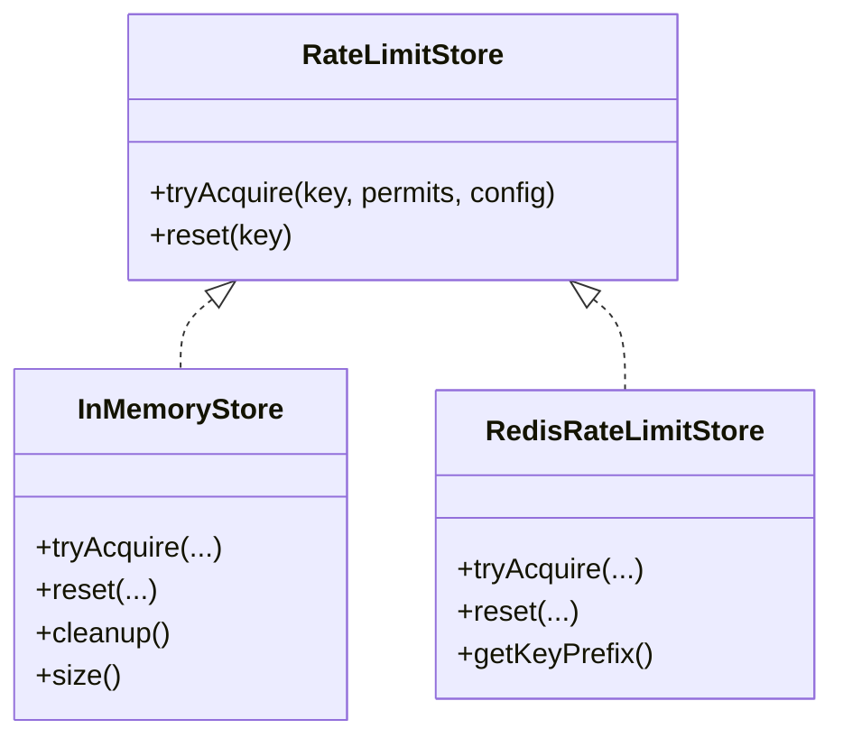
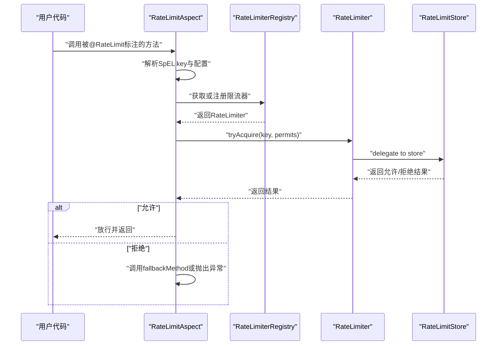
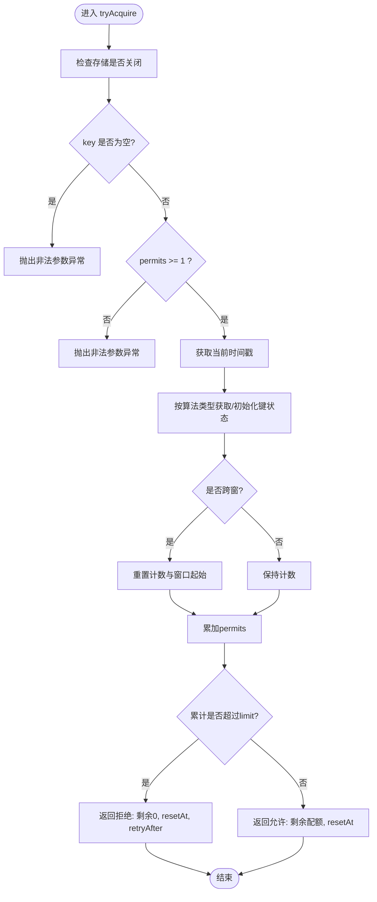
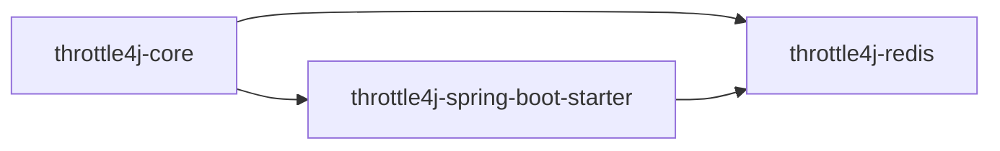

# 扩展开发

<cite>
**本文引用的文件**
- [AbstractStoreBackedRateLimiter.java](file://throttle4j-core/src/main/java/com/throttle4j/algorithm/AbstractStoreBackedRateLimiter.java)
- [RateLimiter.java](file://throttle4j-core/src/main/java/com/throttle4j/core/RateLimiter.java)
- [RateLimiterConfig.java](file://throttle4j-core/src/main/java/com/throttle4j/core/RateLimiterConfig.java)
- [Algorithm.java](file://throttle4j-core/src/main/java/com/throttle4j/core/Algorithm.java)
- [RateLimitStore.java](file://throttle4j-core/src/main/java/com/throttle4j/store/RateLimitStore.java)
- [InMemoryStore.java](file://throttle4j-core/src/main/java/com/throttle4j/store/InMemoryStore.java)
- [FixedWindowRateLimiter.java](file://throttle4j-core/src/main/java/com/throttle4j/algorithm/FixedWindowRateLimiter.java)
- [SlidingWindowRateLimiter.java](file://throttle4j-core/src/main/java/com/throttle4j/algorithm/SlidingWindowRateLimiter.java)
- [TokenBucketRateLimiter.java](file://throttle4j-core/src/main/java/com/throttle4j/algorithm/TokenBucketRateLimiter.java)
- [LeakyBucketRateLimiter.java](file://throttle4j-core/src/main/java/com/throttle4j/algorithm/LeakyBucketRateLimiter.java)
- [DefaultRateLimiterFactory.java](file://throttle4j-core/src/main/java/com/throttle4j/algorithm/DefaultRateLimiterFactory.java)
- [RedisRateLimitStore.java](file://throttle4j-redis/src/main/java/com/throttle4j/redis/RedisRateLimitStore.java)
- [RateLimit.java](file://throttle4j-spring-boot-starter/src/main/java/com/throttle4j/spring/annotation/RateLimit.java)
- [RateLimitAspect.java](file://throttle4j-spring-boot-starter/src/main/java/com/throttle4j/spring/aop/RateLimitAspect.java)
- [Throttle4jAutoConfiguration.java](file://throttle4j-spring-boot-starter/src/main/java/com/throttle4j/spring/autoconfigure/Throttle4jAutoConfiguration.java)
- [Throttle4jProperties.java](file://throttle4j-spring-boot-starter/src/main/java/com/throttle4j/spring/autoconfigure/Throttle4jProperties.java)
- [SpringBootExampleApplication.java](file://throttle4j-examples/src/main/java/com/throttle4j/example/SpringBootExampleApplication.java)
</cite>

## 目录
1. [引言](#引言)
2. [项目结构](#项目结构)
3. [核心组件](#核心组件)
4. [架构总览](#架构总览)
5. [详细组件分析](#详细组件分析)
6. [依赖分析](#依赖分析)
7. [性能考量](#性能考量)
8. [故障排查指南](#故障排查指南)
9. [结论](#结论)
10. [附录：扩展示例与集成测试](#附录扩展示例与集成测试)

## 引言
本指南面向希望为 throttle4j 进行扩展的开发者，系统讲解以下三类扩展能力：
- 新增限流算法：基于抽象基类实现算法逻辑，并通过统一的存储接口完成状态管理。
- 自定义存储后端：实现统一的存储接口以适配不同数据源（如数据库、分布式缓存等）。
- Spring Boot 集成扩展：开发自定义注解与自动配置，实现声明式限流与 AOP 拦截。

同时给出设计原则、架构考量、扩展示例与集成测试方法，帮助你快速、安全地完成扩展开发。

## 项目结构
throttle4j 采用模块化组织，核心层提供算法与存储抽象，Redis 模块提供分布式存储实现，Spring Boot Starter 提供注解与自动装配能力，Examples 提供使用示例。

**图表来源**
- [RateLimiter.java:1-32](file://throttle4j-core/src/main/java/com/throttle4j/core/RateLimiter.java#L1-L32)
- [Algorithm.java:1-16](file://throttle4j-core/src/main/java/com/throttle4j/core/Algorithm.java#L1-L16)
- [RateLimiterConfig.java:1-113](file://throttle4j-core/src/main/java/com/throttle4j/core/RateLimiterConfig.java#L1-L113)
- [RateLimitStore.java:1-35](file://throttle4j-core/src/main/java/com/throttle4j/store/RateLimitStore.java#L1-L35)
- [AbstractStoreBackedRateLimiter.java:1-42](file://throttle4j-core/src/main/java/com/throttle4j/algorithm/AbstractStoreBackedRateLimiter.java#L1-L42)
- [InMemoryStore.java:1-315](file://throttle4j-core/src/main/java/com/throttle4j/store/InMemoryStore.java#L1-L315)
- [FixedWindowRateLimiter.java:1-18](file://throttle4j-core/src/main/java/com/throttle4j/algorithm/FixedWindowRateLimiter.java#L1-L18)
- [SlidingWindowRateLimiter.java:1-16](file://throttle4j-core/src/main/java/com/throttle4j/algorithm/SlidingWindowRateLimiter.java#L1-L16)
- [TokenBucketRateLimiter.java:1-16](file://throttle4j-core/src/main/java/com/throttle4j/algorithm/TokenBucketRateLimiter.java#L1-L16)
- [LeakyBucketRateLimiter.java:1-16](file://throttle4j-core/src/main/java/com/throttle4j/algorithm/LeakyBucketRateLimiter.java#L1-L16)
- [RedisRateLimitStore.java:1-258](file://throttle4j-redis/src/main/java/com/throttle4j/redis/RedisRateLimitStore.java#L1-L258)
- [RateLimit.java:1-75](file://throttle4j-spring-boot-starter/src/main/java/com/throttle4j/spring/annotation/RateLimit.java#L1-L75)
- [RateLimitAspect.java:1-186](file://throttle4j-spring-boot-starter/src/main/java/com/throttle4j/spring/aop/RateLimitAspect.java#L1-L186)
- [Throttle4jAutoConfiguration.java:1-132](file://throttle4j-spring-boot-starter/src/main/java/com/throttle4j/spring/autoconfigure/Throttle4jAutoConfiguration.java#L1-L132)
- [Throttle4jProperties.java](file://throttle4j-spring-boot-starter/src/main/java/com/throttle4j/spring/autoconfigure/Throttle4jProperties.java)
- [SpringBootExampleApplication.java:1-19](file://throttle4j-examples/src/main/java/com/throttle4j/example/SpringBootExampleApplication.java#L1-L19)

**章节来源**
- [SpringBootExampleApplication.java:12-18](file://throttle4j-examples/src/main/java/com/throttle4j/example/SpringBootExampleApplication.java#L12-L18)

## 核心组件
- 核心接口与配置
  - RateLimiter：定义 tryAcquire(key) 与 tryAcquire(key, permits) 以及 getConfig()。
  - Algorithm：枚举支持的算法类型。
  - RateLimiterConfig：不可变配置，Builder 负责校验与构建。
- 存储抽象
  - RateLimitStore：定义 tryAcquire(key, permits, config) 与 reset(key)，所有实现必须线程安全。
- 算法基类
  - AbstractStoreBackedRateLimiter：封装通用的 permits 参数校验与委托给存储执行的逻辑。

这些组件共同构成“算法层”与“存储层”的清晰分层，算法层只负责参数校验与委托，存储层负责具体的状态维护与原子判断。

**章节来源**
- [RateLimiter.java:8-31](file://throttle4j-core/src/main/java/com/throttle4j/core/RateLimiter.java#L8-L31)
- [Algorithm.java:6-15](file://throttle4j-core/src/main/java/com/throttle4j/core/Algorithm.java#L6-L15)
- [RateLimiterConfig.java:8-113](file://throttle4j-core/src/main/java/com/throttle4j/core/RateLimiterConfig.java#L8-L113)
- [RateLimitStore.java:15-34](file://throttle4j-core/src/main/java/com/throttle4j/store/RateLimitStore.java#L15-L34)
- [AbstractStoreBackedRateLimiter.java:14-41](file://throttle4j-core/src/main/java/com/throttle4j/algorithm/AbstractStoreBackedRateLimiter.java#L14-L41)

## 架构总览
throttle4j 的扩展点主要集中在两个维度：
- 算法扩展：新增算法实现类，继承抽象基类，复用统一的存储接口。
- 存储扩展：实现存储接口，适配任意后端；Spring Boot 自动配置可按需注入。

**图表来源**
- [RateLimiter.java:1-32](file://throttle4j-core/src/main/java/com/throttle4j/core/RateLimiter.java#L1-L32)
- [RateLimitStore.java:1-35](file://throttle4j-core/src/main/java/com/throttle4j/store/RateLimitStore.java#L1-L35)
- [AbstractStoreBackedRateLimiter.java:1-42](file://throttle4j-core/src/main/java/com/throttle4j/algorithm/AbstractStoreBackedRateLimiter.java#L1-L42)
- [FixedWindowRateLimiter.java:1-18](file://throttle4j-core/src/main/java/com/throttle4j/algorithm/FixedWindowRateLimiter.java#L1-L18)
- [SlidingWindowRateLimiter.java:1-16](file://throttle4j-core/src/main/java/com/throttle4j/algorithm/SlidingWindowRateLimiter.java#L1-L16)
- [TokenBucketRateLimiter.java:1-16](file://throttle4j-core/src/main/java/com/throttle4j/algorithm/TokenBucketRateLimiter.java#L1-L16)
- [LeakyBucketRateLimiter.java:1-16](file://throttle4j-core/src/main/java/com/throttle4j/algorithm/LeakyBucketRateLimiter.java#L1-L16)
- [InMemoryStore.java:1-315](file://throttle4j-core/src/main/java/com/throttle4j/store/InMemoryStore.java#L1-L315)
- [RedisRateLimitStore.java:1-258](file://throttle4j-redis/src/main/java/com/throttle4j/redis/RedisRateLimitStore.java#L1-L258)

## 详细组件分析

### 组件A：新增限流算法（继承 AbstractStoreBackedRateLimiter）
- 实现要求
  - 继承抽象基类，构造函数传入 RateLimiterConfig 与 RateLimitStore。
  - 基类已处理 permits 参数校验与委托调用，算法实现只需关注状态读取与更新。
  - 在算法实现类中，通常通过 store.tryAcquire(...) 获取结果，再根据算法规则进行允许/拒绝判断与剩余量计算。
- 设计原则
  - 将“算法逻辑”与“状态持久化/并发控制”解耦，统一由存储层负责。
  - 保持线程安全：算法内部对共享状态的访问应同步或使用无锁结构。
  - 明确返回值语义：允许时返回剩余配额与重置时间；拒绝时返回剩余配额、重置时间与重试等待时间。
- 复杂度与性能
  - 时间复杂度取决于存储实现与算法内部操作次数；空间复杂度与每键状态大小相关。
  - 对于高并发场景，建议优先选择线程安全且低锁竞争的存储实现。

**图表来源**
- [AbstractStoreBackedRateLimiter.java:14-41](file://throttle4j-core/src/main/java/com/throttle4j/algorithm/AbstractStoreBackedRateLimiter.java#L14-L41)
- [FixedWindowRateLimiter.java:12-16](file://throttle4j-core/src/main/java/com/throttle4j/algorithm/FixedWindowRateLimiter.java#L12-L16)
- [SlidingWindowRateLimiter.java:10-14](file://throttle4j-core/src/main/java/com/throttle4j/algorithm/SlidingWindowRateLimiter.java#L10-L14)
- [TokenBucketRateLimiter.java:10-14](file://throttle4j-core/src/main/java/com/throttle4j/algorithm/TokenBucketRateLimiter.java#L10-L14)
- [LeakyBucketRateLimiter.java:10-14](file://throttle4j-core/src/main/java/com/throttle4j/algorithm/LeakyBucketRateLimiter.java#L10-L14)

**章节来源**
- [AbstractStoreBackedRateLimiter.java:19-35](file://throttle4j-core/src/main/java/com/throttle4j/algorithm/AbstractStoreBackedRateLimiter.java#L19-L35)
- [FixedWindowRateLimiter.java:14-16](file://throttle4j-core/src/main/java/com/throttle4j/algorithm/FixedWindowRateLimiter.java#L14-L16)
- [SlidingWindowRateLimiter.java:12-14](file://throttle4j-core/src/main/java/com/throttle4j/algorithm/SlidingWindowRateLimiter.java#L12-L14)
- [TokenBucketRateLimiter.java:12-14](file://throttle4j-core/src/main/java/com/throttle4j/algorithm/TokenBucketRateLimiter.java#L12-L14)
- [LeakyBucketRateLimiter.java:12-14](file://throttle4j-core/src/main/java/com/throttle4j/algorithm/LeakyBucketRateLimiter.java#L12-L14)

### 组件B：开发自定义存储后端（实现 RateLimitStore 接口）
- 接口规范
  - tryAcquire(key, permits, config)：根据配置与当前状态尝试扣减配额，返回允许/拒绝结果。
  - reset(key)：重置指定键的状态。
  - 线程安全：实现必须保证多线程并发安全。
- 参考实现
  - 内存存储 InMemoryStore：为每种算法维护独立的并发映射表，定时清理空闲键，适合单机场景。
  - Redis 存储 RedisRateLimitStore：将算法逻辑下沉到 Lua 脚本，在服务端原子执行，适合分布式场景。
- 设计要点
  - 键空间隔离：避免与其他模块冲突，必要时使用前缀。
  - 原子性：在分布式存储中，确保“检查-更新”是原子操作。
  - 可观测性：记录关键日志，便于定位问题。
  - 资源管理：实现 AutoCloseable 或提供关闭钩子，释放资源。

**图表来源**
- [RateLimitStore.java:15-34](file://throttle4j-core/src/main/java/com/throttle4j/store/RateLimitStore.java#L15-L34)
- [InMemoryStore.java:24-101](file://throttle4j-core/src/main/java/com/throttle4j/store/InMemoryStore.java#L24-L101)
- [RedisRateLimitStore.java:40-118](file://throttle4j-redis/src/main/java/com/throttle4j/redis/RedisRateLimitStore.java#L40-L118)

**章节来源**
- [RateLimitStore.java:15-34](file://throttle4j-core/src/main/java/com/throttle4j/store/RateLimitStore.java#L15-L34)
- [InMemoryStore.java:68-93](file://throttle4j-core/src/main/java/com/throttle4j/store/InMemoryStore.java#L68-L93)
- [InMemoryStore.java:95-101](file://throttle4j-core/src/main/java/com/throttle4j/store/InMemoryStore.java#L95-L101)
- [RedisRateLimitStore.java:80-110](file://throttle4j-redis/src/main/java/com/throttle4j/redis/RedisRateLimitStore.java#L80-L110)
- [RedisRateLimitStore.java:112-118](file://throttle4j-redis/src/main/java/com/throttle4j/redis/RedisRateLimitStore.java#L112-L118)

### 组件C：Spring Boot 集成扩展（自定义注解与自动配置）
- 自定义注解
  - 支持 key、limit、window、algorithm、permits、fallbackMethod 等属性。
  - key 支持 SpEL 表达式，未设置时默认使用“类名.方法名”。
- AOP 切面
  - 拦截带注解的方法，解析 key 与配置，从注册表获取/创建限流器，执行 tryAcquire。
  - 允许则放行，拒绝则调用 fallbackMethod 或抛出异常。
- 自动配置
  - 条件装配：当 throttle4j.enabled=true 时启用。
  - 注册默认存储（内存或 Redis，Redis 不可用时回退），注册工厂与注册表，注册 AOP 切面。
  - 通过反射尝试加载 Redis 存储实现，避免硬依赖。

**图表来源**
- [RateLimit.java:26-74](file://throttle4j-spring-boot-starter/src/main/java/com/throttle4j/spring/annotation/RateLimit.java#L26-L74)
- [RateLimitAspect.java:68-91](file://throttle4j-spring-boot-starter/src/main/java/com/throttle4j/spring/aop/RateLimitAspect.java#L68-L91)
- [Throttle4jAutoConfiguration.java:27-131](file://throttle4j-spring-boot-starter/src/main/java/com/throttle4j/spring/autoconfigure/Throttle4jAutoConfiguration.java#L27-L131)

**章节来源**
- [RateLimit.java:26-74](file://throttle4j-spring-boot-starter/src/main/java/com/throttle4j/spring/annotation/RateLimit.java#L26-L74)
- [RateLimitAspect.java:68-115](file://throttle4j-spring-boot-starter/src/main/java/com/throttle4j/spring/aop/RateLimitAspect.java#L68-L115)
- [Throttle4jAutoConfiguration.java:27-131](file://throttle4j-spring-boot-starter/src/main/java/com/throttle4j/spring/autoconfigure/Throttle4jAutoConfiguration.java#L27-L131)

### 组件D：算法实现流程（以固定窗口为例）
固定窗口算法的核心流程如下：

**图表来源**
- [InMemoryStore.java:150-170](file://throttle4j-core/src/main/java/com/throttle4j/store/InMemoryStore.java#L150-170)

**章节来源**
- [InMemoryStore.java:150-170](file://throttle4j-core/src/main/java/com/throttle4j/store/InMemoryStore.java#L150-L170)

## 依赖分析
- 模块间依赖
  - Redis 模块依赖核心模块的接口与配置。
  - Spring Boot Starter 依赖核心模块与注解，同时通过条件装配与反射加载 Redis 存储。
- 组件耦合
  - 算法实现仅依赖存储接口，耦合度低，易于替换存储。
  - 存储实现与算法实现解耦，可通过不同存储支撑多种算法。
- 循环依赖
  - 当前结构无循环依赖，符合模块化设计。

**图表来源**
- [Throttle4jAutoConfiguration.java:34-99](file://throttle4j-spring-boot-starter/src/main/java/com/throttle4j/spring/autoconfigure/Throttle4jAutoConfiguration.java#L34-L99)

**章节来源**
- [Throttle4jAutoConfiguration.java:34-99](file://throttle4j-spring-boot-starter/src/main/java/com/throttle4j/spring/autoconfigure/Throttle4jAutoConfiguration.java#L34-L99)

## 性能考量
- 存储层
  - 内存存储：低延迟、高吞吐，适合单机部署；注意空闲键清理策略与内存占用。
  - Redis 存储：原子脚本保障一致性，适合分布式部署；注意网络延迟与脚本加载开销。
- 算法层
  - 固定窗口：实现简单，易受边界抖动影响。
  - 滑动窗口：更平滑，但需要额外状态管理。
  - 令牌桶/漏桶：适合突发流量控制与稳定输出速率。
- Spring Boot 集成
  - AOP 切面在方法调用前后增加少量开销，可通过合理的键表达式与缓存减少 SpEL 解析成本。

## 故障排查指南
- 常见异常
  - 非法参数：key 为空、permits < 1、limit ≤ 0、windowMillis ≤ 0、TOKEN_BUCKET 缺少 refillRate 等。
  - 存储关闭：InMemoryStore 关闭后继续使用会抛出异常。
  - Redis 脚本缺失：Lua 脚本加载失败会抛出异常。
- 定位方法
  - 查看日志：自动配置会在 Redis 不可用时记录警告；AOP 切面在拒绝时记录调试信息。
  - 单元测试：针对算法与存储分别编写测试，覆盖边界条件与并发场景。
  - 集成测试：通过 Spring Boot 示例应用验证注解与自动配置链路。

**章节来源**
- [InMemoryStore.java:70-78](file://throttle4j-core/src/main/java/com/throttle4j/store/InMemoryStore.java#L70-L78)
- [RateLimiterConfig.java:91-110](file://throttle4j-core/src/main/java/com/throttle4j/core/RateLimiterConfig.java#L91-L110)
- [RedisRateLimitStore.java:226-251](file://throttle4j-redis/src/main/java/com/throttle4j/redis/RedisRateLimitStore.java#L226-L251)
- [Throttle4jAutoConfiguration.java:53-55](file://throttle4j-spring-boot-starter/src/main/java/com/throttle4j/spring/autoconfigure/Throttle4jAutoConfiguration.java#L53-L55)
- [RateLimitAspect.java:86-91](file://throttle4j-spring-boot-starter/src/main/java/com/throttle4j/spring/aop/RateLimitAspect.java#L86-L91)

## 结论
throttle4j 通过清晰的“算法层-存储层-集成层”分层设计，提供了高度可扩展的限流框架。开发者可以：
- 通过继承抽象基类快速实现新算法；
- 通过实现存储接口适配任意后端；
- 通过自定义注解与自动配置无缝接入 Spring Boot 应用。

遵循本文档的设计原则与最佳实践，可在保证正确性与性能的前提下，高效完成扩展开发。

## 附录：扩展示例与集成测试

### 扩展示例一：新增一个自定义算法
- 步骤
  - 新建类继承抽象基类，构造函数传入配置与存储。
  - 在类中实现算法逻辑，委托存储获取结果并根据规则返回允许/拒绝。
  - 如需注册工厂或在 Spring 中使用，参考默认工厂与自动配置的模式。
- 参考路径
  - [AbstractStoreBackedRateLimiter.java:19-22](file://throttle4j-core/src/main/java/com/throttle4j/algorithm/AbstractStoreBackedRateLimiter.java#L19-L22)
  - [FixedWindowRateLimiter.java:14-16](file://throttle4j-core/src/main/java/com/throttle4j/algorithm/FixedWindowRateLimiter.java#L14-L16)
  - [SlidingWindowRateLimiter.java:12-14](file://throttle4j-core/src/main/java/com/throttle4j/algorithm/SlidingWindowRateLimiter.java#L12-L14)
  - [TokenBucketRateLimiter.java:12-14](file://throttle4j-core/src/main/java/com/throttle4j/algorithm/TokenBucketRateLimiter.java#L12-L14)
  - [LeakyBucketRateLimiter.java:12-14](file://throttle4j-core/src/main/java/com/throttle4j/algorithm/LeakyBucketRateLimiter.java#L12-L14)

**章节来源**
- [AbstractStoreBackedRateLimiter.java:19-22](file://throttle4j-core/src/main/java/com/throttle4j/algorithm/AbstractStoreBackedRateLimiter.java#L19-L22)
- [FixedWindowRateLimiter.java:14-16](file://throttle4j-core/src/main/java/com/throttle4j/algorithm/FixedWindowRateLimiter.java#L14-L16)
- [SlidingWindowRateLimiter.java:12-14](file://throttle4j-core/src/main/java/com/throttle4j/algorithm/SlidingWindowRateLimiter.java#L12-L14)
- [TokenBucketRateLimiter.java:12-14](file://throttle4j-core/src/main/java/com/throttle4j/algorithm/TokenBucketRateLimiter.java#L12-L14)
- [LeakyBucketRateLimiter.java:12-14](file://throttle4j-core/src/main/java/com/throttle4j/algorithm/LeakyBucketRateLimiter.java#L12-L14)

### 扩展示例二：自定义存储后端
- 步骤
  - 实现 RateLimitStore 接口，确保线程安全与原子性。
  - 参考内存与 Redis 实现，分别处理本地状态与远程状态。
  - 在自动配置中注册你的存储 Bean，或通过外部配置注入。
- 参考路径
  - [RateLimitStore.java:15-34](file://throttle4j-core/src/main/java/com/throttle4j/store/RateLimitStore.java#L15-L34)
  - [InMemoryStore.java:68-101](file://throttle4j-core/src/main/java/com/throttle4j/store/InMemoryStore.java#L68-L101)
  - [RedisRateLimitStore.java:80-118](file://throttle4j-redis/src/main/java/com/throttle4j/redis/RedisRateLimitStore.java#L80-L118)

**章节来源**
- [RateLimitStore.java:15-34](file://throttle4j-core/src/main/java/com/throttle4j/store/RateLimitStore.java#L15-L34)
- [InMemoryStore.java:68-101](file://throttle4j-core/src/main/java/com/throttle4j/store/InMemoryStore.java#L68-L101)
- [RedisRateLimitStore.java:80-118](file://throttle4j-redis/src/main/java/com/throttle4j/redis/RedisRateLimitStore.java#L80-L118)

### 扩展点设计原则与架构考虑
- 分层清晰
  - 算法层只负责业务逻辑，存储层负责状态与并发控制。
- 接口最小化
  - 通过统一接口约束扩展点，降低变更成本。
- 可插拔
  - 通过 Spring 条件装配与反射机制，实现模块级可选依赖。
- 线程安全
  - 存储实现必须保证线程安全；算法内部同步或使用无锁结构。
- 可观测性
  - 记录关键日志，便于定位问题；提供清理与统计能力。

### 集成测试方法
- 单元测试
  - 针对算法与存储分别编写测试，覆盖正常、边界与异常场景。
  - 使用并发测试验证线程安全。
- 集成测试
  - 启动示例应用，通过 HTTP 请求或控制器方法触发限流逻辑。
  - 验证注解生效、AOP 切面拦截、fallback 方法调用与异常抛出。
- 参考路径
  - [SpringBootExampleApplication.java:12-18](file://throttle4j-examples/src/main/java/com/throttle4j/example/SpringBootExampleApplication.java#L12-L18)
  - [Throttle4jAutoConfiguration.java:27-131](file://throttle4j-spring-boot-starter/src/main/java/com/throttle4j/spring/autoconfigure/Throttle4jAutoConfiguration.java#L27-L131)
  - [RateLimitAspect.java:68-115](file://throttle4j-spring-boot-starter/src/main/java/com/throttle4j/spring/aop/RateLimitAspect.java#L68-L115)

**章节来源**
- [SpringBootExampleApplication.java:12-18](file://throttle4j-examples/src/main/java/com/throttle4j/example/SpringBootExampleApplication.java#L12-L18)
- [Throttle4jAutoConfiguration.java:27-131](file://throttle4j-spring-boot-starter/src/main/java/com/throttle4j/spring/autoconfigure/Throttle4jAutoConfiguration.java#L27-L131)
- [RateLimitAspect.java:68-115](file://throttle4j-spring-boot-starter/src/main/java/com/throttle4j/spring/aop/RateLimitAspect.java#L68-L115)