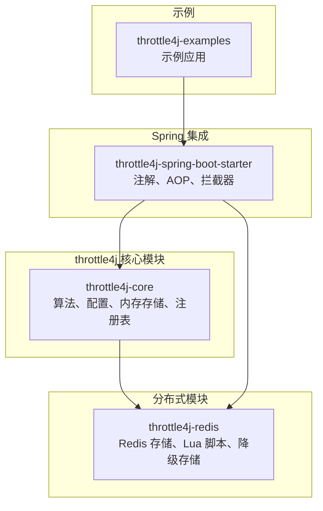
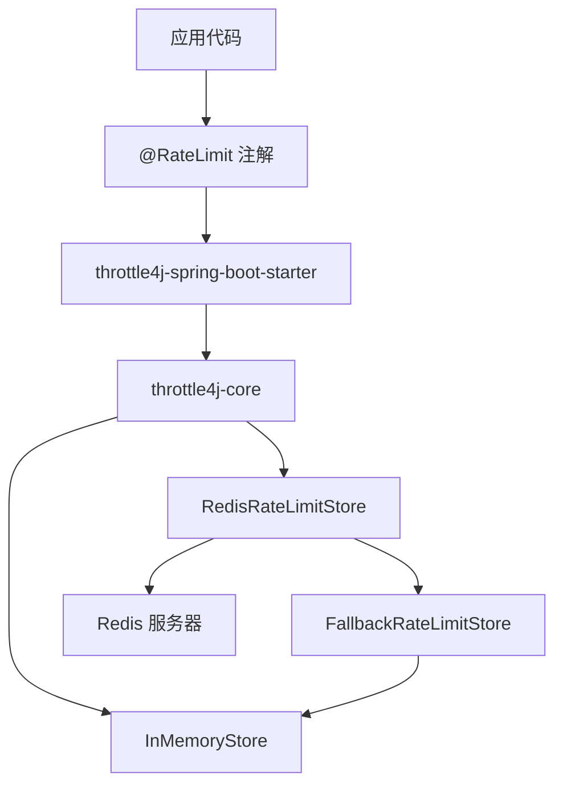
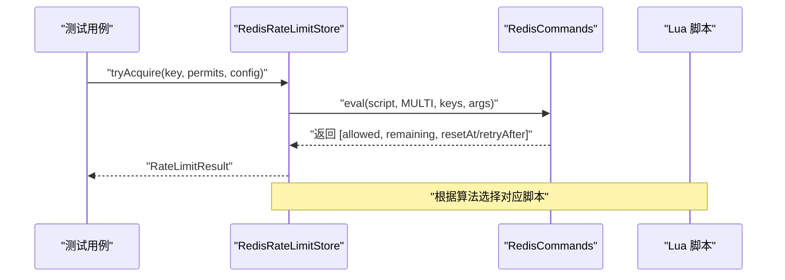
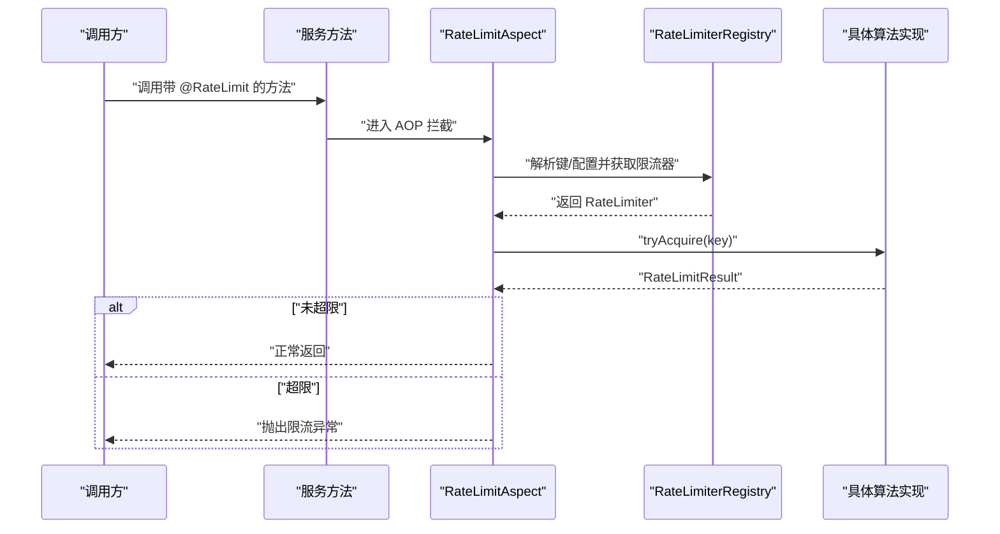
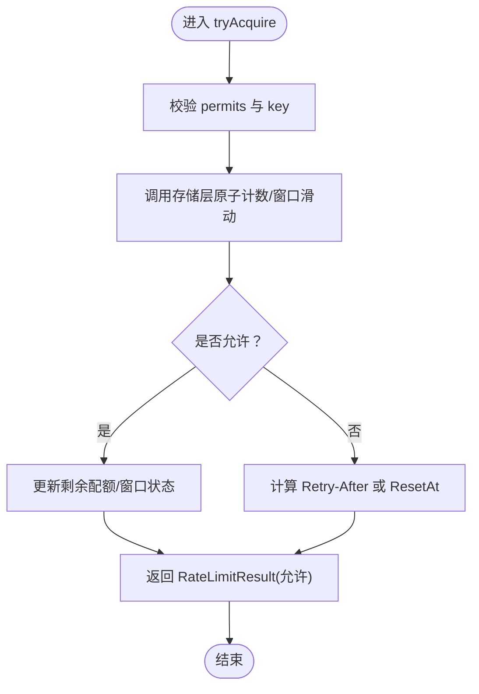
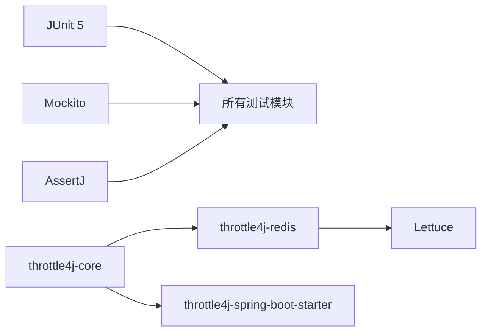

# 扩展测试指南

<cite>
**本文档引用的文件**
- [README.md](file://README.md)
- [CONTRIBUTING.md](file://CONTRIBUTING.md)
- [pom.xml](file://pom.xml)
- [throttle4j-core/pom.xml](file://throttle4j-core/pom.xml)
- [throttle4j-redis/pom.xml](file://throttle4j-redis/pom.xml)
- [throttle4j-spring-boot-starter/pom.xml](file://throttle4j-spring-boot-starter/pom.xml)
- [.github/workflows/ci.yml](file://.github/workflows/ci.yml)
- [throttle4j-core/src/test/java/com/throttle4j/core/RateLimiterConfigTest.java](file://throttle4j-core/src/test/java/com/throttle4j/core/RateLimiterConfigTest.java)
- [throttle4j-core/src/test/java/com/throttle4j/core/RateLimiterRegistryTest.java](file://throttle4j-core/src/test/java/com/throttle4j/core/RateLimiterRegistryTest.java)
- [throttle4j-core/src/test/java/com/throttle4j/store/InMemoryStoreTest.java](file://throttle4j-core/src/test/java/com/throttle4j/store/InMemoryStoreTest.java)
- [throttle4j-core/src/test/java/com/throttle4j/algorithm/FixedWindowRateLimiterTest.java](file://throttle4j-core/src/test/java/com/throttle4j/algorithm/FixedWindowRateLimiterTest.java)
- [throttle4j-core/src/test/java/com/throttle4j/algorithm/TokenBucketRateLimiterTest.java](file://throttle4j-core/src/test/java/com/throttle4j/algorithm/TokenBucketRateLimiterTest.java)
- [throttle4j-core/src/test/java/com/throttle4j/algorithm/SlidingWindowRateLimiterTest.java](file://throttle4j-core/src/test/java/com/throttle4j/algorithm/SlidingWindowRateLimiterTest.java)
- [throttle4j-core/src/test/java/com/throttle4j/algorithm/LeakyBucketRateLimiterTest.java](file://throttle4j-core/src/test/java/com/throttle4j/algorithm/LeakyBucketRateLimiterTest.java)
- [throttle4j-redis/src/test/java/com/throttle4j/redis/RedisRateLimitStoreTest.java](file://throttle4j-redis/src/test/java/com/throttle4j/redis/RedisRateLimitStoreTest.java)
- [throttle4j-redis/src/test/java/com/throttle4j/redis/FallbackRateLimitStoreTest.java](file://throttle4j-redis/src/test/java/com/throttle4j/redis/FallbackRateLimitStoreTest.java)
- [throttle4j-spring-boot-starter/src/test/java/com/throttle4j/spring/aop/RateLimitAspectTest.java](file://throttle4j-spring-boot-starter/src/test/java/com/throttle4j/spring/aop/RateLimitAspectTest.java)
- [throttle4j-spring-boot-starter/src/test/java/com/throttle4j/spring/util/WindowParserTest.java](file://throttle4j-spring-boot-starter/src/test/java/com/throttle4j/spring/util/WindowParserTest.java)
</cite>

## 目录
1. [简介](#简介)
2. [项目结构](#项目结构)
3. [核心组件](#核心组件)
4. [架构总览](#架构总览)
5. [详细组件分析](#详细组件分析)
6. [依赖分析](#依赖分析)
7. [性能考虑](#性能考虑)
8. [故障排查指南](#故障排查指南)
9. [结论](#结论)
10. [附录](#附录)

## 简介
本指南面向为 throttle4j 编写扩展的开发者，系统性阐述如何为自定义扩展编写全面的测试用例，涵盖单元测试最佳实践（边界条件、并发安全、性能基准）、集成测试方法（真实 Redis 连接、分布式场景、故障恢复）、测试覆盖率要求、持续集成配置与回归测试策略，并给出测试工具推荐与自动化测试脚本示例。

## 项目结构
throttle4j 采用多模块结构，核心能力在 core 模块，Redis 分布式能力在 redis 模块，Spring Boot 集成在 spring-boot-starter 模块，examples 提供可运行示例。各模块均包含独立的单元测试套件，使用 JUnit 5、Mockito 进行测试。

图表来源
- [pom.xml:15-20](file://pom.xml#L15-L20)
- [throttle4j-core/pom.xml:13](file://throttle4j-core/pom.xml#L13)
- [throttle4j-redis/pom.xml:13](file://throttle4j-redis/pom.xml#L13)
- [throttle4j-spring-boot-starter/pom.xml:13](file://throttle4j-spring-boot-starter/pom.xml#L13)

章节来源
- [README.md:143-160](file://README.md#L143-L160)
- [pom.xml:15-20](file://pom.xml#L15-L20)

## 核心组件
- 算法层：固定窗口、滑动窗口、令牌桶、漏桶四种限流算法，均通过统一的 RateLimiter 接口对外提供 tryAcquire 能力。
- 存储层：内存存储 InMemoryStore 用于单机；Redis 存储 RedisRateLimitStore 通过 Lettuce + Lua 原子脚本实现；支持降级存储 FallbackRateLimitStore。
- 注解与 AOP：@RateLimit 注解配合 RateLimitAspect 实现声明式限流。
- 配置模型：RateLimiterConfig 提供算法、配额、窗口、补充参数等配置能力。

章节来源
- [README.md:14-22](file://README.md#L14-L22)
- [README.md:76-112](file://README.md#L76-L112)

## 架构总览
下图展示从应用到核心算法、再到存储层的整体调用链路，以及 Redis 分布式与降级路径。

图表来源
- [README.md:78-94](file://README.md#L78-L94)
- [throttle4j-spring-boot-starter/src/test/java/com/throttle4j/spring/aop/RateLimitAspectTest.java:25](file://throttle4j-spring-boot-starter/src/test/java/com/throttle4j/spring/aop/RateLimitAspectTest.java#L25)

## 详细组件分析

### 单元测试最佳实践
- 边界条件测试
  - 配置校验：缺失算法、非正配额、非正窗口、令牌桶缺少 refillRate 等非法输入应抛出异常。
  - 获取/重置/清理：键隔离、状态清理、关闭后禁止访问等行为需覆盖。
  - 多许可请求：单次申请多个许可、剩余配额计算正确性。
- 并发安全性验证
  - 注册表并发：多线程同时注册同一键名应返回相同实例，size 正确。
  - 算法并发：固定窗口/滑动窗口/令牌桶/漏桶在高并发下不超限，允许数不超过容量或配额。
- 性能基准测试
  - 使用 JMH 或基于测试框架的微基准方法评估不同算法在不同负载下的吞吐与延迟。
  - 关注锁竞争、GC 抖动对限流性能的影响。

章节来源
- [throttle4j-core/src/test/java/com/throttle4j/core/RateLimiterConfigTest.java:9-62](file://throttle4j-core/src/test/java/com/throttle4j/core/RateLimiterConfigTest.java#L9-L62)
- [throttle4j-core/src/test/java/com/throttle4j/core/RateLimiterRegistryTest.java:71-94](file://throttle4j-core/src/test/java/com/throttle4j/core/RateLimiterRegistryTest.java#L71-L94)
- [throttle4j-core/src/test/java/com/throttle4j/store/InMemoryStoreTest.java:36-100](file://throttle4j-core/src/test/java/com/throttle4j/store/InMemoryStoreTest.java#L36-L100)
- [throttle4j-core/src/test/java/com/throttle4j/algorithm/FixedWindowRateLimiterTest.java:44-111](file://throttle4j-core/src/test/java/com/throttle4j/algorithm/FixedWindowRateLimiterTest.java#L44-L111)
- [throttle4j-core/src/test/java/com/throttle4j/algorithm/TokenBucketRateLimiterTest.java:43-113](file://throttle4j-core/src/test/java/com/throttle4j/algorithm/TokenBucketRateLimiterTest.java#L43-L113)
- [throttle4j-core/src/test/java/com/throttle4j/algorithm/SlidingWindowRateLimiterTest.java:43-113](file://throttle4j-core/src/test/java/com/throttle4j/algorithm/SlidingWindowRateLimiterTest.java#L43-L113)
- [throttle4j-core/src/test/java/com/throttle4j/algorithm/LeakyBucketRateLimiterTest.java:43-111](file://throttle4j-core/src/test/java/com/throttle4j/algorithm/LeakyBucketRateLimiterTest.java#L43-L111)

### Redis 存储与 Lua 脚本测试
- 行为验证
  - 固定窗口/滑动窗口/令牌桶分别调用对应 Lua 脚本，参数与键前缀正确。
  - 拒绝时返回合理的 Retry-After 或 ResetAt。
  - reset 清理键，null 键处理与异常返回类型保护。
- 降级存储
  - 主存储失败时自动切换到降级存储，统计降级次数，reset 广播至双存储且吞掉异常。

图表来源
- [throttle4j-redis/src/test/java/com/throttle4j/redis/RedisRateLimitStoreTest.java:44-138](file://throttle4j-redis/src/test/java/com/throttle4j/redis/RedisRateLimitStoreTest.java#L44-L138)

章节来源
- [throttle4j-redis/src/test/java/com/throttle4j/redis/RedisRateLimitStoreTest.java:44-283](file://throttle4j-redis/src/test/java/com/throttle4j/redis/RedisRateLimitStoreTest.java#L44-L283)
- [throttle4j-redis/src/test/java/com/throttle4j/redis/FallbackRateLimitStoreTest.java:53-114](file://throttle4j-redis/src/test/java/com/throttle4j/redis/FallbackRateLimitStoreTest.java#L53-L114)

### Spring Boot 注解与 AOP 测试
- 注解生效：在受管 Bean 上使用 @RateLimit，方法被拦截后限流逻辑正确执行。
- 降级方法：超过配额时触发 fallbackMethod 返回降级结果。
- 键隔离：不同用户键互不影响。

图表来源
- [throttle4j-spring-boot-starter/src/test/java/com/throttle4j/spring/aop/RateLimitAspectTest.java:41-70](file://throttle4j-spring-boot-starter/src/test/java/com/throttle4j/spring/aop/RateLimitAspectTest.java#L41-L70)

章节来源
- [throttle4j-spring-boot-starter/src/test/java/com/throttle4j/spring/aop/RateLimitAspectTest.java:25-129](file://throttle4j-spring-boot-starter/src/test/java/com/throttle4j/spring/aop/RateLimitAspectTest.java#L25-L129)
- [throttle4j-spring-boot-starter/src/test/java/com/throttle4j/spring/util/WindowParserTest.java:10-57](file://throttle4j-spring-boot-starter/src/test/java/com/throttle4j/spring/util/WindowParserTest.java#L10-L57)

### 算法流程图（以固定窗口为例）

图表来源
- [throttle4j-core/src/test/java/com/throttle4j/algorithm/FixedWindowRateLimiterTest.java:44-54](file://throttle4j-core/src/test/java/com/throttle4j/algorithm/FixedWindowRateLimiterTest.java#L44-L54)

## 依赖分析
- 测试框架与工具
  - JUnit 5：测试生命周期、断言与参数化。
  - Mockito：对 RedisCommands、存储接口进行桩/模拟。
  - AssertJ：更丰富的断言链。
- 模块间依赖
  - spring-boot-starter 依赖 core 与 redis（可选）。
  - redis 模块依赖 core 与 lettuce。
  - core 模块仅依赖 slf4j-api，保持轻量。

图表来源
- [pom.xml:44-111](file://pom.xml#L44-L111)
- [throttle4j-core/pom.xml:18-44](file://throttle4j-core/pom.xml#L18-L44)
- [throttle4j-redis/pom.xml:18-47](file://throttle4j-redis/pom.xml#L18-L47)
- [throttle4j-spring-boot-starter/pom.xml:18-53](file://throttle4j-spring-boot-starter/pom.xml#L18-L53)

章节来源
- [pom.xml:22-42](file://pom.xml#L22-L42)
- [throttle4j-core/pom.xml:18-44](file://throttle4j-core/pom.xml#L18-L44)
- [throttle4j-redis/pom.xml:18-47](file://throttle4j-redis/pom.xml#L18-L47)
- [throttle4j-spring-boot-starter/pom.xml:18-53](file://throttle4j-spring-boot-starter/pom.xml#L18-L53)

## 性能考虑
- 并发与锁竞争
  - 算法实现普遍基于原子操作与 Lua 脚本，避免热点键的锁竞争。
  - 在高并发场景下，建议优先选择滑动窗口或令牌桶以降低边界尖峰影响。
- 内存与 GC
  - 滑动窗口使用有序集合记录时间戳，注意键数量增长导致的内存占用。
  - 定期清理空闲键，减少内存压力。
- 网络与 Redis
  - 降级存储确保在网络抖动或 Redis 不可用时系统仍可继续运行。
  - 合理设置超时与重试策略，避免阻塞业务线程。

## 故障排查指南
- 常见问题定位
  - 配置错误：检查算法、limit、window、refillRate 是否合法。
  - 键冲突：确认 key 前缀与命名规则一致，避免与内置脚本键冲突。
  - Redis 异常：观察降级存储是否被触发，日志中是否有网络/超时异常。
- 断言与调试
  - 使用断言链验证 RateLimitResult 的 allowed、remaining、retryAfter/resetAt。
  - 对于并发问题，增加线程数与执行轮次，观察允许数是否严格等于 limit/capacity。

章节来源
- [throttle4j-core/src/test/java/com/throttle4j/core/RateLimiterConfigTest.java:33-61](file://throttle4j-core/src/test/java/com/throttle4j/core/RateLimiterConfigTest.java#L33-L61)
- [throttle4j-redis/src/test/java/com/throttle4j/redis/RedisRateLimitStoreTest.java:250-282](file://throttle4j-redis/src/test/java/com/throttle4j/redis/RedisRateLimitStoreTest.java#L250-L282)
- [throttle4j-redis/src/test/java/com/throttle4j/redis/FallbackRateLimitStoreTest.java:67-92](file://throttle4j-redis/src/test/java/com/throttle4j/redis/FallbackRateLimitStoreTest.java#L67-L92)

## 结论
通过现有测试用例可以总结出以下扩展测试的关键点：以边界与并发为核心，结合 Redis 原子脚本与降级机制进行集成验证，并以覆盖率与 CI 保障质量。按本指南实施，可有效提升自定义扩展的稳定性与可维护性。

## 附录

### 测试覆盖率要求
- 覆盖率目标：整体覆盖率不低于 60%，新增或修改代码需保证同模块覆盖率不下降。
- 工具与报告：使用 JaCoCo 生成覆盖率报告，CI 中上传报告以便审查。

章节来源
- [CONTRIBUTING.md:81](file://CONTRIBUTING.md#L81)
- [pom.xml:161-181](file://pom.xml#L161-L181)

### 持续集成配置
- 触发条件：push 到 main/develop，pull_request 到 main。
- 环境：Ubuntu 最新，JDK 11 与 JDK 17 双矩阵构建。
- 步骤：检出代码、安装 JDK、构建并测试、上传覆盖率报告。

章节来源
- [.github/workflows/ci.yml:1-35](file://.github/workflows/ci.yml#L1-L35)

### 回归测试策略
- 单元回归：每次提交运行全量单元测试，确保核心算法与配置校验稳定。
- 集成回归：在本地或容器中启动 Redis，运行 Redis 相关测试，验证降级与脚本行为。
- 覆盖率回归：对比覆盖率报告，拒绝覆盖率明显下降的变更。

章节来源
- [CONTRIBUTING.md:61-81](file://CONTRIBUTING.md#L61-L81)

### 测试工具推荐
- 测试框架：JUnit 5（参数化、并发测试友好）。
- Mock：Mockito（对 RedisCommands、存储接口进行桩）。
- 断言增强：AssertJ（链式断言，提升可读性）。
- 覆盖率：JaCoCo（Maven 插件已配置）。
- 分布式测试：Testcontainers（可选，用于拉起 Redis 容器进行端到端验证）。

章节来源
- [pom.xml:29-41](file://pom.xml#L29-L41)
- [throttle4j-core/pom.xml:24-43](file://throttle4j-core/pom.xml#L24-L43)
- [throttle4j-redis/pom.xml:23-46](file://throttle4j-redis/pom.xml#L23-L46)
- [throttle4j-spring-boot-starter/pom.xml:29-52](file://throttle4j-spring-boot-starter/pom.xml#L29-L52)

### 自动化测试脚本示例（命令行）
- 全量测试与覆盖率
  - mvn clean verify
- 仅运行某模块测试
  - mvn -pl throttle4j-core test
- 生成覆盖率报告（查看 target/site/jacoco）
  - mvn verify

章节来源
- [CONTRIBUTING.md:61-79](file://CONTRIBUTING.md#L61-L79)