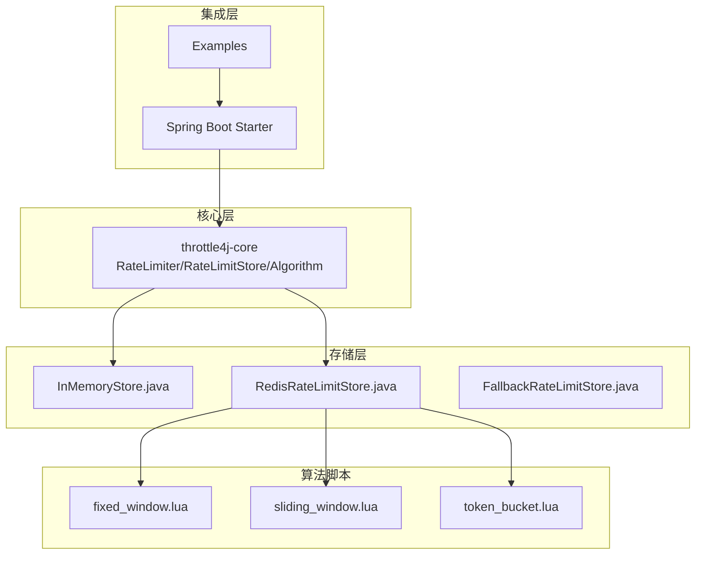
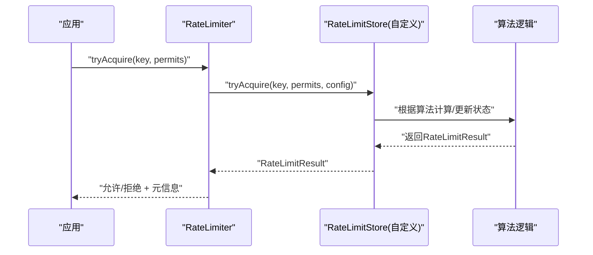
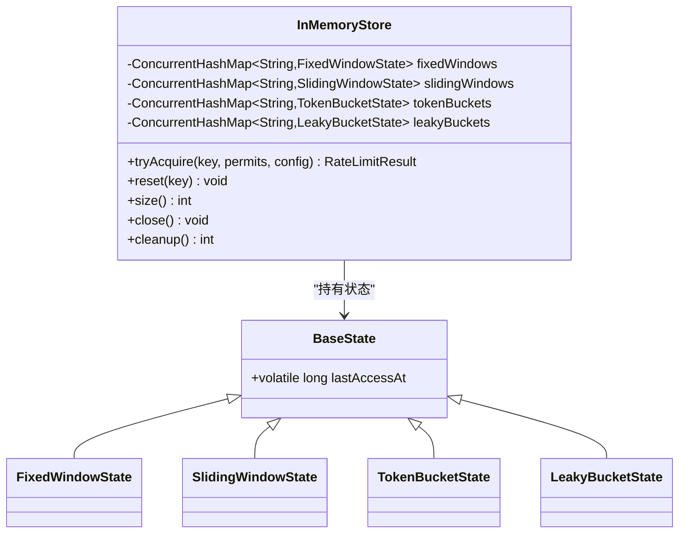
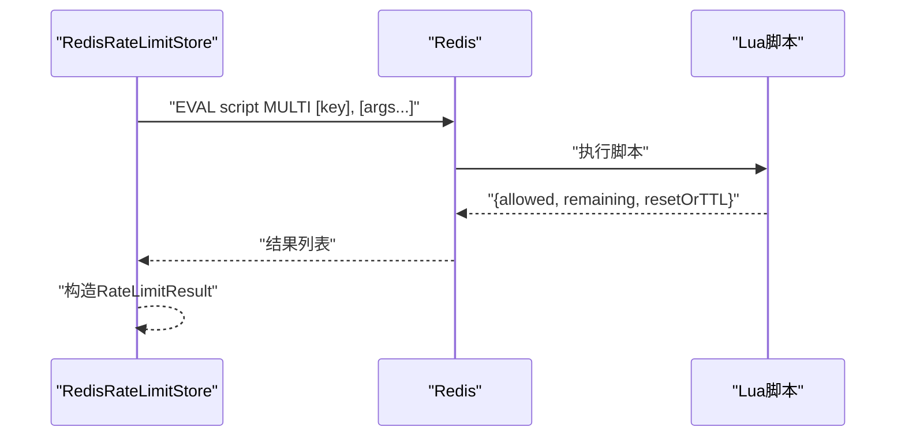
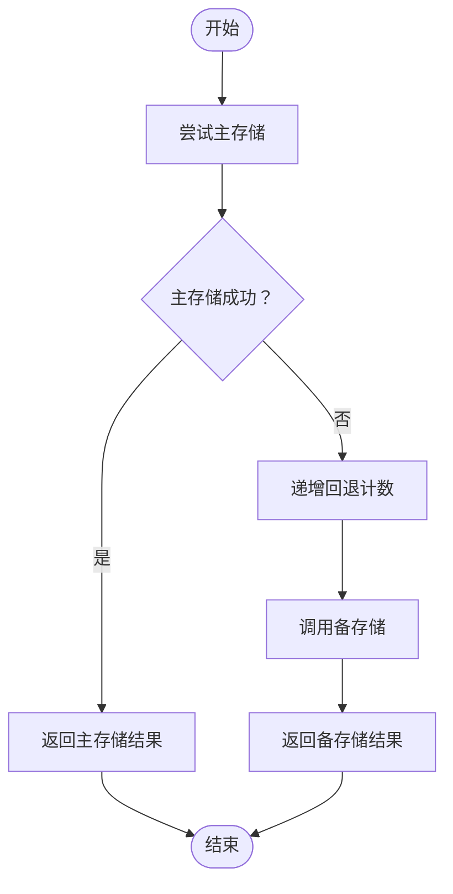
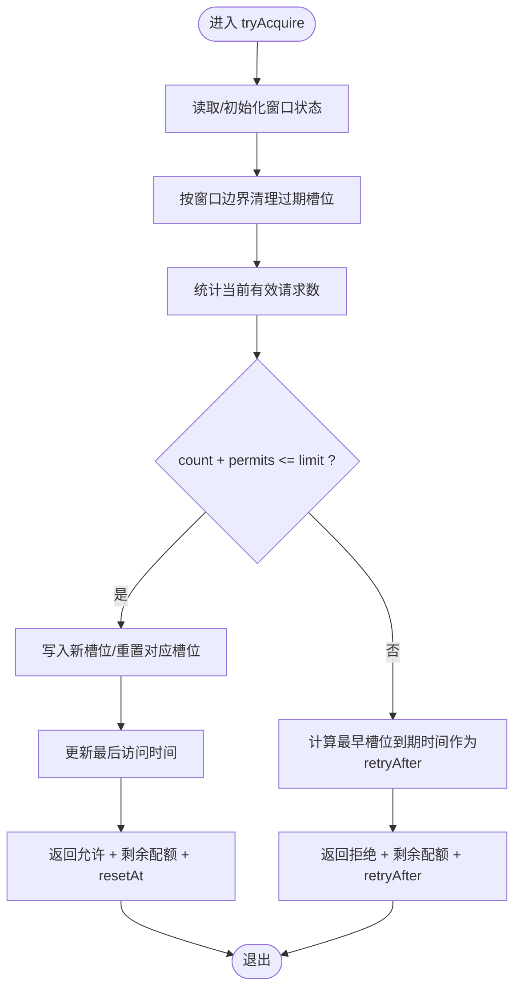
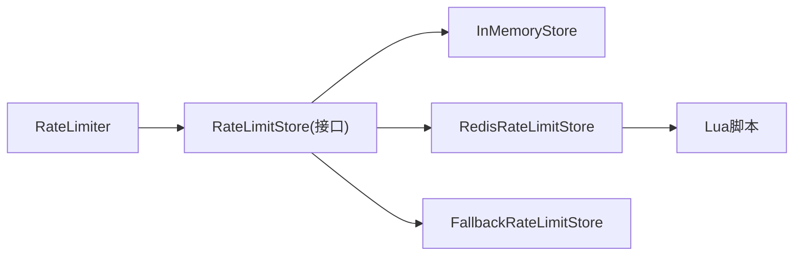

# 自定义存储扩展

<cite>
**本文引用的文件**
- [RateLimitStore.java](file://throttle4j-core/src/main/java/com/throttle4j/store/RateLimitStore.java)
- [InMemoryStore.java](file://throttle4j-core/src/main/java/com/throttle4j/store/InMemoryStore.java)
- [RedisRateLimitStore.java](file://throttle4j-redis/src/main/java/com/throttle4j/redis/RedisRateLimitStore.java)
- [FallbackRateLimitStore.java](file://throttle4j-redis/src/main/java/com/throttle4j/redis/FallbackRateLimitStore.java)
- [RateLimiterConfig.java](file://throttle4j-core/src/main/java/com/throttle4j/core/RateLimiterConfig.java)
- [RateLimitResult.java](file://throttle4j-core/src/main/java/com/throttle4j/core/RateLimitResult.java)
- [Algorithm.java](file://throttle4j-core/src/main/java/com/throttle4j/core/Algorithm.java)
- [RateLimiter.java](file://throttle4j-core/src/main/java/com/throttle4j/core/RateLimiter.java)
- [fixed_window.lua](file://throttle4j-redis/src/main/resources/scripts/fixed_window.lua)
- [sliding_window.lua](file://throttle4j-redis/src/main/resources/scripts/sliding_window.lua)
- [token_bucket.lua](file://throttle4j-redis/src/main/resources/scripts/token_bucket.lua)
- [README.md](file://README.md)
- [InMemoryStoreTest.java](file://throttle4j-core/src/test/java/com/throttle4j/store/InMemoryStoreTest.java)
- [RedisRateLimitStoreTest.java](file://throttle4j-redis/src/test/java/com/throttle4j/redis/RedisRateLimitStoreTest.java)
- [FallbackRateLimitStoreTest.java](file://throttle4j-redis/src/test/java/com/throttle4j/redis/FallbackRateLimitStoreTest.java)
</cite>

## 目录
1. [简介](#简介)
2. [项目结构](#项目结构)
3. [核心组件](#核心组件)
4. [架构总览](#架构总览)
5. [详细组件分析](#详细组件分析)
6. [依赖分析](#依赖分析)
7. [性能考量](#性能考量)
8. [故障排查指南](#故障排查指南)
9. [结论](#结论)
10. [附录](#附录)

## 简介
本指南面向希望为 throttle4j 开发“自定义存储后端”的开发者，目标是帮助你基于 RateLimitStore 接口实现新的存储后端（如数据库、K/V 存储、缓存等），并满足线程安全、原子性与并发一致性要求。文档将从接口规范、实现要点、分布式与本地存储策略、性能优化、持久化与外部系统集成、测试策略与监控指标等方面进行系统讲解。

## 项目结构
throttle4j 采用模块化设计：
- throttle4j-core：核心算法、配置模型、内存存储与公共 API
- throttle4j-redis：基于 Redis 的分布式存储，使用 Lua 脚本保证原子性
- throttle4j-spring-boot-starter：自动装配、注解与 Web 集成
- throttle4j-examples：示例工程

图表来源
- [README.md](file://README.md)
- [RateLimitStore.java](file://throttle4j-core/src/main/java/com/throttle4j/store/RateLimitStore.java)
- [InMemoryStore.java](file://throttle4j-core/src/main/java/com/throttle4j/store/InMemoryStore.java)
- [RedisRateLimitStore.java](file://throttle4j-redis/src/main/java/com/throttle4j/redis/RedisRateLimitStore.java)
- [FallbackRateLimitStore.java](file://throttle4j-redis/src/main/java/com/throttle4j/redis/FallbackRateLimitStore.java)
- [fixed_window.lua](file://throttle4j-redis/src/main/resources/scripts/fixed_window.lua)
- [sliding_window.lua](file://throttle4j-redis/src/main/resources/scripts/sliding_window.lua)
- [token_bucket.lua](file://throttle4j-redis/src/main/resources/scripts/token_bucket.lua)

章节来源
- [README.md](file://README.md)

## 核心组件
- RateLimitStore 接口：定义 tryAcquire 与 reset 两个核心方法，所有实现必须保证线程安全
- RateLimiterConfig：不可变配置，包含算法类型、配额、窗口时长、令牌桶补充速率等
- RateLimitResult：封装允许/拒绝结果、剩余配额、重置时间、建议重试间隔
- Algorithm：枚举支持的四种限流算法
- RateLimiter：对外暴露的限流器 API（内部委托给存储）

章节来源
- [RateLimitStore.java](file://throttle4j-core/src/main/java/com/throttle4j/store/RateLimitStore.java)
- [RateLimiterConfig.java](file://throttle4j-core/src/main/java/com/throttle4j/core/RateLimiterConfig.java)
- [RateLimitResult.java](file://throttle4j-core/src/main/java/com/throttle4j/core/RateLimitResult.java)
- [Algorithm.java](file://throttle4j-core/src/main/java/com/throttle4j/core/Algorithm.java)
- [RateLimiter.java](file://throttle4j-core/src/main/java/com/throttle4j/core/RateLimiter.java)

## 架构总览
throttle4j 的存储扩展点位于核心层，算法与存储分离，通过统一接口对接不同存储实现。Redis 实现将算法逻辑下沉到 Lua 脚本，确保单次请求原子性；内存实现则在进程内维护状态并通过锁与并发容器保证一致性。

图表来源
- [RateLimiter.java](file://throttle4j-core/src/main/java/com/throttle4j/core/RateLimiter.java)
- [RateLimitStore.java](file://throttle4j-core/src/main/java/com/throttle4j/store/RateLimitStore.java)

## 详细组件分析

### 接口规范与实现要求
- tryAcquire(key, permits, config) 必须：
  - 对同一 key 的并发访问保持原子性与一致性
  - 返回 RateLimitResult，包含 allowed、remaining、resetAt、retryAfterMillis
  - 对非法输入抛出明确异常（如 key 为空、permits 小于 1）
- reset(key) 必须：
  - 清除指定 key 的全部状态（或等价的“回到初始状态”）
  - 不应抛出未处理异常

章节来源
- [RateLimitStore.java](file://throttle4j-core/src/main/java/com/throttle4j/store/RateLimitStore.java)
- [RateLimitResult.java](file://throttle4j-core/src/main/java/com/throttle4j/core/RateLimitResult.java)
- [RateLimiterConfig.java](file://throttle4j-core/src/main/java/com/throttle4j/core/RateLimiterConfig.java)

### 本地存储实现策略（InMemoryStore）
- 并发安全设计：
  - 每个算法使用独立的并发映射表
  - 在每个 key 的状态对象上使用同步块，保证同一 key 的状态更新原子性
  - 使用原子布尔值与关闭钩子管理生命周期
- 清理策略：
  - 定时清理空闲键，避免内存泄漏
  - 基于 lastAccessAt 与 idleMillis 判断是否移除
- 窗口算法实现要点：
  - 固定窗口：重置窗口起始时间与计数
  - 滑动窗口：固定槽位统计，淘汰过期槽位
  - 令牌桶：按时间增量补充令牌，消费不足时计算 retryAfter
  - 漏斗桶：等效令牌桶，泄漏速率由 limit/windowMillis 计算

图表来源
- [InMemoryStore.java](file://throttle4j-core/src/main/java/com/throttle4j/store/InMemoryStore.java)

章节来源
- [InMemoryStore.java](file://throttle4j-core/src/main/java/com/throttle4j/store/InMemoryStore.java)

### 分布式存储实现策略（Redis + Lua）
- 原子性保证：
  - 所有算法逻辑以 Lua 脚本形式执行，确保单条命令级别的原子性
  - 使用 EVAL 返回 MULTI 结果，解析 allowed、remaining、resetAt/ttl
- 键空间隔离：
  - 默认前缀 throttle4j:，可配置自定义前缀
  - reset(key) 删除带前缀的键
- 算法脚本要点：
  - 固定窗口：GET/PTTL/INCRBY/SET(PX) 组合，返回剩余配额与相对 TTL
  - 滑动窗口：ZREMRANGEBYSCORE 清理过期项，ZADD 写入唯一标识，PEXPIRE 设置过期
  - 令牌桶：HGET/HSET 维护 tokens 与 lastRefill，按秒计算补充量

图表来源
- [RedisRateLimitStore.java](file://throttle4j-redis/src/main/java/com/throttle4j/redis/RedisRateLimitStore.java)
- [fixed_window.lua](file://throttle4j-redis/src/main/resources/scripts/fixed_window.lua)
- [sliding_window.lua](file://throttle4j-redis/src/main/resources/scripts/sliding_window.lua)
- [token_bucket.lua](file://throttle4j-redis/src/main/resources/scripts/token_bucket.lua)

章节来源
- [RedisRateLimitStore.java](file://throttle4j-redis/src/main/java/com/throttle4j/redis/RedisRateLimitStore.java)
- [fixed_window.lua](file://throttle4j-redis/src/main/resources/scripts/fixed_window.lua)
- [sliding_window.lua](file://throttle4j-redis/src/main/resources/scripts/sliding_window.lua)
- [token_bucket.lua](file://throttle4j-redis/src/main/resources/scripts/token_bucket.lua)

### 降级与容错（FallbackRateLimitStore）
- 设计目标：当主存储（如 Redis）不可用时，透明切换到备存储（如内存）
- 行为特征：
  - tryAcquire：主失败则回退到备，并统计回退次数
  - reset：广播到主备两端，各自捕获异常避免相互影响
  - 线程安全：遵循底层存储的线程安全约定

图表来源
- [FallbackRateLimitStore.java](file://throttle4j-redis/src/main/java/com/throttle4j/redis/FallbackRateLimitStore.java)

章节来源
- [FallbackRateLimitStore.java](file://throttle4j-redis/src/main/java/com/throttle4j/redis/FallbackRateLimitStore.java)

### 算法与状态演进流程（以滑动窗口为例）

图表来源
- [InMemoryStore.java](file://throttle4j-core/src/main/java/com/throttle4j/store/InMemoryStore.java)

章节来源
- [InMemoryStore.java](file://throttle4j-core/src/main/java/com/throttle4j/store/InMemoryStore.java)

## 依赖分析
- 存储层与算法层解耦：算法逻辑在存储实现中完成，核心仅负责调度
- Redis 实现依赖 Lua 脚本与同步命令接口，确保原子性
- Fallback 实现依赖组合两个 RateLimitStore，形成容错链路

图表来源
- [RateLimiter.java](file://throttle4j-core/src/main/java/com/throttle4j/core/RateLimiter.java)
- [RateLimitStore.java](file://throttle4j-core/src/main/java/com/throttle4j/store/RateLimitStore.java)
- [InMemoryStore.java](file://throttle4j-core/src/main/java/com/throttle4j/store/InMemoryStore.java)
- [RedisRateLimitStore.java](file://throttle4j-redis/src/main/java/com/throttle4j/redis/RedisRateLimitStore.java)
- [FallbackRateLimitStore.java](file://throttle4j-redis/src/main/java/com/throttle4j/redis/FallbackRateLimitStore.java)

章节来源
- [RateLimiter.java](file://throttle4j-core/src/main/java/com/throttle4j/core/RateLimiter.java)
- [RateLimitStore.java](file://throttle4j-core/src/main/java/com/throttle4j/store/RateLimitStore.java)
- [InMemoryStore.java](file://throttle4j-core/src/main/java/com/throttle4j/store/InMemoryStore.java)
- [RedisRateLimitStore.java](file://throttle4j-redis/src/main/java/com/throttle4j/redis/RedisRateLimitStore.java)
- [FallbackRateLimitStore.java](file://throttle4j-redis/src/main/java/com/throttle4j/redis/FallbackRateLimitStore.java)

## 性能考量
- 原子性与锁粒度
  - 优先使用原子操作或单命令 Lua 脚本，减少锁竞争范围
  - 对于内存实现，尽量缩小同步块作用域，避免跨 key 的全局锁
- 缓存与预热
  - 对热点 key 进行预热，减少首次访问的初始化开销
  - 合理设置窗口大小与刷新频率，平衡精度与吞吐
- 清理与内存
  - 定期清理空闲键，防止无限增长
  - 控制状态对象大小，避免冗余字段
- 网络与序列化（Redis）
  - 使用二进制协议与连接池，降低序列化成本
  - 合理设置超时与重试策略，避免阻塞放大
- 降级策略
  - 主存储失败时快速回退到本地存储，避免级联故障
  - 统计回退次数，用于告警与容量评估

## 故障排查指南
- 常见错误与定位
  - 输入校验异常：key 为空、permits 非法、配置不合法
  - Redis 脚本加载失败或返回类型异常
  - 主存储不可用导致的降级风暴
- 单元测试参考
  - 内存存储：验证基本获取、重置隔离、清理行为、关闭保护
  - Redis 存储：验证脚本调用、参数传递、返回解析、键前缀与删除
  - 降级存储：验证主失败回退、重置广播、异常吞没与计数统计
- 监控指标建议
  - 请求量、通过量、拒绝量、重试次数
  - 平均响应时间、P99 延迟、错误率
  - 存储命中率、清理数量、回退次数
  - Redis 命令耗时分布、脚本执行耗时

章节来源
- [InMemoryStoreTest.java](file://throttle4j-core/src/test/java/com/throttle4j/store/InMemoryStoreTest.java)
- [RedisRateLimitStoreTest.java](file://throttle4j-redis/src/test/java/com/throttle4j/redis/RedisRateLimitStoreTest.java)
- [FallbackRateLimitStoreTest.java](file://throttle4j-redis/src/test/java/com/throttle4j/redis/FallbackRateLimitStoreTest.java)

## 结论
实现自定义存储后端的关键在于：严格遵守接口契约、确保原子性与并发安全、合理选择本地或分布式策略，并通过完善的测试与监控保障稳定性。对于分布式场景，推荐沿用 Redis + Lua 的思路，将算法逻辑下沉到脚本；对于单节点场景，可参考内存实现的并发控制与清理机制。通过 Fallback 包装器，可在主存储故障时实现平滑降级，提升系统韧性。

## 附录

### 自定义存储开发步骤清单
- 明确算法支持范围与配置约束
- 设计状态模型与键空间命名规则
- 实现 tryAcquire 与 reset
- 选择原子性方案（本地锁/并发容器/单命令 Lua）
- 编写单元测试覆盖正常路径、边界条件与异常路径
- 设计监控指标并接入现有观测体系
- 如需分布式部署，提供降级与容错包装

### 关键实现路径参考
- [RateLimitStore 接口](file://throttle4j-core/src/main/java/com/throttle4j/store/RateLimitStore.java)
- [内存实现](file://throttle4j-core/src/main/java/com/throttle4j/store/InMemoryStore.java)
- [Redis 实现](file://throttle4j-redis/src/main/java/com/throttle4j/redis/RedisRateLimitStore.java)
- [降级包装器](file://throttle4j-redis/src/main/java/com/throttle4j/redis/FallbackRateLimitStore.java)
- [算法脚本（固定窗口）](file://throttle4j-redis/src/main/resources/scripts/fixed_window.lua)
- [算法脚本（滑动窗口）](file://throttle4j-redis/src/main/resources/scripts/sliding_window.lua)
- [算法脚本（令牌桶）](file://throttle4j-redis/src/main/resources/scripts/token_bucket.lua)