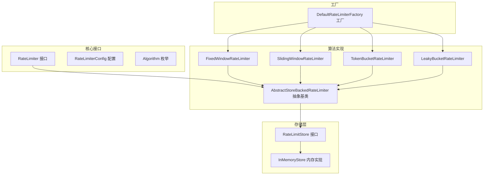
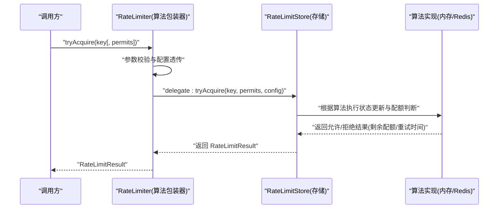
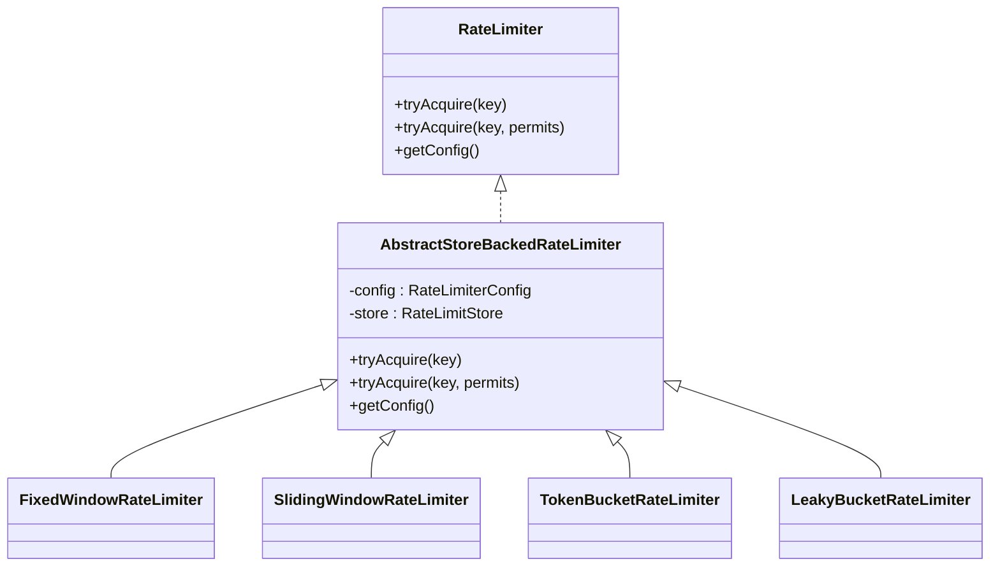
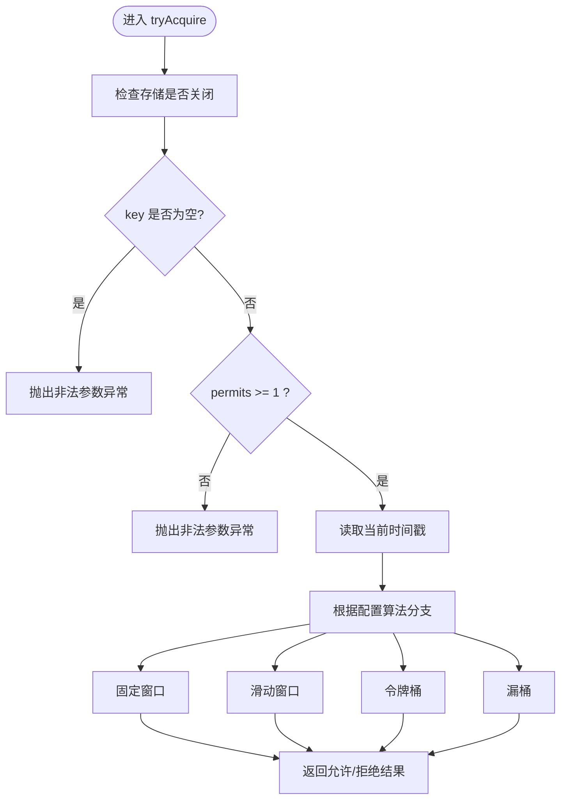
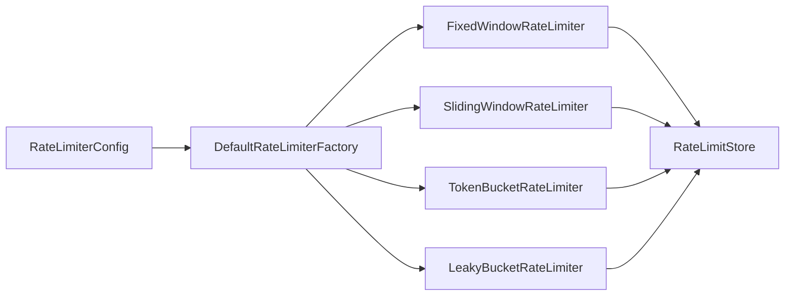

# 自定义算法扩展

<cite>
**本文引用的文件**
- [AbstractStoreBackedRateLimiter.java](file://throttle4j-core/src/main/java/com/throttle4j/algorithm/AbstractStoreBackedRateLimiter.java)
- [FixedWindowRateLimiter.java](file://throttle4j-core/src/main/java/com/throttle4j/algorithm/FixedWindowRateLimiter.java)
- [SlidingWindowRateLimiter.java](file://throttle4j-core/src/main/java/com/throttle4j/algorithm/SlidingWindowRateLimiter.java)
- [TokenBucketRateLimiter.java](file://throttle4j-core/src/main/java/com/throttle4j/algorithm/TokenBucketRateLimiter.java)
- [LeakyBucketRateLimiter.java](file://throttle4j-core/src/main/java/com/throttle4j/algorithm/LeakyBucketRateLimiter.java)
- [RateLimiter.java](file://throttle4j-core/src/main/java/com/throttle4j/core/RateLimiter.java)
- [RateLimiterConfig.java](file://throttle4j-core/src/main/java/com/throttle4j/core/RateLimiterConfig.java)
- [Algorithm.java](file://throttle4j-core/src/main/java/com/throttle4j/core/Algorithm.java)
- [RateLimitStore.java](file://throttle4j-core/src/main/java/com/throttle4j/store/RateLimitStore.java)
- [InMemoryStore.java](file://throttle4j-core/src/main/java/com/throttle4j/store/InMemoryStore.java)
- [DefaultRateLimiterFactory.java](file://throttle4j-core/src/main/java/com/throttle4j/algorithm/DefaultRateLimiterFactory.java)
- [FixedWindowRateLimiterTest.java](file://throttle4j-core/src/test/java/com/throttle4j/algorithm/FixedWindowRateLimiterTest.java)
- [SlidingWindowRateLimiterTest.java](file://throttle4j-core/src/test/java/com/throttle4j/algorithm/SlidingWindowRateLimiterTest.java)
- [TokenBucketRateLimiterTest.java](file://throttle4j-core/src/test/java/com/throttle4j/algorithm/TokenBucketRateLimiterTest.java)
- [LeakyBucketRateLimiterTest.java](file://throttle4j-core/src/test/java/com/throttle4j/algorithm/LeakyBucketRateLimiterTest.java)
</cite>

## 目录
1. [简介](#简介)
2. [项目结构](#项目结构)
3. [核心组件](#核心组件)
4. [架构总览](#架构总览)
5. [详细组件分析](#详细组件分析)
6. [依赖分析](#依赖分析)
7. [性能考量](#性能考量)
8. [故障排查指南](#故障排查指南)
9. [结论](#结论)
10. [附录：扩展开发步骤与测试基准](#附录扩展开发步骤与测试基准)

## 简介
本指南面向希望在 throttle4j 中实现“自定义限流算法”的开发者。项目采用“算法封装 + 存储后端”的分层设计：算法通过统一的 RateLimiter 接口对外暴露 tryAcquire 能力；具体的算法逻辑由存储层（如内存或 Redis）实现，从而实现算法与存储的解耦。开发者只需继承 AbstractStoreBackedRateLimiter 并配合合适的 RateLimitStore 实现，即可快速接入新算法。

## 项目结构
- 核心接口与配置位于 core 包，定义了限流器契约、算法枚举与配置对象。
- 算法实现位于 algorithm 包，现有实现均基于 AbstractStoreBackedRateLimiter，并委托给 RateLimitStore。
- 存储层位于 store 包，InMemoryStore 提供多算法的内存实现；Redis 模块提供分布式存储实现。
- 工厂类 DefaultRateLimiterFactory 将配置映射到具体算法包装器。
- 测试用例覆盖各算法的行为验证与并发正确性。

图表来源
- [RateLimiter.java:1-32](file://throttle4j-core/src/main/java/com/throttle4j/core/RateLimiter.java#L1-L32)
- [RateLimiterConfig.java:1-113](file://throttle4j-core/src/main/java/com/throttle4j/core/RateLimiterConfig.java#L1-L113)
- [Algorithm.java:1-16](file://throttle4j-core/src/main/java/com/throttle4j/core/Algorithm.java#L1-L16)
- [AbstractStoreBackedRateLimiter.java:1-42](file://throttle4j-core/src/main/java/com/throttle4j/algorithm/AbstractStoreBackedRateLimiter.java#L1-L42)
- [FixedWindowRateLimiter.java:1-18](file://throttle4j-core/src/main/java/com/throttle4j/algorithm/FixedWindowRateLimiter.java#L1-L18)
- [SlidingWindowRateLimiter.java:1-16](file://throttle4j-core/src/main/java/com/throttle4j/algorithm/SlidingWindowRateLimiter.java#L1-L16)
- [TokenBucketRateLimiter.java:1-16](file://throttle4j-core/src/main/java/com/throttle4j/algorithm/TokenBucketRateLimiter.java#L1-L16)
- [LeakyBucketRateLimiter.java:1-16](file://throttle4j-core/src/main/java/com/throttle4j/algorithm/LeakyBucketRateLimiter.java#L1-L16)
- [RateLimitStore.java:1-35](file://throttle4j-core/src/main/java/com/throttle4j/store/RateLimitStore.java#L1-L35)
- [InMemoryStore.java:1-315](file://throttle4j-core/src/main/java/com/throttle4j/store/InMemoryStore.java#L1-L315)
- [DefaultRateLimiterFactory.java:1-39](file://throttle4j-core/src/main/java/com/throttle4j/algorithm/DefaultRateLimiterFactory.java#L1-L39)

章节来源
- [RateLimiter.java:1-32](file://throttle4j-core/src/main/java/com/throttle4j/core/RateLimiter.java#L1-L32)
- [RateLimitStore.java:1-35](file://throttle4j-core/src/main/java/com/throttle4j/store/RateLimitStore.java#L1-L35)
- [InMemoryStore.java:1-315](file://throttle4j-core/src/main/java/com/throttle4j/store/InMemoryStore.java#L1-L315)
- [DefaultRateLimiterFactory.java:1-39](file://throttle4j-core/src/main/java/com/throttle4j/algorithm/DefaultRateLimiterFactory.java#L1-L39)

## 核心组件
- RateLimiter 接口：定义 tryAcquire(key) 与 tryAcquire(key, permits) 两个入口，返回 RateLimitResult；要求实现线程安全。
- RateLimiterConfig：不可变配置，包含 algorithm、limit、windowMillis、refillRate；Builder 在构建时进行参数校验。
- Algorithm：枚举支持 FIXED_WINDOW、SLIDING_WINDOW、TOKEN_BUCKET、LEAKY_BUCKET。
- RateLimitStore：存储抽象，负责算法状态与配额计算；提供 tryAcquire 与 reset。
- AbstractStoreBackedRateLimiter：算法包装器基类，将 tryAcquire 的调用委托给 RateLimitStore，并负责参数校验与配置透传。
- DefaultRateLimiterFactory：根据配置的 algorithm 返回对应算法包装器实例。

章节来源
- [RateLimiter.java:1-32](file://throttle4j-core/src/main/java/com/throttle4j/core/RateLimiter.java#L1-L32)
- [RateLimiterConfig.java:1-113](file://throttle4j-core/src/main/java/com/throttle4j/core/RateLimiterConfig.java#L1-L113)
- [Algorithm.java:1-16](file://throttle4j-core/src/main/java/com/throttle4j/core/Algorithm.java#L1-L16)
- [RateLimitStore.java:1-35](file://throttle4j-core/src/main/java/com/throttle4j/store/RateLimitStore.java#L1-L35)
- [AbstractStoreBackedRateLimiter.java:1-42](file://throttle4j-core/src/main/java/com/throttle4j/algorithm/AbstractStoreBackedRateLimiter.java#L1-L42)
- [DefaultRateLimiterFactory.java:1-39](file://throttle4j-core/src/main/java/com/throttle4j/algorithm/DefaultRateLimiterFactory.java#L1-L39)

## 架构总览
下图展示了从调用方到算法与存储的完整路径，以及工厂如何按配置选择算法包装器。

图表来源
- [AbstractStoreBackedRateLimiter.java:24-35](file://throttle4j-core/src/main/java/com/throttle4j/algorithm/AbstractStoreBackedRateLimiter.java#L24-L35)
- [RateLimitStore.java:17-26](file://throttle4j-core/src/main/java/com/throttle4j/store/RateLimitStore.java#L17-L26)
- [InMemoryStore.java:68-93](file://throttle4j-core/src/main/java/com/throttle4j/store/InMemoryStore.java#L68-L93)
- [DefaultRateLimiterFactory.java:22-37](file://throttle4j-core/src/main/java/com/throttle4j/algorithm/DefaultRateLimiterFactory.java#L22-L37)

## 详细组件分析

### 抽象基类：AbstractStoreBackedRateLimiter
- 角色：算法包装器基类，不直接持有状态，仅负责参数校验与委托给存储层。
- 关键点：
  - tryAcquire(key) 与 tryAcquire(key, permits) 均委托给 store.tryAcquire。
  - permits 必须 >= 1；否则抛出非法参数异常。
  - getConfig 返回不可变配置对象。
- 设计意义：将算法实现与状态管理解耦，统一入口，便于替换存储后端。

图表来源
- [AbstractStoreBackedRateLimiter.java:14-41](file://throttle4j-core/src/main/java/com/throttle4j/algorithm/AbstractStoreBackedRateLimiter.java#L14-L41)
- [FixedWindowRateLimiter.java:12-16](file://throttle4j-core/src/main/java/com/throttle4j/algorithm/FixedWindowRateLimiter.java#L12-L16)
- [SlidingWindowRateLimiter.java:10-14](file://throttle4j-core/src/main/java/com/throttle4j/algorithm/SlidingWindowRateLimiter.java#L10-L14)
- [TokenBucketRateLimiter.java:10-14](file://throttle4j-core/src/main/java/com/throttle4j/algorithm/TokenBucketRateLimiter.java#L10-L14)
- [LeakyBucketRateLimiter.java:10-14](file://throttle4j-core/src/main/java/com/throttle4j/algorithm/LeakyBucketRateLimiter.java#L10-L14)

章节来源
- [AbstractStoreBackedRateLimiter.java:1-42](file://throttle4j-core/src/main/java/com/throttle4j/algorithm/AbstractStoreBackedRateLimiter.java#L1-L42)

### 存储层：InMemoryStore（算法实现载体）
- 角色：在内存中维护各算法的状态表（固定窗口、滑动窗口、令牌桶、漏桶），并提供清理与重置能力。
- 关键点：
  - tryAcquire 根据算法分支调用对应方法，返回 RateLimitResult。
  - 各算法状态类（如 FixedWindowState、SlidingWindowState、TokenBucketState、LeakyBucketState）保存必要的运行时信息。
  - 支持定期清理空闲键，降低内存占用。
- 与算法的关系：InMemoryStore 是算法状态与配额计算的具体实现者，算法包装器只负责调度。

图表来源
- [InMemoryStore.java:68-93](file://throttle4j-core/src/main/java/com/throttle4j/store/InMemoryStore.java#L68-L93)
- [InMemoryStore.java:150-170](file://throttle4j-core/src/main/java/com/throttle4j/store/InMemoryStore.java#L150-L170)
- [InMemoryStore.java:172-212](file://throttle4j-core/src/main/java/com/throttle4j/store/InMemoryStore.java#L172-L212)
- [InMemoryStore.java:214-236](file://throttle4j-core/src/main/java/com/throttle4j/store/InMemoryStore.java#L214-L236)
- [InMemoryStore.java:238-263](file://throttle4j-core/src/main/java/com/throttle4j/store/InMemoryStore.java#L238-L263)

章节来源
- [InMemoryStore.java:1-315](file://throttle4j-core/src/main/java/com/throttle4j/store/InMemoryStore.java#L1-L315)

### 现有算法实现对比
- 固定窗口（FixedWindow）
  - 特征：以固定时间片为单位统计请求数，到期清零。
  - 优点：实现简单、开销低。
  - 缺点：边界处存在突发（窗口末尾与下一个窗口开头之间）。
  - 适用：对突发不敏感、追求极简的场景。
- 滑动窗口（SlidingWindow）
  - 特征：将窗口切分为若干子槽，滚动淘汰过期槽，近似精确滑窗。
  - 优点：缓解边界突发问题。
  - 缺点：需要额外槽位空间与维护成本。
  - 适用：对边界突发有一定容忍度但需更平滑的场景。
- 令牌桶（TokenBucket）
  - 特征：桶内令牌按速率补充，请求消耗令牌；支持突发。
  - 优点：允许突发，平滑突发与平均速率。
  - 缺点：需要持续计算与刷新。
  - 适用：需要突发能力且保持长期平均速率的场景。
- 漏桶（LeakyBucket）
  - 特征：以恒定速率“漏水”，桶满则丢弃。
  - 优点：输出速率稳定。
  - 缺点：无法突发，对突发请求不友好。
  - 适用：需要稳定输出速率的场景。

章节来源
- [FixedWindowRateLimiter.java:1-18](file://throttle4j-core/src/main/java/com/throttle4j/algorithm/FixedWindowRateLimiter.java#L1-L18)
- [SlidingWindowRateLimiter.java:1-16](file://throttle4j-core/src/main/java/com/throttle4j/algorithm/SlidingWindowRateLimiter.java#L1-L16)
- [TokenBucketRateLimiter.java:1-16](file://throttle4j-core/src/main/java/com/throttle4j/algorithm/TokenBucketRateLimiter.java#L1-L16)
- [LeakyBucketRateLimiter.java:1-16](file://throttle4j-core/src/main/java/com/throttle4j/algorithm/LeakyBucketRateLimiter.java#L1-L16)

### 工厂与配置
- DefaultRateLimiterFactory：依据配置中的 Algorithm 枚举创建对应的算法包装器实例。
- RateLimiterConfig.Builder：在 build() 时进行参数校验，如 TOKEN_BUCKET 需要正的 refillRate 与合理的 windowMillis。

章节来源
- [DefaultRateLimiterFactory.java:1-39](file://throttle4j-core/src/main/java/com/throttle4j/algorithm/DefaultRateLimiterFactory.java#L1-L39)
- [RateLimiterConfig.java:91-110](file://throttle4j-core/src/main/java/com/throttle4j/core/RateLimiterConfig.java#L91-L110)

## 依赖分析
- 继承关系：四个算法包装器均继承自 AbstractStoreBackedRateLimiter，复用统一入口与配置透传。
- 外部依赖：算法包装器不直接依赖具体存储实现，而是通过 RateLimitStore 接口解耦。
- 工厂绑定：DefaultRateLimiterFactory 将配置与算法包装器绑定，便于集中创建与替换。

图表来源
- [DefaultRateLimiterFactory.java:22-37](file://throttle4j-core/src/main/java/com/throttle4j/algorithm/DefaultRateLimiterFactory.java#L22-L37)
- [AbstractStoreBackedRateLimiter.java:14-22](file://throttle4j-core/src/main/java/com/throttle4j/algorithm/AbstractStoreBackedRateLimiter.java#L14-L22)

章节来源
- [DefaultRateLimiterFactory.java:1-39](file://throttle4j-core/src/main/java/com/throttle4j/algorithm/DefaultRateLimiterFactory.java#L1-L39)
- [AbstractStoreBackedRateLimiter.java:1-42](file://throttle4j-core/src/main/java/com/throttle4j/algorithm/AbstractStoreBackedRateLimiter.java#L1-L42)

## 性能考量
- 时间复杂度
  - 固定窗口与滑动窗口：单次 tryAcquire 通常为 O(1)，滑动窗口因槽位维护可能略高。
  - 令牌桶与漏桶：每次尝试需计算上次刷新/漏水后的状态，通常 O(1)。
- 空间复杂度
  - 每个算法在 InMemoryStore 中维护一个键到状态的映射；键数量决定内存占用。
- 并发与锁
  - InMemoryStore 对每个键的状态使用同步块保护，避免并发冲突。
  - 清理线程周期性扫描并移除空闲键，降低内存压力。
- 可扩展性
  - 通过替换 RateLimitStore 实现（如 Redis）可实现分布式限流，适合多实例部署。

章节来源
- [InMemoryStore.java:149-263](file://throttle4j-core/src/main/java/com/throttle4j/store/InMemoryStore.java#L149-L263)
- [RateLimitStore.java:1-35](file://throttle4j-core/src/main/java/com/throttle4j/store/RateLimitStore.java#L1-L35)

## 故障排查指南
- 常见异常
  - 参数非法：permits < 1 或 key 为空时会抛出非法参数异常。
  - 存储关闭：InMemoryStore 关闭后继续使用会抛出非法状态异常。
  - 算法不支持：配置的算法不在枚举范围内时工厂会抛出非法参数异常。
- 行为验证
  - 使用测试用例验证边界行为（如窗口重置、突发、并发上限）。
  - 通过断言 remaining、retryAfterMillis 等字段确认策略正确性。

章节来源
- [InMemoryStore.java:70-78](file://throttle4j-core/src/main/java/com/throttle4j/store/InMemoryStore.java#L70-L78)
- [InMemoryStore.java:142-146](file://throttle4j-core/src/main/java/com/throttle4j/store/InMemoryStore.java#L142-L146)
- [DefaultRateLimiterFactory.java:34-36](file://throttle4j-core/src/main/java/com/throttle4j/algorithm/DefaultRateLimiterFactory.java#L34-L36)
- [FixedWindowRateLimiterTest.java:78-82](file://throttle4j-core/src/test/java/com/throttle4j/algorithm/FixedWindowRateLimiterTest.java#L78-L82)
- [SlidingWindowRateLimiterTest.java:74-84](file://throttle4j-core/src/test/java/com/throttle4j/algorithm/SlidingWindowRateLimiterTest.java#L74-L84)
- [TokenBucketRateLimiterTest.java:73-81](file://throttle4j-core/src/test/java/com/throttle4j/algorithm/TokenBucketRateLimiterTest.java#L73-L81)
- [LeakyBucketRateLimiterTest.java:72-80](file://throttle4j-core/src/test/java/com/throttle4j/algorithm/LeakyBucketRateLimiterTest.java#L72-L80)

## 结论
throttle4j 通过“算法包装器 + 存储后端”的架构，实现了算法与存储的清晰分离。开发者只需基于 AbstractStoreBackedRateLimiter 进行包装，并在 RateLimitStore 中实现算法状态与配额计算，即可快速扩展新的限流算法。结合工厂与配置系统，可在不修改上层调用方的情况下灵活切换算法与存储实现。

## 附录：扩展开发步骤与测试基准

### 开发步骤
- 步骤一：确定算法类型与配置需求
  - 明确算法特性（是否需要突发、是否需要恒定输出速率、是否需要窗口边界平滑）。
  - 定义所需配置项（limit、windowMillis、refillRate 等），并在 RateLimiterConfig.Builder 中进行校验。
- 步骤二：实现存储层算法逻辑
  - 在 RateLimitStore 的 tryAcquire 分支中添加新算法分支。
  - 定义该算法的状态类（继承 BaseState 或独立状态），记录关键运行时信息（如窗口起始、令牌数、水位等）。
  - 计算 remaining、resetAt/retryAfterMillis 等指标，构造 RateLimitResult。
- 步骤三：创建算法包装器
  - 新建类继承 AbstractStoreBackedRateLimiter，构造函数接收 RateLimiterConfig 与 RateLimitStore。
  - 无需重写 tryAcquire，复用基类委托逻辑。
- 步骤四：注册工厂与测试
  - 在 DefaultRateLimiterFactory 中增加算法分支，返回新包装器实例。
  - 编写单元测试，覆盖边界行为（窗口重置、并发上限、突发、重试时间等）。

章节来源
- [RateLimiterConfig.java:91-110](file://throttle4j-core/src/main/java/com/throttle4j/core/RateLimiterConfig.java#L91-L110)
- [InMemoryStore.java:68-93](file://throttle4j-core/src/main/java/com/throttle4j/store/InMemoryStore.java#L68-L93)
- [AbstractStoreBackedRateLimiter.java:19-35](file://throttle4j-core/src/main/java/com/throttle4j/algorithm/AbstractStoreBackedRateLimiter.java#L19-L35)
- [DefaultRateLimiterFactory.java:22-37](file://throttle4j-core/src/main/java/com/throttle4j/algorithm/DefaultRateLimiterFactory.java#L22-L37)

### 算法实现要点与差异
- tryAcquire 实现规范
  - 参数校验：permits >= 1；key 非空；存储未关闭。
  - 状态读取与更新：原子地读取/更新状态，避免并发竞态。
  - 结果构造：根据配额与时间计算 remaining、resetAt/retryAfterMillis。
- 与存储层交互模式
  - 通过 store.tryAcquire 统一入口，算法包装器不感知存储细节。
  - 存储层负责状态持久化与清理（如 InMemoryStore 的空闲键清理）。
- 算法状态管理
  - 固定窗口：记录窗口起始与计数。
  - 滑动窗口：维护多个子槽及其计数，滚动淘汰过期槽。
  - 令牌桶：记录令牌数与上次补给时间。
  - 漏桶：记录当前水位与上次漏水时间。

章节来源
- [AbstractStoreBackedRateLimiter.java:24-35](file://throttle4j-core/src/main/java/com/throttle4j/algorithm/AbstractStoreBackedRateLimiter.java#L24-L35)
- [InMemoryStore.java:150-170](file://throttle4j-core/src/main/java/com/throttle4j/store/InMemoryStore.java#L150-L170)
- [InMemoryStore.java:172-212](file://throttle4j-core/src/main/java/com/throttle4j/store/InMemoryStore.java#L172-L212)
- [InMemoryStore.java:214-236](file://throttle4j-core/src/main/java/com/throttle4j/store/InMemoryStore.java#L214-L236)
- [InMemoryStore.java:238-263](file://throttle4j-core/src/main/java/com/throttle4j/store/InMemoryStore.java#L238-L263)

### 现有算法对比与适用场景
- 固定窗口 vs 滑动窗口
  - 固定窗口实现简单，滑动窗口更平滑；滑动窗口在边界处更公平。
- 令牌桶 vs 漏桶
  - 令牌桶允许突发，漏桶保证稳定输出；选择取决于业务对突发与稳定性的偏好。
- 适用场景建议
  - 固定窗口：对突发不敏感、追求极简。
  - 滑动窗口：需要平滑的近似精确滑窗。
  - 令牌桶：需要突发能力与平均速率控制。
  - 漏桶：需要稳定输出速率。

章节来源
- [FixedWindowRateLimiter.java:6-11](file://throttle4j-core/src/main/java/com/throttle4j/algorithm/FixedWindowRateLimiter.java#L6-L11)
- [SlidingWindowRateLimiter.java:6-9](file://throttle4j-core/src/main/java/com/throttle4j/algorithm/SlidingWindowRateLimiter.java#L6-L9)
- [TokenBucketRateLimiter.java:6-9](file://throttle4j-core/src/main/java/com/throttle4j/algorithm/TokenBucketRateLimiter.java#L6-L9)
- [LeakyBucketRateLimiter.java:6-9](file://throttle4j-core/src/main/java/com/throttle4j/algorithm/LeakyBucketRateLimiter.java#L6-L9)

### 测试方法与基准指南
- 单元测试建议
  - 边界测试：窗口重置、并发上限、多次许可消费。
  - 行为一致性：remaining 应单调递减；拒绝时 retryAfterMillis 应大于 0。
  - 并发正确性：使用线程池与 CountDownLatch 验证并发下不超过限制。
- 基准测试建议
  - 场景：不同算法在不同并发、突发、容量下的吞吐与延迟。
  - 指标：QPS、P99 延迟、CPU/内存占用、存储访问次数。
  - 方法：JMH 或自定义压测工具，对比不同算法与存储实现（内存 vs Redis）。

章节来源
- [FixedWindowRateLimiterTest.java:43-111](file://throttle4j-core/src/test/java/com/throttle4j/algorithm/FixedWindowRateLimiterTest.java#L43-L111)
- [SlidingWindowRateLimiterTest.java:43-113](file://throttle4j-core/src/test/java/com/throttle4j/algorithm/SlidingWindowRateLimiterTest.java#L43-L113)
- [TokenBucketRateLimiterTest.java:43-113](file://throttle4j-core/src/test/java/com/throttle4j/algorithm/TokenBucketRateLimiterTest.java#L43-L113)
- [LeakyBucketRateLimiterTest.java:43-111](file://throttle4j-core/src/test/java/com/throttle4j/algorithm/LeakyBucketRateLimiterTest.java#L43-L111)