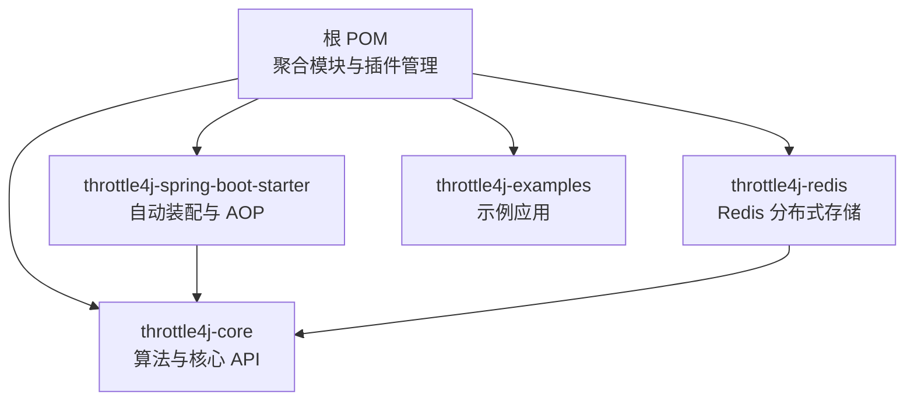
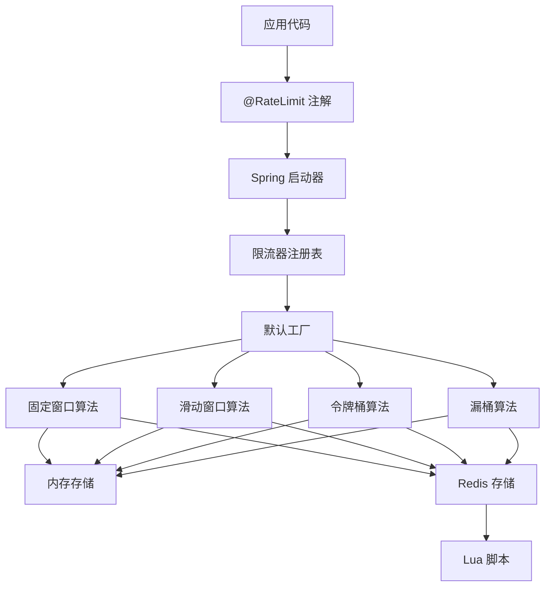
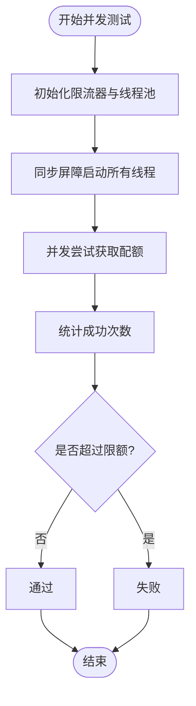
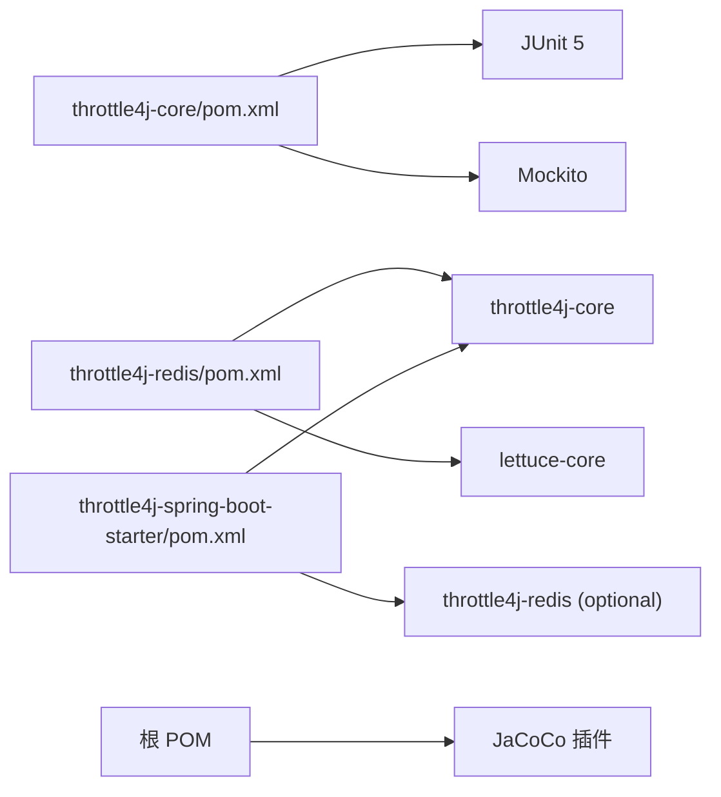

# 测试策略

<cite>
**本文引用的文件**
- [pom.xml](file://pom.xml)
- [throttle4j-core/pom.xml](file://throttle4j-core/pom.xml)
- [throttle4j-redis/pom.xml](file://throttle4j-redis/pom.xml)
- [throttle4j-spring-boot-starter/pom.xml](file://throttle4j-spring-boot-starter/pom.xml)
- [README.md](file://README.md)
- [CONTRIBUTING.md](file://CONTRIBUTING.md)
- [FixedWindowRateLimiterTest.java](file://throttle4j-core/src/test/java/com/throttle4j/algorithm/FixedWindowRateLimiterTest.java)
- [TokenBucketRateLimiterTest.java](file://throttle4j-core/src/test/java/com/throttle4j/algorithm/TokenBucketRateLimiterTest.java)
- [SlidingWindowRateLimiterTest.java](file://throttle4j-core/src/test/java/com/throttle4j/algorithm/SlidingWindowRateLimiterTest.java)
- [LeakyBucketRateLimiterTest.java](file://throttle4j-core/src/test/java/com/throttle4j/algorithm/LeakyBucketRateLimiterTest.java)
- [InMemoryStoreTest.java](file://throttle4j-core/src/test/java/com/throttle4j/store/InMemoryStoreTest.java)
- [RateLimiterConfigTest.java](file://throttle4j-core/src/test/java/com/throttle4j/core/RateLimiterConfigTest.java)
- [RateLimiterRegistryTest.java](file://throttle4j-core/src/test/java/com/throttle4j/core/RateLimiterRegistryTest.java)
- [RedisRateLimitStoreTest.java](file://throttle4j-redis/src/test/java/com/throttle4j/redis/RedisRateLimitStoreTest.java)
- [RateLimitAspectTest.java](file://throttle4j-spring-boot-starter/src/test/java/com/throttle4j/spring/aop/RateLimitAspectTest.java)
</cite>

## 目录
1. [引言](#引言)
2. [项目结构](#项目结构)
3. [核心组件](#核心组件)
4. [架构总览](#架构总览)
5. [详细组件分析](#详细组件分析)
6. [依赖分析](#依赖分析)
7. [性能考虑](#性能考虑)
8. [故障排查指南](#故障排查指南)
9. [结论](#结论)
10. [附录](#附录)

## 引言
本指南面向贡献者与维护者，系统化阐述 throttle4j 的测试策略与质量保证流程，覆盖单元测试、集成测试与性能测试的实施方法；明确 JaCoCo 代码覆盖率要求与报告生成方式；给出测试用例编写规范与最佳实践，并提供为新功能编写充分测试用例的步骤清单。文档同时涵盖测试数据准备、模拟对象（Mock）使用以及测试执行命令与 CI 集成要点。

## 项目结构
throttle4j 采用多模块结构，核心能力由 throttle4j-core 提供，throttle4j-redis 提供分布式存储与 Lua 脚本，throttle4j-spring-boot-starter 提供 Spring Boot 自动装配与 AOP/拦截器集成，throttle4j-examples 提供示例应用。

图表来源
- [pom.xml:15-20](file://pom.xml#L15-L20)
- [throttle4j-core/pom.xml:7-11](file://throttle4j-core/pom.xml#L7-L11)
- [throttle4j-redis/pom.xml:7-11](file://throttle4j-redis/pom.xml#L7-L11)
- [throttle4j-spring-boot-starter/pom.xml:7-11](file://throttle4j-spring-boot-starter/pom.xml#L7-L11)

章节来源
- [pom.xml:15-20](file://pom.xml#L15-L20)
- [README.md:76-101](file://README.md#L76-L101)

## 核心组件
- 算法层：固定窗口、滑动窗口、令牌桶、漏桶四种限流算法，均通过统一的 RateLimiter 接口对外提供 tryAcquire 能力。
- 存储层：InMemoryStore 提供单机内存计数；RedisRateLimitStore 基于 Lettuce 与 Lua 脚本提供分布式计数。
- 注册表与工厂：RateLimiterRegistry 统一注册与获取限流器实例；DefaultRateLimiterFactory 按配置创建具体算法实例。
- Spring 集成：@RateLimit 注解、AOP 切面、Web 拦截器与响应头填充，支持声明式限流与降级回退。

章节来源
- [README.md:103-112](file://README.md#L103-L112)
- [RateLimiterRegistryTest.java:18-32](file://throttle4j-core/src/test/java/com/throttle4j/core/RateLimiterRegistryTest.java#L18-L32)

## 架构总览
下图展示从应用到各模块的调用关系与职责边界，便于理解测试分层与覆盖范围。

图表来源
- [README.md:78-94](file://README.md#L78-L94)
- [RateLimitAspectTest.java:25-39](file://throttle4j-spring-boot-starter/src/test/java/com/throttle4j/spring/aop/RateLimitAspectTest.java#L25-L39)

## 详细组件分析

### 固定窗口算法测试策略
- 关注点
  - 正常配额内放行、超出后拒绝与重试时间提示。
  - 窗口到期后自动重置。
  - 多许可消费与非法许可校验。
  - 并发场景下不允许超过上限。
- 测试要点
  - 使用 InMemoryStore 初始化，设置合理窗口与限额。
  - 通过多次 tryAcquire 验证剩余配额单调递减与允许/拒绝状态。
  - 使用线程池并发触发，统计最终允许次数不超过限额。
- 并发流程示意

图表来源
- [FixedWindowRateLimiterTest.java:84-111](file://throttle4j-core/src/test/java/com/throttle4j/algorithm/FixedWindowRateLimiterTest.java#L84-L111)

章节来源
- [FixedWindowRateLimiterTest.java:43-54](file://throttle4j-core/src/test/java/com/throttle4j/algorithm/FixedWindowRateLimiterTest.java#L43-L54)
- [FixedWindowRateLimiterTest.java:56-65](file://throttle4j-core/src/test/java/com/throttle4j/algorithm/FixedWindowRateLimiterTest.java#L56-L65)
- [FixedWindowRateLimiterTest.java:67-76](file://throttle4j-core/src/test/java/com/throttle4j/algorithm/FixedWindowRateLimiterTest.java#L67-L76)
- [FixedWindowRateLimiterTest.java:78-82](file://throttle4j-core/src/test/java/com/throttle4j/algorithm/FixedWindowRateLimiterTest.java#L78-L82)
- [FixedWindowRateLimiterTest.java:84-111](file://throttle4j-core/src/test/java/com/throttle4j/algorithm/FixedWindowRateLimiterTest.java#L84-L111)

### 令牌桶算法测试策略
- 关注点
  - 容量内突发放行，随后受 refillRate 限制。
  - 时间推进后令牌恢复，允许后续请求。
  - 多许可消费与重试时间提示。
  - 并发场景下的容量保护与少量回退容忍。
- 测试要点
  - 设置较低 refillRate，验证在突发窗口内仅容量可用，随后按速率恢复。
  - 并发测试中允许次数在容量上下限之间波动但不越界。

章节来源
- [TokenBucketRateLimiterTest.java:43-50](file://throttle4j-core/src/test/java/com/throttle4j/algorithm/TokenBucketRateLimiterTest.java#L43-L50)
- [TokenBucketRateLimiterTest.java:52-62](file://throttle4j-core/src/test/java/com/throttle4j/algorithm/TokenBucketRateLimiterTest.java#L52-L62)
- [TokenBucketRateLimiterTest.java:64-71](file://throttle4j-core/src/test/java/com/throttle4j/algorithm/TokenBucketRateLimiterTest.java#L64-L71)
- [TokenBucketRateLimiterTest.java:74-81](file://throttle4j-core/src/test/java/com/throttle4j/algorithm/TokenBucketRateLimiterTest.java#L74-L81)
- [TokenBucketRateLimiterTest.java:83-113](file://throttle4j-core/src/test/java/com/throttle4j/algorithm/TokenBucketRateLimiterTest.java#L83-L113)

### 滑动窗口算法测试策略
- 关注点
  - 允许 up-to-limit 请求，满配额后拒绝。
  - 完整窗口滑过后可再次放行。
  - 多许可消费与剩余配额单调性。
  - 并发场景下上限保护。

章节来源
- [SlidingWindowRateLimiterTest.java:43-50](file://throttle4j-core/src/test/java/com/throttle4j/algorithm/SlidingWindowRateLimiterTest.java#L43-L50)
- [SlidingWindowRateLimiterTest.java:52-63](file://throttle4j-core/src/test/java/com/throttle4j/algorithm/SlidingWindowRateLimiterTest.java#L52-L63)
- [SlidingWindowRateLimiterTest.java:65-72](file://throttle4j-core/src/test/java/com/throttle4j/algorithm/SlidingWindowRateLimiterTest.java#L65-L72)
- [SlidingWindowRateLimiterTest.java:75-84](file://throttle4j-core/src/test/java/com/throttle4j/algorithm/SlidingWindowRateLimiterTest.java#L75-L84)
- [SlidingWindowRateLimiterTest.java:87-113](file://throttle4j-core/src/test/java/com/throttle4j/algorithm/SlidingWindowRateLimiterTest.java#L87-L113)

### 漏桶算法测试策略
- 关注点
  - 容量填满后拒绝，随时间泄漏恢复。
  - 多许可消费与重试时间提示。
  - 并发场景下的容量保护与极小波动容忍。

章节来源
- [LeakyBucketRateLimiterTest.java:43-50](file://throttle4j-core/src/test/java/com/throttle4j/algorithm/LeakyBucketRateLimiterTest.java#L43-L50)
- [LeakyBucketRateLimiterTest.java:52-61](file://throttle4j-core/src/test/java/com/throttle4j/algorithm/LeakyBucketRateLimiterTest.java#L52-L61)
- [LeakyBucketRateLimiterTest.java:63-70](file://throttle4j-core/src/test/java/com/throttle4j/algorithm/LeakyBucketRateLimiterTest.java#L63-L70)
- [LeakyBucketRateLimiterTest.java:72-80](file://throttle4j-core/src/test/java/com/throttle4j/algorithm/LeakyBucketRateLimiterTest.java#L72-L80)
- [LeakyBucketRateLimiterTest.java:82-111](file://throttle4j-core/src/test/java/com/throttle4j/algorithm/LeakyBucketRateLimiterTest.java#L82-L111)

### 内存存储测试策略
- 关注点
  - 基本获取与计数、重置键状态。
  - 多键隔离互不影响。
  - 清理空闲键与保留活跃键。
  - 关闭后禁止继续获取。

章节来源
- [InMemoryStoreTest.java:35-44](file://throttle4j-core/src/test/java/com/throttle4j/store/InMemoryStoreTest.java#L35-L44)
- [InMemoryStoreTest.java:46-54](file://throttle4j-core/src/test/java/com/throttle4j/store/InMemoryStoreTest.java#L46-L54)
- [InMemoryStoreTest.java:56-67](file://throttle4j-core/src/test/java/com/throttle4j/store/InMemoryStoreTest.java#L56-L67)
- [InMemoryStoreTest.java:69-80](file://throttle4j-core/src/test/java/com/throttle4j/store/InMemoryStoreTest.java#L69-L80)
- [InMemoryStoreTest.java:82-91](file://throttle4j-core/src/test/java/com/throttle4j/store/InMemoryStoreTest.java#L82-L91)
- [InMemoryStoreTest.java:93-99](file://throttle4j-core/src/test/java/com/throttle4j/store/InMemoryStoreTest.java#L93-L99)

### Redis 存储与 Lua 脚本测试策略
- 关注点
  - 不同算法使用对应脚本，参数传递正确。
  - 允许/拒绝分支返回正确的剩余与重试信息。
  - 键前缀与自定义前缀处理。
  - 异常输入与错误返回类型时抛出预期异常。
- Mock 策略
  - 使用 Mockito 对 RedisCommands 进行桩函数，控制 eval 返回值以覆盖不同分支。
  - 验证脚本内容片段与参数个数满足算法需求。

章节来源
- [RedisRateLimitStoreTest.java:44-61](file://throttle4j-redis/src/test/java/com/throttle4j/redis/RedisRateLimitStoreTest.java#L44-L61)
- [RedisRateLimitStoreTest.java:81-110](file://throttle4j-redis/src/test/java/com/throttle4j/redis/RedisRateLimitStoreTest.java#L81-L110)
- [RedisRateLimitStoreTest.java:112-138](file://throttle4j-redis/src/test/java/com/throttle4j/redis/RedisRateLimitStoreTest.java#L112-L138)
- [RedisRateLimitStoreTest.java:159-186](file://throttle4j-redis/src/test/java/com/throttle4j/redis/RedisRateLimitStoreTest.java#L159-L186)
- [RedisRateLimitStoreTest.java:205-224](file://throttle4j-redis/src/test/java/com/throttle4j/redis/RedisRateLimitStoreTest.java#L205-L224)
- [RedisRateLimitStoreTest.java:227-236](file://throttle4j-redis/src/test/java/com/throttle4j/redis/RedisRateLimitStoreTest.java#L227-L236)
- [RedisRateLimitStoreTest.java:239-246](file://throttle4j-redis/src/test/java/com/throttle4j/redis/RedisRateLimitStoreTest.java#L239-L246)
- [RedisRateLimitStoreTest.java:249-257](file://throttle4j-redis/src/test/java/com/throttle4j/redis/RedisRateLimitStoreTest.java#L249-L257)
- [RedisRateLimitStoreTest.java:260-268](file://throttle4j-redis/src/test/java/com/throttle4j/redis/RedisRateLimitStoreTest.java#L260-L268)
- [RedisRateLimitStoreTest.java:271-282](file://throttle4j-redis/src/test/java/com/throttle4j/redis/RedisRateLimitStoreTest.java#L271-L282)

### Spring Boot AOP 与注解测试策略
- 关注点
  - 声明式限流在阈值内放行，超限抛出 RateExceededException。
  - 回退方法在超限后被调用。
  - 不同键名互不影响。
  - 通过最小上下文加载 Aspect，避免完整应用启动。
- 测试要点
  - 使用 AnnotationConfigApplicationContext 注入必要 Bean。
  - 通过 @RateLimit 注解标注目标方法，断言行为符合预期。

章节来源
- [RateLimitAspectTest.java:41-54](file://throttle4j-spring-boot-starter/src/test/java/com/throttle4j/spring/aop/RateLimitAspectTest.java#L41-L54)
- [RateLimitAspectTest.java:56-62](file://throttle4j-spring-boot-starter/src/test/java/com/throttle4j/spring/aop/RateLimitAspectTest.java#L56-L62)
- [RateLimitAspectTest.java:65-70](file://throttle4j-spring-boot-starter/src/test/java/com/throttle4j/spring/aop/RateLimitAspectTest.java#L65-L70)
- [RateLimitAspectTest.java:72-100](file://throttle4j-spring-boot-starter/src/test/java/com/throttle4j/spring/aop/RateLimitAspectTest.java#L72-L100)
- [RateLimitAspectTest.java:102-127](file://throttle4j-spring-boot-starter/src/test/java/com/throttle4j/spring/aop/RateLimitAspectTest.java#L102-L127)

### 配置与注册表测试策略
- 关注点
  - RateLimiterConfig 构建器对算法、限额、窗口、补充速率等参数的校验。
  - RateLimiterRegistry 的注册、获取、删除、并发一致性与空参数校验。

章节来源
- [RateLimiterConfigTest.java:9-19](file://throttle4j-core/src/test/java/com/throttle4j/core/RateLimiterConfigTest.java#L9-L19)
- [RateLimiterConfigTest.java:21-30](file://throttle4j-core/src/test/java/com/throttle4j/core/RateLimiterConfigTest.java#L21-L30)
- [RateLimiterConfigTest.java:33-53](file://throttle4j-core/src/test/java/com/throttle4j/core/RateLimiterConfigTest.java#L33-L53)
- [RateLimiterConfigTest.java:55-61](file://throttle4j-core/src/test/java/com/throttle4j/core/RateLimiterConfigTest.java#L55-L61)
- [RateLimiterRegistryTest.java:42-48](file://throttle4j-core/src/test/java/com/throttle4j/core/RateLimiterRegistryTest.java#L42-L48)
- [RateLimiterRegistryTest.java:50-55](file://throttle4j-core/src/test/java/com/throttle4j/core/RateLimiterRegistryTest.java#L50-L55)
- [RateLimiterRegistryTest.java:57-63](file://throttle4j-core/src/test/java/com/throttle4j/core/RateLimiterRegistryTest.java#L57-L63)
- [RateLimiterRegistryTest.java:65-94](file://throttle4j-core/src/test/java/com/throttle4j/core/RateLimiterRegistryTest.java#L65-L94)
- [RateLimiterRegistryTest.java:96-101](file://throttle4j-core/src/test/java/com/throttle4j/core/RateLimiterRegistryTest.java#L96-L101)

## 依赖分析
- 单元测试依赖
  - JUnit 5、Mockito（含 Mockito JUnit Jupiter）用于断言与桩函数。
  - logback-classic 仅用于测试日志输出。
- 模块间依赖
  - throttle4j-redis 依赖 throttle4j-core 与 lettuce-core。
  - throttle4j-spring-boot-starter 依赖 throttle4j-core、throttle4j-redis（可选），并引入 Spring Boot Starter 与测试依赖。
- 插件与覆盖率
  - 根 POM 配置 JaCoCo 插件，在 verify 阶段生成报告。

图表来源
- [throttle4j-core/pom.xml:24-43](file://throttle4j-core/pom.xml#L24-L43)
- [throttle4j-redis/pom.xml:18-47](file://throttle4j-redis/pom.xml#L18-L47)
- [throttle4j-spring-boot-starter/pom.xml:18-53](file://throttle4j-spring-boot-starter/pom.xml#L18-L53)
- [pom.xml:153-181](file://pom.xml#L153-L181)

章节来源
- [throttle4j-core/pom.xml:18-43](file://throttle4j-core/pom.xml#L18-L43)
- [throttle4j-redis/pom.xml:18-47](file://throttle4j-redis/pom.xml#L18-L47)
- [throttle4j-spring-boot-starter/pom.xml:18-53](file://throttle4j-spring-boot-starter/pom.xml#L18-L53)
- [pom.xml:153-181](file://pom.xml#L153-L181)

## 性能考虑
- 并发测试模式
  - 使用固定线程池与 CountDownLatch 控制并发启动与完成等待，确保测试稳定。
  - 对于令牌桶与漏桶算法，设置较低 refillRate 或较长窗口，使突发与泄漏行为更明显且可控。
- 资源清理
  - 每个测试类在 @BeforeEach 初始化存储，在 @AfterEach 关闭，避免资源泄漏。
- 可观测性
  - 通过 RateLimitResult 中的剩余配额与重试时间，验证限流策略的即时反馈与恢复节奏。

章节来源
- [FixedWindowRateLimiterTest.java:8-32](file://throttle4j-core/src/test/java/com/throttle4j/algorithm/FixedWindowRateLimiterTest.java#L8-L32)
- [TokenBucketRateLimiterTest.java:8-32](file://throttle4j-core/src/test/java/com/throttle4j/algorithm/TokenBucketRateLimiterTest.java#L8-L32)
- [SlidingWindowRateLimiterTest.java:8-32](file://throttle4j-core/src/test/java/com/throttle4j/algorithm/SlidingWindowRateLimiterTest.java#L8-L32)
- [LeakyBucketRateLimiterTest.java:8-32](file://throttle4j-core/src/test/java/com/throttle4j/algorithm/LeakyBucketRateLimiterTest.java#L8-L32)
- [InMemoryStoreTest.java:6-25](file://throttle4j-core/src/test/java/com/throttle4j/store/InMemoryStoreTest.java#L6-L25)

## 故障排查指南
- 常见问题与定位
  - 配置校验失败：检查算法、限额、窗口、补充速率参数是否满足约束。
  - Redis 调用异常：确认 Lua 脚本返回类型与参数个数匹配；使用 Mockito 验证 eval 调用。
  - 并发越界：核对并发线程数与限流阈值，确保统计逻辑正确。
  - 资源未释放：确认 @AfterEach 是否关闭存储或上下文。
- 相关断言与异常
  - IllegalArgumentException：非法许可数或空键。
  - IllegalStateException：存储已关闭或脚本返回类型异常。
  - RateExceededException：Spring AOP 场景超限。

章节来源
- [RateLimiterConfigTest.java:33-61](file://throttle4j-core/src/test/java/com/throttle4j/core/RateLimiterConfigTest.java#L33-L61)
- [RedisRateLimitStoreTest.java:249-282](file://throttle4j-redis/src/test/java/com/throttle4j/redis/RedisRateLimitStoreTest.java#L249-L282)
- [RateLimitAspectTest.java:48-54](file://throttle4j-spring-boot-starter/src/test/java/com/throttle4j/spring/aop/RateLimitAspectTest.java#L48-L54)
- [InMemoryStoreTest.java:94-99](file://throttle4j-core/src/test/java/com/throttle4j/store/InMemoryStoreTest.java#L94-L99)

## 结论
本测试策略以“算法-存储-集成”三层覆盖为核心，结合并发与边界条件验证，辅以 Redis/Lua 行为的 Mock 测试与 Spring AOP 的轻量集成测试，形成完整的质量保障闭环。遵循覆盖率门槛与测试规范，有助于持续提升代码质量与交付稳定性。

## 附录

### 单元测试、集成测试与性能测试实施方法
- 单元测试
  - 针对算法与存储的纯逻辑测试，使用 Mockito 桩住外部依赖（如 Redis/Lettuce）。
  - 使用 JUnit 5 的参数化与并发工具验证边界与一致性。
- 集成测试
  - 在需要真实 Redis 的场景，使用 Docker 启动 Redis 实例进行端到端验证。
  - 验证 Lua 脚本在 Redis 中的行为与参数传递。
- 性能测试
  - 使用固定线程池与批量请求评估吞吐与延迟。
  - 关注不同算法在高并发下的公平性与边界保护。

### JaCoCo 代码覆盖率要求与报告生成
- 覆盖率要求
  - 新增或修改代码需维持整体覆盖率不低于 60%。
- 报告生成
  - 在根 POM 中配置 JaCoCo 插件，verify 阶段生成报告。
  - 报告输出路径：各模块 target/site/jacoco。

章节来源
- [CONTRIBUTING.md:81-81](file://CONTRIBUTING.md#L81)
- [CONTRIBUTING.md:75-79](file://CONTRIBUTING.md#L75-L79)
- [pom.xml:161-181](file://pom.xml#L161-L181)

### 测试用例编写规范与最佳实践
- 规范
  - 使用 Google Java 风格与 Javadoc 注释公共 API。
  - 测试命名清晰表达意图，参数化与并发场景有明确注释。
  - 断言精确，覆盖正常、边界与异常三类场景。
- 最佳实践
  - 优先使用 Mockito 进行外部依赖隔离。
  - 对并发测试设置合理的超时与统计区间，避免误判。
  - 对 Redis/Lua 测试，分别验证脚本选择与参数传递。

章节来源
- [CONTRIBUTING.md:31-41](file://CONTRIBUTING.md#L31-L41)

### 新功能测试用例编写步骤清单
- 明确功能边界与输入输出
- 编写单元测试：覆盖正常、边界与异常路径
- 如涉及 Redis/Lua，补充 Mock 测试与脚本参数验证
- 如涉及 Spring 集成，补充 AOP/拦截器测试
- 并发与压力测试：评估在高负载下的稳定性
- 生成覆盖率报告并确保达标

### 测试数据准备与模拟对象使用指南
- 测试数据
  - 使用合理的限额、窗口与补充速率组合，覆盖边界与常态。
  - 并发测试中使用固定种子或可控随机，便于复现。
- 模拟对象
  - 使用 Mockito 对 RedisCommands 进行桩函数，控制 eval 返回值。
  - 对存储接口进行隔离，确保算法测试不依赖外部状态。

章节来源
- [RedisRateLimitStoreTest.java:34-42](file://throttle4j-redis/src/test/java/com/throttle4j/redis/RedisRateLimitStoreTest.java#L34-L42)
- [RateLimitAspectTest.java:25-39](file://throttle4j-spring-boot-starter/src/test/java/com/throttle4j/spring/aop/RateLimitAspectTest.java#L25-L39)

### 测试执行命令与 CI 集成配置
- 执行命令
  - 运行全部模块测试：mvn test
  - 运行单模块测试：mvn -pl throttle4j-core test
  - 生成覆盖率报告：mvn clean verify
- CI 集成
  - 在 CI 中执行 mvn clean verify，确保覆盖率不低于 60%。
  - 将各模块 target/site/jacoco 作为报告 artifact 发布。

章节来源
- [CONTRIBUTING.md:61-79](file://CONTRIBUTING.md#L61-L79)
- [README.md:143-151](file://README.md#L143-L151)
- [pom.xml:161-181](file://pom.xml#L161-L181)