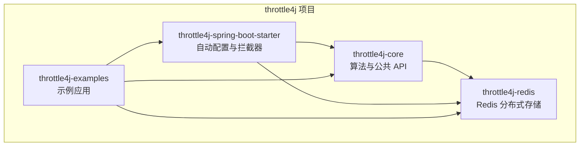
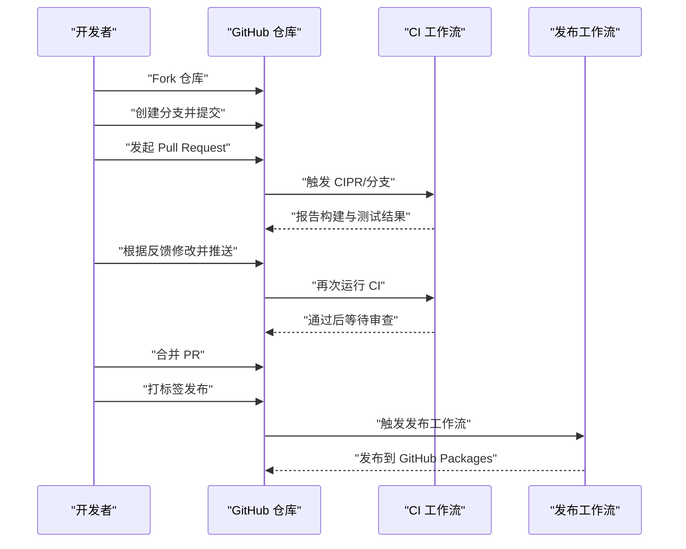
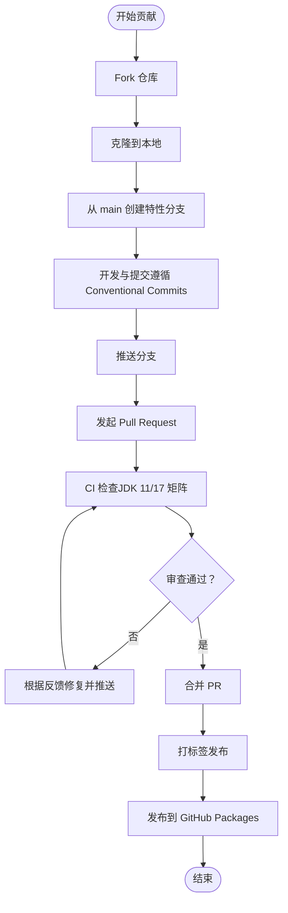
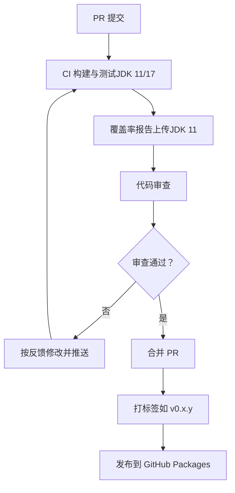
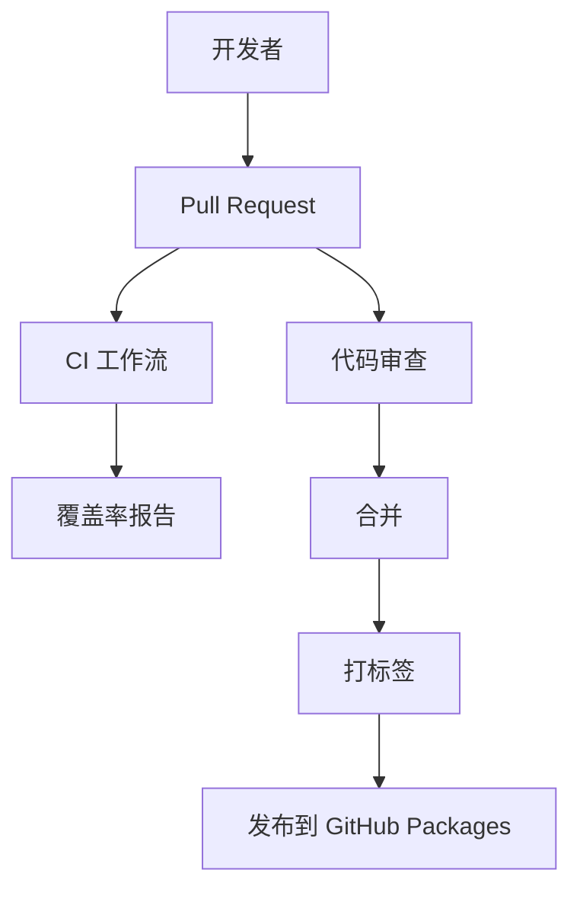

# 贡献流程

<cite>
**本文引用的文件**
- [CONTRIBUTING.md](file://CONTRIBUTING.md)
- [README.md](file://README.md)
- [.github/ISSUE_TEMPLATE/bug_report.md](file://.github/ISSUE_TEMPLATE/bug_report.md)
- [.github/ISSUE_TEMPLATE/feature_request.md](file://.github/ISSUE_TEMPLATE/feature_request.md)
- [.github/workflows/ci.yml](file://.github/workflows/ci.yml)
- [.github/workflows/release.yml](file://.github/workflows/release.yml)
- [CHANGELOG.md](file://CHANGELOG.md)
- [ROADMAP.md](file://ROADMAP.md)
</cite>

## 目录
1. [简介](#简介)
2. [项目结构](#项目结构)
3. [核心组件](#核心组件)
4. [架构总览](#架构总览)
5. [详细组件分析](#详细组件分析)
6. [依赖分析](#依赖分析)
7. [性能考虑](#性能考虑)
8. [故障排查指南](#故障排查指南)
9. [结论](#结论)
10. [附录](#附录)

## 简介
本指南面向希望为 throttle4j 做出贡献的开发者，系统化说明从 Fork 到 Pull Request 的标准流程、Conventional Commits 规范、Issue 报告模板使用方法、代码审查与 CI 要求、代码覆盖率与测试规范，以及社区行为准则与沟通指南。所有流程与规范均以仓库内现有文档为准，确保一致性与可执行性。

## 项目结构
throttle4j 采用多模块 Maven 结构，核心模块包括：
- throttle4j-core：算法、公共 API、内存存储与配置模型
- throttle4j-redis：基于 Lettuce 的分布式存储与原子 Lua 脚本
- throttle4j-spring-boot-starter：自动配置、AOP 拦截器与 Web 拦截器
- throttle4j-examples：示例应用，覆盖各算法与集成方式

此外，仓库提供 CI 工作流与 Issue 模板，保障质量与协作效率。

图表来源
- [README.md:76-101](file://README.md#L76-L101)

章节来源
- [README.md:76-101](file://README.md#L76-L101)

## 核心组件
- 贡献流程与规范：见贡献指南文件，涵盖 Fork/分支/提交/PR/审查/CI 等全流程。
- Issue 模板：提供 Bug Report 与 Feature Request 两种模板，帮助快速定位问题与收集需求。
- CI/发布工作流：定义了构建矩阵、测试与覆盖率上传、发布到 GitHub Packages 的流程。
- 变更日志：维护 Unreleased 区域与语义化版本，便于追踪用户可见变更。
- 路线图：列出未来功能方向与里程碑，便于贡献者选择合适任务。

章节来源
- [CONTRIBUTING.md:5-29](file://CONTRIBUTING.md#L5-L29)
- [.github/ISSUE_TEMPLATE/bug_report.md:1-29](file://.github/ISSUE_TEMPLATE/bug_report.md#L1-L29)
- [.github/ISSUE_TEMPLATE/feature_request.md:1-20](file://.github/ISSUE_TEMPLATE/feature_request.md#L1-L20)
- [.github/workflows/ci.yml:1-35](file://.github/workflows/ci.yml#L1-L35)
- [.github/workflows/release.yml:1-59](file://.github/workflows/release.yml#L1-L59)
- [CHANGELOG.md:8-26](file://CHANGELOG.md#L8-L26)
- [ROADMAP.md:1-86](file://ROADMAP.md#L1-L86)

## 架构总览
下图展示贡献流程的关键节点与交互关系，包括开发者本地、GitHub 仓库、CI 系统与发布流程。

图表来源
- [CONTRIBUTING.md:5-29](file://CONTRIBUTING.md#L5-L29)
- [.github/workflows/ci.yml:1-35](file://.github/workflows/ci.yml#L1-L35)
- [.github/workflows/release.yml:1-59](file://.github/workflows/release.yml#L1-L59)

## 详细组件分析

### GitHub Fork 与 Pull Request 标准流程
- Fork 仓库至个人账户，克隆到本地，从主分支创建特性分支。
- 在分支上进行开发，提交遵循 Conventional Commits 规范。
- 推送分支并打开针对主分支的 Pull Request。
- 确保 CI 成功并通过审查反馈完成修改。

图表来源
- [CONTRIBUTING.md:7-29](file://CONTRIBUTING.md#L7-L29)
- [.github/workflows/ci.yml:3-7](file://.github/workflows/ci.yml#L3-L7)
- [.github/workflows/release.yml:3-6](file://.github/workflows/release.yml#L3-L6)

章节来源
- [CONTRIBUTING.md:7-29](file://CONTRIBUTING.md#L7-L29)

### Conventional Commits 规范与提交消息格式
- 支持类型：feat、fix、docs、test、refactor、perf、chore 等。
- 示例格式：type(scope): subject。
- 提交消息需清晰描述变更类型、影响范围与简要说明。

章节来源
- [CONTRIBUTING.md:18-28](file://CONTRIBUTING.md#L18-L28)

### Issue 报告模板使用方法
- Bug Report 模板：要求描述问题、复现步骤、期望行为、环境信息（Java 版本、throttle4j 版本、存储类型、Spring Boot 版本等）。
- Feature Request 模板：描述问题背景、期望方案、替代方案与附加上下文。

章节来源
- [.github/ISSUE_TEMPLATE/bug_report.md:9-28](file://.github/ISSUE_TEMPLATE/bug_report.md#L9-L28)
- [.github/ISSUE_TEMPLATE/feature_request.md:9-19](file://.github/ISSUE_TEMPLATE/feature_request.md#L9-L19)

### 代码审查流程与 CI 检查要求
- 审查前清单：编译通过、测试通过、公共 API 有 Javadoc、变更记录更新、提交消息符合 Conventional Commits。
- CI 工作流：在 push 与 PR 场景触发；JDK 11/17 矩阵构建与测试；在 JDK 11 下上传覆盖率报告。
- 发布工作流：对 v* 标签触发，构建测试并通过后发布到 GitHub Packages。

图表来源
- [.github/workflows/ci.yml:9-35](file://.github/workflows/ci.yml#L9-L35)
- [.github/workflows/release.yml:8-31](file://.github/workflows/release.yml#L8-L31)

章节来源
- [CONTRIBUTING.md:92-101](file://CONTRIBUTING.md#L92-L101)
- [.github/workflows/ci.yml:9-35](file://.github/workflows/ci.yml#L9-L35)
- [.github/workflows/release.yml:8-31](file://.github/workflows/release.yml#L8-L31)

### 代码覆盖率要求与测试规范
- 新增或修改代码应保持整体覆盖率不低于 60%。
- 使用 Maven 执行测试与覆盖率生成，覆盖率报告输出在各模块 target/site/jacoco 目录。
- 单元测试覆盖核心算法、配置、注册表、拦截器与存储实现。

章节来源
- [CONTRIBUTING.md:81-79](file://CONTRIBUTING.md#L81-L79)

### 社区行为准则与沟通指南
- 遵循 Contributor Covenant 行为准则，参与即表示同意遵守。
- 不当行为可通过私信维护者举报。

章节来源
- [CONTRIBUTING.md:102-104](file://CONTRIBUTING.md#L102-L104)

## 依赖分析
- 贡献流程依赖 GitHub 平台的 PR 机制与 CI 工作流。
- CI 工作流依赖 JDK 与 Maven 环境，矩阵覆盖 JDK 11/17。
- 发布工作流依赖标签与 GitHub Packages 权限。

图表来源
- [.github/workflows/ci.yml:3-7](file://.github/workflows/ci.yml#L3-L7)
- [.github/workflows/release.yml:3-6](file://.github/workflows/release.yml#L3-L6)

章节来源
- [.github/workflows/ci.yml:3-7](file://.github/workflows/ci.yml#L3-L7)
- [.github/workflows/release.yml:3-6](file://.github/workflows/release.yml#L3-L6)

## 性能考虑
- 本节为通用建议，不直接对应具体文件。
- 在提交前确保本地构建与测试通过，避免不必要的 CI 循环。
- 尽量将改动拆分为小而聚焦的提交，提升审查效率与可追溯性。
- 遵循代码风格指南，减少格式化差异导致的审查成本。

## 故障排查指南
- CI 失败：检查构建日志中的编译错误与测试失败，优先修复关键问题后再重新推送。
- 覆盖率不足：补充单元测试，确保新增路径被覆盖；关注 JDK 11 下的覆盖率报告。
- 审查反馈：逐条响应修改意见，必要时在 PR 描述中说明变更原因与影响范围。
- Issue 重复：提交前搜索现有 Issue，避免重复劳动。

章节来源
- [.github/workflows/ci.yml:26-34](file://.github/workflows/ci.yml#L26-L34)
- [CONTRIBUTING.md:92-101](file://CONTRIBUTING.md#L92-L101)

## 结论
throttle4j 的贡献流程以清晰的规范与自动化工具支撑高质量协作。遵循 Fork/分支/提交/PR/审查/CI 的完整闭环，结合 Conventional Commits 与 Issue 模板，能够显著提升贡献效率与代码质量。同时，路线图与变更日志为长期规划与追踪提供了依据。

## 附录
- 变更日志维护：在 Unreleased 区域记录用户可见变更，发布时归档版本。
- 路线图参考：关注未来增强方向，选择与自身能力匹配的任务认领。

章节来源
- [CHANGELOG.md:8-26](file://CHANGELOG.md#L8-L26)
- [ROADMAP.md:1-86](file://ROADMAP.md#L1-L86)