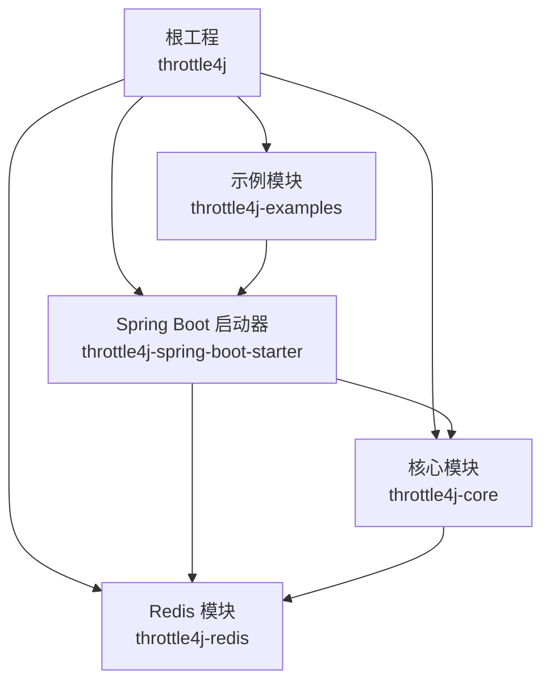
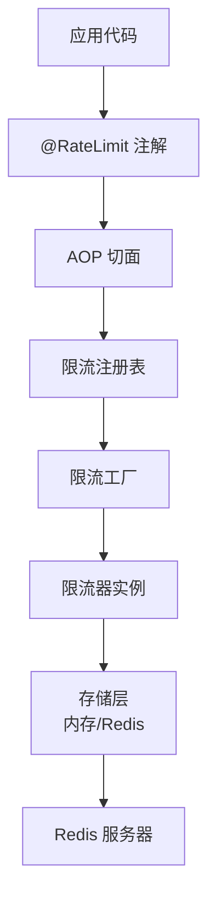
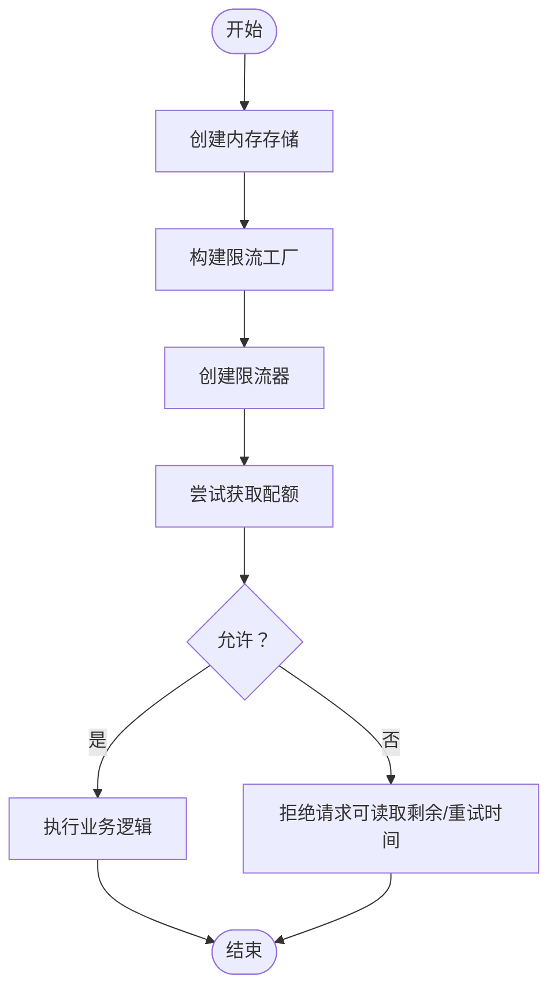
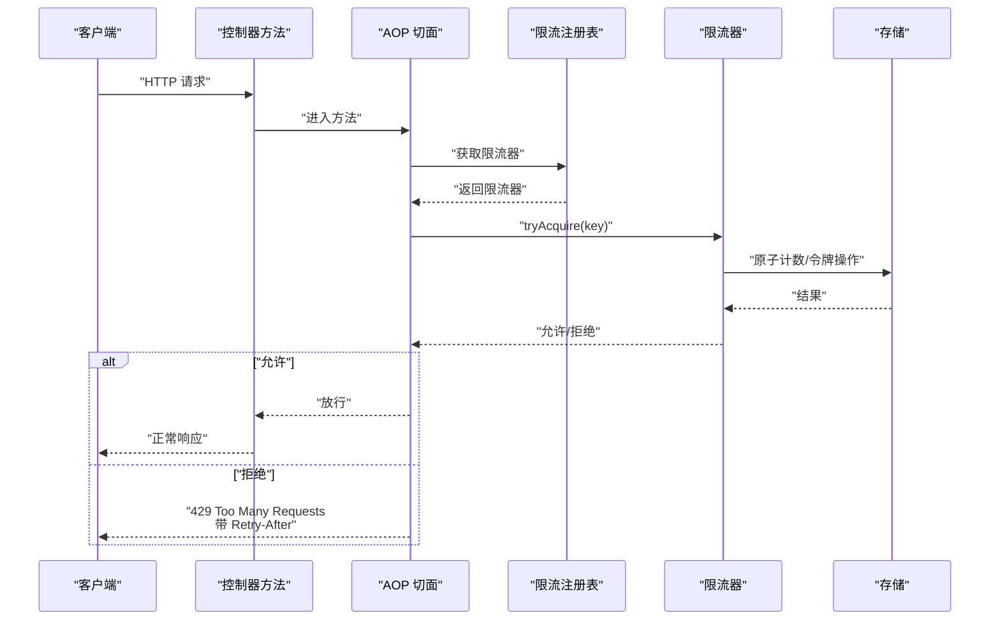
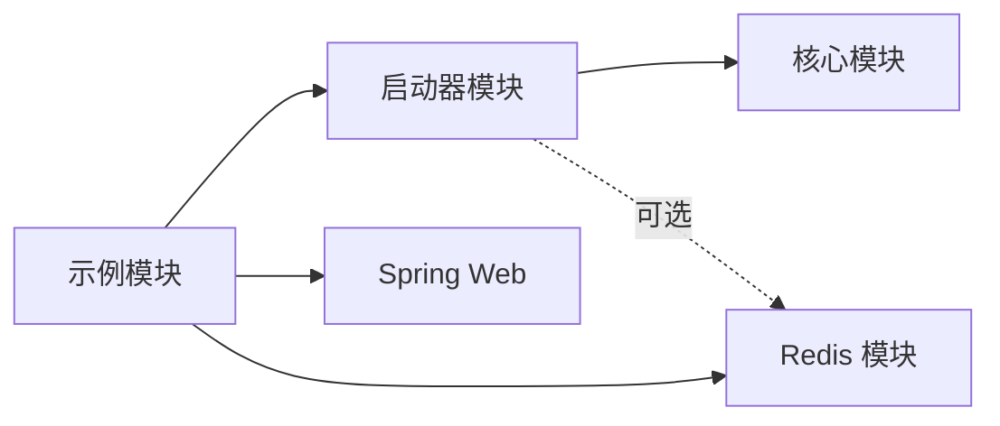

# 快速开始

<cite>
**本文引用的文件**
- [README.md](file://README.md)
- [pom.xml](file://pom.xml)
- [BasicUsageExample.java](file://throttle4j-examples/src/main/java/com/throttle4j/example/BasicUsageExample.java)
- [ExampleController.java](file://throttle4j-examples/src/main/java/com/throttle4j/example/ExampleController.java)
- [ExampleExceptionHandler.java](file://throttle4j-examples/src/main/java/com/throttle4j/example/ExampleExceptionHandler.java)
- [application.yml](file://throttle4j-examples/src/main/resources/application.yml)
- [RateLimit.java](file://throttle4j-spring-boot-starter/src/main/java/com/throttle4j/spring/annotation/RateLimit.java)
- [Throttle4jAutoConfiguration.java](file://throttle4j-spring-boot-starter/src/main/java/com/throttle4j/spring/autoconfigure/Throttle4jAutoConfiguration.java)
- [Throttle4jProperties.java](file://throttle4j-spring-boot-starter/src/main/java/com/throttle4j/spring/autoconfigure/Throttle4jProperties.java)
- [RateLimitInterceptor.java](file://throttle4j-spring-boot-starter/src/main/java/com/throttle4j/spring/web/RateLimitInterceptor.java)
- [RateLimitAspect.java](file://throttle4j-spring-boot-starter/src/main/java/com/throttle4j/spring/aop/RateLimitAspect.java)
- [RateLimiter.java](file://throttle4j-core/src/main/java/com/throttle4j/core/RateLimiter.java)
- [Algorithm.java](file://throttle4j-core/src/main/java/com/throttle4j/core/Algorithm.java)
- [RateLimiterConfig.java](file://throttle4j-core/src/main/java/com/throttle4j/core/RateLimiterConfig.java)
- [InMemoryStore.java](file://throttle4j-core/src/main/java/com/throttle4j/store/InMemoryStore.java)
- [RedisRateLimitStore.java](file://throttle4j-redis/src/main/java/com/throttle4j/redis/RedisRateLimitStore.java)
- [RateExceededException.java](file://throttle4j-core/src/main/java/com/throttle4j/core/RateExceededException.java)
- [spring.factories](file://throttle4j-spring-boot-starter/src/main/resources/META-INF/spring.factories)
</cite>

## 更新摘要
**所做更改**
- 新增生产环境部署注意事项章节，包含Redis配置、连接池优化、监控告警等企业级要求
- 扩展性能调优建议，涵盖算法选择、存储配置、内存管理等关键指标
- 增加常见问题FAQ，解决初始化失败、Redis连接异常、限流不生效等典型问题
- 补充最佳实践指南，提供不同业务场景的配置模板和实施建议
- 完善错误处理机制说明，包含异常类型、降级策略、日志记录等

## 目录
1. [简介](#简介)
2. [项目结构](#项目结构)
3. [核心组件](#核心组件)
4. [架构总览](#架构总览)
5. [详细组件解析](#详细组件解析)
6. [依赖与安装](#依赖与安装)
7. [三类使用方式](#三类使用方式)
8. [依赖关系分析](#依赖关系分析)
9. [性能与最佳实践](#性能与最佳实践)
10. [生产环境部署](#生产环境部署)
11. [故障排查](#故障排查)
12. [结语](#结语)

## 简介
本指南面向首次接触 throttle4j 的开发者，目标是在约 15 分钟内完成安装、配置与运行第一个限流示例。内容覆盖：
- 安装与依赖配置（Maven/Gradle）
- 三种使用方式：程序化调用、Spring Boot 注解驱动、直接依赖使用
- 配置文件示例与环境准备
- 常见初始化问题与解决方案
- 不同场景下的最佳实践建议

**更新** 新增生产环境部署指导、性能调优建议和企业级采用所需的关键信息

## 项目结构
throttle4j 采用多模块设计，核心能力由核心模块提供，Spring Boot 集成通过启动器模块完成，示例模块展示了完整可运行的用法。

**图表来源**
- [pom.xml:15-20](file://pom.xml#L15-L20)
- [pom.xml（示例模块）:18-31](file://throttle4j-examples/pom.xml#L18-L31)

**章节来源**
- [pom.xml:15-20](file://pom.xml#L15-L20)
- [pom.xml（示例模块）:18-31](file://throttle4j-examples/pom.xml#L18-L31)

## 核心组件
- 核心 API 与算法
  - RateLimiter 接口：统一的限流入口，支持按 key 申请单次或多次配额。
  - Algorithm 枚举：提供四种算法（固定窗口、滑动窗口、令牌桶、漏桶）。
  - TokenBucketRateLimiter 等具体算法实现：基于存储后端进行原子计数/令牌管理。
- 存储层
  - InMemoryStore：单机内存存储，适合本地开发与测试。
  - RedisRateLimitStore：分布式存储，结合 Lua 脚本保证原子性。
- Spring Boot 集成
  - @RateLimit 注解：在方法上声明式限流。
  - Throttle4jAutoConfiguration：自动装配默认 Bean（存储、工厂、注册表、AOP 切面）。
  - Web 自动配置：拦截器与响应头注入，统一返回 429 并携带标准头部。

**更新** 新增存储层的线程安全性和原子性保证说明

**章节来源**
- [RateLimiter.java:8-31](file://throttle4j-core/src/main/java/com/throttle4j/core/RateLimiter.java#L8-L31)
- [Algorithm.java:6-15](file://throttle4j-core/src/main/java/com/throttle4j/core/Algorithm.java#L6-L15)
- [InMemoryStore.java:33-38](file://throttle4j-core/src/main/java/com/throttle4j/store/InMemoryStore.java#L33-L38)
- [RedisRateLimitStore.java:40-46](file://throttle4j-redis/src/main/java/com/throttle4j/redis/RedisRateLimitStore.java#L40-L46)
- [RateLimit.java:26-74](file://throttle4j-spring-boot-starter/src/main/java/com/throttle4j/spring/annotation/RateLimit.java#L26-L74)
- [Throttle4jAutoConfiguration.java:27-131](file://throttle4j-spring-boot-starter/src/main/java/com/throttle4j/spring/autoconfigure/Throttle4jAutoConfiguration.java#L27-L131)

## 架构总览
下图展示了从应用到存储的整体链路，以及 Spring Boot 自动装配的关键角色。

**图表来源**
- [Throttle4jAutoConfiguration.java:27-131](file://throttle4j-spring-boot-starter/src/main/java/com/throttle4j/spring/autoconfigure/Throttle4jAutoConfiguration.java#L27-L131)
- [RateLimit.java:14-21](file://throttle4j-spring-boot-starter/src/main/java/com/throttle4j/spring/annotation/RateLimit.java#L14-L21)
- [spring.factories:1-3](file://throttle4j-spring-boot-starter/src/main/resources/META-INF/spring.factories#L1-L3)

## 详细组件解析

### 组件一：程序化调用（throttle4j-core）
- 典型流程
  - 创建共享的 InMemoryStore
  - 使用 DefaultRateLimiterFactory 构建限流器
  - 对指定 key 进行 tryAcquire，根据返回结果决定放行或拒绝
- 示例参考
  - [BasicUsageExample.java:30-101](file://throttle4j-examples/src/main/java/com/throttle4j/example/BasicUsageExample.java#L30-L101)

**图表来源**
- [BasicUsageExample.java:30-101](file://throttle4j-examples/src/main/java/com/throttle4j/example/BasicUsageExample.java#L30-L101)
- [RateLimiter.java:10-25](file://throttle4j-core/src/main/java/com/throttle4j/core/RateLimiter.java#L10-L25)

**章节来源**
- [BasicUsageExample.java:30-101](file://throttle4j-examples/src/main/java/com/throttle4j/example/BasicUsageExample.java#L30-L101)
- [RateLimiter.java:8-31](file://throttle4j-core/src/main/java/com/throttle4j/core/RateLimiter.java#L8-L31)

### 组件二：Spring Boot 注解驱动（throttle4j-spring-boot-starter）
- 关键点
  - 在控制器方法上使用 @RateLimit 声明限流策略
  - 自动装配 AOP 切面，拦截方法调用并在进入业务前执行限流判断
  - 默认返回 429 并设置 Retry-After 等标准头部
- 示例参考
  - [ExampleController.java:16-35](file://throttle4j-examples/src/main/java/com/throttle4j/example/ExampleController.java#L16-L35)
  - [ExampleExceptionHandler.java:16-25](file://throttle4j-examples/src/main/java/com/throttle4j/example/ExampleExceptionHandler.java#L16-L25)
  - [spring.factories:1-3](file://throttle4j-spring-boot-starter/src/main/resources/META-INF/spring.factories#L1-L3)

**图表来源**
- [ExampleController.java:16-35](file://throttle4j-examples/src/main/java/com/throttle4j/example/ExampleController.java#L16-L35)
- [Throttle4jAutoConfiguration.java:126-130](file://throttle4j-spring-boot-starter/src/main/java/com/throttle4j/spring/autoconfigure/Throttle4jAutoConfiguration.java#L126-L130)
- [RateExceededException.java:6-32](file://throttle4j-core/src/main/java/com/throttle4j/core/RateExceededException.java#L6-L32)

**章节来源**
- [ExampleController.java:16-35](file://throttle4j-examples/src/main/java/com/throttle4j/example/ExampleController.java#L16-L35)
- [ExampleExceptionHandler.java:16-25](file://throttle4j-examples/src/main/java/com/throttle4j/example/ExampleExceptionHandler.java#L16-L25)
- [spring.factories:1-3](file://throttle4j-spring-boot-starter/src/main/resources/META-INF/spring.factories#L1-L3)

### 组件三：直接依赖使用（throttle4j-core）
- 场景
  - 不使用 Spring，仅依赖核心 API 实现限流
- 示例参考
  - [BasicUsageExample.java:30-101](file://throttle4j-examples/src/main/java/com/throttle4j/example/BasicUsageExample.java#L30-L101)

**章节来源**
- [BasicUsageExample.java:30-101](file://throttle4j-examples/src/main/java/com/throttle4j/example/BasicUsageExample.java#L30-L101)

## 依赖与安装

### Maven 依赖
- Spring Boot 启动器（推荐）
  - 参考路径：[README.md:26-34](file://README.md#L26-L34)
- 直接依赖核心模块
  - 参考路径：[pom.xml（示例模块）:18-31](file://throttle4j-examples/pom.xml#L18-L31)

### Gradle 依赖
- Spring Boot 启动器
  - 参考路径：[README.md:36-40](file://README.md#L36-L40)

### 版本与环境
- Java 版本要求：11 或以上
  - 参考路径：[README.md](file://README.md#L151)
- 工程版本与模块管理
  - 参考路径：[pom.xml:8-20](file://pom.xml#L8-L20)

**章节来源**
- [README.md:26-40](file://README.md#L26-L40)
- [README.md](file://README.md#L151)
- [pom.xml:8-20](file://pom.xml#L8-L20)
- [pom.xml（示例模块）:18-31](file://throttle4j-examples/pom.xml#L18-L31)

## 三类使用方式

### 方式一：程序化调用（throttle4j-core）
- 步骤
  - 引入核心模块依赖
  - 创建共享的 InMemoryStore
  - 使用工厂创建限流器
  - 在业务中对 key 调用 tryAcquire，依据返回值放行或降级
- 示例参考
  - [BasicUsageExample.java:30-101](file://throttle4j-examples/src/main/java/com/throttle4j/example/BasicUsageExample.java#L30-L101)

**章节来源**
- [BasicUsageExample.java:30-101](file://throttle4j-examples/src/main/java/com/throttle4j/example/BasicUsageExample.java#L30-L101)

### 方式二：Spring Boot 注解驱动（throttle4j-spring-boot-starter）
- 步骤
  - 引入启动器依赖
  - 在控制器方法上添加 @RateLimit 注解
  - 启动应用，访问受保护接口，观察 429 返回与标准头部
- 示例参考
  - [ExampleController.java:16-35](file://throttle4j-examples/src/main/java/com/throttle4j/example/ExampleController.java#L16-L35)
  - [ExampleExceptionHandler.java:16-25](file://throttle4j-examples/src/main/java/com/throttle4j/example/ExampleExceptionHandler.java#L16-L25)
  - [application.yml:4-9](file://throttle4j-examples/src/main/resources/application.yml#L4-L9)

**章节来源**
- [ExampleController.java:16-35](file://throttle4j-examples/src/main/java/com/throttle4j/example/ExampleController.java#L16-L35)
- [ExampleExceptionHandler.java:16-25](file://throttle4j-examples/src/main/java/com/throttle4j/example/ExampleExceptionHandler.java#L16-L25)
- [application.yml:4-9](file://throttle4j-examples/src/main/resources/application.yml#L4-L9)

### 方式三：直接依赖使用（throttle4j-core）
- 步骤
  - 仅引入核心模块，不依赖 Spring
  - 手工管理存储与工厂，按需创建限流器
- 示例参考
  - [BasicUsageExample.java:30-101](file://throttle4j-examples/src/main/java/com/throttle4j/example/BasicUsageExample.java#L30-L101)

**章节来源**
- [BasicUsageExample.java:30-101](file://throttle4j-examples/src/main/java/com/throttle4j/example/BasicUsageExample.java#L30-L101)

## 依赖关系分析

**图表来源**
- [pom.xml（示例模块）:18-31](file://throttle4j-examples/pom.xml#L18-L31)
- [Throttle4jAutoConfiguration.java:23-57](file://throttle4j-spring-boot-starter/src/main/java/com/throttle4j/spring/autoconfigure/Throttle4jAutoConfiguration.java#L23-L57)

**章节来源**
- [pom.xml（示例模块）:18-31](file://throttle4j-examples/pom.xml#L18-L31)
- [Throttle4jAutoConfiguration.java:23-57](file://throttle4j-spring-boot-starter/src/main/java/com/throttle4j/spring/autoconfigure/Throttle4jAutoConfiguration.java#L23-L57)

## 性能与最佳实践

### 算法选择指南
- 令牌桶：适合突发流量但需要平均速率控制的场景
- 滑动窗口：更公平地分配配额，边界抖动更低
- 固定窗口：实现简单，边界时刻可能出现尖峰
- 漏桶：强调稳定的出站速率

### 存储配置建议
- 单机：使用内存存储，延迟低
- 分布式：使用 Redis 存储，注意网络延迟与可用性
- 内存清理：合理设置空闲TTL和清理间隔

### 配置优化策略
- 为不同接口设定差异化限流参数
- 合理设置窗口与配额，避免频繁边界重置
- 开启降级回退（当 Redis 不可用时自动回退到本地存储）

**更新** 新增内存存储的清理机制和Redis存储的原子性保证

**章节来源**
- [README.md:103-112](file://README.md#L103-L112)
- [Throttle4jAutoConfiguration.java:47-57](file://throttle4j-spring-boot-starter/src/main/java/com/throttle4j/spring/autoconfigure/Throttle4jAutoConfiguration.java#L47-L57)
- [InMemoryStore.java:28-32](file://throttle4j-core/src/main/java/com/throttle4j/store/InMemoryStore.java#L28-L32)
- [RedisRateLimitStore.java:22-38](file://throttle4j-redis/src/main/java/com/throttle4j/redis/RedisRateLimitStore.java#L22-L38)

## 生产环境部署

### Redis 配置优化
- 连接池设置：合理配置最大连接数、超时时间
- 数据库分离：使用独立数据库避免与其他业务冲突
- 密钥前缀：自定义key前缀避免命名冲突
- 超时配置：设置合理的连接和命令超时时间

### 监控与告警
- 标准响应头：X-RateLimit-Limit、X-RateLimit-Remaining、X-RateLimit-Reset、Retry-After
- 日志记录：关键操作和异常情况的日志记录
- 性能指标：QPS、P95/P99延迟、Redis连接池使用率

### 高可用部署
- Redis集群：使用主从复制和哨兵模式
- 多活部署：跨机房部署多个实例
- 降级策略：Redis不可用时自动降级到本地存储

### 安全配置
- 认证授权：Redis连接认证
- 网络隔离：Redis服务网络访问控制
- 数据加密：敏感数据传输加密

**新增章节** 企业级部署所需的关键配置和监控指标

**章节来源**
- [Throttle4jProperties.java:153-200](file://throttle4j-spring-boot-starter/src/main/java/com/throttle4j/spring/autoconfigure/Throttle4jProperties.java#L153-L200)
- [RateLimitInterceptor.java:30-38](file://throttle4j-spring-boot-starter/src/main/java/com/throttle4j/spring/web/RateLimitInterceptor.java#L30-L38)
- [RedisRateLimitStore.java:44-46](file://throttle4j-redis/src/main/java/com/throttle4j/redis/RedisRateLimitStore.java#L44-L46)

## 故障排查

### 常见初始化问题
- 启动器未生效
  - 确认已引入启动器依赖且 Spring Boot 应用已扫描到自动配置
- Redis 相关问题
  - 当 storeType=redis 但未引入 Redis 模块时，会回退到内存存储并记录警告
- 注解不生效
  - 确保方法为 Spring 管理的 Bean，且注解作用于 public 方法

### 运行时问题诊断
- 429 错误处理：检查异常处理器配置
- 性能问题：监控Redis连接池使用情况
- 配置错误：验证application.yml中的配置项

### 最佳实践建议
- 开发环境：使用内存存储，简化部署
- 测试环境：使用Redis存储，模拟生产环境
- 生产环境：配置Redis集群，启用监控告警

**更新** 新增生产环境故障排查和性能监控建议

**章节来源**
- [spring.factories:1-3](file://throttle4j-spring-boot-starter/src/main/resources/META-INF/spring.factories#L1-L3)
- [Throttle4jAutoConfiguration.java:47-57](file://throttle4j-spring-boot-starter/src/main/java/com/throttle4j/spring/autoconfigure/Throttle4jAutoConfiguration.java#L47-L57)
- [RateLimit.java:23-26](file://throttle4j-spring-boot-starter/src/main/java/com/throttle4j/spring/annotation/RateLimit.java#L23-L26)
- [ExampleExceptionHandler.java:16-25](file://throttle4j-examples/src/main/java/com/throttle4j/example/ExampleExceptionHandler.java#L16-L25)

## 结语
通过本指南，你可以在 15 分钟内完成 throttle4j 的安装与运行。建议从 Spring Boot 注解驱动入手，快速验证效果；随后根据业务需求选择合适的算法与存储方案，并结合示例模块进一步探索高级特性。

**更新** 新增生产环境部署和企业级采用的完整指导，帮助团队安全可靠地集成和使用throttle4j。