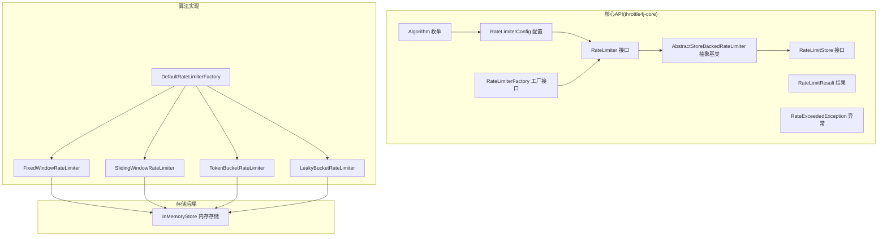
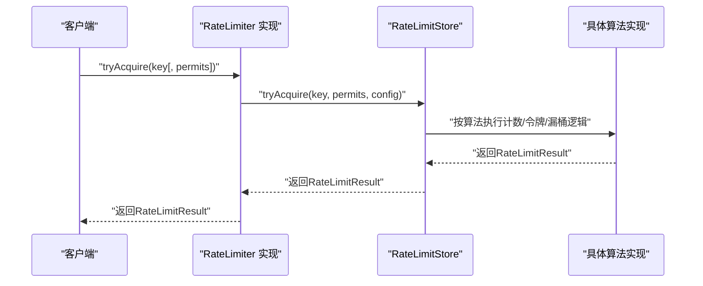
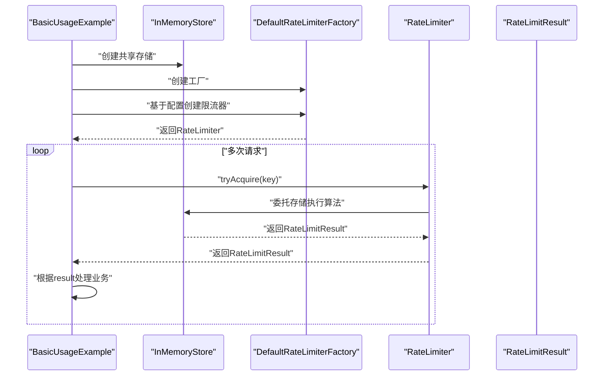
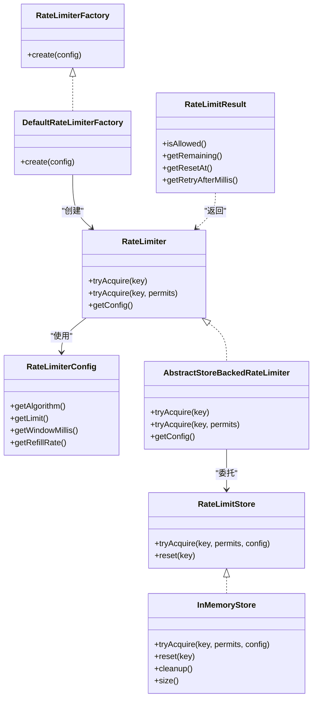

# 核心API设计

<cite>
**本文引用的文件**
- [RateLimiter.java](file://throttle4j-core/src/main/java/com/throttle4j/core/RateLimiter.java)
- [RateLimitResult.java](file://throttle4j-core/src/main/java/com/throttle4j/core/RateLimitResult.java)
- [RateLimiterConfig.java](file://throttle4j-core/src/main/java/com/throttle4j/core/RateLimiterConfig.java)
- [Algorithm.java](file://throttle4j-core/src/main/java/com/throttle4j/core/Algorithm.java)
- [RateExceededException.java](file://throttle4j-core/src/main/java/com/throttle4j/core/RateExceededException.java)
- [RateLimiterFactory.java](file://throttle4j-core/src/main/java/com/throttle4j/core/RateLimiterFactory.java)
- [DefaultRateLimiterFactory.java](file://throttle4j-core/src/main/java/com/throttle4j/algorithm/DefaultRateLimiterFactory.java)
- [AbstractStoreBackedRateLimiter.java](file://throttle4j-core/src/main/java/com/throttle4j/algorithm/AbstractStoreBackedRateLimiter.java)
- [RateLimitStore.java](file://throttle4j-core/src/main/java/com/throttle4j/store/RateLimitStore.java)
- [InMemoryStore.java](file://throttle4j-core/src/main/java/com/throttle4j/store/InMemoryStore.java)
- [FixedWindowRateLimiter.java](file://throttle4j-core/src/main/java/com/throttle4j/algorithm/FixedWindowRateLimiter.java)
- [SlidingWindowRateLimiter.java](file://throttle4j-core/src/main/java/com/throttle4j/algorithm/SlidingWindowRateLimiter.java)
- [TokenBucketRateLimiter.java](file://throttle4j-core/src/main/java/com/throttle4j/algorithm/TokenBucketRateLimiter.java)
- [LeakyBucketRateLimiter.java](file://throttle4j-core/src/main/java/com/throttle4j/algorithm/LeakyBucketRateLimiter.java)
- [BasicUsageExample.java](file://throttle4j-examples/src/main/java/com/throttle4j/example/BasicUsageExample.java)
- [RateLimitResultTest.java](file://throttle4j-core/src/test/java/com/throttle4j/core/RateLimitResultTest.java)
- [RateLimiterConfigTest.java](file://throttle4j-core/src/test/java/com/throttle4j/core/RateLimiterConfigTest.java)
</cite>

## 目录
1. [简介](#简介)
2. [项目结构](#项目结构)
3. [核心组件](#核心组件)
4. [架构总览](#架构总览)
5. [详细组件分析](#详细组件分析)
6. [依赖分析](#依赖分析)
7. [性能考虑](#性能考虑)
8. [故障排查指南](#故障排查指南)
9. [结论](#结论)
10. [附录](#附录)

## 简介
本文件聚焦于throttle4j核心API设计，围绕以下目标展开：  
- 深入解释RateLimiter接口的设计理念与方法签名；  
- 详细说明tryAcquire()与acquire()（注：核心API中未提供阻塞式acquire()）的行为差异与使用场景；  
- 阐述RateLimitResult数据结构与字段含义（allow字段、remainingPermits、resetTime等）；  
- 解释RateLimiterConfig的配置项与参数含义（limit、window、算法类型等）；  
- 提供API使用的最佳实践与常见错误处理方式；  
- 给出完整的调用流程图与类关系图。

## 项目结构
throttle4j采用“核心API + 算法实现 + 存储后端 + 工厂与注册表”的分层组织方式：  
- 核心API位于throttle4j-core模块，定义RateLimiter接口、配置、结果与异常等契约；  
- 算法实现位于throttle4j-core/algorithm，封装不同限流算法；  
- 存储后端位于throttle4j-core/store，负责状态持久化与清理；  
- 工厂位于throttle4j-core/algorithm，默认工厂根据配置选择具体算法实现；  
- 示例位于throttle4j-examples，展示程序化与注解式用法。

图表来源
- [RateLimiter.java:8-31](file://throttle4j-core/src/main/java/com/throttle4j/core/RateLimiter.java#L8-L31)
- [AbstractStoreBackedRateLimiter.java:14-41](file://throttle4j-core/src/main/java/com/throttle4j/algorithm/AbstractStoreBackedRateLimiter.java#L14-L41)
- [DefaultRateLimiterFactory.java:14-38](file://throttle4j-core/src/main/java/com/throttle4j/algorithm/DefaultRateLimiterFactory.java#L14-L38)
- [RateLimitStore.java:15-34](file://throttle4j-core/src/main/java/com/throttle4j/store/RateLimitStore.java#L15-L34)
- [InMemoryStore.java:24-93](file://throttle4j-core/src/main/java/com/throttle4j/store/InMemoryStore.java#L24-L93)

章节来源
- [RateLimiter.java:1-32](file://throttle4j-core/src/main/java/com/throttle4j/core/RateLimiter.java#L1-L32)
- [RateLimiterConfig.java:8-50](file://throttle4j-core/src/main/java/com/throttle4j/core/RateLimiterConfig.java#L8-L50)
- [Algorithm.java:6-15](file://throttle4j-core/src/main/java/com/throttle4j/core/Algorithm.java#L6-L15)
- [RateLimitStore.java:15-34](file://throttle4j-core/src/main/java/com/throttle4j/store/RateLimitStore.java#L15-L34)
- [InMemoryStore.java:24-93](file://throttle4j-core/src/main/java/com/throttle4j/store/InMemoryStore.java#L24-L93)
- [DefaultRateLimiterFactory.java:14-38](file://throttle4j-core/src/main/java/com/throttle4j/algorithm/DefaultRateLimiterFactory.java#L14-L38)

## 核心组件
- RateLimiter接口：定义非阻塞的tryAcquire(key)与tryAcquire(key, permits)方法，返回RateLimitResult，并暴露getConfig()以获取不可变配置。  
- RateLimitResult：封装一次尝试的结果，包含是否允许、剩余配额、窗口重置时间、建议重试时延等字段。  
- RateLimiterConfig：不可变配置对象，通过Builder构建，支持算法、限流上限、窗口时长、令牌桶补充速率等参数。  
- Algorithm枚举：支持固定窗口、滑动窗口、令牌桶、漏桶四种算法。  
- RateExceededException：当请求被拒绝时抛出的运行时异常，携带键与结果信息。  
- RateLimiterFactory：工厂接口，用于从配置创建具体的RateLimiter实例。  
- DefaultRateLimiterFactory：默认工厂，依据算法类型返回对应实现。  
- AbstractStoreBackedRateLimiter：抽象基类，统一实现单许可与多许可的tryAcquire委托逻辑，并持有配置与存储。  
- RateLimitStore：存储抽象，定义tryAcquire与reset能力；InMemoryStore为内存实现，提供清理与统计能力。

章节来源
- [RateLimiter.java:8-31](file://throttle4j-core/src/main/java/com/throttle4j/core/RateLimiter.java#L8-L31)
- [RateLimitResult.java:6-67](file://throttle4j-core/src/main/java/com/throttle4j/core/RateLimitResult.java#L6-L67)
- [RateLimiterConfig.java:8-50](file://throttle4j-core/src/main/java/com/throttle4j/core/RateLimiterConfig.java#L8-L50)
- [Algorithm.java:6-15](file://throttle4j-core/src/main/java/com/throttle4j/core/Algorithm.java#L6-L15)
- [RateExceededException.java:6-32](file://throttle4j-core/src/main/java/com/throttle4j/core/RateExceededException.java#L6-L32)
- [RateLimiterFactory.java:6-15](file://throttle4j-core/src/main/java/com/throttle4j/core/RateLimiterFactory.java#L6-L15)
- [DefaultRateLimiterFactory.java:14-38](file://throttle4j-core/src/main/java/com/throttle4j/algorithm/DefaultRateLimiterFactory.java#L14-L38)
- [AbstractStoreBackedRateLimiter.java:14-41](file://throttle4j-core/src/main/java/com/throttle4j/algorithm/AbstractStoreBackedRateLimiter.java#L14-L41)
- [RateLimitStore.java:15-34](file://throttle4j-core/src/main/java/com/throttle4j/store/RateLimitStore.java#L15-L34)
- [InMemoryStore.java:24-93](file://throttle4j-core/src/main/java/com/throttle4j/store/InMemoryStore.java#L24-L93)

## 架构总览
下图展示了核心API在系统中的交互关系：客户端通过RateLimiter发起限流尝试，内部委托到RateLimitStore执行算法逻辑，最终返回RateLimitResult。

图表来源
- [AbstractStoreBackedRateLimiter.java:24-35](file://throttle4j-core/src/main/java/com/throttle4j/algorithm/AbstractStoreBackedRateLimiter.java#L24-L35)
- [RateLimitStore.java:17-26](file://throttle4j-core/src/main/java/com/throttle4j/store/RateLimitStore.java#L17-L26)
- [InMemoryStore.java:69-93](file://throttle4j-core/src/main/java/com/throttle4j/store/InMemoryStore.java#L69-L93)

## 详细组件分析

### RateLimiter接口与行为差异
- 设计理念：提供非阻塞的限流尝试，避免线程等待，便于在高并发场景下快速失败与降级。  
- 方法签名：  
  - tryAcquire(key)：尝试获取1个许可；  
  - tryAcquire(key, permits)：尝试获取指定数量许可；  
  - getConfig()：返回当前限流器的不可变配置。  
- 行为差异与使用场景：  
  - 单许可调用适合简单计数或每个请求占用1个配额的场景；  
  - 多许可调用适合批量处理或大流量合并计数的场景；  
  - 两者均不阻塞线程，需根据返回的RateLimitResult决定后续策略（如重试、降级、熔断）。  

章节来源
- [RateLimiter.java:8-31](file://throttle4j-core/src/main/java/com/throttle4j/core/RateLimiter.java#L8-L31)
- [AbstractStoreBackedRateLimiter.java:24-35](file://throttle4j-core/src/main/java/com/throttle4j/algorithm/AbstractStoreBackedRateLimiter.java#L24-L35)

### RateLimitResult数据结构与含义
- 字段说明：  
  - allowed：布尔值，表示本次请求是否被允许；  
  - remaining：当前窗口内剩余配额；  
  - resetAt：窗口重置的时间戳（毫秒）；  
  - retryAfterMillis：建议重试的时延（毫秒），当被拒绝时有效。  
- 构造与工厂方法：  
  - 允许结果：通过allowed(...)工厂方法构造；  
  - 拒绝结果：通过rejected(...)工厂方法构造；  
  - 直接构造时，remaining与retryAfterMillis会被钳制为非负数。  
- 使用建议：  
  - 当allowed为true时，remaining可作为后续决策参考；  
  - 当allowed为false时，retryAfterMillis可用于指数退避或定时重试；  
  - resetAt可用于UI提示或日志记录。  

章节来源
- [RateLimitResult.java:6-67](file://throttle4j-core/src/main/java/com/throttle4j/core/RateLimitResult.java#L6-L67)
- [RateLimitResultTest.java:10-31](file://throttle4j-core/src/test/java/com/throttle4j/core/RateLimitResultTest.java#L10-L31)

### RateLimiterConfig配置选项与参数含义
- 关键参数：  
  - algorithm：算法类型（FIXED_WINDOW、SLIDING_WINDOW、TOKEN_BUCKET、LEAKY_BUCKET）；  
  - limit：窗口内的最大请求数或容量（令牌桶为容量）；  
  - windowMillis：窗口时长（毫秒），可通过windowSeconds便捷设置；  
  - refillRate：令牌桶补充速率（tokens/second），仅在TOKEN_BUCKET生效。  
- 校验规则：  
  - 必须设置algorithm且limit > 0；  
  - 对于TOKEN_BUCKET，refillRate必须大于0，windowMillis若未显式设置则默认为1000ms；  
  - 对于其他算法，windowMillis必须大于0。  
- 最佳实践：  
  - 明确业务场景选择算法：固定窗口适合简单计数，滑动窗口更平滑，令牌桶适合突发流量，漏桶保证稳定输出；  
  - 合理设置limit与windowMillis，确保在峰值期有足够容量同时不过度放水；  
  - 令牌桶的refillRate应与业务吞吐匹配，避免频繁重试或过早耗尽。  

章节来源
- [RateLimiterConfig.java:8-50](file://throttle4j-core/src/main/java/com/throttle4j/core/RateLimiterConfig.java#L8-L50)
- [RateLimiterConfig.java:55-111](file://throttle4j-core/src/main/java/com/throttle4j/core/RateLimiterConfig.java#L55-L111)
- [RateLimiterConfigTest.java:9-61](file://throttle4j-core/src/test/java/com/throttle4j/core/RateLimiterConfigTest.java#L9-L61)

### RateExceededException异常处理
- 触发条件：当请求被拒绝时抛出，便于上层统一捕获与处理。  
- 异常内容：包含触发键与拒绝结果，便于定位与审计。  
- 建议处理策略：  
  - 记录异常日志与指标；  
  - 返回标准HTTP 429或自定义错误码；  
  - 基于retryAfterMillis进行重试控制；  
  - 在网关或服务端实现退避重试与熔断降级。  

章节来源
- [RateExceededException.java:6-32](file://throttle4j-core/src/main/java/com/throttle4j/core/RateExceededException.java#L6-L32)

### 算法实现与工厂
- DefaultRateLimiterFactory：根据配置的algorithm返回对应的算法实现（固定窗口、滑动窗口、令牌桶、漏桶）。  
- AbstractStoreBackedRateLimiter：统一实现tryAcquire委托至存储层，并校验许可数量≥1。  
- InMemoryStore：内存存储实现，按算法维护独立的状态映射，提供定期清理与size统计。  
- 算法要点：  
  - 固定窗口：每到窗口边界重置计数；  
  - 滑动窗口：将窗口划分为若干子槽，近似实现精确滑窗；  
  - 令牌桶：按时间动态补充令牌，支持突发；  
  - 漏桶：维持恒定输出速率，平滑突发。  

章节来源
- [DefaultRateLimiterFactory.java:14-38](file://throttle4j-core/src/main/java/com/throttle4j/algorithm/DefaultRateLimiterFactory.java#L14-L38)
- [AbstractStoreBackedRateLimiter.java:14-41](file://throttle4j-core/src/main/java/com/throttle4j/algorithm/AbstractStoreBackedRateLimiter.java#L14-L41)
- [InMemoryStore.java:24-93](file://throttle4j-core/src/main/java/com/throttle4j/store/InMemoryStore.java#L24-L93)
- [FixedWindowRateLimiter.java:12-17](file://throttle4j-core/src/main/java/com/throttle4j/algorithm/FixedWindowRateLimiter.java#L12-L17)
- [SlidingWindowRateLimiter.java:10-15](file://throttle4j-core/src/main/java/com/throttle4j/algorithm/SlidingWindowRateLimiter.java#L10-L15)
- [TokenBucketRateLimiter.java:10-14](file://throttle4j-core/src/main/java/com/throttle4j/algorithm/TokenBucketRateLimiter.java#L10-L14)
- [LeakyBucketRateLimiter.java:10-14](file://throttle4j-core/src/main/java/com/throttle4j/algorithm/LeakyBucketRateLimiter.java#L10-L14)

### API使用示例与调用流程
- 示例概览：BasicUsageExample展示了如何创建InMemoryStore与DefaultRateLimiterFactory，分别演示令牌桶与固定窗口两种算法的使用。  
- 调用流程：  
  1) 创建共享的InMemoryStore；  
  2) 使用DefaultRateLimiterFactory基于配置创建RateLimiter；  
  3) 调用tryAcquire(key)获取RateLimitResult；  
  4) 根据result决定业务分支（允许/拒绝）；  
  5) 若被拒绝，结合retryAfterMillis进行重试或退避。  

图表来源
- [BasicUsageExample.java:30-99](file://throttle4j-examples/src/main/java/com/throttle4j/example/BasicUsageExample.java#L30-L99)
- [DefaultRateLimiterFactory.java:22-37](file://throttle4j-core/src/main/java/com/throttle4j/algorithm/DefaultRateLimiterFactory.java#L22-L37)
- [AbstractStoreBackedRateLimiter.java:24-35](file://throttle4j-core/src/main/java/com/throttle4j/algorithm/AbstractStoreBackedRateLimiter.java#L24-L35)
- [InMemoryStore.java:69-93](file://throttle4j-core/src/main/java/com/throttle4j/store/InMemoryStore.java#L69-L93)

## 依赖分析
- 组件耦合与职责：  
  - RateLimiter仅依赖配置与存储，保持算法无关性；  
  - DefaultRateLimiterFactory将配置与实现解耦；  
  - InMemoryStore集中管理各算法状态，提供清理与统计；  
  - RateLimitResult是纯数据载体，无副作用。  
- 可能的循环依赖：无直接循环依赖，层次清晰。  
- 外部依赖点：  
  - 默认工厂依赖Algorithm枚举；  
  - 存储实现依赖算法状态类；  
  - 测试验证配置与结果行为。

图表来源
- [RateLimiter.java:8-31](file://throttle4j-core/src/main/java/com/throttle4j/core/RateLimiter.java#L8-L31)
- [RateLimiterConfig.java:8-50](file://throttle4j-core/src/main/java/com/throttle4j/core/RateLimiterConfig.java#L8-L50)
- [RateLimitResult.java:6-67](file://throttle4j-core/src/main/java/com/throttle4j/core/RateLimitResult.java#L6-L67)
- [RateLimiterFactory.java:6-15](file://throttle4j-core/src/main/java/com/throttle4j/core/RateLimiterFactory.java#L6-L15)
- [DefaultRateLimiterFactory.java:14-38](file://throttle4j-core/src/main/java/com/throttle4j/algorithm/DefaultRateLimiterFactory.java#L14-L38)
- [AbstractStoreBackedRateLimiter.java:14-41](file://throttle4j-core/src/main/java/com/throttle4j/algorithm/AbstractStoreBackedRateLimiter.java#L14-L41)
- [RateLimitStore.java:15-34](file://throttle4j-core/src/main/java/com/throttle4j/store/RateLimitStore.java#L15-L34)
- [InMemoryStore.java:24-93](file://throttle4j-core/src/main/java/com/throttle4j/store/InMemoryStore.java#L24-L93)

## 性能考虑
- 线程安全：所有核心接口与实现均声明为线程安全，适合高并发场景；  
- 存储清理：InMemoryStore提供定期清理任务，移除长时间未访问的键，降低内存占用；  
- 算法复杂度：  
  - 固定窗口与滑动窗口为O(1)计数操作；  
  - 令牌桶与漏桶涉及时间差计算，但均为O(1)更新；  
- 建议：  
  - 在高并发下优先使用单许可tryAcquire以减少锁竞争；  
  - 合理设置清理周期与空闲阈值，平衡内存与CPU开销；  
  - 对于跨进程/集群场景，可替换为Redis等分布式存储实现（throttle4j-redis模块提供支持）。

## 故障排查指南
- 常见错误与处理：  
  - 配置缺失或非法：检查algorithm、limit、windowMillis、refillRate是否满足约束；  
  - 许可数非法：确保permits ≥ 1；  
  - 存储关闭：确认InMemoryStore未被提前关闭；  
  - 请求被拒绝：读取RateLimitResult.retryAfterMillis进行重试控制。  
- 定位手段：  
  - 记录RateLimitResult与触发键，便于审计；  
  - 使用reset(key)清理异常状态；  
  - 在网关层统一捕获RateExceededException并返回标准错误。  

章节来源
- [RateLimiterConfigTest.java:33-61](file://throttle4j-core/src/test/java/com/throttle4j/core/RateLimiterConfigTest.java#L33-L61)
- [AbstractStoreBackedRateLimiter.java:31-33](file://throttle4j-core/src/main/java/com/throttle4j/algorithm/AbstractStoreBackedRateLimiter.java#L31-L33)
- [InMemoryStore.java:70-78](file://throttle4j-core/src/main/java/com/throttle4j/store/InMemoryStore.java#L70-L78)
- [RateExceededException.java:13-23](file://throttle4j-core/src/main/java/com/throttle4j/core/RateExceededException.java#L13-L23)

## 结论
throttle4j通过清晰的接口设计与可插拔的算法/存储实现，提供了高性能、易扩展的限流能力。核心API以非阻塞方式返回明确的限流结果，配合合理的配置与异常处理策略，能够覆盖从单机到分布式、从简单计数到复杂流量整形的多种场景。

## 附录
- API使用最佳实践清单：  
  - 明确业务场景选择算法；  
  - 合理设置limit与windowMillis；  
  - 令牌桶补充速率与容量匹配业务峰值；  
  - 使用RateLimitResult指导重试与降级；  
  - 统一捕获RateExceededException并记录指标；  
  - 定期清理与监控存储大小与命中率。