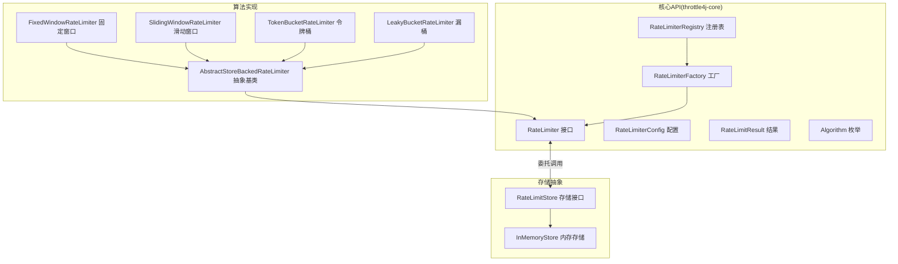
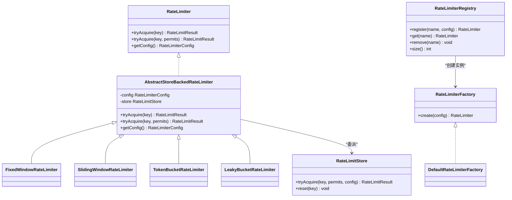
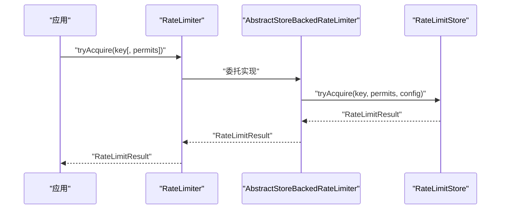
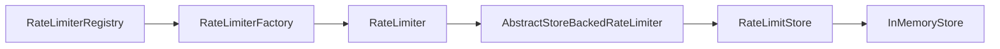

# 核心概念

<cite>
**本文引用的文件**
- [RateLimiter.java](file://throttle4j-core/src/main/java/com/throttle4j/core/RateLimiter.java)
- [RateLimitResult.java](file://throttle4j-core/src/main/java/com/throttle4j/core/RateLimitResult.java)
- [RateLimiterConfig.java](file://throttle4j-core/src/main/java/com/throttle4j/core/RateLimiterConfig.java)
- [Algorithm.java](file://throttle4j-core/src/main/java/com/throttle4j/core/Algorithm.java)
- [AbstractStoreBackedRateLimiter.java](file://throttle4j-core/src/main/java/com/throttle4j/algorithm/AbstractStoreBackedRateLimiter.java)
- [FixedWindowRateLimiter.java](file://throttle4j-core/src/main/java/com/throttle4j/algorithm/FixedWindowRateLimiter.java)
- [SlidingWindowRateLimiter.java](file://throttle4j-core/src/main/java/com/throttle4j/algorithm/SlidingWindowRateLimiter.java)
- [TokenBucketRateLimiter.java](file://throttle4j-core/src/main/java/com/throttle4j/algorithm/TokenBucketRateLimiter.java)
- [LeakyBucketRateLimiter.java](file://throttle4j-core/src/main/java/com/throttle4j/algorithm/LeakyBucketRateLimiter.java)
- [RateLimitStore.java](file://throttle4j-core/src/main/java/com/throttle4j/store/RateLimitStore.java)
- [DefaultRateLimiterFactory.java](file://throttle4j-core/src/main/java/com/throttle4j/algorithm/DefaultRateLimiterFactory.java)
- [RateLimiterFactory.java](file://throttle4j-core/src/main/java/com/throttle4j/core/RateLimiterFactory.java)
- [RateLimiterRegistry.java](file://throttle4j-core/src/main/java/com/throttle4j/core/RateLimiterRegistry.java)
- [InMemoryStore.java](file://throttle4j-core/src/main/java/com/throttle4j/store/InMemoryStore.java)
- [BasicUsageExample.java](file://throttle4j-examples/src/main/java/com/throttle4j/example/BasicUsageExample.java)
- [RateLimitResultTest.java](file://throttle4j-core/src/test/java/com/throttle4j/core/RateLimitResultTest.java)
- [RateLimiterConfigTest.java](file://throttle4j-core/src/test/java/com/throttle4j/core/RateLimiterConfigTest.java)
</cite>

## 目录
1. [引言](#引言)
2. [项目结构](#项目结构)
3. [核心组件](#核心组件)
4. [架构总览](#架构总览)
5. [详细组件分析](#详细组件分析)
6. [依赖分析](#依赖分析)
7. [性能考量](#性能考量)
8. [故障排查指南](#故障排查指南)
9. [结论](#结论)
10. [附录：算法选择指南与示例路径](#附录算法选择指南与示例路径)

## 引言
本章节面向希望系统掌握 throttle4j 限流核心概念的读者，围绕以下目标展开：  
- 深入解释固定窗口、滑动窗口、令牌桶、漏桶四种限流算法的工作机制与适用场景；  
- 详解 RateLimiter 接口设计、tryAcquire()/acquire() 的行为差异（本节聚焦可获取的 API 行为）；  
- 阐述 RateLimitResult 数据结构及字段语义（允许/拒绝、剩余配额、重置时间、建议重试间隔）；  
- 解释 RateLimiterConfig 的配置项与参数约束；  
- 提供算法选型指南与可直接参考的示例路径。

## 项目结构
throttle4j 将“算法实现”“存储抽象”“工厂与注册表”“示例与测试”分层组织，核心 API 位于 throttle4j-core 模块，算法实现位于 algorithm 包，存储抽象位于 store 包，工厂与注册表位于 core 包。示例与测试分别在 throttle4j-examples 与各模块的 test 目录中。

图示来源
- [RateLimiter.java:1-32](file://throttle4j-core/src/main/java/com/throttle4j/core/RateLimiter.java#L1-L32)
- [RateLimiterConfig.java:1-113](file://throttle4j-core/src/main/java/com/throttle4j/core/RateLimiterConfig.java#L1-L113)
- [RateLimitResult.java:1-68](file://throttle4j-core/src/main/java/com/throttle4j/core/RateLimitResult.java#L1-L68)
- [Algorithm.java:1-16](file://throttle4j-core/src/main/java/com/throttle4j/core/Algorithm.java#L1-L16)
- [AbstractStoreBackedRateLimiter.java:1-42](file://throttle4j-core/src/main/java/com/throttle4j/algorithm/AbstractStoreBackedRateLimiter.java#L1-L42)
- [FixedWindowRateLimiter.java:1-18](file://throttle4j-core/src/main/java/com/throttle4j/algorithm/FixedWindowRateLimiter.java#L1-L18)
- [SlidingWindowRateLimiter.java:1-16](file://throttle4j-core/src/main/java/com/throttle4j/algorithm/SlidingWindowRateLimiter.java#L1-L16)
- [TokenBucketRateLimiter.java:1-16](file://throttle4j-core/src/main/java/com/throttle4j/algorithm/TokenBucketRateLimiter.java#L1-L16)
- [LeakyBucketRateLimiter.java:1-16](file://throttle4j-core/src/main/java/com/throttle4j/algorithm/LeakyBucketRateLimiter.java#L1-L16)
- [RateLimitStore.java:1-35](file://throttle4j-core/src/main/java/com/throttle4j/store/RateLimitStore.java#L1-L35)
- [InMemoryStore.java](file://throttle4j-core/src/main/java/com/throttle4j/store/InMemoryStore.java)

章节来源
- [RateLimiter.java:1-32](file://throttle4j-core/src/main/java/com/throttle4j/core/RateLimiter.java#L1-L32)
- [RateLimitStore.java:1-35](file://throttle4j-core/src/main/java/com/throttle4j/store/RateLimitStore.java#L1-L35)

## 核心组件
- RateLimiter 接口：定义对外统一的限流能力，提供 tryAcquire(key) 与 tryAcquire(key, permits) 两个方法，返回 RateLimitResult；同时暴露 getConfig() 获取配置。
- RateLimitResult：封装一次尝试的结果，包含是否允许、当前窗口剩余配额、窗口重置时间戳、建议重试间隔（毫秒）。
- RateLimiterConfig：不可变配置对象，通过 Builder 构建，支持算法类型、限值、窗口时长、令牌桶补给速率等参数，并在 build() 中进行参数校验。
- Algorithm 枚举：定义支持的算法集合（固定窗口、滑动窗口、令牌桶、漏桶）。
- RateLimitStore：存储抽象，负责状态管理与算法逻辑执行，RateLimiter 仅委托调用。
- AbstractStoreBackedRateLimiter：通用抽象基类，实现 tryAcquire(key) 与 tryAcquire(key, permits)，并将具体逻辑委派给存储实现。
- DefaultRateLimiterFactory/RateLimiterFactory：工厂接口与默认实现，用于按配置创建具体的 RateLimiter 实例。
- RateLimiterRegistry：线程安全的命名限流器注册表，支持按名称注册、获取与移除。

章节来源
- [RateLimiter.java:1-32](file://throttle4j-core/src/main/java/com/throttle4j/core/RateLimiter.java#L1-L32)
- [RateLimitResult.java:1-68](file://throttle4j-core/src/main/java/com/throttle4j/core/RateLimitResult.java#L1-L68)
- [RateLimiterConfig.java:1-113](file://throttle4j-core/src/main/java/com/throttle4j/core/RateLimiterConfig.java#L1-L113)
- [Algorithm.java:1-16](file://throttle4j-core/src/main/java/com/throttle4j/core/Algorithm.java#L1-L16)
- [RateLimitStore.java:1-35](file://throttle4j-core/src/main/java/com/throttle4j/store/RateLimitStore.java#L1-L35)
- [AbstractStoreBackedRateLimiter.java:1-42](file://throttle4j-core/src/main/java/com/throttle4j/algorithm/AbstractStoreBackedRateLimiter.java#L1-L42)
- [RateLimiterFactory.java:1-16](file://throttle4j-core/src/main/java/com/throttle4j/core/RateLimiterFactory.java#L1-L16)
- [DefaultRateLimiterFactory.java](file://throttle4j-core/src/main/java/com/throttle4j/algorithm/DefaultRateLimiterFactory.java)

## 架构总览
throttle4j 的核心思想是“接口统一 + 存储解耦 + 算法可插拔”。RateLimiter 作为门面，不直接持有状态；所有状态与算法细节由 RateLimitStore 及其具体实现承担。不同算法通过继承抽象基类并复用统一的委托流程，达到一致的 API 体验。

图示来源
- [RateLimiter.java:1-32](file://throttle4j-core/src/main/java/com/throttle4j/core/RateLimiter.java#L1-L32)
- [AbstractStoreBackedRateLimiter.java:1-42](file://throttle4j-core/src/main/java/com/throttle4j/algorithm/AbstractStoreBackedRateLimiter.java#L1-L42)
- [FixedWindowRateLimiter.java:1-18](file://throttle4j-core/src/main/java/com/throttle4j/algorithm/FixedWindowRateLimiter.java#L1-L18)
- [SlidingWindowRateLimiter.java:1-16](file://throttle4j-core/src/main/java/com/throttle4j/algorithm/SlidingWindowRateLimiter.java#L1-L16)
- [TokenBucketRateLimiter.java:1-16](file://throttle4j-core/src/main/java/com/throttle4j/algorithm/TokenBucketRateLimiter.java#L1-L16)
- [LeakyBucketRateLimiter.java:1-16](file://throttle4j-core/src/main/java/com/throttle4j/algorithm/LeakyBucketRateLimiter.java#L1-L16)
- [RateLimitStore.java:1-35](file://throttle4j-core/src/main/java/com/throttle4j/store/RateLimitStore.java#L1-L35)
- [RateLimiterFactory.java:1-16](file://throttle4j-core/src/main/java/com/throttle4j/core/RateLimiterFactory.java#L1-L16)
- [DefaultRateLimiterFactory.java](file://throttle4j-core/src/main/java/com/throttle4j/algorithm/DefaultRateLimiterFactory.java)
- [RateLimiterRegistry.java:1-61](file://throttle4j-core/src/main/java/com/throttle4j/core/RateLimiterRegistry.java#L1-L61)

## 详细组件分析

### RateLimiter 接口与方法行为
- 设计理念：统一对外 API，屏蔽内部算法与存储细节；要求实现线程安全。
- 关键方法：
  - tryAcquire(key)：尝试获取 1 个配额。
  - tryAcquire(key, permits)：尝试获取指定数量配额，必须 permits ≥ 1。
  - getConfig()：返回当前限流器绑定的不可变配置。
- 行为差异（基于现有 API）：仓库未提供阻塞式 acquire() 方法，仅提供非阻塞的 tryAcquire()。若需阻塞等待，可在上层循环调用 tryAcquire() 并结合 RateLimitResult.retryAfterMillis 进行退避。

章节来源
- [RateLimiter.java:1-32](file://throttle4j-core/src/main/java/com/throttle4j/core/RateLimiter.java#L1-L32)
- [AbstractStoreBackedRateLimiter.java:24-40](file://throttle4j-core/src/main/java/com/throttle4j/algorithm/AbstractStoreBackedRateLimiter.java#L24-L40)

### RateLimitResult 数据结构与语义
- 字段含义：
  - allowed：请求是否被允许。
  - remaining：当前窗口内剩余可用配额。
  - resetAt：当前窗口的重置时间戳（毫秒）。
  - retryAfterMillis：建议客户端在多长时间后重试（毫秒）。当允许时应为 0。
- 工厂方法：
  - allowed(remaining, resetAt)：构造允许结果。
  - rejected(remaining, resetAt, retryAfterMillis)：构造拒绝结果。
- 值域约束：内部对负值进行钳制，确保 remaining 与 retryAfterMillis 不小于 0。

章节来源
- [RateLimitResult.java:1-68](file://throttle4j-core/src/main/java/com/throttle4j/core/RateLimitResult.java#L1-L68)
- [RateLimitResultTest.java:1-33](file://throttle4j-core/src/test/java/com/throttle4j/core/RateLimitResultTest.java#L1-L33)

### RateLimiterConfig 配置与参数
- 支持参数：
  - algorithm：算法枚举（固定窗口、滑动窗口、令牌桶、漏桶）。
  - limit：单窗口内的最大配额数（必须 > 0）。
  - windowMillis：窗口时长（毫秒），令牌桶算法可缺省，默认 1 秒用于重置时间报告。
  - refillRate：令牌桶补给速率（tokens/second），令牌桶专用且必须 > 0。
- 校验规则：
  - 必须设置 algorithm；
  - limit 必须 > 0；
  - 对于非令牌桶算法，windowMillis 必须 > 0；
  - 令牌桶算法必须设置 refillRate，windowMillis 缺省时会赋予默认值。
- 使用建议：优先使用 windowSeconds(seconds) 或 windowMillis(millis) 统一时区；令牌桶补给速率以“每秒令牌数”表达。

章节来源
- [RateLimiterConfig.java:1-113](file://throttle4j-core/src/main/java/com/throttle4j/core/RateLimiterConfig.java#L1-L113)
- [RateLimiterConfigTest.java:1-63](file://throttle4j-core/src/test/java/com/throttle4j/core/RateLimiterConfigTest.java#L1-L63)

### 算法工作原理与数学模型（概念性说明）
- 固定窗口（Fixed Window）
  - 思想：将时间划分为离散窗口，每个窗口独立计数，窗口结束时计数清零。
  - 特点：边界处存在突发（窗口末尾与下个窗口初的瞬时叠加）。
  - 适用：对边界平滑无强需求、实现简单的场景。
- 滑动窗口（Sliding Window）
  - 思想：在固定窗口基础上，将窗口细分为若干子槽，通过近似统计实现更平滑的速率控制。
  - 特点：相比固定窗口更平滑，但实现复杂度更高。
  - 适用：需要更精细速率控制的场景。
- 令牌桶（Token Bucket）
  - 思想：以恒定速率向桶中添加令牌，请求消耗相应令牌；若无足够令牌则拒绝或等待。
  - 数学模型：令牌补充遵循线性增长；允许突发取决于桶容量（limit），稳定速率由 refillRate 控制。
  - 适用：需要应对短时突发、同时保持长期平均速率稳定的场景。
- 漏桶（Leaky Bucket）
  - 思想：以恒定速率从桶中漏出请求，桶容量限制峰值；超出容量的请求被丢弃。
  - 数学模型：输出速率恒定，输入可变，形成削峰填谷的效果。
  - 适用：需要严格平滑输出速率、抑制突发的场景。

（本小节为概念性说明，不直接分析具体源码文件）

### RateLimiter 与存储委派流程
下图展示调用链：应用调用 RateLimiter.tryAcquire → 抽象基类委派到存储 → 存储实现执行算法逻辑并返回结果。

图示来源
- [AbstractStoreBackedRateLimiter.java:24-40](file://throttle4j-core/src/main/java/com/throttle4j/algorithm/AbstractStoreBackedRateLimiter.java#L24-L40)
- [RateLimitStore.java:17-26](file://throttle4j-core/src/main/java/com/throttle4j/store/RateLimitStore.java#L17-L26)

### RateLimiterRegistry 与工厂
- 注册表：按名称注册限流器，相同名称首次写入生效（first-write-wins），并发安全。
- 工厂：根据配置创建具体限流器实例；默认工厂使用内存存储。

章节来源
- [RateLimiterRegistry.java:1-61](file://throttle4j-core/src/main/java/com/throttle4j/core/RateLimiterRegistry.java#L1-L61)
- [RateLimiterFactory.java:1-16](file://throttle4j-core/src/main/java/com/throttle4j/core/RateLimiterFactory.java#L1-L16)
- [DefaultRateLimiterFactory.java](file://throttle4j-core/src/main/java/com/throttle4j/algorithm/DefaultRateLimiterFactory.java)

## 依赖分析
- 耦合关系：
  - RateLimiter 与 RateLimitStore 通过委派解耦，算法实现仅依赖抽象接口。
  - AbstractStoreBackedRateLimiter 统一了 tryAcquire 的入口与参数校验。
  - RateLimiterRegistry 依赖工厂接口，便于替换不同实现。
- 外部依赖：
  - 示例与测试展示了 InMemoryStore 的使用；Redis 扩展在其他模块中提供持久化与原子脚本能力。

图示来源
- [RateLimiter.java:1-32](file://throttle4j-core/src/main/java/com/throttle4j/core/RateLimiter.java#L1-L32)
- [AbstractStoreBackedRateLimiter.java:1-42](file://throttle4j-core/src/main/java/com/throttle4j/algorithm/AbstractStoreBackedRateLimiter.java#L1-L42)
- [RateLimitStore.java:1-35](file://throttle4j-core/src/main/java/com/throttle4j/store/RateLimitStore.java#L1-L35)
- [RateLimiterRegistry.java:1-61](file://throttle4j-core/src/main/java/com/throttle4j/core/RateLimiterRegistry.java#L1-L61)
- [RateLimiterFactory.java:1-16](file://throttle4j-core/src/main/java/com/throttle4j/core/RateLimiterFactory.java#L1-L16)
- [InMemoryStore.java](file://throttle4j-core/src/main/java/com/throttle4j/store/InMemoryStore.java)

## 性能考量
- 线程安全：接口与工厂、注册表均标注线程安全要求，算法与存储实现也需保证线程安全。
- 时间复杂度：算法实现的复杂度取决于具体策略（如滑动窗口细分槽位、令牌桶惰性计算等），但对外 API 为 O(1) 状态查询与更新。
- 存储选择：内存存储适合单机场景；分布式场景可采用 Redis 存储以实现跨节点一致性与原子操作。

（本节为通用指导，不直接分析具体文件）

## 故障排查指南
- 参数校验失败：
  - 缺少算法类型、limit ≤ 0、非令牌桶算法 windowMillis ≤ 0、令牌桶未设置 refillRate。
- 结果解读：
  - allowed=false 时，结合 remaining 与 retryAfterMillis 判断是否需要退避或提示用户。
  - 允许时 retryAfterMillis 应为 0。
- 常见问题定位：
  - 窗口重置后仍被拒绝：确认 resetAt 与当前时间的关系，以及是否正确使用了 windowMillis。
  - 令牌桶未恢复：确认 refillRate 设置与时间流逝是否触发惰性补给。

章节来源
- [RateLimiterConfig.java:91-110](file://throttle4j-core/src/main/java/com/throttle4j/core/RateLimiterConfig.java#L91-L110)
- [RateLimitResult.java:21-26](file://throttle4j-core/src/main/java/com/throttle4j/core/RateLimitResult.java#L21-L26)
- [RateLimitResultTest.java:1-33](file://throttle4j-core/src/test/java/com/throttle4j/core/RateLimitResultTest.java#L1-L33)

## 结论
throttle4j 通过清晰的接口分层与可插拔的算法实现，提供了统一而强大的限流能力。开发者只需关注配置与结果语义，即可在多种算法间灵活切换。配合注册表与工厂，可快速构建可维护的限流体系。

## 附录：算法选择指南与示例路径
- 算法选择指南（基于仓库提供的实现特性与常见需求）：
  - 需要简单边界、实现成本低：固定窗口。
  - 需要更平滑的速率曲线：滑动窗口。
  - 需要应对短时突发并保持长期平均速率：令牌桶。
  - 需要严格平滑输出速率、抑制突发：漏桶。
- 示例与参考路径：
  - 基础用法示例（含令牌桶与固定窗口演示）：[BasicUsageExample.java:1-101](file://throttle4j-examples/src/main/java/com/throttle4j/example/BasicUsageExample.java#L1-L101)
  - 配置构建与校验（含令牌桶 refillRate 与窗口时长）：[RateLimiterConfigTest.java:1-63](file://throttle4j-core/src/test/java/com/throttle4j/core/RateLimiterConfigTest.java#L1-L63)
  - 结果工厂方法与字段语义验证：[RateLimitResultTest.java:1-33](file://throttle4j-core/src/test/java/com/throttle4j/core/RateLimitResultTest.java#L1-L33)
  - 算法实现入口（继承抽象基类）：  
    - [FixedWindowRateLimiter.java:1-18](file://throttle4j-core/src/main/java/com/throttle4j/algorithm/FixedWindowRateLimiter.java#L1-L18)  
    - [SlidingWindowRateLimiter.java:1-16](file://throttle4j-core/src/main/java/com/throttle4j/algorithm/SlidingWindowRateLimiter.java#L1-L16)  
    - [TokenBucketRateLimiter.java:1-16](file://throttle4j-core/src/main/java/com/throttle4j/algorithm/TokenBucketRateLimiter.java#L1-L16)  
    - [LeakyBucketRateLimiter.java:1-16](file://throttle4j-core/src/main/java/com/throttle4j/algorithm/LeakyBucketRateLimiter.java#L1-L16)