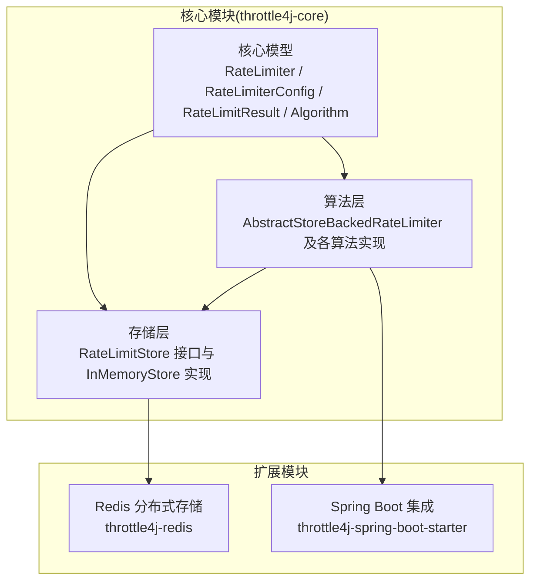
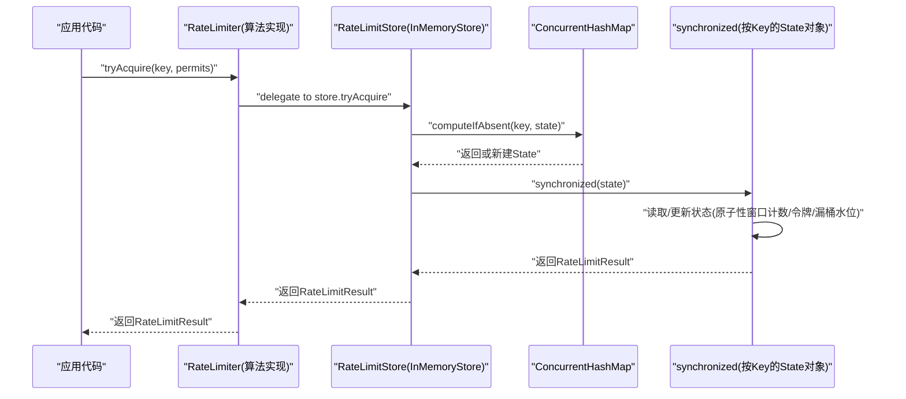
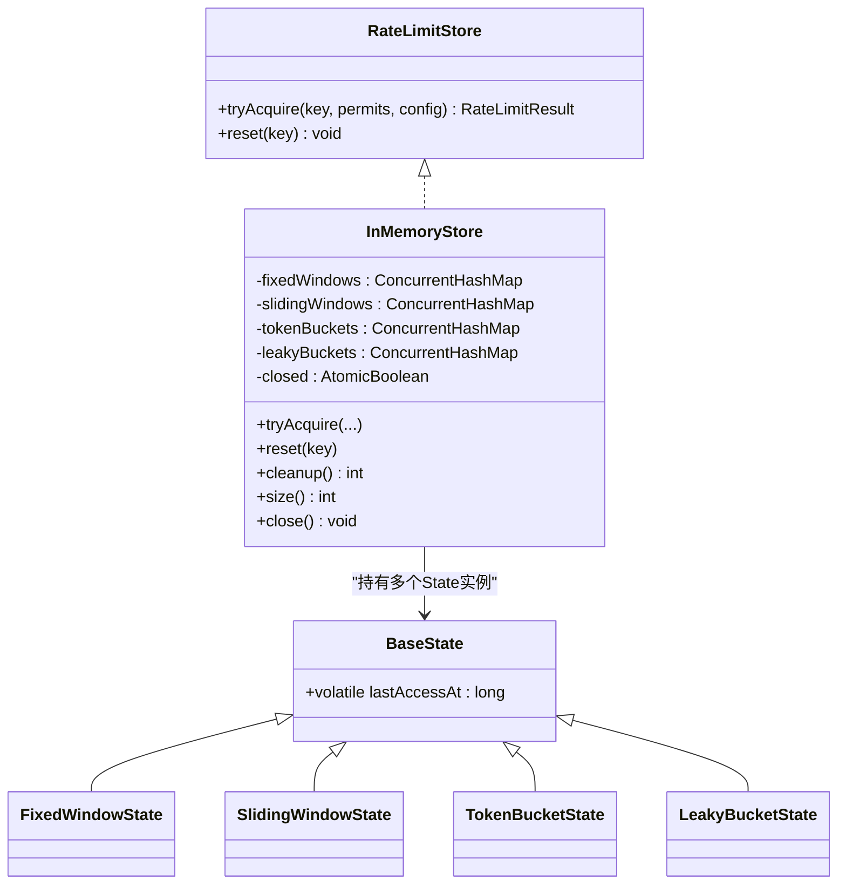
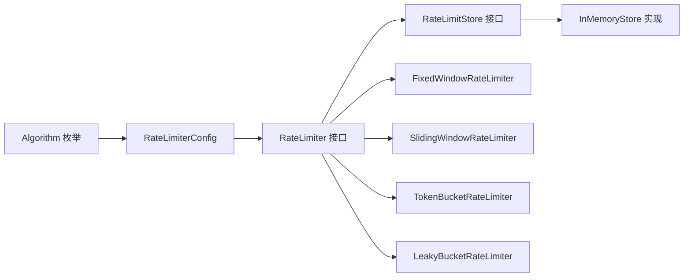

# 线程安全与并发控制

<cite>
**本文引用的文件**
- [AbstractStoreBackedRateLimiter.java](file://throttle4j-core/src/main/java/com/throttle4j/algorithm/AbstractStoreBackedRateLimiter.java)
- [InMemoryStore.java](file://throttle4j-core/src/main/java/com/throttle4j/store/InMemoryStore.java)
- [RateLimiter.java](file://throttle4j-core/src/main/java/com/throttle4j/core/RateLimiter.java)
- [RateLimitStore.java](file://throttle4j-core/src/main/java/com/throttle4j/store/RateLimitStore.java)
- [RateLimiterConfig.java](file://throttle4j-core/src/main/java/com/throttle4j/core/RateLimiterConfig.java)
- [RateLimitResult.java](file://throttle4j-core/src/main/java/com/throttle4j/core/RateLimitResult.java)
- [FixedWindowRateLimiter.java](file://throttle4j-core/src/main/java/com/throttle4j/algorithm/FixedWindowRateLimiter.java)
- [SlidingWindowRateLimiter.java](file://throttle4j-core/src/main/java/com/throttle4j/algorithm/SlidingWindowRateLimiter.java)
- [TokenBucketRateLimiter.java](file://throttle4j-core/src/main/java/com/throttle4j/algorithm/TokenBucketRateLimiter.java)
- [LeakyBucketRateLimiter.java](file://throttle4j-core/src/main/java/com/throttle4j/algorithm/LeakyBucketRateLimiter.java)
- [InMemoryStoreTest.java](file://throttle4j-core/src/test/java/com/throttle4j/store/InMemoryStoreTest.java)
- [FixedWindowRateLimiterTest.java](file://throttle4j-core/src/test/java/com/throttle4j/algorithm/FixedWindowRateLimiterTest.java)
- [RateLimitAspectTest.java](file://throttle4j-spring-boot-starter/src/test/java/com/throttle4j/spring/aop/RateLimitAspectTest.java)
- [Algorithm.java](file://throttle4j-core/src/main/java/com/throttle4j/core/Algorithm.java)
- [README.md](file://README.md)
</cite>

## 目录
1. [引言](#引言)
2. [项目结构](#项目结构)
3. [核心组件](#核心组件)
4. [架构总览](#架构总览)
5. [详细组件分析](#详细组件分析)
6. [依赖分析](#依赖分析)
7. [性能考量](#性能考量)
8. [故障排查指南](#故障排查指南)
9. [结论](#结论)
10. [附录](#附录)

## 引言
本文件聚焦于throttle4j在高并发场景下的线程安全与并发控制机制，系统阐述以下要点：
- 限流器在高并发下的线程安全保障：原子操作、锁策略选择、内存可见性保证
- AbstractStoreBackedRateLimiter如何确保并发环境下的正确性与一致性
- 内存存储的线程安全实现与性能优化策略
- 并发场景下的使用建议与性能调优指南
- 并发测试案例与性能基准测试结果（基于仓库现有测试）

## 项目结构
throttle4j采用模块化设计，核心能力集中在throttle4j-core中，提供算法、配置、内存存储与公共接口；throttle4j-redis提供分布式存储；throttle4j-spring-boot-starter提供声明式集成。



图表来源
- [README.md:76-101](file://README.md#L76-L101)

章节来源
- [README.md:14-23](file://README.md#L14-L23)
- [README.md:96-101](file://README.md#L96-L101)

## 核心组件
- RateLimiter接口：定义线程安全的tryAcquire契约，要求实现类具备线程安全性
- RateLimitStore接口：定义线程安全的存储抽象，负责算法逻辑与状态管理
- InMemoryStore：基于ConcurrentHashMap与细粒度synchronized锁的内存存储实现
- AbstractStoreBackedRateLimiter：委托模式的抽象基类，将状态管理委托给存储层
- 各算法实现：FixedWindow、SlidingWindow、TokenBucket、LeakyBucket均继承自该基类

章节来源
- [RateLimiter.java:6-7](file://throttle4j-core/src/main/java/com/throttle4j/core/RateLimiter.java#L6-L7)
- [RateLimitStore.java:13-13](file://throttle4j-core/src/main/java/com/throttle4j/store/RateLimitStore.java#L13-L13)
- [InMemoryStore.java:17-24](file://throttle4j-core/src/main/java/com/throttle4j/store/InMemoryStore.java#L17-L24)
- [AbstractStoreBackedRateLimiter.java:10-14](file://throttle4j-core/src/main/java/com/throttle4j/algorithm/AbstractStoreBackedRateLimiter.java#L10-L14)
- [FixedWindowRateLimiter.java:12-16](file://throttle4j-core/src/main/java/com/throttle4j/algorithm/FixedWindowRateLimiter.java#L12-L16)
- [SlidingWindowRateLimiter.java:10-14](file://throttle4j-core/src/main/java/com/throttle4j/algorithm/SlidingWindowRateLimiter.java#L10-L14)
- [TokenBucketRateLimiter.java:10-14](file://throttle4j-core/src/main/java/com/throttle4j/algorithm/TokenBucketRateLimiter.java#L10-L14)
- [LeakyBucketRateLimiter.java:10-14](file://throttle4j-core/src/main/java/com/throttle4j/algorithm/LeakyBucketRateLimiter.java#L10-L14)

## 架构总览
下图展示从应用到存储的调用链路与并发控制点：



图表来源
- [AbstractStoreBackedRateLimiter.java:24-35](file://throttle4j-core/src/main/java/com/throttle4j/algorithm/AbstractStoreBackedRateLimiter.java#L24-L35)
- [InMemoryStore.java:68-93](file://throttle4j-core/src/main/java/com/throttle4j/store/InMemoryStore.java#L68-L93)
- [InMemoryStore.java:150-170](file://throttle4j-core/src/main/java/com/throttle4j/store/InMemoryStore.java#L150-L170)

## 详细组件分析

### AbstractStoreBackedRateLimiter：并发正确性的基础
- 设计思想：通过委托模式将状态管理交给存储层，算法实现仅负责参数校验与转发，避免在算法类内引入复杂并发控制
- 关键点：
  - 参数校验前置：拒绝非法permits数量
  - 委托执行：直接调用store.tryAcquire，将并发控制下沉至存储实现
  - 配置不可变：构造时进行非空检查，保持配置不可变性，降低并发副作用

章节来源
- [AbstractStoreBackedRateLimiter.java:19-22](file://throttle4j-core/src/main/java/com/throttle4j/algorithm/AbstractStoreBackedRateLimiter.java#L19-L22)
- [AbstractStoreBackedRateLimiter.java:30-35](file://throttle4j-core/src/main/java/com/throttle4j/algorithm/AbstractStoreBackedRateLimiter.java#L30-L35)

### InMemoryStore：内存存储的线程安全与性能优化
- 并发模型
  - 细粒度锁：每个key对应一个State对象，使用synchronized(state)对关键路径加锁，避免全局锁竞争
  - 无锁容器：使用ConcurrentHashMap作为多key容器，支持高并发下的键空间操作
  - 原子关闭：AtomicBoolean配合compareAndSet保证关闭动作的幂等与可见性
- 状态隔离
  - BaseState与各算法State类（FixedWindowState、SlidingWindowState、TokenBucketState、LeakyBucketState）均以实例为单位隔离状态，不同key互不干扰
  - lastAccessAt使用volatile确保跨线程可见，用于空闲清理
- 清理策略
  - 单线程定时任务定期扫描并移除超过idle阈值的空闲键，减少内存占用
  - 手动触发cleanup便于测试与运维场景



图表来源
- [RateLimitStore.java:15-34](file://throttle4j-core/src/main/java/com/throttle4j/store/RateLimitStore.java#L15-L34)
- [InMemoryStore.java:24-66](file://throttle4j-core/src/main/java/com/throttle4j/store/InMemoryStore.java#L24-L66)
- [InMemoryStore.java:267-313](file://throttle4j-core/src/main/java/com/throttle4j/store/InMemoryStore.java#L267-L313)

章节来源
- [InMemoryStore.java:33-36](file://throttle4j-core/src/main/java/com/throttle4j/store/InMemoryStore.java#L33-L36)
- [InMemoryStore.java:40](file://throttle4j-core/src/main/java/com/throttle4j/store/InMemoryStore.java#L40)
- [InMemoryStore.java:109-133](file://throttle4j-core/src/main/java/com/throttle4j/store/InMemoryStore.java#L109-L133)
- [InMemoryStore.java:267-269](file://throttle4j-core/src/main/java/com/throttle4j/store/InMemoryStore.java#L267-L269)

### 固定窗口算法（FixedWindow）并发流程
固定窗口在每次请求时：
- 使用computeIfAbsent按key获取或创建状态
- 对状态对象加锁，判断是否跨窗重置
- 更新计数与最后访问时间
- 计算剩余配额与重置时间

```mermaid
flowchart TD
Start(["进入 tryAcquire"]) --> CheckClosed["检查store是否已关闭"]
CheckClosed --> |是| ThrowErr["抛出异常"]
CheckClosed --> |否| GetState["按key获取或创建FixedWindowState"]
GetState --> Lock["synchronized(state) 进入临界区"]
Lock --> CheckWin["判断是否跨窗"]
CheckWin --> |是| Reset["重置windowStart与count"]
CheckWin --> |否| Keep["保持当前窗口"]
Reset --> Update["更新lastAccessAt"]
Keep --> Update
Update --> Over?"count+permits > limit ?"
Over --> |是| Reject["返回rejected(remaining, resetAt, retryAfter)"]
Over --> |否| Allow["返回allowed(remaining, resetAt)"]
Reject --> End(["退出"])
Allow --> End
```

图表来源
- [InMemoryStore.java:68-93](file://throttle4j-core/src/main/java/com/throttle4j/store/InMemoryStore.java#L68-L93)
- [InMemoryStore.java:150-170](file://throttle4j-core/src/main/java/com/throttle4j/store/InMemoryStore.java#L150-L170)

章节来源
- [InMemoryStore.java:150-170](file://throttle4j-core/src/main/java/com/throttle4j/store/InMemoryStore.java#L150-L170)

### 滑动窗口算法（SlidingWindow）并发流程
滑动窗口通过分槽近似实现平滑限流：
- 计算当前槽位与有效槽集合，剔除过期槽
- 判断总请求数是否超限
- 更新当前槽计数

```mermaid
flowchart TD
Start(["进入 tryAcquire"]) --> GetState["按key获取或创建SlidingWindowState"]
GetState --> Lock["synchronized(state) 进入临界区"]
Lock --> CalcSlots["计算slotSize与currentSlotId"]
CalcSlots --> Evict["剔除过期槽并累计有效总数"]
Evict --> Over?"total+permits > limit ?"
Over --> |是| Reject["返回rejected(remaining, resetAt, retryAfter)"]
Over --> |否| Update["定位当前槽并初始化计数"]
Update --> Incr["计数累加"]
Incr --> Allow["返回allowed(...)"]
Reject --> End(["退出"])
Allow --> End
```

图表来源
- [InMemoryStore.java:172-212](file://throttle4j-core/src/main/java/com/throttle4j/store/InMemoryStore.java#L172-L212)

章节来源
- [InMemoryStore.java:172-212](file://throttle4j-core/src/main/java/com/throttle4j/store/InMemoryStore.java#L172-L212)

### 令牌桶算法（TokenBucket）并发流程
令牌桶采用“惰性补充”策略，在每次请求时根据经过时间补充令牌：
- 计算elapsedSec并补充tokens，上限为limit
- 若tokens足够则消费并返回允许
- 否则计算retryAfter并返回拒绝

```mermaid
flowchart TD
Start(["进入 tryAcquire"]) --> GetState["按key获取或创建TokenBucketState"]
GetState --> Lock["synchronized(state) 进入临界区"]
Lock --> Refill["elapsedSec*refillRate 补充tokens(<=limit)"]
Refill --> Enough?"tokens >= permits ?"
Enough --> |是| Consume["tokens-=permits"]
Consume --> Allow["返回allowed(tokens, resetAt)"]
Enough --> |否| Retry["计算retryAfter"]
Retry --> Reject["返回rejected(tokens, now+retryAfter, retryAfter)"]
Allow --> End(["退出"])
Reject --> End
```

图表来源
- [InMemoryStore.java:214-236](file://throttle4j-core/src/main/java/com/throttle4j/store/InMemoryStore.java#L214-L236)

章节来源
- [InMemoryStore.java:214-236](file://throttle4j-core/src/main/java/com/throttle4j/store/InMemoryStore.java#L214-L236)

### 漏桶算法（LeakyBucket）并发流程
漏桶以恒定速率漏水，维持稳定的出站速率：
- 计算elapsed并计算泄漏量，下限为0
- 若level+permits不超过limit则注入并返回允许
- 否则计算overflow与retryAfter并返回拒绝

```mermaid
flowchart TD
Start(["进入 tryAcquire"]) --> GetState["按key获取或创建LeakyBucketState"]
GetState --> Lock["synchronized(state) 进入临界区"]
Lock --> Leak["leaked=elapsed*leakPerMs; level=max(0, level-leaked)"]
Leak --> Enough?"level+permits <= limit ?"
Enough --> |是| Add["level+=permits"]
Add --> Allow["返回allowed(remaining, resetAfter)"]
Enough --> |否| Overflow["计算overflow与retryAfter"]
Overflow --> Reject["返回rejected(remaining, resetAt, retryAfter)"]
Allow --> End(["退出"])
Reject --> End
```

图表来源
- [InMemoryStore.java:238-263](file://throttle4j-core/src/main/java/com/throttle4j/store/InMemoryStore.java#L238-L263)

章节来源
- [InMemoryStore.java:238-263](file://throttle4j-core/src/main/java/com/throttle4j/store/InMemoryStore.java#L238-L263)

### 并发测试与基准测试
- 并发获取不超限：固定窗口在大量并发线程同时尝试获取共享key时，最终允许计数严格等于limit
- 清理与隔离：空闲键被清理、活跃键保留；不同key状态相互隔离
- Spring AOP集成：注解驱动的限流在服务方法上生效，支持降级回退

章节来源
- [FixedWindowRateLimiterTest.java:84-111](file://throttle4j-core/src/test/java/com/throttle4j/algorithm/FixedWindowRateLimiterTest.java#L84-L111)
- [InMemoryStoreTest.java:69-91](file://throttle4j-core/src/test/java/com/throttle4j/store/InMemoryStoreTest.java#L69-L91)
- [RateLimitAspectTest.java:41-70](file://throttle4j-spring-boot-starter/src/test/java/com/throttle4j/spring/aop/RateLimitAspectTest.java#L41-L70)

## 依赖分析
- 接口契约
  - RateLimiter与RateLimitStore均标注“线程安全”，要求实现满足并发一致性
- 组件耦合
  - 算法实现依赖存储接口，存储实现依赖算法枚举与配置模型
  - 存储实现内部通过ConcurrentHashMap与synchronized实现低耦合、高内聚的状态管理



图表来源
- [Algorithm.java:6-15](file://throttle4j-core/src/main/java/com/throttle4j/core/Algorithm.java#L6-L15)
- [RateLimiterConfig.java:10-20](file://throttle4j-core/src/main/java/com/throttle4j/core/RateLimiterConfig.java#L10-L20)
- [RateLimiter.java:8-31](file://throttle4j-core/src/main/java/com/throttle4j/core/RateLimiter.java#L8-L31)
- [RateLimitStore.java:15-34](file://throttle4j-core/src/main/java/com/throttle4j/store/RateLimitStore.java#L15-L34)
- [InMemoryStore.java:24-66](file://throttle4j-core/src/main/java/com/throttle4j/store/InMemoryStore.java#L24-L66)

章节来源
- [RateLimiter.java:6-7](file://throttle4j-core/src/main/java/com/throttle4j/core/RateLimiter.java#L6-L7)
- [RateLimitStore.java:13-13](file://throttle4j-core/src/main/java/com/throttle4j/store/RateLimitStore.java#L13-L13)

## 性能考量
- 锁粒度与吞吐
  - 采用按key的细粒度锁，显著降低热点key的锁争用，提升整体吞吐
  - ConcurrentHashMap提供高并发下的键空间操作性能
- 内存占用与清理
  - 定期清理空闲键，避免内存泄漏；可通过参数调整idle与清理间隔
- 算法选择
  - TokenBucket适合突发流量与平均速率控制
  - SlidingWindow在窗口内更公平，适合需要平滑配额的场景
  - LeakyBucket适合稳定出站压力的场景
  - FixedWindow最简单且吞吐最高，但边界处可能出现短时峰值

章节来源
- [README.md:105-112](file://README.md#L105-L112)
- [InMemoryStore.java:28-31](file://throttle4j-core/src/main/java/com/throttle4j/store/InMemoryStore.java#L28-L31)
- [InMemoryStore.java:64-65](file://throttle4j-core/src/main/java/com/throttle4j/store/InMemoryStore.java#L64-L65)

## 故障排查指南
- 关闭后仍尝试获取
  - 现象：抛出IllegalStateException
  - 处理：确保在关闭前完成所有资源释放，避免竞态
- 空闲键未清理
  - 现象：内存占用持续增长
  - 处理：确认idleMillis与cleanupInterval设置合理，必要时手动调用cleanup
- 不同key状态互相影响
  - 现象：reset未生效或状态错乱
  - 处理：确认使用正确的key；检查是否误用共享store实例

章节来源
- [InMemoryStoreTest.java:94-99](file://throttle4j-core/src/test/java/com/throttle4j/store/InMemoryStoreTest.java#L94-L99)
- [InMemoryStore.java:109-133](file://throttle4j-core/src/main/java/com/throttle4j/store/InMemoryStore.java#L109-L133)

## 结论
throttle4j通过“算法实现委托+存储并发控制”的架构设计，在保证线程安全的同时实现了良好的性能与可维护性。InMemoryStore采用细粒度锁与无锁容器相结合的方式，既降低了锁竞争，又确保了状态一致性。结合仓库中的并发测试，可以验证其在高并发场景下的正确性与稳定性。

## 附录
- 使用建议
  - 在单机场景优先使用InMemoryStore，注意合理设置idle与清理间隔
  - 在分布式场景使用throttle4j-redis模块，利用Lua脚本实现原子性
  - Spring Boot用户可通过@RateLimit注解快速集成
- 性能调优
  - 调整算法与配额以匹配业务特性
  - 控制线程池大小与并发度，避免过度竞争
  - 定期监控内存占用与清理效果