# 限流算法原理

<cite>
**本文引用的文件**
- [FixedWindowRateLimiter.java](file://throttle4j-core/src/main/java/com/throttle4j/algorithm/FixedWindowRateLimiter.java)
- [SlidingWindowRateLimiter.java](file://throttle4j-core/src/main/java/com/throttle4j/algorithm/SlidingWindowRateLimiter.java)
- [TokenBucketRateLimiter.java](file://throttle4j-core/src/main/java/com/throttle4j/algorithm/TokenBucketRateLimiter.java)
- [LeakyBucketRateLimiter.java](file://throttle4j-core/src/main/java/com/throttle4j/algorithm/LeakyBucketRateLimiter.java)
- [AbstractStoreBackedRateLimiter.java](file://throttle4j-core/src/main/java/com/throttle4j/algorithm/AbstractStoreBackedRateLimiter.java)
- [DefaultRateLimiterFactory.java](file://throttle4j-core/src/main/java/com/throttle4j/algorithm/DefaultRateLimiterFactory.java)
- [RateLimiter.java](file://throttle4j-core/src/main/java/com/throttle4j/core/RateLimiter.java)
- [Algorithm.java](file://throttle4j-core/src/main/java/com/throttle4j/core/Algorithm.java)
- [RateLimiterConfig.java](file://throttle4j-core/src/main/java/com/throttle4j/core/RateLimiterConfig.java)
- [RateLimitResult.java](file://throttle4j-core/src/main/java/com/throttle4j/core/RateLimitResult.java)
- [RateLimiterFactory.java](file://throttle4j-core/src/main/java/com/throttle4j/core/RateLimiterFactory.java)
- [RateLimiterRegistry.java](file://throttle4j-core/src/main/java/com/throttle4j/core/RateLimiterRegistry.java)
- [RateLimitStore.java](file://throttle4j-core/src/main/java/com/throttle4j/store/RateLimitStore.java)
- [InMemoryStore.java](file://throttle4j-core/src/main/java/com/throttle4j/store/InMemoryStore.java)
- [RedisRateLimitStore.java](file://throttle4j-redis/src/main/java/com/throttle4j/redis/RedisRateLimitStore.java)
</cite>

## 目录
1. [引言](#引言)
2. [项目结构](#项目结构)
3. [核心组件](#核心组件)
4. [架构总览](#架构总览)
5. [详细组件分析](#详细组件分析)
6. [依赖分析](#依赖分析)
7. [性能考量](#性能考量)
8. [故障排查指南](#故障排查指南)
9. [结论](#结论)
10. [附录](#附录)

## 引言
本文件围绕 throttle4j 的四种核心限流算法（固定窗口、滑动窗口、令牌桶、漏桶）进行系统化原理与实现解析，结合代码结构与数据流，帮助读者从“算法模型—实现细节—性能特征—选型建议”四个维度全面掌握限流设计。文档同时提供可视化图示、流程图与决策树，便于在真实业务中快速定位合适的限流策略。

## 项目结构
throttle4j 采用分层清晰的模块化组织：
- 核心层（core）：定义算法枚举、配置、结果、接口与注册表等抽象契约
- 算法层（algorithm）：按算法类型提供轻量包装器，委托状态管理到存储层
- 存储层（store）：提供内存与 Redis 两种实现，承载具体算法的状态与原子操作
- 示例与集成（examples、spring-boot-starter、redis 模块）：展示使用方式与分布式部署

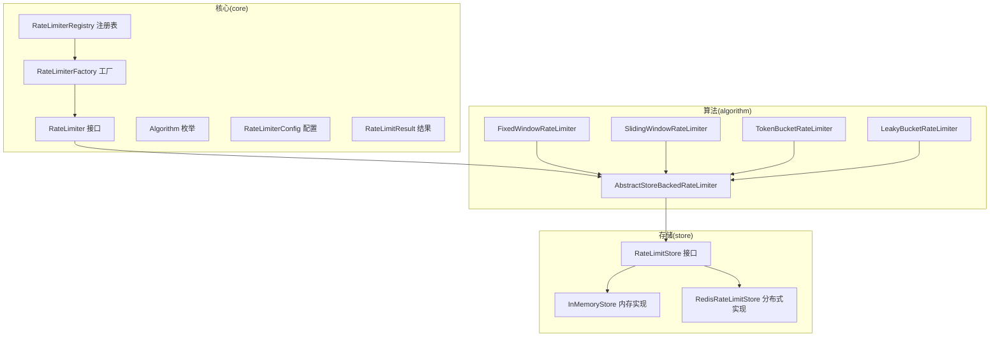

**图表来源**
- [RateLimiter.java:8-31](file://throttle4j-core/src/main/java/com/throttle4j/core/RateLimiter.java#L8-L31)
- [Algorithm.java:6-15](file://throttle4j-core/src/main/java/com/throttle4j/core/Algorithm.java#L6-L15)
- [RateLimiterConfig.java:8-50](file://throttle4j-core/src/main/java/com/throttle4j/core/RateLimiterConfig.java#L8-L50)
- [RateLimitResult.java:6-26](file://throttle4j-core/src/main/java/com/throttle4j/core/RateLimitResult.java#L6-L26)
- [RateLimiterFactory.java:6-15](file://throttle4j-core/src/main/java/com/throttle4j/core/RateLimiterFactory.java#L6-L15)
- [RateLimiterRegistry.java:14-43](file://throttle4j-core/src/main/java/com/throttle4j/core/RateLimiterRegistry.java#L14-L43)
- [AbstractStoreBackedRateLimiter.java:14-41](file://throttle4j-core/src/main/java/com/throttle4j/algorithm/AbstractStoreBackedRateLimiter.java#L14-L41)
- [FixedWindowRateLimiter.java:12-17](file://throttle4j-core/src/main/java/com/throttle4j/algorithm/FixedWindowRateLimiter.java#L12-L17)
- [SlidingWindowRateLimiter.java:10-15](file://throttle4j-core/src/main/java/com/throttle4j/algorithm/SlidingWindowRateLimiter.java#L10-L15)
- [TokenBucketRateLimiter.java:10-15](file://throttle4j-core/src/main/java/com/throttle4j/algorithm/TokenBucketRateLimiter.java#L10-L15)
- [LeakyBucketRateLimiter.java:10-15](file://throttle4j-core/src/main/java/com/throttle4j/algorithm/LeakyBucketRateLimiter.java#L10-L15)
- [RateLimitStore.java:15-34](file://throttle4j-core/src/main/java/com/throttle4j/store/RateLimitStore.java#L15-L34)
- [InMemoryStore.java:24-93](file://throttle4j-core/src/main/java/com/throttle4j/store/InMemoryStore.java#L24-L93)
- [RedisRateLimitStore.java:40-110](file://throttle4j-redis/src/main/java/com/throttle4j/redis/RedisRateLimitStore.java#L40-L110)

**章节来源**
- [RateLimiter.java:8-31](file://throttle4j-core/src/main/java/com/throttle4j/core/RateLimiter.java#L8-L31)
- [Algorithm.java:6-15](file://throttle4j-core/src/main/java/com/throttle4j/core/Algorithm.java#L6-L15)
- [RateLimitStore.java:15-34](file://throttle4j-core/src/main/java/com/throttle4j/store/RateLimitStore.java#L15-L34)

## 核心组件
- 算法接口与枚举：定义统一的限流能力入口与算法类型集合
- 配置对象：封装算法、配额上限、时间窗、补充速率等参数，并在构建时做参数校验
- 结果对象：统一返回允许/拒绝、剩余配额、重置时间、重试等待等信息
- 存储接口与实现：负责状态持久化与原子控制；内存实现用于单机，Redis 实现用于分布式
- 工厂与注册表：按配置创建限流器实例，并提供命名注册与复用

**章节来源**
- [RateLimiterConfig.java:8-50](file://throttle4j-core/src/main/java/com/throttle4j/core/RateLimiterConfig.java#L8-L50)
- [RateLimitResult.java:6-26](file://throttle4j-core/src/main/java/com/throttle4j/core/RateLimitResult.java#L6-L26)
- [RateLimitStore.java:15-34](file://throttle4j-core/src/main/java/com/throttle4j/store/RateLimitStore.java#L15-L34)
- [InMemoryStore.java:24-93](file://throttle4j-core/src/main/java/com/throttle4j/store/InMemoryStore.java#L24-L93)
- [RedisRateLimitStore.java:40-110](file://throttle4j-redis/src/main/java/com/throttle4j/redis/RedisRateLimitStore.java#L40-L110)
- [RateLimiterFactory.java:6-15](file://throttle4j-core/src/main/java/com/throttle4j/core/RateLimiterFactory.java#L6-L15)
- [DefaultRateLimiterFactory.java:14-38](file://throttle4j-core/src/main/java/com/throttle4j/algorithm/DefaultRateLimiterFactory.java#L14-L38)
- [RateLimiterRegistry.java:14-43](file://throttle4j-core/src/main/java/com/throttle4j/core/RateLimiterRegistry.java#L14-L43)

## 架构总览
throttle4j 将“算法逻辑”与“状态存储”解耦：算法包装器仅负责参数校验与调用存储层；存储层负责具体的窗口/桶状态维护与原子判断。该设计使得同一套算法可在内存或 Redis 上一致运行，便于在单机与分布式场景间切换。

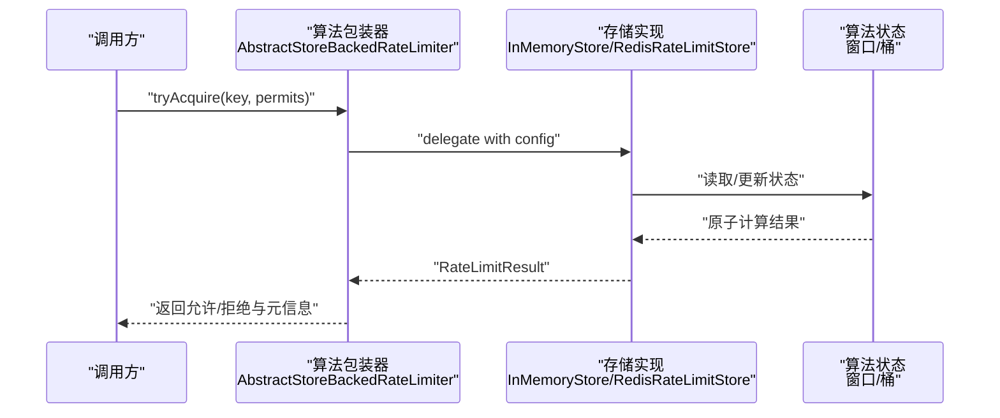

**图表来源**
- [AbstractStoreBackedRateLimiter.java:24-40](file://throttle4j-core/src/main/java/com/throttle4j/algorithm/AbstractStoreBackedRateLimiter.java#L24-L40)
- [InMemoryStore.java:68-93](file://throttle4j-core/src/main/java/com/throttle4j/store/InMemoryStore.java#L68-L93)
- [RedisRateLimitStore.java:80-110](file://throttle4j-redis/src/main/java/com/throttle4j/redis/RedisRateLimitStore.java#L80-L110)

## 详细组件分析

### 固定窗口算法（Fixed Window）
- 工作机制
  - 时间片以配置的毫秒级窗口为单位，窗口内累计计数
  - 跨窗口重置：当当前时间超出窗口起点+窗口长度时，计数清零并推进窗口起点
  - 允许条件：当前计数加上请求配额不超过上限
- 数学模型
  - 窗口起始时间戳：windowStart
  - 当前计数：count
  - 允许：count + permits ≤ limit
  - 重置时间：resetAt = windowStart + windowMillis
  - 剩余配额：remaining = limit - count
- 优缺点
  - 优点：实现简单、开销低
  - 缺点：边界处存在“双倍峰值”风险（窗口末尾与下个窗口开头可能同时高并发）
- 性能特征
  - 单线程同步块保护状态，避免竞争；内存实现无网络延迟
- 适用场景
  - 对边界尖峰不敏感的粗粒度限流，如日/小时级总量控制

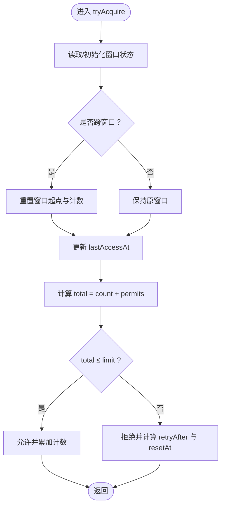

**图表来源**
- [InMemoryStore.java:150-170](file://throttle4j-core/src/main/java/com/throttle4j/store/InMemoryStore.java#L150-L170)

**章节来源**
- [FixedWindowRateLimiter.java:12-17](file://throttle4j-core/src/main/java/com/throttle4j/algorithm/FixedWindowRateLimiter.java#L12-L17)
- [InMemoryStore.java:150-170](file://throttle4j-core/src/main/java/com/throttle4j/store/InMemoryStore.java#L150-L170)

### 滑动窗口算法（Sliding Window）
- 工作机制
  - 将时间窗划分为固定数量的子槽（默认10），每个槽记录该时间段内的请求数
  - 计算有效期内的总请求数，超过上限则拒绝
  - 通过淘汰过期槽位维持窗口滑动
- 数学模型
  - 子槽大小：slotSize = max(1, windowMillis / SLOTS)
  - 当前槽索引：idx = currentSlotId % SLOTS
  - 有效期内总数：total = sum(counts[i] for i in valid range)
  - 允许：total + permits ≤ limit
  - 重置时间：resetAt = (currentSlotId + 1) * slotSize
- 优缺点
  - 优点：相比固定窗口更平滑，减少边界尖峰
  - 缺点：仍为近似模型，需要合理设置槽数量平衡精度与内存
- 性能特征
  - 使用数组与固定槽位，空间换时间；同步块保护状态
- 适用场景
  - 需要更精细控制的短期突发场景，如 API 秒级限流

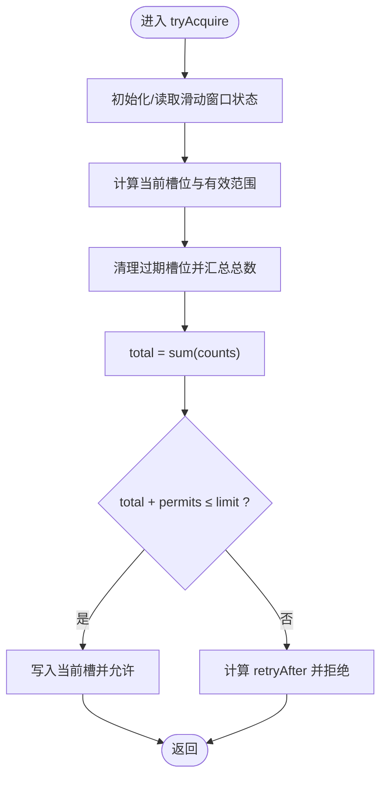

**图表来源**
- [InMemoryStore.java:172-212](file://throttle4j-core/src/main/java/com/throttle4j/store/InMemoryStore.java#L172-L212)

**章节来源**
- [SlidingWindowRateLimiter.java:10-15](file://throttle4j-core/src/main/java/com/throttle4j/algorithm/SlidingWindowRateLimiter.java#L10-L15)
- [InMemoryStore.java:172-212](file://throttle4j-core/src/main/java/com/throttle4j/store/InMemoryStore.java#L172-L212)

### 令牌桶算法（Token Bucket）
- 工作机制
  - 桶容量为 limit；按 refillRate（每秒令牌数）惰性补充
  - 每次请求消耗 permits 令牌；若桶内不足，则计算需要等待多久才能满足
  - 补充基于上次访问到现在的时间差进行线性累积，不依赖后台调度
- 数学模型
  - 已补充：refilled = elapsedSec × refillRate
  - 当前令牌：tokens = min(limit, tokens + refilled)
  - 允许：tokens ≥ permits；否则计算 deficit = permits - tokens，retryAfter = ceil(deficit / refillRate × 1000)
  - 重置：可按配置窗口长度提供 resetAt（用于报告）
- 优缺点
  - 优点：允许突发，平滑突发后的恢复；实现简洁
  - 缺点：在极高突发下可能瞬时占用较多资源
- 性能特征
  - 惰性补充，CPU 开销低；内存占用小
- 适用场景
  - 需要应对短时突发但希望长期稳定的服务，如消息队列消费、批处理任务

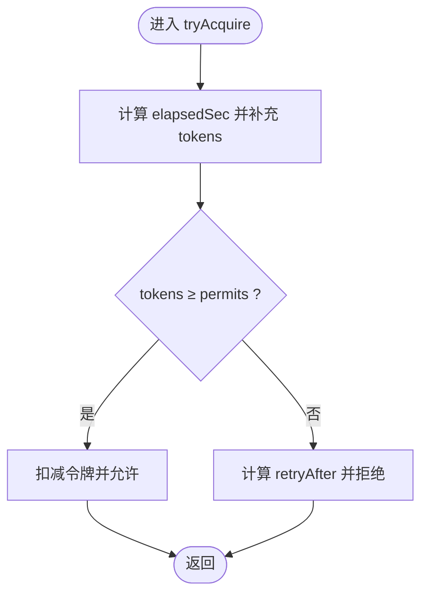

**图表来源**
- [InMemoryStore.java:214-236](file://throttle4j-core/src/main/java/com/throttle4j/store/InMemoryStore.java#L214-L236)

**章节来源**
- [TokenBucketRateLimiter.java:10-15](file://throttle4j-core/src/main/java/com/throttle4j/algorithm/TokenBucketRateLimiter.java#L10-L15)
- [InMemoryStore.java:214-236](file://throttle4j-core/src/main/java/com/throttle4j/store/InMemoryStore.java#L214-L236)

### 漏桶算法（Leaky Bucket）
- 工作机制
  - 桶容量为 limit；以恒定速率漏水（leakPerMs = limit / windowMillis）
  - 请求到达时先按 elapsed 消耗已“漏出”的水量，再判断是否溢出
  - 水位 level ≤ limit；若超过则计算需要等待多久才能容纳
- 数学模型
  - 已漏水量：leaked = elapsed × leakPerMs
  - 新水位：level = max(0, level - leaked) + permits
  - 允许：level ≤ limit；否则 overflow = level - limit，retryAfter = ceil(overflow / leakPerMs)
  - 重置：resetAfter = ceil(level / leakPerMs)，resetAt = now + resetAfter
- 优缺点
  - 优点：输出速率恒定，削峰填谷效果好
  - 缺点：无法应对突发；对瞬时流量抑制较强
- 性能特征
  - 每次访问惰性漏水，CPU 开销低；内存占用小
- 适用场景
  - 需要稳定输出速率的场景，如对外 API 出口限速、数据库写入节流

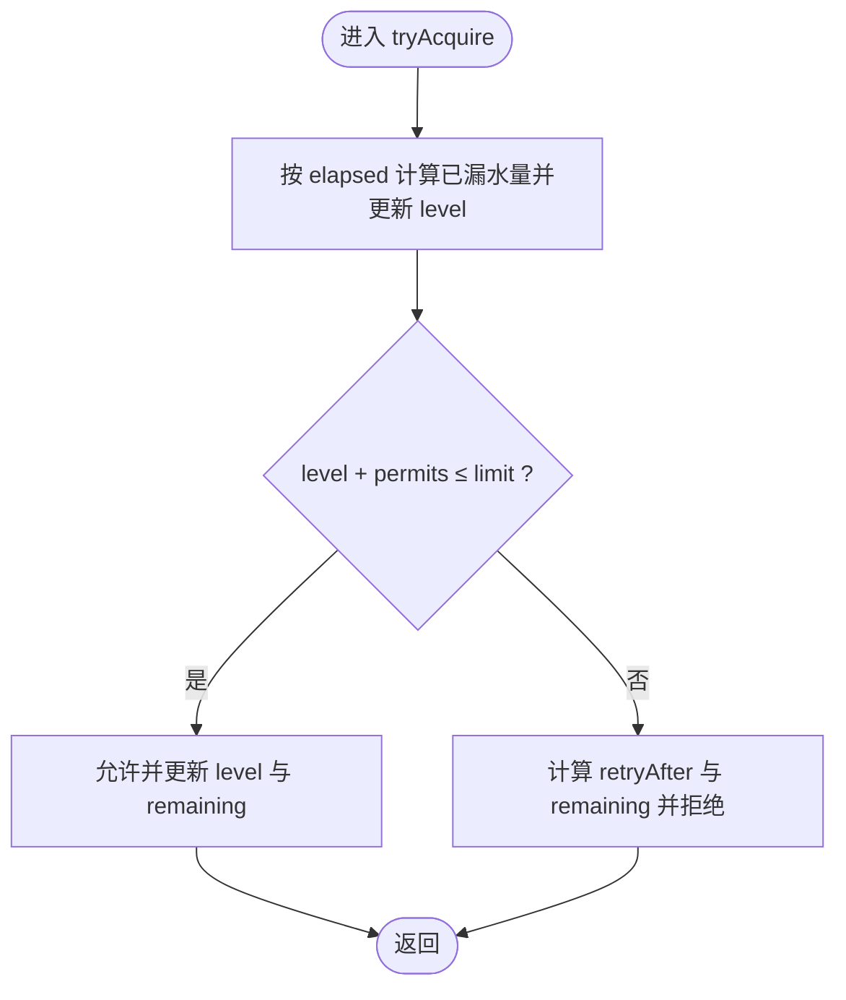

**图表来源**
- [InMemoryStore.java:238-263](file://throttle4j-core/src/main/java/com/throttle4j/store/InMemoryStore.java#L238-L263)

**章节来源**
- [LeakyBucketRateLimiter.java:10-15](file://throttle4j-core/src/main/java/com/throttle4j/algorithm/LeakyBucketRateLimiter.java#L10-L15)
- [InMemoryStore.java:238-263](file://throttle4j-core/src/main/java/com/throttle4j/store/InMemoryStore.java#L238-L263)

### 类关系与工厂/注册表
- 抽象基类：统一参数校验、委托存储层、暴露配置
- 工厂：依据配置中的算法枚举创建对应包装器
- 注册表：按名称注册并复用限流器实例，避免重复创建

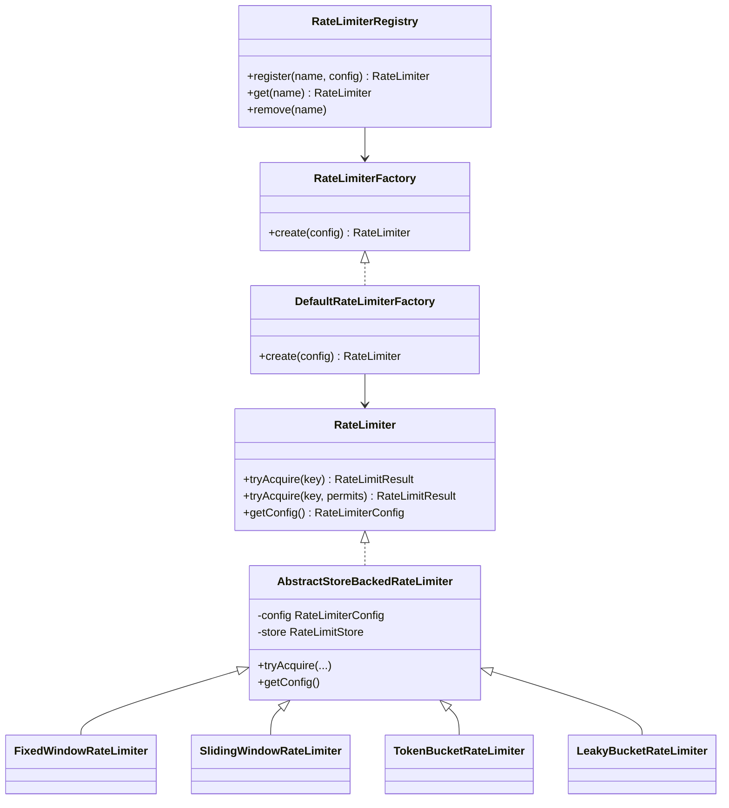

**图表来源**
- [RateLimiter.java:8-31](file://throttle4j-core/src/main/java/com/throttle4j/core/RateLimiter.java#L8-L31)
- [AbstractStoreBackedRateLimiter.java:14-41](file://throttle4j-core/src/main/java/com/throttle4j/algorithm/AbstractStoreBackedRateLimiter.java#L14-L41)
- [FixedWindowRateLimiter.java:12-17](file://throttle4j-core/src/main/java/com/throttle4j/algorithm/FixedWindowRateLimiter.java#L12-L17)
- [SlidingWindowRateLimiter.java:10-15](file://throttle4j-core/src/main/java/com/throttle4j/algorithm/SlidingWindowRateLimiter.java#L10-L15)
- [TokenBucketRateLimiter.java:10-15](file://throttle4j-core/src/main/java/com/throttle4j/algorithm/TokenBucketRateLimiter.java#L10-L15)
- [LeakyBucketRateLimiter.java:10-15](file://throttle4j-core/src/main/java/com/throttle4j/algorithm/LeakyBucketRateLimiter.java#L10-L15)
- [RateLimiterFactory.java:6-15](file://throttle4j-core/src/main/java/com/throttle4j/core/RateLimiterFactory.java#L6-L15)
- [DefaultRateLimiterFactory.java:14-38](file://throttle4j-core/src/main/java/com/throttle4j/algorithm/DefaultRateLimiterFactory.java#L14-L38)
- [RateLimiterRegistry.java:14-43](file://throttle4j-core/src/main/java/com/throttle4j/core/RateLimiterRegistry.java#L14-L43)

**章节来源**
- [DefaultRateLimiterFactory.java:14-38](file://throttle4j-core/src/main/java/com/throttle4j/algorithm/DefaultRateLimiterFactory.java#L14-L38)
- [RateLimiterRegistry.java:14-43](file://throttle4j-core/src/main/java/com/throttle4j/core/RateLimiterRegistry.java#L14-L43)

## 依赖分析
- 算法包装器依赖存储接口，不直接持有状态，降低耦合
- 存储实现依赖配置对象与算法枚举，按算法分支执行不同逻辑
- 工厂与注册表提供集中化的实例化与复用策略

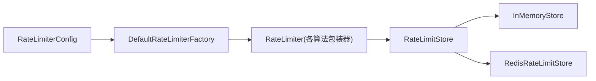

**图表来源**
- [RateLimiterConfig.java:8-50](file://throttle4j-core/src/main/java/com/throttle4j/core/RateLimiterConfig.java#L8-L50)
- [DefaultRateLimiterFactory.java:22-37](file://throttle4j-core/src/main/java/com/throttle4j/algorithm/DefaultRateLimiterFactory.java#L22-L37)
- [AbstractStoreBackedRateLimiter.java:24-40](file://throttle4j-core/src/main/java/com/throttle4j/algorithm/AbstractStoreBackedRateLimiter.java#L24-L40)
- [InMemoryStore.java:68-93](file://throttle4j-core/src/main/java/com/throttle4j/store/InMemoryStore.java#L68-L93)
- [RedisRateLimitStore.java:80-110](file://throttle4j-redis/src/main/java/com/throttle4j/redis/RedisRateLimitStore.java#L80-L110)

**章节来源**
- [Algorithm.java:6-15](file://throttle4j-core/src/main/java/com/throttle4j/core/Algorithm.java#L6-L15)
- [RateLimitStore.java:15-34](file://throttle4j-core/src/main/java/com/throttle4j/store/RateLimitStore.java#L15-L34)

## 性能考量
- 内存实现
  - 无网络开销，适合单机高吞吐场景
  - 使用同步块保护状态，避免竞争；提供空闲键清理降低内存占用
- Redis 实现
  - 所有算法逻辑由 Lua 脚本原子执行，保证一致性
  - 通过脚本复用与连接池可获得稳定的延迟与吞吐
- 参数建议
  - 固定窗口：窗口长度越大，越平滑但响应越慢
  - 滑动窗口：槽位数影响精度与内存，建议根据 QPS 与突发幅度权衡
  - 令牌桶：refillRate 决定恢复速度，limit 决定突发容量
  - 漏桶：leakPerMs 决定恒定速率，容量决定缓冲能力

[本节为通用性能讨论，无需特定文件引用]

## 故障排查指南
- 参数校验异常
  - 配额或窗口参数非法会触发构建阶段异常
  - 令牌桶必须提供正的补充速率
- 运行时异常
  - 关闭的内存存储会抛出非法状态异常
  - 非法的 key 或 permits 会触发参数异常
- 结果解读
  - 允许：remaining 与 resetAt 可用于前端提示与重试策略
  - 拒绝：retryAfter 可指导客户端退避重试

**章节来源**
- [RateLimiterConfig.java:91-110](file://throttle4j-core/src/main/java/com/throttle4j/core/RateLimiterConfig.java#L91-L110)
- [InMemoryStore.java:70-78](file://throttle4j-core/src/main/java/com/throttle4j/store/InMemoryStore.java#L70-L78)
- [InMemoryStore.java:142-146](file://throttle4j-core/src/main/java/com/throttle4j/store/InMemoryStore.java#L142-L146)
- [RateLimitResult.java:42-56](file://throttle4j-core/src/main/java/com/throttle4j/core/RateLimitResult.java#L42-L56)

## 结论
throttle4j 通过“算法包装器 + 存储实现”的分层设计，将复杂限流逻辑标准化、可插拔化。四种算法覆盖了从粗粒度到精细控制、从突发处理到恒定速率的不同需求。结合内存与 Redis 实现，既满足单机高性能，也支持分布式一致性。建议在实际选型时，优先考虑业务对“边界尖峰容忍度、突发能力、输出稳定性”的偏好，并参考本文提供的决策树与性能特征进行落地。

[本节为总结性内容，无需特定文件引用]

## 附录

### 算法选择决策树
- 是否需要应对短时突发？
  - 否：优先漏桶（恒定速率输出）
  - 是：是否允许边界尖峰“双倍峰值”？
    - 是：固定窗口（简单高效）
    - 否：滑动窗口（更平滑）
- 是否需要突发容量与快速恢复？
  - 是：令牌桶（突发 + 惰性补充）
  - 否：固定窗口或滑动窗口
- 是否需要分布式一致性？
  - 是：Redis 实现
  - 否：内存实现

[本节为概念性决策树，无需特定文件引用]

### 关键流程与状态图

#### 固定窗口状态演进
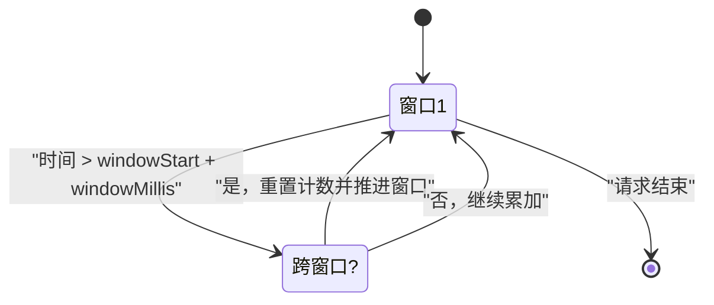

**图表来源**
- [InMemoryStore.java:156-159](file://throttle4j-core/src/main/java/com/throttle4j/store/InMemoryStore.java#L156-L159)

#### 滑动窗口槽位滚动
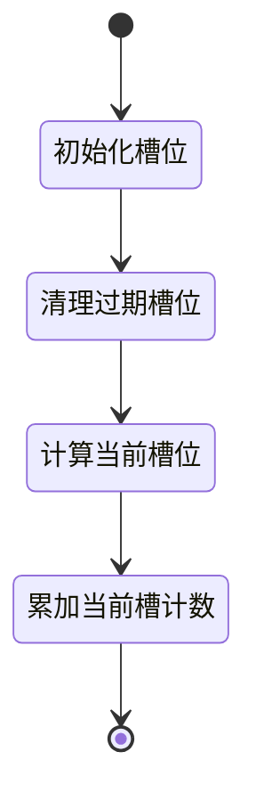

**图表来源**
- [InMemoryStore.java:183-209](file://throttle4j-core/src/main/java/com/throttle4j/store/InMemoryStore.java#L183-L209)

#### 令牌桶补充与消费
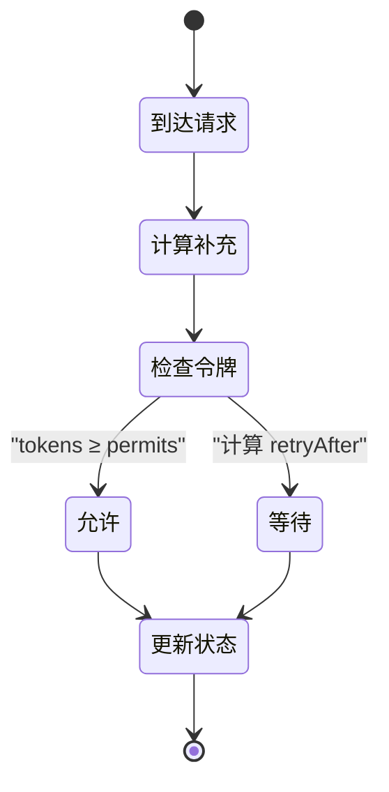

**图表来源**
- [InMemoryStore.java:221-235](file://throttle4j-core/src/main/java/com/throttle4j/store/InMemoryStore.java#L221-L235)

#### 漏桶漏水与溢出
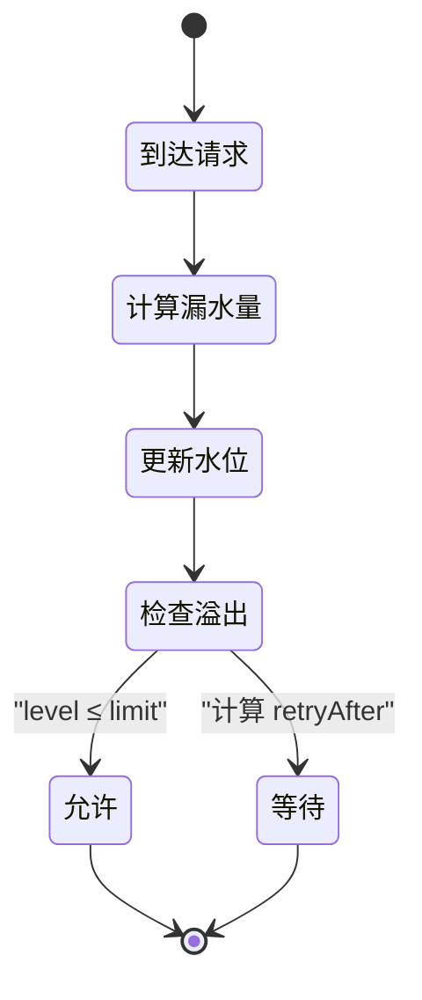

**图表来源**
- [InMemoryStore.java:246-262](file://throttle4j-core/src/main/java/com/throttle4j/store/InMemoryStore.java#L246-L262)