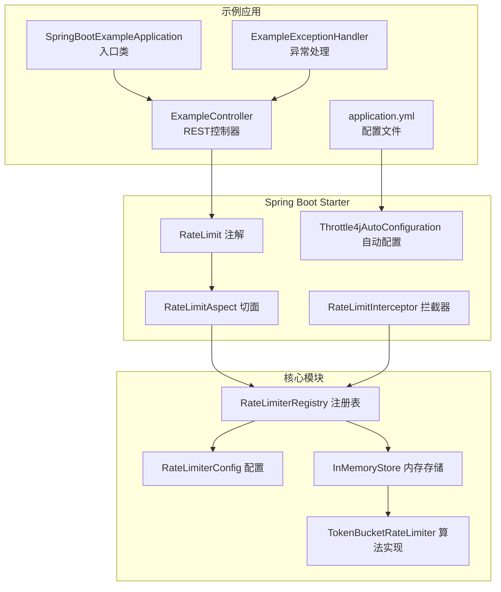
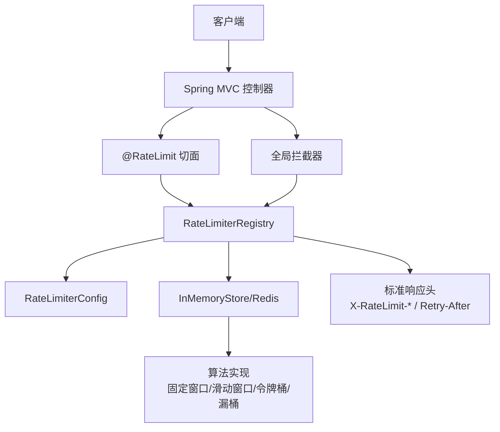
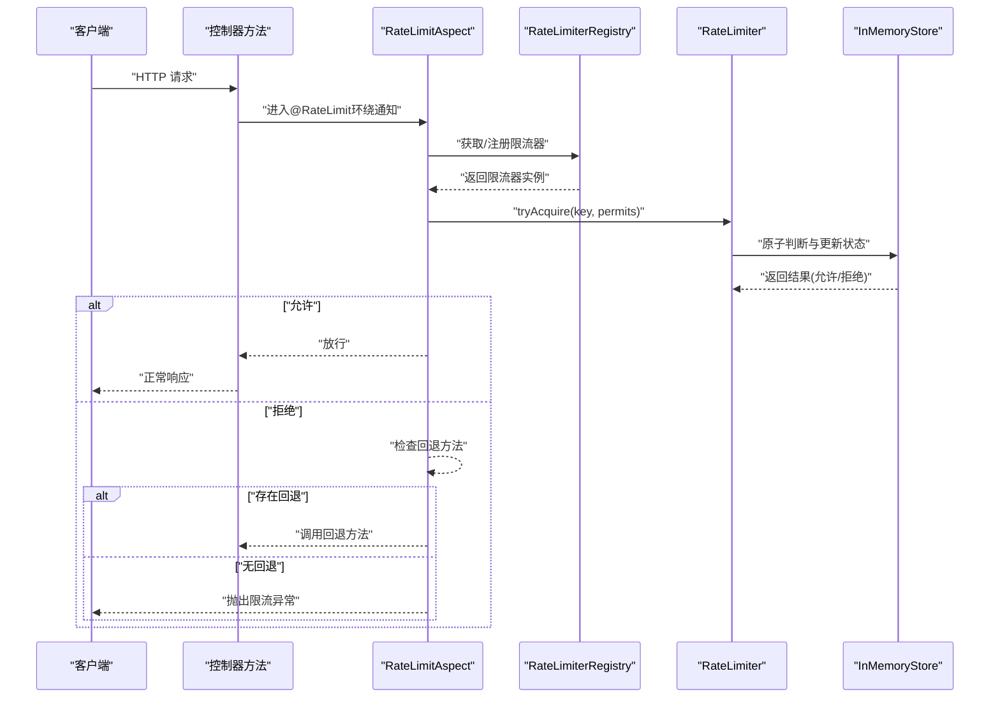
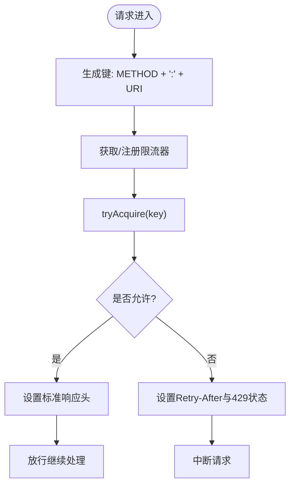
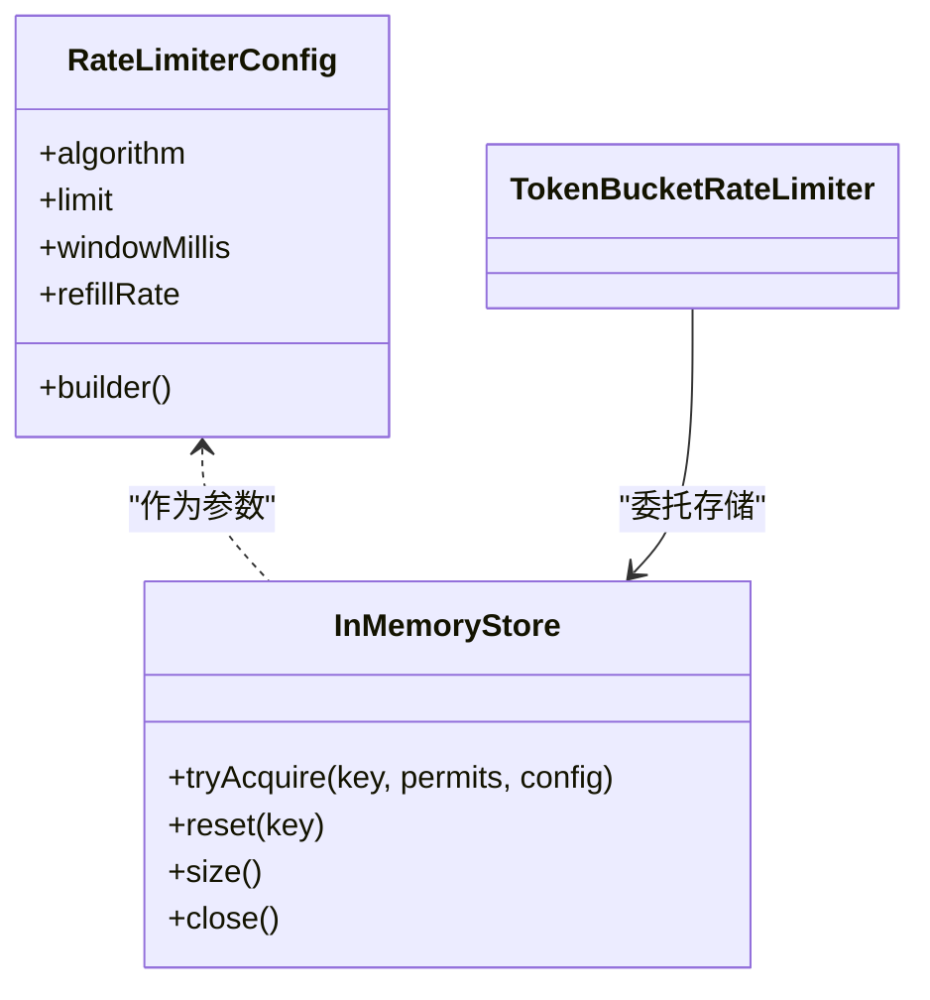
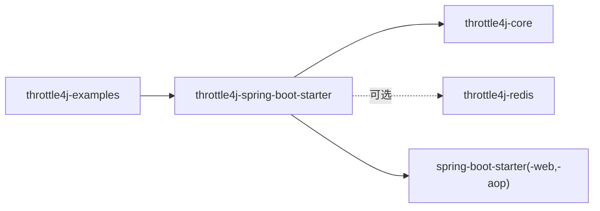

# 基础使用示例

<cite>
**本文引用的文件**
- [README.md](file://README.md)
- [SpringBootExampleApplication.java](file://throttle4j-examples/src/main/java/com/throttle4j/example/SpringBootExampleApplication.java)
- [ExampleController.java](file://throttle4j-examples/src/main/java/com/throttle4j/example/ExampleController.java)
- [ExampleExceptionHandler.java](file://throttle4j-examples/src/main/java/com/throttle4j/example/ExampleExceptionHandler.java)
- [application.yml](file://throttle4j-examples/src/main/resources/application.yml)
- [RateLimit.java](file://throttle4j-spring-boot-starter/src/main/java/com/throttle4j/spring/annotation/RateLimit.java)
- [RateLimitAspect.java](file://throttle4j-spring-boot-starter/src/main/java/com/throttle4j/spring/aop/RateLimitAspect.java)
- [Throttle4jAutoConfiguration.java](file://throttle4j-spring-boot-starter/src/main/java/com/throttle4j/spring/autoconfigure/Throttle4jAutoConfiguration.java)
- [RateLimitInterceptor.java](file://throttle4j-spring-boot-starter/src/main/java/com/throttle4j/spring/web/RateLimitInterceptor.java)
- [RateLimiterConfig.java](file://throttle4j-core/src/main/java/com/throttle4j/core/RateLimiterConfig.java)
- [InMemoryStore.java](file://throttle4j-core/src/main/java/com/throttle4j/store/InMemoryStore.java)
- [TokenBucketRateLimiter.java](file://throttle4j-core/src/main/java/com/throttle4j/algorithm/TokenBucketRateLimiter.java)
- [pom.xml（examples）](file://throttle4j-examples/pom.xml)
- [pom.xml（spring-boot-starter）](file://throttle4j-spring-boot-starter/pom.xml)
</cite>

## 目录
1. [简介](#简介)
2. [项目结构](#项目结构)
3. [核心组件](#核心组件)
4. [架构总览](#架构总览)
5. [详细组件分析](#详细组件分析)
6. [依赖关系分析](#依赖关系分析)
7. [性能与适用性](#性能与适用性)
8. [故障排查指南](#故障排查指南)
9. [结论](#结论)
10. [附录：基础使用示例清单](#附录基础使用示例清单)

## 简介
本示例文档面向希望在Spring Boot项目中快速集成throttle4j进行API限流的开发者。内容涵盖：
- Maven依赖配置
- 基本的@RateLimit注解使用方法
- 从简单API限流到控制器级注解的完整示例
- 配置项说明与常见参数设置
- 错误处理与响应头策略
- 实现原理与适用场景解析

## 项目结构
throttle4j采用多模块设计，核心能力由throttle4j-core提供，Spring Boot集成由throttle4j-spring-boot-starter提供，示例工程位于throttle4j-examples。

图表来源
- [SpringBootExampleApplication.java:12-18](file://throttle4j-examples/src/main/java/com/throttle4j/example/SpringBootExampleApplication.java#L12-L18)
- [ExampleController.java:12-35](file://throttle4j-examples/src/main/java/com/throttle4j/example/ExampleController.java#L12-L35)
- [ExampleExceptionHandler.java:13-25](file://throttle4j-examples/src/main/java/com/throttle4j/example/ExampleExceptionHandler.java#L13-L25)
- [application.yml:1-10](file://throttle4j-examples/src/main/resources/application.yml#L1-L10)
- [RateLimit.java:23-74](file://throttle4j-spring-boot-starter/src/main/java/com/throttle4j/spring/annotation/RateLimit.java#L23-L74)
- [RateLimitAspect.java:40-91](file://throttle4j-spring-boot-starter/src/main/java/com/throttle4j/spring/aop/RateLimitAspect.java#L40-L91)
- [Throttle4jAutoConfiguration.java:30-131](file://throttle4j-spring-boot-starter/src/main/java/com/throttle4j/spring/autoconfigure/Throttle4jAutoConfiguration.java#L30-L131)
- [RateLimitInterceptor.java:26-79](file://throttle4j-spring-boot-starter/src/main/java/com/throttle4j/spring/web/RateLimitInterceptor.java#L26-L79)
- [RateLimiterConfig.java:8-50](file://throttle4j-core/src/main/java/com/throttle4j/core/RateLimiterConfig.java#L8-L50)
- [InMemoryStore.java:24-93](file://throttle4j-core/src/main/java/com/throttle4j/store/InMemoryStore.java#L24-L93)
- [TokenBucketRateLimiter.java:10-15](file://throttle4j-core/src/main/java/com/throttle4j/algorithm/TokenBucketRateLimiter.java#L10-L15)

章节来源
- [README.md:24-41](file://README.md#L24-L41)
- [pom.xml（examples）:18-31](file://throttle4j-examples/pom.xml#L18-L31)
- [pom.xml（spring-boot-starter）:18-46](file://throttle4j-spring-boot-starter/pom.xml#L18-L46)

## 核心组件
- 注解与切面
  - @RateLimit：用于方法级声明式限流，支持SpEL键表达式、窗口、算法、配额等参数。
  - RateLimitAspect：AOP环绕通知，拦截带@RateLimit的方法，在执行前进行限流判断，决定放行或触发回退/异常。
- 自动配置
  - Throttle4jAutoConfiguration：按属性自动装配默认存储、工厂、注册表与切面；支持内存/Redis存储选择与降级。
- Web拦截器
  - RateLimitInterceptor：基于URL路径的全局限流拦截器，统一注入标准响应头并返回429。
- 核心配置与存储
  - RateLimiterConfig：不可变配置对象，构建时校验算法、窗口、令牌桶重填率等。
  - InMemoryStore：单机内存存储，提供四种算法的状态维护与清理。

章节来源
- [RateLimit.java:23-74](file://throttle4j-spring-boot-starter/src/main/java/com/throttle4j/spring/annotation/RateLimit.java#L23-L74)
- [RateLimitAspect.java:40-186](file://throttle4j-spring-boot-starter/src/main/java/com/throttle4j/spring/aop/RateLimitAspect.java#L40-L186)
- [Throttle4jAutoConfiguration.java:30-131](file://throttle4j-spring-boot-starter/src/main/java/com/throttle4j/spring/autoconfigure/Throttle4jAutoConfiguration.java#L30-L131)
- [RateLimitInterceptor.java:26-126](file://throttle4j-spring-boot-starter/src/main/java/com/throttle4j/spring/web/RateLimitInterceptor.java#L26-L126)
- [RateLimiterConfig.java:55-112](file://throttle4j-core/src/main/java/com/throttle4j/core/RateLimiterConfig.java#L55-L112)
- [InMemoryStore.java:24-315](file://throttle4j-core/src/main/java/com/throttle4j/store/InMemoryStore.java#L24-L315)

## 架构总览
下图展示了从请求进入应用到被限流控制的整体流程，以及各模块间的依赖关系。

图表来源
- [RateLimitAspect.java:68-91](file://throttle4j-spring-boot-starter/src/main/java/com/throttle4j/spring/aop/RateLimitAspect.java#L68-L91)
- [RateLimitInterceptor.java:55-79](file://throttle4j-spring-boot-starter/src/main/java/com/throttle4j/spring/web/RateLimitInterceptor.java#L55-L79)
- [InMemoryStore.java:68-93](file://throttle4j-core/src/main/java/com/throttle4j/store/InMemoryStore.java#L68-L93)

## 详细组件分析

### 组件一：@RateLimit注解与AOP切面
- 使用方式
  - 在Spring管理的控制器方法上添加@RateLimit，即可在调用前进行限流判断。
  - 支持通过SpEL表达式动态生成限流键，如“#userId”。
  - 可指定算法（滑动窗口/令牌桶/固定窗口/漏桶）、窗口时间、最大配额、每次调用消耗配额数、以及拒绝时的回退方法名。
- 执行流程
  - 切面解析注解与SpEL键，构造或获取限流器，尝试获取配额。
  - 若允许则继续执行目标方法；否则根据是否存在回退方法决定抛出异常或调用回退方法。
- 典型场景
  - 用户维度限流：键表达式为“#userId”，按用户隔离配额。
  - 接口级限流：键为接口名或自定义字符串，对全站接口统一配额。
  - 高并发突发：令牌桶算法配合较高重填率，适合网关类场景。

图表来源
- [RateLimit.java:26-74](file://throttle4j-spring-boot-starter/src/main/java/com/throttle4j/spring/annotation/RateLimit.java#L26-L74)
- [RateLimitAspect.java:68-91](file://throttle4j-spring-boot-starter/src/main/java/com/throttle4j/spring/aop/RateLimitAspect.java#L68-L91)
- [InMemoryStore.java:68-93](file://throttle4j-core/src/main/java/com/throttle4j/store/InMemoryStore.java#L68-L93)

章节来源
- [RateLimit.java:23-74](file://throttle4j-spring-boot-starter/src/main/java/com/throttle4j/spring/annotation/RateLimit.java#L23-L74)
- [RateLimitAspect.java:40-186](file://throttle4j-spring-boot-starter/src/main/java/com/throttle4j/spring/aop/RateLimitAspect.java#L40-L186)

### 组件二：全局拦截器与标准响应头
- 功能
  - 基于请求方法+URI生成键，进行全局限流。
  - 在每个响应中设置标准头部：X-RateLimit-Limit、X-RateLimit-Remaining、X-RateLimit-Reset。
  - 当被拒绝时返回HTTP 429，并设置Retry-After。
- 适用场景
  - 对整站或特定路径组进行统一限流，无需在每个方法上重复加注解。
  - 作为网关层或反向代理后的统一防护。

图表来源
- [RateLimitInterceptor.java:55-79](file://throttle4j-spring-boot-starter/src/main/java/com/throttle4j/spring/web/RateLimitInterceptor.java#L55-L79)
- [RateLimitInterceptor.java:120-124](file://throttle4j-spring-boot-starter/src/main/java/com/throttle4j/spring/web/RateLimitInterceptor.java#L120-L124)

章节来源
- [RateLimitInterceptor.java:26-126](file://throttle4j-spring-boot-starter/src/main/java/com/throttle4j/spring/web/RateLimitInterceptor.java#L26-L126)

### 组件三：核心配置与存储模型
- 配置校验
  - 必须设置算法与配额；令牌桶需设置重填率；其他算法需设置窗口毫秒数。
- 存储与算法
  - InMemoryStore提供四种算法的状态维护，支持空闲键清理与关闭资源。
  - TokenBucketRateLimiter采用惰性补给策略，按实际调用时间计算令牌补充。

图表来源
- [RateLimiterConfig.java:8-50](file://throttle4j-core/src/main/java/com/throttle4j/core/RateLimiterConfig.java#L8-L50)
- [InMemoryStore.java:68-93](file://throttle4j-core/src/main/java/com/throttle4j/store/InMemoryStore.java#L68-L93)
- [TokenBucketRateLimiter.java:10-15](file://throttle4j-core/src/main/java/com/throttle4j/algorithm/TokenBucketRateLimiter.java#L10-L15)

章节来源
- [RateLimiterConfig.java:55-112](file://throttle4j-core/src/main/java/com/throttle4j/core/RateLimiterConfig.java#L55-L112)
- [InMemoryStore.java:24-315](file://throttle4j-core/src/main/java/com/throttle4j/store/InMemoryStore.java#L24-L315)

## 依赖关系分析
- 示例工程依赖starter与web，可直接运行演示。
- starter模块依赖core与可选redis模块，自动装配AOP与Web组件。
- 自动配置根据属性选择存储类型，若未引入redis模块则回退到内存存储。

图表来源
- [pom.xml（examples）:18-31](file://throttle4j-examples/pom.xml#L18-L31)
- [pom.xml（spring-boot-starter）:18-46](file://throttle4j-spring-boot-starter/pom.xml#L18-L46)

章节来源
- [pom.xml（examples）:18-31](file://throttle4j-examples/pom.xml#L18-L31)
- [pom.xml（spring-boot-starter）:18-46](file://throttle4j-spring-boot-starter/pom.xml#L18-L46)

## 性能与适用性
- 算法选择建议
  - 令牌桶：适合网关/入口流量，允许突发但平均速率受控。
  - 滑动窗口：更公平地分配配额，避免边界尖峰。
  - 固定窗口：最简单但边界易出现尖峰。
  - 漏桶：严格控制出站速率，适合下游压力稳定的场景。
- 存储选择
  - 单机：InMemoryStore，低延迟、易部署。
  - 分布式：Redis存储（需引入redis模块），跨节点共享状态。
- 性能要点
  - 切面与拦截器均走原子操作与Lua脚本（Redis），在高并发下仍保持正确性。
  - 内存存储支持空闲键清理，避免长期占用。

章节来源
- [README.md:103-112](file://README.md#L103-L112)
- [Throttle4jAutoConfiguration.java:45-99](file://throttle4j-spring-boot-starter/src/main/java/com/throttle4j/spring/autoconfigure/Throttle4jAutoConfiguration.java#L45-L99)

## 故障排查指南
- 429 Too Many Requests
  - 方法级：当@RateLimit拒绝时抛出限流异常，可通过@RestControllerAdvice捕获并返回标准429与Retry-After。
  - 全局拦截器：当路径级限流拒绝时直接返回429并设置标准头。
- 异常处理示例
  - 将RateExceededException转换为HTTP 429，并从结果中提取重试等待秒数。
- 常见问题定位
  - 检查注解键表达式是否能被SpEL正确求值。
  - 检查默认算法/窗口/配额是否合理，避免过小导致频繁拒绝。
  - 检查Redis连接配置（如启用Redis存储时）。

章节来源
- [ExampleExceptionHandler.java:16-24](file://throttle4j-examples/src/main/java/com/throttle4j/example/ExampleExceptionHandler.java#L16-L24)
- [RateLimitAspect.java:86-91](file://throttle4j-spring-boot-starter/src/main/java/com/throttle4j/spring/aop/RateLimitAspect.java#L86-L91)
- [RateLimitInterceptor.java:72-78](file://throttle4j-spring-boot-starter/src/main/java/com/throttle4j/spring/web/RateLimitInterceptor.java#L72-L78)

## 结论
通过throttle4j的starter，开发者可以零配置快速接入方法级与全局级限流。结合清晰的注解参数与标准响应头，既能满足开发效率，也能保证线上稳定性。建议先以内存存储起步，再根据需要扩展到Redis分布式存储。

## 附录：基础使用示例清单
- Maven依赖
  - 引入throttle4j-spring-boot-starter，示例工程已包含web与可选redis依赖。
- 启动类
  - 使用@SpringBootApplication启动示例应用，默认端口8080。
- 控制器示例
  - 在方法上添加@RateLimit，设置limit、window、algorithm等参数。
  - 未标注注解的方法不参与限流。
- 全局拦截器
  - 通过配置启用后，对所有请求进行统一限流并输出标准响应头。
- 异常处理
  - 捕获RateExceededException，返回429与Retry-After。

章节来源
- [README.md:26-41](file://README.md#L26-L41)
- [SpringBootExampleApplication.java:12-18](file://throttle4j-examples/src/main/java/com/throttle4j/example/SpringBootExampleApplication.java#L12-L18)
- [ExampleController.java:16-34](file://throttle4j-examples/src/main/java/com/throttle4j/example/ExampleController.java#L16-L34)
- [application.yml:4-9](file://throttle4j-examples/src/main/resources/application.yml#L4-L9)
- [ExampleExceptionHandler.java:16-24](file://throttle4j-examples/src/main/java/com/throttle4j/example/ExampleExceptionHandler.java#L16-L24)