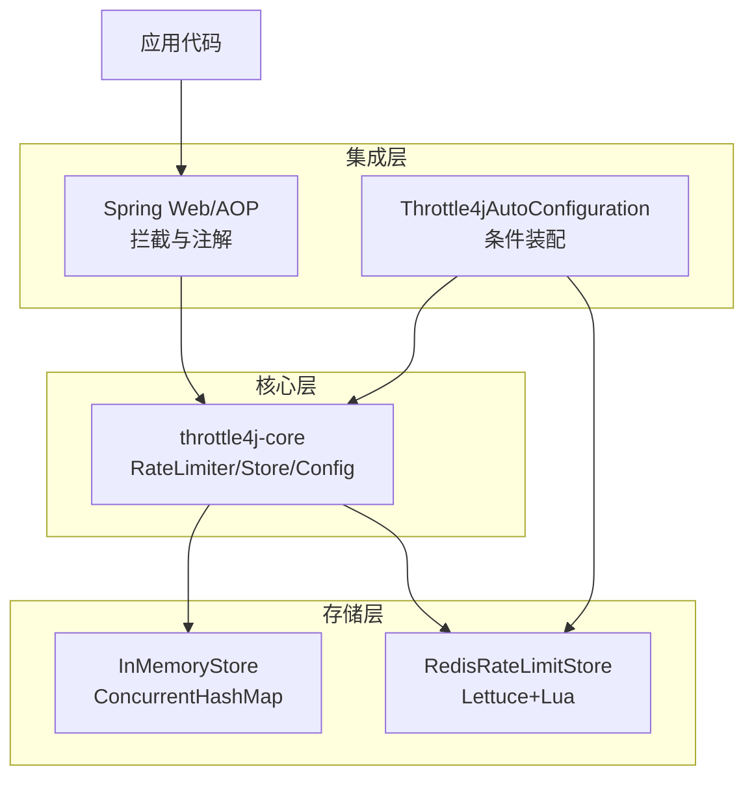
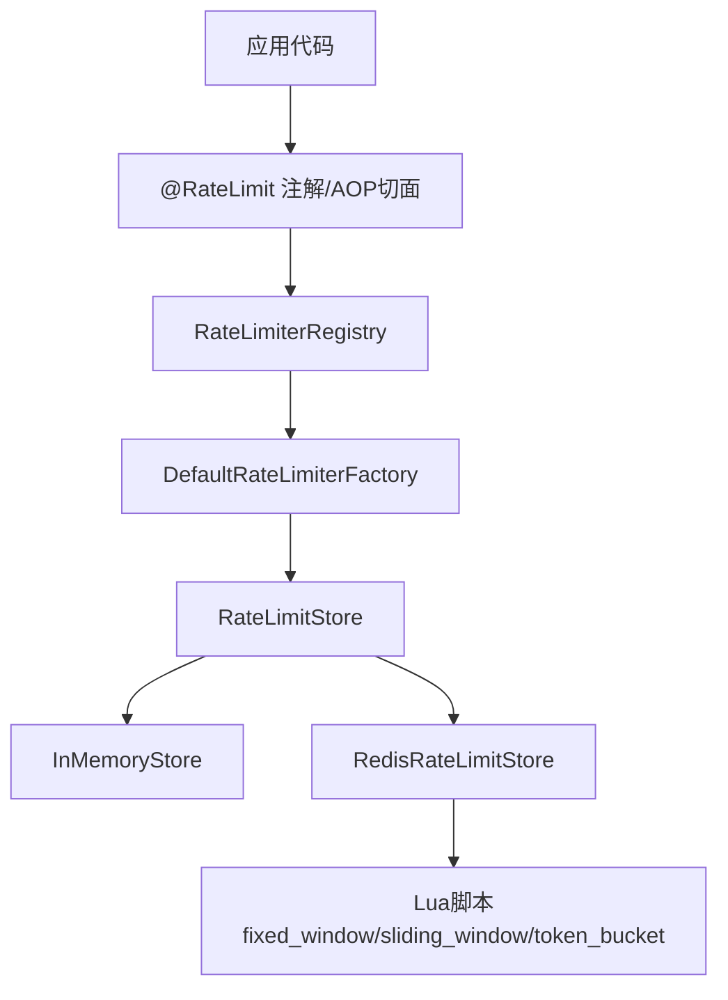
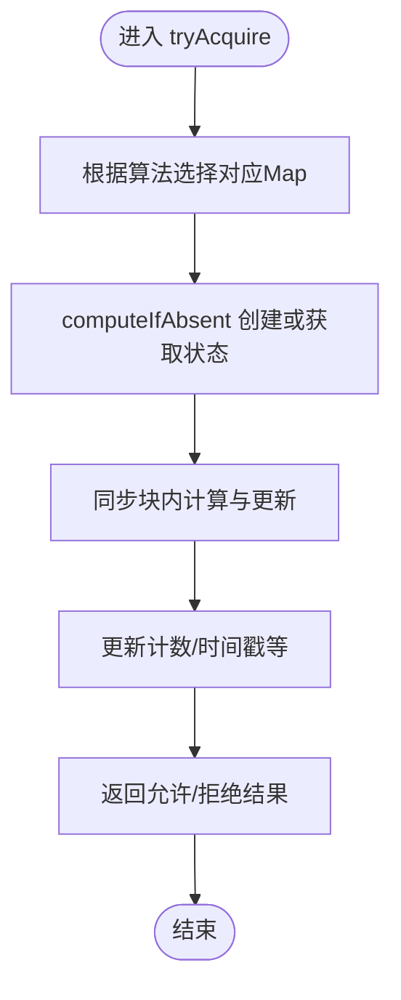
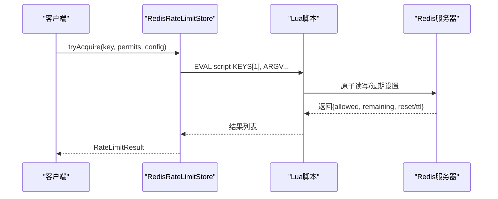
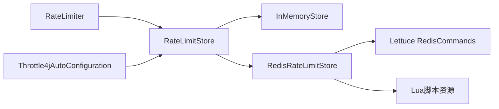

# 性能优化最佳实践

<cite>
**本文引用的文件**
- [README.md](file://README.md)
- [RateLimiter.java](file://throttle4j-core/src/main/java/com/throttle4j/core/RateLimiter.java)
- [RateLimiterConfig.java](file://throttle4j-core/src/main/java/com/throttle4j/core/RateLimiterConfig.java)
- [InMemoryStore.java](file://throttle4j-core/src/main/java/com/throttle4j/store/InMemoryStore.java)
- [RedisRateLimitStore.java](file://throttle4j-redis/src/main/java/com/throttle4j/redis/RedisRateLimitStore.java)
- [RedisRateLimitStoreBuilder.java](file://throttle4j-redis/src/main/java/com/throttle4j/redis/RedisRateLimitStoreBuilder.java)
- [fixed_window.lua](file://throttle4j-redis/src/main/resources/scripts/fixed_window.lua)
- [sliding_window.lua](file://throttle4j-redis/src/main/resources/scripts/sliding_window.lua)
- [token_bucket.lua](file://throttle4j-redis/src/main/resources/scripts/token_bucket.lua)
- [Throttle4jAutoConfiguration.java](file://throttle4j-spring-boot-starter/src/main/java/com/throttle4j/spring/autoconfigure/Throttle4jAutoConfiguration.java)
- [application.yml](file://throttle4j-examples/src/main/resources/application.yml)
</cite>

## 目录
1. [简介](#简介)
2. [项目结构](#项目结构)
3. [核心组件](#核心组件)
4. [架构总览](#架构总览)
5. [详细组件分析](#详细组件分析)
6. [依赖关系分析](#依赖关系分析)
7. [性能考量](#性能考量)
8. [故障排查指南](#故障排查指南)
9. [结论](#结论)
10. [附录](#附录)

## 简介
本指南面向使用 throttle4j 的开发者，聚焦于性能优化的最佳实践，涵盖算法选择建议、内存与缓存优化、Redis 存储调优、并发处理与无锁设计、以及性能监控与指标收集方法。文档基于仓库中的核心实现与模块化结构，提供可操作的优化策略与可视化图示。

## 项目结构
throttle4j 采用多模块分层设计：
- throttle4j-core：核心算法与 API、内存存储、配置模型
- throttle4j-redis：基于 Lettuce 的分布式存储与原子 Lua 脚本
- throttle4j-spring-boot-starter：自动装配、AOP 切面、Web 拦截器
- throttle4j-examples：示例应用与默认配置

图表来源
- [README.md:76-101](file://README.md#L76-L101)
- [Throttle4jAutoConfiguration.java:34-57](file://throttle4j-spring-boot-starter/src/main/java/com/throttle4j/spring/autoconfigure/Throttle4jAutoConfiguration.java#L34-L57)

章节来源
- [README.md:76-101](file://README.md#L76-L101)
- [Throttle4jAutoConfiguration.java:34-57](file://throttle4j-spring-boot-starter/src/main/java/com/throttle4j/spring/autoconfigure/Throttle4jAutoConfiguration.java#L34-L57)

## 核心组件
- RateLimiter 接口：定义 tryAcquire(key) 与 tryAcquire(key, permits)，要求线程安全
- RateLimiterConfig：不可变配置，支持算法、限流阈值、窗口、令牌桶补充速率等
- InMemoryStore：基于 ConcurrentHashMap 的本地存储，带空闲键清理任务
- RedisRateLimitStore：基于 Lettuce 同步命令接口，通过 Lua 原子脚本执行算法逻辑

章节来源
- [RateLimiter.java:8-31](file://throttle4j-core/src/main/java/com/throttle4j/core/RateLimiter.java#L8-L31)
- [RateLimiterConfig.java:8-112](file://throttle4j-core/src/main/java/com/throttle4j/core/RateLimiterConfig.java#L8-L112)
- [InMemoryStore.java:24-146](file://throttle4j-core/src/main/java/com/throttle4j/store/InMemoryStore.java#L24-L146)
- [RedisRateLimitStore.java:40-110](file://throttle4j-redis/src/main/java/com/throttle4j/redis/RedisRateLimitStore.java#L40-L110)

## 架构总览
throttle4j 在单机场景使用 InMemoryStore，在分布式场景使用 RedisRateLimitStore；Spring Boot Starter 提供零配置自动装配与 AOP/Web 集成。

图表来源
- [README.md:78-94](file://README.md#L78-L94)
- [Throttle4jAutoConfiguration.java:105-130](file://throttle4j-spring-boot-starter/src/main/java/com/throttle4j/spring/autoconfigure/Throttle4jAutoConfiguration.java#L105-L130)

## 详细组件分析

### 算法选择与性能权衡
- 固定窗口（Fixed Window）：边界突增风险高，但吞吐最高、内存占用最低
- 滑动窗口（Sliding Window）：平滑配额、公平性好，吞吐较高、内存中等
- 令牌桶（Token Bucket）：适合突发流量与平均速率控制，吞吐高、内存低
- 漏桶（Leaky Bucket）：严格恒定出站速率，吞吐中等、内存低

建议：
- API 网关典型场景优先 Token Bucket
- 对窗口内公平性敏感的场景选 Sliding Window
- 强制下游稳定速率时选 Leaky Bucket
- 仅追求简单且可接受边界尖峰时选 Fixed Window

章节来源
- [README.md:103-112](file://README.md#L103-L112)

### 内存使用优化（InMemoryStore）
- 并发容器：每种算法维护独立的 ConcurrentHashMap，避免跨算法锁竞争
- 空闲键清理：定时任务按 idleMillis 清理长时间未访问的键，降低内存占用
- 状态对象：各算法状态类为轻量级对象，仅保存必要字段（如计数、时间戳）

优化要点：
- 合理设置 idleMillis 与清理间隔，平衡内存与 CPU 开销
- 控制 key 数量与生命周期，避免无限增长
- 使用 reset(key) 主动释放不再使用的键

图表来源
- [InMemoryStore.java:68-93](file://throttle4j-core/src/main/java/com/throttle4j/store/InMemoryStore.java#L68-L93)
- [InMemoryStore.java:148-263](file://throttle4j-core/src/main/java/com/throttle4j/store/InMemoryStore.java#L148-L263)

章节来源
- [InMemoryStore.java:24-146](file://throttle4j-core/src/main/java/com/throttle4j/store/InMemoryStore.java#L24-L146)

### Redis 存储性能调优（RedisRateLimitStore + Lua）
- 原子性：所有算法逻辑由 Lua 脚本在服务端原子执行，减少往返与竞态
- 数据结构：
  - 固定窗口：字符串键计数 + 过期
  - 滑动窗口：有序集合记录时间戳，按分数裁剪过期项
  - 令牌桶：哈希表保存剩余令牌与上次补给时间，配合过期策略
- 关键参数：
  - key 前缀：避免键冲突，默认 throttle4j:
  - 调用路径：commands.eval(script, ScriptOutputType.MULTI, keys, args)

图表来源
- [RedisRateLimitStore.java:80-110](file://throttle4j-redis/src/main/java/com/throttle4j/redis/RedisRateLimitStore.java#L80-L110)
- [RedisRateLimitStore.java:195-203](file://throttle4j-redis/src/main/java/com/throttle4j/redis/RedisRateLimitStore.java#L195-L203)

章节来源
- [RedisRateLimitStore.java:40-110](file://throttle4j-redis/src/main/java/com/throttle4j/redis/RedisRateLimitStore.java#L40-L110)
- [fixed_window.lua:11-45](file://throttle4j-redis/src/main/resources/scripts/fixed_window.lua#L11-L45)
- [sliding_window.lua:13-48](file://throttle4j-redis/src/main/resources/scripts/sliding_window.lua#L13-L48)
- [token_bucket.lua:11-57](file://throttle4j-redis/src/main/resources/scripts/token_bucket.lua#L11-L57)

### 并发与无锁设计
- 线程安全：
  - Redis 存储：基于 Lettuce 同步命令接口的原子 Lua 执行，天然线程安全
  - 内存存储：算法内部使用 synchronized 状态对象，避免跨算法全局锁
- 锁优化：
  - 将锁粒度限制在具体 key 的状态对象上，降低热点竞争
  - 使用 CAS/原子布尔关闭标志与守护线程执行清理任务

章节来源
- [RedisRateLimitStore.java:36-38](file://throttle4j-redis/src/main/java/com/throttle4j/redis/RedisRateLimitStore.java#L36-L38)
- [InMemoryStore.java:148-263](file://throttle4j-core/src/main/java/com/throttle4j/store/InMemoryStore.java#L148-L263)

### 配置与自动装配
- 默认配置示例：示例应用使用内存存储与令牌桶算法
- 自动装配：当启用 Redis 且类路径存在相关模块时，优先装配 Redis 存储；否则回退到 InMemoryStore

章节来源
- [application.yml:4-9](file://throttle4j-examples/src/main/resources/application.yml#L4-L9)
- [Throttle4jAutoConfiguration.java:45-57](file://throttle4j-spring-boot-starter/src/main/java/com/throttle4j/spring/autoconfigure/Throttle4jAutoConfiguration.java#L45-L57)

## 依赖关系分析
- 组件耦合：
  - RateLimiter 依赖 RateLimitStore（接口解耦）
  - RedisRateLimitStore 依赖 Lettuce RedisCommands 与 Lua 资源
  - Spring 自动装配按属性动态选择存储实现
- 外部依赖：
  - Lettuce（Redis 客户端）
  - SLF4J（日志抽象）

图表来源
- [RedisRateLimitStore.java:51-78](file://throttle4j-redis/src/main/java/com/throttle4j/redis/RedisRateLimitStore.java#L51-L78)
- [Throttle4jAutoConfiguration.java:45-57](file://throttle4j-spring-boot-starter/src/main/java/com/throttle4j/spring/autoconfigure/Throttle4jAutoConfiguration.java#L45-L57)

章节来源
- [RedisRateLimitStore.java:51-78](file://throttle4j-redis/src/main/java/com/throttle4j/redis/RedisRateLimitStore.java#L51-L78)
- [Throttle4jAutoConfiguration.java:45-57](file://throttle4j-spring-boot-starter/src/main/java/com/throttle4j/spring/autoconfigure/Throttle4jAutoConfiguration.java#L45-L57)

## 性能考量

### 算法选择建议
- 令牌桶（Token Bucket）
  - 优点：适合突发流量与平均速率控制，吞吐高、内存低
  - 场景：API 网关、微服务入口限流
- 滑动窗口（Sliding Window）
  - 优点：更平滑的配额分配，公平性更好
  - 场景：对窗口内公平性敏感的业务
- 漏桶（Leaky Bucket）
  - 优点：强制恒定出站速率
  - 场景：下游系统需要稳定压力
- 固定窗口（Fixed Window）
  - 优点：实现简单、吞吐最高、内存占用最低
  - 场景：对边界尖峰可接受的简单场景

章节来源
- [README.md:103-112](file://README.md#L103-L112)

### 内存使用优化策略
- 合理设置空闲键清理
  - idleMillis：键在多久未访问后可被清理
  - cleanupIntervalMillis：清理任务运行周期
- 控制键数量
  - 使用合理的 key 规则，避免无界增长
  - 主动调用 reset(key) 释放不再使用的键
- 状态对象优化
  - 算法状态类仅保存必要字段，避免冗余

章节来源
- [InMemoryStore.java:28-66](file://throttle4j-core/src/main/java/com/throttle4j/store/InMemoryStore.java#L28-L66)
- [InMemoryStore.java:96-101](file://throttle4j-core/src/main/java/com/throttle4j/store/InMemoryStore.java#L96-L101)

### Redis 存储性能调优
- 连接池与客户端
  - 使用 Lettuce 的连接池配置（主机、端口、数据库、超时），确保连接复用
- Lua 脚本
  - 脚本一次性原子执行，减少网络往返
- 数据结构选择
  - 固定窗口：字符串计数 + 过期
  - 滑动窗口：有序集合按时间戳裁剪
  - 令牌桶：哈希表保存令牌与上次补给时间
- 键前缀
  - 使用 keyPrefix 避免键冲突，便于运维与清理

章节来源
- [RedisRateLimitStore.java:44-78](file://throttle4j-redis/src/main/java/com/throttle4j/redis/RedisRateLimitStore.java#L44-L78)
- [fixed_window.lua:16-39](file://throttle4j-redis/src/main/resources/scripts/fixed_window.lua#L16-L39)
- [sliding_window.lua:20-41](file://throttle4j-redis/src/main/resources/scripts/sliding_window.lua#L20-L41)
- [token_bucket.lua:17-44](file://throttle4j-redis/src/main/resources/scripts/token_bucket.lua#L17-L44)

### 并发处理最佳实践
- 线程池配置
  - Redis 客户端使用连接池，避免频繁创建销毁连接
  - 清理线程为守护线程，避免阻塞应用退出
- 锁优化
  - 内存存储将锁粒度限制在 key 级别，降低热点竞争
- 无锁编程
  - Redis 存储通过 Lua 原子脚本替代锁，提升并发性能

章节来源
- [InMemoryStore.java:59-65](file://throttle4j-core/src/main/java/com/throttle4j/store/InMemoryStore.java#L59-L65)
- [InMemoryStore.java:150-170](file://throttle4j-core/src/main/java/com/throttle4j/store/InMemoryStore.java#L150-L170)
- [RedisRateLimitStore.java:36-38](file://throttle4j-redis/src/main/java/com/throttle4j/redis/RedisRateLimitStore.java#L36-L38)

### 性能监控与指标收集
- 标准响应头
  - X-RateLimit-Limit、X-RateLimit-Remaining、X-RateLimit-Reset、Retry-After
- 指标建议
  - 请求总量、通过量、拒绝量、平均延迟、P95/P99 延迟
  - Redis 命令耗时分布、命中率、过期键清理数量
  - 内存存储键数量、清理频率与移除数量
- 工具与集成
  - Spring Boot Actuator 暴露健康检查与指标
  - 应用侧埋点统计 RateLimitResult 与异常

章节来源
- [README.md:20-22](file://README.md#L20-L22)

## 故障排查指南
- Redis 不可用
  - 现象：自动回退到 InMemoryStore
  - 处理：检查 Redis 连接配置与网络连通性
- Lua 脚本加载失败
  - 现象：构建时抛出脚本缺失异常
  - 处理：确认脚本资源在 classpath 中
- 配置校验错误
  - 现象：构建 RateLimiterConfig 抛出非法参数异常
  - 处理：确保算法、阈值、窗口、补充速率等参数合法

章节来源
- [Throttle4jAutoConfiguration.java:53-56](file://throttle4j-spring-boot-starter/src/main/java/com/throttle4j/spring/autoconfigure/Throttle4jAutoConfiguration.java#L53-L56)
- [RedisRateLimitStore.java:226-251](file://throttle4j-redis/src/main/java/com/throttle4j/redis/RedisRateLimitStore.java#L226-L251)
- [RateLimiterConfig.java:91-110](file://throttle4j-core/src/main/java/com/throttle4j/core/RateLimiterConfig.java#L91-L110)

## 结论
throttle4j 在单机与分布式场景均提供了高性能的限流能力。通过合理选择算法、优化内存与 Redis 存储、利用原子 Lua 脚本与细粒度锁、以及完善的监控指标，可在高并发下保持稳定的吞吐与低延迟。建议结合业务特征选择算法，并持续观测关键指标以指导进一步优化。

## 附录

### 配置参考（示例）
- 示例应用使用内存存储与令牌桶算法
- 可通过属性覆盖默认行为

章节来源
- [application.yml:4-9](file://throttle4j-examples/src/main/resources/application.yml#L4-L9)