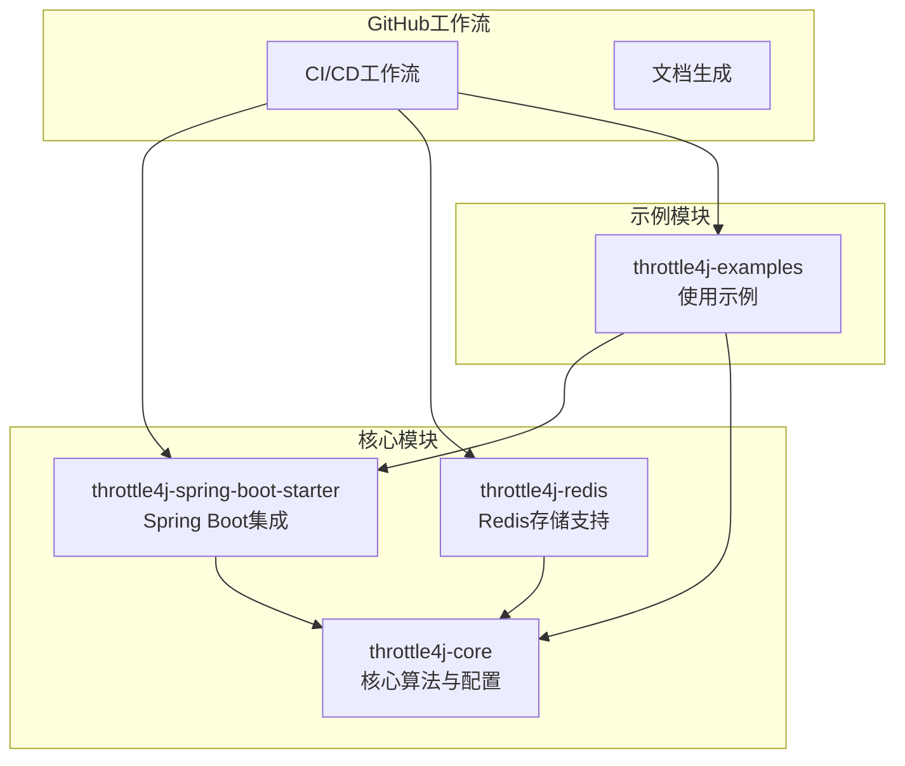
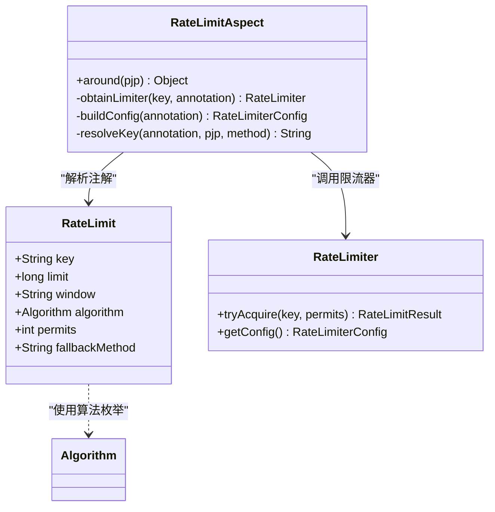
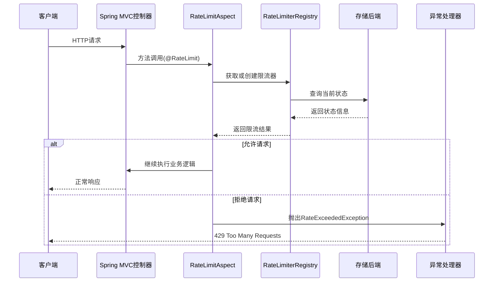
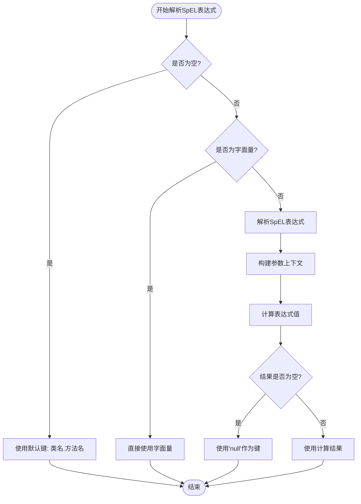
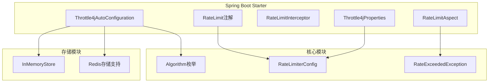
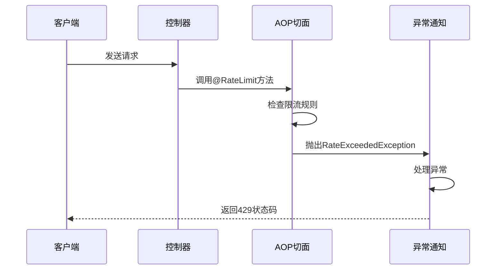

# 控制器集成示例

<cite>
**本文档引用的文件**
- [RateLimit.java](file://throttle4j-spring-boot-starter/src/main/java/com/throttle4j/spring/annotation/RateLimit.java)
- [RateLimitAspect.java](file://throttle4j-spring-boot-starter/src/main/java/com/throttle4j/spring/aop/RateLimitAspect.java)
- [RateLimitInterceptor.java](file://throttle4j-spring-boot-starter/src/main/java/com/throttle4j/spring/web/RateLimitInterceptor.java)
- [Throttle4jAutoConfiguration.java](file://throttle4j-spring-boot-starter/src/main/java/com/throttle4j/spring/autoconfigure/Throttle4jAutoConfiguration.java)
- [Throttle4jProperties.java](file://throttle4j-spring-boot-starter/src/main/java/com/throttle4j/spring/autoconfigure/Throttle4jProperties.java)
- [WindowParser.java](file://throttle4j-spring-boot-starter/src/main/java/com/throttle4j/spring/util/WindowParser.java)
- [Algorithm.java](file://throttle4j-core/src/main/java/com/throttle4j/core/Algorithm.java)
- [RateLimiterConfig.java](file://throttle4j-core/src/main/java/com/throttle4j/core/RateLimiterConfig.java)
- [RateExceededException.java](file://throttle4j-core/src/main/java/com/throttle4j/core/RateExceededException.java)
- [ExampleController.java](file://throttle4j-examples/src/main/java/com/throttle4j/example/ExampleController.java)
- [ExampleExceptionHandler.java](file://throttle4j-examples/src/main/java/com/throttle4j/example/ExampleExceptionHandler.java)
- [application.yml](file://throttle4j-examples/src/main/resources/application.yml)
</cite>

## 目录
1. [简介](#简介)
2. [项目结构](#项目结构)
3. [核心组件](#核心组件)
4. [架构概览](#架构概览)
5. [详细组件分析](#详细组件分析)
6. [依赖关系分析](#依赖关系分析)
7. [性能考虑](#性能考虑)
8. [故障排除指南](#故障排除指南)
9. [结论](#结论)
10. [附录](#附录)

## 简介

throttle4j是一个基于Spring Boot的限流框架，提供了灵活的API限流解决方案。本文档专注于展示如何在Spring MVC控制器中集成@RateLimit注解，实现RESTful API的限流保护。

throttle4j支持多种限流算法（固定窗口、滑动窗口、令牌桶、漏桶），并通过AOP切面和拦截器机制无缝集成到Spring应用中。该框架特别适合构建高并发的微服务架构，能够有效防止API被滥用和过载。

## 项目结构

throttle4j项目采用模块化设计，主要包含以下核心模块：



**图表来源**
- [Throttle4jAutoConfiguration.java:1-132](file://throttle4j-spring-boot-starter/src/main/java/com/throttle4j/spring/autoconfigure/Throttle4jAutoConfiguration.java#L1-L132)
- [Throttle4jProperties.java:1-202](file://throttle4j-spring-boot-starter/src/main/java/com/throttle4j/spring/autoconfigure/Throttle4jProperties.java#L1-L202)

**章节来源**
- [Throttle4jAutoConfiguration.java:19-30](file://throttle4j-spring-boot-starter/src/main/java/com/throttle4j/spring/autoconfigure/Throttle4jAutoConfiguration.java#L19-L30)
- [Throttle4jProperties.java:100-108](file://throttle4j-spring-boot-starter/src/main/java/com/throttle4j/spring/autoconfigure/Throttle4jProperties.java#L100-L108)

## 核心组件

### 注解驱动的限流机制

@RateLimit注解是throttle4j的核心特性，它提供了声明式的API限流能力：



**图表来源**
- [RateLimit.java:26-74](file://throttle4j-spring-boot-starter/src/main/java/com/throttle4j/spring/annotation/RateLimit.java#L26-L74)
- [RateLimitAspect.java:40-186](file://throttle4j-spring-boot-starter/src/main/java/com/throttle4j/spring/aop/RateLimitAspect.java#L40-L186)

### 支持的限流算法

throttle4j内置了四种不同的限流算法，每种都有其特定的应用场景：

| 算法类型 | 特点 | 适用场景 | 性能特征 |
|---------|------|----------|----------|
| 固定窗口 | 简单计数，边界效应明显 | 基础限流需求 | 高性能，可能有突发峰值 |
| 滑动窗口 | 平滑计数，避免边界问题 | 需要平滑限流的场景 | 中等性能，更精确 |
| 令牌桶 | 固定速率产生令牌，突发处理能力强 | 需要处理突发流量 | 高性能，支持突发 |
| 漏桶 | 固定速率出水，恒定输出 | 需要恒定速率的场景 | 中等性能，恒定输出 |

**章节来源**
- [Algorithm.java:6-15](file://throttle4j-core/src/main/java/com/throttle4j/core/Algorithm.java#L6-L15)
- [RateLimiterConfig.java:55-111](file://throttle4j-core/src/main/java/com/throttle4j/core/RateLimiterConfig.java#L55-L111)

## 架构概览

throttle4j的架构设计遵循Spring Boot的自动配置原则，通过AOP切面和拦截器实现非侵入式限流：



**图表来源**
- [RateLimitAspect.java:68-91](file://throttle4j-spring-boot-starter/src/main/java/com/throttle4j/spring/aop/RateLimitAspect.java#L68-L91)
- [RateExceededException.java:6-33](file://throttle4j-core/src/main/java/com/throttle4j/core/RateExceededException.java#L6-L33)

## 详细组件分析

### @RateLimit注解详解

@RateLimit注解提供了丰富的配置选项，支持灵活的限流策略定制：

#### 基本配置属性

| 属性名 | 类型 | 默认值 | 描述 |
|--------|------|--------|------|
| key | String | 方法签名 | 限流键表达式，支持SpEL |
| limit | long | 100 | 时间窗口内的请求数限制 |
| window | String | "1m" | 时间窗口，支持ms/s/m/h/d |
| algorithm | Algorithm | SLIDING_WINDOW | 使用的限流算法 |
| permits | int | 1 | 每次调用消耗的配额数 |
| fallbackMethod | String | "" | 限流时的回退方法 |

#### SpEL表达式支持

@RateLimit注解的key属性支持Spring Expression Language，可以动态生成限流键：



**图表来源**
- [RateLimitAspect.java:117-137](file://throttle4j-spring-boot-starter/src/main/java/com/throttle4j/spring/aop/RateLimitAspect.java#L117-L137)

**章节来源**
- [RateLimit.java:28-74](file://throttle4j-spring-boot-starter/src/main/java/com/throttle4j/spring/annotation/RateLimit.java#L28-L74)
- [RateLimitAspect.java:117-153](file://throttle4j-spring-boot-starter/src/main/java/com/throttle4j/spring/aop/RateLimitAspect.java#L117-L153)

### RateLimitAspect核心逻辑

RateLimitAspect是@RateLimit注解的AOP实现，负责拦截带注解的方法并执行限流检查：

#### 请求处理流程

```mermaid
flowchart TD
Request[收到@RateLimit方法调用] --> GetAnnotation["提取RateLimit注解"]
GetAnnotation --> ResolveKey["解析限流键(SpEL)"]
ResolveKey --> ObtainLimiter["获取或创建限流器"]
ObtainLimiter --> TryAcquire["尝试获取配额"]
TryAcquire --> Allowed{"是否允许?"}
Allowed --> |是| Proceed["继续执行原方法"]
Allowed --> |否| CheckFallback{"是否有回退方法?"}
CheckFallback --> |是| InvokeFallback["调用回退方法"]
CheckFallback --> |否| ThrowException["抛出RateExceededException"]
Proceed --> End[完成]
InvokeFallback --> End
ThrowException --> End
```

**图表来源**
- [RateLimitAspect.java:68-91](file://throttle4j-spring-boot-starter/src/main/java/com/throttle4j/spring/aop/RateLimitAspect.java#L68-L91)

**章节来源**
- [RateLimitAspect.java:30-38](file://throttle4j-spring-boot-starter/src/main/java/com/throttle4j/spring/aop/RateLimitAspect.java#L30-L38)
- [RateLimitAspect.java:93-115](file://throttle4j-spring-boot-starter/src/main/java/com/throttle4j/spring/aop/RateLimitAspect.java#L93-L115)

### RateLimitInterceptor全局拦截

除了@RateLimit注解外，throttle4j还提供了全局URL路径级别的限流拦截器：

#### 全局拦截器配置

| 属性名 | 类型 | 默认值 | 描述 |
|--------|------|--------|------|
| enabled | boolean | false | 是否启用全局拦截器 |
| includePatterns | String[] | ["**"] | 包含的路径模式 |
| excludePatterns | String[] | [] | 排除的路径模式 |

#### 响应头标准化

全局拦截器会设置标准的速率限制响应头：

| 响应头名称 | 含义 | 示例值 |
|------------|------|--------|
| X-RateLimit-Limit | 窗口限制数 | 100 |
| X-RateLimit-Remaining | 窗口剩余数 | 95 |
| X-RateLimit-Reset | 重置时间戳 | 1640995200 |
| Retry-After | 重试等待秒数 | 60 |

**章节来源**
- [RateLimitInterceptor.java:18-25](file://throttle4j-spring-boot-starter/src/main/java/com/throttle4j/spring/web/RateLimitInterceptor.java#L18-L25)
- [RateLimitInterceptor.java:120-124](file://throttle4j-spring-boot-starter/src/main/java/com/throttle4j/spring/web/RateLimitInterceptor.java#L120-L124)

### 配置属性详解

throttle4j提供了丰富的配置选项，支持不同的部署场景：

#### 主要配置项

| 配置项 | 类型 | 默认值 | 描述 |
|--------|------|--------|------|
| throttle4j.enabled | boolean | true | 是否启用throttle4j |
| throttle4j.default-algorithm | String | "TOKEN_BUCKET" | 默认算法 |
| throttle4j.default-limit | long | 100 | 默认限流数 |
| throttle4j.default-window | String | "1m" | 默认时间窗口 |
| throttle4j.default-refill-rate | long | 10 | 默认令牌桶补充速率 |
| throttle4j.store-type | StoreType | MEMORY | 存储类型(MEMORY/REDIS) |

**章节来源**
- [Throttle4jProperties.java:12-28](file://throttle4j-spring-boot-starter/src/main/java/com/throttle4j/spring/autoconfigure/Throttle4jProperties.java#L12-L28)
- [Throttle4jProperties.java:150-200](file://throttle4j-spring-boot-starter/src/main/java/com/throttle4j/spring/autoconfigure/Throttle4jProperties.java#L150-L200)

## 依赖关系分析

throttle4j的模块间依赖关系清晰，遵循松耦合的设计原则：



**图表来源**
- [Throttle4jAutoConfiguration.java:34-99](file://throttle4j-spring-boot-starter/src/main/java/com/throttle4j/spring/autoconfigure/Throttle4jAutoConfiguration.java#L34-L99)
- [Throttle4jProperties.java:103-108](file://throttle4j-spring-boot-starter/src/main/java/com/throttle4j/spring/autoconfigure/Throttle4jProperties.java#L103-L108)

**章节来源**
- [Throttle4jAutoConfiguration.java:19-30](file://throttle4j-spring-boot-starter/src/main/java/com/throttle4j/spring/autoconfigure/Throttle4jAutoConfiguration.java#L19-L30)
- [Throttle4jAutoConfiguration.java:105-130](file://throttle4j-spring-boot-starter/src/main/java/com/throttle4j/spring/autoconfigure/Throttle4jAutoConfiguration.java#L105-L130)

## 性能考虑

### 算法性能对比

不同限流算法在性能和准确性方面各有特点：

| 算法 | 计算复杂度 | 内存占用 | 准确性 | 适用场景 |
|------|------------|----------|--------|----------|
| 固定窗口 | O(1) | 低 | 一般 | 大规模简单限流 |
| 滑动窗口 | O(n) | 中等 | 高 | 需要精确控制的场景 |
| 令牌桶 | O(1) | 低 | 高 | 突发流量处理 |
| 漏桶 | O(1) | 低 | 中等 | 恒定速率输出 |

### 缓存优化策略

throttle4j通过多种缓存机制提升性能：

1. **表达式缓存**: 缓存SpEL表达式解析结果
2. **限流器注册表缓存**: 避免重复创建限流器实例
3. **参数名发现缓存**: 提升SpEL上下文构建效率

### Redis集群支持

在分布式环境中，推荐使用Redis作为存储后端：

- **数据一致性**: 确保多实例间的限流状态一致
- **扩展性**: 支持水平扩展和负载均衡
- **持久化**: 配置合适的过期策略保证内存效率

## 故障排除指南

### 常见异常处理

#### RateExceededException异常处理

当请求超过限流阈值时，系统会抛出RateExceededException异常。建议通过@RestControllerAdvice统一处理：



**图表来源**
- [ExampleExceptionHandler.java:16-24](file://throttle4j-examples/src/main/java/com/throttle4j/example/ExampleExceptionHandler.java#L16-L24)

#### 配置验证

在开发和生产环境中，建议验证以下配置：

1. **算法选择**: 根据业务场景选择合适的算法
2. **窗口大小**: 平衡响应时间和准确性
3. **配额设置**: 避免过于严格或宽松的限制
4. **存储类型**: 分布式环境优先考虑Redis

**章节来源**
- [ExampleExceptionHandler.java:9-25](file://throttle4j-examples/src/main/java/com/throttle4j/example/ExampleExceptionHandler.java#L9-L25)
- [Throttle4jProperties.java:150-147](file://throttle4j-spring-boot-starter/src/main/java/com/throttle4j/spring/autoconfigure/Throttle4jProperties.java#L150-L147)

## 结论

throttle4j为Spring Boot应用提供了强大而灵活的API限流解决方案。通过@RateLimit注解和全局拦截器，开发者可以轻松实现细粒度的流量控制。

### 主要优势

1. **声明式配置**: 通过注解实现零代码入侵的限流
2. **多算法支持**: 满足不同场景的限流需求
3. **Spring Boot集成**: 自动配置，开箱即用
4. **分布式支持**: Redis存储确保多实例一致性
5. **性能优化**: 多层缓存机制保证高并发性能

### 最佳实践建议

1. **合理选择算法**: 根据业务特点选择最适合的限流算法
2. **精细化配置**: 为不同API端点设置差异化的限流策略
3. **监控告警**: 建立完善的限流监控和告警机制
4. **灰度发布**: 新增或调整限流规则时采用渐进式发布
5. **性能测试**: 在生产环境前进行全面的性能和压力测试

## 附录

### 快速开始示例

以下是一个完整的Spring MVC控制器集成示例：

```mermaid
graph LR
subgraph "控制器层"
Controller[ExampleController]
GET[GET /api/hello]
POST[POST /api/users]
PUT[PUT /api/users/{id}]
DELETE[DELETE /api/users/{id}]
end
subgraph "限流配置"
RL1[@RateLimit(limit=5, window="10s")]
RL2[@RateLimit(key="user-api", limit=10, window="1m")]
RL3[无注解 - 无限制]
end
subgraph "异常处理"
EH[ExampleExceptionHandler]
HTTP429[HTTP 429响应]
end
Controller --> GET
Controller --> POST
Controller --> PUT
Controller --> DELETE
GET --> RL1
POST --> RL2
PUT --> RL2
DELETE --> RL2
RL1 --> EH
RL2 --> EH
EH --> HTTP429
```

**图表来源**
- [ExampleController.java:16-34](file://throttle4j-examples/src/main/java/com/throttle4j/example/ExampleController.java#L16-L34)
- [ExampleExceptionHandler.java:16-24](file://throttle4j-examples/src/main/java/com/throttle4j/example/ExampleExceptionHandler.java#L16-L24)

### 配置文件示例

完整的application.yml配置示例：

```yaml
server:
  port: 8080

throttle4j:
  enabled: true
  default-algorithm: TOKEN_BUCKET
  default-limit: 100
  default-window: 1m
  store-type: memory
```

**章节来源**
- [application.yml:1-10](file://throttle4j-examples/src/main/resources/application.yml#L1-L10)