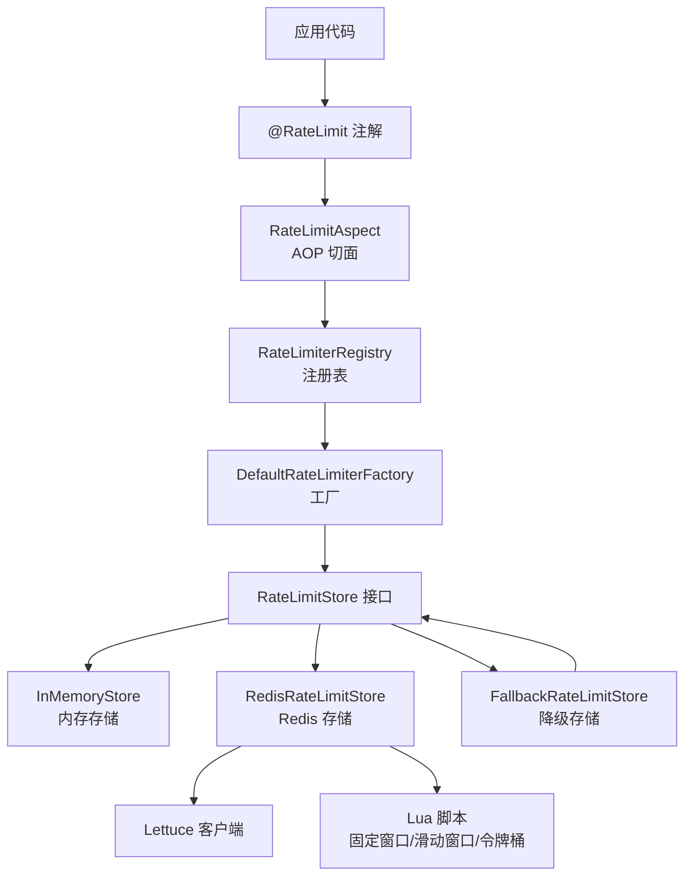
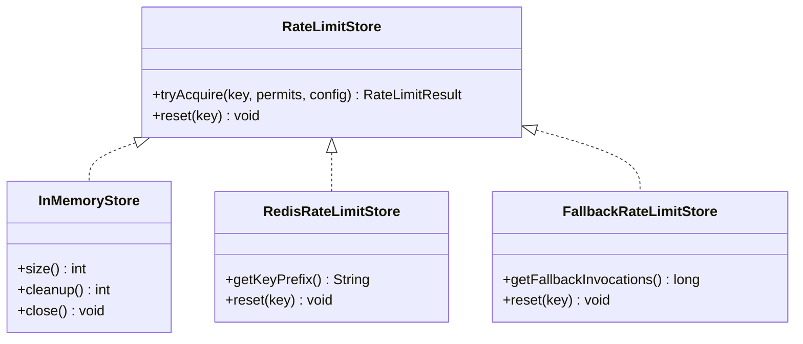
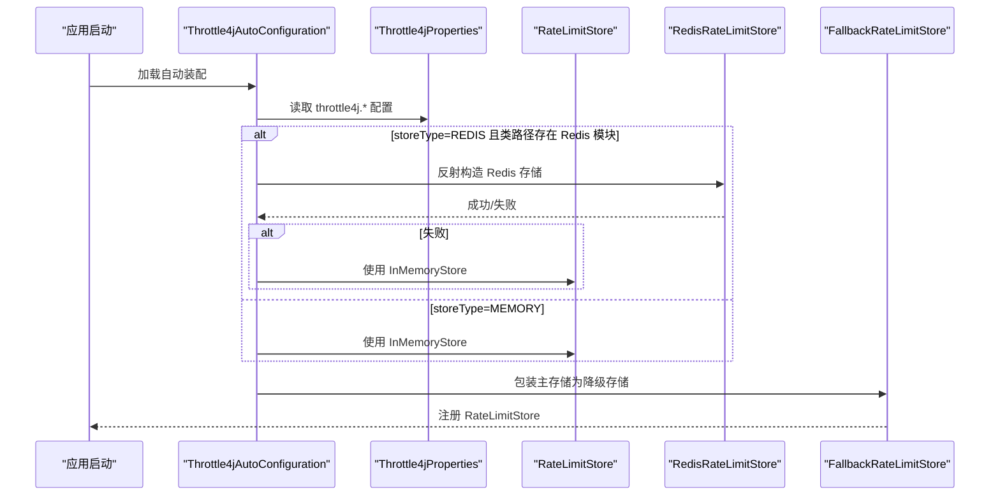
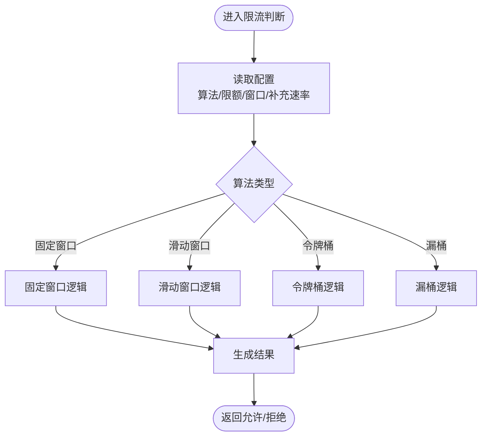
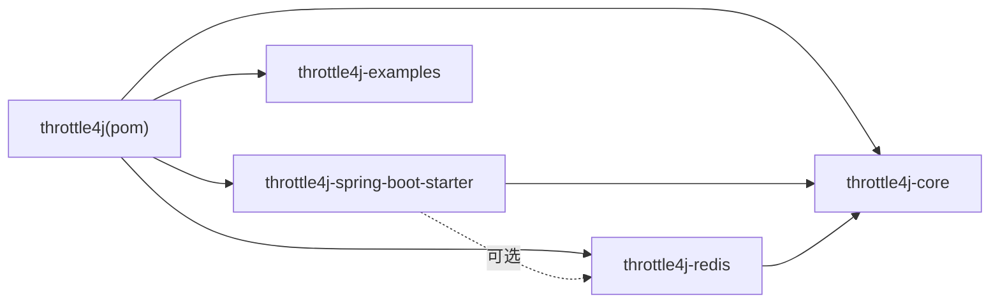

# 生产环境部署最佳实践

<cite>
**本文引用的文件**
- [blog-quick-start.md](file://docs/blog-quick-start.md)
- [Throttle4jProperties.java](file://throttle4j-spring-boot-starter/src/main/java/com/throttle4j/spring/autoconfigure/Throttle4jProperties.java)
- [Throttle4jAutoConfiguration.java](file://throttle4j-spring-boot-starter/src/main/java/com/throttle4j/spring/autoconfigure/Throttle4jAutoConfiguration.java)
- [RedisRateLimitStore.java](file://throttle4j-redis/src/main/java/com/throttle4j/redis/RedisRateLimitStore.java)
- [FallbackRateLimitStore.java](file://throttle4j-redis/src/main/java/com/throttle4j/redis/FallbackRateLimitStore.java)
- [InMemoryStore.java](file://throttle4j-core/src/main/java/com/throttle4j/store/InMemoryStore.java)
- [RateLimiter.java](file://throttle4j-core/src/main/java/com/throttle4j/core/RateLimiter.java)
- [RateLimitStore.java](file://throttle4j-core/src/main/java/com/throttle4j/store/RateLimitStore.java)
- [RateLimiterConfig.java](file://throttle4j-core/src/main/java/com/throttle4j/core/RateLimiterConfig.java)
- [RateLimitResult.java](file://throttle4j-core/src/main/java/com/throttle4j/core/RateLimitResult.java)
- [Algorithm.java](file://throttle4j-core/src/main/java/com/throttle4j/core/Algorithm.java)
- [application.yml](file://throttle4j-examples/src/main/resources/application.yml)
</cite>

## 更新摘要
**所做更改**
- 新增生产环境部署注意事项章节，包含Redis高可用配置、Key设计规范、多节点部署模式等关键内容
- 完善Redis高可用配置细节，包括Sentinel和Cluster模式的具体配置方法
- 新增Key设计规范指导，帮助避免热点Key和优化Key命名
- 增加多节点部署模式对比，提供不同场景下的部署建议
- 补充安全建议和监控告警配置

## 目录
1. [简介](#简介)
2. [项目结构](#项目结构)
3. [核心组件](#核心组件)
4. [架构总览](#架构总览)
5. [详细组件分析](#详细组件分析)
6. [依赖关系分析](#依赖关系分析)
7. [性能考量](#性能考量)
8. [生产环境部署注意事项](#生产环境部署注意事项)
9. [故障排查指南](#故障排查指南)
10. [结论](#结论)
11. [附录](#附录)

## 简介
本指南面向在生产环境中部署 throttle4j 的工程团队，提供从单机到分布式集群的完整部署建议，涵盖 Redis 高可用配置（主从、哨兵、集群）、监控与告警、日志与审计、故障恢复与灾备，以及与容器化平台（Docker/Kubernetes）的集成方案。文档以仓库现有模块与实现为依据，结合 Spring Boot 自动装配能力，给出可落地的生产实践。

## 项目结构
throttle4j 采用多模块结构，核心层提供算法与存储抽象，Redis 扩展提供分布式存储，Spring Boot Starter 提供零配置自动装配与注解支持，示例模块提供运行样例。

```mermaid
graph TB
subgraph "throttle4j 核心模块"
CORE["throttle4j-core<br/>算法与存储抽象"]
STORE["InMemoryStore<br/>内存存储实现"]
CONFIG["RateLimiterConfig<br/>配置模型"]
RESULT["RateLimitResult<br/>结果模型"]
ALGO["Algorithm<br/>算法枚举"]
END
subgraph "throttle4j Redis 扩展"
RSTORE["RedisRateLimitStore<br/>Redis 分布式存储"]
FALLBACK["FallbackRateLimitStore<br/>主备降级"]
END
subgraph "throttle4j Spring Boot Starter"
AUTO["Throttle4jAutoConfiguration<br/>自动装配"]
PROPS["Throttle4jProperties<br/>配置属性"]
ANNOT["@RateLimit<br/>注解"]
END
subgraph "示例"
APPYML["application.yml<br/>示例配置"]
END
CORE --> STORE
CORE --> CONFIG
CORE --> RESULT
CORE --> ALGO
RSTORE --> CORE
FALLBACK --> CORE
AUTO --> CORE
AUTO --> PROPS
ANNOT --> AUTO
APPYML --> AUTO
```

**图表来源**
- [Throttle4jAutoConfiguration.java:27-131](file://throttle4j-spring-boot-starter/src/main/java/com/throttle4j/spring/autoconfigure/Throttle4jAutoConfiguration.java#L27-L131)
- [Throttle4jProperties.java:9-201](file://throttle4j-spring-boot-starter/src/main/java/com/throttle4j/spring/autoconfigure/Throttle4jProperties.java#L9-L201)
- [RedisRateLimitStore.java:40-257](file://throttle4j-redis/src/main/java/com/throttle4j/redis/RedisRateLimitStore.java#L40-L257)
- [FallbackRateLimitStore.java:27-77](file://throttle4j-redis/src/main/java/com/throttle4j/redis/FallbackRateLimitStore.java#L27-L77)
- [InMemoryStore.java:24-314](file://throttle4j-core/src/main/java/com/throttle4j/store/InMemoryStore.java#L24-L314)
- [application.yml:1-10](file://throttle4j-examples/src/main/resources/application.yml#L1-L10)

**章节来源**
- [Throttle4jAutoConfiguration.java:27-131](file://throttle4j-spring-boot-starter/src/main/java/com/throttle4j/spring/autoconfigure/Throttle4jAutoConfiguration.java#L27-L131)
- [Throttle4jProperties.java:9-201](file://throttle4j-spring-boot-starter/src/main/java/com/throttle4j/spring/autoconfigure/Throttle4jProperties.java#L9-L201)
- [RedisRateLimitStore.java:40-257](file://throttle4j-redis/src/main/java/com/throttle4j/redis/RedisRateLimitStore.java#L40-L257)
- [FallbackRateLimitStore.java:27-77](file://throttle4j-redis/src/main/java/com/throttle4j/redis/FallbackRateLimitStore.java#L27-L77)
- [InMemoryStore.java:24-314](file://throttle4j-core/src/main/java/com/throttle4j/store/InMemoryStore.java#L24-L314)
- [application.yml:1-10](file://throttle4j-examples/src/main/resources/application.yml#L1-L10)

## 核心组件
- 核心接口与模型
  - RateLimiter：统一的限流接口，提供按 key 申请许可的能力。
  - RateLimitStore：存储抽象，负责具体算法的状态管理与原子更新。
  - RateLimiterConfig：不可变配置，定义算法、限额、窗口、补充速率等。
  - RateLimitResult：限流结果，包含允许/拒绝状态、剩余配额、重置时间、建议重试时间。
  - Algorithm：算法枚举（固定窗口、滑动窗口、令牌桶、漏桶）。
- 存储实现
  - InMemoryStore：单机内存存储，带空闲清理与定时回收。
  - RedisRateLimitStore：基于 Lettuce 的 Redis 分布式存储，使用 Lua 脚本保证原子性。
  - FallbackRateLimitStore：主备降级存储，当主存储异常时透明切换至备存储。
- Spring Boot 集成
  - Throttle4jAutoConfiguration：条件化注册默认 Bean（Store、Factory、Registry、AOP Aspect）。
  - Throttle4jProperties：配置属性模型，支持 store 类型、Redis 连接参数、Web 拦截器等。
  - @RateLimit：声明式注解，支持 SpEL key 表达式、算法、窗口、许可数与回退方法。

**章节来源**
- [RateLimiter.java:8-31](file://throttle4j-core/src/main/java/com/throttle4j/core/RateLimiter.java#L8-L31)
- [RateLimitStore.java:15-34](file://throttle4j-core/src/main/java/com/throttle4j/store/RateLimitStore.java#L15-L34)
- [RateLimiterConfig.java:8-112](file://throttle4j-core/src/main/java/com/throttle4j/core/RateLimiterConfig.java#L8-L112)
- [RateLimitResult.java:6-67](file://throttle4j-core/src/main/java/com/throttle4j/core/RateLimitResult.java#L6-L67)
- [Algorithm.java:6-15](file://throttle4j-core/src/main/java/com/throttle4j/core/Algorithm.java#L6-L15)
- [InMemoryStore.java:24-314](file://throttle4j-core/src/main/java/com/throttle4j/store/InMemoryStore.java#L24-L314)
- [RedisRateLimitStore.java:40-257](file://throttle4j-redis/src/main/java/com/throttle4j/redis/RedisRateLimitStore.java#L40-L257)
- [FallbackRateLimitStore.java:27-77](file://throttle4j-redis/src/main/java/com/throttle4j/redis/FallbackRateLimitStore.java#L27-L77)
- [Throttle4jAutoConfiguration.java:27-131](file://throttle4j-spring-boot-starter/src/main/java/com/throttle4j/spring/autoconfigure/Throttle4jAutoConfiguration.java#L27-L131)
- [Throttle4jProperties.java:9-201](file://throttle4j-spring-boot-starter/src/main/java/com/throttle4j/spring/autoconfigure/Throttle4jProperties.java#L9-L201)
- [RateLimit.java:26-74](file://throttle4j-spring-boot-starter/src/main/java/com/throttle4j/spring/annotation/RateLimit.java#L26-L74)

## 架构总览
throttle4j 在 Spring Boot 环境中通过自动装配注入限流能力；默认使用内存存储，当配置为 Redis 且类路径存在 Redis 模块时，自动切换为分布式存储，并在主存储异常时自动降级到内存存储。



**图表来源**
- [Throttle4jAutoConfiguration.java:27-131](file://throttle4j-spring-boot-starter/src/main/java/com/throttle4j/spring/autoconfigure/Throttle4jAutoConfiguration.java#L27-L131)
- [RedisRateLimitStore.java:40-257](file://throttle4j-redis/src/main/java/com/throttle4j/redis/RedisRateLimitStore.java#L40-L257)
- [FallbackRateLimitStore.java:27-77](file://throttle4j-redis/src/main/java/com/throttle4j/redis/FallbackRateLimitStore.java#L27-L77)
- [InMemoryStore.java:24-314](file://throttle4j-core/src/main/java/com/throttle4j/store/InMemoryStore.java#L24-L314)

## 详细组件分析

### 组件一：存储层（内存与 Redis）
- InMemoryStore
  - 特点：单机、线程安全、带空闲键清理、定时回收。
  - 适用：单实例或小规模无共享状态场景。
  - 关键参数：空闲 TTL、清理间隔。
- RedisRateLimitStore
  - 特点：基于 Lettuce 同步命令接口，使用 Lua 脚本原子执行算法逻辑。
  - 适用：分布式限流、跨节点一致性。
  - 关键参数：key 前缀、脚本加载、连接参数。
- FallbackRateLimitStore
  - 特点：主存储异常时透明降级到备存储，统计降级次数，reset 广播到双存储。
  - 适用：高可用保障，避免 Redis 故障导致限流失效。



**图表来源**
- [RateLimitStore.java:15-34](file://throttle4j-core/src/main/java/com/throttle4j/store/RateLimitStore.java#L15-L34)
- [InMemoryStore.java:24-314](file://throttle4j-core/src/main/java/com/throttle4j/store/InMemoryStore.java#L24-L314)
- [RedisRateLimitStore.java:40-257](file://throttle4j-redis/src/main/java/com/throttle4j/redis/RedisRateLimitStore.java#L40-L257)
- [FallbackRateLimitStore.java:27-77](file://throttle4j-redis/src/main/java/com/throttle4j/redis/FallbackRateLimitStore.java#L27-L77)

**章节来源**
- [InMemoryStore.java:24-314](file://throttle4j-core/src/main/java/com/throttle4j/store/InMemoryStore.java#L24-L314)
- [RedisRateLimitStore.java:40-257](file://throttle4j-redis/src/main/java/com/throttle4j/redis/RedisRateLimitStore.java#L40-L257)
- [FallbackRateLimitStore.java:27-77](file://throttle4j-redis/src/main/java/com/throttle4j/redis/FallbackRateLimitStore.java#L27-L77)

### 组件二：Spring Boot 自动装配与配置
- Throttle4jAutoConfiguration
  - 条件注册：根据 throttle4j.enabled 控制启用；storeType=REDIS 时尝试反射构造 Redis 存储，不存在则回退内存存储。
  - 注册 Bean：RateLimitStore、RateLimiterFactory、RateLimiterRegistry、RateLimitAspect。
- Throttle4jProperties
  - 支持：enabled、defaultAlgorithm、defaultLimit、defaultWindow、defaultRefillRate、storeType、web.includePatterns/excludePatterns、Redis host/port/password/database/keyPrefix。
- @RateLimit 注解
  - 支持 SpEL key、limit、window、algorithm、permits、fallbackMethod。



**图表来源**
- [Throttle4jAutoConfiguration.java:27-131](file://throttle4j-spring-boot-starter/src/main/java/com/throttle4j/spring/autoconfigure/Throttle4jAutoConfiguration.java#L27-L131)
- [Throttle4jProperties.java:9-201](file://throttle4j-spring-boot-starter/src/main/java/com/throttle4j/spring/autoconfigure/Throttle4jProperties.java#L9-L201)
- [RedisRateLimitStore.java:40-257](file://throttle4j-redis/src/main/java/com/throttle4j/redis/RedisRateLimitStore.java#L40-L257)
- [FallbackRateLimitStore.java:27-77](file://throttle4j-redis/src/main/java/com/throttle4j/redis/FallbackRateLimitStore.java#L27-L77)

**章节来源**
- [Throttle4jAutoConfiguration.java:27-131](file://throttle4j-spring-boot-starter/src/main/java/com/throttle4j/spring/autoconfigure/Throttle4jAutoConfiguration.java#L27-L131)
- [Throttle4jProperties.java:9-201](file://throttle4j-spring-boot-starter/src/main/java/com/throttle4j/spring/autoconfigure/Throttle4jProperties.java#L9-L201)
- [RateLimit.java:26-74](file://throttle4j-spring-boot-starter/src/main/java/com/throttle4j/spring/annotation/RateLimit.java#L26-L74)

### 组件三：算法与结果模型
- 算法选择建议
  - 令牌桶：适合网关类 API，允许突发但控制平均速率。
  - 滑动窗口：窗口内更公平，适合平滑配额。
  - 漏桶：严格控制下游恒定速率。
  - 固定窗口：简单但边界有毛刺。
- 结果模型
  - RateLimitResult 提供 allowed/remaining/resetAt/retryAfterMillis，便于客户端遵循 Retry-After 并上报标准头部。



**图表来源**
- [Algorithm.java:6-15](file://throttle4j-core/src/main/java/com/throttle4j/core/Algorithm.java#L6-L15)
- [RateLimiterConfig.java:8-112](file://throttle4j-core/src/main/java/com/throttle4j/core/RateLimiterConfig.java#L8-L112)
- [RateLimitResult.java:6-67](file://throttle4j-core/src/main/java/com/throttle4j/core/RateLimitResult.java#L6-L67)
- [InMemoryStore.java:68-263](file://throttle4j-core/src/main/java/com/throttle4j/store/InMemoryStore.java#L68-L263)

**章节来源**
- [Algorithm.java:6-15](file://throttle4j-core/src/main/java/com/throttle4j/core/Algorithm.java#L6-L15)
- [RateLimiterConfig.java:8-112](file://throttle4j-core/src/main/java/com/throttle4j/core/RateLimiterConfig.java#L8-L112)
- [RateLimitResult.java:6-67](file://throttle4j-core/src/main/java/com/throttle4j/core/RateLimitResult.java#L6-L67)
- [InMemoryStore.java:68-263](file://throttle4j-core/src/main/java/com/throttle4j/store/InMemoryStore.java#L68-L263)

## 依赖关系分析
- 模块依赖
  - throttle4j-core：无 Spring 依赖，提供算法与存储抽象。
  - throttle4j-redis：依赖 core 与 lettuce，提供 Redis 分布式存储。
  - throttle4j-spring-boot-starter：依赖 core 与 redis（可选），提供自动装配与注解。
  - throttle4j-examples：示例模块，演示配置与使用。
- Maven 依赖管理
  - 统一版本管理与插件配置，确保各模块版本一致与测试覆盖率。



**图表来源**
- [Throttle4jAutoConfiguration.java:27-131](file://throttle4j-spring-boot-starter/src/main/java/com/throttle4j/spring/autoconfigure/Throttle4jAutoConfiguration.java#L27-L131)
- [Throttle4jProperties.java:9-201](file://throttle4j-spring-boot-starter/src/main/java/com/throttle4j/spring/autoconfigure/Throttle4jProperties.java#L9-L201)
- [RedisRateLimitStore.java:40-257](file://throttle4j-redis/src/main/java/com/throttle4j/redis/RedisRateLimitStore.java#L40-L257)
- [FallbackRateLimitStore.java:27-77](file://throttle4j-redis/src/main/java/com/throttle4j/redis/FallbackRateLimitStore.java#L27-L77)
- [InMemoryStore.java:24-314](file://throttle4j-core/src/main/java/com/throttle4j/store/InMemoryStore.java#L24-L314)

**章节来源**
- [Throttle4jAutoConfiguration.java:27-131](file://throttle4j-spring-boot-starter/src/main/java/com/throttle4j/spring/autoconfigure/Throttle4jAutoConfiguration.java#L27-L131)
- [Throttle4jProperties.java:9-201](file://throttle4j-spring-boot-starter/src/main/java/com/throttle4j/spring/autoconfigure/Throttle4jProperties.java#L9-L201)
- [RedisRateLimitStore.java:40-257](file://throttle4j-redis/src/main/java/com/throttle4j/redis/RedisRateLimitStore.java#L40-L257)
- [FallbackRateLimitStore.java:27-77](file://throttle4j-redis/src/main/java/com/throttle4j/redis/FallbackRateLimitStore.java#L27-L77)
- [InMemoryStore.java:24-314](file://throttle4j-core/src/main/java/com/throttle4j/store/InMemoryStore.java#L24-L314)

## 性能考量
- 算法选择
  - 令牌桶吞吐高、突发友好；滑动窗口更公平；漏桶严格控制速率；固定窗口最简单但边界抖动明显。
- 存储选择
  - 单机：InMemoryStore，低延迟、高吞吐；注意空闲键清理与内存占用。
  - 分布式：RedisRateLimitStore，Lua 原子脚本降低网络往返与竞态；合理设置 key 前缀避免冲突。
- 降级策略
  - FallbackRateLimitStore 在主存储异常时透明降级，避免限流失效；建议监控降级次数并告警。
- 连接与超时
  - Redis 连接超时应与业务 RTOL 结合评估，避免因超时放大限流拒绝。
- 清理与资源
  - InMemoryStore 的空闲 TTL 与清理间隔需结合 QPS 与峰值流量调优，防止内存膨胀。

## 生产环境部署注意事项

### Redis 高可用配置
生产环境下 Redis 是限流状态的核心存储，务必保证其可用性：

- **使用 Redis Sentinel 或 Cluster**：避免单点故障，确保 Redis 挂掉后能自动切换
- **启用 `fallback-on-error`**：throttle4j 的 `FallbackRateLimitStore` 会在 Redis 异常时自动降级到本地内存，但要注意此时限流变为节点粒度
- **监控降级次数**：通过 `FallbackRateLimitStore.getFallbackInvocations()` 监控降级频率，及时发现 Redis 问题

```yaml
throttle4j:
  store-type: redis
  redis:
    host: redis-sentinel.internal
    port: 26379
    password: ${THROTTLE4J_REDIS_PASSWORD}
    key-prefix: "prod:throttle4j:"
```

### Key 设计规范
- **避免热点 Key**：如果所有请求都用同一个 key，会造成 Redis 单 key 热点。建议按用户/租户/接口维度拆分
- **Key 命名规范**：推荐 `{service}:{resource}:{identifier}` 格式，如 `order-service:createOrder:user_123`
- **注意 Key 总量**：内存模式下 InMemoryStore 有后台清理线程（默认 5 分钟空闲后回收），但大量 key 仍会占用较多内存

### 多节点部署模式
| 部署模式 | 推荐 store-type | 限流粒度 | 说明 |
|---------|----------------|---------|------|
| 单节点 | `memory` | 进程级 | 最高性能，无网络开销 |
| 多节点/K8s | `redis` | 集群级 | 所有节点共享配额 |
| 混合模式 | `redis` + fallback | 主集群级，故障时退化为节点级 | 推荐生产使用 |

### 安全建议
- **不要暴露限流配置接口**：避免攻击者利用配置接口调整限流阈值
- **敏感信息外化**：Redis 密码等使用环境变量注入，不要硬编码在 `application.yml` 中
- **日志脱敏**：限流 key 中如果包含用户 ID 等敏感信息，注意日志级别控制

**章节来源**
- [blog-quick-start.md:299-336](file://docs/blog-quick-start.md#L299-L336)
- [Throttle4jProperties.java:153-200](file://throttle4j-spring-boot-starter/src/main/java/com/throttle4j/spring/autoconfigure/Throttle4jProperties.java#L153-L200)
- [RedisRateLimitStore.java:44-46](file://throttle4j-redis/src/main/java/com/throttle4j/redis/RedisRateLimitStore.java#L44-L46)
- [FallbackRateLimitStore.java:73-76](file://throttle4j-redis/src/main/java/com/throttle4j/redis/FallbackRateLimitStore.java#L73-L76)

## 故障排查指南
- 常见问题定位
  - Redis 不可用：检查连接参数、网络连通性、认证信息；确认 Lua 脚本可加载。
  - 降级生效：查看降级次数统计，确认主存储异常日志。
  - 配置错误：校验 throttle4j.* 配置项是否正确解析。
- 日志与审计
  - 启用 debug 日志观察降级触发与清理行为；对关键限流事件输出审计日志（如拒绝原因、重试时间、剩余配额）。
- 响应头与客户端行为
  - 确保标准响应头（X-RateLimit-Limit、X-RateLimit-Remaining、X-RateLimit-Reset、Retry-After）正确下发，客户端据此退避重试。

**章节来源**
- [Throttle4jAutoConfiguration.java:53-56](file://throttle4j-spring-boot-starter/src/main/java/com/throttle4j/spring/autoconfigure/Throttle4jAutoConfiguration.java#L53-L56)
- [FallbackRateLimitStore.java:44-76](file://throttle4j-redis/src/main/java/com/throttle4j/redis/FallbackRateLimitStore.java#L44-L76)
- [RedisRateLimitStore.java:226-251](file://throttle4j-redis/src/main/java/com/throttle4j/redis/RedisRateLimitStore.java#L226-L251)

## 结论
throttle4j 通过清晰的模块划分与 Spring Boot 自动装配，在单机与分布式场景均能提供稳定高效的限流能力。生产部署建议优先采用 Redis 分布式存储并结合哨兵/集群实现高可用，同时启用降级策略与完善的监控告警体系，确保系统在故障时仍能维持可控的服务质量。

## 附录

### A. 部署架构建议

- 单机部署（开发/测试）
  - 使用内存存储，配置 store-type=memory，适合单实例场景。
  - 参考示例配置文件中的 throttle4j.* 参数。
  - 参考：[application.yml:4-9](file://throttle4j-examples/src/main/resources/application.yml#L4-L9)

- 分布式集群部署（生产）
  - 使用 Redis 分布式存储，配置 store-type=redis，启用降级策略。
  - 参考自动装配逻辑与 Redis 存储构造。
  - 参考：[Throttle4jAutoConfiguration.java:45-99](file://throttle4j-spring-boot-starter/src/main/java/com/throttle4j/spring/autoconfigure/Throttle4jAutoConfiguration.java#L45-L99)，[RedisRateLimitStore.java:62-78](file://throttle4j-redis/src/main/java/com/throttle4j/redis/RedisRateLimitStore.java#L62-L78)

- Redis 高可用配置
  - 主从复制：提升读扩展与容灾能力。
  - 哨兵模式：自动故障转移，保障服务连续性。
  - 集群模式：水平扩展与分区容错，适用于大规模场景。
  - 配置要点：连接超时、认证、数据库选择、key 前缀隔离。
  - 参考：[Throttle4jProperties.java:153-200](file://throttle4j-spring-boot-starter/src/main/java/com/throttle4j/spring/autoconfigure/Throttle4jProperties.java#L153-L200)

- 监控与告警
  - 指标采集：QPS、拒绝率、Redis 延迟、降级次数、内存使用、Lua 脚本执行耗时。
  - 告警策略：拒绝率突增、Redis 连接失败、降级次数异常、内存接近上限。
  - 参考：[FallbackRateLimitStore.java:73-76](file://throttle4j-redis/src/main/java/com/throttle4j/redis/FallbackRateLimitStore.java#L73-L76)

- 日志与审计
  - 记录限流决策、key、算法、剩余配额、重置时间、重试建议。
  - 对异常与降级事件进行审计留痕，便于事后分析。
  - 参考：[RateLimitResult.java:6-67](file://throttle4j-core/src/main/java/com/throttle4j/core/RateLimitResult.java#L6-L67)

- 故障恢复与灾备
  - 主备切换演练、数据备份策略、跨机房容灾。
  - 降级窗口与恢复策略，避免雪崩效应。
  - 参考：[FallbackRateLimitStore.java:44-76](file://throttle4j-redis/src/main/java/com/throttle4j/redis/FallbackRateLimitStore.java#L44-L76)

- 容器化集成
  - Docker：打包应用镜像，挂载配置文件，暴露端口。
  - Kubernetes：Deployment/Service/ConfigMap/Secret，HPA/Probe，命名空间隔离。
  - 参考：[README.md:143-155](file://README.md#L143-L155)，[README_CN.md:147-155](file://README_CN.md#L147-L155)

**章节来源**
- [application.yml:4-9](file://throttle4j-examples/src/main/resources/application.yml#L4-L9)
- [Throttle4jAutoConfiguration.java:45-99](file://throttle4j-spring-boot-starter/src/main/java/com/throttle4j/spring/autoconfigure/Throttle4jAutoConfiguration.java#L45-L99)
- [RedisRateLimitStore.java:62-78](file://throttle4j-redis/src/main/java/com/throttle4j/redis/RedisRateLimitStore.java#L62-L78)
- [Throttle4jProperties.java:153-200](file://throttle4j-spring-boot-starter/src/main/java/com/throttle4j/spring/autoconfigure/Throttle4jProperties.java#L153-L200)
- [FallbackRateLimitStore.java:44-76](file://throttle4j-redis/src/main/java/com/throttle4j/redis/FallbackRateLimitStore.java#L44-L76)
- [RateLimitResult.java:6-67](file://throttle4j-core/src/main/java/com/throttle4j/core/RateLimitResult.java#L6-L67)
- [README.md:143-155](file://README.md#L143-L155)
- [README_CN.md:147-155](file://README_CN.md#L147-L155)