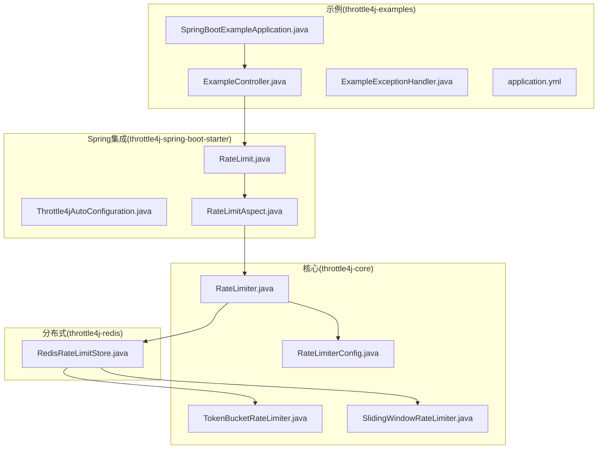
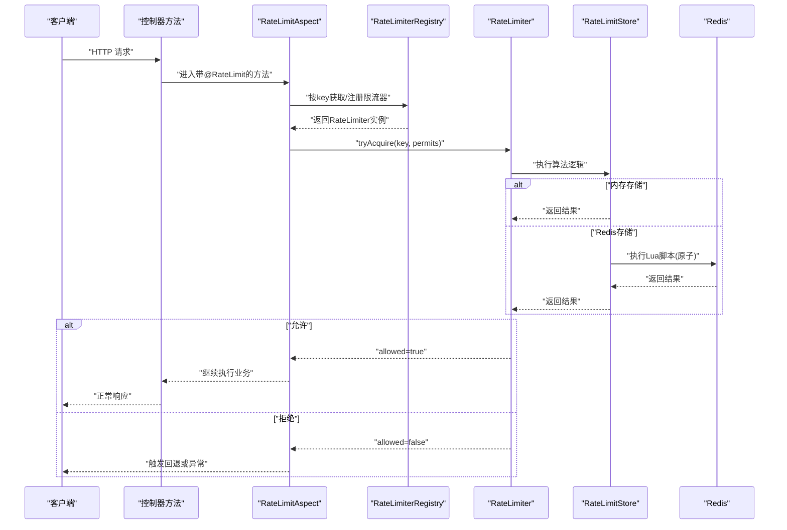
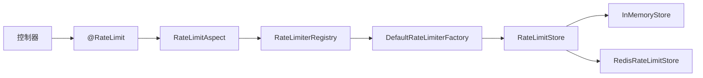

# 示例与最佳实践

<cite>
**本文引用的文件**
- [README.md](file://README.md)
- [SpringBootExampleApplication.java](file://throttle4j-examples/src/main/java/com/throttle4j/example/SpringBootExampleApplication.java)
- [BasicUsageExample.java](file://throttle4j-examples/src/main/java/com/throttle4j/example/BasicUsageExample.java)
- [ExampleController.java](file://throttle4j-examples/src/main/java/com/throttle4j/example/ExampleController.java)
- [ExampleExceptionHandler.java](file://throttle4j-examples/src/main/java/com/throttle4j/example/ExampleExceptionHandler.java)
- [application.yml](file://throttle4j-examples/src/main/resources/application.yml)
- [RateLimiter.java](file://throttle4j-core/src/main/java/com/throttle4j/core/RateLimiter.java)
- [RateLimiterConfig.java](file://throttle4j-core/src/main/java/com/throttle4j/core/RateLimiterConfig.java)
- [TokenBucketRateLimiter.java](file://throttle4j-core/src/main/java/com/throttle4j/algorithm/TokenBucketRateLimiter.java)
- [SlidingWindowRateLimiter.java](file://throttle4j-core/src/main/java/com/throttle4j/algorithm/SlidingWindowRateLimiter.java)
- [RateLimit.java](file://throttle4j-spring-boot-starter/src/main/java/com/throttle4j/spring/annotation/RateLimit.java)
- [Throttle4jAutoConfiguration.java](file://throttle4j-spring-boot-starter/src/main/java/com/throttle4j/spring/autoconfigure/Throttle4jAutoConfiguration.java)
- [RateLimitAspect.java](file://throttle4j-spring-boot-starter/src/main/java/com/throttle4j/spring/aop/RateLimitAspect.java)
- [RedisRateLimitStore.java](file://throttle4j-redis/src/main/java/com/throttle4j/redis/RedisRateLimitStore.java)
- [TokenBucketRateLimiterTest.java](file://throttle4j-core/src/test/java/com/throttle4j/algorithm/TokenBucketRateLimiterTest.java)
</cite>

## 目录
1. [简介](#简介)
2. [项目结构](#项目结构)
3. [核心组件](#核心组件)
4. [架构总览](#架构总览)
5. [详细组件分析](#详细组件分析)
6. [依赖关系分析](#依赖关系分析)
7. [性能考虑](#性能考虑)
8. [故障排查指南](#故障排查指南)
9. [结论](#结论)
10. [附录：完整示例清单与最佳实践](#附录完整示例清单与最佳实践)

## 简介
本指南面向希望在生产环境中稳定使用 throttle4j 的开发者，提供从入门到进阶的示例与最佳实践。内容覆盖：
- 四大限流算法的实际应用场景与配置要点
- 编程式与声明式两种集成方式
- 与 Spring Boot 组件（Spring Security、Actuator）的协同模式
- 性能优化、内存与并发策略
- 常见问题与调试技巧
- 生产部署的监控、日志与故障恢复建议
- 完整测试策略与质量保障

## 项目结构
throttle4j 采用多模块设计，核心能力集中在 core 模块，分布式能力通过 redis 模块扩展，Spring Boot 集成由 starter 模块提供零配置自动装配与 AOP/拦截器支持；examples 提供可运行示例。

图表来源
- [SpringBootExampleApplication.java:1-19](file://throttle4j-examples/src/main/java/com/throttle4j/example/SpringBootExampleApplication.java#L1-L19)
- [ExampleController.java:1-36](file://throttle4j-examples/src/main/java/com/throttle4j/example/ExampleController.java#L1-L36)
- [ExampleExceptionHandler.java:1-26](file://throttle4j-examples/src/main/java/com/throttle4j/example/ExampleExceptionHandler.java#L1-L26)
- [application.yml:1-10](file://throttle4j-examples/src/main/resources/application.yml#L1-L10)
- [RateLimiter.java:1-32](file://throttle4j-core/src/main/java/com/throttle4j/core/RateLimiter.java#L1-L32)
- [RateLimiterConfig.java:1-113](file://throttle4j-core/src/main/java/com/throttle4j/core/RateLimiterConfig.java#L1-L113)
- [TokenBucketRateLimiter.java:1-16](file://throttle4j-core/src/main/java/com/throttle4j/algorithm/TokenBucketRateLimiter.java#L1-L16)
- [SlidingWindowRateLimiter.java:1-16](file://throttle4j-core/src/main/java/com/throttle4j/algorithm/SlidingWindowRateLimiter.java#L1-L16)
- [RateLimit.java:1-75](file://throttle4j-spring-boot-starter/src/main/java/com/throttle4j/spring/annotation/RateLimit.java#L1-L75)
- [Throttle4jAutoConfiguration.java:1-132](file://throttle4j-spring-boot-starter/src/main/java/com/throttle4j/spring/autoconfigure/Throttle4jAutoConfiguration.java#L1-L132)
- [RateLimitAspect.java:1-186](file://throttle4j-spring-boot-starter/src/main/java/com/throttle4j/spring/aop/RateLimitAspect.java#L1-L186)
- [RedisRateLimitStore.java:1-258](file://throttle4j-redis/src/main/java/com/throttle4j/redis/RedisRateLimitStore.java#L1-L258)

章节来源
- [README.md:1-160](file://README.md#L1-L160)

## 核心组件
- RateLimiter 接口：统一的限流入口，支持按 key 申请单个或多个配额，并返回包含剩余配额、重试时间等信息的结果。
- RateLimiterConfig：不可变配置对象，构建时进行参数校验，确保算法参数合法。
- 算法实现：基于存储抽象的四种算法实现类（固定窗口、滑动窗口、令牌桶、漏桶），均以线程安全的方式工作。
- 存储层：核心提供内存存储；Redis 模块提供分布式原子 Lua 脚本实现。
- Spring 注解与 AOP：@RateLimit 提供声明式限流；AOP 切面负责解析注解、计算 key、调用限流器并处理拒绝后的回退或异常抛出。
- 自动装配：根据配置选择本地或 Redis 存储，注册工厂与注册表，暴露 AOP 切面。

章节来源
- [RateLimiter.java:1-32](file://throttle4j-core/src/main/java/com/throttle4j/core/RateLimiter.java#L1-L32)
- [RateLimiterConfig.java:1-113](file://throttle4j-core/src/main/java/com/throttle4j/core/RateLimiterConfig.java#L1-L113)
- [TokenBucketRateLimiter.java:1-16](file://throttle4j-core/src/main/java/com/throttle4j/algorithm/TokenBucketRateLimiter.java#L1-L16)
- [SlidingWindowRateLimiter.java:1-16](file://throttle4j-core/src/main/java/com/throttle4j/algorithm/SlidingWindowRateLimiter.java#L1-L16)
- [RateLimit.java:1-75](file://throttle4j-spring-boot-starter/src/main/java/com/throttle4j/spring/annotation/RateLimit.java#L1-L75)
- [Throttle4jAutoConfiguration.java:1-132](file://throttle4j-spring-boot-starter/src/main/java/com/throttle4j/spring/autoconfigure/Throttle4jAutoConfiguration.java#L1-L132)
- [RateLimitAspect.java:1-186](file://throttle4j-spring-boot-starter/src/main/java/com/throttle4j/spring/aop/RateLimitAspect.java#L1-L186)
- [RedisRateLimitStore.java:1-258](file://throttle4j-redis/src/main/java/com/throttle4j/redis/RedisRateLimitStore.java#L1-L258)

## 架构总览
下图展示了从应用代码到限流执行的关键路径，以及与 Redis 的交互方式。

图表来源
- [RateLimitAspect.java:68-91](file://throttle4j-spring-boot-starter/src/main/java/com/throttle4j/spring/aop/RateLimitAspect.java#L68-L91)
- [Throttle4jAutoConfiguration.java:105-130](file://throttle4j-spring-boot-starter/src/main/java/com/throttle4j/spring/autoconfigure/Throttle4jAutoConfiguration.java#L105-L130)
- [RedisRateLimitStore.java:80-110](file://throttle4j-redis/src/main/java/com/throttle4j/redis/RedisRateLimitStore.java#L80-L110)

## 详细组件分析

### 组件一：编程式限流（核心 API）
- 典型场景：不依赖 Spring 的纯 Java 应用，需要细粒度控制限流器生命周期与存储。
- 关键点：
  - 使用默认工厂创建限流器，共享内存存储。
  - 通过配置对象指定算法、限额、窗口与补充速率。
  - 观察 RateLimitResult 中的允许状态、剩余配额与重试时间提示。
- 示例参考：
  - [BasicUsageExample.java:30-101](file://throttle4j-examples/src/main/java/com/throttle4j/example/BasicUsageExample.java#L30-L101)

章节来源
- [BasicUsageExample.java:1-101](file://throttle4j-examples/src/main/java/com/throttle4j/example/BasicUsageExample.java#L1-L101)
- [RateLimiter.java:1-32](file://throttle4j-core/src/main/java/com/throttle4j/core/RateLimiter.java#L1-L32)
- [RateLimiterConfig.java:38-111](file://throttle4j-core/src/main/java/com/throttle4j/core/RateLimiterConfig.java#L38-L111)

### 组件二：声明式限流（Spring Boot）
- 典型场景：REST 控制器方法上直接标注 @RateLimit，零样板代码。
- 关键点：
  - 支持 SpEL 表达式生成动态 key。
  - 可配置算法、窗口、限额、每次调用消耗配额数。
  - 拒绝后可回退到同 Bean 内的指定回退方法，或抛出限流异常。
- 示例参考：
  - [ExampleController.java:1-36](file://throttle4j-examples/src/main/java/com/throttle4j/example/ExampleController.java#L1-L36)
  - [RateLimit.java:1-75](file://throttle4j-spring-boot-starter/src/main/java/com/throttle4j/spring/annotation/RateLimit.java#L1-L75)
  - [RateLimitAspect.java:68-91](file://throttle4j-spring-boot-starter/src/main/java/com/throttle4j/spring/aop/RateLimitAspect.java#L68-L91)

章节来源
- [ExampleController.java:1-36](file://throttle4j-examples/src/main/java/com/throttle4j/example/ExampleController.java#L1-L36)
- [RateLimit.java:1-75](file://throttle4j-spring-boot-starter/src/main/java/com/throttle4j/spring/annotation/RateLimit.java#L1-L75)
- [RateLimitAspect.java:1-186](file://throttle4j-spring-boot-starter/src/main/java/com/throttle4j/spring/aop/RateLimitAspect.java#L1-L186)

### 组件三：自动装配与存储选择
- 典型场景：Spring Boot 启动时自动装配，按配置选择内存或 Redis 存储。
- 关键点：
  - 当 storeType=redis 且 Redis 模块在类路径时，尝试反射构造 Redis 存储；否则回退到内存存储。
  - 默认注册工厂与注册表，暴露 AOP 切面。
- 示例参考：
  - [Throttle4jAutoConfiguration.java:45-99](file://throttle4j-spring-boot-starter/src/main/java/com/throttle4j/spring/autoconfigure/Throttle4jAutoConfiguration.java#L45-L99)
  - [application.yml:4-10](file://throttle4j-examples/src/main/resources/application.yml#L4-L10)

章节来源
- [Throttle4jAutoConfiguration.java:1-132](file://throttle4j-spring-boot-starter/src/main/java/com/throttle4j/spring/autoconfigure/Throttle4jAutoConfiguration.java#L1-L132)
- [application.yml:1-10](file://throttle4j-examples/src/main/resources/application.yml#L1-L10)

### 组件四：Redis 分布式存储与 Lua 原子脚本
- 典型场景：多实例部署下的全局限流，要求原子性与一致性。
- 关键点：
  - 三种算法的 Lua 脚本在 Redis 侧原子执行，避免竞态。
  - 提供固定窗口、滑动窗口（有序集合近似）、令牌桶（含漏桶建模）。
  - 支持自定义 key 前缀，便于多应用隔离。
- 示例参考：
  - [RedisRateLimitStore.java:40-110](file://throttle4j-redis/src/main/java/com/throttle4j/redis/RedisRateLimitStore.java#L40-L110)

章节来源
- [RedisRateLimitStore.java:1-258](file://throttle4j-redis/src/main/java/com/throttle4j/redis/RedisRateLimitStore.java#L1-L258)

### 组件五：异常处理与标准响应头
- 典型场景：将限流异常转换为 HTTP 429，并携带 Retry-After 等标准头部。
- 关键点：
  - 使用全局异常处理器捕获限流异常，计算 Retry-After 秒数。
  - 返回标准化错误消息。
- 示例参考：
  - [ExampleExceptionHandler.java:1-26](file://throttle4j-examples/src/main/java/com/throttle4j/example/ExampleExceptionHandler.java#L1-L26)

章节来源
- [ExampleExceptionHandler.java:1-26](file://throttle4j-examples/src/main/java/com/throttle4j/example/ExampleExceptionHandler.java#L1-L26)

### 组件六：算法行为与并发验证（测试参考）
- 典型场景：验证令牌桶突发容量、随时间补充、并发下不越界等行为。
- 关键点：
  - 并发场景下，允许数应落在容量边界内，体现线程安全与原子性。
  - 多配额消费正确反映剩余配额。
- 示例参考：
  - [TokenBucketRateLimiterTest.java:1-115](file://throttle4j-core/src/test/java/com/throttle4j/algorithm/TokenBucketRateLimiterTest.java#L1-L115)

章节来源
- [TokenBucketRateLimiterTest.java:1-115](file://throttle4j-core/src/test/java/com/throttle4j/algorithm/TokenBucketRateLimiterTest.java#L1-L115)

## 依赖关系分析
- 模块耦合：
  - core 无 Spring 依赖，仅依赖 store 抽象。
  - redis 模块依赖 lettuce 与 Lua 脚本，提供分布式能力。
  - starter 依赖 core，并通过反射尝试加载 redis 实现，保持可选依赖。
- 关键依赖链路：
  - 控制器 → @RateLimit → AOP → Registry → RateLimiter → Store → Redis/Lua 或 InMemoryStore。

图表来源
- [RateLimitAspect.java:68-100](file://throttle4j-spring-boot-starter/src/main/java/com/throttle4j/spring/aop/RateLimitAspect.java#L68-L100)
- [Throttle4jAutoConfiguration.java:105-130](file://throttle4j-spring-boot-starter/src/main/java/com/throttle4j/spring/autoconfigure/Throttle4jAutoConfiguration.java#L105-L130)
- [RedisRateLimitStore.java:40-78](file://throttle4j-redis/src/main/java/com/throttle4j/redis/RedisRateLimitStore.java#L40-L78)

## 性能考虑
- 算法选择
  - 令牌桶：适合突发流量但需维持平均速率，吞吐高、内存低。
  - 滑动窗口：公平分配窗口内配额，精度高、吞吐中等。
  - 漏桶：严格控制出站速率，吞吐中等、内存低。
  - 固定窗口：最简单但边界抖动明显，适合粗粒度配额。
- 配置调优
  - 令牌桶 refillRate 建议按 limit/window 计算，避免过小导致频繁等待。
  - 窗口单位使用秒级或分钟级，避免过短窗口带来过多重置开销。
- 存储与并发
  - 单机场景优先内存存储，减少网络延迟。
  - 多实例场景使用 Redis，确保原子脚本与 key 前缀隔离。
  - Redis 连接池与超时合理设置，避免阻塞影响业务。
- 结果复用
  - 在高并发下，尽量减少重复计算 key 与配置构建，利用注册表缓存已存在的限流器。

## 故障排查指南
- 现象：Redis 不可用导致限流失败
  - 现象说明：Redis 模块在类路径时尝试构造 Redis 存储，失败则回退内存存储。
  - 处理建议：检查 Redis 连接参数与可达性；确认 Lua 脚本资源存在。
  - 参考实现：[Throttle4jAutoConfiguration.java:66-99](file://throttle4j-spring-boot-starter/src/main/java/com/throttle4j/spring/autoconfigure/Throttle4jAutoConfiguration.java#L66-L99)
- 现象：@RateLimit 注解未生效
  - 现象说明：未启用 throttle4j 或未扫描到切面。
  - 处理建议：确认配置开关开启、类路径包含 starter；确保目标方法为可注入 Bean。
  - 参考实现：[Throttle4jAutoConfiguration.java:27-30](file://throttle4j-spring-boot-starter/src/main/java/com/throttle4j/spring/autoconfigure/Throttle4jAutoConfiguration.java#L27-L30)
- 现象：限流异常未被转换为 429
  - 现象说明：未配置全局异常处理器或 fallbackMethod 未找到。
  - 处理建议：添加异常处理器或确保回退方法签名一致。
  - 参考实现：[ExampleExceptionHandler.java:1-26](file://throttle4j-examples/src/main/java/com/throttle4j/example/ExampleExceptionHandler.java#L1-L26)

章节来源
- [Throttle4jAutoConfiguration.java:66-99](file://throttle4j-spring-boot-starter/src/main/java/com/throttle4j/spring/autoconfigure/Throttle4jAutoConfiguration.java#L66-L99)
- [ExampleExceptionHandler.java:1-26](file://throttle4j-examples/src/main/java/com/throttle4j/example/ExampleExceptionHandler.java#L1-L26)

## 结论
throttle4j 提供了轻量、高性能且可扩展的限流方案。通过核心算法与可插拔存储，结合 Spring Boot 的零配置自动装配，开发者可以快速落地 API 限流、数据库查询限制、缓存访问控制等场景。生产环境建议优先评估算法与配置，配合 Redis 原子脚本实现分布式一致性，并完善监控与日志以保障稳定性。

## 附录：完整示例清单与最佳实践

### 示例清单
- 编程式限流（核心 API）
  - 示例文件：[BasicUsageExample.java:1-101](file://throttle4j-examples/src/main/java/com/throttle4j/example/BasicUsageExample.java#L1-L101)
  - 适用场景：非 Spring 环境或需要精细控制存储与工厂的场景。
- 声明式限流（Spring Boot）
  - 示例文件：[ExampleController.java:1-36](file://throttle4j-examples/src/main/java/com/throttle4j/example/ExampleController.java#L1-L36)
  - 适用场景：REST 控制器方法级限流，零样板代码。
- 异常处理与标准响应头
  - 示例文件：[ExampleExceptionHandler.java:1-26](file://throttle4j-examples/src/main/java/com/throttle4j/example/ExampleExceptionHandler.java#L1-L26)
  - 适用场景：统一 429 响应与 Retry-After 头部。
- Spring Boot 启动入口
  - 示例文件：[SpringBootExampleApplication.java:1-19](file://throttle4j-examples/src/main/java/com/throttle4j/example/SpringBootExampleApplication.java#L1-L19)
  - 适用场景：本地运行示例服务，端口 8080。
- 配置示例
  - 示例文件：[application.yml:1-10](file://throttle4j-examples/src/main/resources/application.yml#L1-L10)
  - 适用场景：切换 store 类型、设置默认算法与限额。

### 最佳实践
- 算法选择
  - API 网关：优先令牌桶，兼顾突发与平均速率。
  - 公平性要求高：滑动窗口。
  - 出站速率恒定：漏桶（以令牌桶等效实现）。
  - 粗粒度配额：固定窗口。
- 配置建议
  - 令牌桶 refillRate ≈ limit/window，避免过小导致频繁等待。
  - 窗口单位使用 s/m，避免过短窗口。
  - Redis key 前缀隔离多应用，防止键冲突。
- 并发与性能
  - 使用注册表缓存限流器，避免重复创建。
  - Redis 连接池与超时合理配置，避免阻塞。
  - 对热点 key 做分片或降级策略。
- 与 Spring 组件集成
  - Spring Security：在认证之后、授权之前执行限流，避免绕过。
  - Actuator：暴露健康检查与指标，结合外部监控系统。
- 测试策略
  - 单元测试：验证算法边界（突发、补充、并发越界）。
  - 集成测试：模拟多实例与 Redis 原子脚本一致性。
  - 压力测试：评估不同算法在高并发下的延迟与吞吐。
- 生产部署
  - 监控：关注限流命中率、拒绝率、Redis 延迟与错误。
  - 日志：记录 key 解析失败、回退方法缺失、Redis 初始化异常。
  - 故障恢复：启用 Redis 失败回退至内存存储，确保基本限流能力。