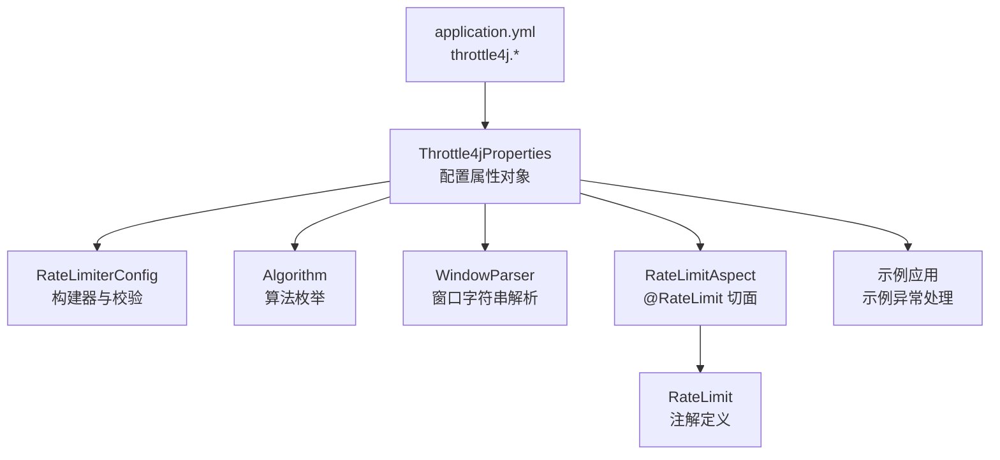
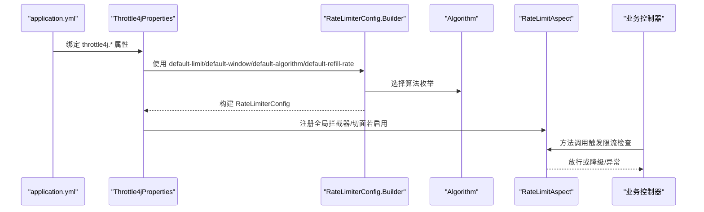
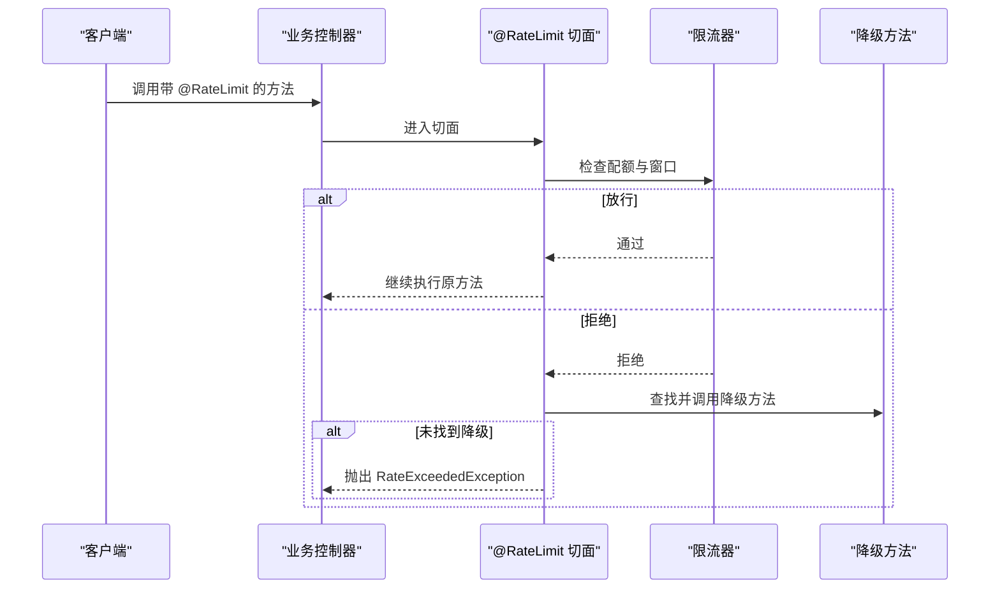
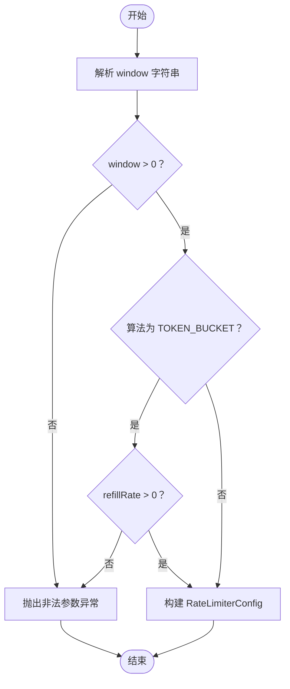

# 配置示例

<cite>
**本文引用的文件**
- [application.yml](file://throttle4j-examples/src/main/resources/application.yml)
- [Throttle4jProperties.java](file://throttle4j-spring-boot-starter/src/main/java/com/throttle4j/spring/autoconfigure/Throttle4jProperties.java)
- [RateLimiterConfig.java](file://throttle4j-core/src/main/java/com/throttle4j/core/RateLimiterConfig.java)
- [Algorithm.java](file://throttle4j-core/src/main/java/com/throttle4j/core/Algorithm.java)
- [WindowParser.java](file://throttle4j-spring-boot-starter/src/main/java/com/throttle4j/spring/util/WindowParser.java)
- [RateLimit.java](file://throttle4j-spring-boot-starter/src/main/java/com/throttle4j/spring/annotation/RateLimit.java)
- [RateLimitAspect.java](file://throttle4j-spring-boot-starter/src/main/java/com/throttle4j/spring/aop/RateLimitAspect.java)
- [ExampleExceptionHandler.java](file://throttle4j-examples/src/main/java/com/throttle4j/example/ExampleExceptionHandler.java)
</cite>

## 目录
1. [简介](#简介)
2. [项目结构与配置入口](#项目结构与配置入口)
3. [核心配置项总览](#核心配置项总览)
4. [架构概览与配置映射](#架构概览与配置映射)
5. [详细配置示例与场景说明](#详细配置示例与场景说明)
6. [算法与存储后端配置](#算法与存储后端配置)
7. [差异化API限流配置](#差异化api限流配置)
8. [依赖关系与配置约束](#依赖关系与配置约束)
9. [性能与容量规划建议](#性能与容量规划建议)
10. [配置验证与调试指南](#配置验证与调试指南)
11. [结论](#结论)

## 简介
本文件面向使用 throttle4j 的开发者，系统性地梳理在 Spring Boot 环境下通过 application.yml 进行限流配置的方法与最佳实践。内容覆盖：
- 全局限流配置项与默认行为
- 算法选择（固定窗口、滑动窗口、令牌桶、漏桶）
- 存储后端（内存与 Redis）配置要点
- 不同环境（开发、测试、生产）的配置差异
- 基于注解的差异化 API 限流策略
- 配置校验与常见问题排查方法

## 项目结构与配置入口
throttle4j 在 Spring Boot 中通过自动配置类将配置前缀 throttle4j 映射到 Java 对象，再驱动限流器工厂与拦截器/切面工作。

图表来源
- [Throttle4jProperties.java:1-202](file://throttle4j-spring-boot-starter/src/main/java/com/throttle4j/spring/autoconfigure/Throttle4jProperties.java#L1-L202)
- [RateLimiterConfig.java:1-113](file://throttle4j-core/src/main/java/com/throttle4j/core/RateLimiterConfig.java#L1-L113)
- [Algorithm.java:1-16](file://throttle4j-core/src/main/java/com/throttle4j/core/Algorithm.java#L1-L16)
- [WindowParser.java:1-76](file://throttle4j-spring-boot-starter/src/main/java/com/throttle4j/spring/util/WindowParser.java#L1-L76)
- [RateLimit.java:1-75](file://throttle4j-spring-boot-starter/src/main/java/com/throttle4j/spring/annotation/RateLimit.java#L1-L75)
- [RateLimitAspect.java:155-185](file://throttle4j-spring-boot-starter/src/main/java/com/throttle4j/spring/aop/RateLimitAspect.java#L155-L185)
- [ExampleExceptionHandler.java:1-25](file://throttle4j-examples/src/main/java/com/throttle4j/example/ExampleExceptionHandler.java#L1-L25)

章节来源
- [application.yml:1-10](file://throttle4j-examples/src/main/resources/application.yml#L1-L10)
- [Throttle4jProperties.java:1-202](file://throttle4j-spring-boot-starter/src/main/java/com/throttle4j/spring/autoconfigure/Throttle4jProperties.java#L1-L202)

## 核心配置项总览
以下为 throttle4j 在 application.yml 中的关键配置项及其含义（基于自动配置属性类）：

- throttle4j.enabled：总开关，默认启用
- throttle4j.default-algorithm：全局默认算法，默认 TOKEN_BUCKET
- throttle4j.default-limit：全局默认配额数，默认 100
- throttle4j.default-window：全局默认时间窗口，默认 1m
- throttle4j.default-refill-rate：令牌桶补充速率（每秒），默认 10
- throttle4j.store-type：存储类型，MEMORY 或 REDIS
- throttle4j.web.enabled：是否启用全局 Web 拦截器，默认 false
- throttle4j.web.include-patterns：包含路径模式，默认 ["/**"]
- throttle4j.web.exclude-patterns：排除路径模式，默认空数组
- throttle4j.redis.host/port/password/database/key-prefix：Redis 连接与键前缀

章节来源
- [Throttle4jProperties.java:12-98](file://throttle4j-spring-boot-starter/src/main/java/com/throttle4j/spring/autoconfigure/Throttle4jProperties.java#L12-L98)
- [Throttle4jProperties.java:113-147](file://throttle4j-spring-boot-starter/src/main/java/com/throttle4j/spring/autoconfigure/Throttle4jProperties.java#L113-L147)
- [Throttle4jProperties.java:153-200](file://throttle4j-spring-boot-starter/src/main/java/com/throttle4j/spring/autoconfigure/Throttle4jProperties.java#L153-L200)
- [application.yml:4-10](file://throttle4j-examples/src/main/resources/application.yml#L4-L10)

## 架构概览与配置映射
throttle4j 的配置从 YAML 文件读取，映射到 Throttle4jProperties；随后由自动配置类根据配置创建 RateLimiter 实例、注册拦截器或切面，并在运行时生效。

图表来源
- [Throttle4jProperties.java:36-98](file://throttle4j-spring-boot-starter/src/main/java/com/throttle4j/spring/autoconfigure/Throttle4jProperties.java#L36-L98)
- [RateLimiterConfig.java:38-111](file://throttle4j-core/src/main/java/com/throttle4j/core/RateLimiterConfig.java#L38-L111)
- [Algorithm.java:6-15](file://throttle4j-core/src/main/java/com/throttle4j/core/Algorithm.java#L6-L15)
- [RateLimitAspect.java:155-185](file://throttle4j-spring-boot-starter/src/main/java/com/throttle4j/spring/aop/RateLimitAspect.java#L155-L185)

## 详细配置示例与场景说明
以下示例以“片段路径”形式给出，避免直接粘贴配置内容。请在对应文件中查看与复制。

- 开发环境（本地调试）
  - 启用全局拦截器，便于统一观察限流效果
  - 使用较宽松的默认配额与窗口
  - 存储类型：memory
  - 参考片段路径：
    - [application.yml:1-10](file://throttle4j-examples/src/main/resources/application.yml#L1-L10)
    - [Throttle4jProperties.java:113-147](file://throttle4j-spring-boot-starter/src/main/java/com/throttle4j/spring/autoconfigure/Throttle4jProperties.java#L113-L147)

- 测试环境（集成测试）
  - 关闭全局拦截器，仅通过注解控制重点接口
  - 将默认算法设为更平滑的令牌桶，提升吞吐稳定性
  - 存储类型：memory 或 REDIS（按测试需求）
  - 参考片段路径：
    - [Throttle4jProperties.java:12-98](file://throttle4j-spring-boot-starter/src/main/java/com/throttle4j/spring/autoconfigure/Throttle4jProperties.java#L12-L98)
    - [Throttle4jProperties.java:153-200](file://throttle4j-spring-boot-starter/src/main/java/com/throttle4j/spring/autoconfigure/Throttle4jProperties.java#L153-L200)

- 生产环境（高并发/多实例）
  - 必须使用 REDIS 存储，确保跨实例共享状态
  - 明确设置 key-prefix，避免键冲突
  - 为热点接口单独配置注解限流，降低全局影响
  - 参考片段路径：
    - [Throttle4jProperties.java:103-108](file://throttle4j-spring-boot-starter/src/main/java/com/throttle4j/spring/autoconfigure/Throttle4jProperties.java#L103-L108)
    - [Throttle4jProperties.java:153-200](file://throttle4j-spring-boot-starter/src/main/java/com/throttle4j/spring/autoconfigure/Throttle4jProperties.java#L153-L200)

## 算法与存储后端配置
- 算法枚举
  - 支持：FIXED_WINDOW、SLIDING_WINDOW、TOKEN_BUCKET、LEAKY_BUCKET
  - 默认算法：TOKEN_BUCKET
  - 参考片段路径：
    - [Algorithm.java:6-15](file://throttle4j-core/src/main/java/com/throttle4j/core/Algorithm.java#L6-L15)
    - [Throttle4jProperties.java:16](file://throttle4j-spring-boot-starter/src/main/java/com/throttle4j/spring/autoconfigure/Throttle4jProperties.java#L16)

- 存储后端
  - MEMORY：单进程内存存储，适合本地与测试
  - REDIS：分布式存储，需引入 throttle4j-redis 依赖
  - 参考片段路径：
    - [Throttle4jProperties.java:103-108](file://throttle4j-spring-boot-starter/src/main/java/com/throttle4j/spring/autoconfigure/Throttle4jProperties.java#L103-L108)

- 时间窗口解析
  - 支持 1m、1s、30s、1h、1d 等简写，或纯数字毫秒
  - 解析逻辑由 WindowParser 提供
  - 参考片段路径：
    - [WindowParser.java:29-75](file://throttle4j-spring-boot-starter/src/main/java/com/throttle4j/spring/util/WindowParser.java#L29-L75)

## 差异化API限流配置
- 全局默认策略
  - 通过 throttle4j.default-* 控制全局默认值
  - 参考片段路径：
    - [Throttle4jProperties.java:12-74](file://throttle4j-spring-boot-starter/src/main/java/com/throttle4j/spring/autoconfigure/Throttle4jProperties.java#L12-L74)

- 基于注解的局部策略
  - 使用 @RateLimit 对方法进行声明式限流
  - 支持 limit、window、algorithm、permits、key、fallbackMethod 等属性
  - 参考片段路径：
    - [RateLimit.java:26-74](file://throttle4j-spring-boot-starter/src/main/java/com/throttle4j/spring/annotation/RateLimit.java#L26-L74)

- 切面执行流程
  - 切面在方法调用前检查限流，必要时执行降级方法或抛出异常
  - 参考片段路径：
    - [RateLimitAspect.java:155-185](file://throttle4j-spring-boot-starter/src/main/java/com/throttle4j/spring/aop/RateLimitAspect.java#L155-L185)

图表来源
- [RateLimitAspect.java:155-185](file://throttle4j-spring-boot-starter/src/main/java/com/throttle4j/spring/aop/RateLimitAspect.java#L155-L185)
- [RateLimit.java:26-74](file://throttle4j-spring-boot-starter/src/main/java/com/throttle4j/spring/annotation/RateLimit.java#L26-L74)

## 依赖关系与配置约束
- 配置项与对象映射
  - throttle4j.* → Throttle4jProperties
  - Throttle4jProperties → RateLimiterConfig.Builder
  - RateLimiterConfig.Builder → Algorithm + WindowParser
- 关键约束
  - TOKEN_BUCKET 算法必须提供正数 refillRate；windowMillis 可选但建议明确
  - 非 TOKEN_BUCKET 算法必须提供正数 windowMillis
  - window 字符串必须可被 WindowParser 正确解析且 > 0
- 参考片段路径：
  - [RateLimiterConfig.java:91-111](file://throttle4j-core/src/main/java/com/throttle4j/core/RateLimiterConfig.java#L91-L111)
  - [WindowParser.java:36-75](file://throttle4j-spring-boot-starter/src/main/java/com/throttle4j/spring/util/WindowParser.java#L36-L75)

图表来源
- [RateLimiterConfig.java:91-111](file://throttle4j-core/src/main/java/com/throttle4j/core/RateLimiterConfig.java#L91-L111)
- [WindowParser.java:36-75](file://throttle4j-spring-boot-starter/src/main/java/com/throttle4j/spring/util/WindowParser.java#L36-L75)

章节来源
- [RateLimiterConfig.java:91-111](file://throttle4j-core/src/main/java/com/throttle4j/core/RateLimiterConfig.java#L91-L111)
- [WindowParser.java:36-75](file://throttle4j-spring-boot-starter/src/main/java/com/throttle4j/spring/util/WindowParser.java#L36-L75)

## 性能与容量规划建议
- 窗口与配额
  - 较短窗口 + 较大配额：瞬时峰值高，抖动较大
  - 较长窗口 + 较小配额：平滑度好，但响应延迟感增强
- 算法选择
  - 令牌桶：适合突发流量与稳定吞吐
  - 滑动窗口：计数精确，适合严格合规场景
  - 固定窗口：实现简单，边界效应明显
  - 漏桶：整形流量，削峰填谷
- 存储后端
  - 单实例：MEMORY
  - 多实例/高可用：REDIS，注意网络延迟与序列化开销
- 参考片段路径：
  - [Algorithm.java:6-15](file://throttle4j-core/src/main/java/com/throttle4j/core/Algorithm.java#L6-L15)
  - [Throttle4jProperties.java:103-108](file://throttle4j-spring-boot-starter/src/main/java/com/throttle4j/spring/autoconfigure/Throttle4jProperties.java#L103-L108)

## 配置验证与调试指南
- 快速自检清单
  - 是否正确设置 throttle4j.enabled
  - 默认算法、limit、window、refillRate 是否满足业务预期
  - 存储类型与 REDIS 连接参数是否正确
  - 全局拦截器是否按需开启
- 异常与降级
  - 未命中降级方法时会抛出 RateExceededException
  - 示例应用将其转换为 HTTP 429 并附带 Retry-After
  - 参考片段路径：
    - [RateLimitAspect.java:155-185](file://throttle4j-spring-boot-starter/src/main/java/com/throttle4j/spring/aop/RateLimitAspect.java#L155-L185)
    - [ExampleExceptionHandler.java:16-24](file://throttle4j-examples/src/main/java/com/throttle4j/example/ExampleExceptionHandler.java#L16-L24)
- 日志与可观测性
  - 关注切面日志：是否进入降级分支、拒绝原因
  - 结合业务指标（QPS、P99、错误率）评估配置合理性
- 常见问题定位
  - window 表达式不合法：检查单位与数值格式
  - TOKEN_BUCKET 缺少 refillRate：补齐该配置
  - REDIS 连接失败：核对 host/port/password/database/key-prefix
  - 参考片段路径：
    - [WindowParser.java:36-75](file://throttle4j-spring-boot-starter/src/main/java/com/throttle4j/spring/util/WindowParser.java#L36-L75)
    - [Throttle4jProperties.java:153-200](file://throttle4j-spring-boot-starter/src/main/java/com/throttle4j/spring/autoconfigure/Throttle4jProperties.java#L153-L200)

## 结论
通过 throttle4j 的配置体系，可以在不侵入业务代码的前提下实现灵活、可演进的限流策略。建议以“全局默认 + 注解差异化”的方式组织配置，结合不同环境与算法特性进行容量与体验的平衡，并配合完善的异常处理与监控，持续优化限流效果。