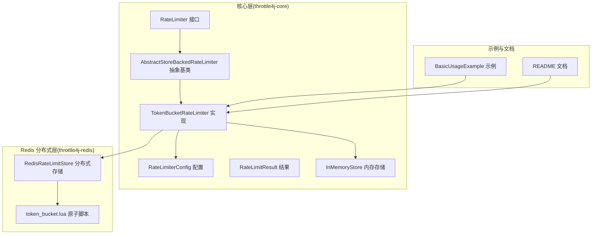
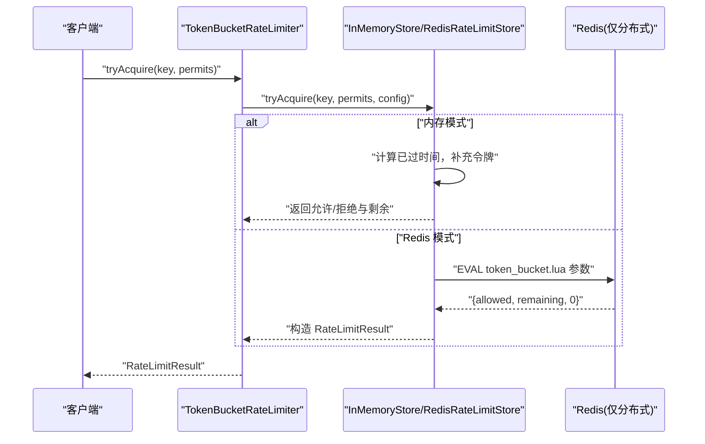
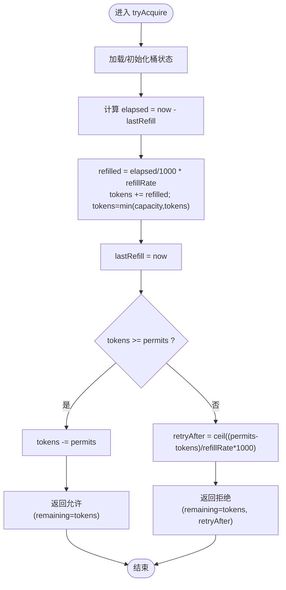
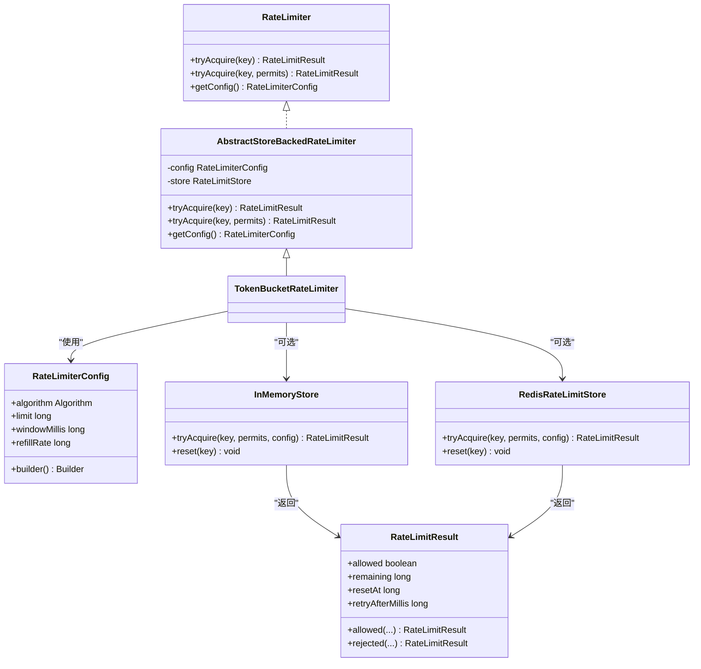
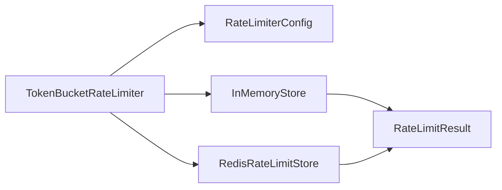

# 令牌桶算法

<cite>
**本文引用的文件**
- [TokenBucketRateLimiter.java](file://throttle4j-core/src/main/java/com/throttle4j/algorithm/TokenBucketRateLimiter.java)
- [AbstractStoreBackedRateLimiter.java](file://throttle4j-core/src/main/java/com/throttle4j/algorithm/AbstractStoreBackedRateLimiter.java)
- [RateLimiterConfig.java](file://throttle4j-core/src/main/java/com/throttle4j/core/RateLimiterConfig.java)
- [RateLimiter.java](file://throttle4j-core/src/main/java/com/throttle4j/core/RateLimiter.java)
- [RateLimitResult.java](file://throttle4j-core/src/main/java/com/throttle4j/core/RateLimitResult.java)
- [InMemoryStore.java](file://throttle4j-core/src/main/java/com/throttle4j/store/InMemoryStore.java)
- [RedisRateLimitStore.java](file://throttle4j-redis/src/main/java/com/throttle4j/redis/RedisRateLimitStore.java)
- [token_bucket.lua](file://throttle4j-redis/src/main/resources/scripts/token_bucket.lua)
- [BasicUsageExample.java](file://throttle4j-examples/src/main/java/com/throttle4j/example/BasicUsageExample.java)
- [README.md](file://README.md)
- [TokenBucketRateLimiterTest.java](file://throttle4j-core/src/test/java/com/throttle4j/algorithm/TokenBucketRateLimiterTest.java)
- [RedisRateLimitStoreTest.java](file://throttle4j-redis/src/test/java/com/throttle4j/redis/RedisRateLimitStoreTest.java)
- [Algorithm.java](file://throttle4j-core/src/main/java/com/throttle4j/core/Algorithm.java)
</cite>

## 目录
1. [引言](#引言)
2. [项目结构](#项目结构)
3. [核心组件](#核心组件)
4. [架构总览](#架构总览)
5. [详细组件分析](#详细组件分析)
6. [依赖关系分析](#依赖关系分析)
7. [性能考量](#性能考量)
8. [故障排查指南](#故障排查指南)
9. [结论](#结论)
10. [附录：使用示例与参数调优](#附录使用示例与参数调优)

## 引言
本文件围绕令牌桶（Token Bucket）算法进行深入技术解析，结合 throttle4j 项目的源码实现，系统阐述其数学模型、物理意义、状态管理、请求处理流程、Redis 原子化 Lua 脚本实现、参数调优策略、性能特征与使用示例。读者可据此在单机或分布式场景中正确选择与部署令牌桶限流方案。

## 项目结构
throttle4j 将限流能力按模块拆分：
- throttle4j-core：算法与 API、内存存储、配置模型
- throttle4j-redis：基于 Redis 的分布式存储，内置 Lua 脚本保证原子性
- throttle4j-spring-boot-starter：自动装配、注解拦截与 Web 层集成
- throttle4j-examples：示例程序与演示用法

图表来源
- [TokenBucketRateLimiter.java:10-15](file://throttle4j-core/src/main/java/com/throttle4j/algorithm/TokenBucketRateLimiter.java#L10-L15)
- [AbstractStoreBackedRateLimiter.java:14-41](file://throttle4j-core/src/main/java/com/throttle4j/algorithm/AbstractStoreBackedRateLimiter.java#L14-L41)
- [InMemoryStore.java:24-315](file://throttle4j-core/src/main/java/com/throttle4j/store/InMemoryStore.java#L24-L315)
- [RedisRateLimitStore.java:40-258](file://throttle4j-redis/src/main/java/com/throttle4j/redis/RedisRateLimitStore.java#L40-L258)
- [token_bucket.lua:1-58](file://throttle4j-redis/src/main/resources/scripts/token_bucket.lua#L1-L58)
- [BasicUsageExample.java:24-101](file://throttle4j-examples/src/main/java/com/throttle4j/example/BasicUsageExample.java#L24-L101)

章节来源
- [README.md:76-102](file://README.md#L76-L102)

## 核心组件
- 算法接口与实现
  - RateLimiter 定义统一的 tryAcquire 接口
  - AbstractStoreBackedRateLimiter 提供通用委托到存储的实现
  - TokenBucketRateLimiter 作为令牌桶的具体实现
- 存储抽象
  - RateLimitStore：定义 tryAcquire 与 reset
  - InMemoryStore：单机内存实现，支持固定窗口、滑动窗口、令牌桶、漏桶四种算法
  - RedisRateLimitStore：分布式实现，通过 Lua 脚本原子执行
- 配置与结果
  - RateLimiterConfig：封装算法类型、配额上限、时间窗、补充速率等
  - RateLimitResult：返回允许/拒绝、剩余配额、重置时间、重试等待

章节来源
- [RateLimiter.java:8-31](file://throttle4j-core/src/main/java/com/throttle4j/core/RateLimiter.java#L8-L31)
- [AbstractStoreBackedRateLimiter.java:14-41](file://throttle4j-core/src/main/java/com/throttle4j/algorithm/AbstractStoreBackedRateLimiter.java#L14-L41)
- [TokenBucketRateLimiter.java:10-15](file://throttle4j-core/src/main/java/com/throttle4j/algorithm/TokenBucketRateLimiter.java#L10-L15)
- [RateLimiterConfig.java:8-113](file://throttle4j-core/src/main/java/com/throttle4j/core/RateLimiterConfig.java#L8-L113)
- [RateLimitResult.java:6-68](file://throttle4j-core/src/main/java/com/throttle4j/core/RateLimitResult.java#L6-L68)
- [InMemoryStore.java:24-315](file://throttle4j-core/src/main/java/com/throttle4j/store/InMemoryStore.java#L24-L315)
- [RedisRateLimitStore.java:40-258](file://throttle4j-redis/src/main/java/com/throttle4j/redis/RedisRateLimitStore.java#L40-L258)

## 架构总览
throttle4j 的令牌桶在单机与分布式两种形态下均采用“状态存储 + 算法逻辑”的分层设计：
- 单机：InMemoryStore 在内存中维护每个 key 的令牌桶状态，按需懒惰补给
- 分布式：RedisRateLimitStore 将状态与补给逻辑下沉到 Redis，通过 Lua 原子脚本保证一致性

图表来源
- [TokenBucketRateLimiter.java:10-15](file://throttle4j-core/src/main/java/com/throttle4j/algorithm/TokenBucketRateLimiter.java#L10-L15)
- [AbstractStoreBackedRateLimiter.java:24-35](file://throttle4j-core/src/main/java/com/throttle4j/algorithm/AbstractStoreBackedRateLimiter.java#L24-L35)
- [InMemoryStore.java:214-236](file://throttle4j-core/src/main/java/com/throttle4j/store/InMemoryStore.java#L214-L236)
- [RedisRateLimitStore.java:165-191](file://throttle4j-redis/src/main/java/com/throttle4j/redis/RedisRateLimitStore.java#L165-L191)
- [token_bucket.lua:1-58](file://throttle4j-redis/src/main/resources/scripts/token_bucket.lua#L1-L58)

## 详细组件分析

### 数学模型与物理意义
- 桶容量（capacity）：令牌桶的最大令牌数，决定瞬时突发能力
- 补充速率（refillRate）：每秒新增令牌数量，决定平均速率
- 令牌消费：每次请求消耗 permits 个令牌；若桶内令牌不足，则拒绝并给出重试等待时间
- 懒惰补给：每次请求时才根据“已过时间”计算补充，避免后台调度开销

章节来源
- [InMemoryStore.java:214-236](file://throttle4j-core/src/main/java/com/throttle4j/store/InMemoryStore.java#L214-L236)
- [RateLimiterConfig.java:10-20](file://throttle4j-core/src/main/java/com/throttle4j/core/RateLimiterConfig.java#L10-L20)

### 状态管理与请求处理
- 内存实现（InMemoryStore）
  - 使用 TokenBucketState 维护 tokens 与 lastRefillMillis
  - 每次 tryAcquire 计算 elapsedSec，按 refillRate 补充 tokens，不超过 capacity
  - 若 tokens ≥ permits 则消费并返回允许；否则计算重试等待时间并返回拒绝
- Redis 实现（RedisRateLimitStore + token_bucket.lua）
  - 通过 HMGET/HSET 读写 tokens 与 lastRefill
  - Lua 脚本原子地完成补给与消费，并设置合理的 EXPIRE TTL
  - 返回值约定为 {allowed, remaining, 0}

图表来源
- [InMemoryStore.java:214-236](file://throttle4j-core/src/main/java/com/throttle4j/store/InMemoryStore.java#L214-L236)
- [token_bucket.lua:17-57](file://throttle4j-redis/src/main/resources/scripts/token_bucket.lua#L17-L57)

章节来源
- [InMemoryStore.java:214-236](file://throttle4j-core/src/main/java/com/throttle4j/store/InMemoryStore.java#L214-L236)
- [RedisRateLimitStore.java:165-191](file://throttle4j-redis/src/main/java/com/throttle4j/redis/RedisRateLimitStore.java#L165-L191)
- [token_bucket.lua:1-58](file://throttle4j-redis/src/main/resources/scripts/token_bucket.lua#L1-L58)

### 与传统限流方法的区别
- 固定窗口 vs 令牌桶
  - 固定窗口在边界处易出现“边界尖刺”，令牌桶平滑突发并在平均速率上更稳定
- 滑动窗口 vs 令牌桶
  - 滑动窗口更公平地分配配额，但实现复杂度更高；令牌桶以较低内存占用提供良好的突发与平滑折中
- 漏桶 vs 令牌桶
  - 漏桶强调恒定出站速率；令牌桶强调恒定入站补充速率与突发能力

章节来源
- [README.md:103-112](file://README.md#L103-L112)

### Redis 原子化实现细节
- Lua 脚本参数
  - KEYS[1]: 限流键
  - ARGV[1]: capacity（最大令牌数）
  - ARGV[2]: refillRate（每秒补充令牌数，可为小数）
  - ARGV[3]: permits（本次请求消耗令牌数）
  - ARGV[4]: 当前毫秒时间
- 关键步骤
  - 初始化：若不存在则 tokens=capacity, lastRefill=now
  - 补给：elapsed = now - lastRefill；tokens += elapsed/1000 * refillRate，上限 capacity
  - 消费：若 tokens ≥ permits 则消费并标记 allowed=1
  - 写回：HSET 更新 tokens 与 lastRefill
  - TTL：根据 capacity/refillRate 设置安全的过期时间
  - 返回：{allowed, floor(tokens), 0}

章节来源
- [token_bucket.lua:1-58](file://throttle4j-redis/src/main/resources/scripts/token_bucket.lua#L1-L58)
- [RedisRateLimitStore.java:165-191](file://throttle4j-redis/src/main/java/com/throttle4j/redis/RedisRateLimitStore.java#L165-L191)

### 类关系图（代码级）

图表来源
- [RateLimiter.java:8-31](file://throttle4j-core/src/main/java/com/throttle4j/core/RateLimiter.java#L8-L31)
- [AbstractStoreBackedRateLimiter.java:14-41](file://throttle4j-core/src/main/java/com/throttle4j/algorithm/AbstractStoreBackedRateLimiter.java#L14-L41)
- [TokenBucketRateLimiter.java:10-15](file://throttle4j-core/src/main/java/com/throttle4j/algorithm/TokenBucketRateLimiter.java#L10-L15)
- [RateLimiterConfig.java:8-113](file://throttle4j-core/src/main/java/com/throttle4j/core/RateLimiterConfig.java#L8-L113)
- [RateLimitResult.java:6-68](file://throttle4j-core/src/main/java/com/throttle4j/core/RateLimitResult.java#L6-L68)
- [InMemoryStore.java:24-315](file://throttle4j-core/src/main/java/com/throttle4j/store/InMemoryStore.java#L24-L315)
- [RedisRateLimitStore.java:40-258](file://throttle4j-redis/src/main/java/com/throttle4j/redis/RedisRateLimitStore.java#L40-L258)

## 依赖关系分析
- 组件耦合
  - TokenBucketRateLimiter 通过抽象基类委托到存储，降低与具体存储实现的耦合
  - InMemoryStore 与 RedisRateLimitStore 共同实现 RateLimitStore，提供一致的 API
- 外部依赖
  - RedisRateLimitStore 依赖 Lettuce 的同步命令接口与 Lua 脚本加载
- 可能的循环依赖
  - 未发现直接循环依赖；算法与存储通过接口解耦

图表来源
- [TokenBucketRateLimiter.java:10-15](file://throttle4j-core/src/main/java/com/throttle4j/algorithm/TokenBucketRateLimiter.java#L10-L15)
- [AbstractStoreBackedRateLimiter.java:14-41](file://throttle4j-core/src/main/java/com/throttle4j/algorithm/AbstractStoreBackedRateLimiter.java#L14-L41)
- [InMemoryStore.java:24-315](file://throttle4j-core/src/main/java/com/throttle4j/store/InMemoryStore.java#L24-L315)
- [RedisRateLimitStore.java:40-258](file://throttle4j-redis/src/main/java/com/throttle4j/redis/RedisRateLimitStore.java#L40-L258)
- [RateLimitResult.java:6-68](file://throttle4j-core/src/main/java/com/throttle4j/core/RateLimitResult.java#L6-L68)

## 性能考量
- 延迟与吞吐
  - 令牌桶在平均速率上具有较高吞吐，在突发场景下能快速释放积压令牌，降低尾延迟
  - 内存实现无网络开销，Redis 实现受网络与脚本执行影响
- 内存占用
  - 令牌桶仅存储少量状态（tokens、lastRefill），内存占用低
- 并发与一致性
  - 内存实现通过 synchronized 保护状态更新；Redis 实现通过 Lua 原子脚本保证一致性
- 参数对性能的影响
  - capacity 越大，突发能力越强，但重置时的恢复速度与 Redis TTL 设计相关
  - refillRate 越高，平均吞吐越高，但可能增加 Redis 写压力

[本节为通用性能讨论，不直接分析特定文件]

## 故障排查指南
- 常见问题与定位
  - 请求总是被拒绝：检查 capacity 与 refillRate 是否过小；确认当前桶内 tokens 是否耗尽
  - 重试等待时间异常：核对 refillRate 与 permits 的关系；Redis 模式下注意脚本返回的 retryAfter 计算
  - Redis 连接失败：确认连接参数与网络；必要时启用降级回退（参见 README 中的降级说明）
- 单元测试参考
  - 内存模式：验证突发允许、随时间补给、并发不超限
  - Redis 模式：验证脚本参数传递、返回值格式、重试时间计算

章节来源
- [TokenBucketRateLimiterTest.java:43-114](file://throttle4j-core/src/test/java/com/throttle4j/algorithm/TokenBucketRateLimiterTest.java#L43-L114)
- [RedisRateLimitStoreTest.java:160-203](file://throttle4j-redis/src/test/java/com/throttle4j/redis/RedisRateLimitStoreTest.java#L160-L203)
- [README.md:20-22](file://README.md#L20-L22)

## 结论
throttle4j 的令牌桶实现以简洁的状态模型与懒惰补给策略兼顾了突发处理与平均速率控制，既能在单机内存中高效运行，也能通过 Redis 原子脚本实现分布式一致性。合理选择 capacity 与 refillRate，可在延迟与吞吐之间取得良好平衡，并满足不同业务场景的限流需求。

[本节为总结性内容，不直接分析特定文件]

## 附录：使用示例与参数调优

### 使用示例
- 程序化示例（内存模式）
  - 创建 InMemoryStore 与默认工厂
  - 构建令牌桶配置（limit=容量，refillRate=补充速率）
  - 调用 tryAcquire 获取 RateLimitResult 并根据 allowed 与 retryAfterMillis 控制后续行为
- Spring Boot 注解示例（参考 README）
  - 使用 @RateLimit 注解在控制器方法上声明限流规则
  - 自动拦截器与响应头标准字段由 starter 提供

章节来源
- [BasicUsageExample.java:30-101](file://throttle4j-examples/src/main/java/com/throttle4j/example/BasicUsageExample.java#L30-L101)
- [README.md:60-74](file://README.md#L60-L74)

### 参数调优指南
- 桶容量（capacity）
  - 建议：至少覆盖“峰值突发窗口内的平均请求数”，避免频繁拒绝
  - 影响：越大，突发能力越强；Redis 模式下影响 TTL 与内存占用
- 补充速率（refillRate）
  - 建议：等于目标平均速率；若业务存在周期性高峰，可适当提高 capacity 或引入多级限流
  - 影响：越高，吞吐越高；Redis 写压力越大
- 时间窗（windowMillis）
  - 对令牌桶通常非必需；用于报告 resetAt 与 TTL 计算
- 不同业务场景建议
  - API 网关：优先令牌桶，兼顾突发与平均速率
  - 严格出站速率：考虑漏桶
  - 公平分配配额：考虑滑动窗口
  - 简单计数：固定窗口

章节来源
- [RateLimiterConfig.java:91-110](file://throttle4j-core/src/main/java/com/throttle4j/core/RateLimiterConfig.java#L91-L110)
- [README.md:103-112](file://README.md#L103-L112)