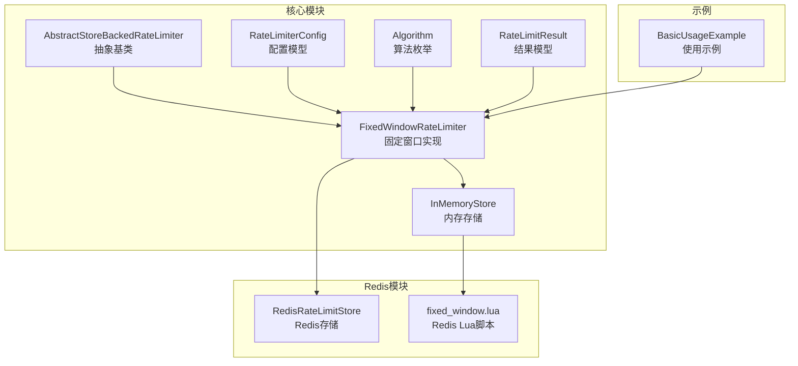
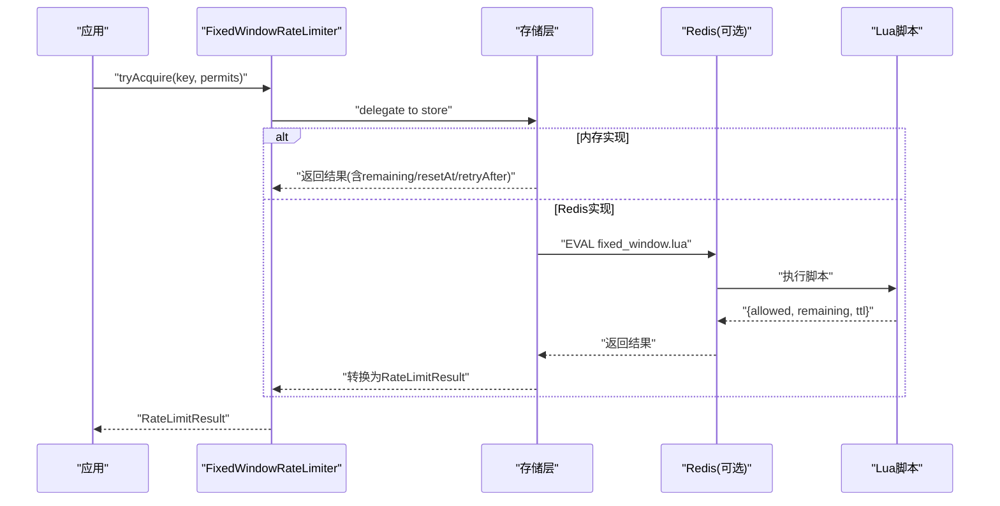
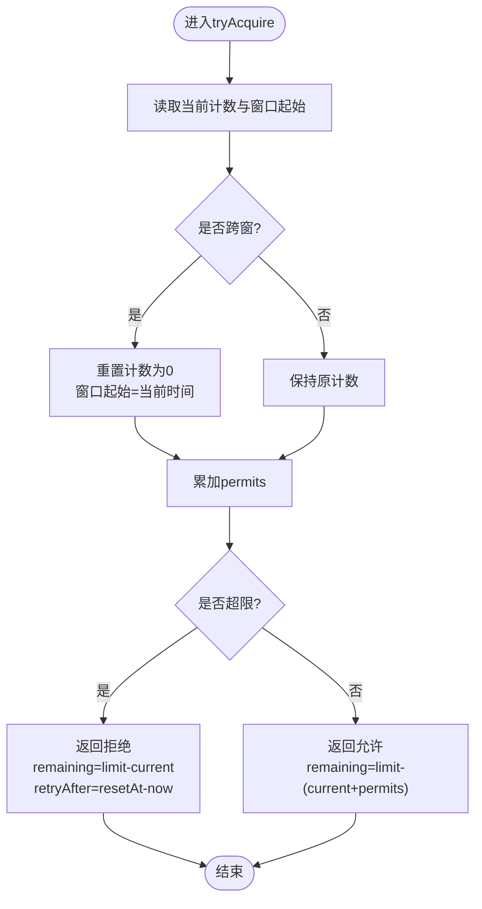
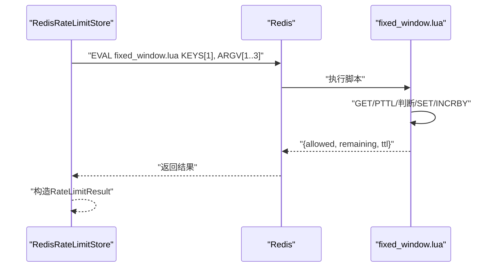
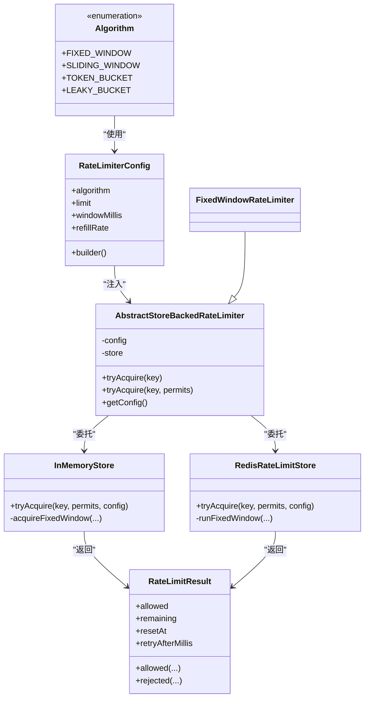
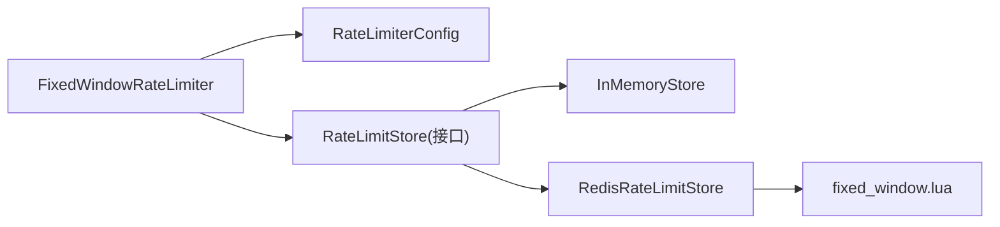

# 固定窗口算法

<cite>
**本文引用的文件**
- [FixedWindowRateLimiter.java](file://throttle4j-core/src/main/java/com/throttle4j/algorithm/FixedWindowRateLimiter.java)
- [AbstractStoreBackedRateLimiter.java](file://throttle4j-core/src/main/java/com/throttle4j/algorithm/AbstractStoreBackedRateLimiter.java)
- [InMemoryStore.java](file://throttle4j-core/src/main/java/com/throttle4j/store/InMemoryStore.java)
- [RedisRateLimitStore.java](file://throttle4j-redis/src/main/java/com/throttle4j/redis/RedisRateLimitStore.java)
- [fixed_window.lua](file://throttle4j-redis/src/main/resources/scripts/fixed_window.lua)
- [RateLimiterConfig.java](file://throttle4j-core/src/main/java/com/throttle4j/core/RateLimiterConfig.java)
- [RateLimitResult.java](file://throttle4j-core/src/main/java/com/throttle4j/core/RateLimitResult.java)
- [Algorithm.java](file://throttle4j-core/src/main/java/com/throttle4j/core/Algorithm.java)
- [FixedWindowRateLimiterTest.java](file://throttle4j-core/src/test/java/com/throttle4j/algorithm/FixedWindowRateLimiterTest.java)
- [BasicUsageExample.java](file://throttle4j-examples/src/main/java/com/throttle4j/example/BasicUsageExample.java)
</cite>

## 目录
1. [引言](#引言)
2. [项目结构](#项目结构)
3. [核心组件](#核心组件)
4. [架构总览](#架构总览)
5. [详细组件分析](#详细组件分析)
6. [依赖关系分析](#依赖关系分析)
7. [性能与复杂度](#性能与复杂度)
8. [故障排查指南](#故障排查指南)
9. [结论](#结论)
10. [附录：使用示例与最佳实践](#附录使用示例与最佳实践)

## 引言
本文件系统化阐述固定窗口（Fixed Window）计数限流算法在本项目的数学模型、实现原理与工程细节，覆盖以下要点：
- 时间窗口划分与计数器重置机制
- 请求计数逻辑与边界情况处理（如窗口边界请求）
- 内存版与Redis分布式版本的实现差异
- Redis中Lua脚本的原子性与并发安全保证
- 复杂度分析：时间O(1)、空间特性
- 性能与精度权衡：不同窗口大小对抖动与吞吐的影响
- 使用示例与配置参数建议

## 项目结构
固定窗口算法位于核心模块与Redis模块中，分别提供内存态与分布式态实现；同时通过统一的配置与结果模型对外暴露能力。

**图示来源**
- [FixedWindowRateLimiter.java:1-18](file://throttle4j-core/src/main/java/com/throttle4j/algorithm/FixedWindowRateLimiter.java#L1-L18)
- [AbstractStoreBackedRateLimiter.java:1-42](file://throttle4j-core/src/main/java/com/throttle4j/algorithm/AbstractStoreBackedRateLimiter.java#L1-L42)
- [InMemoryStore.java:1-315](file://throttle4j-core/src/main/java/com/throttle4j/store/InMemoryStore.java#L1-L315)
- [RedisRateLimitStore.java:1-258](file://throttle4j-redis/src/main/java/com/throttle4j/redis/RedisRateLimitStore.java#L1-L258)
- [fixed_window.lua:1-46](file://throttle4j-redis/src/main/resources/scripts/fixed_window.lua#L1-L46)
- [RateLimiterConfig.java:1-113](file://throttle4j-core/src/main/java/com/throttle4j/core/RateLimiterConfig.java#L1-L113)
- [RateLimitResult.java:1-68](file://throttle4j-core/src/main/java/com/throttle4j/core/RateLimitResult.java#L1-L68)
- [Algorithm.java:1-16](file://throttle4j-core/src/main/java/com/throttle4j/core/Algorithm.java#L1-L16)
- [BasicUsageExample.java:1-101](file://throttle4j-examples/src/main/java/com/throttle4j/example/BasicUsageExample.java#L1-L101)

**章节来源**
- [FixedWindowRateLimiter.java:1-18](file://throttle4j-core/src/main/java/com/throttle4j/algorithm/FixedWindowRateLimiter.java#L1-L18)
- [AbstractStoreBackedRateLimiter.java:1-42](file://throttle4j-core/src/main/java/com/throttle4j/algorithm/AbstractStoreBackedRateLimiter.java#L1-L42)
- [InMemoryStore.java:1-315](file://throttle4j-core/src/main/java/com/throttle4j/store/InMemoryStore.java#L1-L315)
- [RedisRateLimitStore.java:1-258](file://throttle4j-redis/src/main/java/com/throttle4j/redis/RedisRateLimitStore.java#L1-L258)
- [fixed_window.lua:1-46](file://throttle4j-redis/src/main/resources/scripts/fixed_window.lua#L1-L46)
- [RateLimiterConfig.java:1-113](file://throttle4j-core/src/main/java/com/throttle4j/core/RateLimiterConfig.java#L1-L113)
- [RateLimitResult.java:1-68](file://throttle4j-core/src/main/java/com/throttle4j/core/RateLimitResult.java#L1-L68)
- [Algorithm.java:1-16](file://throttle4j-core/src/main/java/com/throttle4j/core/Algorithm.java#L1-L16)
- [BasicUsageExample.java:1-101](file://throttle4j-examples/src/main/java/com/throttle4j/example/BasicUsageExample.java#L1-L101)

## 核心组件
- 算法定义与配置
  - 算法枚举包含固定窗口等选项，用于工厂与调度。
  - 配置对象封装limit、windowMillis等参数，并进行构建期校验。
- 结果模型
  - 返回值包含是否允许、剩余配额、重置时间点、建议重试间隔。
- 抽象基类
  - 统一tryAcquire入口，将具体状态管理委托给存储层。
- 存储层
  - 内存版：基于分段锁与哈希表维护每个键的状态。
  - Redis版：通过Lua脚本原子执行计数与过期策略。

**章节来源**
- [Algorithm.java:1-16](file://throttle4j-core/src/main/java/com/throttle4j/core/Algorithm.java#L1-L16)
- [RateLimiterConfig.java:1-113](file://throttle4j-core/src/main/java/com/throttle4j/core/RateLimiterConfig.java#L1-L113)
- [RateLimitResult.java:1-68](file://throttle4j-core/src/main/java/com/throttle4j/core/RateLimitResult.java#L1-L68)
- [AbstractStoreBackedRateLimiter.java:1-42](file://throttle4j-core/src/main/java/com/throttle4j/algorithm/AbstractStoreBackedRateLimiter.java#L1-L42)
- [InMemoryStore.java:1-315](file://throttle4j-core/src/main/java/com/throttle4j/store/InMemoryStore.java#L1-L315)
- [RedisRateLimitStore.java:1-258](file://throttle4j-redis/src/main/java/com/throttle4j/redis/RedisRateLimitStore.java#L1-L258)

## 架构总览
固定窗口在内存与Redis两套实现中共享同一调用路径：应用侧通过RateLimiter接口发起请求，内部委派到对应存储层完成原子判断与更新。

**图示来源**
- [AbstractStoreBackedRateLimiter.java:24-40](file://throttle4j-core/src/main/java/com/throttle4j/algorithm/AbstractStoreBackedRateLimiter.java#L24-L40)
- [InMemoryStore.java:68-93](file://throttle4j-core/src/main/java/com/throttle4j/store/InMemoryStore.java#L68-L93)
- [RedisRateLimitStore.java:80-140](file://throttle4j-redis/src/main/java/com/throttle4j/redis/RedisRateLimitStore.java#L80-L140)
- [fixed_window.lua:1-46](file://throttle4j-redis/src/main/resources/scripts/fixed_window.lua#L1-L46)

## 详细组件分析

### 数学模型与窗口边界处理
- 模型定义
  - 在长度为windowMillis的固定时间窗口内，累计请求数不得超过limit。
  - 当窗口结束时，计数器清零，下个窗口开始。
- 边界处理
  - 若当前计数+本次permits超过limit，则拒绝；否则累加permits。
  - 重置时间点resetAt为当前窗口起始+windowMillis。
  - 剩余配额remaining为limit-当前计数；建议重试间隔retryAfter为resetAt-now。

**图示来源**
- [InMemoryStore.java:150-170](file://throttle4j-core/src/main/java/com/throttle4j/store/InMemoryStore.java#L150-L170)

**章节来源**
- [InMemoryStore.java:150-170](file://throttle4j-core/src/main/java/com/throttle4j/store/InMemoryStore.java#L150-L170)
- [RateLimitResult.java:21-40](file://throttle4j-core/src/main/java/com/throttle4j/core/RateLimitResult.java#L21-L40)

### 内存版实现要点
- 状态结构
  - 每个key对应一个FixedWindowState，包含windowStart、count与lastAccessAt。
- 同步与一致性
  - 对单键状态对象加锁，确保跨线程的原子性与可见性。
- 计数与重置
  - 跨窗则重置计数并更新窗口起始；否则直接累加permits。
- 结果构造
  - 允许时remaining=limit-count；拒绝时remaining按limit-count上限裁剪且非负。

**章节来源**
- [InMemoryStore.java:271-279](file://throttle4j-core/src/main/java/com/throttle4j/store/InMemoryStore.java#L271-L279)
- [InMemoryStore.java:150-170](file://throttle4j-core/src/main/java/com/throttle4j/store/InMemoryStore.java#L150-L170)

### Redis版实现与Lua原子性
- 调用流程
  - Redis存储根据算法选择对应Lua脚本，传入limit、windowMillis、permits等参数。
- Lua脚本行为
  - 首次访问或键不存在时初始化计数为0。
  - 读取键的剩余生存时间（PTTL），若缺失则回退为windowMillis。
  - 判断current+permits与limit的关系决定允许/拒绝。
  - 首次进入新窗口时SET带过期时间；后续INCRBY累加。
  - 返回{allowed, remaining, ttl}三元组，客户端据此构造结果。
- 并发安全
  - EVAL在Redis服务端原子执行，避免竞态条件与“读-改-写”中间态不一致。

**图示来源**
- [RedisRateLimitStore.java:122-140](file://throttle4j-redis/src/main/java/com/throttle4j/redis/RedisRateLimitStore.java#L122-L140)
- [fixed_window.lua:1-46](file://throttle4j-redis/src/main/resources/scripts/fixed_window.lua#L1-L46)

**章节来源**
- [RedisRateLimitStore.java:122-140](file://throttle4j-redis/src/main/java/com/throttle4j/redis/RedisRateLimitStore.java#L122-L140)
- [fixed_window.lua:1-46](file://throttle4j-redis/src/main/resources/scripts/fixed_window.lua#L1-L46)

### 类关系与职责

**图示来源**
- [Algorithm.java:1-16](file://throttle4j-core/src/main/java/com/throttle4j/core/Algorithm.java#L1-L16)
- [RateLimiterConfig.java:1-113](file://throttle4j-core/src/main/java/com/throttle4j/core/RateLimiterConfig.java#L1-L113)
- [RateLimitResult.java:1-68](file://throttle4j-core/src/main/java/com/throttle4j/core/RateLimitResult.java#L1-L68)
- [AbstractStoreBackedRateLimiter.java:1-42](file://throttle4j-core/src/main/java/com/throttle4j/algorithm/AbstractStoreBackedRateLimiter.java#L1-L42)
- [FixedWindowRateLimiter.java:1-18](file://throttle4j-core/src/main/java/com/throttle4j/algorithm/FixedWindowRateLimiter.java#L1-L18)
- [InMemoryStore.java:1-315](file://throttle4j-core/src/main/java/com/throttle4j/store/InMemoryStore.java#L1-L315)
- [RedisRateLimitStore.java:1-258](file://throttle4j-redis/src/main/java/com/throttle4j/redis/RedisRateLimitStore.java#L1-L258)

**章节来源**
- [Algorithm.java:1-16](file://throttle4j-core/src/main/java/com/throttle4j/core/Algorithm.java#L1-L16)
- [RateLimiterConfig.java:1-113](file://throttle4j-core/src/main/java/com/throttle4j/core/RateLimiterConfig.java#L1-L113)
- [RateLimitResult.java:1-68](file://throttle4j-core/src/main/java/com/throttle4j/core/RateLimitResult.java#L1-L68)
- [AbstractStoreBackedRateLimiter.java:1-42](file://throttle4j-core/src/main/java/com/throttle4j/algorithm/AbstractStoreBackedRateLimiter.java#L1-L42)
- [FixedWindowRateLimiter.java:1-18](file://throttle4j-core/src/main/java/com/throttle4j/algorithm/FixedWindowRateLimiter.java#L1-L18)
- [InMemoryStore.java:1-315](file://throttle4j-core/src/main/java/com/throttle4j/store/InMemoryStore.java#L1-L315)
- [RedisRateLimitStore.java:1-258](file://throttle4j-redis/src/main/java/com/throttle4j/redis/RedisRateLimitStore.java#L1-L258)

## 依赖关系分析
- 组件耦合
  - FixedWindowRateLimiter仅依赖配置与存储接口，低耦合高内聚。
  - 存储层通过统一接口向算法层暴露状态变更能力。
- 外部依赖
  - Redis模块依赖Lettuce同步命令接口与Lua脚本资源。
- 可能的循环依赖
  - 未发现直接循环；算法与存储通过接口解耦。

**图示来源**
- [FixedWindowRateLimiter.java:1-18](file://throttle4j-core/src/main/java/com/throttle4j/algorithm/FixedWindowRateLimiter.java#L1-L18)
- [AbstractStoreBackedRateLimiter.java:1-42](file://throttle4j-core/src/main/java/com/throttle4j/algorithm/AbstractStoreBackedRateLimiter.java#L1-L42)
- [InMemoryStore.java:1-315](file://throttle4j-core/src/main/java/com/throttle4j/store/InMemoryStore.java#L1-L315)
- [RedisRateLimitStore.java:1-258](file://throttle4j-redis/src/main/java/com/throttle4j/redis/RedisRateLimitStore.java#L1-L258)
- [fixed_window.lua:1-46](file://throttle4j-redis/src/main/resources/scripts/fixed_window.lua#L1-L46)

**章节来源**
- [AbstractStoreBackedRateLimiter.java:1-42](file://throttle4j-core/src/main/java/com/throttle4j/algorithm/AbstractStoreBackedRateLimiter.java#L1-L42)
- [InMemoryStore.java:1-315](file://throttle4j-core/src/main/java/com/throttle4j/store/InMemoryStore.java#L1-L315)
- [RedisRateLimitStore.java:1-258](file://throttle4j-redis/src/main/java/com/throttle4j/redis/RedisRateLimitStore.java#L1-L258)

## 性能与复杂度
- 时间复杂度
  - 内存实现：每次操作为O(1)，涉及哈希表查找与单键同步块内的常数步。
  - Redis实现：EVAL Lua为原子操作，整体O(1)。
- 空间复杂度
  - 内存实现：每键一个状态对象，空间与活跃键数量线性相关。
  - Redis实现：每个键一条计数记录+过期时间，空间与活跃键数量线性相关。
- 精度与抖动
  - 固定窗口在窗口边界存在“突发”风险：窗口末尾可能累积至limit，下一窗口初瞬时放行接近limit的请求。
  - 窗口越小，抖动越明显；窗口越大，平均速率更平滑但响应延迟感知更强。
- 测试验证
  - 单测覆盖了“达到上限后拒绝”、“窗口结束后恢复”、“多许可消费配额”、“并发不超限”等场景，体现O(1)与边界行为正确性。

**章节来源**
- [FixedWindowRateLimiterTest.java:43-111](file://throttle4j-core/src/test/java/com/throttle4j/algorithm/FixedWindowRateLimiterTest.java#L43-L111)
- [InMemoryStore.java:150-170](file://throttle4j-core/src/main/java/com/throttle4j/store/InMemoryStore.java#L150-L170)

## 故障排查指南
- 常见问题
  - 参数非法：limit或windowMillis未满足约束会抛出异常。
  - 并发超限：确保使用Redis存储或正确的内存并发模型。
  - 窗口未重置：检查系统时间与Redis键过期策略；确认Lua脚本加载成功。
- 定位手段
  - 查看Redis日志与Lua脚本加载信息。
  - 核对KEYS与ARGV传递顺序与类型。
  - 关注RateLimitResult中的retryAfterMillis与resetAt，辅助定位窗口重置时机。

**章节来源**
- [RateLimiterConfig.java:91-110](file://throttle4j-core/src/main/java/com/throttle4j/core/RateLimiterConfig.java#L91-L110)
- [RedisRateLimitStore.java:226-251](file://throttle4j-redis/src/main/java/com/throttle4j/redis/RedisRateLimitStore.java#L226-L251)
- [fixed_window.lua:1-46](file://throttle4j-redis/src/main/resources/scripts/fixed_window.lua#L1-L46)
- [RateLimitResult.java:21-40](file://throttle4j-core/src/main/java/com/throttle4j/core/RateLimitResult.java#L21-L40)

## 结论
固定窗口算法以简洁的数学模型与O(1)的实现复杂度，提供了稳定的限流能力。内存与Redis双栈实现满足从单机到分布式场景的需求；Redis通过Lua脚本保证原子性与并发安全。在实际部署中，应结合业务对抖动与精度的要求，合理选择窗口大小与配额，以获得更优的用户体验与系统稳定性。

## 附录：使用示例与最佳实践
- 使用示例
  - 示例程序展示了固定窗口的创建、请求发放与窗口重置后的恢复过程。
- 配置参数
  - limit：单窗口最大请求数。
  - windowMillis：窗口时长（毫秒）。
  - permits：单次申请配额，默认1。
- 最佳实践
  - 小窗口（如秒级）适合强实时性场景，但抖动较大；大窗口（如分钟级）更平滑但响应延迟感更强。
  - 并发高时优先使用Redis存储，确保全局一致性。
  - 对于需要更平滑速率的场景，可考虑滑动窗口或令牌桶作为替代方案。

**章节来源**
- [BasicUsageExample.java:77-99](file://throttle4j-examples/src/main/java/com/throttle4j/example/BasicUsageExample.java#L77-L99)
- [RateLimiterConfig.java:71-84](file://throttle4j-core/src/main/java/com/throttle4j/core/RateLimiterConfig.java#L71-L84)
- [AbstractStoreBackedRateLimiter.java:29-35](file://throttle4j-core/src/main/java/com/throttle4j/algorithm/AbstractStoreBackedRateLimiter.java#L29-L35)