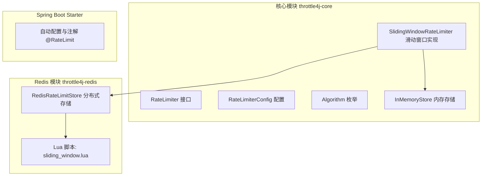
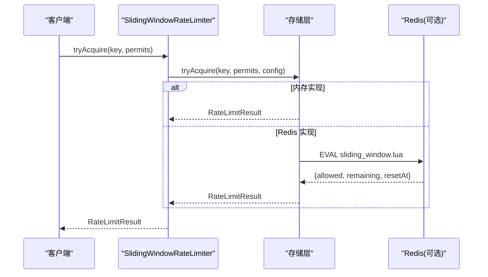
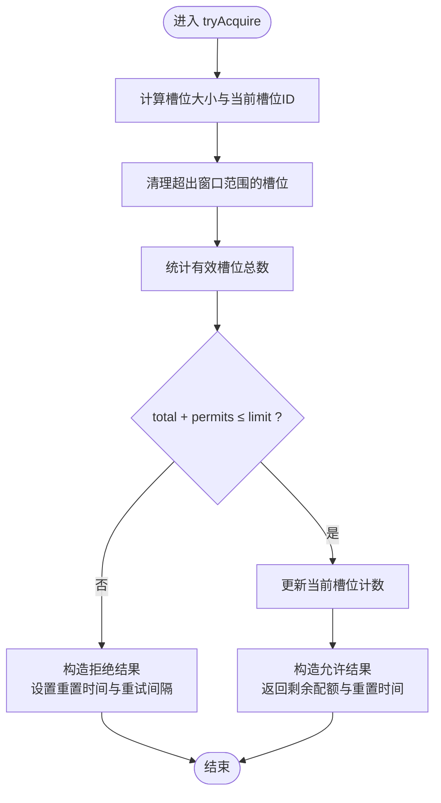
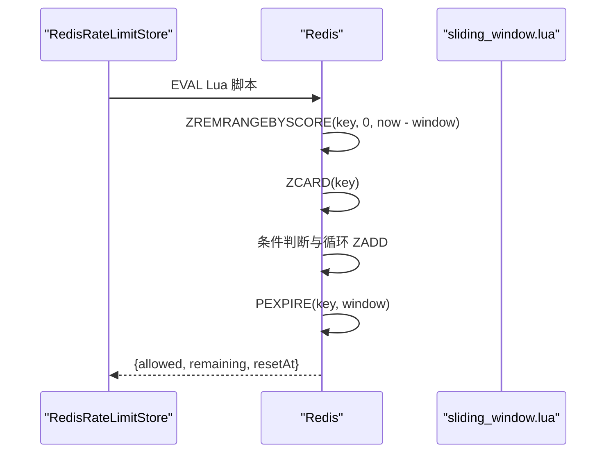
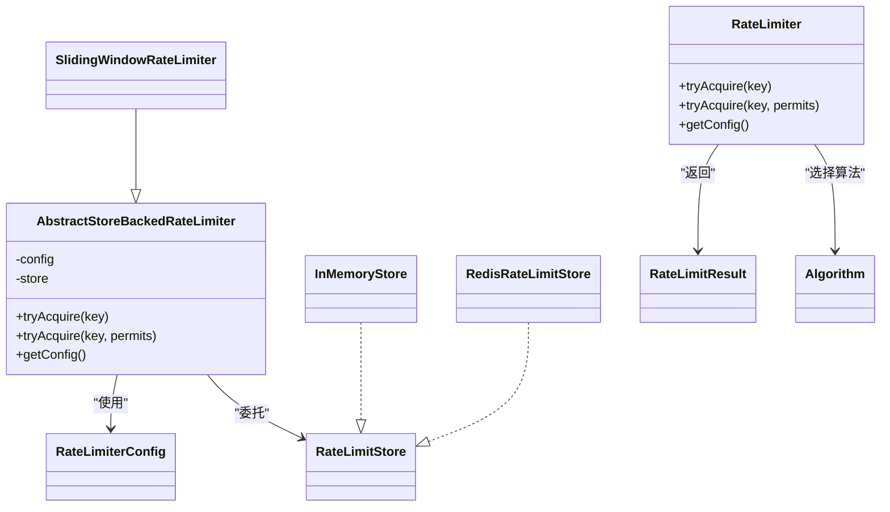
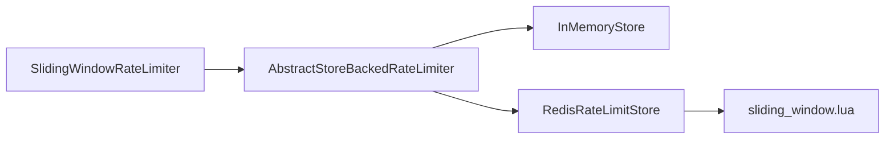

# 滑动窗口算法

<cite>
**本文引用的文件**
- [SlidingWindowRateLimiter.java](file://throttle4j-core/src/main/java/com/throttle4j/algorithm/SlidingWindowRateLimiter.java)
- [AbstractStoreBackedRateLimiter.java](file://throttle4j-core/src/main/java/com/throttle4j/algorithm/AbstractStoreBackedRateLimiter.java)
- [RateLimiterConfig.java](file://throttle4j-core/src/main/java/com/throttle4j/core/RateLimiterConfig.java)
- [InMemoryStore.java](file://throttle4j-core/src/main/java/com/throttle4j/store/InMemoryStore.java)
- [RedisRateLimitStore.java](file://throttle4j-redis/src/main/java/com/throttle4j/redis/RedisRateLimitStore.java)
- [sliding_window.lua](file://throttle4j-redis/src/main/resources/scripts/sliding_window.lua)
- [Algorithm.java](file://throttle4j-core/src/main/java/com/throttle4j/core/Algorithm.java)
- [RateLimitResult.java](file://throttle4j-core/src/main/java/com/throttle4j/core/RateLimitResult.java)
- [RateLimiter.java](file://throttle4j-core/src/main/java/com/throttle4j/core/RateLimiter.java)
- [SlidingWindowRateLimiterTest.java](file://throttle4j-core/src/test/java/com/throttle4j/algorithm/SlidingWindowRateLimiterTest.java)
- [RedisRateLimitStoreTest.java](file://throttle4j-redis/src/test/java/com/throttle4j/redis/RedisRateLimitStoreTest.java)
- [README.md](file://README.md)
- [BasicUsageExample.java](file://throttle4j-examples/src/main/java/com/throttle4j/example/BasicUsageExample.java)
</cite>

## 目录
1. [引言](#引言)
2. [项目结构](#项目结构)
3. [核心组件](#核心组件)
4. [架构总览](#架构总览)
5. [详细组件分析](#详细组件分析)
6. [依赖关系分析](#依赖关系分析)
7. [性能考量](#性能考量)
8. [故障排查指南](#故障排查指南)
9. [结论](#结论)
10. [附录](#附录)

## 引言
本技术文档围绕滑动窗口算法展开，系统阐述其数学模型、实现细节与工程化落地。重点包括：
- 数学模型：滑动窗口计数器的近似实现（子槽位划分）、时间衰减机制与请求历史记录管理。
- 核心实现：时间戳存储、过期请求清理、滑动窗口计算逻辑。
- 精度优势：对比固定窗口在边界请求处理上的精度提升。
- Redis 实现：基于有序集合的分布式实现，展示 ZADD、ZREMRANGEBYSCORE 等命令的使用。
- 性能分析：内存占用与精度的关系、吞吐与延迟权衡。
- 配置说明：窗口大小、请求上限、清理策略等。
- 应用场景与测试：结合示例与单元测试验证行为。

## 项目结构
该项目采用多模块分层设计，核心算法与存储解耦，支持本地内存与 Redis 分布式两种后端，Spring Boot Starter 提供声明式集成。

图表来源
- [SlidingWindowRateLimiter.java:10-15](file://throttle4j-core/src/main/java/com/throttle4j/algorithm/SlidingWindowRateLimiter.java#L10-L15)
- [InMemoryStore.java:24-315](file://throttle4j-core/src/main/java/com/throttle4j/store/InMemoryStore.java#L24-L315)
- [RedisRateLimitStore.java:40-258](file://throttle4j-redis/src/main/java/com/throttle4j/redis/RedisRateLimitStore.java#L40-L258)
- [sliding_window.lua:1-49](file://throttle4j-redis/src/main/resources/scripts/sliding_window.lua#L1-L49)

章节来源
- [README.md:76-101](file://README.md#L76-L101)

## 核心组件
- RateLimiter 接口：统一的限流调用入口，支持单次与批量许可申请。
- RateLimiterConfig：不可变配置对象，定义算法类型、限额、窗口时长、补充速率等。
- Algorithm 枚举：支持固定窗口、滑动窗口、令牌桶、漏桶四种算法。
- RateLimitResult：返回值封装，包含是否允许、剩余配额、重置时间、建议重试间隔。
- InMemoryStore：基于并发映射的内存存储，内置空闲键清理任务。
- RedisRateLimitStore：基于 Lettuce 的 Redis 存储，通过 Lua 原子脚本执行算法。
- SlidingWindowRateLimiter：滑动窗口限流器，委托状态到存储层。

章节来源
- [RateLimiter.java:8-31](file://throttle4j-core/src/main/java/com/throttle4j/core/RateLimiter.java#L8-L31)
- [RateLimiterConfig.java:8-113](file://throttle4j-core/src/main/java/com/throttle4j/core/RateLimiterConfig.java#L8-L113)
- [Algorithm.java:6-15](file://throttle4j-core/src/main/java/com/throttle4j/core/Algorithm.java#L6-L15)
- [RateLimitResult.java:6-68](file://throttle4j-core/src/main/java/com/throttle4j/core/RateLimitResult.java#L6-L68)
- [InMemoryStore.java:24-315](file://throttle4j-core/src/main/java/com/throttle4j/store/InMemoryStore.java#L24-L315)
- [RedisRateLimitStore.java:40-258](file://throttle4j-redis/src/main/java/com/throttle4j/redis/RedisRateLimitStore.java#L40-L258)
- [SlidingWindowRateLimiter.java:10-15](file://throttle4j-core/src/main/java/com/throttle4j/algorithm/SlidingWindowRateLimiter.java#L10-L15)

## 架构总览
滑动窗口算法在内存与 Redis 两套实现上保持一致的 API 语义与行为。内存实现通过子槽位近似滑动窗口；Redis 实现通过有序集合与 Lua 脚本原子化维护请求历史。

图表来源
- [SlidingWindowRateLimiter.java:12-14](file://throttle4j-core/src/main/java/com/throttle4j/algorithm/SlidingWindowRateLimiter.java#L12-L14)
- [AbstractStoreBackedRateLimiter.java:29-35](file://throttle4j-core/src/main/java/com/throttle4j/algorithm/AbstractStoreBackedRateLimiter.java#L29-L35)
- [RedisRateLimitStore.java:80-110](file://throttle4j-redis/src/main/java/com/throttle4j/redis/RedisRateLimitStore.java#L80-L110)
- [sliding_window.lua:13-48](file://throttle4j-redis/src/main/resources/scripts/sliding_window.lua#L13-L48)

## 详细组件分析

### 数学模型与近似原理
滑动窗口通过“子槽位”将窗口划分为固定数量的等长区间，每个槽位维护一个计数。每次请求到来时：
- 计算当前所属槽位 ID；
- 清理超出窗口范围的历史槽位；
- 统计有效槽位总数；
- 若总量+本次许可不超过限额，则允许并累加到当前槽位；否则拒绝并给出重置时间。

该方法在不存储完整请求时间戳的前提下，以“槽位计数”的方式逼近真实滑动窗口，从而避免边界请求的尖峰问题。

章节来源
- [InMemoryStore.java:172-212](file://throttle4j-core/src/main/java/com/throttle4j/store/InMemoryStore.java#L172-L212)

### 时间戳存储与过期清理
- 内存实现：使用子槽位数组与槽位 ID 数组，按槽位索引更新计数；通过定时清理任务移除长时间未访问的键，降低内存占用。
- Redis 实现：使用有序集合存储请求时间戳（作为分数），通过 ZREMRANGEBYSCORE 清理过期项；ZADD 添加新请求；PEXPIRE 设置过期时间。

章节来源
- [InMemoryStore.java:281-293](file://throttle4j-core/src/main/java/com/throttle4j/store/InMemoryStore.java#L281-L293)
- [sliding_window.lua:21-41](file://throttle4j-redis/src/main/resources/scripts/sliding_window.lua#L21-L41)

### 滑动窗口计算逻辑
- 计算槽位大小：slotSize = max(1, windowMillis / SLOTS)，默认 SLOTS=10；
- 当前槽位 ID：currentSlotId = now / slotSize；
- 有效起始槽位：firstValid = currentSlotId - SLOTS + 1；
- 清理过期槽位并统计总数；
- 判断 total + permits 是否超过 limit；
- 允许则更新当前槽位计数并返回剩余配额与重置时间；拒绝则计算最早槽位到期时间作为重置时间。

图表来源
- [InMemoryStore.java:172-212](file://throttle4j-core/src/main/java/com/throttle4j/store/InMemoryStore.java#L172-L212)

章节来源
- [InMemoryStore.java:172-212](file://throttle4j-core/src/main/java/com/throttle4j/store/InMemoryStore.java#L172-L212)

### Redis 有序集合实现与 Lua 脚本
- ZREMRANGEBYSCORE：清理早于 now - window 的历史记录；
- ZCARD：统计当前窗口内请求数；
- ZADD：添加当前请求的时间戳（带唯一标识）；
- PEXPIRE：为键设置过期时间；
- 返回值：{allowed, remaining, resetAt}，其中 resetAt 为最早记录出窗的绝对时间。

图表来源
- [RedisRateLimitStore.java:142-163](file://throttle4j-redis/src/main/java/com/throttle4j/redis/RedisRateLimitStore.java#L142-L163)
- [sliding_window.lua:21-48](file://throttle4j-redis/src/main/resources/scripts/sliding_window.lua#L21-L48)

章节来源
- [RedisRateLimitStore.java:142-163](file://throttle4j-redis/src/main/java/com/throttle4j/redis/RedisRateLimitStore.java#L142-L163)
- [sliding_window.lua:1-49](file://throttle4j-redis/src/main/resources/scripts/sliding_window.lua#L1-L49)

### 与固定窗口的精度对比
- 固定窗口在窗口边界处存在“尖峰”风险：窗口末尾与下一个窗口开头可能同时出现大量请求。
- 滑动窗口通过子槽位或有序集合记录请求时间，使配额在时间轴上平滑分布，显著降低边界抖动。

章节来源
- [README.md:105-112](file://README.md#L105-L112)

### 配置选项说明
- algorithm：算法类型（SLIDING_WINDOW）。
- limit：窗口内的最大请求数。
- windowMillis：窗口时长（毫秒）。
- refillRate（仅令牌桶/漏桶）：补充速率（令牌/秒）。
- 窗口大小与请求上限：通过 limit 与 windowMillis 控制。
- 清理策略：
  - 内存：空闲 TTL 与清理周期可配置，默认 5 分钟空闲、每 60 秒清理一次。
  - Redis：通过 PEXPIRE 自动过期，Lua 脚本中 ZREMRANGEBYSCORE 清理过期项。

章节来源
- [RateLimiterConfig.java:55-111](file://throttle4j-core/src/main/java/com/throttle4j/core/RateLimiterConfig.java#L55-L111)
- [InMemoryStore.java:42-66](file://throttle4j-core/src/main/java/com/throttle4j/store/InMemoryStore.java#L42-L66)

### 类关系图

图表来源
- [SlidingWindowRateLimiter.java:10-15](file://throttle4j-core/src/main/java/com/throttle4j/algorithm/SlidingWindowRateLimiter.java#L10-L15)
- [AbstractStoreBackedRateLimiter.java:14-41](file://throttle4j-core/src/main/java/com/throttle4j/algorithm/AbstractStoreBackedRateLimiter.java#L14-L41)
- [InMemoryStore.java:24-315](file://throttle4j-core/src/main/java/com/throttle4j/store/InMemoryStore.java#L24-L315)
- [RedisRateLimitStore.java:40-258](file://throttle4j-redis/src/main/java/com/throttle4j/redis/RedisRateLimitStore.java#L40-L258)
- [RateLimiterConfig.java:8-113](file://throttle4j-core/src/main/java/com/throttle4j/core/RateLimiterConfig.java#L8-L113)
- [RateLimitResult.java:6-68](file://throttle4j-core/src/main/java/com/throttle4j/core/RateLimitResult.java#L6-L68)
- [Algorithm.java:6-15](file://throttle4j-core/src/main/java/com/throttle4j/core/Algorithm.java#L6-L15)

## 依赖关系分析
- SlidingWindowRateLimiter 依赖抽象基类，后者再委托到具体存储（内存或 Redis）。
- Redis 实现加载 Lua 脚本并在单次 EVAL 中完成所有操作，保证原子性。
- 测试覆盖了内存与 Redis 两套实现的行为一致性与边界条件。

图表来源
- [SlidingWindowRateLimiter.java:10-15](file://throttle4j-core/src/main/java/com/throttle4j/algorithm/SlidingWindowRateLimiter.java#L10-L15)
- [AbstractStoreBackedRateLimiter.java:14-41](file://throttle4j-core/src/main/java/com/throttle4j/algorithm/AbstractStoreBackedRateLimiter.java#L14-L41)
- [InMemoryStore.java:24-315](file://throttle4j-core/src/main/java/com/throttle4j/store/InMemoryStore.java#L24-L315)
- [RedisRateLimitStore.java:40-258](file://throttle4j-redis/src/main/java/com/throttle4j/redis/RedisRateLimitStore.java#L40-L258)
- [sliding_window.lua:1-49](file://throttle4j-redis/src/main/resources/scripts/sliding_window.lua#L1-L49)

章节来源
- [SlidingWindowRateLimiterTest.java:20-115](file://throttle4j-core/src/test/java/com/throttle4j/algorithm/SlidingWindowRateLimiterTest.java#L20-L115)
- [RedisRateLimitStoreTest.java:32-284](file://throttle4j-redis/src/test/java/com/throttle4j/redis/RedisRateLimitStoreTest.java#L32-L284)

## 性能考量
- 内存占用与精度：
  - 内存实现使用固定槽位数组，空间复杂度 O(SLOTS)，SLOTS 默认 10；适合低内存、中等精度需求。
  - Redis 实现使用有序集合存储请求时间戳，空间与活跃请求数成正比；适合高精度与分布式场景。
- 吞吐与延迟：
  - 内存实现纯 CPU 计算，延迟低；Redis 实现受网络与 Lua 执行影响，但保证原子性。
- 清理策略：
  - 内存实现定期清理空闲键，避免长期运行导致的键堆积。
  - Redis 实现通过 PEXPIRE 与 ZREMRANGEBYSCORE 双重清理，减少过期数据残留。

章节来源
- [InMemoryStore.java:28-66](file://throttle4j-core/src/main/java/com/throttle4j/store/InMemoryStore.java#L28-L66)
- [sliding_window.lua:21-41](file://throttle4j-redis/src/main/resources/scripts/sliding_window.lua#L21-L41)

## 故障排查指南
- 常见异常与定位
  - 参数非法：key 为空、permits 小于 1、配置校验失败（如 limit ≤ 0、TOKEN_BUCKET 缺少 refillRate 或 windowMillis）。
  - Redis 脚本加载失败或返回类型异常：检查 Lua 脚本资源路径与内容。
  - 结果解析错误：确认 Redis 返回值结构与解析逻辑一致。
- 单元测试参考
  - 内存实现：滑动窗口允许上限、窗口滑动、并发安全、批量许可等。
  - Redis 实现：脚本调用参数、返回值解析、重试时间计算、键前缀与删除行为。

章节来源
- [RateLimiterConfig.java:91-110](file://throttle4j-core/src/main/java/com/throttle4j/core/RateLimiterConfig.java#L91-L110)
- [RedisRateLimitStore.java:226-251](file://throttle4j-redis/src/main/java/com/throttle4j/redis/RedisRateLimitStore.java#L226-L251)
- [SlidingWindowRateLimiterTest.java:20-115](file://throttle4j-core/src/test/java/com/throttle4j/algorithm/SlidingWindowRateLimiterTest.java#L20-L115)
- [RedisRateLimitStoreTest.java:32-284](file://throttle4j-redis/src/test/java/com/throttle4j/redis/RedisRateLimitStoreTest.java#L32-L284)

## 结论
滑动窗口算法通过子槽位或有序集合记录请求时间，实现了更平滑的配额分配与更高的边界精度。内存与 Redis 两套实现分别满足单机与分布式场景的需求，配合完善的配置与测试保障，适用于高并发、对公平性有要求的 API 限流场景。

## 附录

### 配置与使用要点
- 使用示例（程序化与 Spring Boot 注解）可参考示例模块与 README。
- 关键配置项：algorithm=SLIDING_WINDOW、limit、windowMillis；Redis 场景下注意键前缀与超时设置。

章节来源
- [README.md:42-74](file://README.md#L42-L74)
- [BasicUsageExample.java:30-101](file://throttle4j-examples/src/main/java/com/throttle4j/example/BasicUsageExample.java#L30-L101)