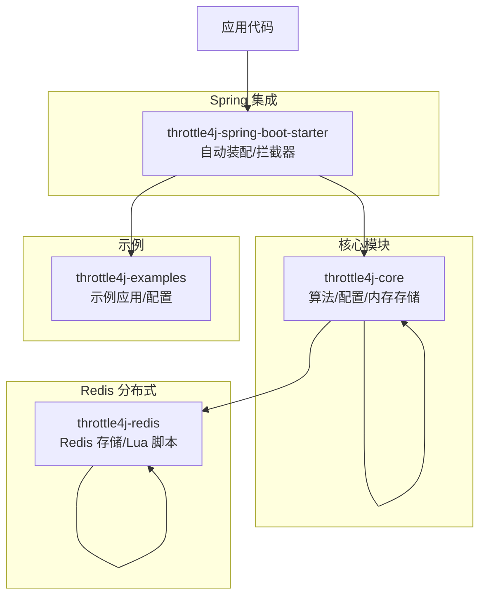
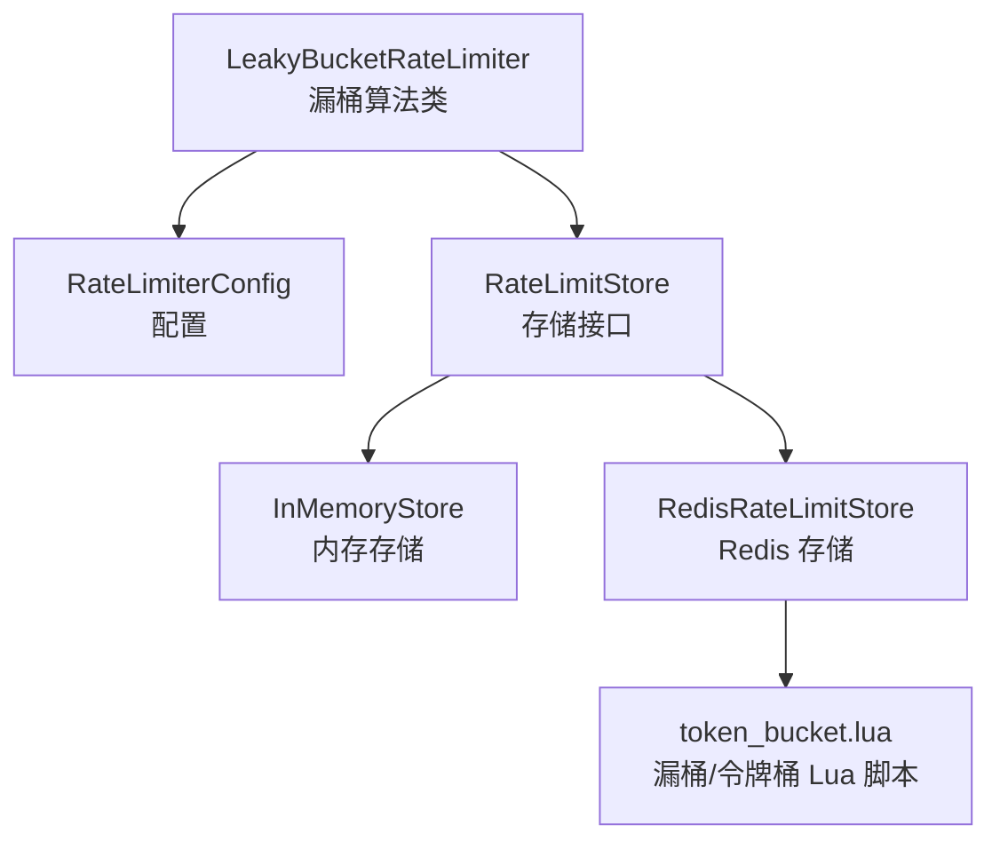
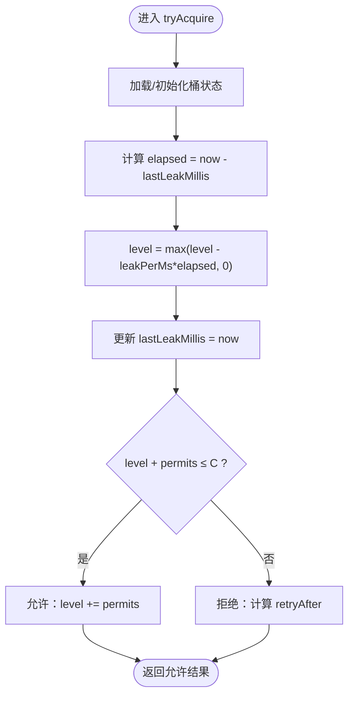
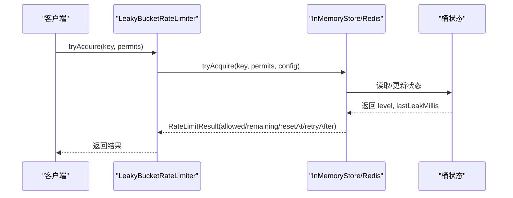
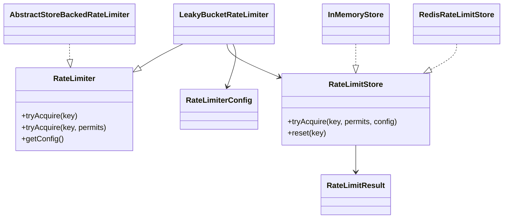

# 漏桶算法

<cite>
**本文引用的文件**
- [LeakyBucketRateLimiter.java](file://throttle4j-core/src/main/java/com/throttle4j/algorithm/LeakyBucketRateLimiter.java)
- [AbstractStoreBackedRateLimiter.java](file://throttle4j-core/src/main/java/com/throttle4j/algorithm/AbstractStoreBackedRateLimiter.java)
- [RateLimiter.java](file://throttle4j-core/src/main/java/com/throttle4j/core/RateLimiter.java)
- [RateLimiterConfig.java](file://throttle4j-core/src/main/java/com/throttle4j/core/RateLimiterConfig.java)
- [RateLimitResult.java](file://throttle4j-core/src/main/java/com/throttle4j/core/RateLimitResult.java)
- [Algorithm.java](file://throttle4j-core/src/main/java/com/throttle4j/core/Algorithm.java)
- [InMemoryStore.java](file://throttle4j-core/src/main/java/com/throttle4j/store/InMemoryStore.java)
- [RedisRateLimitStore.java](file://throttle4j-redis/src/main/java/com/throttle4j/redis/RedisRateLimitStore.java)
- [token_bucket.lua](file://throttle4j-redis/src/main/resources/scripts/token_bucket.lua)
- [FallbackRateLimitStore.java](file://throttle4j-redis/src/main/java/com/throttle4j/redis/FallbackRateLimitStore.java)
- [LeakyBucketRateLimiterTest.java](file://throttle4j-core/src/test/java/com/throttle4j/algorithm/LeakyBucketRateLimiterTest.java)
- [README.md](file://README.md)
- [BasicUsageExample.java](file://throttle4j-examples/src/main/java/com/throttle4j/example/BasicUsageExample.java)
- [application.yml](file://throttle4j-examples/src/main/resources/application.yml)
</cite>

## 目录
1. [引言](#引言)
2. [项目结构](#项目结构)
3. [核心组件](#核心组件)
4. [架构总览](#架构总览)
5. [详细组件分析](#详细组件分析)
6. [依赖分析](#依赖分析)
7. [性能考虑](#性能考虑)
8. [故障排查指南](#故障排查指南)
9. [结论](#结论)
10. [附录](#附录)

## 引言
本文件围绕漏桶算法（Leaky Bucket）在本项目的实现与使用进行系统化技术说明。内容涵盖算法的数学模型与工作原理、状态维护与定时机制、请求排队与出队逻辑、在流量整形中的优势、Redis 原子化 Lua 脚本实现、与其他限流算法的对比、参数配置建议、典型应用场景以及测试与最佳实践。

## 项目结构
本仓库采用多模块设计，围绕“算法实现 + 存储后端 + Spring 集成 + 示例”分层组织：
- throttle4j-core：算法与核心 API、内存存储、配置模型
- throttle4j-redis：基于 Redis 的分布式存储与 Lua 原子脚本
- throttle4j-spring-boot-starter：自动装配、注解与拦截器
- throttle4j-examples：示例工程与默认配置

图表来源
- [README.md:76-101](file://README.md#L76-L101)

章节来源
- [README.md:14-160](file://README.md#L14-L160)

## 核心组件
- 算法接口与工厂：统一的 RateLimiter 接口与工厂抽象，支持按配置创建不同算法实例。
- 配置模型：RateLimiterConfig 提供算法类型、容量/配额、窗口时间、补充速率等参数。
- 结果模型：RateLimitResult 统一返回允许/拒绝、剩余配额、重置时间、重试等待。
- 存储后端：InMemoryStore（单机）与 RedisRateLimitStore（分布式），后者通过 Lua 原子脚本实现。
- 漏桶实现：LeakyBucketRateLimiter 作为具体算法类，委托存储后端完成状态管理。

章节来源
- [RateLimiter.java:8-31](file://throttle4j-core/src/main/java/com/throttle4j/core/RateLimiter.java#L8-L31)
- [RateLimiterConfig.java:8-113](file://throttle4j-core/src/main/java/com/throttle4j/core/RateLimiterConfig.java#L8-L113)
- [RateLimitResult.java:6-68](file://throttle4j-core/src/main/java/com/throttle4j/core/RateLimitResult.java#L6-L68)
- [Algorithm.java:6-15](file://throttle4j-core/src/main/java/com/throttle4j/core/Algorithm.java#L6-L15)
- [LeakyBucketRateLimiter.java:10-15](file://throttle4j-core/src/main/java/com/throttle4j/algorithm/LeakyBucketRateLimiter.java#L10-L15)
- [AbstractStoreBackedRateLimiter.java:14-41](file://throttle4j-core/src/main/java/com/throttle4j/algorithm/AbstractStoreBackedRateLimiter.java#L14-L41)

## 架构总览
漏桶算法在本项目中以“算法类 + 存储后端”的方式实现。内存版直接在 JVM 内部维护状态；Redis 版通过 Lua 脚本在服务端原子地更新状态，保证高并发一致性。

图表来源
- [LeakyBucketRateLimiter.java:10-15](file://throttle4j-core/src/main/java/com/throttle4j/algorithm/LeakyBucketRateLimiter.java#L10-L15)
- [InMemoryStore.java:238-263](file://throttle4j-core/src/main/java/com/throttle4j/store/InMemoryStore.java#L238-L263)
- [RedisRateLimitStore.java:100-110](file://throttle4j-redis/src/main/java/com/throttle4j/redis/RedisRateLimitStore.java#L100-L110)
- [token_bucket.lua:11-57](file://throttle4j-redis/src/main/resources/scripts/token_bucket.lua#L11-L57)

## 详细组件分析

### 数学模型与工作原理
- 模型定义
  - 容量 C：漏桶最大水位（可容纳的“请求数”或“令牌数”）
  - 漏水速率 r：单位时间内从桶中流出的固定速率（等效于稳定输出速率）
  - 当前水位 L(t)：随时间线性下降，L(t) = max(L(t−Δt) − r·Δt, 0)
  - 入队请求：每次请求尝试向桶内注入 1 个单位，若 L(t)+1 > C 则拒绝；否则 L(t)++ 并允许
- 流量整形优势
  - 将突发请求平滑为恒定速率输出，避免下游瞬时过载
  - 对边界尖峰不敏感，适合需要稳定出力的场景（如带宽控制、下游处理能力受限）

章节来源
- [README.md:103-112](file://README.md#L103-L112)

### 状态维护与定时机制
- 内存实现（InMemoryStore.acquireLeakyBucket）
  - 维护 LeakyBucketState：当前水位 level、上次漏水时间 lastLeakMillis
  - 每次访问计算已过去的时间，按 leakPerMs = limit/windowMillis 计算泄漏量，更新 level
  - 若 level + permits ≤ C，则允许并增加水位；否则拒绝并给出 retryAfter
- Redis 实现（RedisRateLimitStore + token_bucket.lua）
  - 将漏桶映射为“令牌桶”模型：容量即 limit，补充速率即 leakRate = limit/windowMillis
  - Lua 脚本原子地执行“计算补充 + 判断 + 更新”的完整流程，确保并发安全

图表来源
- [InMemoryStore.java:238-263](file://throttle4j-core/src/main/java/com/throttle4j/store/InMemoryStore.java#L238-L263)

章节来源
- [InMemoryStore.java:238-263](file://throttle4j-core/src/main/java/com/throttle4j/store/InMemoryStore.java#L238-L263)
- [RedisRateLimitStore.java:100-110](file://throttle4j-redis/src/main/java/com/throttle4j/redis/RedisRateLimitStore.java#L100-L110)
- [token_bucket.lua:17-44](file://throttle4j-redis/src/main/resources/scripts/token_bucket.lua#L17-L44)

### 请求排队与出队逻辑
- 入队策略
  - 每次请求尝试注入 1 单位到桶中；若超过容量则拒绝
  - 允许时更新水位；拒绝时计算下一次可出队的等待时间（retryAfter）
- 出队策略
  - 水位按固定速率自然下降，形成稳定的“出队”速率
  - 通过 resetAt/retryAfter 返回给调用方重试时机提示

图表来源
- [AbstractStoreBackedRateLimiter.java:29-35](file://throttle4j-core/src/main/java/com/throttle4j/algorithm/AbstractStoreBackedRateLimiter.java#L29-L35)
- [InMemoryStore.java:68-93](file://throttle4j-core/src/main/java/com/throttle4j/store/InMemoryStore.java#L68-L93)
- [RedisRateLimitStore.java:80-110](file://throttle4j-redis/src/main/java/com/throttle4j/redis/RedisRateLimitStore.java#L80-L110)

### 与其他限流算法的对比
- 固定窗口（Fixed Window）
  - 优点：简单、低内存
  - 缺点：边界突发明显，不适合严格整形
- 滑动窗口（Sliding Window）
  - 优点：公平性好，边界更平滑
  - 缺点：内存占用中等
- 令牌桶（Token Bucket）
  - 优点：允许突发，平均速率稳定
  - 缺点：瞬时峰值可能冲击下游
- 漏桶（Leaky Bucket）
  - 优点：严格整形，恒定出力，适合下游能力受限场景
  - 缺点：无法突发，瞬时吞吐略低

章节来源
- [README.md:105-112](file://README.md#L105-L112)

### 参数配置指南
- 容量 C（limit）
  - 建议：下游单位时间最大处理能力；或根据 QPS × 观察窗口秒数估算
- 漏水速率 r（等效 refillRate）
  - 建议：r = limit / windowMillis（毫秒）；或直接以“每秒请求数”表达
- 窗口时间 windowMillis
  - 建议：与下游处理节奏匹配；过短导致频繁重置，过长降低响应性
- 并发与恢复
  - 内存版：通过 synchronized 保护状态；定期清理空闲键
  - Redis 版：Lua 原子脚本保证一致性；主备降级回退本地存储

章节来源
- [RateLimiterConfig.java:55-111](file://throttle4j-core/src/main/java/com/throttle4j/core/RateLimiterConfig.java#L55-L111)
- [InMemoryStore.java:240-242](file://throttle4j-core/src/main/java/com/throttle4j/store/InMemoryStore.java#L240-L242)
- [RedisRateLimitStore.java:103-106](file://throttle4j-redis/src/main/java/com/throttle4j/redis/RedisRateLimitStore.java#L103-L106)

### 实际应用场景
- API 网关流量控制
  - 使用漏桶将上游突发请求平滑为恒定速率，避免下游服务抖动
- 网络带宽管理
  - 将突发上行/下行流量整形为恒定速率，保障链路稳定性
- 下游服务削峰
  - 在消息队列消费、批处理任务等场景，限制推送速率，避免过载

章节来源
- [README.md:103-112](file://README.md#L103-L112)

### 性能测试与验证
- 单元测试覆盖
  - 填充至容量后拒绝、随时间泄漏恢复、多许可批量申请、并发不越界
- 关键断言
  - 容量边界：超出容量立即拒绝
  - 时间泄漏：睡眠足够时间后允许
  - 批量许可：累计不超过容量
  - 并发安全：大量线程并发申请，最终允许数量在容量附近

章节来源
- [LeakyBucketRateLimiterTest.java:43-111](file://throttle4j-core/src/test/java/com/throttle4j/algorithm/LeakyBucketRateLimiterTest.java#L43-L111)

## 依赖分析
- 组件耦合
  - LeakyBucketRateLimiter 仅依赖 RateLimiter 接口与 RateLimitStore，低耦合
  - InMemoryStore 与 RedisRateLimitStore 实现同一接口，可互换
- 外部依赖
  - Redis 版本依赖 Lettuce 与 Lua 脚本
  - Spring 版本提供自动装配与拦截器

图表来源
- [RateLimiter.java:8-31](file://throttle4j-core/src/main/java/com/throttle4j/core/RateLimiter.java#L8-L31)
- [LeakyBucketRateLimiter.java:10-15](file://throttle4j-core/src/main/java/com/throttle4j/algorithm/LeakyBucketRateLimiter.java#L10-L15)
- [AbstractStoreBackedRateLimiter.java:14-41](file://throttle4j-core/src/main/java/com/throttle4j/algorithm/AbstractStoreBackedRateLimiter.java#L14-L41)
- [InMemoryStore.java:24-101](file://throttle4j-core/src/main/java/com/throttle4j/store/InMemoryStore.java#L24-L101)
- [RedisRateLimitStore.java:40-118](file://throttle4j-redis/src/main/java/com/throttle4j/redis/RedisRateLimitStore.java#L40-L118)
- [RateLimiterConfig.java:8-50](file://throttle4j-core/src/main/java/com/throttle4j/core/RateLimiterConfig.java#L8-L50)
- [RateLimitResult.java:6-40](file://throttle4j-core/src/main/java/com/throttle4j/core/RateLimitResult.java#L6-L40)

## 性能考虑
- 内存存储
  - 低延迟、高吞吐；适合单机或小规模部署
  - 支持空闲键清理，避免内存膨胀
- Redis 存储
  - 原子 Lua 脚本减少往返与竞态；主备降级保障可用性
  - TTL 策略避免长期存活键占用空间
- 并发与锁
  - 内存版使用 synchronized 保护关键段；Redis 版由 Lua 原子性保证
- 参数选择
  - 容量与速率需结合下游处理能力与业务峰值评估
  - 窗口时间影响恢复速度与边界抖动

章节来源
- [InMemoryStore.java:24-66](file://throttle4j-core/src/main/java/com/throttle4j/store/InMemoryStore.java#L24-L66)
- [RedisRateLimitStore.java:22-39](file://throttle4j-redis/src/main/java/com/throttle4j/redis/RedisRateLimitStore.java#L22-L39)
- [token_bucket.lua:46-54](file://throttle4j-redis/src/main/resources/scripts/token_bucket.lua#L46-L54)

## 故障排查指南
- 常见问题
  - Redis 不可用：启用 FallbackRateLimitStore 自动回退到本地存储
  - 结果异常：检查配置 limit/windowMillis/refillRate 是否合理
  - 并发越界：确认使用了线程安全的 Store 或正确的算法实现
- 排查步骤
  - 查看返回的 RateLimitResult.retryAfterMillis 与 resetAt，判断是否处于冷却期
  - 启用调试日志观察清理任务与降级行为
  - 在示例工程中复现问题，逐步缩小范围

章节来源
- [FallbackRateLimitStore.java:27-77](file://throttle4j-redis/src/main/java/com/throttle4j/redis/FallbackRateLimitStore.java#L27-L77)
- [RateLimitResult.java:42-56](file://throttle4j-core/src/main/java/com/throttle4j/core/RateLimitResult.java#L42-L56)

## 结论
漏桶算法通过恒定的“漏水速率”实现严格的流量整形，特别适用于下游处理能力受限或需要稳定出力的场景。本项目在内存与 Redis 两种存储后端上均提供了可靠实现：内存版强调低延迟与简单性，Redis 版强调一致性与可扩展性。配合完善的配置模型、结果模型与降级策略，可在多种生产环境中稳定运行。

## 附录
- 快速开始与示例
  - 示例工程展示了程序化与声明式用法，以及默认配置
- 配置参考
  - 默认存储类型、算法、限流参数等可通过配置文件调整

章节来源
- [BasicUsageExample.java:30-100](file://throttle4j-examples/src/main/java/com/throttle4j/example/BasicUsageExample.java#L30-L100)
- [application.yml:4-9](file://throttle4j-examples/src/main/resources/application.yml#L4-L9)