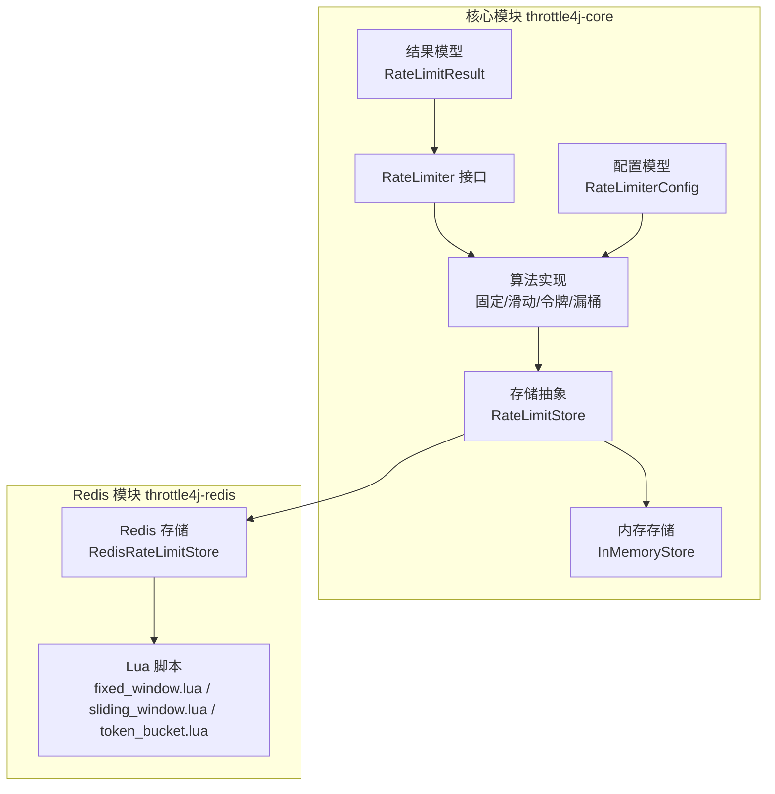
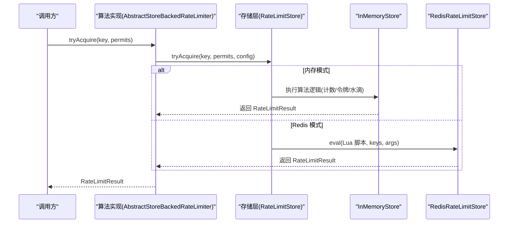
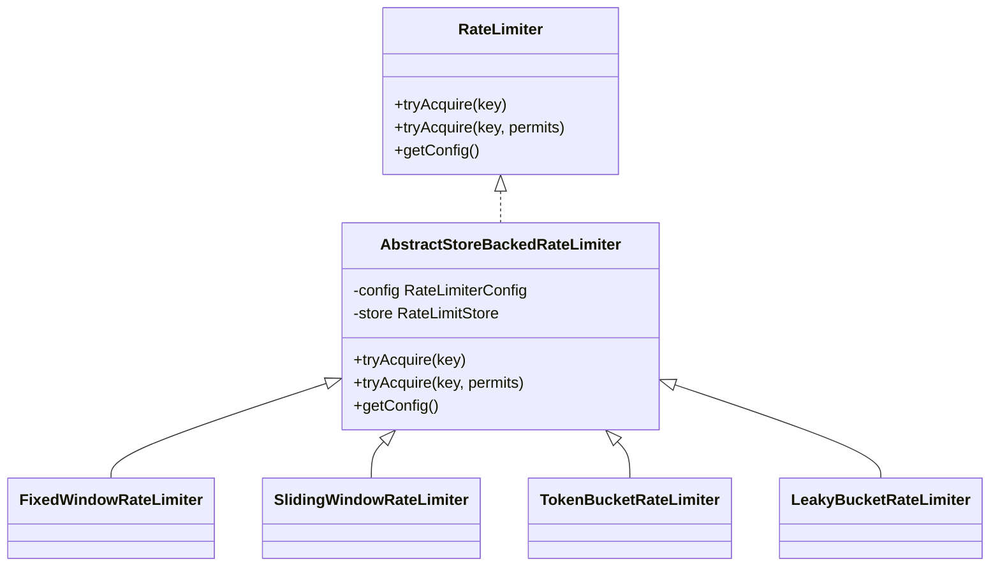
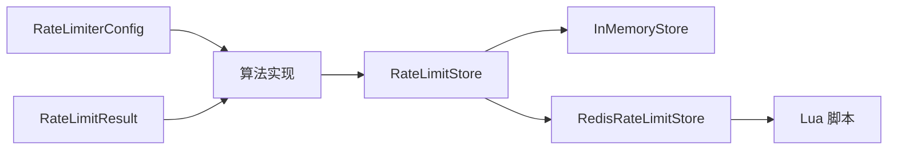
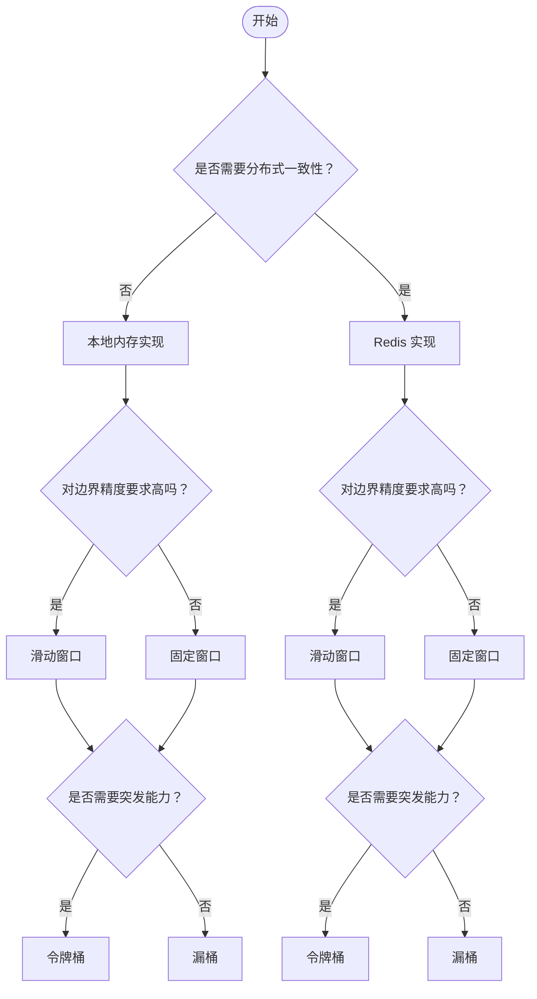

# 算法对比与选择指南

<cite>
**本文引用的文件**
- [FixedWindowRateLimiter.java](file://throttle4j-core/src/main/java/com/throttle4j/algorithm/FixedWindowRateLimiter.java)
- [SlidingWindowRateLimiter.java](file://throttle4j-core/src/main/java/com/throttle4j/algorithm/SlidingWindowRateLimiter.java)
- [TokenBucketRateLimiter.java](file://throttle4j-core/src/main/java/com/throttle4j/algorithm/TokenBucketRateLimiter.java)
- [LeakyBucketRateLimiter.java](file://throttle4j-core/src/main/java/com/throttle4j/algorithm/LeakyBucketRateLimiter.java)
- [AbstractStoreBackedRateLimiter.java](file://throttle4j-core/src/main/java/com/throttle4j/algorithm/AbstractStoreBackedRateLimiter.java)
- [Algorithm.java](file://throttle4j-core/src/main/java/com/throttle4j/core/Algorithm.java)
- [RateLimiterConfig.java](file://throttle4j-core/src/main/java/com/throttle4j/core/RateLimiterConfig.java)
- [RateLimiter.java](file://throttle4j-core/src/main/java/com/throttle4j/core/RateLimiter.java)
- [RateLimitResult.java](file://throttle4j-core/src/main/java/com/throttle4j/core/RateLimitResult.java)
- [InMemoryStore.java](file://throttle4j-core/src/main/java/com/throttle4j/store/InMemoryStore.java)
- [RedisRateLimitStore.java](file://throttle4j-redis/src/main/java/com/throttle4j/redis/RedisRateLimitStore.java)
- [FixedWindowRateLimiterTest.java](file://throttle4j-core/src/test/java/com/throttle4j/algorithm/FixedWindowRateLimiterTest.java)
- [SlidingWindowRateLimiterTest.java](file://throttle4j-core/src/test/java/com/throttle4j/algorithm/SlidingWindowRateLimiterTest.java)
- [TokenBucketRateLimiterTest.java](file://throttle4j-core/src/test/java/com/throttle4j/algorithm/TokenBucketRateLimiterTest.java)
- [LeakyBucketRateLimiterTest.java](file://throttle4j-core/src/test/java/com/throttle4j/algorithm/LeakyBucketRateLimiterTest.java)
</cite>

## 目录
1. [引言](#引言)
2. [项目结构](#项目结构)
3. [核心组件](#核心组件)
4. [架构总览](#架构总览)
5. [详细算法对比分析](#详细算法对比分析)
6. [依赖关系分析](#依赖关系分析)
7. [性能考量与基准测试](#性能考量与基准测试)
8. [故障排查指南](#故障排查指南)
9. [结论](#结论)
10. [附录：算法选择决策树](#附录算法选择决策树)

## 引言
本指南围绕固定窗口、滑动窗口、令牌桶与漏桶四种限流算法进行系统对比，聚焦于精度、吞吐量、内存占用、实现复杂度，并结合仓库中提供的内存与 Redis 分布式实现，给出在不同存储后端下的行为差异与性能表现。同时提供算法选择决策树、配置参数优化建议、最佳实践与常见问题解决方案，帮助开发者在高并发与多业务场景下做出合理选型。

## 项目结构
该仓库采用模块化设计，核心能力集中在 throttle4j-core，分布式能力通过 throttle4j-redis 提供，Spring Boot 集成位于 throttle4j-spring-boot-starter。算法实现统一通过 RateLimiter 接口对外暴露，内部委托给可插拔的存储层（内存或 Redis），以 Lua 原子脚本保障分布式一致性。

图表来源
- [RateLimiter.java:1-32](file://throttle4j-core/src/main/java/com/throttle4j/core/RateLimiter.java#L1-L32)
- [AbstractStoreBackedRateLimiter.java:1-42](file://throttle4j-core/src/main/java/com/throttle4j/algorithm/AbstractStoreBackedRateLimiter.java#L1-L42)
- [InMemoryStore.java:1-315](file://throttle4j-core/src/main/java/com/throttle4j/store/InMemoryStore.java#L1-L315)
- [RedisRateLimitStore.java:1-258](file://throttle4j-redis/src/main/java/com/throttle4j/redis/RedisRateLimitStore.java#L1-L258)

章节来源
- [RateLimiter.java:1-32](file://throttle4j-core/src/main/java/com/throttle4j/core/RateLimiter.java#L1-L32)
- [Algorithm.java:1-16](file://throttle4j-core/src/main/java/com/throttle4j/core/Algorithm.java#L1-L16)
- [RateLimiterConfig.java:1-113](file://throttle4j-core/src/main/java/com/throttle4j/core/RateLimiterConfig.java#L1-L113)
- [RateLimitResult.java:1-68](file://throttle4j-core/src/main/java/com/throttle4j/core/RateLimitResult.java#L1-L68)
- [InMemoryStore.java:1-315](file://throttle4j-core/src/main/java/com/throttle4j/store/InMemoryStore.java#L1-L315)
- [RedisRateLimitStore.java:1-258](file://throttle4j-redis/src/main/java/com/throttle4j/redis/RedisRateLimitStore.java#L1-L258)

## 核心组件
- 算法枚举：定义四种算法类型，作为配置驱动的核心标识。
- 配置模型：封装 limit、windowMillis、refillRate、algorithm 等关键参数，并在构建时进行参数校验。
- 存储接口：统一抽象 tryAcquire 与 reset 行为，内存与 Redis 实现分别提供本地与分布式能力。
- 结果模型：统一返回允许/拒绝状态、剩余配额、重置时间与建议重试间隔。
- 抽象基类：算法实现共享相同的入口逻辑，将状态管理委托给存储层。

章节来源
- [Algorithm.java:1-16](file://throttle4j-core/src/main/java/com/throttle4j/core/Algorithm.java#L1-L16)
- [RateLimiterConfig.java:1-113](file://throttle4j-core/src/main/java/com/throttle4j/core/RateLimiterConfig.java#L1-L113)
- [RateLimiter.java:1-32](file://throttle4j-core/src/main/java/com/throttle4j/core/RateLimiter.java#L1-L32)
- [RateLimitResult.java:1-68](file://throttle4j-core/src/main/java/com/throttle4j/core/RateLimitResult.java#L1-L68)
- [AbstractStoreBackedRateLimiter.java:1-42](file://throttle4j-core/src/main/java/com/throttle4j/algorithm/AbstractStoreBackedRateLimiter.java#L1-L42)

## 架构总览
算法实现通过抽象基类统一调度，最终由存储层执行原子判断与更新。内存实现直接在 JVM 内部维护状态；Redis 实现将算法逻辑下沉到 Lua 脚本，确保单次请求的原子性与跨节点一致性。

图表来源
- [AbstractStoreBackedRateLimiter.java:24-41](file://throttle4j-core/src/main/java/com/throttle4j/algorithm/AbstractStoreBackedRateLimiter.java#L24-L41)
- [InMemoryStore.java:68-93](file://throttle4j-core/src/main/java/com/throttle4j/store/InMemoryStore.java#L68-L93)
- [RedisRateLimitStore.java:80-110](file://throttle4j-redis/src/main/java/com/throttle4j/redis/RedisRateLimitStore.java#L80-L110)

## 详细算法对比分析

### 固定窗口（Fixed Window）
- 工作原理：以固定时间片为单位统计请求数，窗口结束时计数清零。
- 精度：窗口边界存在“双倍突发”风险，即末尾与下一个窗口开头可能叠加超过限制。
- 吞吐量：在窗口内可达到峰值，窗口切换时有明显的突变。
- 内存占用：按 key 维护窗口起始时间与计数，空间常数级。
- 实现复杂度：低，仅需计数与重置逻辑。
- 适用场景：对边界精度要求不高、简单计数即可满足的场景。
- 局限性：窗口切换抖动明显，不适合需要平滑速率的场景。

章节来源
- [FixedWindowRateLimiter.java:1-18](file://throttle4j-core/src/main/java/com/throttle4j/algorithm/FixedWindowRateLimiter.java#L1-L18)
- [InMemoryStore.java:150-170](file://throttle4j-core/src/main/java/com/throttle4j/store/InMemoryStore.java#L150-L170)
- [FixedWindowRateLimiterTest.java:43-65](file://throttle4j-core/src/test/java/com/throttle4j/algorithm/FixedWindowRateLimiterTest.java#L43-L65)

### 滑动窗口（Sliding Window）
- 工作原理：将窗口划分为若干子槽，滚动清理过期槽位，累计有效期内的请求数。
- 精度：显著优于固定窗口，避免边界突变，更贴近真实“每 N 秒”的平均速率。
- 吞吐量：在窗口内平滑分布，无明显切换抖动。
- 内存占用：按 key 维护固定数量的槽位数组，空间与槽位数线性相关。
- 实现复杂度：中等，需维护槽位索引、清理策略与累计求和。
- 适用场景：需要更精细的短期速率控制与平滑突发的场景。
- 局限性：槽位越多内存开销越大；在极端高并发下，槽位更新竞争可能增加。

章节来源
- [SlidingWindowRateLimiter.java:1-16](file://throttle4j-core/src/main/java/com/throttle4j/algorithm/SlidingWindowRateLimiter.java#L1-L16)
- [InMemoryStore.java:172-212](file://throttle4j-core/src/main/java/com/throttle4j/store/InMemoryStore.java#L172-L212)
- [SlidingWindowRateLimiterTest.java:52-63](file://throttle4j-core/src/test/java/com/throttle4j/algorithm/SlidingWindowRateLimiterTest.java#L52-L63)

### 令牌桶（Token Bucket）
- 工作原理：按设定速率生成令牌，请求消耗令牌；无令牌则拒绝或等待。
- 精度：支持突发（桶容量），同时具备稳定的长期速率控制。
- 吞吐量：突发能力强，适合应对短时洪峰；长期保持稳定吞吐。
- 内存占用：按 key 维护当前令牌数与上次填充时间，空间常数级。
- 实现复杂度：中等，需计算 refill 与剩余时间。
- 适用场景：需要突发能力与稳定速率兼顾的场景（如 API 网关、消息队列入口）。
- 局限性：在极高并发下，频繁的时间戳计算与浮点运算可能带来微小开销。

章节来源
- [TokenBucketRateLimiter.java:1-16](file://throttle4j-core/src/main/java/com/throttle4j/algorithm/TokenBucketRateLimiter.java#L1-L16)
- [InMemoryStore.java:214-236](file://throttle4j-core/src/main/java/com/throttle4j/store/InMemoryStore.java#L214-L236)
- [TokenBucketRateLimiterTest.java:43-62](file://throttle4j-core/src/test/java/com/throttle4j/algorithm/TokenBucketRateLimiterTest.java#L43-L62)

### 漏桶（Leaky Bucket）
- 工作原理：以恒定速率出水（消费请求），桶满则丢弃。
- 精度：强制整形输出速率，抑制突发，平滑输入。
- 吞吐量：长期稳定，但突发能力弱；适合严格流量整形。
- 内存占用：按 key 维护当前水位与上次漏水时间，空间常数级。
- 实现复杂度：中等，需计算泄漏量与剩余时间。
- 适用场景：需要严格速率整形、削峰填谷的场景（如下游系统保护）。
- 局限性：无法应对短时突发，可能导致突发请求被持续拒绝。

章节来源
- [LeakyBucketRateLimiter.java:1-16](file://throttle4j-core/src/main/java/com/throttle4j/algorithm/LeakyBucketRateLimiter.java#L1-L16)
- [InMemoryStore.java:238-263](file://throttle4j-core/src/main/java/com/throttle4j/store/InMemoryStore.java#L238-L263)
- [LeakyBucketRateLimiterTest.java:52-61](file://throttle4j-core/src/test/java/com/throttle4j/algorithm/LeakyBucketRateLimiterTest.java#L52-L61)

### 算法类关系图

图表来源
- [RateLimiter.java:1-32](file://throttle4j-core/src/main/java/com/throttle4j/core/RateLimiter.java#L1-L32)
- [AbstractStoreBackedRateLimiter.java:1-42](file://throttle4j-core/src/main/java/com/throttle4j/algorithm/AbstractStoreBackedRateLimiter.java#L1-L42)
- [FixedWindowRateLimiter.java:1-18](file://throttle4j-core/src/main/java/com/throttle4j/algorithm/FixedWindowRateLimiter.java#L1-L18)
- [SlidingWindowRateLimiter.java:1-16](file://throttle4j-core/src/main/java/com/throttle4j/algorithm/SlidingWindowRateLimiter.java#L1-L16)
- [TokenBucketRateLimiter.java:1-16](file://throttle4j-core/src/main/java/com/throttle4j/algorithm/TokenBucketRateLimiter.java#L1-L16)
- [LeakyBucketRateLimiter.java:1-16](file://throttle4j-core/src/main/java/com/throttle4j/algorithm/LeakyBucketRateLimiter.java#L1-L16)

## 依赖关系分析
- 算法实现依赖配置模型与存储接口，通过抽象基类解耦具体算法细节。
- 存储层在内存与 Redis 间切换，不影响上层调用方式。
- Redis 实现将算法逻辑下沉至 Lua，保证原子性与跨节点一致性。

图表来源
- [RateLimiterConfig.java:1-113](file://throttle4j-core/src/main/java/com/throttle4j/core/RateLimiterConfig.java#L1-L113)
- [RateLimitResult.java:1-68](file://throttle4j-core/src/main/java/com/throttle4j/core/RateLimitResult.java#L1-L68)
- [AbstractStoreBackedRateLimiter.java:1-42](file://throttle4j-core/src/main/java/com/throttle4j/algorithm/AbstractStoreBackedRateLimiter.java#L1-L42)
- [InMemoryStore.java:1-315](file://throttle4j-core/src/main/java/com/throttle4j/store/InMemoryStore.java#L1-L315)
- [RedisRateLimitStore.java:1-258](file://throttle4j-redis/src/main/java/com/throttle4j/redis/RedisRateLimitStore.java#L1-L258)

章节来源
- [Algorithm.java:1-16](file://throttle4j-core/src/main/java/com/throttle4j/core/Algorithm.java#L1-L16)
- [RateLimiterConfig.java:1-113](file://throttle4j-core/src/main/java/com/throttle4j/core/RateLimiterConfig.java#L1-L113)
- [InMemoryStore.java:1-315](file://throttle4j-core/src/main/java/com/throttle4j/store/InMemoryStore.java#L1-L315)
- [RedisRateLimitStore.java:1-258](file://throttle4j-redis/src/main/java/com/throttle4j/redis/RedisRateLimitStore.java#L1-L258)

## 性能考量与基准测试

### 存储后端差异
- 内存实现（InMemoryStore）
  - 优点：延迟极低、无网络开销、实现简洁。
  - 缺点：单机状态，无法跨实例共享；内存占用随 key 数增长。
  - 适用：单体应用、本地开发与测试、低延迟优先场景。
- Redis 实现（RedisRateLimitStore + Lua）
  - 优点：分布式一致性强、可跨实例共享状态、扩展性好。
  - 缺点：引入网络 RTT、Lua 脚本加载与执行成本；对 Redis 连接与键命名有要求。
  - 适用：微服务、多实例部署、需要全局限流的场景。

章节来源
- [InMemoryStore.java:1-315](file://throttle4j-core/src/main/java/com/throttle4j/store/InMemoryStore.java#L1-L315)
- [RedisRateLimitStore.java:1-258](file://throttle4j-redis/src/main/java/com/throttle4j/redis/RedisRateLimitStore.java#L1-L258)

### 并发与边界行为验证
- 固定窗口：并发请求不会超过窗口上限，窗口切换后恢复。
- 滑动窗口：并发请求不会超过窗口上限，且无明显切换抖动。
- 令牌桶：支持突发，但长期速率受 refillRate 控制；拒绝时提供 retryAfter。
- 漏桶：严格整形速率，超出桶容量的请求会被拒绝。

章节来源
- [FixedWindowRateLimiterTest.java:85-111](file://throttle4j-core/src/test/java/com/throttle4j/algorithm/FixedWindowRateLimiterTest.java#L85-L111)
- [SlidingWindowRateLimiterTest.java:87-113](file://throttle4j-core/src/test/java/com/throttle4j/algorithm/SlidingWindowRateLimiterTest.java#L87-L113)
- [TokenBucketRateLimiterTest.java:84-113](file://throttle4j-core/src/test/java/com/throttle4j/algorithm/TokenBucketRateLimiterTest.java#L84-L113)
- [LeakyBucketRateLimiterTest.java:83-111](file://throttle4j-core/src/test/java/com/throttle4j/algorithm/LeakyBucketRateLimiterTest.java#L83-L111)

### 性能特性总结
- 精度：滑动窗口 > 令牌桶 ≈ 漏桶 > 固定窗口（窗口边界抖动）。
- 吞吐量：令牌桶/漏桶在长期稳定基础上支持突发；固定/滑动窗口在窗口内可达峰值。
- 内存占用：内存实现均为常数级；滑动窗口的槽位数决定额外内存。
- 实现复杂度：固定窗口最低，滑动窗口中等，令牌/漏桶中高等待时间计算。
- 分布式一致性：内存实现不跨实例共享；Redis 实现通过 Lua 保证原子性。

## 故障排查指南
- 参数校验失败
  - 症状：构建配置时报错，提示 limit/windowMillis/refillRate 不合法。
  - 处理：检查配置是否满足算法要求（令牌桶必须设置正的 refillRate；非令牌桶必须设置正的 windowMillis）。
- 拒绝与重试
  - 症状：请求被拒绝并返回 retryAfter。
  - 处理：客户端应遵循 retryAfter 或使用退避策略；服务端可通过日志定位热点 key。
- 并发越界
  - 症状：并发场景下出现越界。
  - 处理：确认使用了正确的存储后端（Redis 分布式）；检查 key 设计是否分散热点。
- Redis 脚本加载失败
  - 症状：初始化时报 Lua 脚本缺失或为空。
  - 处理：确保资源路径正确、打包包含脚本文件；检查类路径与前缀配置。

章节来源
- [RateLimiterConfig.java:91-110](file://throttle4j-core/src/main/java/com/throttle4j/core/RateLimiterConfig.java#L91-L110)
- [RateLimitResult.java:28-40](file://throttle4j-core/src/main/java/com/throttle4j/core/RateLimitResult.java#L28-L40)
- [RedisRateLimitStore.java:226-251](file://throttle4j-redis/src/main/java/com/throttle4j/redis/RedisRateLimitStore.java#L226-L251)

## 结论
- 若追求极致简单与低延迟且无需跨实例共享：优先固定窗口或内存令牌桶。
- 若需要更平滑的短期控制与较低的边界抖动：优先滑动窗口。
- 若需要突发能力与稳定长期速率：优先令牌桶。
- 若需要严格的流量整形与削峰填谷：优先漏桶。
- 在分布式场景下，务必使用 Redis 存储以获得强一致与跨实例共享。

## 附录：算法选择决策树

[本图为概念流程图，不直接映射具体源码文件，故不提供图表来源]